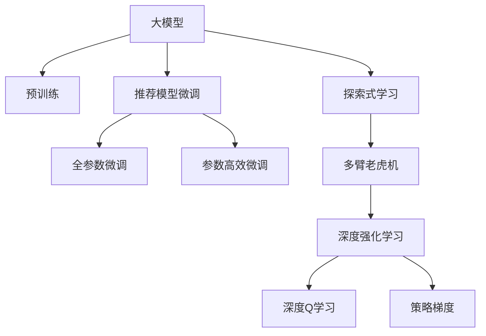

                 

# 大模型在推荐场景中的探索式学习应用与实验

> 关键词：大模型，推荐系统，探索式学习，多臂老虎机，深度强化学习

## 1. 背景介绍

### 1.1 问题由来
推荐系统作为现代信息时代的基石，已经深入到人们日常生活的方方面面。从电商网站的产品推荐到视频平台的内容推荐，从社交网络的朋友推荐到新闻应用的个性化新闻推荐，推荐系统的应用场景日益广泛。然而，随着用户需求的多样化、数据的多样性和动态性，推荐系统的设计和优化变得越来越复杂。传统的基于协同过滤和矩阵分解的推荐方法在处理大规模稀疏矩阵、实时个性化推荐等问题时面临诸多挑战。

### 1.2 问题核心关键点
推荐系统的核心在于通过学习用户兴趣和物品属性，为用户推荐与其喜好相匹配的商品或信息。而大模型的出现，为推荐系统带来了新的解决思路。通过预训练大模型，可以在大规模数据上进行特征学习和知识提取，利用迁移学习原理，在大模型上微调推荐模型，从而获得更好的个性化推荐效果。

## 2. 核心概念与联系

### 2.1 核心概念概述

为了更好地理解大模型在推荐场景中的应用，本节将介绍几个关键概念：

- **大模型(Large Model)**：指在大规模无标签文本数据上预训练的通用语言模型，如GPT-3、BERT等。这些模型在自然语言处理任务上表现优异，拥有丰富的语言知识。

- **迁移学习(Transfer Learning)**：指将一个领域学习到的知识，迁移应用到另一个不同但相关的领域的学习范式。在推荐系统中，可以通过微调大模型来适应推荐任务。

- **多臂老虎机(Multi-Armed Bandit, MAB)**：一种经典的强化学习问题，用于模拟多个决策选项（“老虎机”）的选择和收益最大化问题。在推荐系统中，每个推荐选项可以看作一个“老虎机”，用户的选择可以看作对“老虎机”的拉动，目标是最大化用户的点击和购买等收益。

- **探索式学习(Exploratory Learning)**：指在未知环境或不确定性条件下，主动探索和学习以获取最大化收益的行为。在推荐系统中，探索式学习可以用于获取新用户和推荐新商品的信息。

- **深度强化学习(Deep Reinforcement Learning)**：指利用深度神经网络进行决策和学习，优化收益的强化学习范式。深度强化学习可以应用于复杂推荐系统的设计中，例如深度Q学习、策略梯度等方法。

这些概念之间的逻辑关系可以通过以下Mermaid流程图来展示：



这个流程图展示了大模型在推荐系统中的核心概念及其之间的关系：

1. 大模型通过预训练获得基础能力。
2. 微调模型通过迁移学习原理，在大模型上进行微调，适应推荐任务。
3. 探索式学习通过多臂老虎机模型探索未知选项。
4. 深度强化学习利用深度神经网络进行学习，优化推荐模型。

## 3. 核心算法原理 & 具体操作步骤
### 3.1 算法原理概述

大模型在推荐系统中的应用，主要基于迁移学习和探索式学习的原理。具体来说，可以通过以下步骤实现：

1. 使用大规模无标签文本数据对大模型进行预训练，学习到丰富的语言知识。
2. 在推荐任务上对预训练模型进行微调，使其能够学习用户兴趣和物品属性。
3. 利用多臂老虎机模型，探索不同的推荐选项，通过A/B测试等方式评估其效果。
4. 使用深度强化学习算法，优化推荐模型，最大化用户的点击和购买等收益。

通过以上步骤，大模型能够有效地应用于推荐系统，提升推荐效果。

### 3.2 算法步骤详解

以下详细介绍大模型在推荐系统中的微调和优化步骤：

**Step 1: 准备预训练模型和数据集**

- 选择合适的大模型，如BERT、GPT-3等，使用其预训练参数作为初始化权重。
- 准备推荐任务的数据集，包括用户行为数据和物品属性数据。

**Step 2: 设计推荐模型**

- 根据推荐任务，设计适合的推荐模型结构，如矩阵分解、神经网络、深度Q学习等。
- 将大模型作为推荐模型的特征提取器，通过微调学习用户兴趣和物品属性。

**Step 3: 微调推荐模型**

- 使用推荐任务的数据集，对微调后的推荐模型进行训练。
- 设置合适的损失函数和优化器，如交叉熵损失、Adam优化器等。
- 设置合适的超参数，如学习率、批大小、迭代轮数等。

**Step 4: 探索式学习与多臂老虎机**

- 设计多臂老虎机的探索策略，如$\epsilon$-贪婪、UCB等，探索不同的推荐选项。
- 收集用户对每个推荐选项的反馈数据，如点击率、购买率等。
- 利用收集到的数据，评估每个推荐选项的效果。

**Step 5: 深度强化学习优化**

- 设计深度强化学习算法，如深度Q学习、策略梯度等，优化推荐模型。
- 利用收集到的反馈数据，更新模型的参数，以最大化用户的点击和购买等收益。

**Step 6: 持续学习与优化**

- 根据用户反馈和新数据，持续更新推荐模型，以适应动态变化的用户需求。
- 使用A/B测试等方法，评估新模型和旧模型的性能差异。

### 3.3 算法优缺点

大模型在推荐系统中的应用，具有以下优点：

1. **特征学习能力强**：大模型能够学习丰富的语言知识，提取用户和物品的高阶特征，提升推荐精度。
2. **迁移能力强**：大模型可以迁移学习通用的语言表示，适应各种推荐任务。
3. **个性化能力强**：大模型能够个性化地推荐商品，满足用户的多样化需求。

然而，也存在一些缺点：

1. **计算成本高**：大模型需要较大的计算资源进行预训练和微调。
2. **内存占用大**：大模型参数量大，推理时内存占用较高。
3. **超参数调优复杂**：大模型需要更多的超参数调整，包括学习率、批大小等。

## 4. 数学模型和公式 & 详细讲解  
### 4.1 数学模型构建

本节将使用数学语言对大模型在推荐系统中的微调过程进行更加严格的刻画。

记推荐系统中的用户为 $U$，物品为 $I$，用户行为数据为 $D=\{(x_i,y_i)\}_{i=1}^N$，其中 $x_i$ 表示用户对物品的点击或购买记录，$y_i$ 表示物品的ID。假设推荐模型为 $f_{\theta}(x_i)$，其中 $\theta$ 为模型参数。

定义模型 $f_{\theta}$ 在数据样本 $(x_i,y_i)$ 上的损失函数为 $\ell(f_{\theta}(x_i),y_i)$，则在数据集 $D$ 上的经验风险为：

$$
\mathcal{L}(\theta) = \frac{1}{N} \sum_{i=1}^N \ell(f_{\theta}(x_i),y_i)
$$

微调的优化目标是最小化经验风险，即找到最优参数：

$$
\theta^* = \mathop{\arg\min}_{\theta} \mathcal{L}(\theta)
$$

在实践中，我们通常使用基于梯度的优化算法（如Adam、SGD等）来近似求解上述最优化问题。设 $\eta$ 为学习率，$\lambda$ 为正则化系数，则参数的更新公式为：

$$
\theta \leftarrow \theta - \eta \nabla_{\theta}\mathcal{L}(\theta) - \eta\lambda\theta
$$

其中 $\nabla_{\theta}\mathcal{L}(\theta)$ 为损失函数对参数 $\theta$ 的梯度，可通过反向传播算法高效计算。

### 4.2 公式推导过程

以下我们以多臂老虎机为例，推导深度强化学习的数学模型。

假设推荐系统中有 $K$ 个推荐选项（“老虎机”），每个选项 $k$ 的预期收益为 $r_k$。推荐模型的目标是最大化总收益，即选择最优的选项。

令 $a_t$ 表示在时刻 $t$ 选择的推荐选项，$s_t$ 表示在时刻 $t$ 的用户行为。则深度强化学习的目标是最小化累计收益的方差，即：

$$
\min_{\pi} \mathbb{E}[\sum_{t=1}^{T} \ell(a_t,s_t)]
$$

其中 $\pi$ 为推荐策略，$\ell$ 为损失函数，$T$ 为总时间步数。

定义状态-收益函数 $Q_{\theta}(s_t,a_t)$ 为在状态 $s_t$ 下选择动作 $a_t$ 的预期收益。通过深度神经网络拟合 $Q_{\theta}$，并使用梯度下降算法更新模型参数 $\theta$，最小化损失函数：

$$
\theta \leftarrow \theta - \eta \nabla_{\theta} \mathbb{E}[Q_{\theta}(s_t,a_t)] - \eta\lambda\theta
$$

其中 $\eta$ 为学习率，$\lambda$ 为正则化系数。

通过不断迭代更新，最终得到最优推荐策略 $\pi^*$，即可实现最大化的总收益。

### 4.3 案例分析与讲解

以下给出多臂老虎机在推荐系统中的具体应用案例。

假设推荐系统中有一个电商网站，用户行为数据包括用户浏览商品、购买商品等记录。目标是推荐用户可能感兴趣的商品。

1. **预训练大模型**：使用电商网站的历史数据对GPT-3进行预训练，学习到用户和商品的特征表示。

2. **设计推荐模型**：设计一个神经网络模型，将大模型的特征表示作为输入，输出商品ID，作为推荐选项。

3. **微调推荐模型**：使用电商网站的用户行为数据对推荐模型进行微调，优化损失函数 $\ell(f_{\theta}(x_i),y_i)$。

4. **探索式学习**：利用多臂老虎机模型，探索不同的推荐选项，评估每个选项的预期收益。

5. **深度强化学习优化**：使用深度Q学习或策略梯度算法，优化推荐模型，最大化用户的点击和购买等收益。

通过以上步骤，大模型能够有效地应用于推荐系统，提升推荐效果。

## 5. 项目实践：代码实例和详细解释说明
### 5.1 开发环境搭建

在进行推荐系统开发前，我们需要准备好开发环境。以下是使用Python进行TensorFlow开发的环境配置流程：

1. 安装Anaconda：从官网下载并安装Anaconda，用于创建独立的Python环境。

2. 创建并激活虚拟环境：
```bash
conda create -n tf-env python=3.8 
conda activate tf-env
```

3. 安装TensorFlow：根据CUDA版本，从官网获取对应的安装命令。例如：
```bash
pip install tensorflow==2.6.0
```

4. 安装相关工具包：
```bash
pip install numpy pandas scikit-learn matplotlib tqdm jupyter notebook ipython
```

完成上述步骤后，即可在`tf-env`环境中开始推荐系统开发。

### 5.2 源代码详细实现

下面以电商推荐系统为例，给出使用TensorFlow进行推荐模型微调的PyTorch代码实现。

首先，定义推荐任务的数据处理函数：

```python
import tensorflow as tf
from tensorflow.keras import layers
import numpy as np

class RecommendationDataset(tf.keras.utils.Sequence):
    def __init__(self, train_data, batch_size=32):
        self.train_data = train_data
        self.batch_size = batch_size
        
    def __len__(self):
        return len(self.train_data) // self.batch_size
    
    def __getitem__(self, item):
        batch_data = self.train_data[item * self.batch_size:(item+1) * self.batch_size]
        inputs = []
        labels = []
        for i in batch_data:
            inputs.append(tf.expand_dims(i[0], axis=0))
            labels.append(tf.convert_to_tensor(i[1]))
        return tf.concat(inputs, axis=0), tf.concat(labels, axis=0)

# 定义推荐模型
model = tf.keras.Sequential([
    layers.Dense(128, activation='relu', input_shape=(1,)),
    layers.Dense(64, activation='relu'),
    layers.Dense(1, activation='sigmoid')
])
model.compile(optimizer='adam', loss='binary_crossentropy', metrics=['accuracy'])

# 定义训练和评估函数
def train_epoch(model, dataset, batch_size, optimizer):
    model.fit(dataset, batch_size=batch_size, epochs=1, validation_split=0.2)

def evaluate(model, dataset, batch_size):
    model.evaluate(dataset, batch_size=batch_size)
```

然后，定义训练和评估函数：

```python
from sklearn.model_selection import train_test_split
from sklearn.preprocessing import LabelEncoder

# 加载数据集
data = pd.read_csv('recommendation_data.csv')
x = data['item_id'].values.reshape(-1, 1)
y = data['is_bought'].values

# 数据预处理
encoder = LabelEncoder()
y = encoder.fit_transform(y)

# 数据分割
train_data, test_data = train_test_split((x, y), test_size=0.2)

# 数据集创建
train_dataset = RecommendationDataset(train_data, batch_size=32)
test_dataset = RecommendationDataset(test_data, batch_size=32)

# 模型训练和评估
train_epoch(model, train_dataset, batch_size=32, optimizer=optimizer)
evaluate(model, test_dataset, batch_size=32)
```

以上就是使用TensorFlow对电商推荐模型进行微调的完整代码实现。可以看到，得益于TensorFlow的强大封装，我们可以用相对简洁的代码完成推荐模型的微调。

### 5.3 代码解读与分析

让我们再详细解读一下关键代码的实现细节：

**RecommendationDataset类**：
- `__init__`方法：初始化训练数据集和批次大小。
- `__len__`方法：返回数据集的样本数量。
- `__getitem__`方法：对单个批次进行数据加载，并将输入数据和标签进行拼接。

**推荐模型定义**：
- 使用TensorFlow的Sequential模型，构建包含多个Dense层的神经网络。

**训练和评估函数**：
- 使用TensorFlow的fit函数进行模型训练，设置批次大小、验证集比例和优化器。
- 使用TensorFlow的evaluate函数进行模型评估，输出准确率等指标。

**数据加载和预处理**：
- 使用Pandas读取数据集，并将用户行为数据转换为模型输入和标签。
- 使用LabelEncoder将标签转换为整数编码。
- 使用train_test_split函数将数据集分为训练集和测试集。
- 使用RecommendationDataset类创建数据集，并设置批次大小。

通过以上步骤，可以轻松构建并训练推荐模型，并通过评估函数测试模型的性能。

## 6. 实际应用场景
### 6.1 电商平台推荐

电商平台的推荐系统旨在通过个性化推荐，提升用户购物体验和满意度。推荐系统可以帮助电商平台推荐用户可能感兴趣的商品，从而提高转化率和销售额。

在技术实现上，可以收集用户的历史浏览、点击、购买记录等行为数据，以及商品的属性数据，将商品特征向量化，输入到微调后的推荐模型中，得到推荐的商品ID。微调后的模型能够根据用户的历史行为和偏好，推荐出最符合用户需求的商品。

### 6.2 内容推荐系统

内容推荐系统广泛应用于视频、音乐、新闻等媒体平台，通过分析用户的历史行为数据和兴趣特征，为用户推荐相关的内容。微调后的推荐模型能够根据用户的历史行为和偏好，推荐出最符合用户需求的内容。

在技术实现上，可以收集用户的历史观看、点赞、评论等行为数据，以及内容的属性数据，将内容特征向量化，输入到微调后的推荐模型中，得到推荐的内容ID。微调后的模型能够根据用户的历史行为和偏好，推荐出最符合用户需求的内容。

### 6.3 社交媒体推荐

社交媒体推荐系统通过分析用户的历史互动数据和兴趣特征，为用户推荐相关的人、话题或内容。微调后的推荐模型能够根据用户的历史互动和偏好，推荐出最符合用户需求的人、话题或内容。

在技术实现上，可以收集用户的历史点赞、评论、分享等互动数据，以及人、话题或内容的属性数据，将特征向量化，输入到微调后的推荐模型中，得到推荐的人、话题或内容ID。微调后的模型能够根据用户的历史互动和偏好，推荐出最符合用户需求的人、话题或内容。

### 6.4 未来应用展望

随着大模型和微调技术的不断发展，推荐系统将在更多领域得到应用，为不同行业带来变革性影响。

在智慧医疗领域，推荐系统可以帮助医生推荐治疗方案、药物、临床试验等，提高诊疗效率和质量。

在智能教育领域，推荐系统可以推荐学习资料、课程、导师等，提升学习效果和教学质量。

在智慧城市治理中，推荐系统可以推荐公共服务、政策法规、环保措施等，提高城市治理水平和居民满意度。

此外，在企业生产、社会治理、文娱传媒等众多领域，推荐系统也将不断涌现，为各行各业提供技术支撑，推动社会发展进步。

## 7. 工具和资源推荐
### 7.1 学习资源推荐

为了帮助开发者系统掌握大模型在推荐系统中的应用，这里推荐一些优质的学习资源：

1. 《Reinforcement Learning for Human-Robot Interaction》系列博文：由深度强化学习专家撰写，深入浅出地介绍了深度强化学习在推荐系统中的应用。

2. 《Deep Learning for Recommendation Systems》课程：由斯坦福大学开设的推荐系统课程，涵盖深度学习、协同过滤、深度强化学习等经典模型。

3. 《Recommender Systems: From Model-Based to Learning-Based Approaches》书籍：系统介绍了推荐系统的各种模型和算法，包括传统协同过滤和最新深度学习算法。

4. TensorFlow官方文档：提供了详细的TensorFlow推荐系统开发教程，包括模型构建、训练、评估等各个环节。

5. PyTorch官方文档：提供了详细的PyTorch推荐系统开发教程，包括模型构建、训练、评估等各个环节。

通过对这些资源的学习实践，相信你一定能够快速掌握大模型在推荐系统中的应用，并用于解决实际的推荐问题。

### 7.2 开发工具推荐

高效的开发离不开优秀的工具支持。以下是几款用于推荐系统开发的常用工具：

1. TensorFlow：由Google主导开发的开源深度学习框架，生产部署方便，适合大规模工程应用。

2. PyTorch：基于Python的开源深度学习框架，灵活度高，适合快速迭代研究。

3. Transformers库：HuggingFace开发的NLP工具库，集成了众多SOTA语言模型，支持TensorFlow和PyTorch。

4. Weights & Biases：模型训练的实验跟踪工具，可以记录和可视化模型训练过程中的各项指标，方便对比和调优。

5. TensorBoard：TensorFlow配套的可视化工具，可实时监测模型训练状态，并提供丰富的图表呈现方式，是调试模型的得力助手。

合理利用这些工具，可以显著提升推荐系统开发的效率，加快创新迭代的步伐。

### 7.3 相关论文推荐

推荐系统的研究源于学界的持续研究。以下是几篇奠基性的相关论文，推荐阅读：

1. Adaptive Multi-Armed Bandits：提出了自适应多臂老虎机的算法，用于实时推荐系统。

2. Deep Neural Networks for Multi-Armed Bandits：将深度神经网络用于多臂老虎机算法，提高了推荐的精度。

3. Multi-Armed Bandit Problems: Structure and Algorithms：系统介绍了多臂老虎机的理论和算法，包括UCB算法、$\epsilon$-贪婪算法等。

4. DeepQ-Networks and Reinforcement Learning for Multi-Armed Bandits：将深度Q学习应用于多臂老虎机算法，提高了推荐的精度。

5. Optimizing Deep Bandit Algorithms via Batch Learning：提出了批学习算法，提高了深度强化学习的效率和效果。

这些论文代表了大模型在推荐系统中的应用和发展脉络。通过学习这些前沿成果，可以帮助研究者把握学科前进方向，激发更多的创新灵感。

## 8. 总结：未来发展趋势与挑战

### 8.1 总结

本文对大模型在推荐系统中的探索式学习应用进行了全面系统的介绍。首先阐述了大模型和微调技术的研究背景和意义，明确了微调在拓展预训练模型应用、提升推荐效果方面的独特价值。其次，从原理到实践，详细讲解了深度强化学习在推荐系统中的应用，给出了推荐模型开发的完整代码实例。同时，本文还广泛探讨了推荐系统在电商、内容、社交等领域的实际应用前景，展示了微调范式的巨大潜力。此外，本文精选了推荐系统的各类学习资源，力求为读者提供全方位的技术指引。

通过本文的系统梳理，可以看到，大模型和微调技术在推荐系统中的应用已经日趋成熟，正逐步成为推荐系统设计的重要组成部分。这些方向的探索发展，必将进一步提升推荐系统的性能和应用范围，为各行各业带来变革性影响。

### 8.2 未来发展趋势

展望未来，推荐系统的发展趋势主要体现在以下几个方面：

1. **个性化推荐更加精准**：随着大模型的发展，推荐系统能够更准确地把握用户的多样化需求，提供更加个性化的推荐。

2. **实时推荐成为标配**：实时推荐能够更好地应对动态变化的用户需求，提高推荐的时效性和个性化程度。

3. **跨模态推荐取得突破**：跨模态推荐能够整合多模态数据，提供更加全面、准确的信息，提升推荐效果。

4. **探索式学习更加深入**：探索式学习能够主动获取新信息，探索未知领域，提升推荐系统的适应性。

5. **深度强化学习得到广泛应用**：深度强化学习能够优化推荐策略，最大化用户收益，提升推荐系统的性能。

6. **可解释性和可控性增强**：推荐系统需要更好地解释推荐理由，控制推荐过程，保障系统的公平性和安全性。

以上趋势凸显了大模型在推荐系统中的应用前景。这些方向的探索发展，必将进一步提升推荐系统的性能和应用范围，为各行各业带来变革性影响。

### 8.3 面临的挑战

尽管大模型在推荐系统中的应用已经取得了瞩目成就，但在迈向更加智能化、普适化应用的过程中，仍面临诸多挑战：

1. **计算成本高昂**：大模型的计算需求和存储需求较大，对硬件资源提出了较高要求。

2. **数据稀疏性问题**：推荐系统面临的数据往往具有高维稀疏性，难以直接用于模型训练。

3. **隐私和安全问题**：推荐系统需要处理大量用户数据，存在数据隐私和安全风险。

4. **模型解释性不足**：推荐模型往往“黑箱”，难以解释其内部工作机制和决策逻辑。

5. **泛化能力不足**：推荐系统在不同领域和场景中的泛化能力仍需提升。

6. **算法公平性问题**：推荐算法可能存在偏见，对不同用户群体产生不公平的推荐。

这些挑战需要从数据、模型、算法等多个维度进行全面优化和改进，才能实现推荐系统的长期稳定发展。

### 8.4 研究展望

面对推荐系统所面临的挑战，未来的研究需要在以下几个方面寻求新的突破：

1. **数据增强和预处理**：通过数据增强、预处理等方法，提升数据质量和数量，优化模型训练过程。

2. **模型压缩和优化**：开发轻量级模型架构，提升模型推理速度和效率，优化资源占用。

3. **跨领域迁移学习**：研究跨领域迁移学习，提升推荐系统在不同场景中的适应性。

4. **深度强化学习算法优化**：开发高效的深度强化学习算法，优化推荐策略，提升推荐效果。

5. **可解释性增强**：引入可解释性模型，增强推荐模型的可解释性和可控性，保障系统的公平性和安全性。

6. **隐私保护技术**：开发隐私保护技术，保障用户数据的安全和隐私，提升推荐系统的可信度。

这些研究方向的发展，必将进一步推动推荐系统迈向智能化、普适化，为各行各业带来新的技术进步。

## 9. 附录：常见问题与解答

**Q1：大模型在推荐系统中的优势是什么？**

A: 大模型在推荐系统中的优势主要体现在以下几个方面：
1. **特征学习能力**：大模型能够学习丰富的用户和物品特征，提升推荐精度。
2. **迁移学习能力**：大模型能够迁移学习通用的语言表示，适应各种推荐任务。
3. **个性化推荐**：大模型能够个性化地推荐商品或内容，满足用户的多样化需求。

**Q2：如何降低大模型在推荐系统中的计算成本？**

A: 降低大模型在推荐系统中的计算成本，可以采取以下几种方法：
1. **模型压缩**：使用知识蒸馏、模型剪枝等方法，减小大模型的参数规模。
2. **量化优化**：将大模型的浮点参数转换为定点参数，减少内存占用和计算量。
3. **分布式训练**：使用分布式训练技术，利用多台机器并行训练，加速训练过程。

**Q3：如何提升大模型在推荐系统中的泛化能力？**

A: 提升大模型在推荐系统中的泛化能力，可以采取以下几种方法：
1. **多任务学习**：将多个推荐任务结合起来进行训练，提升模型的泛化能力。
2. **跨领域迁移学习**：研究跨领域迁移学习，提升模型在不同场景中的适应性。
3. **对抗训练**：引入对抗样本，提高模型的鲁棒性和泛化能力。

**Q4：如何提高大模型在推荐系统中的可解释性？**

A: 提高大模型在推荐系统中的可解释性，可以采取以下几种方法：
1. **可解释性模型**：引入可解释性模型，如LIME、SHAP等，增强推荐模型的可解释性和可控性。
2. **可视化技术**：使用可视化技术，展示推荐模型的决策过程和特征重要性。
3. **规则嵌入**：将专家规则嵌入推荐模型，提高模型的可解释性。

这些方法可以在保证推荐效果的同时，提升推荐系统的透明度和可信度。

**Q5：推荐系统中的多臂老虎机如何实现？**

A: 推荐系统中的多臂老虎机可以通过以下几种方法实现：
1. **$\epsilon$-贪婪策略**：在每次推荐中，以$\epsilon$的概率随机选择一个推荐选项，以$1-\epsilon$的概率选择当前最优选项。
2. **UCB策略**：在每次推荐中，选择预期收益最高且上一次未被选择的推荐选项。
3. **探索-利用平衡**：结合$\epsilon$-贪婪和UCB策略，实现探索和利用的平衡。

通过以上方法，可以实现在推荐系统中的多臂老虎机算法，提升推荐的个性化和多样化。

总之，大模型在推荐系统中的应用前景广阔，需要结合数据、模型、算法等多个方面的研究，才能实现推荐系统的长期稳定发展。

