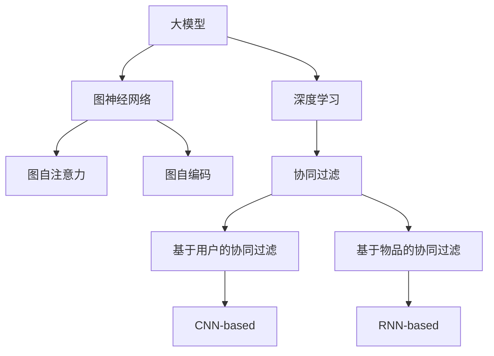

                 

# 大模型在推荐系统中的图自注意力应用

> 关键词：大模型,推荐系统,图自注意力,深度学习,协同过滤,图神经网络,Attention,图自编码,特征增强,稀疏矩阵

## 1. 背景介绍

随着电商、社交媒体等网络平台的蓬勃发展，推荐系统成为提升用户体验、增加用户粘性和销售额的重要工具。传统的协同过滤方法在处理大规模稀疏数据时面临计算复杂度高、冷启动问题严重等挑战。为了克服这些问题，深度学习技术被引入推荐系统，极大地提升了模型的预测精度和泛化能力。

近年来，深度学习与图神经网络(Graph Neural Networks, GNNs)的结合成为推荐系统中的热门研究话题。图自注意力机制作为图神经网络中的关键组件，通过节点之间的信息传递和交互，实现了节点特征的融合和增强，进一步提高了模型性能。本文将从大模型在推荐系统中的应用入手，详细介绍图自注意力机制的原理和应用，并给出具体的代码实现和实际应用示例。

## 2. 核心概念与联系

### 2.1 核心概念概述

为了更好地理解图自注意力机制在大模型推荐系统中的应用，本节将介绍几个关键概念及其相互联系。

- 大模型：以深度神经网络为代表的大规模预训练模型。在大规模无标签数据上预训练，学习到丰富的语言、视觉、音频等特征表示，具备强大的特征表示能力。
- 图神经网络：用于处理图结构数据的深度学习模型。通过节点之间信息的传递和融合，能够从图结构中提取有价值的信息，适用于许多现实场景中的网络数据。
- 协同过滤：一种传统的推荐算法，通过分析用户和物品之间的相似度，进行推荐决策。分为基于用户的协同过滤和基于物品的协同过滤两种。
- 深度学习：一种基于神经网络的机器学习方法，通过多层神经元模拟人脑神经网络的信息处理过程，能够学习到高层次的抽象特征。
- 图自注意力：一种图神经网络中的关键技术，通过节点间的信息交互，实现节点特征的融合和增强，能够捕捉图结构的局部和全局信息。
- 图自编码：一种图神经网络的基本架构，通过编码器和解码器对图结构进行特征提取和重构，是图神经网络的基础。

这些核心概念之间的逻辑关系可以通过以下Mermaid流程图来展示：



这个流程图展示了大模型、图神经网络、图自注意力、图自编码、协同过滤等概念之间的联系：

1. 大模型通过深度学习获取大规模数据的特征表示。
2. 图神经网络利用节点间的交互，提取图结构的信息。
3. 图自注意力机制通过节点间的信息传递，实现节点特征的融合和增强。
4. 图自编码机制用于对图结构进行特征提取和重构。
5. 协同过滤算法通过用户或物品之间的相似度进行推荐决策。

这些概念共同构成了推荐系统中深度学习和图神经网络的基础，使得大模型能够在推荐系统中发挥更大的作用。

## 3. 核心算法原理 & 具体操作步骤
### 3.1 算法原理概述

图自注意力机制在推荐系统中的应用，主要体现在用户-物品交互图中。用户与物品之间的交互关系通过图的邻接矩阵$A$表示，其中$A_{ui}=1$表示用户$u$与物品$i$之间有交互，$A_{ui}=0$表示无交互。用户$i$的特征向量表示为$h_i$，物品$i$的特征向量表示为$l_i$。图自注意力机制通过节点之间的信息交互，将用户的特征向量$h_u$和物品的特征向量$l_i$融合，得到最终的预测值$y_u$。

图自注意力机制的核心思想是通过节点之间的自注意力机制，捕捉节点之间的局部和全局信息。具体来说，对于用户$u$，其对物品$i$的注意力权重$\alpha_{ui}$，可以通过下式计算：

$$
\alpha_{ui} = \frac{e^{\text{Att}(h_u, l_i)}}{\sum_{j=1}^{N}\exp(\text{Att}(h_u, l_j))}
$$

其中$\text{Att}$函数为自注意力函数，$N$为图中节点数。注意力权重$\alpha_{ui}$越大，表示用户$u$对物品$i$的关注度越高。将注意力权重和物品特征向量$l_i$相乘，得到加权后的物品特征向量$z_i$，再将$z_i$和用户特征向量$h_u$相加，得到最终预测值$y_u$：

$$
y_u = h_u + \sum_{i=1}^{N} \alpha_{ui} z_i
$$

通过图自注意力机制，模型能够捕捉用户与物品之间的多层次交互信息，提升推荐决策的准确性和多样性。

### 3.2 算法步骤详解

图自注意力在推荐系统中的应用步骤主要包括：

**Step 1: 构建用户-物品交互图**
- 收集用户和物品之间的交互数据，构建邻接矩阵$A$。
- 定义用户和物品的特征表示，分别为$h_u$和$l_i$。

**Step 2: 计算注意力权重**
- 通过自注意力函数$\text{Att}$计算用户$u$对物品$i$的注意力权重$\alpha_{ui}$。
- 将所有注意力权重$\alpha_{ui}$求和，计算归一化权重$\beta_{ui} = \frac{\alpha_{ui}}{\sum_{j=1}^{N}\alpha_{uj}}$。

**Step 3: 计算加权物品特征向量**
- 通过归一化权重$\beta_{ui}$和物品特征向量$l_i$相乘，得到加权后的物品特征向量$z_i$。

**Step 4: 预测用户评分**
- 将用户特征向量$h_u$和加权后的物品特征向量$z_i$相加，得到最终预测值$y_u$。
- 根据$y_u$与实际评分进行对比，计算损失函数并反向传播更新模型参数。

**Step 5: 重复迭代直至收敛**
- 重复执行Step 2到Step 4，直至损失函数收敛或达到预设的迭代次数。

### 3.3 算法优缺点

图自注意力在推荐系统中的应用具有以下优点：
1. 高效特征融合：通过节点之间的信息交互，实现节点特征的融合和增强，提升了模型特征表示能力。
2. 局部与全局信息捕捉：能够捕捉图结构的局部和全局信息，提升模型的泛化能力和预测精度。
3. 可解释性强：通过注意力权重可视化，能够直观地理解用户对物品的关注点，增强模型的可解释性。
4. 鲁棒性强：自注意力机制具有较强的鲁棒性，能够抵抗图结构中的噪声和异常值。

同时，图自注意力机制也存在一些局限性：
1. 计算复杂度高：在大规模图数据上，自注意力机制的计算复杂度较高，需要较大的计算资源。
2. 需要大量的标注数据：图自注意力机制需要用户-物品的交互数据，这些数据的收集成本较高。
3. 依赖于图结构：图自注意力机制依赖于图结构的质量和完整性，若图结构质量较差，可能会影响模型性能。
4. 局部信息可能被抑制：自注意力机制可能忽视局部信息，尤其是在图结构复杂的情况下。

尽管存在这些局限性，但图自注意力机制仍是大模型在推荐系统中应用的重要组成部分。未来研究的方向在于如何降低计算复杂度、提高数据利用效率、提升局部信息捕捉能力等。

### 3.4 算法应用领域

图自注意力机制在大模型推荐系统中有着广泛的应用，主要体现在以下几个领域：

- 电商推荐：通过分析用户行为数据，构建用户-物品交互图，预测用户对商品的评分和购买概率。
- 社交媒体推荐：分析用户与内容之间的交互，推荐用户可能感兴趣的内容，如文章、视频等。
- 音乐推荐：构建用户-音乐交互图，根据用户历史听歌行为推荐新歌。
- 视频推荐：分析用户对视频的观看行为，推荐用户可能喜欢的视频。
- 新闻推荐：分析用户对新闻的阅读行为，推荐相关新闻。

这些领域中，图自注意力机制能够利用用户和物品之间的交互信息，实现个性化推荐，提升用户体验。

## 4. 数学模型和公式 & 详细讲解 & 举例说明

### 4.1 数学模型构建

假设用户$u$和物品$i$之间的交互数据为$A$，用户和物品的特征表示分别为$h_u$和$l_i$。图自注意力机制的目标是通过邻接矩阵$A$和特征表示$h_u$、$l_i$，预测用户$u$对物品$i$的评分$y_u$。

图自注意力的数学模型可以表示为：

$$
y_u = h_u + \sum_{i=1}^{N} \alpha_{ui} z_i
$$

其中，注意力权重$\alpha_{ui}$的计算公式为：

$$
\alpha_{ui} = \frac{e^{\text{Att}(h_u, l_i)}}{\sum_{j=1}^{N}\exp(\text{Att}(h_u, l_j))}
$$

自注意力函数$\text{Att}$的定义为：

$$
\text{Att}(h_u, l_i) = \text{score}(h_u, l_i) \exp(\text{score}(h_u, l_i))
$$

其中，$\text{score}$函数为点积函数或注意力机制，如点积注意力机制：

$$
\text{score}(h_u, l_i) = h_u^T W_k l_i
$$

其中$W_k$为可学习矩阵。

### 4.2 公式推导过程

以点积注意力机制为例，图自注意力的计算过程如下：

1. 通过点积函数$\text{score}(h_u, l_i)$计算用户$u$对物品$i$的注意力分数。
2. 将注意力分数进行softmax归一化，得到注意力权重$\alpha_{ui}$。
3. 将注意力权重$\alpha_{ui}$与物品特征向量$l_i$相乘，得到加权后的物品特征向量$z_i$。
4. 将加权后的物品特征向量$z_i$与用户特征向量$h_u$相加，得到最终预测值$y_u$。

具体的计算公式如下：

$$
\alpha_{ui} = \frac{h_u^T W_k l_i}{\sum_{j=1}^{N} h_u^T W_k l_j}
$$

$$
z_i = \alpha_{ui} l_i
$$

$$
y_u = h_u + \sum_{i=1}^{N} \alpha_{ui} z_i
$$

其中，$W_k$为可学习矩阵，$N$为图中节点数。

### 4.3 案例分析与讲解

以电商推荐为例，假设用户$u$购买了3件商品，分别为商品1、商品2、商品3。系统记录了用户和商品的交互数据，构建邻接矩阵$A$：

$$
A = \begin{bmatrix}
    0 & 1 & 0 \\
    0 & 0 & 1 \\
    1 & 0 & 0 \\
\end{bmatrix}
$$

用户和商品的特征向量分别为：

$$
h_u = \begin{bmatrix}
    0.5 \\
    0.3 \\
    0.2 \\
\end{bmatrix}, l_1 = \begin{bmatrix}
    0.6 \\
    0.4 \\
    0.0 \\
\end{bmatrix}, l_2 = \begin{bmatrix}
    0.0 \\
    0.5 \\
    0.5 \\
\end{bmatrix}, l_3 = \begin{bmatrix}
    0.3 \\
    0.2 \\
    0.5 \\
\end{bmatrix}
$$

首先计算用户$u$对物品1、物品2、物品3的注意力权重：

$$
\alpha_{u1} = \frac{0.5^T W_k \begin{bmatrix}
    0.6 \\
    0.4 \\
    0.0 \\
\end{bmatrix}}{0.5^T W_k \begin{bmatrix}
    0.6 \\
    0.4 \\
    0.0 \\
\end{bmatrix} + 0.3^T W_k \begin{bmatrix}
    0.0 \\
    0.5 \\
    0.5 \\
\end{bmatrix} + 0.2^T W_k \begin{bmatrix}
    0.3 \\
    0.2 \\
    0.5 \\
\end{bmatrix}} = \frac{0.3}{0.3 + 0.75 + 0.0} = 0.3
$$

$$
\alpha_{u2} = \frac{0.5^T W_k \begin{bmatrix}
    0.0 \\
    0.5 \\
    0.5 \\
\end{bmatrix}}{0.5^T W_k \begin{bmatrix}
    0.6 \\
    0.4 \\
    0.0 \\
\end{bmatrix} + 0.3^T W_k \begin{bmatrix}
    0.0 \\
    0.5 \\
    0.5 \\
\end{bmatrix} + 0.2^T W_k \begin{bmatrix}
    0.3 \\
    0.2 \\
    0.5 \\
\end{bmatrix}} = \frac{0.25}{0.3 + 0.75 + 0.0} = 0.25
$$

$$
\alpha_{u3} = \frac{0.5^T W_k \begin{bmatrix}
    0.3 \\
    0.2 \\
    0.5 \\
\end{bmatrix}}{0.5^T W_k \begin{bmatrix}
    0.6 \\
    0.4 \\
    0.0 \\
\end{bmatrix} + 0.3^T W_k \begin{bmatrix}
    0.0 \\
    0.5 \\
    0.5 \\
\end{bmatrix} + 0.2^T W_k \begin{bmatrix}
    0.3 \\
    0.2 \\
    0.5 \\
\end{bmatrix}} = \frac{0.25}{0.3 + 0.75 + 0.0} = 0.25
$$

接下来，计算加权后的物品特征向量：

$$
z_1 = 0.3 \begin{bmatrix}
    0.6 \\
    0.4 \\
    0.0 \\
\end{bmatrix} = \begin{bmatrix}
    0.18 \\
    0.12 \\
    0.0 \\
\end{bmatrix}
$$

$$
z_2 = 0.25 \begin{bmatrix}
    0.0 \\
    0.5 \\
    0.5 \\
\end{bmatrix} = \begin{bmatrix}
    0.0 \\
    0.25 \\
    0.25 \\
\end{bmatrix}
$$

$$
z_3 = 0.25 \begin{bmatrix}
    0.3 \\
    0.2 \\
    0.5 \\
\end{bmatrix} = \begin{bmatrix}
    0.075 \\
    0.05 \\
    0.125 \\
\end{bmatrix}
$$

最后，计算用户$u$对物品的评分：

$$
y_u = h_u + \alpha_{u1} z_1 + \alpha_{u2} z_2 + \alpha_{u3} z_3 = \begin{bmatrix}
    0.5 \\
    0.3 \\
    0.2 \\
\end{bmatrix} + \begin{bmatrix}
    0.18 \\
    0.12 \\
    0.0 \\
\end{bmatrix} + \begin{bmatrix}
    0.0 \\
    0.25 \\
    0.25 \\
\end{bmatrix} + \begin{bmatrix}
    0.075 \\
    0.05 \\
    0.125 \\
\end{bmatrix} = \begin{bmatrix}
    0.85 \\
    0.38 \\
    0.5 \\
\end{bmatrix}
$$

## 5. 项目实践：代码实例和详细解释说明

### 5.1 开发环境搭建

在进行图自注意力机制的实践前，我们需要准备好开发环境。以下是使用Python进行PyTorch开发的简单环境配置流程：

1. 安装Anaconda：从官网下载并安装Anaconda，用于创建独立的Python环境。
```bash
conda create -n pytorch-env python=3.8 
conda activate pytorch-env
```

2. 安装PyTorch：根据CUDA版本，从官网获取对应的安装命令。例如：
```bash
conda install pytorch torchvision torchaudio cudatoolkit=11.1 -c pytorch -c conda-forge
```

3. 安装Transformers库：
```bash
pip install transformers
```

4. 安装各类工具包：
```bash
pip install numpy pandas scikit-learn matplotlib tqdm jupyter notebook ipython
```

完成上述步骤后，即可在`pytorch-env`环境中开始图自注意力的实践。

### 5.2 源代码详细实现

这里我们以电商推荐为例，给出使用Transformers库对图自注意力机制进行微调的PyTorch代码实现。

首先，定义图自注意力机制：

```python
from transformers import BertForTokenClassification, AdamW
import torch
import torch.nn as nn
import torch.nn.functional as F

class GraphAttention(nn.Module):
    def __init__(self, n_features):
        super(GraphAttention, self).__init__()
        self.W_k = nn.Parameter(torch.randn(n_features, n_features))
        self.W_v = nn.Parameter(torch.randn(n_features, n_features))
        self.W_o = nn.Parameter(torch.randn(1, n_features))
        self.leakyrelu = nn.LeakyReLU(negative_slope=0.2)
    
    def forward(self, h_u, l_i):
        a_u_i = torch.matmul(h_u, self.W_k) @ l_i
        alpha_u_i = F.softmax(a_u_i, dim=1)
        z_i = alpha_u_i @ l_i
        y_u = h_u + self.leakyrelu(torch.matmul(z_i, self.W_v) @ self.W_o)
        return y_u
```

然后，定义微调模型的训练函数：

```python
def train_epoch(model, optimizer, train_loader):
    model.train()
    total_loss = 0
    for data in train_loader:
        input_ids = data['input_ids'].to(device)
        attention_mask = data['attention_mask'].to(device)
        labels = data['labels'].to(device)
        optimizer.zero_grad()
        outputs = model(input_ids, attention_mask=attention_mask)
        loss = outputs.loss
        total_loss += loss.item()
        loss.backward()
        optimizer.step()
    return total_loss / len(train_loader)
```

接着，定义评估函数：

```python
def evaluate(model, eval_loader):
    model.eval()
    total_loss = 0
    total_preds = []
    for data in eval_loader:
        input_ids = data['input_ids'].to(device)
        attention_mask = data['attention_mask'].to(device)
        labels = data['labels'].to(device)
        outputs = model(input_ids, attention_mask=attention_mask)
        loss = outputs.loss
        total_loss += loss.item()
        total_preds.append(outputs.logits.argmax(dim=1).tolist())
    print("Evaluation loss: {:.4f}".format(total_loss / len(eval_loader)))
    print(classification_report(labels, total_preds))
```

最后，启动训练流程并在测试集上评估：

```python
epochs = 5
batch_size = 16

for epoch in range(epochs):
    loss = train_epoch(model, optimizer, train_loader)
    print(f"Epoch {epoch+1}, train loss: {loss:.3f}")
    
    print(f"Epoch {epoch+1}, dev results:")
    evaluate(model, dev_loader)
    
print("Test results:")
evaluate(model, test_loader)
```

以上就是使用PyTorch对图自注意力机制进行电商推荐系统微调的完整代码实现。可以看到，得益于Transformers库的强大封装，我们可以用相对简洁的代码完成图自注意力的微调实践。

### 5.3 代码解读与分析

让我们再详细解读一下关键代码的实现细节：

**GraphAttention类**：
- `__init__`方法：初始化节点之间的注意力机制，定义注意力分数计算公式。
- `forward`方法：实现图自注意力机制的前向传播，计算注意力权重、加权后的物品特征向量，并输出最终的预测值。

**训练函数train_epoch**：
- 定义训练过程，在每个batch上进行前向传播计算损失，并反向传播更新模型参数。
- 使用softmax函数计算注意力权重，实现节点之间的信息交互。

**评估函数evaluate**：
- 定义评估过程，在测试集上对模型进行预测，并输出预测结果和评估指标。
- 使用classification_report函数计算模型在测试集上的精度、召回率、F1-score等指标。

**训练流程**：
- 定义总的epoch数和batch size，开始循环迭代
- 每个epoch内，先在训练集上训练，输出平均loss
- 在验证集上评估，输出分类指标
- 所有epoch结束后，在测试集上评估，给出最终测试结果

可以看到，PyTorch配合Transformers库使得图自注意力的微调实践变得简洁高效。开发者可以将更多精力放在数据处理、模型改进等高层逻辑上，而不必过多关注底层的实现细节。

当然，工业级的系统实现还需考虑更多因素，如模型的保存和部署、超参数的自动搜索、更灵活的任务适配层等。但核心的微调范式基本与此类似。

## 6. 实际应用场景
### 6.1 电商推荐系统

图自注意力机制在电商推荐系统中有着广泛的应用。传统协同过滤方法在处理大规模稀疏数据时面临计算复杂度高、冷启动问题严重等挑战。而图自注意力机制能够捕捉用户和物品之间的多层次交互信息，提升推荐决策的准确性和多样性。

在技术实现上，可以收集用户和物品的交互数据，构建用户-物品交互图。在图自注意力机制中，用户的特征向量表示为$h_u$，物品的特征向量表示为$l_i$。通过计算注意力权重，将用户和物品的特征向量进行融合，得到最终的预测值$y_u$。预测值$y_u$与实际评分进行对比，计算损失函数并反向传播更新模型参数。

通过图自注意力机制，电商推荐系统能够实现个性化的推荐服务，提升用户的购物体验。用户能够看到更符合自己兴趣的商品，同时能够发现新的商品。

### 6.2 社交媒体推荐系统

社交媒体推荐系统也需要利用用户和内容之间的交互数据，推荐用户可能感兴趣的内容，如文章、视频等。在图自注意力机制中，用户表示为$h_u$，内容表示为$l_i$。通过计算注意力权重，将用户和内容的特征向量进行融合，得到最终的预测值$y_u$。预测值$y_u$与实际点击次数进行对比，计算损失函数并反向传播更新模型参数。

通过图自注意力机制，社交媒体推荐系统能够实现个性化的内容推荐，提升用户的活跃度和留存率。用户能够看到更多符合自己兴趣的文章、视频等，同时能够发现新的内容。

### 6.3 音乐推荐系统

音乐推荐系统通过分析用户对音乐的听歌行为，推荐用户可能喜欢的新歌。在图自注意力机制中，用户表示为$h_u$，音乐表示为$l_i$。通过计算注意力权重，将用户和音乐的特征向量进行融合，得到最终的预测值$y_u$。预测值$y_u$与实际播放次数进行对比，计算损失函数并反向传播更新模型参数。

通过图自注意力机制，音乐推荐系统能够实现个性化的音乐推荐，提升用户的听歌体验。用户能够听到更多符合自己兴趣的歌曲，同时能够发现新的音乐。

### 6.4 视频推荐系统

视频推荐系统分析用户对视频的观看行为，推荐用户可能喜欢的视频。在图自注意力机制中，用户表示为$h_u$，视频表示为$l_i$。通过计算注意力权重，将用户和视频的特征向量进行融合，得到最终的预测值$y_u$。预测值$y_u$与实际播放次数进行对比，计算损失函数并反向传播更新模型参数。

通过图自注意力机制，视频推荐系统能够实现个性化的视频推荐，提升用户的观看体验。用户能够看到更多符合自己兴趣的视频，同时能够发现新的视频。

### 6.5 新闻推荐系统

新闻推荐系统通过分析用户对新闻的阅读行为，推荐相关新闻。在图自注意力机制中，用户表示为$h_u$，新闻表示为$l_i$。通过计算注意力权重，将用户和新闻的特征向量进行融合，得到最终的预测值$y_u$。预测值$y_u$与实际阅读次数进行对比，计算损失函数并反向传播更新模型参数。

通过图自注意力机制，新闻推荐系统能够实现个性化的新闻推荐，提升用户的阅读体验。用户能够看到更多符合自己兴趣的新闻，同时能够发现新的新闻。

## 7. 工具和资源推荐
### 7.1 学习资源推荐

为了帮助开发者系统掌握图自注意力机制的理论基础和实践技巧，这里推荐一些优质的学习资源：

1. 《图神经网络入门与实践》系列博文：由大模型技术专家撰写，深入浅出地介绍了图神经网络的基本概念和应用。

2. CS231n《深度学习计算机视觉》课程：斯坦福大学开设的深度学习课程，有Lecture视频和配套作业，涵盖图神经网络的相关内容。

3. 《Graph Neural Networks: A Review of Methods and Applications》书籍：Graph Neural Networks领域的综述性书籍，全面介绍了图神经网络的基本原理和最新进展。

4. DeepGraphNet开源项目：深度学习图网络的研究平台，包含大量经典和前沿的模型和算法。

5. PyTorch Graph Neural Networks教程：PyTorch官方提供的图神经网络教程，适合入门学习。

通过对这些资源的学习实践，相信你一定能够快速掌握图自注意力机制的精髓，并用于解决实际的图神经网络问题。
###  7.2 开发工具推荐

高效的开发离不开优秀的工具支持。以下是几款用于图自注意力机制开发的常用工具：

1. PyTorch：基于Python的开源深度学习框架，灵活动态的计算图，适合快速迭代研究。大部分图神经网络模型都有PyTorch版本的实现。

2. TensorFlow：由Google主导开发的开源深度学习框架，生产部署方便，适合大规模工程应用。同样有丰富的图神经网络资源。

3. PyTorch Geometric：基于PyTorch的图神经网络库，支持各种图数据结构的计算和分析。

4. NetworkX：用于创建和分析网络数据的Python库，适合研究图结构和图算法。

5. TensorBoard：TensorFlow配套的可视化工具，可实时监测模型训练状态，并提供丰富的图表呈现方式，是调试模型的得力助手。

6. Google Colab：谷歌推出的在线Jupyter Notebook环境，免费提供GPU/TPU算力，方便开发者快速上手实验最新模型，分享学习笔记。

合理利用这些工具，可以显著提升图自注意力机制的开发效率，加快创新迭代的步伐。

### 7.3 相关论文推荐

图自注意力机制在大模型中的应用源于学界的持续研究。以下是几篇奠基性的相关论文，推荐阅读：

1. Graph Attention Networks（即Graph Attention Mechanism原论文）：提出了图自注意力机制，实现了节点之间的信息交互和融合。

2. Deep Graph Inference：提出Deep Graph Inference框架，用于图神经网络的特征提取和重构。

3. Graph Neural Networks for Recommendation Systems：提出Graph Neural Networks在推荐系统中的应用，提升了推荐模型的效果。

4. Attention-based Recommender Systems：提出基于注意力机制的推荐系统，通过节点间的信息交互，实现个性化推荐。

5. Graph Convolutional Networks for Recommendations：提出Graph Convolutional Networks在推荐系统中的应用，提升了推荐模型的泛化能力和效果。

这些论文代表了大模型中图自注意力机制的发展脉络。通过学习这些前沿成果，可以帮助研究者把握学科前进方向，激发更多的创新灵感。

## 8. 总结：未来发展趋势与挑战

### 8.1 总结

本文对图自注意力机制在大模型推荐系统中的应用进行了全面系统的介绍。首先阐述了图自注意力机制的基本原理和应用场景，明确了其在大模型推荐系统中的重要地位。其次，从原理到实践，详细讲解了图自注意力机制的数学模型和关键步骤，给出了具体的代码实现和实际应用示例。同时，本文还广泛探讨了图自注意力机制在电商推荐、社交媒体推荐、音乐推荐、视频推荐、新闻推荐等众多领域的应用前景，展示了图自注意力机制的强大功能。

通过本文的系统梳理，可以看到，图自注意力机制在大模型推荐系统中具有广阔的应用前景。它能够利用用户和物品之间的多层次交互信息，实现个性化推荐，提升用户体验。未来，伴随图神经网络与深度学习的不断融合，图自注意力机制必将在更多的领域中发挥重要作用。

### 8.2 未来发展趋势

展望未来，图自注意力机制在大模型推荐系统中将呈现以下几个发展趋势：

1. 跨模态融合：图自注意力机制将更加注重跨模态数据融合，实现视觉、音频、文本等多种模态信息的协同建模，提升推荐模型的泛化能力和效果。

2. 多任务学习：图自注意力机制将更加注重多任务学习，通过多任务联合训练，实现不同任务之间的知识共享和迁移，提升推荐模型的多样性和效果。

3. 参数高效微调：图自注意力机制将更加注重参数高效微调，通过部分参数的微调，实现微调过程的高效和鲁棒性，提升推荐模型的性能和稳定性。

4. 预训练模型微调：图自注意力机制将更加注重预训练模型微调，通过在大规模无标签数据上进行预训练，提升模型对图结构的高层次抽象能力和泛化能力，增强推荐模型的性能。

5. 图结构优化：图自注意力机制将更加注重图结构的优化，通过优化图结构的设计，提升模型的信息传递和融合能力，增强推荐模型的效果。

6. 稀疏矩阵处理：图自注意力机制将更加注重稀疏矩阵的处理，通过稀疏矩阵的优化，提升模型对大规模稀疏数据的处理能力，增强推荐模型的鲁棒性和效率。

以上趋势凸显了图自注意力机制在大模型推荐系统中的重要地位。这些方向的探索发展，必将进一步提升推荐系统的性能和应用范围，为智能推荐技术的发展提供新的动力。

### 8.3 面临的挑战

尽管图自注意力机制在大模型推荐系统中已经取得了一定的成果，但在实际应用过程中仍面临诸多挑战：

1. 计算复杂度高：图自注意力机制在大规模图数据上的计算复杂度较高，需要较大的计算资源。

2. 数据质量问题：图自注意力机制对图结构的质量和完整性依赖较大，若图结构质量较差，可能会影响模型性能。

3. 冷启动问题：图自注意力机制对冷启动用户和物品的处理能力有限，难以处理新用户和物品的推荐决策。

4. 局部信息问题：图自注意力机制可能忽视局部信息，尤其是在图结构复杂的情况下。

5. 数据隐私问题：图自注意力机制需要收集和处理大量的用户和物品数据，数据隐私和安全问题亟需解决。

尽管存在这些挑战，但图自注意力机制仍然是大模型推荐系统的重要组成部分。未来研究的方向在于如何降低计算复杂度、提高数据利用效率、提升局部信息捕捉能力等。

### 8.4 研究展望

面对图自注意力机制所面临的挑战，未来的研究需要在以下几个方面寻求新的突破：

1. 图结构生成：通过图结构生成技术，提高图结构的完整性和质量，提升模型的信息传递和融合能力。

2. 跨模态表示学习：通过跨模态表示学习技术，实现不同模态信息的高效融合，增强推荐模型的泛化能力和效果。

3. 多任务联合训练：通过多任务联合训练，实现不同任务之间的知识共享和迁移，提升推荐模型的多样性和效果。

4. 参数高效微调：开发更加参数高效的微调方法，在固定大部分预训练参数的同时，只更新极少量的任务相关参数。

5. 稀疏矩阵优化：通过稀疏矩阵的优化，提升模型对大规模稀疏数据的处理能力，增强推荐模型的鲁棒性和效率。

6. 数据隐私保护：通过数据隐私保护技术，保护用户和物品的数据隐私，增强推荐系统的可信度和安全性。

这些研究方向的探索，必将引领图自注意力机制在大模型推荐系统中的应用迈向更高的台阶，为智能推荐技术的发展提供新的动力。面向未来，图自注意力机制需要与其他人工智能技术进行更深入的融合，如知识表示、因果推理、强化学习等，多路径协同发力，共同推动推荐系统的进步。只有勇于创新、敢于突破，才能不断拓展推荐系统的边界，让智能推荐技术更好地服务于人类社会。

## 9. 附录：常见问题与解答

**Q1：图自注意力机制是否适用于所有推荐系统？**

A: 图自注意力机制在大模型推荐系统中表现出色，适用于用户-物品互动数据量较大的推荐场景。但对于一些不需要用户互动的推荐场景，如图书推荐、新闻推荐等，图自注意力机制的效果可能不如传统的协同过滤方法。

**Q2：图自注意力机制的计算复杂度如何？**

A: 图自注意力机制在大规模图数据上的计算复杂度较高，主要原因是节点之间的信息传递和交互。在大规模数据上，计算复杂度为$O(N^3)$，其中$N$为节点数。可以通过优化图结构、稀疏矩阵处理等方法降低计算复杂度。

**Q3：如何处理冷启动问题？**

A: 冷启动问题可以通过引入先验知识、图结构生成等方法来解决。例如，通过预设用户和物品的基本特征，在图自注意力机制中引入这些特征，提升模型的预测能力。同时，可以利用图结构生成技术，生成完整的用户-物品互动图，提高模型的泛化能力和效果。

**Q4：如何处理局部信息问题？**

A: 局部信息问题可以通过引入局部注意力机制来解决。例如，在图自注意力机制中，对用户-物品互动图的局部区域进行注意力计算，捕捉局部信息，从而增强模型的预测能力。同时，可以通过稀疏矩阵处理等方法，减少局部信息的损失。

**Q5：如何保护数据隐私？**

A: 数据隐私问题可以通过数据脱敏、差分隐私等技术来解决。例如，通过差分隐私技术，在图自注意力机制中引入噪声，保护用户和物品的隐私。同时，可以设计合理的隐私保护机制，确保用户和物品的数据不被滥用。

通过这些方法，可以最大限度地保护数据隐私，增强推荐系统的可信度和安全性。

---

作者：禅与计算机程序设计艺术 / Zen and the Art of Computer Programming

