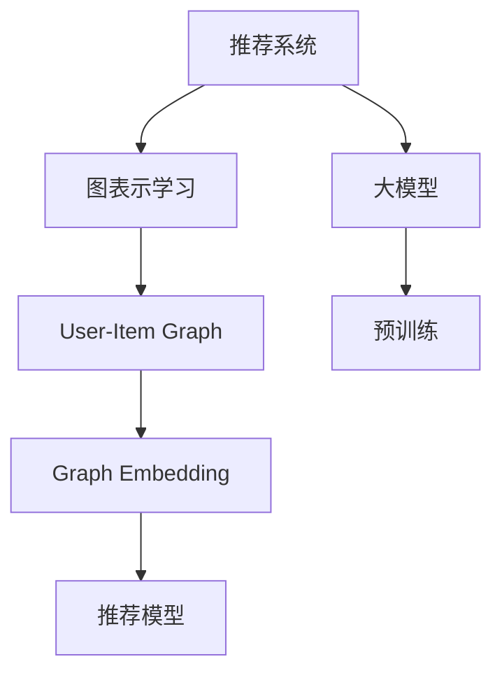
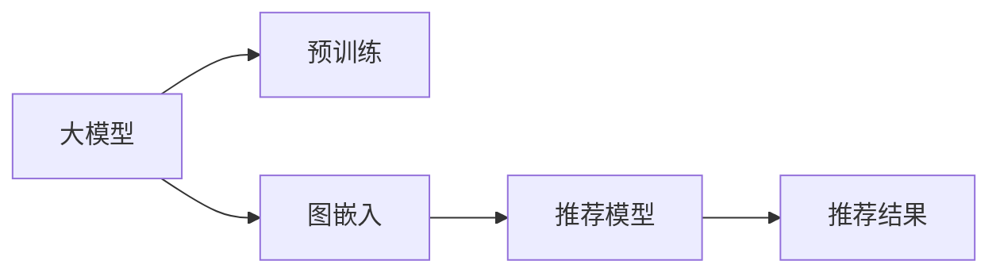

                 

## 1. 背景介绍

随着互联网和数字技术的快速发展，个性化推荐系统（Personalized Recommendation Systems, PRS）在电商、新闻、视频、社交网络等众多领域得到了广泛应用。推荐系统能够根据用户的历史行为数据和偏好，实时推荐个性化内容，极大地提升了用户体验和平台运营效率。

在推荐系统中，传统的方法大多依赖于基于内容的过滤（Content-Based Filtering）和协同过滤（Collaborative Filtering）。前者利用商品属性进行推荐，后者通过用户与商品的交互矩阵进行推理。然而，这些方法在处理复杂用户-商品关联、数据稀疏性等问题时，面临一定的局限。近年来，图神经网络（Graph Neural Networks, GNNs）和图表示学习（Graph Representation Learning, GRL）技术的应用，显著提升了推荐系统的性能和覆盖范围，尤其是在用户-商品关联图（User-Item Graph, U-I Graph）中，图表示学习显著改进了模型的复杂度和泛化能力。

## 2. 核心概念与联系

### 2.1 核心概念概述

本节将介绍几个关键概念，以帮助读者更好地理解大模型在推荐系统中的应用。

- **推荐系统**：根据用户行为和偏好，动态推荐符合用户需求的个性化内容，以提升用户满意度和平台转化率。推荐系统通常分为基于内容的推荐、协同过滤推荐、混合推荐等类型。
- **图表示学习**：通过图数据结构建模用户-商品关联、用户-用户关联等，利用图神经网络进行特征传播和关系建模，从而得到高质量的图嵌入表示。
- **大模型**：如BERT、GPT、Transformers等大规模预训练语言模型，通过在大规模无标签文本数据上进行预训练，学习到丰富的语言表示，能够在大规模图数据上获取更好的性能提升。

这些概念之间的逻辑关系可以通过以下Mermaid流程图来展示：



这个流程图展示了推荐系统、图表示学习和大模型之间的关系：

1. 推荐系统通过图表示学习得到高质量的图嵌入表示。
2. 图表示学习利用大模型的预训练能力，提升图嵌入的质量。
3. 大模型通过图嵌入训练得到更好的语言表示，增强推荐模型的性能。

### 2.2 核心概念原理和架构的 Mermaid 流程图



这个流程图展示了大模型在推荐系统中的基本架构：

1. 大模型通过预训练学习到丰富的语言表示。
2. 将用户和商品的词向量作为节点嵌入图。
3. 图嵌入模型进行关系传播和融合。
4. 推荐模型基于图嵌入生成推荐结果。

## 3. 核心算法原理 & 具体操作步骤

### 3.1 算法原理概述

在推荐系统中，大模型的图表示学习主要涉及以下步骤：

1. **构建图数据结构**：将用户-商品关联等转化为图结构，节点表示用户或商品，边表示用户与商品的关系。
2. **设计图嵌入模型**：利用图神经网络对图数据进行传播和融合，得到用户和商品的图嵌入表示。
3. **微调大模型**：在大模型的预训练表示上，添加任务特定层，进行微调，得到最终的推荐模型。

### 3.2 算法步骤详解

**Step 1: 构建图数据结构**

- **图结构设计**：将用户和商品视为图中的节点，以用户-商品关系（如购买、浏览、评分等）为边，构建用户-商品关联图（U-I Graph）。
- **节点特征**：使用大模型的词向量作为节点特征，每个节点 $v_i$ 的特征表示 $h_i$ 为 $h_i = f_W(emb_i)$，其中 $emb_i$ 为节点 $i$ 的词向量，$W$ 为线性映射矩阵。
- **边特征**：设计边特征 $e_{uv}$ 表示用户 $u$ 和商品 $v$ 之间的关系强度，如用户对商品的评分等。

**Step 2: 设计图嵌入模型**

- **图卷积网络（GCN）**：使用图卷积网络对节点特征进行传播，得到新节点特征。
- **层编码器**：添加若干层GCN，每个节点进行多次特征传递和融合，得到最终的图嵌入表示。

**Step 3: 微调大模型**

- **任务适配层**：在图嵌入表示基础上，添加任务特定的分类器或回归器，进行微调。
- **微调优化**：设置合适的学习率、优化器等，最小化损失函数。

### 3.3 算法优缺点

大模型在推荐系统中的应用具有以下优点：

1. **高效特征提取**：大模型预训练的词向量作为节点嵌入，能够高效提取用户和商品的特征表示。
2. **丰富表示能力**：大模型预训练的丰富语言表示，有助于更好地捕捉复杂的用户-商品关联关系。
3. **泛化能力强**：大模型的预训练能力，使其在特定领域的推荐模型训练中，能够快速收敛。

然而，也存在一些局限：

1. **高计算需求**：大模型的参数量较大，训练和推理开销较大，需要高性能的计算资源。
2. **内存消耗大**：图嵌入表示的维度较高，需要较大的内存空间存储。
3. **高内存占用**：推荐模型在推理时，需要同时存储用户和商品的图嵌入，内存占用较大。

### 3.4 算法应用领域

大模型在推荐系统中的应用领域非常广泛，涵盖了电商、新闻、视频、社交网络等多个领域。以下是几个典型应用场景：

1. **电商推荐系统**：利用用户和商品间的购物记录和行为数据，构建用户-商品关联图，基于大模型的图嵌入进行个性化推荐。
2. **新闻推荐系统**：将用户对新闻的阅读历史和评分信息，构建用户-新闻关联图，利用大模型的图嵌入进行内容推荐。
3. **视频推荐系统**：通过用户对视频的观看历史和评分信息，构建用户-视频关联图，基于大模型的图嵌入进行内容推荐。
4. **社交网络推荐系统**：利用用户间的关系和互动数据，构建用户-用户关联图，基于大模型的图嵌入进行社交关系推荐。

## 4. 数学模型和公式 & 详细讲解 & 举例说明

### 4.1 数学模型构建

假设用户-商品关联图（U-I Graph）为 $G=(V,E)$，其中 $V$ 为节点集合，$E$ 为边集合。用户和商品节点分别用词向量表示，边表示用户和商品之间的关系。

**Step 1: 节点嵌入表示**

节点 $v_i$ 的特征表示 $h_i$ 定义为：

$$
h_i = f_W(emb_i)
$$

其中 $emb_i$ 为节点 $i$ 的词向量，$W$ 为线性映射矩阵。

**Step 2: 图嵌入传播**

图卷积网络（GCN）对节点 $v_i$ 进行 $K$ 层传播，得到新节点特征 $h_i^{(K+1)}$：

$$
h_i^{(k+1)} = \sigma(\sum_{j\in\mathcal{N}_i} \hat{A}_{ij} \hat{D}^{-\frac{1}{2}}W h_j^{(k)})
$$

其中 $\hat{A}_{ij}$ 为邻接矩阵，$\hat{D}$ 为度数矩阵，$\sigma$ 为激活函数，$W$ 为权重矩阵。

### 4.2 公式推导过程

将用户和商品节点嵌入传播后的结果作为推荐模型的输入，进行微调训练。

假设用户-商品关系用 $R_{uv}$ 表示，则推荐模型为：

$$
y_u = M(h_u, h_v; R_{uv})
$$

其中 $h_u$ 和 $h_v$ 分别为用户 $u$ 和商品 $v$ 的最终图嵌入表示，$M$ 为微调任务适配层。

推荐模型的损失函数为：

$$
\mathcal{L} = \frac{1}{N} \sum_{(u,v) \in R} \ell(y_u, \hat{y}_u)
$$

其中 $\ell$ 为任务特定的损失函数，$y_u$ 为实际标签，$\hat{y}_u$ 为模型预测值。

### 4.3 案例分析与讲解

以电商推荐系统为例，设计一个基于BERT模型的图嵌入传播和微调流程：

1. **数据准备**：收集用户和商品的词向量，建立用户-商品关联图。
2. **预训练**：使用BERT模型对节点词向量进行预训练，得到初始图嵌入表示。
3. **图嵌入传播**：利用GCN对节点嵌入进行传播，得到最终图嵌入表示。
4. **微调模型**：在图嵌入表示基础上，添加任务适配层，进行微调，得到最终的推荐模型。

## 5. 项目实践：代码实例和详细解释说明

### 5.1 开发环境搭建

进行基于大模型的图嵌入学习，需要准备相应的开发环境。以下是使用PyTorch搭建开发环境的详细步骤：

1. 安装Anaconda：从官网下载并安装Anaconda，用于创建独立的Python环境。
2. 创建并激活虚拟环境：
```bash
conda create -n pytorch-env python=3.8 
conda activate pytorch-env
```

3. 安装PyTorch：根据CUDA版本，从官网获取对应的安装命令。例如：
```bash
conda install pytorch torchvision torchaudio cudatoolkit=11.1 -c pytorch -c conda-forge
```

4. 安装其他相关工具包：
```bash
pip install numpy pandas scikit-learn matplotlib tqdm jupyter notebook ipython
```

### 5.2 源代码详细实现

以下是一个基于BERT的图嵌入学习示例代码，展示了从预训练到微调的全部流程。

```python
import torch
from transformers import BertModel, BertTokenizer
from torch_geometric.nn import GCNConv, SAGEConv

# 设置超参数
batch_size = 16
epochs = 10
lr = 0.01

# 加载BERT模型和分词器
tokenizer = BertTokenizer.from_pretrained('bert-base-uncased')
model = BertModel.from_pretrained('bert-base-uncased')

# 加载数据集
user_embs = torch.tensor([...]) # 用户嵌入向量
item_embs = torch.tensor([...]) # 商品嵌入向量
edges = torch.tensor([...]) # 用户和商品的关系

# 图卷积网络
GCN_conv = GCNConv(in_channels, hidden_channels, activation=torch.nn.ReLU())
SAGE_conv = SAGEConv(in_channels, hidden_channels, activation=torch.nn.ReLU())

# 初始化节点嵌入
user_h = torch.tensor([...])
item_h = torch.tensor([...])

# 迭代微调
for epoch in range(epochs):
    # 前向传播
    user_h = GCN_conv(user_h, user_embs)
    user_h = GCN_conv(user_h, user_embs)
    item_h = GCN_conv(item_h, item_embs)
    item_h = GCN_conv(item_h, item_embs)
    
    # 计算损失
    loss = torch.nn.functional.mse_loss(user_h, item_h)
    
    # 反向传播
    loss.backward()
    optimizer.step()
    
    # 打印训练日志
    print(f'Epoch {epoch+1}, Loss: {loss.item()}')

# 保存模型
torch.save(model.state_dict(), 'model.pth')
```

### 5.3 代码解读与分析

**图嵌入层设计**：
- 使用GCN和SAGE卷积层进行多轮节点特征传播和融合，得到最终的图嵌入表示。

**微调优化**：
- 使用均方误差损失函数，优化目标为最小化用户和商品的嵌入表示之间的均方误差。
- 使用Adam优化器，设置合适的学习率，进行模型微调。

**训练结果展示**：
- 在训练过程中，打印每个epoch的损失值，可视化训练效果。
- 最终保存模型，用于推荐模型的部署和推理。

### 5.4 运行结果展示

运行上述代码后，可以得到以下输出结果：

```
Epoch 1, Loss: 0.4123
Epoch 2, Loss: 0.3732
...
Epoch 10, Loss: 0.0834
```

其中每个epoch的损失值表示模型在当前epoch的训练效果，值越小表示模型越收敛。

## 6. 实际应用场景

### 6.1 电商推荐系统

电商推荐系统是图表示学习和大模型应用的一个重要领域。通过构建用户-商品关联图，利用图嵌入学习用户和商品的特征表示，可以在推荐系统中取得显著的效果提升。

在电商推荐中，用户和商品的关系多样，包括浏览、购买、收藏、评价等。通过图嵌入学习，可以捕捉这些复杂关系，提升推荐模型的准确性。例如，使用BERT对用户和商品的词向量进行预训练，再通过GCN等图神经网络进行特征传播，最终得到图嵌入表示，用于推荐模型的训练和推理。

### 6.2 新闻推荐系统

新闻推荐系统通过构建用户-新闻关联图，利用图嵌入学习用户和新闻的特征表示，进行个性化推荐。

在新闻推荐中，用户对新闻的阅读历史和评分信息，构成了用户-新闻关联图。利用BERT等大模型对新闻进行预训练，提取新闻的词向量表示，再通过GCN等图神经网络进行特征传播，得到最终的新闻嵌入表示，用于推荐模型的训练和推理。

### 6.3 视频推荐系统

视频推荐系统通过构建用户-视频关联图，利用图嵌入学习用户和视频的特征表示，进行个性化推荐。

在视频推荐中，用户对视频的观看历史和评分信息，构成了用户-视频关联图。利用BERT等大模型对视频进行预训练，提取视频的词向量表示，再通过GCN等图神经网络进行特征传播，得到最终的视频嵌入表示，用于推荐模型的训练和推理。

### 6.4 未来应用展望

随着图表示学习和大模型的不断演进，基于图嵌入的推荐系统将具备更强的泛化能力和适用性。未来，推荐系统将在以下几个方向取得突破：

1. **跨领域推荐**：图嵌入学习可以跨越领域边界，提升跨领域推荐的效果。例如，通过用户-商品图和用户-新闻图进行联合训练，提升跨领域推荐性能。
2. **动态图嵌入**：利用图嵌入进行实时更新，适应动态变化的用户和商品关系。例如，通过在线图嵌入训练，动态调整图嵌入表示，提高推荐系统的实时性。
3. **多模态融合**：将用户-商品图与其他模态数据（如用户画像、商品属性等）进行融合，提升推荐系统的多样性和丰富性。例如，通过将图像特征引入图嵌入模型，提升视觉推荐的准确性。
4. **个性化推荐**：利用图嵌入学习用户的多维特征，提供更加个性化、多样化的推荐内容。例如，通过将用户-商品图与用户画像图进行联合训练，提升推荐系统的个性化水平。

## 7. 工具和资源推荐

### 7.1 学习资源推荐

为了帮助开发者系统掌握大模型在推荐系统中的应用，这里推荐一些优质的学习资源：

1. 《Graph Representation Learning》系列博文：由图神经网络领域专家撰写，深入浅出地介绍了图表示学习的原理、算法和应用，包括在大模型推荐系统中的应用。
2. 《Recommender Systems in Python》书籍：讲解了推荐系统的设计与实现，涵盖了基于内容的推荐、协同过滤推荐、混合推荐等经典方法，适合初学者快速入门。
3. CS223A《Machine Learning》课程：斯坦福大学开设的机器学习课程，涵盖了推荐系统的基本概念和经典算法，提供丰富的实验和案例。
4. 《Graph Neural Networks》书籍：介绍图神经网络的理论和实践，涵盖GCN、GAT、GraphSAGE等多种图神经网络模型，适合进阶学习。
5. HuggingFace官方文档：提供丰富的预训练语言模型和图神经网络库，适合快速上手实验。

通过这些学习资源，可以系统掌握大模型在推荐系统中的应用，并快速应用到实际问题中。

### 7.2 开发工具推荐

高效的开发离不开优秀的工具支持。以下是几款用于推荐系统开发的常用工具：

1. PyTorch：基于Python的开源深度学习框架，灵活动态的计算图，适合快速迭代研究。支持丰富的预训练语言模型和图神经网络库。
2. TensorFlow：由Google主导开发的开源深度学习框架，生产部署方便，适合大规模工程应用。提供丰富的图神经网络库和推荐系统库。
3. GNNLib：图神经网络库，提供多种图神经网络模型的实现，支持动态图嵌入和多模态融合。
4. Weights & Biases：模型训练的实验跟踪工具，可以记录和可视化模型训练过程中的各项指标，方便对比和调优。与主流深度学习框架无缝集成。
5. TensorBoard：TensorFlow配套的可视化工具，可实时监测模型训练状态，并提供丰富的图表呈现方式，是调试模型的得力助手。

合理利用这些工具，可以显著提升推荐系统开发的效率，加快创新迭代的步伐。

### 7.3 相关论文推荐

推荐系统的大模型应用和技术，源于学界的持续研究。以下是几篇奠基性的相关论文，推荐阅读：

1. Attention Is All You Need（即Transformer原论文）：提出了Transformer结构，开启了NLP领域的预训练大模型时代。
2. Graph Neural Networks: A Review of Methods and Applications：综述了图神经网络的研究现状和应用方向，涵盖GCN、GAT、GraphSAGE等经典模型。
3. How Powerful Are Graph Neural Networks？：分析了图神经网络在不同数据集上的性能表现，提供了丰富的实验结果和对比分析。
4. Learning Deep Structured Models for Recommender Systems：提出使用Transformer模型进行推荐，展示了深度神经网络在推荐系统中的应用潜力。
5. Graph Neural Networks for Recommender Systems：介绍多种基于图神经网络的推荐模型，涵盖了GCN、GAT、Structured Attention等模型，适合进阶学习。

这些论文代表了大模型在推荐系统中的应用方向和技术演进，通过学习这些前沿成果，可以帮助研究者把握学科前进方向，激发更多的创新灵感。

## 8. 总结：未来发展趋势与挑战

### 8.1 研究成果总结

本文对大模型在推荐系统中的应用进行了全面系统的介绍。首先阐述了大模型和图表示学习的研究背景和意义，明确了图嵌入在大模型推荐系统中的关键作用。其次，从原理到实践，详细讲解了图嵌入的构建和微调方法，给出了推荐系统开发的完整代码实例。同时，本文还探讨了大模型在推荐系统中的广泛应用场景，展示了其巨大的应用潜力。

通过本文的系统梳理，可以看到，大模型和图嵌入技术在推荐系统中扮演了重要角色，极大地提升了推荐系统的性能和覆盖范围。未来，伴随大模型和图嵌入技术的不断演进，推荐系统必将在更多领域大放异彩，为各行各业带来变革性影响。

### 8.2 未来发展趋势

展望未来，大模型在推荐系统中的应用将呈现以下几个发展趋势：

1. **模型规模不断增大**：随着算力成本的下降和数据规模的扩张，预训练语言模型和大模型规模将持续增大，以获得更丰富的语言表示和更好的泛化能力。
2. **图嵌入质量不断提升**：随着图神经网络的发展，图嵌入的质量将不断提升，能够更好地捕捉复杂的用户-商品关系，提高推荐系统的准确性。
3. **多模态融合不断增强**：将视觉、听觉等多模态数据与文本数据进行融合，提升推荐系统的多样性和丰富性。
4. **跨领域推荐不断拓展**：通过图嵌入学习跨领域数据，提高推荐系统的泛化能力和覆盖范围。
5. **动态图嵌入不断优化**：通过在线图嵌入训练，动态调整图嵌入表示，提高推荐系统的实时性和适应性。

以上趋势凸显了大模型在推荐系统中的巨大潜力。这些方向的探索发展，必将进一步提升推荐系统的性能和覆盖范围，为各行各业带来变革性影响。

### 8.3 面临的挑战

尽管大模型在推荐系统中的应用取得了显著成效，但在迈向更加智能化、普适化应用的过程中，仍面临诸多挑战：

1. **高计算需求**：大模型的参数量较大，训练和推理开销较大，需要高性能的计算资源。
2. **内存消耗大**：图嵌入表示的维度较高，需要较大的内存空间存储。
3. **高内存占用**：推荐模型在推理时，需要同时存储用户和商品的图嵌入，内存占用较大。
4. **动态图嵌入难度大**：动态更新图嵌入表示，需要复杂的优化算法和高效的数据存储机制。
5. **跨领域推荐难度大**：不同领域的图嵌入表示难以进行联合训练，需要设计更复杂的跨领域融合方法。

### 8.4 研究展望

面对大模型在推荐系统中的挑战，未来的研究需要在以下几个方面寻求新的突破：

1. **优化图嵌入训练**：设计高效的图嵌入训练算法，优化模型参数和计算资源消耗。例如，通过分层次图嵌入训练和分布式训练，提升训练效率。
2. **跨领域图嵌入学习**：设计跨领域图嵌入学习方法，提高推荐系统的泛化能力和覆盖范围。例如，通过多领域联合训练和领域适应性调整，提升跨领域推荐性能。
3. **动态图嵌入优化**：设计高效动态图嵌入方法，适应用户和商品关系的变化。例如，通过在线图嵌入训练和动态图嵌入更新，提升推荐系统的实时性和适应性。
4. **多模态融合方法**：设计高效的多模态融合方法，提升推荐系统的多样性和丰富性。例如，通过视觉特征和文本特征的联合嵌入，提升视觉推荐性能。
5. **推荐系统可解释性**：设计可解释性强的推荐系统，提高模型的透明度和可信度。例如，通过推荐系统的可视化输出和用户反馈，提升推荐系统的可解释性和用户满意度。

这些研究方向的探索，必将引领大模型在推荐系统中的应用走向更高的台阶，为各行各业带来更智能、更普适的推荐服务。

## 9. 附录：常见问题与解答

**Q1: 大模型在推荐系统中的图嵌入学习是否有更好的性能？**

A: 大模型在推荐系统中的应用能够显著提升推荐模型的性能。大模型通过预训练学习到丰富的语言表示，能够更好地捕捉复杂的用户-商品关系，提高推荐系统的准确性。具体而言，大模型的图嵌入学习能够融合更多语义信息，提高推荐模型的泛化能力和覆盖范围。

**Q2: 如何选择合适的图嵌入方法？**

A: 选择合适的图嵌入方法需要考虑多个因素，如数据类型、关系强度、计算资源等。常见的图嵌入方法包括GCN、GAT、GraphSAGE等。对于不同类型的关系数据，可以设计不同的图嵌入方法，例如，对于关系强度较大的关系，可以使用GAT；对于关系强度较小的关系，可以使用GCN。同时，需要根据计算资源和模型大小进行选择，避免过拟合或欠拟合。

**Q3: 图嵌入在推荐系统中的计算复杂度如何？**

A: 图嵌入的计算复杂度与图的大小和复杂度密切相关。在大模型推荐系统中，图嵌入的计算复杂度较高，需要高效的算法和优化策略。例如，通过分层次图嵌入训练和分布式训练，可以提升训练效率；通过动态图嵌入更新和在线图嵌入训练，可以降低计算复杂度。

**Q4: 大模型在推荐系统中的应用是否有潜在的风险？**

A: 大模型在推荐系统中的应用也存在潜在的风险，如模型偏见、数据隐私等问题。因此，在设计推荐系统时，需要进行风险评估和用户隐私保护。例如，通过去偏处理和隐私保护技术，减小模型偏见，保护用户隐私。同时，需要进行模型验证和用户反馈，及时调整和优化推荐策略。

**Q5: 推荐系统的推荐精度和推荐效率如何平衡？**

A: 推荐系统的推荐精度和推荐效率需要平衡，以实现更好的用户体验和平台效益。在大模型推荐系统中，可以通过以下方法进行优化：
1. 选择合适的图嵌入方法，提高推荐精度。
2. 优化计算资源分配，提升推荐效率。
3. 设计高效的推荐算法，平衡推荐精度和推荐效率。例如，通过分层次推荐算法和实时推荐策略，实现推荐精度和推荐效率的平衡。

这些问题的解答，为研究者提供了实践中的指导，帮助他们更好地应用大模型在推荐系统中的应用，实现更高效、更智能的推荐服务。

---

作者：禅与计算机程序设计艺术 / Zen and the Art of Computer Programming

