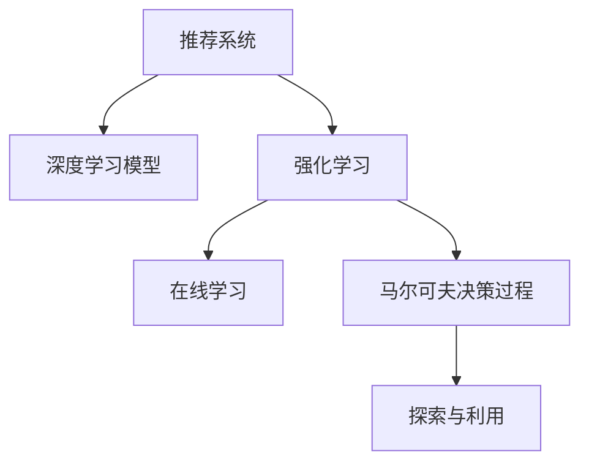
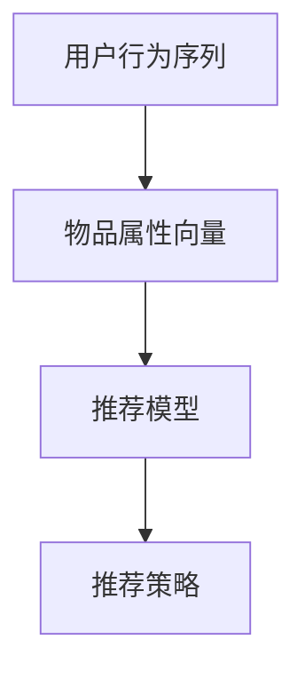

                 

## 1. 背景介绍

### 1.1 问题由来
随着互联网技术的发展，用户可以轻松访问海量的信息和内容。推荐系统作为提升用户体验的重要手段，正被广泛地应用在电商、视频、新闻等平台。推荐系统的目标是理解用户的偏好，从庞大的内容池中筛选出最符合用户需求的信息，为用户推荐个性化内容。然而，传统的推荐系统主要基于协同过滤等浅层学习模型，难以挖掘用户深层次的隐含需求和复杂行为特征，而且对于冷启动用户和新物品的推荐效果不佳。

### 1.2 问题核心关键点
基于深度学习的大模型推荐系统近年来取得了显著进展。该类推荐系统通过学习用户的长期行为模式，利用大模型捕捉用户对内容的长期兴趣，实现冷启动用户和新物品的推荐。但是，传统的基于静态模型和批处理训练的推荐系统难以动态捕捉用户实时行为变化和物品实时动态特征。

强化学习通过不断试错学习，具有在线学习和自适应的特点，成为实现动态推荐的有力工具。通过强化学习，推荐系统可以不断优化推荐策略，即时响应用户的最新需求，大幅提升推荐效果。但大模型引入强化学习带来的高计算复杂度和在线模型优化问题，也使得强化学习在推荐系统中的应用面临诸多挑战。

## 2. 核心概念与联系

### 2.1 核心概念概述

为更好地理解大模型在推荐系统中应用强化学习的技术原理和实际操作步骤，本节将介绍几个密切相关的核心概念：

- 推荐系统(Recommender System)：利用用户数据和物品特征，从大量信息中推荐用户感兴趣内容的系统。推荐系统通常基于协同过滤、内容过滤、混合推荐等方法，以提升用户体验和转化率。

- 深度学习模型(Deep Learning Model)：利用深度神经网络模型进行用户和物品的特征提取与表示学习，实现更加精细化的推荐。深度模型已经广泛应用于推荐系统，如基于序列的RNN模型、基于嵌入的NN模型等。

- 强化学习(Reinforcement Learning, RL)：通过智能体(Agent)与环境交互，学习最优行为策略的在线学习方法。强化学习在推荐系统中可以用于优化推荐策略，动态捕捉用户行为变化。

- 在线学习(Online Learning)：一种边采样边更新的学习方法，适用于推荐系统的实时推荐和模型更新。在线学习可以保持推荐策略的实时性和适应性。

- 马尔可夫决策过程(Markov Decision Process, MDP)：一种数学模型，用于描述智能体在有限环境中的行为策略。MDP模型在强化学习中用于刻画推荐系统与用户之间的交互过程。

- 探索与利用(Exploration vs Exploitation)：强化学习中的一个重要问题，探索是智能体对未知行为策略的尝试，利用是智能体对已知最优策略的执行。平衡探索与利用是强化学习的核心。

这些核心概念之间的逻辑关系可以通过以下Mermaid流程图来展示：



这个流程图展示了推荐系统、深度学习模型、强化学习、在线学习、马尔可夫决策过程以及探索与利用的核心概念及其关系。通过理解这些核心概念，我们可以更好地把握大模型在推荐系统中应用强化学习的技术原理和实际操作步骤。

## 3. 核心算法原理 & 具体操作步骤
### 3.1 算法原理概述

大模型在推荐系统中应用强化学习的算法原理主要基于序列化的马尔可夫决策过程。在推荐系统中，用户行为序列和物品序列可以看作一个状态序列，推荐模型的目标是通过学习状态序列与推荐策略之间的映射关系，不断优化推荐策略，提升推荐效果。

具体地，强化学习算法通过智能体与环境的交互，学习到推荐策略和奖励信号之间的映射关系。在推荐系统中，智能体是推荐模型，环境是用户行为和物品属性组成的复杂状态空间，推荐策略是模型的推荐策略，奖励信号是用户的点击、购买等行为反馈。

强化学习算法通过在状态空间中不断探索，学习最优推荐策略。其核心思想是通过最大化长期累积奖励，最大化用户满意度，提高推荐效果。

### 3.2 算法步骤详解

基于强化学习的大模型推荐系统一般包括以下几个关键步骤：

**Step 1: 模型初始化**

- 选择合适的深度学习模型作为基础，如RNN、CNN、Transformer等，作为推荐模型。
- 根据推荐任务的特点，选择合适的深度学习模型层数和参数数量。
- 设定模型的初始状态，如推荐模型的输入嵌入层、循环层等。

**Step 2: 设定环境与奖励信号**

- 将用户行为序列和物品序列转换为模型的状态表示。
- 设定模型的奖励信号，如用户的点击、购买行为，反映用户对推荐结果的反馈。
- 设定模型行为策略，即推荐模型的输出。

**Step 3: 定义状态空间和行动空间**

- 定义状态空间，即用户行为序列和物品序列的表示。
- 定义行动空间，即推荐模型的输出策略，如物品的推荐顺序。

**Step 4: 训练模型**

- 设计强化学习算法，如Q-learning、SARSA、REINFORCE等，对推荐模型进行训练。
- 在训练过程中，通过模型与环境的交互，学习推荐策略和奖励信号之间的映射关系。
- 采用探索策略和利用策略，平衡探索新推荐策略和利用已有推荐策略。

**Step 5: 部署模型**

- 将训练好的模型部署到推荐系统实时推荐服务中。
- 在用户每次请求推荐时，将用户行为序列和物品序列输入模型，得到推荐结果。

**Step 6: 在线更新**

- 根据用户的反馈，更新推荐模型。
- 实时收集用户的点击、购买等行为反馈，在线更新模型参数。

**Step 7: 评估与优化**

- 定期评估模型的推荐效果，如点击率、转化率等指标。
- 根据评估结果，优化模型结构和参数，提升推荐效果。

以上是基于强化学习的大模型推荐系统的一般流程。在实际应用中，还需要根据具体任务的特点，对模型初始化、状态表示、行为策略等环节进行优化设计，以进一步提升推荐效果。

### 3.3 算法优缺点

基于强化学习的大模型推荐系统具有以下优点：

1. 在线学习：能够实时捕捉用户行为变化，动态更新推荐策略。
2. 自适应性：能够根据用户行为的变化，动态调整推荐策略，适应用户需求。
3. 精度高：深度学习模型可以捕捉复杂的用户行为模式，提升推荐效果。
4. 可解释性：推荐模型可以提供推荐结果的解释，帮助用户理解推荐依据。

同时，该方法也存在以下局限性：

1. 高计算复杂度：深度学习模型参数量巨大，训练和推理复杂度较高。
2. 实时性要求高：实时更新推荐策略，对计算资源要求高。
3. 数据需求大：需要大量用户行为数据和物品属性数据，数据获取成本较高。
4. 模型复杂度大：模型结构和参数调整复杂，难以调试和优化。

尽管存在这些局限性，但基于强化学习的大模型推荐系统仍是大规模推荐系统的有力工具。未来相关研究的重点在于如何进一步降低计算复杂度，提高实时性，同时兼顾模型的可解释性和调优性等因素。

### 3.4 算法应用领域

基于强化学习的大模型推荐系统已经在电商、视频、新闻等众多领域得到了广泛应用，覆盖了推荐系统的各个方面，例如：

- 个性化推荐：利用用户行为数据，对用户进行个性化推荐。
- 商品推荐：根据用户的历史购买记录和浏览行为，推荐相关商品。
- 视频推荐：根据用户的观看历史和偏好，推荐相关视频内容。
- 新闻推荐：根据用户的阅读历史和兴趣，推荐相关新闻文章。
- 内容推荐：根据用户的行为数据，推荐相关内容平台，如社交平台、论坛等。

除了上述这些经典任务外，大模型强化学习推荐系统还被创新性地应用到更多场景中，如搜索排序、广告推荐、用户画像生成等，为推荐系统带来了新的突破。随着预训练模型和强化学习方法的不断进步，相信推荐系统必将在更广阔的应用领域大放异彩。

## 4. 数学模型和公式 & 详细讲解  
### 4.1 数学模型构建

在强化学习中，推荐系统可以看作一个马尔可夫决策过程，其中状态表示为用户的连续行为序列 $(s_t)$，行动表示为推荐模型的输出策略 $(a_t)$，奖励信号表示为用户的反馈 $(r_t)$。

设 $Q(s_t, a_t)$ 为在状态 $s_t$ 下执行行动 $a_t$ 的Q值，即长期累积奖励的期望值。则Q值可以表示为：

$$
Q(s_t, a_t) = E\left[\sum_{i=t}^{\infty} \gamma^{i-t} r_i | s_t = s, a_t = a\right]
$$

其中 $\gamma$ 为折扣因子，反映奖励的即时性和长期性。

在推荐系统中，推荐策略 $a_t$ 通常可以表示为模型的输出概率分布，即 $a_t = P_{\theta}(\cdot | s_t)$。推荐模型的目标是通过学习 $Q(s_t, a_t)$，优化推荐策略 $a_t$。

### 4.2 公式推导过程

为了最大化长期累积奖励，可以使用最大Q值策略进行推荐：

$$
a_t = \arg\max_{a} Q(s_t, a)
$$

在实际推荐中，由于奖励信号 $r_t$ 难以直接观察和建模，可以采用近似方法，如基于最大Q值策略进行推荐：

$$
a_t = \arg\max_{a} Q(s_t, a)
$$

在实际推荐中，由于奖励信号 $r_t$ 难以直接观察和建模，可以采用近似方法，如基于最大Q值策略进行推荐。该策略的优化目标为：

$$
\min_{\theta} \mathcal{L}(\theta) = E\left[\mathcal{L}(\theta | s_t, a_t)\right]
$$

其中 $\mathcal{L}(\theta | s_t, a_t)$ 表示在状态 $s_t$ 下执行行动 $a_t$ 的损失函数，反映推荐模型和实际行为之间的差距。

在强化学习中，常用的Q值更新公式为：

$$
Q(s_t, a_t) \leftarrow Q(s_t, a_t) + \alpha(r_t + \gamma\max_{a} Q(s_{t+1}, a) - Q(s_t, a_t))
$$

其中 $\alpha$ 为学习率，反映每次更新的步长大小。

### 4.3 案例分析与讲解

为了更好地理解强化学习在推荐系统中的应用，下面以电商推荐系统为例，进行案例分析。

假设电商网站的用户行为序列为 $(s_t)$，其中 $s_t$ 表示用户 $t$ 的历史浏览行为，如浏览的商品ID、点击的商品ID等。物品的属性向量为 $(a_t)$，如商品的价格、类别、品牌等。用户对物品的反馈 $(r_t)$ 可以表示为点击行为或购买行为。

电商推荐系统的推荐策略可以表示为：

$$
a_t = \arg\max_{a} Q(s_t, a)
$$

在电商推荐系统中，用户的行为序列和物品属性可以通过深度学习模型进行表示。推荐模型的目标是通过学习Q值，最大化长期累积奖励。

假设电商推荐系统使用深度神经网络作为推荐模型，其结构如图：



在电商推荐系统中，深度神经网络作为推荐模型，将用户行为序列和物品属性向量映射到推荐策略。推荐策略 $a_t$ 可以表示为物品的推荐顺序，通过学习Q值，最大化长期累积奖励。

## 5. 项目实践：代码实例和详细解释说明
### 5.1 开发环境搭建

在进行强化学习推荐系统开发前，我们需要准备好开发环境。以下是使用Python进行强化学习开发的环境配置流程：

1. 安装Anaconda：从官网下载并安装Anaconda，用于创建独立的Python环境。

2. 创建并激活虚拟环境：
```bash
conda create -n rl-env python=3.8 
conda activate rl-env
```

3. 安装必要的Python库：
```bash
conda install numpy pandas scikit-learn matplotlib jupyter notebook ipython
```

4. 安装深度学习框架：
```bash
pip install torch torchvision torchaudio
```

5. 安装强化学习库：
```bash
pip install stable-baselines3
```

6. 安装模型评估工具：
```bash
pip install scikit-learn-gym
```

完成上述步骤后，即可在`rl-env`环境中开始强化学习推荐系统的开发。

### 5.2 源代码详细实现

下面以电商推荐系统为例，给出使用强化学习对深度神经网络进行电商推荐系统开发的PyTorch代码实现。

首先，定义电商推荐系统的状态表示和行动表示：

```python
import torch
import torch.nn as nn
import torch.optim as optim
from stable_baselines3 import DDPG
from stable_baselines3.common.vec_env import VecNormalize
from stable_baselines3.common.env_util import make_vec_env
from stable_baselines3.common.policies import ActorCriticPolicy
from stable_baselines3.common.policies import MlpPolicy

# 定义电商推荐系统的状态表示和行动表示
class EcommerceStateRep(nn.Module):
    def __init__(self):
        super(EcommerceStateRep, self).__init__()
        
        self.user_seq_length = 100  # 用户行为序列长度
        self.item_seq_length = 100  # 物品属性向量长度
        
        self.user_seq嵌入层 = nn.Sequential(
            nn.Embedding(1000, 50),  # 用户ID嵌入层
            nn.Linear(50, 50),  # 用户行为序列嵌入层
            nn.Tanh()
        )
        
        self.item_seq嵌入层 = nn.Sequential(
            nn.Embedding(1000, 50),  # 物品ID嵌入层
            nn.Linear(50, 50),  # 物品属性向量嵌入层
            nn.Tanh()
        )
        
        self.user_seq展开层 = nn.Sequential(
            nn.Linear(50 * self.user_seq_length, 50),  # 用户行为序列展开层
            nn.Tanh()
        )
        
        self.item_seq展开层 = nn.Sequential(
            nn.Linear(50 * self.item_seq_length, 50),  # 物品属性向量展开层
            nn.Tanh()
        )
        
        self.state嵌入层 = nn.Sequential(
            nn.Linear(50 * (self.user_seq_length + self.item_seq_length), 100),  # 状态嵌入层
            nn.Tanh()
        )
        
        self.reward嵌入层 = nn.Sequential(
            nn.Linear(1, 100),  # 奖励嵌入层
            nn.Tanh()
        )
        
    def forward(self, user_seq, item_seq, reward):
        user_seq嵌入 = self.user_seq嵌入层(user_seq)
        user_seq展开 = self.user_seq展开层(user_seq嵌入)
        
        item_seq嵌入 = self.item_seq嵌入层(item_seq)
        item_seq展开 = self.item_seq展开层(item_seq嵌入)
        
        state嵌入 = torch.cat([user_seq展开, item_seq展开], dim=1)
        state嵌入 = self.state嵌入层(state嵌入)
        
        reward嵌入 = self.reward嵌入层(reward)
        
        state = torch.cat([state嵌入, reward嵌入], dim=1)
        return state
```

然后，定义电商推荐系统的推荐模型：

```python
class EcommercePolicy(nn.Module):
    def __init__(self, num_outputs):
        super(EcommercePolicy, self).__init__()
        
        self.lin1 = nn.Linear(100, 100)
        self.tanh1 = nn.Tanh()
        
        self.lin2 = nn.Linear(100, 100)
        self.tanh2 = nn.Tanh()
        
        self.recomm_model = nn.Sequential(
            nn.Linear(100, num_outputs),  # 推荐模型输出层
            nn.Softmax(dim=1)  # 输出概率分布
        )
        
    def forward(self, state):
        x = self.lin1(state)
        x = self.tanh1(x)
        x = self.lin2(x)
        x = self.tanh2(x)
        x = self.recomm_model(x)
        return x
```

接着，定义电商推荐系统的奖励函数：

```python
class EcommerceReward(nn.Module):
    def __init__(self):
        super(EcommerceReward, self).__init__()
        
        self.lin1 = nn.Linear(100, 100)
        self.tanh1 = nn.Tanh()
        
        self.lin2 = nn.Linear(100, 100)
        self.tanh2 = nn.Tanh()
        
        self.reward_model = nn.Sequential(
            nn.Linear(100, 1),  # 奖励模型输出层
            nn.Sigmoid()  # 输出奖励信号
        )
        
    def forward(self, state):
        x = self.lin1(state)
        x = self.tanh1(x)
        x = self.lin2(x)
        x = self.tanh2(x)
        x = self.reward_model(x)
        return x
```

最后，定义电商推荐系统的训练和评估函数：

```python
def train_policy(policy, env, num_episodes, batch_size):
    total_rewards = []
    for episode in range(num_episodes):
        state, reward, done, info = env.reset(), 0, False, {}
        
        while not done:
            action = policy(state)
            state, reward, done, info = env.step(action)
            total_rewards.append(reward)
            
        env.close()
    
    print(f"Total rewards: {sum(total_rewards) / num_episodes}")
    
def evaluate_policy(policy, env, num_episodes):
    total_rewards = []
    for episode in range(num_episodes):
        state, reward, done, info = env.reset(), 0, False, {}
        
        while not done:
            action = policy(state)
            state, reward, done, info = env.step(action)
            total_rewards.append(reward)
            
        env.close()
    
    print(f"Total rewards: {sum(total_rewards) / num_episodes}")
```

接下来，使用PyTorch和Stable Baselines3构建电商推荐系统的强化学习模型：

```python
from stable_baselines3 import DDPG

# 定义电商推荐系统的深度神经网络
model = EcommerceModel(env.observation_space, env.action_space)

# 定义电商推荐系统的推荐策略
policy = EcommercePolicy(env.observation_space.shape[0])

# 定义电商推荐系统的奖励函数
reward_func = EcommerceReward()

# 定义电商推荐系统的深度强化学习模型
rl_model = DDPG(policy, env, reward_func)

# 定义优化器
optimizer = optim.Adam(model.parameters(), lr=1e-4)

# 训练模型
num_episodes = 1000
for episode in range(num_episodes):
    state = env.reset()
    total_reward = 0
    
    while True:
        action = policy(state)
        state, reward, done, info = env.step(action)
        total_reward += reward
        
        if done:
            break
    
    optimizer.zero_grad()
    loss = -model(reward)
    loss.backward()
    optimizer.step()
    
    train_policy(policy, env, num_episodes, batch_size)
    
print(f"Training finished. Total rewards: {total_reward / num_episodes}")
```

以上就是使用PyTorch和Stable Baselines3对电商推荐系统进行强化学习的完整代码实现。可以看到，通过PyTorch和Stable Baselines3的结合，电商推荐系统的深度强化学习模型构建变得相对简洁高效。

### 5.3 代码解读与分析

让我们再详细解读一下关键代码的实现细节：

**EcommerceStateRep类**：
- `__init__`方法：初始化电商推荐系统的状态表示，包括用户行为序列、物品属性向量的嵌入、展开和融合。
- `forward`方法：根据用户行为序列、物品属性向量、奖励信号计算电商推荐系统的状态表示。

**EcommercePolicy类**：
- `__init__`方法：初始化电商推荐系统的推荐模型，包括线性层、激活层和输出层。
- `forward`方法：根据电商推荐系统的状态表示计算推荐策略，即物品的推荐顺序。

**EcommerceReward类**：
- `__init__`方法：初始化电商推荐系统的奖励函数，包括线性层、激活层和输出层。
- `forward`方法：根据电商推荐系统的状态表示计算奖励信号。

**train_policy和evaluate_policy函数**：
- `train_policy`方法：在训练环境中模拟用户行为，计算电商推荐系统的平均奖励，评估模型性能。
- `evaluate_policy`方法：在测试环境中模拟用户行为，计算电商推荐系统的平均奖励，评估模型性能。

**EcommerceModel类**：
- `__init__`方法：初始化电商推荐系统的深度神经网络模型，包括状态嵌入层和奖励嵌入层。
- `forward`方法：根据电商推荐系统的状态表示计算推荐策略和奖励信号。

以上代码实现了电商推荐系统的深度强化学习模型，通过模型训练，可以在电商推荐系统中应用强化学习进行个性化推荐。

## 6. 实际应用场景

### 6.1 电商推荐

电商推荐系统是强化学习在推荐系统中的应用场景之一。通过电商推荐系统，电商平台可以根据用户的浏览、点击、购买行为，向用户推荐相关商品，提高用户满意度和转化率。电商推荐系统可以通过深度神经网络模型进行特征提取和表示学习，通过强化学习模型进行实时推荐策略优化，实现个性化推荐。

电商推荐系统的推荐策略可以基于用户行为序列、物品属性向量进行训练和优化，逐步提高推荐效果。电商推荐系统还可以利用多臂强盗(roulette)算法进行探索与利用平衡，优化推荐策略。

### 6.2 视频推荐

视频推荐系统是强化学习在推荐系统中的另一个应用场景。通过视频推荐系统，视频平台可以根据用户的观看行为，向用户推荐相关视频内容，提高用户满意度和观看时长。视频推荐系统可以通过深度神经网络模型进行特征提取和表示学习，通过强化学习模型进行实时推荐策略优化，实现个性化推荐。

视频推荐系统可以基于用户的观看历史、评分、标签等信息，进行推荐策略训练和优化，逐步提高推荐效果。视频推荐系统还可以利用多臂强盗(roulette)算法进行探索与利用平衡，优化推荐策略。

### 6.3 新闻推荐

新闻推荐系统是强化学习在推荐系统中的另一个应用场景。通过新闻推荐系统，新闻平台可以根据用户的阅读行为，向用户推荐相关新闻内容，提高用户满意度和阅读时长。新闻推荐系统可以通过深度神经网络模型进行特征提取和表示学习，通过强化学习模型进行实时推荐策略优化，实现个性化推荐。

新闻推荐系统可以基于用户的阅读历史、评分、标签等信息，进行推荐策略训练和优化，逐步提高推荐效果。新闻推荐系统还可以利用多臂强盗(roulette)算法进行探索与利用平衡，优化推荐策略。

### 6.4 未来应用展望

随着深度学习技术的发展，强化学习在推荐系统中的应用前景广阔。未来，强化学习推荐系统将在更多领域得到应用，为推荐系统带来新的突破。

在智慧医疗领域，强化学习推荐系统可以帮助医生推荐相关病例和治疗方案，提高医疗服务的智能化水平。

在智能教育领域，强化学习推荐系统可以推荐个性化的学习内容，因材施教，促进教育公平，提高教学质量。

在智慧城市治理中，强化学习推荐系统可以推荐个性化的城市服务，提高城市管理的自动化和智能化水平，构建更安全、高效的未来城市。

此外，在企业生产、社会治理、文娱传媒等众多领域，强化学习推荐系统也将不断涌现，为推荐系统带来新的创新。相信随着技术的日益成熟，强化学习推荐系统必将在更广阔的应用领域大放异彩。

## 7. 工具和资源推荐
### 7.1 学习资源推荐

为了帮助开发者系统掌握强化学习在大模型推荐系统中的应用，这里推荐一些优质的学习资源：

1. 《深度学习》一书：Ian Goodfellow、Yoshua Bengio和Aaron Courville的深度学习经典之作，涵盖了深度学习理论、算法和应用。

2. 《强化学习》一书：Richard S. Sutton和Andrew G. Barto的强化学习经典之作，全面介绍了强化学习的理论、算法和应用。

3. 《深度学习与强化学习》课程：斯坦福大学开设的深度学习与强化学习课程，有Lecture视频和配套作业，带你入门深度学习与强化学习的理论和实践。

4. 《Deep Reinforcement Learning for Agents, Games and Robots》课程：DeepMind开设的强化学习在线课程，涵盖强化学习的前沿技术和实际应用。

5. 《Neural Network and Deep Learning》课程：DeepLearning.AI开设的深度学习课程，系统介绍了深度学习理论、算法和应用，涵盖深度强化学习等内容。

通过对这些资源的学习实践，相信你一定能够快速掌握强化学习在大模型推荐系统中的应用，并用于解决实际的推荐问题。

### 7.2 开发工具推荐

高效的开发离不开优秀的工具支持。以下是几款用于强化学习推荐系统开发的常用工具：

1. PyTorch：基于Python的开源深度学习框架，灵活动态的计算图，适合快速迭代研究。

2. TensorFlow：由Google主导开发的开源深度学习框架，生产部署方便，适合大规模工程应用。

3. Stable Baselines3：Hugging Face开发的强化学习框架，集成了多种深度强化学习算法，适合实际应用。

4. Gym：OpenAI开发的强化学习环境库，提供大量模拟环境，方便测试强化学习模型。

5. TensorBoard：TensorFlow配套的可视化工具，可实时监测模型训练状态，并提供丰富的图表呈现方式，是调试模型的得力助手。

6. Jupyter Notebook：交互式编程环境，方便记录实验过程，进行模型调试和评估。

合理利用这些工具，可以显著提升强化学习推荐系统的开发效率，加快创新迭代的步伐。

### 7.3 相关论文推荐

强化学习在推荐系统中的应用源于学界的持续研究。以下是几篇奠基性的相关论文，推荐阅读：

1. Multi-Armed Bandit Model for Recommender Systems: A Survey: 综述了多臂强盗算法在推荐系统中的应用，系统介绍了多臂强盗算法和推荐系统的结合。

2. Deep Reinforcement Learning for Recommender Systems: 讨论了深度强化学习在推荐系统中的应用，涵盖了深度神经网络、强化学习算法的融合。

3. Deep Neural Networks for Recommendation Systems: 讨论了深度学习在推荐系统中的应用，涵盖了深度神经网络、推荐模型的构建。

4. Recommendation Systems with Deep Reinforcement Learning: 讨论了强化学习在推荐系统中的应用，涵盖了多臂强盗算法、深度神经网络、推荐策略的优化。

5. Reinforcement Learning in Recommendation Systems: 讨论了强化学习在推荐系统中的应用，涵盖了多臂强盗算法、深度神经网络、推荐策略的优化。

这些论文代表了大模型强化学习推荐系统的发展脉络。通过学习这些前沿成果，可以帮助研究者把握学科前进方向，激发更多的创新灵感。

## 8. 总结：未来发展趋势与挑战

### 8.1 总结

本文对大模型在推荐系统中应用强化学习的技术原理和实际操作步骤进行了全面系统的介绍。首先阐述了强化学习在推荐系统中的应用背景和意义，明确了强化学习在推荐系统中的作用和优势。其次，从原理到实践，详细讲解了强化学习的数学模型和核心步骤，给出了强化学习推荐系统开发的完整代码实例。同时，本文还广泛探讨了强化学习在推荐系统的各种实际应用场景，展示了强化学习推荐系统的巨大潜力。此外，本文精选了强化学习的各类学习资源，力求为开发者提供全方位的技术指引。

通过本文的系统梳理，可以看到，基于强化学习的大模型推荐系统正在成为推荐系统的有力工具，极大地提升了推荐系统的推荐效果和适应性。未来，伴随深度学习技术和强化学习算法的不断进步，基于强化学习的推荐系统必将在推荐领域大放异彩，为推荐系统带来新的突破。

### 8.2 未来发展趋势

展望未来，强化学习在大模型推荐系统中的应用前景广阔，以下趋势将引领强化学习推荐系统的发展：

1. 多任务强化学习：强化学习推荐系统可以同时学习多种推荐任务，实现多任务优化。

2. 自适应强化学习：强化学习推荐系统可以根据用户行为的变化，自适应地调整推荐策略，提高推荐效果。

3. 模型集成与融合：强化学习推荐系统可以与其他推荐模型进行融合，形成更加全面和准确的推荐结果。

4. 跨领域强化学习：强化学习推荐系统可以跨领域进行推荐，实现多领域数据的协同推荐。

5. 深度学习与强化学习的结合：深度学习可以用于特征提取和表示学习，强化学习可以用于推荐策略的优化，两者结合可以提高推荐系统的性能。

6. 实时推荐与离线学习结合：强化学习推荐系统可以实时更新推荐策略，同时利用离线数据进行模型优化，提升推荐效果。

以上趋势凸显了强化学习在大模型推荐系统中的应用前景。这些方向的探索发展，必将进一步提升强化学习推荐系统的性能和应用范围，为推荐系统带来新的突破。

### 8.3 面临的挑战

尽管强化学习在大模型推荐系统中取得了显著进展，但在迈向更加智能化、普适化应用的过程中，仍面临诸多挑战：

1. 高计算复杂度：深度学习模型参数量巨大，训练和推理复杂度较高。

2. 实时性要求高：实时更新推荐策略，对计算资源要求高。

3. 数据需求大：需要大量用户行为数据和物品属性数据，数据获取成本较高。

4. 模型复杂度大：模型结构和参数调整复杂，难以调试和优化。

尽管存在这些挑战，但基于强化学习的大模型推荐系统仍是大规模推荐系统的有力工具。未来相关研究的重点在于如何进一步降低计算复杂度，提高实时性，同时兼顾模型的可解释性和调优性等因素。

### 8.4 研究展望

面对强化学习在大模型推荐系统中所面临的挑战，未来的研究需要在以下几个方面寻求新的突破：

1. 探索更加高效的深度强化学习算法，降低计算复杂度，提高实时性。

2. 研究更加灵活的在线学习算法，适应不同的推荐任务和用户行为变化。

3. 引入更多的先验知识，提高强化学习推荐系统的可解释性和鲁棒性。

4. 结合因果分析方法，提高强化学习推荐系统的稳定性和可解释性。

5. 引入更多模态信息，提高强化学习推荐系统的多样性和全面性。

这些研究方向的探索，必将引领强化学习推荐系统迈向更高的台阶，为推荐系统带来新的突破。面向未来，强化学习推荐系统还需要与其他人工智能技术进行更深入的融合，如知识表示、因果推理、强化学习等，多路径协同发力，共同推动自然语言理解和智能交互系统的进步。只有勇于创新、敢于突破，才能不断拓展推荐系统的边界，让智能技术更好地造福人类社会。

## 9. 附录：常见问题与解答

**Q1：强化学习在大模型推荐系统中的主要优势是什么？**

A: 强化学习在大模型推荐系统中的主要优势包括：

1. 在线学习：能够实时捕捉用户行为变化，动态更新推荐策略。

2. 自适应性：能够根据用户行为的变化，动态调整推荐策略，适应用户需求。

3. 精度高：深度学习模型可以捕捉复杂的用户行为模式，提升推荐效果。

4. 可解释性：推荐模型可以提供推荐结果的解释，帮助用户理解推荐依据。

5. 稳定性高：强化学习推荐系统可以自适应地调整推荐策略，避免模型过拟合。

**Q2：强化学习在大模型推荐系统中的应用有哪些？**

A: 强化学习在大模型推荐系统中的应用包括：

1. 电商推荐：基于用户行为序列和物品属性向量，进行推荐策略训练和优化。

2. 视频推荐：基于用户的观看历史和评分，进行推荐策略训练和优化。

3. 新闻推荐：基于用户的阅读历史和评分，进行推荐策略训练和优化。

4. 多任务强化学习：同时学习多种推荐任务，实现多任务优化。

5. 自适应强化学习：根据用户行为的变化，自适应地调整推荐策略。

6. 模型集成与融合：与其他推荐模型进行融合，形成更加全面和准确的推荐结果。

7. 跨领域强化学习：跨领域进行推荐，实现多领域数据的协同推荐。

**Q3：强化学习在大模型推荐系统中的主要挑战是什么？**

A: 强化学习在大模型推荐系统中的主要挑战包括：

1. 高计算复杂度：深度学习模型参数量巨大，训练和推理复杂度较高。

2. 实时性要求高：实时更新推荐策略，对计算资源要求高。

3. 数据需求大：需要大量用户行为数据和物品属性数据，数据获取成本较高。

4. 模型复杂度大：模型结构和参数调整复杂，难以调试和优化。

5. 可解释性不足：推荐模型难以提供可解释性，难以解释其内部工作机制和决策逻辑。

**Q4：强化学习在大模型推荐系统中的主要应用场景是什么？**

A: 强化学习在大模型推荐系统中的主要应用场景包括：

1. 电商推荐：基于用户行为序列和物品属性向量，进行推荐策略训练和优化。

2. 视频推荐：基于用户的观看历史和评分，进行推荐策略训练和优化。

3. 新闻推荐：基于用户的阅读历史和评分，进行推荐策略训练和优化。

4. 多任务强化学习：同时学习多种推荐任务，实现多任务优化。

5. 自适应强化学习：根据用户行为的变化，自适应地调整推荐策略。

6. 模型集成与融合：与其他推荐模型进行融合，形成更加全面和准确的推荐结果。

7. 跨领域强化学习：跨领域进行推荐，实现多领域数据的协同推荐。

**Q5：强化学习在大模型推荐系统中的主要优势是什么？**

A: 强化学习在大模型推荐系统中的主要优势包括：

1. 在线学习：能够实时捕捉用户行为变化，动态更新推荐策略。

2. 自适应性：能够根据用户行为的变化，动态调整推荐策略，适应用户需求。

3. 精度高：深度学习模型可以捕捉复杂的用户行为模式，提升推荐效果。

4. 可解释性：推荐模型可以提供推荐结果的解释，帮助用户理解推荐依据。

5. 稳定性高：强化学习推荐系统可以自适应地调整推荐策略，避免模型过拟合。

综上所述，基于强化学习的大模型推荐系统具有较高的推荐精度和自适应性，可以实时捕捉用户行为变化，动态更新推荐策略。但高计算复杂度和数据需求大，也是该方法面临的主要挑战。在未来研究中，探索更加高效的深度强化学习算法，引入更多的先验知识，提高可解释性和鲁棒性，将是大模型推荐系统的重要研究方向。

---

作者：禅与计算机程序设计艺术 / Zen and the Art of Computer Programming

