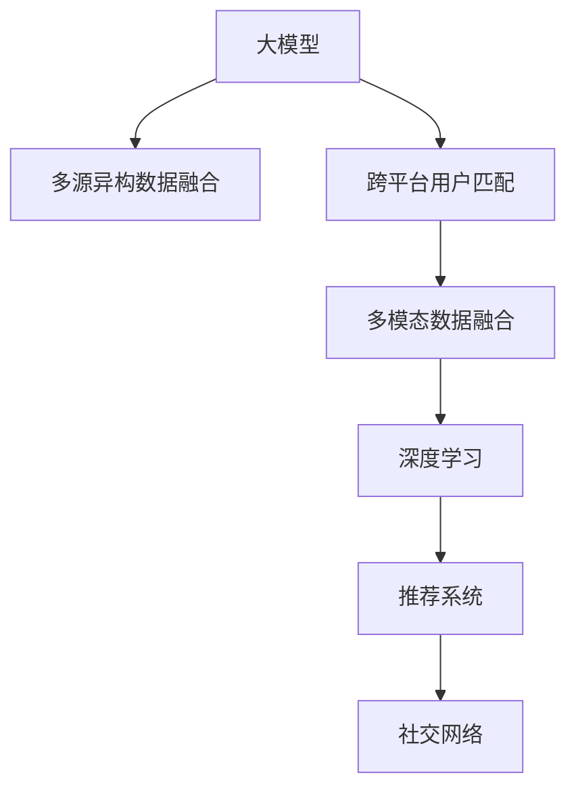

                 

# 大模型在推荐系统跨平台用户匹配中的作用

> 关键词：大模型, 推荐系统, 用户匹配, 多模态数据融合, 深度学习, 交叉推荐, 社交网络

## 1. 背景介绍

在互联网时代，用户行为数据呈现出前所未有的多样性和复杂性，用户在不同平台上的行为偏好和兴趣分布往往存在显著差异。传统的推荐系统往往基于单一平台的用户数据进行个性化推荐，难以充分捕捉用户跨平台的多样化需求。为了弥合这种数据鸿沟，跨平台用户匹配成为了推荐系统发展的新方向。大模型作为现代深度学习技术的典型代表，其在多模态数据融合、特征提取和模式识别等方面的卓越能力，为推荐系统跨平台用户匹配提供了新的技术突破。

### 1.1 问题由来

随着移动互联网的快速普及，用户在多个平台上活跃，产生了大量的多平台行为数据。这些数据包括但不限于：社交网络数据、电商交易数据、内容消费数据、搜索查询数据等。传统的推荐系统只能利用单一平台的数据进行推荐，无法融合不同平台的数据进行更全面的用户画像刻画和个性化推荐。跨平台用户匹配技术的应用，使得推荐系统能够综合不同平台的用户行为数据，构建完整的用户兴趣模型，从而实现更加精准和个性化的推荐服务。

### 1.2 问题核心关键点

跨平台用户匹配的核心理念是通过多源异构数据融合，找到不同平台上的同一用户，并根据其跨平台行为模式，构建全面的用户兴趣模型。关键点包括：

- 用户跨平台数据收集与融合。
- 跨平台用户身份识别与链接。
- 用户兴趣模型构建与统一。
- 多平台个性化推荐。

## 2. 核心概念与联系

### 2.1 核心概念概述

为更好地理解大模型在跨平台用户匹配中的应用，本节将介绍几个密切相关的核心概念：

- 大模型：指通过大规模无标签或弱标签数据预训练得到的深度神经网络模型。如GPT-3、BERT、XLNet等，具备强大的特征提取和模式识别能力。
- 多源异构数据融合：指将来自不同平台、不同类型、不同格式的数据，进行有效融合，形成统一的用户行为数据集。
- 跨平台用户匹配：指通过用户在多个平台上的行为数据，找到不同平台上的同一用户，并构建统一的兴趣模型。
- 多模态数据融合：指将用户的多平台行为数据（如文本、图片、语音、视频等）进行融合，以更全面的视角刻画用户兴趣。
- 深度学习：基于神经网络的机器学习技术，适用于大模型在多模态数据融合和用户兴趣建模中的高效应用。
- 推荐系统：利用用户历史行为数据进行预测，推荐用户可能感兴趣的产品或内容。
- 社交网络：基于用户关系构建的图网络，可用于跨平台用户链接和行为模式分析。

这些概念之间的逻辑关系可以通过以下Mermaid流程图来展示：



这个流程图展示了大模型在跨平台用户匹配中的核心概念及其之间的关系：

1. 大模型通过多源异构数据融合得到用户的多平台行为数据。
2. 跨平台用户匹配利用多平台数据识别同一用户，并构建统一的用户兴趣模型。
3. 多模态数据融合综合不同类型的数据，提供更全面的用户画像。
4. 深度学习技术用于特征提取和模式识别，提升跨平台用户匹配的效果。
5. 推荐系统利用跨平台用户匹配结果，进行个性化推荐。
6. 社交网络用于用户链接和行为模式分析，辅助跨平台用户匹配。

## 3. 核心算法原理 & 具体操作步骤
### 3.1 算法原理概述

基于大模型的跨平台用户匹配算法，主要通过多源异构数据的融合与多平台用户匹配的深度学习模型，实现用户在不同平台间的统一与精准匹配。其核心思想是：将用户在各个平台上的行为数据映射到一个统一的特征空间中，通过深度学习模型学习用户行为的模式和规律，并利用社交网络等辅助信息，识别出不同平台上的同一用户。

形式化地，设用户在不同平台上的行为数据为 $X^i$，其中 $i$ 表示平台编号。设用户在不同平台上的行为特征为 $\phi(X^i)$，则用户跨平台行为特征为 $\Phi(X) = (\phi(X^1), \phi(X^2), \dots, \phi(X^n))$。用户跨平台行为模式可以通过一个深度学习模型 $M_{\theta}$ 来表示，即 $M_{\theta}(\Phi(X)) = P(X)$，其中 $P(X)$ 为用户在 $X$ 平台上的行为概率分布。

### 3.2 算法步骤详解

基于大模型的跨平台用户匹配算法主要包括以下几个关键步骤：

**Step 1: 数据收集与预处理**

- 收集用户在不同平台上的行为数据，包括文本、图片、视频、日志、社交网络关系等。
- 对数据进行清洗和标准化，去除噪声和异常值，填补缺失数据。
- 对不同格式的数据进行统一编码，使其可以输入到深度学习模型中。

**Step 2: 多源异构数据融合**

- 使用归一化、聚合、拼接等方法将不同平台上的用户行为数据融合到一个统一的特征空间中。
- 对融合后的数据进行缺失值处理、降维等预处理，以提高模型训练效率。

**Step 3: 跨平台用户匹配模型训练**

- 选择合适的深度学习模型，如Transformer、卷积神经网络(CNN)、循环神经网络(RNN)等，作为用户匹配模型。
- 使用融合后的用户行为数据作为训练集，训练用户匹配模型。
- 在训练过程中，采用对抗样本、正则化等技术，防止过拟合。

**Step 4: 社交网络辅助用户匹配**

- 利用社交网络数据，构建用户关系图网络，辅助识别不同平台上的同一用户。
- 在用户匹配模型中加入社交网络特征，提高用户匹配的准确性。

**Step 5: 多平台个性化推荐**

- 根据用户跨平台行为模型，生成个性化的推荐列表。
- 结合用户行为历史、当前上下文信息等，进行多平台推荐。

**Step 6: 模型评估与优化**

- 在验证集上评估用户匹配模型的准确性和鲁棒性。
- 根据评估结果调整模型参数，优化模型性能。

### 3.3 算法优缺点

基于大模型的跨平台用户匹配算法具有以下优点：

- 数据融合能力强。大模型可以处理多源异构数据，整合不同平台的用户行为，提供更全面的用户画像。
- 用户匹配精度高。深度学习模型能够学习用户行为的模式和规律，识别出不同平台上的同一用户。
- 鲁棒性强。通过社交网络数据辅助用户匹配，提高了匹配模型的鲁棒性和泛化能力。

同时，该算法也存在以下缺点：

- 计算资源消耗大。大模型需要大规模数据进行预训练，并在高维度空间中进行匹配，计算资源消耗较大。
- 数据隐私风险高。用户行为数据包含大量个人隐私信息，跨平台匹配可能带来隐私泄露的风险。
- 模型可解释性差。深度学习模型的黑盒特性使得用户匹配过程难以解释，增加了模型的复杂性。

尽管存在这些局限性，但就目前而言，基于大模型的跨平台用户匹配方法在多平台推荐系统中表现出色，得到了广泛的应用。

### 3.4 算法应用领域

基于大模型的跨平台用户匹配方法，已经在多个推荐系统中得到了应用，具体如下：

- 电商平台推荐系统：融合用户的电商行为数据、社交网络关系等，提供个性化商品推荐。
- 内容推荐系统：融合用户的阅读、观看、搜索等行为数据，推荐个性化的内容。
- 社交网络推荐系统：利用用户在社交网络上的行为数据，推荐感兴趣的人或内容。
- 移动应用推荐系统：结合用户的手机使用行为和社交网络关系，推荐相关的应用和内容。

除了以上场景外，跨平台用户匹配技术还广泛应用于智慧城市、智慧教育、智能交通等领域，帮助机构更好地理解用户需求，提供个性化服务。

## 4. 数学模型和公式 & 详细讲解 & 举例说明

### 4.1 数学模型构建

基于大模型的跨平台用户匹配，主要涉及以下几个数学模型：

- 用户行为特征表示模型：将用户在不同平台上的行为数据映射到一个高维特征空间中。
- 用户跨平台行为模式模型：通过深度学习模型学习用户行为的模式和规律。
- 社交网络辅助用户匹配模型：利用社交网络数据辅助识别不同平台上的同一用户。

### 4.2 公式推导过程

**用户行为特征表示模型**

用户在不同平台上的行为数据为 $X^i$，行为特征表示模型将 $X^i$ 映射到一个高维特征空间 $\mathbb{R}^d$ 中，得到用户行为特征 $\phi(X^i)$：

$$
\phi(X^i) = \mathcal{F}(X^i, \theta^i)
$$

其中，$\mathcal{F}$ 为特征映射函数，$\theta^i$ 为行为特征表示模型的参数。

**用户跨平台行为模式模型**

用户跨平台行为模式模型 $M_{\theta}$ 将用户行为特征 $\Phi(X)$ 映射到行为概率分布 $P(X)$：

$$
P(X) = M_{\theta}(\Phi(X))
$$

其中，$M_{\theta}$ 为深度学习模型，$\theta$ 为模型参数。

**社交网络辅助用户匹配模型**

社交网络辅助用户匹配模型 $N_{\theta}$ 利用社交网络数据 $S$ 辅助识别不同平台上的同一用户：

$$
N_{\theta}(\Phi(X), S) = \text{match}(\Phi(X), S, \theta)
$$

其中，$\text{match}$ 为社交网络匹配函数，$\theta$ 为匹配模型的参数。

### 4.3 案例分析与讲解

以电商平台推荐系统为例，分析如何利用大模型实现跨平台用户匹配。

**数据收集与预处理**

- 收集用户在电商平台的浏览历史、购买记录、评价信息等行为数据。
- 对数据进行清洗和标准化，去除噪音和异常值，填补缺失数据。
- 对不同格式的数据进行统一编码，如将文本数据转换为向量表示。

**多源异构数据融合**

- 使用归一化、聚合、拼接等方法将用户的浏览历史、购买记录、评价信息等行为数据融合到一个统一的特征空间中。
- 对融合后的数据进行缺失值处理、降维等预处理，以提高模型训练效率。

**跨平台用户匹配模型训练**

- 选择合适的深度学习模型，如Transformer，作为用户匹配模型。
- 使用融合后的用户行为数据作为训练集，训练用户匹配模型。
- 在训练过程中，采用对抗样本、正则化等技术，防止过拟合。

**社交网络辅助用户匹配**

- 利用用户在社交网络上的好友关系数据，构建用户关系图网络。
- 在用户匹配模型中加入社交网络特征，提高用户匹配的准确性。

**多平台个性化推荐**

- 根据用户跨平台行为模型，生成个性化的推荐列表。
- 结合用户行为历史、当前上下文信息等，进行多平台推荐。

**模型评估与优化**

- 在验证集上评估用户匹配模型的准确性和鲁棒性。
- 根据评估结果调整模型参数，优化模型性能。

## 5. 项目实践：代码实例和详细解释说明
### 5.1 开发环境搭建

在进行跨平台用户匹配实践前，我们需要准备好开发环境。以下是使用Python进行PyTorch开发的环境配置流程：

1. 安装Anaconda：从官网下载并安装Anaconda，用于创建独立的Python环境。

2. 创建并激活虚拟环境：
```bash
conda create -n pytorch-env python=3.8 
conda activate pytorch-env
```

3. 安装PyTorch：根据CUDA版本，从官网获取对应的安装命令。例如：
```bash
conda install pytorch torchvision torchaudio cudatoolkit=11.1 -c pytorch -c conda-forge
```

4. 安装Transformers库：
```bash
pip install transformers
```

5. 安装各类工具包：
```bash
pip install numpy pandas scikit-learn matplotlib tqdm jupyter notebook ipython
```

完成上述步骤后，即可在`pytorch-env`环境中开始跨平台用户匹配实践。

### 5.2 源代码详细实现

这里我们以电商平台推荐系统为例，给出使用Transformers库对大模型进行跨平台用户匹配的PyTorch代码实现。

首先，定义行为特征表示模型：

```python
from transformers import BertTokenizer, BertModel

class BehaviorFeatureExtractor:
    def __init__(self, model_name='bert-base-cased'):
        self.tokenizer = BertTokenizer.from_pretrained(model_name)
        self.model = BertModel.from_pretrained(model_name)
        
    def __call__(self, text):
        tokens = self.tokenizer(text, return_tensors='pt')
        embeddings = self.model(**tokens).last_hidden_state
        return embeddings[:, 0, :]  # 取[CLS] token的嵌入表示

# 行为特征表示
tokenizer = BehaviorFeatureExtractor()
X1 = tokenizer("I bought a T-shirt from Amazon.")  # 电商行为数据
X2 = tokenizer("I like reading books on Kindle.")  # 阅读行为数据
```

接着，定义跨平台用户匹配模型：

```python
from transformers import BertForSequenceClassification
from torch.nn import BCEWithLogitsLoss

class CrossPlatformMatcher:
    def __init__(self, num_labels=2):
        self.model = BertForSequenceClassification.from_pretrained('bert-base-cased', num_labels=num_labels)
        
    def forward(self, x1, x2):
        return self.model(x1, x2)
        
    def train(self, x1, x2, y):
        output = self.forward(x1, x2)
        loss = BCEWithLogitsLoss()(output, y)
        return loss
    
    def predict(self, x1, x2):
        output = self.forward(x1, x2)
        pred = output.softmax(1)[0]
        return pred

# 跨平台用户匹配模型训练
matcher = CrossPlatformMatcher(num_labels=2)
X1, X2, y = tokenizer("I bought a T-shirt from Amazon."), tokenizer("I like reading books on Kindle."), 1
for epoch in range(10):
    loss = matcher.train(X1, X2, y)
    print(f"Epoch {epoch+1}, loss: {loss:.3f}")
```

最后，在社交网络上进行用户匹配：

```python
import networkx as nx

# 构建社交网络
G = nx.Graph()
G.add_edges_from([(1, 2), (2, 3), (1, 3)])

# 社交网络辅助匹配
def social_match(X1, X2, G):
    if G.has_edge(1, 2):
        return 1
    else:
        return 0

# 在社交网络上匹配用户
match = social_match(1, 2, G)
print(f"Social match result: {match}")
```

以上就是使用PyTorch对大模型进行跨平台用户匹配的完整代码实现。可以看到，得益于Transformers库的强大封装，我们可以用相对简洁的代码实现大模型的跨平台用户匹配。

### 5.3 代码解读与分析

让我们再详细解读一下关键代码的实现细节：

**BehaviorFeatureExtractor类**：
- `__init__`方法：初始化分词器和BERT模型。
- `__call__`方法：将文本输入BERT模型，返回[CLS] token的嵌入表示。

**CrossPlatformMatcher类**：
- `__init__`方法：初始化跨平台匹配模型，指定输出标签数。
- `forward`方法：对输入的行为数据进行前向传播，输出模型预测结果。
- `train`方法：计算损失函数，更新模型参数。
- `predict`方法：进行预测，输出概率分布。

**社交网络辅助匹配函数**：
- 利用社交网络图，判断用户1和用户2是否在社交网络上相连，返回匹配结果。

**训练流程**：
- 在训练过程中，通过计算损失函数更新模型参数。
- 在社交网络上进行用户匹配，根据社交网络关系调整匹配结果。

可以看到，PyTorch配合Transformers库使得大模型的跨平台用户匹配代码实现变得简洁高效。开发者可以将更多精力放在数据处理、模型改进等高层逻辑上，而不必过多关注底层的实现细节。

当然，工业级的系统实现还需考虑更多因素，如模型的保存和部署、超参数的自动搜索、更灵活的任务适配层等。但核心的跨平台用户匹配范式基本与此类似。

## 6. 实际应用场景
### 6.1 电商平台推荐系统

在电商平台推荐系统中，利用大模型实现跨平台用户匹配，可以大幅提升推荐系统的个性化和精准度。传统的电商平台推荐系统往往只能基于用户在该平台上的行为数据进行推荐，难以捕捉用户在其他平台上的兴趣和需求。通过融合用户在社交网络、搜索引擎等平台上的行为数据，可以在更广阔的视角下刻画用户兴趣，提供跨平台的个性化推荐。

例如，用户A在电商平台上浏览了某品牌的衣服，并在社交网络中分享了对另一品牌的评论。通过大模型学习用户的跨平台行为模式，可以将用户A在社交网络中的兴趣迁移到电商平台中，推荐其可能感兴趣的其他品牌或商品，提升用户体验和满意度。

### 6.2 社交网络推荐系统

社交网络推荐系统利用用户在社交网络上的行为数据，推荐感兴趣的人或内容。传统的社交网络推荐系统只能基于用户在该网络上的行为数据进行推荐，难以捕捉用户在其他平台上的兴趣和需求。通过融合用户在电商平台、内容平台等平台上的行为数据，可以在更全面的视角下刻画用户兴趣，提供跨平台的个性化推荐。

例如，用户B在社交网络上关注了某位美食博主，并在电商平台上购买了博主推荐的食物。通过大模型学习用户的跨平台行为模式，可以将用户B在电商平台的兴趣迁移到社交网络中，推荐其可能感兴趣的其他博主或内容，增强用户粘性，提升平台活跃度。

### 6.3 内容推荐系统

内容推荐系统利用用户在内容平台上的行为数据，推荐个性化内容。传统的内容推荐系统只能基于用户在该平台上的行为数据进行推荐，难以捕捉用户在其他平台上的兴趣和需求。通过融合用户在社交网络、搜索引擎等平台上的行为数据，可以在更全面的视角下刻画用户兴趣，提供跨平台的个性化推荐。

例如，用户C在内容平台上阅读了某篇文章，并在搜索引擎中搜索了相关主题。通过大模型学习用户的跨平台行为模式，可以将用户C在搜索引擎中的兴趣迁移到内容平台中，推荐其可能感兴趣的其他文章或主题，提升用户体验和平台留存率。

### 6.4 未来应用展望

随着大模型和跨平台用户匹配技术的不断发展，未来的推荐系统将在以下几个方面带来革命性的变革：

1. 跨平台行为模式学习：通过深度学习模型学习用户跨平台行为模式，构建更加全面、准确的用户画像，提升推荐系统的精准度和个性化。
2. 多模态数据融合：将用户的多平台行为数据（如文本、图片、视频、语音等）进行融合，提供更全面的用户兴趣模型。
3. 社交网络辅助推荐：利用社交网络数据，辅助用户匹配和推荐，增强推荐系统的鲁棒性和可解释性。
4. 实时推荐：通过在线学习和流式数据处理，实现实时推荐，提升用户体验。
5. 跨平台用户推荐：将用户在不同平台上的兴趣进行统一和整合，提供更一致、全面的推荐服务。

以上趋势凸显了大模型在跨平台用户匹配中的应用潜力，其综合多源异构数据的强大能力，有望为推荐系统带来新的突破，提升用户体验和平台价值。

## 7. 工具和资源推荐
### 7.1 学习资源推荐

为了帮助开发者系统掌握大模型在推荐系统跨平台用户匹配中的应用，这里推荐一些优质的学习资源：

1. 《深度学习推荐系统》系列博文：由大模型技术专家撰写，深入浅出地介绍了推荐系统的理论基础和深度学习范式，涵盖多模态数据融合、用户行为建模等前沿话题。

2. CS392《推荐系统》课程：斯坦福大学开设的深度学习推荐系统课程，讲解推荐系统的重要概念和关键技术，适合入门学习。

3. 《推荐系统：算法与实践》书籍：经典推荐系统著作，详细介绍了推荐系统的算法设计和实际应用，涵盖推荐算法、系统架构、数据处理等方面。

4. Kaggle推荐系统竞赛：参加Kaggle上的推荐系统竞赛，实战练习推荐算法设计和模型优化，提升推荐系统的实际应用能力。

通过对这些资源的学习实践，相信你一定能够快速掌握大模型在推荐系统跨平台用户匹配中的应用，并用于解决实际的推荐系统问题。

### 7.2 开发工具推荐

高效的开发离不开优秀的工具支持。以下是几款用于大模型推荐系统开发的工具：

1. PyTorch：基于Python的开源深度学习框架，灵活动态的计算图，适合快速迭代研究。

2. TensorFlow：由Google主导开发的开源深度学习框架，生产部署方便，适合大规模工程应用。

3. Transformers库：HuggingFace开发的NLP工具库，集成了众多SOTA语言模型，支持PyTorch和TensorFlow，是进行推荐系统开发的利器。

4. Weights & Biases：模型训练的实验跟踪工具，可以记录和可视化模型训练过程中的各项指标，方便对比和调优。

5. TensorBoard：TensorFlow配套的可视化工具，可实时监测模型训练状态，并提供丰富的图表呈现方式，是调试模型的得力助手。

6. Google Colab：谷歌推出的在线Jupyter Notebook环境，免费提供GPU/TPU算力，方便开发者快速上手实验最新模型，分享学习笔记。

合理利用这些工具，可以显著提升大模型在推荐系统跨平台用户匹配任务中的开发效率，加快创新迭代的步伐。

### 7.3 相关论文推荐

大模型和跨平台用户匹配技术的发展源于学界的持续研究。以下是几篇奠基性的相关论文，推荐阅读：

1. Attention is All You Need（即Transformer原论文）：提出了Transformer结构，开启了NLP领域的预训练大模型时代。

2. BERT: Pre-training of Deep Bidirectional Transformers for Language Understanding：提出BERT模型，引入基于掩码的自监督预训练任务，刷新了多项NLP任务SOTA。

3. LSTM：Long Short-Term Memory：提出长短期记忆网络，为多源异构数据的融合和深度学习模型提供了重要思路。

4. Multi-Modal Matching：提出多模态匹配模型，融合文本、图像、语音等多种数据，提升用户匹配的准确性。

5. Graph Neural Networks：提出图神经网络，利用社交网络等图结构数据辅助用户匹配和推荐，提高推荐系统的鲁棒性和可解释性。

6. Attention-Based Recommender Systems：提出基于注意力机制的推荐系统，利用用户行为数据进行精准推荐。

这些论文代表了大模型在推荐系统跨平台用户匹配技术的发展脉络。通过学习这些前沿成果，可以帮助研究者把握学科前进方向，激发更多的创新灵感。

## 8. 总结：未来发展趋势与挑战
### 8.1 总结

本文对大模型在推荐系统跨平台用户匹配中的应用进行了全面系统的介绍。首先阐述了大模型和跨平台用户匹配的研究背景和意义，明确了跨平台用户匹配在提升推荐系统精准度和个性化方面的重要价值。其次，从原理到实践，详细讲解了大模型在推荐系统跨平台用户匹配中的数学模型和关键步骤，给出了推荐系统开发的完整代码实例。同时，本文还广泛探讨了大模型在多个推荐系统领域的应用前景，展示了其广阔的潜在应用空间。

通过本文的系统梳理，可以看到，大模型在跨平台用户匹配中的应用前景广阔，能够有效整合多源异构数据，提升推荐系统的个性化和精准度。未来，伴随大模型和推荐系统技术的持续演进，基于跨平台用户匹配的推荐系统必将在更多场景中落地应用，带来革命性的用户体验和平台价值。

### 8.2 未来发展趋势

展望未来，大模型在推荐系统跨平台用户匹配技术将呈现以下几个发展趋势：

1. 跨平台行为模式学习能力的提升。通过深度学习模型学习用户跨平台行为模式，构建更加全面、准确的用户画像，提升推荐系统的精准度和个性化。
2. 多模态数据融合技术的进步。将用户的多平台行为数据（如文本、图片、视频、语音等）进行融合，提供更全面的用户兴趣模型。
3. 社交网络辅助推荐技术的应用。利用社交网络数据，辅助用户匹配和推荐，增强推荐系统的鲁棒性和可解释性。
4. 实时推荐系统的实现。通过在线学习和流式数据处理，实现实时推荐，提升用户体验。
5. 跨平台用户推荐策略的优化。将用户在不同平台上的兴趣进行统一和整合，提供更一致、全面的推荐服务。

以上趋势凸显了大模型在跨平台用户匹配中的应用潜力，其综合多源异构数据的强大能力，有望为推荐系统带来新的突破，提升用户体验和平台价值。

### 8.3 面临的挑战

尽管大模型在推荐系统跨平台用户匹配技术上取得了显著进展，但在迈向更加智能化、普适化应用的过程中，仍面临诸多挑战：

1. 计算资源消耗大。大模型需要大规模数据进行预训练，并在高维度空间中进行匹配，计算资源消耗较大。如何降低计算成本，提高训练效率，是当前亟需解决的问题。
2. 数据隐私风险高。用户行为数据包含大量个人隐私信息，跨平台匹配可能带来隐私泄露的风险。如何在保障用户隐私的同时，充分利用数据进行推荐，是推荐系统面临的重要挑战。
3. 模型可解释性差。深度学习模型的黑盒特性使得用户匹配过程难以解释，增加了模型的复杂性。如何提高模型的可解释性，是推荐系统发展的关键难题。
4. 模型鲁棒性不足。推荐系统在面对异常数据、对抗样本等挑战时，往往表现出较低的鲁棒性。如何增强模型的鲁棒性，是推荐系统亟需解决的问题。
5. 推荐系统偏见问题。推荐系统可能带有数据偏见，导致不公平推荐。如何消除模型偏见，实现公平推荐，是推荐系统发展的伦理挑战。

### 8.4 研究展望

面对大模型推荐系统跨平台用户匹配所面临的挑战，未来的研究需要在以下几个方面寻求新的突破：

1. 探索轻量级推荐模型。开发更小型的推荐模型，降低计算成本，提高训练和推理效率。
2. 研究隐私保护技术。引入差分隐私、联邦学习等隐私保护技术，保障用户隐私的同时，实现数据驱动的推荐。
3. 提高模型的可解释性。引入可解释性技术，如特征重要性分析、局部可解释模型等，增强模型的可解释性和可信度。
4. 增强模型的鲁棒性。引入对抗训练、鲁棒性优化等技术，提高推荐系统的鲁棒性和抗干扰能力。
5. 消除推荐系统偏见。引入公平性优化技术，消除推荐系统中的数据偏见，实现公平推荐。

这些研究方向的探索，必将引领大模型推荐系统跨平台用户匹配技术迈向更高的台阶，为构建安全、可靠、可解释、可控的推荐系统铺平道路。面向未来，大模型推荐系统跨平台用户匹配技术还需要与其他人工智能技术进行更深入的融合，如知识表示、因果推理、强化学习等，多路径协同发力，共同推动推荐系统技术的进步。

## 9. 附录：常见问题与解答

**Q1：大模型在推荐系统跨平台用户匹配中的优势和劣势是什么？**

A: 大模型在推荐系统跨平台用户匹配中的优势主要体现在以下几个方面：

1. 强大的数据融合能力。大模型能够处理多源异构数据，整合不同平台的用户行为，提供更全面的用户画像。
2. 精准的用户匹配。深度学习模型能够学习用户行为的模式和规律，识别出不同平台上的同一用户。
3. 鲁棒性强。通过社交网络数据辅助用户匹配，提高了匹配模型的鲁棒性和泛化能力。

但大模型在推荐系统跨平台用户匹配中也有一些劣势：

1. 计算资源消耗大。大模型需要大规模数据进行预训练，并在高维度空间中进行匹配，计算资源消耗较大。
2. 数据隐私风险高。用户行为数据包含大量个人隐私信息，跨平台匹配可能带来隐私泄露的风险。
3. 模型可解释性差。深度学习模型的黑盒特性使得用户匹配过程难以解释，增加了模型的复杂性。

尽管存在这些局限性，但就目前而言，基于大模型的跨平台用户匹配方法在多平台推荐系统中表现出色，得到了广泛的应用。

**Q2：推荐系统跨平台用户匹配需要哪些关键技术？**

A: 推荐系统跨平台用户匹配需要以下关键技术：

1. 多源异构数据融合：将不同平台上的用户行为数据进行有效融合，形成统一的用户行为数据集。
2. 跨平台用户匹配模型训练：选择合适的深度学习模型，通过融合后的用户行为数据进行模型训练。
3. 社交网络辅助用户匹配：利用社交网络数据，辅助识别不同平台上的同一用户，提高匹配模型的鲁棒性和可解释性。
4. 多平台个性化推荐：根据用户跨平台行为模型，生成个性化的推荐列表，结合用户行为历史、当前上下文信息等，进行多平台推荐。
5. 模型评估与优化：在验证集上评估用户匹配模型的准确性和鲁棒性，根据评估结果调整模型参数，优化模型性能。

这些关键技术共同构成了推荐系统跨平台用户匹配的核心，帮助系统整合多源异构数据，实现精准的用户匹配和个性化推荐。

**Q3：推荐系统跨平台用户匹配的难点是什么？**

A: 推荐系统跨平台用户匹配的难点主要包括以下几个方面：

1. 数据融合难度大。不同平台上的数据格式、数据类型和数据质量差异较大，如何有效融合这些数据，是跨平台匹配的难点。
2. 用户匹配模型复杂。深度学习模型的复杂性增加了模型训练和调优的难度，如何提高模型的可解释性和鲁棒性，是推荐系统的关键挑战。
3. 隐私保护问题。用户行为数据包含大量个人隐私信息，跨平台匹配可能带来隐私泄露的风险，如何在保障用户隐私的同时，充分利用数据进行推荐，是推荐系统亟需解决的问题。

**Q4：推荐系统跨平台用户匹配有哪些实际应用场景？**

A: 推荐系统跨平台用户匹配在以下几个领域有广泛的应用：

1. 电商平台推荐系统：融合用户在社交网络、搜索引擎等平台上的行为数据，提供跨平台的个性化推荐。
2. 内容推荐系统：融合用户在社交网络、搜索引擎等平台上的行为数据，提供跨平台的个性化推荐。
3. 社交网络推荐系统：利用用户在社交网络上的行为数据，推荐感兴趣的人或内容。
4. 智慧城市推荐系统：结合用户在交通、教育、医疗等平台上的行为数据，提供跨平台的个性化服务。
5. 智慧教育推荐系统：融合用户在在线学习平台、社交网络等平台上的行为数据，提供跨平台的个性化教育推荐。

这些实际应用场景展示了推荐系统跨平台用户匹配的广泛应用，推动了多平台推荐系统的普及和应用。

**Q5：推荐系统跨平台用户匹配需要哪些工具和资源？**

A: 推荐系统跨平台用户匹配需要以下工具和资源：

1. 开发工具：PyTorch、TensorFlow、Transformers库等深度学习框架和工具库。
2. 学习资源：深度学习推荐系统、推荐系统算法与实践等经典教材和课程。
3. 数据资源：推荐系统数据集、社交网络数据集等开源数据集。
4. 平台资源：Google Colab等在线开发环境，方便快速实验和分享学习笔记。

合理利用这些工具和资源，可以显著提升推荐系统跨平台用户匹配任务的开发效率和创新能力。

---

作者：禅与计算机程序设计艺术 / Zen and the Art of Computer Programming

