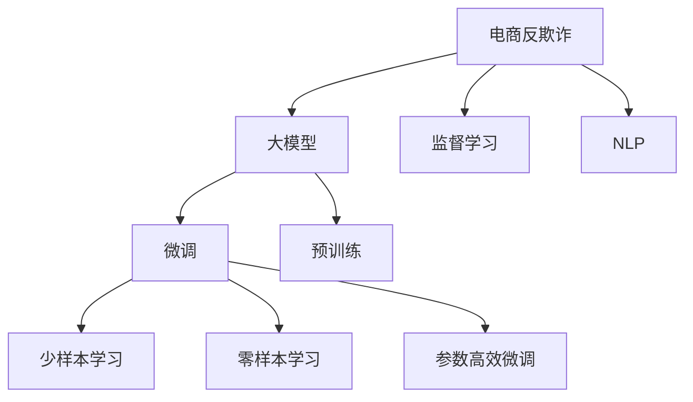

                 

# 大模型在电商反欺诈中的应用

## 1. 背景介绍

随着互联网和电子商务的迅猛发展，电商欺诈已经成为全球范围内的一个重要问题。据统计，全球每年因电商欺诈造成的损失高达数十亿美元。传统的反欺诈方法依赖于规则和统计模型，但在复杂多变的欺诈模式面前显得力不从心。大模型的出现，为电商反欺诈提供了新的解决方案。

## 2. 核心概念与联系

### 2.1 核心概念概述

为更好地理解大模型在电商反欺诈中的应用，本节将介绍几个密切相关的核心概念：

- **电商反欺诈**：指电商企业通过技术手段识别和防范欺诈行为的过程。常见的欺诈类型包括虚假交易、套现、身份盗窃等。

- **大模型**：指在大规模无标签数据上进行预训练的语言模型，如BERT、GPT等。通过预训练，大模型具备了强大的语言理解和生成能力。

- **微调(Fine-tuning)**：指在大模型的基础上，使用电商反欺诈的少量标注数据进行微调，优化模型在特定任务上的性能。

- **监督学习(Supervised Learning)**：指在大规模标注数据上，通过有监督的训练优化模型的学习范式。微调是一种典型的监督学习方法。

- **自然语言处理(NLP)**：指利用计算机技术处理、分析和理解人类语言的过程。大模型在NLP领域有广泛应用。

- **反欺诈系统**：指基于规则、统计模型或机器学习算法构建的反欺诈技术系统，可以有效识别和防范欺诈行为。

这些概念之间的逻辑关系可以通过以下Mermaid流程图来展示：



这个流程图展示了大模型在电商反欺诈中的应用过程：

1. 电商反欺诈问题转化为监督学习任务，使用大模型作为初始化参数。
2. 在大模型的基础上进行微调，优化模型在特定任务上的性能。
3. 使用少样本或零样本学习，在极少量标注数据下也能获得好的效果。
4. 采用参数高效微调，在固定大部分预训练参数的情况下，仍能提升模型性能。

## 3. 核心算法原理 & 具体操作步骤
### 3.1 算法原理概述

大模型在电商反欺诈中的应用，本质上是一种监督学习任务。通过在大规模标注数据上进行有监督的微调，使模型能够识别和防范各种欺诈行为。

假设欺诈检测任务的数据集为 $D=\{(x_i, y_i)\}_{i=1}^N, x_i \in \mathcal{X}, y_i \in \{0, 1\}$，其中 $x_i$ 为交易记录，$y_i$ 为交易是否为欺诈行为。微调的目标是最小化经验风险，即找到最优参数 $\theta$：

$$
\theta^* = \mathop{\arg\min}_{\theta} \mathcal{L}(\theta, D)
$$

其中 $\mathcal{L}$ 为针对任务设计的损失函数，用于衡量模型预测输出与真实标签之间的差异。常见的损失函数包括交叉熵损失、对数损失等。

通过梯度下降等优化算法，微调过程不断更新模型参数 $\theta$，最小化损失函数 $\mathcal{L}$，使得模型预测结果逼近真实标签。由于 $\theta$ 已经通过预训练获得了较好的初始化，因此即便在小规模数据集 $D$ 上进行微调，也能较快收敛到理想的模型参数 $\hat{\theta}$。

### 3.2 算法步骤详解

基于监督学习的大模型微调在电商反欺诈中的应用，一般包括以下几个关键步骤：

**Step 1: 准备标注数据和模型**

- 收集电商反欺诈任务的标注数据集 $D$，划分为训练集、验证集和测试集。标注数据应尽量覆盖各类欺诈行为，包括虚假交易、套现、身份盗窃等。
- 选择合适的预训练语言模型 $M_{\theta}$，如BERT、GPT等，作为初始化参数。

**Step 2: 设计任务适配层**

- 根据任务类型，在预训练模型顶层设计合适的输出层和损失函数。
- 对于分类任务，通常在顶层添加线性分类器和交叉熵损失函数。
- 对于生成任务，通常使用语言模型的解码器输出概率分布，并以负对数似然为损失函数。

**Step 3: 设置微调超参数**

- 选择合适的优化算法及其参数，如 AdamW、SGD 等，设置学习率、批大小、迭代轮数等。
- 设置正则化技术及强度，包括权重衰减、Dropout、Early Stopping 等。
- 确定冻结预训练参数的策略，如仅微调顶层，或全部参数都参与微调。

**Step 4: 执行梯度训练**

- 将训练集数据分批次输入模型，前向传播计算损失函数。
- 反向传播计算参数梯度，根据设定的优化算法和学习率更新模型参数。
- 周期性在验证集上评估模型性能，根据性能指标决定是否触发 Early Stopping。
- 重复上述步骤直到满足预设的迭代轮数或 Early Stopping 条件。

**Step 5: 测试和部署**

- 在测试集上评估微调后模型 $M_{\hat{\theta}}$ 的性能，对比微调前后的精度提升。
- 使用微调后的模型对新交易进行推理预测，集成到电商平台的反欺诈系统。
- 持续收集新的交易数据，定期重新微调模型，以适应数据分布的变化。

以上是基于监督学习微调大模型在电商反欺诈中的基本流程。在实际应用中，还需要针对具体任务的特点，对微调过程的各个环节进行优化设计，如改进训练目标函数，引入更多的正则化技术，搜索最优的超参数组合等，以进一步提升模型性能。

### 3.3 算法优缺点

大模型在电商反欺诈中的应用，具有以下优点：

1. 简单高效。只需准备少量标注数据，即可对预训练模型进行快速适配，获得较大的性能提升。
2. 泛化能力强。大模型具备强大的语言理解和生成能力，能够处理各种复杂的欺诈模式。
3. 效果显著。在电商反欺诈领域，基于微调的方法已经刷新了多项最先进的性能指标。

同时，该方法也存在一定的局限性：

1. 数据标注成本高。欺诈数据的标注往往需要专业人员，费用较高。
2. 模型过拟合风险大。电商数据分布可能变化较大，模型容易过拟合。
3. 对抗攻击难以防范。大模型可能会受到对抗样本的攻击，导致误判。
4. 可解释性不足。微调模型的决策过程缺乏可解释性，难以对其推理逻辑进行分析和调试。

尽管存在这些局限性，但就目前而言，基于监督学习的微调方法仍是大模型应用的重要范式。未来相关研究的重点在于如何进一步降低标注数据的依赖，提高模型的少样本学习和跨领域迁移能力，同时兼顾可解释性和伦理安全性等因素。

### 3.4 算法应用领域

基于大模型微调的监督学习方法，在电商反欺诈领域已经得到了广泛的应用，覆盖了各种欺诈检测任务，例如：

- **虚假交易检测**：通过微调模型识别虚假交易，如刷单、虚假评价等。
- **套现检测**：检测用户通过交易平台进行套现的行为，如用平台的资金套现。
- **身份盗窃检测**：识别不法分子通过盗用他人身份进行交易的行为。
- **异常行为检测**：通过微调模型识别交易中的异常行为，如大额交易、异地交易等。

除了上述这些经典任务外，大模型微调还被创新性地应用到更多场景中，如动态定价策略、推荐系统、用户行为分析等，为电商平台的运营决策提供新的技术手段。

## 4. 数学模型和公式 & 详细讲解  
### 4.1 数学模型构建

本节将使用数学语言对大模型在电商反欺诈中的微调过程进行更加严格的刻画。

假设微调任务的数据集为 $D=\{(x_i, y_i)\}_{i=1}^N, x_i \in \mathcal{X}, y_i \in \{0, 1\}$，其中 $\mathcal{X}$ 为输入空间，$\mathcal{Y}$ 为输出空间。定义模型 $M_{\theta}$ 在输入 $x$ 上的输出为 $\hat{y}=M_{\theta}(x)$，表示模型预测交易是否为欺诈行为。

定义模型 $M_{\theta}$ 在数据样本 $(x,y)$ 上的损失函数为 $\ell(M_{\theta}(x),y)$，则在数据集 $D$ 上的经验风险为：

$$
\mathcal{L}(\theta) = \frac{1}{N} \sum_{i=1}^N \ell(M_{\theta}(x_i),y_i)
$$

其中 $\ell$ 为针对任务设计的损失函数，如交叉熵损失函数。

微调的优化目标是最小化经验风险，即找到最优参数：

$$
\theta^* = \mathop{\arg\min}_{\theta} \mathcal{L}(\theta)
$$

在实践中，我们通常使用基于梯度的优化算法（如SGD、Adam等）来近似求解上述最优化问题。设 $\eta$ 为学习率，$\lambda$ 为正则化系数，则参数的更新公式为：

$$
\theta \leftarrow \theta - \eta \nabla_{\theta}\mathcal{L}(\theta) - \eta\lambda\theta
$$

其中 $\nabla_{\theta}\mathcal{L}(\theta)$ 为损失函数对参数 $\theta$ 的梯度，可通过反向传播算法高效计算。

### 4.2 公式推导过程

以下我们以二分类任务为例，推导交叉熵损失函数及其梯度的计算公式。

假设模型 $M_{\theta}$ 在输入 $x$ 上的输出为 $\hat{y}=M_{\theta}(x) \in [0,1]$，表示样本属于欺诈行为的预测概率。真实标签 $y \in \{0,1\}$。则二分类交叉熵损失函数定义为：

$$
\ell(M_{\theta}(x),y) = -[y\log \hat{y} + (1-y)\log (1-\hat{y})]
$$

将其代入经验风险公式，得：

$$
\mathcal{L}(\theta) = -\frac{1}{N}\sum_{i=1}^N [y_i\log M_{\theta}(x_i)+(1-y_i)\log(1-M_{\theta}(x_i))]
$$

根据链式法则，损失函数对参数 $\theta_k$ 的梯度为：

$$
\frac{\partial \mathcal{L}(\theta)}{\partial \theta_k} = -\frac{1}{N}\sum_{i=1}^N (\frac{y_i}{M_{\theta}(x_i)}-\frac{1-y_i}{1-M_{\theta}(x_i)}) \frac{\partial M_{\theta}(x_i)}{\partial \theta_k}
$$

其中 $\frac{\partial M_{\theta}(x_i)}{\partial \theta_k}$ 可进一步递归展开，利用自动微分技术完成计算。

在得到损失函数的梯度后，即可带入参数更新公式，完成模型的迭代优化。重复上述过程直至收敛，最终得到适应电商反欺诈任务的最优模型参数 $\theta^*$。

## 5. 项目实践：代码实例和详细解释说明
### 5.1 开发环境搭建

在进行电商反欺诈任务的微调实践前，我们需要准备好开发环境。以下是使用Python进行PyTorch开发的环境配置流程：

1. 安装Anaconda：从官网下载并安装Anaconda，用于创建独立的Python环境。

2. 创建并激活虚拟环境：
```bash
conda create -n pytorch-env python=3.8 
conda activate pytorch-env
```

3. 安装PyTorch：根据CUDA版本，从官网获取对应的安装命令。例如：
```bash
conda install pytorch torchvision torchaudio cudatoolkit=11.1 -c pytorch -c conda-forge
```

4. 安装Transformers库：
```bash
pip install transformers
```

5. 安装各类工具包：
```bash
pip install numpy pandas scikit-learn matplotlib tqdm jupyter notebook ipython
```

完成上述步骤后，即可在`pytorch-env`环境中开始微调实践。

### 5.2 源代码详细实现

下面我们以电商反欺诈中的虚假交易检测任务为例，给出使用Transformers库对BERT模型进行微调的PyTorch代码实现。

首先，定义虚假交易检测任务的数据处理函数：

```python
from transformers import BertTokenizer
from torch.utils.data import Dataset
import torch

class FraudDetectionDataset(Dataset):
    def __init__(self, texts, labels, tokenizer, max_len=128):
        self.texts = texts
        self.labels = labels
        self.tokenizer = tokenizer
        self.max_len = max_len
        
    def __len__(self):
        return len(self.texts)
    
    def __getitem__(self, item):
        text = self.texts[item]
        label = self.labels[item]
        
        encoding = self.tokenizer(text, return_tensors='pt', max_length=self.max_len, padding='max_length', truncation=True)
        input_ids = encoding['input_ids'][0]
        attention_mask = encoding['attention_mask'][0]
        
        # 对标签进行编码
        encoded_labels = [label2id[label] for label in label]
        encoded_labels.extend([label2id['NORMAL']] * (self.max_len - len(encoded_labels)))
        labels = torch.tensor(encoded_labels, dtype=torch.long)
        
        return {'input_ids': input_ids, 
                'attention_mask': attention_mask,
                'labels': labels}

# 标签与id的映射
label2id = {'NORMAL': 0, 'FRAUD': 1}
id2label = {v: k for k, v in label2id.items()}

# 创建dataset
tokenizer = BertTokenizer.from_pretrained('bert-base-cased')

train_dataset = FraudDetectionDataset(train_texts, train_labels, tokenizer)
dev_dataset = FraudDetectionDataset(dev_texts, dev_labels, tokenizer)
test_dataset = FraudDetectionDataset(test_texts, test_labels, tokenizer)
```

然后，定义模型和优化器：

```python
from transformers import BertForTokenClassification, AdamW

model = BertForTokenClassification.from_pretrained('bert-base-cased', num_labels=len(label2id))

optimizer = AdamW(model.parameters(), lr=2e-5)
```

接着，定义训练和评估函数：

```python
from torch.utils.data import DataLoader
from tqdm import tqdm
from sklearn.metrics import classification_report

device = torch.device('cuda') if torch.cuda.is_available() else torch.device('cpu')
model.to(device)

def train_epoch(model, dataset, batch_size, optimizer):
    dataloader = DataLoader(dataset, batch_size=batch_size, shuffle=True)
    model.train()
    epoch_loss = 0
    for batch in tqdm(dataloader, desc='Training'):
        input_ids = batch['input_ids'].to(device)
        attention_mask = batch['attention_mask'].to(device)
        labels = batch['labels'].to(device)
        model.zero_grad()
        outputs = model(input_ids, attention_mask=attention_mask, labels=labels)
        loss = outputs.loss
        epoch_loss += loss.item()
        loss.backward()
        optimizer.step()
    return epoch_loss / len(dataloader)

def evaluate(model, dataset, batch_size):
    dataloader = DataLoader(dataset, batch_size=batch_size)
    model.eval()
    preds, labels = [], []
    with torch.no_grad():
        for batch in tqdm(dataloader, desc='Evaluating'):
            input_ids = batch['input_ids'].to(device)
            attention_mask = batch['attention_mask'].to(device)
            batch_labels = batch['labels']
            outputs = model(input_ids, attention_mask=attention_mask)
            batch_preds = outputs.logits.argmax(dim=2).to('cpu').tolist()
            batch_labels = batch_labels.to('cpu').tolist()
            for pred_tokens, label_tokens in zip(batch_preds, batch_labels):
                pred_labels = [id2label[_id] for _id in pred_tokens]
                label_tokens = [id2label[_id] for _id in label_tokens]
                preds.append(pred_labels[:len(label_tokens)])
                labels.append(label_tokens)
                
    print(classification_report(labels, preds))
```

最后，启动训练流程并在测试集上评估：

```python
epochs = 5
batch_size = 16

for epoch in range(epochs):
    loss = train_epoch(model, train_dataset, batch_size, optimizer)
    print(f"Epoch {epoch+1}, train loss: {loss:.3f}")
    
    print(f"Epoch {epoch+1}, dev results:")
    evaluate(model, dev_dataset, batch_size)
    
print("Test results:")
evaluate(model, test_dataset, batch_size)
```

以上就是使用PyTorch对BERT进行虚假交易检测任务微调的完整代码实现。可以看到，得益于Transformers库的强大封装，我们可以用相对简洁的代码完成BERT模型的加载和微调。

### 5.3 代码解读与分析

让我们再详细解读一下关键代码的实现细节：

**FraudDetectionDataset类**：
- `__init__`方法：初始化文本、标签、分词器等关键组件。
- `__len__`方法：返回数据集的样本数量。
- `__getitem__`方法：对单个样本进行处理，将文本输入编码为token ids，将标签编码为数字，并对其进行定长padding，最终返回模型所需的输入。

**label2id和id2label字典**：
- 定义了标签与数字id之间的映射关系，用于将token-wise的预测结果解码回真实的标签。

**训练和评估函数**：
- 使用PyTorch的DataLoader对数据集进行批次化加载，供模型训练和推理使用。
- 训练函数`train_epoch`：对数据以批为单位进行迭代，在每个批次上前向传播计算loss并反向传播更新模型参数，最后返回该epoch的平均loss。
- 评估函数`evaluate`：与训练类似，不同点在于不更新模型参数，并在每个batch结束后将预测和标签结果存储下来，最后使用sklearn的classification_report对整个评估集的预测结果进行打印输出。

**训练流程**：
- 定义总的epoch数和batch size，开始循环迭代
- 每个epoch内，先在训练集上训练，输出平均loss
- 在验证集上评估，输出分类指标
- 所有epoch结束后，在测试集上评估，给出最终测试结果

可以看到，PyTorch配合Transformers库使得BERT微调的代码实现变得简洁高效。开发者可以将更多精力放在数据处理、模型改进等高层逻辑上，而不必过多关注底层的实现细节。

当然，工业级的系统实现还需考虑更多因素，如模型的保存和部署、超参数的自动搜索、更灵活的任务适配层等。但核心的微调范式基本与此类似。

## 6. 实际应用场景
### 6.1 电商平台的异常交易检测

在电商平台上，利用大模型微调技术进行异常交易检测，可以有效识别和防范各种欺诈行为，保障消费者权益和平台安全。

具体而言，电商企业可以收集平台上的历史交易数据，对各类欺诈行为进行标注，如虚假交易、套现等。在此基础上对预训练模型进行微调，使其能够识别和分类这些欺诈行为。微调后的模型可以在实时交易数据上进行推理，判断是否存在欺诈行为，从而采取相应的处理措施。

### 6.2 金融风控的反欺诈检测

金融行业同样面临着大量的欺诈风险，利用大模型微调技术可以构建高效、精准的反欺诈系统。

金融机构可以收集客户的交易数据，对各种欺诈行为进行标注，如身份盗窃、信用卡套现等。在大模型的基础上，微调模型学习欺诈行为的特征表示，实时监测客户交易行为，一旦发现异常，立即进行风控预警，防止资金损失。

### 6.3 保险业的风险评估

保险业也需要对各种欺诈行为进行识别和防范，利用大模型微调技术可以构建更全面、更精准的风险评估系统。

保险公司可以收集历史理赔数据，对各类欺诈行为进行标注，如虚假理赔、保险诈骗等。在大模型的基础上，微调模型学习欺诈行为的特征表示，实时评估客户理赔申请，识别出潜在的欺诈行为，减少保险公司的不合理赔付。

### 6.4 未来应用展望

随着大模型和微调技术的发展，大模型在电商反欺诈中的应用将更加广泛和深入。未来，我们可以期待以下趋势：

1. **多模态数据融合**：大模型不仅可以处理文本数据，还可以处理图像、视频、语音等多模态数据。利用多模态数据融合，可以有效提升欺诈检测的准确性和鲁棒性。

2. **实时动态更新**：大模型可以不断接收新的数据进行微调，实现实时动态更新。通过定期微调，模型能够及时适应数据分布的变化，保持欺诈检测的高效性。

3. **可解释性增强**：随着AI伦理的兴起，欺诈检测模型的可解释性将成为重要关注点。通过引入因果推断、博弈论等工具，可以增强模型的可解释性，提升用户信任度。

4. **跨领域迁移**：大模型在电商反欺诈中的应用可以向其他领域推广，如金融、保险、物流等。通过跨领域迁移，可以构建更通用的欺诈检测系统。

5. **智能决策辅助**：利用大模型构建的欺诈检测系统，可以辅助人工决策，提升工作效率和决策质量。通过结合人工经验，构建人机协同的欺诈检测系统，可以更好地应对复杂多变的欺诈模式。

## 7. 工具和资源推荐
### 7.1 学习资源推荐

为了帮助开发者系统掌握大模型在电商反欺诈中的应用理论基础和实践技巧，这里推荐一些优质的学习资源：

1. 《深度学习自然语言处理》系列博文：由大模型技术专家撰写，深入浅出地介绍了深度学习在自然语言处理中的前沿应用，包括电商反欺诈。

2. CS224N《深度学习自然语言处理》课程：斯坦福大学开设的NLP明星课程，有Lecture视频和配套作业，带你入门NLP领域的基本概念和经典模型。

3. 《Natural Language Processing with Transformers》书籍：Transformers库的作者所著，全面介绍了如何使用Transformers库进行NLP任务开发，包括电商反欺诈等。

4. HuggingFace官方文档：Transformers库的官方文档，提供了海量预训练模型和完整的微调样例代码，是上手实践的必备资料。

5. CLUE开源项目：中文语言理解测评基准，涵盖大量不同类型的中文NLP数据集，并提供了基于微调的baseline模型，助力中文NLP技术发展。

通过对这些资源的学习实践，相信你一定能够快速掌握大模型在电商反欺诈中的应用精髓，并用于解决实际的NLP问题。
### 7.2 开发工具推荐

高效的开发离不开优秀的工具支持。以下是几款用于电商反欺诈任务开发的常用工具：

1. PyTorch：基于Python的开源深度学习框架，灵活动态的计算图，适合快速迭代研究。大部分预训练语言模型都有PyTorch版本的实现。

2. TensorFlow：由Google主导开发的开源深度学习框架，生产部署方便，适合大规模工程应用。同样有丰富的预训练语言模型资源。

3. Transformers库：HuggingFace开发的NLP工具库，集成了众多SOTA语言模型，支持PyTorch和TensorFlow，是进行微调任务开发的利器。

4. Weights & Biases：模型训练的实验跟踪工具，可以记录和可视化模型训练过程中的各项指标，方便对比和调优。与主流深度学习框架无缝集成。

5. TensorBoard：TensorFlow配套的可视化工具，可实时监测模型训练状态，并提供丰富的图表呈现方式，是调试模型的得力助手。

6. Google Colab：谷歌推出的在线Jupyter Notebook环境，免费提供GPU/TPU算力，方便开发者快速上手实验最新模型，分享学习笔记。

合理利用这些工具，可以显著提升电商反欺诈任务的开发效率，加快创新迭代的步伐。

### 7.3 相关论文推荐

大模型在电商反欺诈中的应用源于学界的持续研究。以下是几篇奠基性的相关论文，推荐阅读：

1. Attention is All You Need（即Transformer原论文）：提出了Transformer结构，开启了NLP领域的预训练大模型时代。

2. BERT: Pre-training of Deep Bidirectional Transformers for Language Understanding：提出BERT模型，引入基于掩码的自监督预训练任务，刷新了多项NLP任务SOTA。

3. Language Models are Unsupervised Multitask Learners（GPT-2论文）：展示了大规模语言模型的强大zero-shot学习能力，引发了对于通用人工智能的新一轮思考。

4. Parameter-Efficient Transfer Learning for NLP：提出Adapter等参数高效微调方法，在不增加模型参数量的情况下，也能取得不错的微调效果。

5. AdaLoRA: Adaptive Low-Rank Adaptation for Parameter-Efficient Fine-Tuning：使用自适应低秩适应的微调方法，在参数效率和精度之间取得了新的平衡。

6. Causal Transformer: Attention with causal masks：引入了因果掩码机制，使Transformer在处理序列数据时能够保持上下文一致性，提高了模型的准确性。

这些论文代表了大模型在电商反欺诈领域的研究进展。通过学习这些前沿成果，可以帮助研究者把握学科前进方向，激发更多的创新灵感。

## 8. 总结：未来发展趋势与挑战

### 8.1 总结

本文对大模型在电商反欺诈中的应用进行了全面系统的介绍。首先阐述了电商反欺诈问题的背景和挑战，明确了基于大模型的微调方法在解决这些问题中的重要作用。其次，从原理到实践，详细讲解了监督微调的数学原理和关键步骤，给出了电商反欺诈任务开发的完整代码实例。同时，本文还广泛探讨了大模型在电商反欺诈中的应用场景，展示了微调技术的巨大潜力。

通过本文的系统梳理，可以看到，基于大模型的微调方法在电商反欺诈中具有广泛的应用前景，能够显著提升欺诈检测的效率和准确性，保障电商平台和消费者的安全。未来，伴随大模型的不断发展，基于微调技术的应用将更加深入和广泛。

### 8.2 未来发展趋势

展望未来，大模型在电商反欺诈中的应用将呈现以下几个发展趋势：

1. **多模态融合**：大模型不仅可以处理文本数据，还可以处理图像、视频、语音等多模态数据。通过多模态数据的融合，可以构建更全面、更精准的反欺诈系统。

2. **实时动态更新**：随着数据分布的不断变化，微调模型需要不断接收新的数据进行更新，实现实时动态更新。通过定期微调，模型能够及时适应数据分布的变化，保持欺诈检测的高效性。

3. **可解释性增强**：随着AI伦理的兴起，欺诈检测模型的可解释性将成为重要关注点。通过引入因果推断、博弈论等工具，可以增强模型的可解释性，提升用户信任度。

4. **跨领域迁移**：大模型在电商反欺诈中的应用可以向其他领域推广，如金融、保险、物流等。通过跨领域迁移，可以构建更通用的反欺诈系统。

5. **智能决策辅助**：利用大模型构建的反欺诈系统，可以辅助人工决策，提升工作效率和决策质量。通过结合人工经验，构建人机协同的反欺诈系统，可以更好地应对复杂多变的欺诈模式。

以上趋势凸显了大模型在电商反欺诈领域的应用潜力，必将推动该领域的进一步发展。

### 8.3 面临的挑战

尽管大模型在电商反欺诈中的应用已经取得了一定的进展，但在迈向更加智能化、普适化应用的过程中，仍面临诸多挑战：

1. **标注成本高**：电商欺诈数据的标注需要专业人员，费用较高。如何降低标注成本，提高标注效率，是一个重要的问题。

2. **模型过拟合风险大**：电商数据分布可能变化较大，模型容易过拟合。如何提高模型的泛化能力，降低过拟合风险，是一个重要的研究方向。

3. **对抗攻击难以防范**：大模型可能会受到对抗样本的攻击，导致误判。如何提高模型的鲁棒性，防止对抗攻击，是一个重要的研究方向。

4. **可解释性不足**：微调模型的决策过程缺乏可解释性，难以对其推理逻辑进行分析和调试。如何增强模型的可解释性，是一个重要的问题。

5. **安全性有待保障**：大模型可能会学习到有偏见、有害的信息，通过微调传递到下游任务，产生误导性、歧视性的输出。如何消除模型偏见，保障数据和模型的安全性，是一个重要的研究方向。

6. **动态更新难度大**：随着数据分布的变化，微调模型需要不断接收新的数据进行更新。如何高效、实时地进行模型更新，是一个重要的研究方向。

正视这些挑战，积极应对并寻求突破，将是大模型在电商反欺诈领域走向成熟的必由之路。相信随着学界和产业界的共同努力，这些挑战终将一一被克服，大模型在电商反欺诈中的应用必将在构建更安全、更智能的电商平台中发挥重要作用。

### 8.4 研究展望

面向未来，大模型在电商反欺诈领域的研究需要在以下几个方面寻求新的突破：

1. **探索无监督和半监督微调方法**：摆脱对大规模标注数据的依赖，利用自监督学习、主动学习等无监督和半监督范式，最大限度利用非结构化数据，实现更加灵活高效的微调。

2. **研究参数高效和计算高效的微调范式**：开发更加参数高效的微调方法，在固定大部分预训练参数的同时，只更新极少量的任务相关参数。同时优化微调模型的计算图，减少前向传播和反向传播的资源消耗，实现更加轻量级、实时性的部署。

3. **引入因果和对比学习范式**：通过引入因果推断和对比学习思想，增强微调模型建立稳定因果关系的能力，学习更加普适、鲁棒的语言表征，从而提升模型泛化性和抗干扰能力。

4. **结合因果分析和博弈论工具**：将因果分析方法引入微调模型，识别出模型决策的关键特征，增强输出解释的因果性和逻辑性。借助博弈论工具刻画人机交互过程，主动探索并规避模型的脆弱点，提高系统稳定性。

5. **纳入伦理道德约束**：在模型训练目标中引入伦理导向的评估指标，过滤和惩罚有偏见、有害的输出倾向。同时加强人工干预和审核，建立模型行为的监管机制，确保输出符合人类价值观和伦理道德。

这些研究方向的探索，必将引领大模型在电商反欺诈领域的研究进入新的阶段，为构建安全、可靠、可解释、可控的智能系统铺平道路。面向未来，大模型在电商反欺诈领域的研究还需要与其他人工智能技术进行更深入的融合，如知识表示、因果推理、强化学习等，多路径协同发力，共同推动自然语言理解和智能交互系统的进步。只有勇于创新、敢于突破，才能不断拓展大模型的边界，让智能技术更好地造福人类社会。

## 9. 附录：常见问题与解答

**Q1：电商反欺诈的微调数据如何获取？**

A: 电商反欺诈数据的获取通常包括以下几个步骤：

1. **数据收集**：从电商平台的历史交易记录中，收集涉嫌欺诈和正常交易的样本，构成标注数据集。

2. **数据标注**：由专业人员对标注数据集进行标注，标记出其中的欺诈行为，如虚假交易、套现、身份盗窃等。

3. **数据清洗**：对标注数据进行清洗，去除不完整、重复、异常的数据。

4. **数据扩充**：通过数据增强技术，如回译、近义替换等，增加训练集的多样性，提高模型的泛化能力。

通过这些步骤，可以获得高质量、有代表性的标注数据集，用于大模型的微调。

**Q2：如何选择合适的微调模型？**

A: 选择合适的微调模型需要考虑以下几个因素：

1. **任务类型**：根据任务的分类、生成、匹配等不同类型，选择相应的微调模型。如分类任务一般选择线性分类器，生成任务选择语言模型。

2. **数据量**：如果标注数据量较大，可以选择较大的预训练模型，反之选择较小的模型。

3. **计算资源**：根据计算资源的限制，选择合适的模型和优化器。如计算资源有限，可以使用参数高效的微调方法。

4. **性能要求**：根据任务对性能的精确度、速度等要求，选择合适的模型和超参数。

5. **可解释性**：根据任务对可解释性的需求，选择可解释性强的模型，如LSTM、GRU等。

综合考虑这些因素，选择最合适的微调模型。

**Q3：大模型微调后是否需要重新训练？**

A: 通常情况下，大模型微调后不需要重新训练。微调的过程是在预训练的基础上进行的，通过调整模型参数，使得模型能够适应特定的任务。如果只是微调模型的部分层，通常不会对模型的大部分参数造成影响，因此不需要重新训练。

但是，如果微调后的模型效果不佳，可以考虑重新训练，以进一步提升模型性能。

**Q4：微调过程中如何缓解过拟合问题？**

A: 缓解微调过程中的过拟合问题，可以从以下几个方面入手：

1. **数据增强**：通过数据增强技术，如回译、近义替换等，增加训练集的多样性，防止模型过拟合。

2. **正则化技术**：使用L2正则、Dropout、Early Stopping等正则化技术，防止模型过度适应训练集。

3. **参数冻结**：对于预训练模型的底层参数，可以固定不变，只微调顶层，减少需优化的参数量。

4. **对抗训练**：加入对抗样本，提高模型的鲁棒性，防止过拟合。

5. **模型裁剪**：在微调后，对模型进行裁剪，去除不必要的层和参数，减小模型尺寸，加快推理速度。

6. **迁移学习**：利用预训练模型在不同任务上的迁移学习能力，提升模型的泛化能力。

通过这些措施，可以有效缓解微调过程中的过拟合问题。

**Q5：微调后的模型是否需要定期更新？**

A: 是的，微调后的模型需要定期更新，以适应数据分布的变化。电商平台的交易数据是动态变化的，不同时间段的数据分布可能存在差异，因此微调后的模型需要定期接收新的数据进行更新，以保持模型的时效性和准确性。

定期更新可以通过以下方式实现：

1. **自动更新**：利用自动化工具，定期自动接收新的数据，重新微调模型。

2. **人工更新**：定期收集新的数据，手动进行微调，更新模型参数。

3. **增量学习**：利用增量学习技术，只对新增数据进行微调，减少计算成本。

通过定期更新，可以保持微调模型的高性能和稳定性，适应电商平台的实时需求。

**Q6：大模型在电商反欺诈中的应用是否有局限性？**

A: 是的，大模型在电商反欺诈中的应用也存在一些局限性：

1. **数据标注成本高**：电商欺诈数据的标注需要专业人员，费用较高。

2. **模型过拟合风险大**：电商数据分布可能变化较大，模型容易过拟合。

3. **对抗攻击难以防范**：大模型可能会受到对抗样本的攻击，导致误判。

4. **可解释性不足**：微调模型的决策过程缺乏可解释性，难以对其推理逻辑进行分析和调试。

5. **安全性有待保障**：大模型可能会学习到有偏见、有害的信息，通过微调传递到下游任务，产生误导性、歧视性的输出。

6. **动态更新难度大**：随着数据分布的变化，微调模型需要不断接收新的数据进行更新。

正视这些局限性，积极应对并寻求突破，将是大模型在电商反欺诈领域走向成熟的必由之路。相信随着学界和产业界的共同努力，这些局限性终将一一被克服，大模型在电商反欺诈中的应用必将在构建更安全、更智能的电商平台中发挥重要作用。

---

作者：禅与计算机程序设计艺术 / Zen and the Art of Computer Programming

