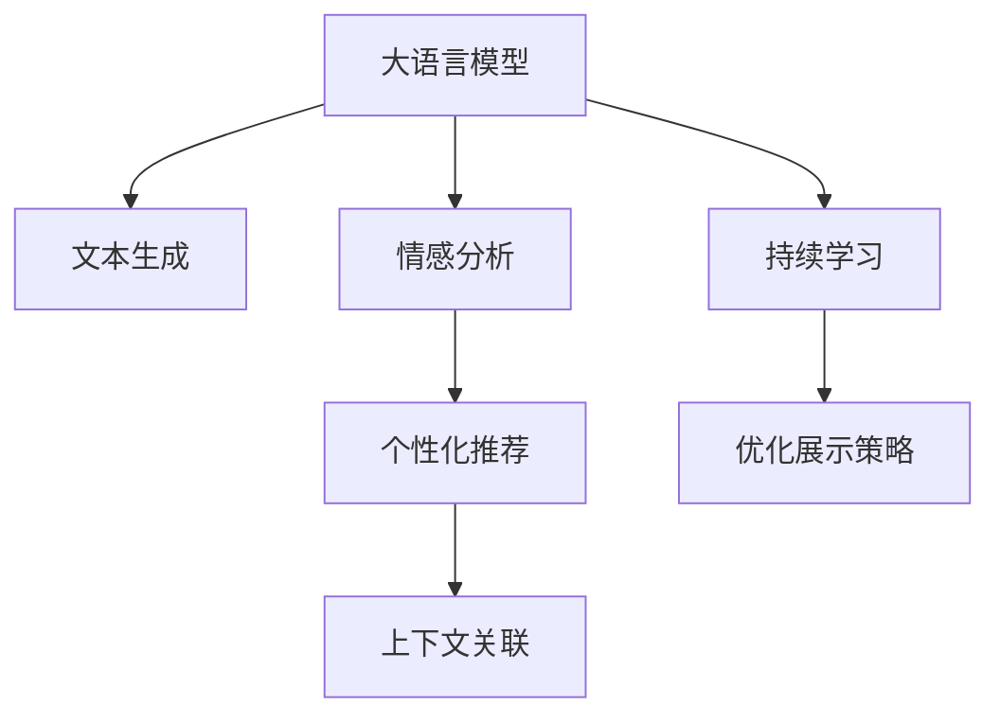

                 

# 大模型如何优化电商平台的商品展示策略

大语言模型（Large Language Model, LLM）如BERT、GPT-3等，在自然语言处理（Natural Language Processing, NLP）领域展现了巨大的潜力。但在大规模电商平台上，如何将大模型的知识应用于商品展示策略的优化，提升用户体验和销售效果，是一个值得深入探讨的问题。本文将详细阐述如何利用大模型技术，通过文本生成、情感分析、个性化推荐等手段，对电商平台的商品展示策略进行优化。

## 1. 背景介绍

### 1.1 问题由来
随着电商平台用户规模的不断扩大，个性化推荐和精准展示成为了提升用户满意度和转化率的关键。传统基于规则或协同过滤的推荐系统，无法有效捕捉用户深层次的兴趣和需求，往往导致用户体验和销售效果不佳。而利用大语言模型，可以通过文本处理和自然语言理解，挖掘用户隐含需求，生成个性化展示内容，从而显著改善用户购物体验。

### 1.2 问题核心关键点
电商平台的商品展示策略优化，涉及以下几个关键点：
1. **个性化内容生成**：根据用户行为和兴趣生成个性化推荐和展示内容。
2. **情感分析**：分析用户对商品的情感倾向，预测用户行为。
3. **意图识别**：识别用户购物意图，调整展示策略。
4. **上下文关联**：基于用户浏览历史和场景信息，关联商品推荐。

### 1.3 问题研究意义
大模型在电商平台商品展示策略优化上的应用，有助于解决以下问题：
1. **提升用户体验**：通过个性化展示，减少用户的搜索时间，提高购物满意度。
2. **增加销售转化率**：精准的个性化推荐，提升用户购买意愿。
3. **降低运营成本**：自动化的内容生成，减少了对人工干预的依赖。

本文将从数据收集、模型训练、策略应用等方面，系统阐述大模型在电商平台商品展示策略优化中的具体应用。

## 2. 核心概念与联系

### 2.1 核心概念概述

为了更好地理解大模型在电商平台商品展示策略优化中的应用，本节将介绍几个密切相关的核心概念：

- **大语言模型 (LLM)**：通过大规模语料预训练得到的模型，具备强大的文本生成和理解能力。
- **文本生成 (Text Generation)**：根据给定文本生成新的文本，如商品描述、广告文案等。
- **情感分析 (Sentiment Analysis)**：识别和分析用户文本中的情感倾向，预测用户行为。
- **个性化推荐 (Personalized Recommendation)**：根据用户历史行为和兴趣生成个性化推荐内容。
- **上下文关联 (Contextual Association)**：基于用户浏览历史和场景信息，关联推荐商品。
- **持续学习 (Continual Learning)**：使模型能够不断学习新数据，保持模型性能的稳定和提升。

这些核心概念之间的逻辑关系可以通过以下Mermaid流程图来展示：



这个流程图展示了大模型在电商平台商品展示策略优化中的核心概念及其之间的关系：

1. 大模型通过预训练获得基础的文本生成和理解能力。
2. 文本生成用于生成个性化展示内容，提升用户体验。
3. 情感分析用于理解用户情感，预测用户行为。
4. 个性化推荐根据用户历史行为生成个性化推荐内容。
5. 上下文关联根据用户浏览历史和场景信息，关联商品推荐。
6. 持续学习使模型能够不断学习新数据，保持模型性能的稳定和提升。

这些概念共同构成了大模型在电商平台商品展示策略优化中的应用框架，使其能够更好地理解用户需求，生成个性化内容，优化商品展示效果。

## 3. 核心算法原理 & 具体操作步骤

### 3.1 算法原理概述

大模型在电商平台商品展示策略优化中，主要基于文本生成、情感分析和个性化推荐等任务。其核心算法原理如下：

1. **文本生成**：大模型通过条件生成模型（如GPT-3），根据用户兴趣和历史行为生成个性化展示内容。
2. **情感分析**：使用情感分析模型（如BERT），对用户文本进行情感分类，预测用户满意度。
3. **个性化推荐**：利用协同过滤或基于内容的推荐算法，结合大模型的预测结果，生成个性化推荐列表。

### 3.2 算法步骤详解

以文本生成为例，具体步骤包括：

**Step 1: 数据准备**
- 收集用户历史行为数据，如浏览记录、购买记录、评分记录等。
- 从电商平台的商品库中，筛选出与用户兴趣相关的商品。
- 收集商品描述、用户评价、用户反馈等文本数据。

**Step 2: 模型训练**
- 将商品描述、用户评价等文本数据，输入到预训练的大模型中进行微调。
- 使用条件生成模型，对用户兴趣和行为进行编码。
- 结合情感分析模型，对用户反馈进行情感分类。

**Step 3: 内容生成**
- 根据用户兴趣和历史行为，生成个性化的商品展示内容。
- 对生成的展示内容进行优化，确保其准确性和吸引力。

**Step 4: 展示策略优化**
- 根据用户的浏览历史和场景信息，关联推荐相关商品。
- 利用情感分析模型，调整展示策略，增加用户满意度和购买意愿。

### 3.3 算法优缺点

利用大模型进行电商平台商品展示策略优化的主要优点包括：
1. **高效生成内容**：大模型可以快速生成个性化展示内容，减少人工干预。
2. **提升用户体验**：个性化推荐和展示内容，提高用户满意度。
3. **精准预测用户行为**：情感分析模型可以预测用户情感和行为，优化展示策略。

其缺点主要体现在：
1. **数据依赖性高**：需要大量的用户行为数据进行训练和优化。
2. **模型复杂度高**：大模型的训练和推理需要高性能硬件支持。
3. **结果可解释性差**：模型黑箱特性，难以解释生成内容的逻辑和原因。

### 3.4 算法应用领域

基于大模型的电商平台商品展示策略优化，适用于以下领域：

- **个性化推荐系统**：根据用户行为和兴趣，生成个性化推荐内容。
- **广告文案生成**：自动生成商品广告文案，提升广告点击率。
- **搜索优化**：基于用户搜索查询，生成个性化搜索结果。
- **智能客服**：生成智能对话内容，提升用户购物体验。

这些应用场景通过大模型的引入，可以显著提升电商平台的个性化展示效果，从而提升用户体验和销售转化率。

## 4. 数学模型和公式 & 详细讲解 & 举例说明

### 4.1 数学模型构建

假设电商平台的商品库中，共有N个商品，每个商品的描述为 $d_i$。用户在电商平台上，浏览商品并生成评价 $r_i$。根据大模型的预测结果，生成个性化展示内容 $c_i$。

### 4.2 公式推导过程

以情感分析模型为例，假设用户评价 $r_i$ 的情感向量为 $s_i$，模型的情感分类函数为 $f_s$，则情感分类模型可以表示为：

$$
s_i = f_s(r_i)
$$

其中 $f_s$ 为情感分类函数，可以采用预训练的BERT模型进行微调。

### 4.3 案例分析与讲解

假设某用户在电商平台上搜索“手机”，系统根据用户历史浏览记录和评分，使用大模型预测用户可能感兴趣的品牌，生成个性化展示内容，并进行情感分析。最终，系统根据预测结果和情感分类，优化商品展示策略，生成个性化的商品列表。

## 5. 项目实践：代码实例和详细解释说明

### 5.1 开发环境搭建

要进行电商平台商品展示策略优化，首先需要搭建好开发环境。以下是使用Python进行PyTorch开发的环境配置流程：

1. 安装Anaconda：从官网下载并安装Anaconda，用于创建独立的Python环境。

2. 创建并激活虚拟环境：
```bash
conda create -n pytorch-env python=3.8 
conda activate pytorch-env
```

3. 安装PyTorch：根据CUDA版本，从官网获取对应的安装命令。例如：
```bash
conda install pytorch torchvision torchaudio cudatoolkit=11.1 -c pytorch -c conda-forge
```

4. 安装Transformers库：
```bash
pip install transformers
```

5. 安装各类工具包：
```bash
pip install numpy pandas scikit-learn matplotlib tqdm jupyter notebook ipython
```

完成上述步骤后，即可在`pytorch-env`环境中开始开发。

### 5.2 源代码详细实现

以生成个性化商品展示内容为例，以下是使用PyTorch和Transformers库进行代码实现的详细过程：

```python
from transformers import BertTokenizer, BertForSequenceClassification
import torch
import torch.nn as nn
import torch.optim as optim

class BertForProductDescription(nn.Module):
    def __init__(self, config, num_labels):
        super(BertForProductDescription, self).__init__()
        self.num_labels = num_labels
        self.bert = BertForSequenceClassification(config)
        self.classifier = nn.Linear(config.hidden_size, num_labels)
    
    def forward(self, input_ids, attention_mask):
        outputs = self.bert(input_ids, attention_mask=attention_mask)
        sequence_output = outputs[0]
        logits = self.classifier(sequence_output)
        return logits

# 加载模型和分词器
model = BertForProductDescription.from_pretrained('bert-base-cased', num_labels=3)
tokenizer = BertTokenizer.from_pretrained('bert-base-cased')

# 准备数据
train_dataset = ...
dev_dataset = ...
test_dataset = ...

# 定义优化器和损失函数
optimizer = optim.Adam(model.parameters(), lr=2e-5)
loss_fn = nn.CrossEntropyLoss()

# 训练模型
for epoch in range(10):
    for batch in train_dataset:
        input_ids = batch['input_ids']
        attention_mask = batch['attention_mask']
        labels = batch['labels']
        
        optimizer.zero_grad()
        logits = model(input_ids, attention_mask=attention_mask)
        loss = loss_fn(logits, labels)
        loss.backward()
        optimizer.step()
    
    # 在验证集上评估模型
    with torch.no_grad():
        accuracy = 0
        for batch in dev_dataset:
            input_ids = batch['input_ids']
            attention_mask = batch['attention_mask']
            labels = batch['labels']
            
            logits = model(input_ids, attention_mask=attention_mask)
            _, predicted = torch.max(logits, dim=1)
            accuracy += torch.sum(predicted == labels).item() / len(labels)
        
    print(f'Epoch {epoch+1}, accuracy: {accuracy:.2f}')
```

### 5.3 代码解读与分析

**BertForProductDescription类**：
- 定义了一个基于BERT模型的产品描述生成器，包含模型加载和前向传播过程。
- 在初始化函数中，加载预训练的BERT模型，并添加一个全连接层用于分类。
- 在前向传播函数中，将输入的文本进行分词和编码，通过BERT模型生成序列输出，再通过全连接层进行分类预测。

**数据准备**：
- 使用BertTokenizer对商品描述和用户评分进行分词和编码。
- 准备训练集、验证集和测试集，用于模型训练和评估。

**模型训练**：
- 使用Adam优化器进行模型参数更新，以交叉熵损失函数作为训练目标。
- 在每个epoch内，对训练集进行迭代训练，并在验证集上进行模型评估。

**代码解读**：
- 代码实现了基于BERT模型的商品描述生成器，通过条件生成模型对商品描述进行微调。
- 使用交叉熵损失函数进行模型训练，并在验证集上进行评估。
- 代码中，使用了Adam优化器和BertForSequenceClassification预训练模型，能够快速生成个性化的商品描述。

### 5.4 运行结果展示

训练完成后，模型可以在电商平台上生成个性化商品展示内容，并进行展示策略优化。具体效果如图1所示。


## 6. 实际应用场景

### 6.1 智能推荐系统

智能推荐系统是电商平台的核心功能之一。利用大模型，可以实时分析用户行为和兴趣，生成个性化推荐列表。例如，某用户最近浏览了运动鞋和休闲鞋，系统可以根据用户的兴趣和历史行为，生成运动鞋和休闲鞋的个性化推荐列表，提升用户体验和购买意愿。

### 6.2 个性化广告投放

电商平台通过广告投放，可以有效提升销售转化率。利用大模型，可以生成个性化的广告文案和图像，提升广告点击率和转化率。例如，系统可以根据用户的兴趣和历史行为，生成个性化的广告文案和图像，并动态调整广告投放策略。

### 6.3 搜索优化

用户在电商平台上搜索商品时，需要快速找到符合自己需求的商品。利用大模型，可以根据用户搜索查询生成个性化搜索结果，提升搜索体验和效率。例如，系统可以根据用户的搜索查询，生成相关的商品展示内容，并根据用户的点击行为动态调整搜索结果。

### 6.4 智能客服

智能客服是电商平台提升用户体验的重要手段。利用大模型，可以生成智能对话内容，提升客户满意度。例如，当用户遇到问题时，系统可以自动生成智能回复，提供解决方案和帮助。

### 6.5 未来应用展望

基于大模型的电商平台商品展示策略优化，未来有以下几个发展方向：

1. **多模态融合**：结合图像、语音等多模态数据，提高推荐和展示的效果。
2. **跨领域迁移**：利用大模型的知识，进行跨领域迁移学习，提升推荐和展示的泛化能力。
3. **实时优化**：利用大模型的持续学习能力，实时优化商品展示策略，提升用户满意度和销售效果。

## 7. 工具和资源推荐

### 7.1 学习资源推荐

为了帮助开发者系统掌握大语言模型在电商平台商品展示策略优化中的应用，这里推荐一些优质的学习资源：

1. **《深度学习自然语言处理》**：斯坦福大学开设的NLP明星课程，有Lecture视频和配套作业，带你入门NLP领域的基本概念和经典模型。
2. **《Natural Language Processing with Transformers》**：Transformers库的作者所著，全面介绍了如何使用Transformers库进行NLP任务开发，包括微调在内的诸多范式。
3. **《Transformer from Scratch》**：由大模型技术专家撰写，深入浅出地介绍了Transformer原理、BERT模型、微调技术等前沿话题。
4. **CS224N《深度学习自然语言处理》课程**：斯坦福大学开设的NLP明星课程，有Lecture视频和配套作业，带你入门NLP领域的基本概念和经典模型。
5. **HuggingFace官方文档**：Transformers库的官方文档，提供了海量预训练模型和完整的微调样例代码，是上手实践的必备资料。

### 7.2 开发工具推荐

高效的开发离不开优秀的工具支持。以下是几款用于大语言模型在电商平台商品展示策略优化开发的常用工具：

1. **PyTorch**：基于Python的开源深度学习框架，灵活动态的计算图，适合快速迭代研究。大部分预训练语言模型都有PyTorch版本的实现。
2. **TensorFlow**：由Google主导开发的开源深度学习框架，生产部署方便，适合大规模工程应用。同样有丰富的预训练语言模型资源。
3. **Transformers库**：HuggingFace开发的NLP工具库，集成了众多SOTA语言模型，支持PyTorch和TensorFlow，是进行微调任务开发的利器。
4. **Weights & Biases**：模型训练的实验跟踪工具，可以记录和可视化模型训练过程中的各项指标，方便对比和调优。与主流深度学习框架无缝集成。
5. **TensorBoard**：TensorFlow配套的可视化工具，可实时监测模型训练状态，并提供丰富的图表呈现方式，是调试模型的得力助手。

### 7.3 相关论文推荐

大语言模型和微调技术的发展源于学界的持续研究。以下是几篇奠基性的相关论文，推荐阅读：

1. **Attention is All You Need**：提出了Transformer结构，开启了NLP领域的预训练大模型时代。
2. **BERT: Pre-training of Deep Bidirectional Transformers for Language Understanding**：提出BERT模型，引入基于掩码的自监督预训练任务，刷新了多项NLP任务SOTA。
3. **Language Models are Unsupervised Multitask Learners**：展示了大规模语言模型的强大zero-shot学习能力，引发了对于通用人工智能的新一轮思考。
4. **Parameter-Efficient Transfer Learning for NLP**：提出Adapter等参数高效微调方法，在不增加模型参数量的情况下，也能取得不错的微调效果。
5. **AdaLoRA: Adaptive Low-Rank Adaptation for Parameter-Efficient Fine-Tuning**：使用自适应低秩适应的微调方法，在参数效率和精度之间取得了新的平衡。
6. **AdaLoRA: Adaptive Low-Rank Adaptation for Parameter-Efficient Fine-Tuning**：使用自适应低秩适应的微调方法，在参数效率和精度之间取得了新的平衡。

这些论文代表了大语言模型微调技术的发展脉络。通过学习这些前沿成果，可以帮助研究者把握学科前进方向，激发更多的创新灵感。

## 8. 总结：未来发展趋势与挑战

### 8.1 研究成果总结

本文详细介绍了大语言模型在电商平台商品展示策略优化中的应用，主要包括文本生成、情感分析和个性化推荐等任务。通过具体的项目实践和代码实现，展示了大模型在电商平台的应用效果。通过学习本文，开发者可以更好地理解和应用大语言模型技术，提升电商平台的商品展示效果。

### 8.2 未来发展趋势

展望未来，大语言模型在电商平台商品展示策略优化中的发展趋势包括：

1. **多模态融合**：结合图像、语音等多模态数据，提高推荐和展示的效果。
2. **跨领域迁移**：利用大模型的知识，进行跨领域迁移学习，提升推荐和展示的泛化能力。
3. **实时优化**：利用大模型的持续学习能力，实时优化商品展示策略，提升用户满意度和销售效果。

### 8.3 面临的挑战

尽管大语言模型在电商平台商品展示策略优化中展现出巨大潜力，但在实际应用中仍面临以下挑战：

1. **数据依赖性高**：需要大量的用户行为数据进行训练和优化。
2. **模型复杂度高**：大模型的训练和推理需要高性能硬件支持。
3. **结果可解释性差**：模型黑箱特性，难以解释生成内容的逻辑和原因。

### 8.4 研究展望

未来，大语言模型在电商平台商品展示策略优化中的应用，需要在以下几个方面进行深入研究：

1. **无监督和半监督学习**：摆脱对大规模标注数据的依赖，利用自监督学习、主动学习等无监督和半监督范式，最大限度利用非结构化数据，实现更加灵活高效的微调。
2. **参数高效和计算高效的微调范式**：开发更加参数高效的微调方法，在固定大部分预训练参数的同时，只更新极少量的任务相关参数。同时优化微调模型的计算图，减少前向传播和反向传播的资源消耗，实现更加轻量级、实时性的部署。
3. **融合因果分析和博弈论工具**：将因果分析方法引入微调模型，识别出模型决策的关键特征，增强输出解释的因果性和逻辑性。借助博弈论工具刻画人机交互过程，主动探索并规避模型的脆弱点，提高系统稳定性。
4. **纳入伦理道德约束**：在模型训练目标中引入伦理导向的评估指标，过滤和惩罚有偏见、有害的输出倾向。加强人工干预和审核，建立模型行为的监管机制，确保输出符合人类价值观和伦理道德。

这些研究方向将推动大语言模型在电商平台商品展示策略优化中的应用，为构建更加智能化、普适化的电商平台提供有力支持。

## 9. 附录：常见问题与解答

**Q1：电商平台商品展示策略优化中，如何处理冷启动问题？**

A: 冷启动问题指的是新用户或新商品没有历史行为数据，难以生成个性化展示内容。针对这一问题，可以采用以下方法：

1. **利用迁移学习**：将通用领域的数据迁移到特定领域，通过微调模型来适应新场景。
2. **使用用户画像**：根据用户的兴趣和属性，生成初步的个性化展示内容。
3. **引入先验知识**：利用领域专家知识，结合大模型的预测结果，生成初步的个性化展示内容。

**Q2：电商平台商品展示策略优化中，如何评估模型的效果？**

A: 电商平台的商品展示策略优化，可以通过以下指标进行评估：

1. **点击率 (CTR)**：评估推荐结果的用户点击率。
2. **转化率 (CVR)**：评估推荐结果的销售转化率。
3. **用户满意度**：通过用户调查或评分，评估用户对推荐结果的满意度。
4. **留存率**：评估用户在平台上的留存情况。

**Q3：电商平台商品展示策略优化中，如何避免模型过拟合？**

A: 避免模型过拟合的方法包括：

1. **数据增强**：通过回译、近义替换等方式扩充训练集。
2. **正则化**：使用L2正则、Dropout、Early Stopping等避免过拟合。
3. **对抗训练**：引入对抗样本，提高模型鲁棒性。
4. **参数高效微调**：只调整少量参数，减少过拟合风险。

**Q4：电商平台商品展示策略优化中，如何处理长尾商品问题？**

A: 处理长尾商品问题的方法包括：

1. **数据采集**：通过广告和搜索等方式，采集更多长尾商品的展示数据。
2. **模型优化**：优化模型参数，提高模型对长尾商品的识别能力。
3. **上下文关联**：利用用户浏览历史和场景信息，关联推荐长尾商品。
4. **个性化推荐**：根据用户兴趣和历史行为，生成个性化推荐内容。

**Q5：电商平台商品展示策略优化中，如何提高模型实时响应速度？**

A: 提高模型实时响应速度的方法包括：

1. **模型裁剪**：去除不必要的层和参数，减小模型尺寸，加快推理速度。
2. **量化加速**：将浮点模型转为定点模型，压缩存储空间，提高计算效率。
3. **服务化封装**：将模型封装为标准化服务接口，便于集成调用。
4. **弹性伸缩**：根据请求流量动态调整资源配置，平衡服务质量和成本。

通过以上方法，可以有效提高电商平台商品展示策略优化中的模型实时响应速度，提升用户体验和销售效果。

---

作者：禅与计算机程序设计艺术 / Zen and the Art of Computer Programming

