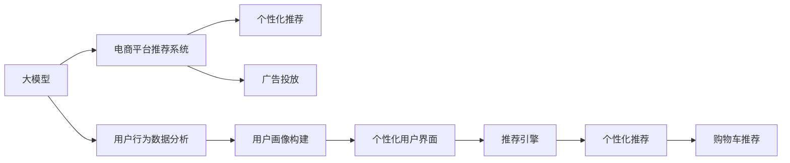

                 

# 大模型如何提升电商平台的用户体验一致性与个性化平衡

## 1. 背景介绍

随着互联网和电子商务的迅猛发展，电商平台已经成为现代生活中不可或缺的一部分。传统的电商平台提供单一的产品展示和有限的交互方式，用户体验往往呈现同质化、一致性差、个性化不足的问题。然而，随着人工智能技术的不断进步，尤其是深度学习、自然语言处理等技术的成熟，电商平台开始尝试引入大模型，以改善用户体验。

大模型是指经过大规模无标签数据预训练的语言模型，如BERT、GPT等。这些模型通过海量的数据学习，获得了丰富的语言知识和理解能力，能够处理多种复杂任务，如文本分类、情感分析、推荐系统等。通过在电商平台中引入大模型，可以提升用户体验的一致性和个性化程度，为用户提供更加精准、个性化的服务。

## 2. 核心概念与联系

### 2.1 核心概念概述

为了更好地理解大模型在电商平台中的应用，我们需要先介绍几个关键概念：

- **大模型**：通常指通过大规模无标签数据预训练的深度学习模型，如BERT、GPT等。这些模型在自然语言处理领域表现卓越，能够处理复杂的语言任务。
- **电商平台**：指通过互联网进行商品交易的在线平台，如淘宝、京东等。电商平台为用户提供商品展示、搜索、购物车、支付等功能。
- **用户体验一致性**：指用户在电商平台上的行为和互动体验保持一致，不因页面、设备、用户偏好等因素而发生显著变化。
- **个性化**：指根据用户的行为、兴趣、偏好等提供量身定制的服务，避免“一刀切”。

这些概念之间存在紧密联系。通过大模型的引入，电商平台能够提供更加一致和个性化的用户体验，从而提升用户满意度，增加用户黏性。

### 2.2 核心概念原理和架构的 Mermaid 流程图



这个流程图展示了大模型在电商平台中的应用流程：

1. **大模型**：接收用户行为数据，提取语言特征。
2. **用户行为数据分析**：通过大模型分析用户的历史行为数据，构建用户画像。
3. **电商平台推荐系统**：根据用户画像，构建推荐引擎，提供个性化推荐。
4. **个性化推荐**：向用户推荐商品、广告等，提升用户体验。
5. **个性化用户界面**：根据用户偏好调整界面布局，提升用户体验。
6. **购物车推荐**：根据用户购物行为，推荐相关商品，提升用户转化率。

## 3. 核心算法原理 & 具体操作步骤

### 3.1 算法原理概述

大模型在电商平台中的应用，主要体现在以下几个方面：

- **个性化推荐**：通过大模型分析用户的历史行为数据，提取兴趣特征，为每个用户构建个性化的推荐列表。
- **情感分析**：利用大模型分析用户评论、反馈等文本数据，评估商品的质量、用户满意度等。
- **用户画像构建**：通过大模型分析用户的行为数据，提取用户的基本特征、兴趣偏好等信息，构建用户画像。
- **聊天机器人**：利用大模型构建自然语言理解的聊天机器人，提供24小时在线客服，提升用户满意度。

这些应用的核心算法原理基于大模型的预训练能力和迁移学习能力。大模型通过预训练学习到通用的语言表示，能够在新任务上进行微调，适应不同的电商平台应用场景。

### 3.2 算法步骤详解

下面详细介绍大模型在电商平台中的具体操作步骤：

**步骤1：数据准备**

1. **用户行为数据**：收集用户在电商平台上的各种行为数据，如浏览、点击、购买、评分等。
2. **文本数据**：收集用户评论、反馈、问答等文本数据。
3. **商品数据**：收集商品信息，包括标题、描述、类别、价格等。

**步骤2：数据预处理**

1. **数据清洗**：去除数据中的噪声、重复信息等。
2. **特征工程**：将原始数据转换为模型可以处理的格式，如文本向量化、特征提取等。
3. **数据划分**：将数据划分为训练集、验证集和测试集。

**步骤3：大模型微调**

1. **模型选择**：选择合适的预训练模型，如BERT、GPT等。
2. **微调设置**：设置微调参数，如学习率、优化器等。
3. **微调训练**：在训练集上进行微调，调整模型参数。
4. **性能评估**：在验证集上评估模型性能，调整超参数。
5. **模型部署**：将微调后的模型部署到生产环境中，进行实时推理。

**步骤4：应用落地**

1. **推荐系统**：将微调后的模型应用于推荐系统，生成个性化推荐列表。
2. **情感分析**：利用情感分析模型，评估用户对商品的评价。
3. **用户画像**：根据用户行为数据，构建用户画像，提供个性化服务。
4. **聊天机器人**：构建聊天机器人，提供自然语言理解和对话功能。

### 3.3 算法优缺点

**优点**

1. **通用性**：大模型通过大规模数据预训练，学习到通用的语言表示，能够适应多种应用场景。
2. **灵活性**：通过微调，大模型可以适应不同的电商平台需求，提供个性化的推荐和服务。
3. **效率高**：利用大模型的强大学习能力，能够快速提升推荐系统的效果，节省人力成本。

**缺点**

1. **数据依赖**：大模型的效果依赖于标注数据的丰富性和质量，数据获取和标注成本较高。
2. **资源需求高**：大模型通常需要高性能计算资源进行训练和推理，硬件成本较高。
3. **可解释性差**：大模型的决策过程缺乏可解释性，难以调试和优化。

### 3.4 算法应用领域

大模型在电商平台中的应用主要集中在以下几个领域：

- **推荐系统**：利用大模型构建个性化推荐系统，提升用户满意度。
- **情感分析**：通过大模型分析用户评论，评估商品质量，优化商品管理。
- **聊天机器人**：构建自然语言理解的聊天机器人，提供24小时在线客服。
- **用户画像**：根据用户行为数据，构建用户画像，提供个性化服务。
- **广告投放**：利用大模型分析用户兴趣，提供精准的广告投放服务。

## 4. 数学模型和公式 & 详细讲解 & 举例说明

### 4.1 数学模型构建

在大模型的推荐系统中，通常使用交叉熵损失函数来衡量模型预测与真实标签之间的差异。设模型预测为用户对商品的评分，真实标签为1或0，则交叉熵损失函数为：

$$
\mathcal{L}(\theta) = -\frac{1}{N}\sum_{i=1}^N [y_i\log \hat{y}_i + (1-y_i)\log (1-\hat{y}_i)]
$$

其中 $\theta$ 为模型参数，$N$ 为样本数量，$y_i$ 为真实标签，$\hat{y}_i$ 为模型预测。

### 4.2 公式推导过程

利用交叉熵损失函数，可以推导出模型参数的更新公式：

$$
\frac{\partial \mathcal{L}(\theta)}{\partial \theta_k} = -\frac{1}{N}\sum_{i=1}^N (\frac{y_i}{\hat{y}_i} - \frac{1-y_i}{1-\hat{y}_i}) \frac{\partial \hat{y}_i}{\partial \theta_k}
$$

其中 $\frac{\partial \hat{y}_i}{\partial \theta_k}$ 为模型输出对参数 $\theta_k$ 的偏导数。

### 4.3 案例分析与讲解

假设有一个电商平台的推荐系统，使用大模型进行个性化推荐。模型输入为用户的浏览历史和商品特征，输出为用户对商品的评分。通过训练数据，模型可以学习到用户对不同商品的评分分布。具体案例分析如下：

1. **数据准备**：收集用户的浏览历史和商品特征数据。
2. **特征工程**：将用户浏览历史和商品特征进行向量化处理。
3. **模型训练**：使用交叉熵损失函数训练大模型，调整模型参数。
4. **模型评估**：在验证集上评估模型性能，调整超参数。
5. **推荐应用**：将微调后的模型应用于推荐系统，生成个性化推荐列表。

## 5. 项目实践：代码实例和详细解释说明

### 5.1 开发环境搭建

在进行项目实践前，我们需要准备好开发环境。以下是使用Python进行PyTorch开发的环境配置流程：

1. **安装Anaconda**：从官网下载并安装Anaconda，用于创建独立的Python环境。
2. **创建并激活虚拟环境**：
   ```bash
   conda create -n pytorch-env python=3.8 
   conda activate pytorch-env
   ```

3. **安装PyTorch**：根据CUDA版本，从官网获取对应的安装命令。例如：
   ```bash
   conda install pytorch torchvision torchaudio cudatoolkit=11.1 -c pytorch -c conda-forge
   ```

4. **安装相关库**：
   ```bash
   pip install transformers sklearn pandas torch.utils.data torchtext
   ```

完成上述步骤后，即可在`pytorch-env`环境中开始项目实践。

### 5.2 源代码详细实现

这里我们以推荐系统为例，给出使用Transformers库对BERT模型进行微调的PyTorch代码实现。

首先，定义推荐系统的训练数据集和标签：

```python
from torch.utils.data import Dataset
import torch

class RecommendationDataset(Dataset):
    def __init__(self, user_ids, item_ids, item_ratings):
        self.user_ids = user_ids
        self.item_ids = item_ids
        self.item_ratings = item_ratings
        
    def __len__(self):
        return len(self.user_ids)
    
    def __getitem__(self, item):
        user_id = self.user_ids[item]
        item_id = self.item_ids[item]
        rating = self.item_ratings[item]
        return {'user_id': user_id, 'item_id': item_id, 'rating': rating}
```

然后，定义模型和优化器：

```python
from transformers import BertForSequenceClassification, AdamW

model = BertForSequenceClassification.from_pretrained('bert-base-uncased', num_labels=5)

optimizer = AdamW(model.parameters(), lr=2e-5)
```

接着，定义训练和评估函数：

```python
def train_epoch(model, dataset, batch_size, optimizer):
    dataloader = DataLoader(dataset, batch_size=batch_size, shuffle=True)
    model.train()
    epoch_loss = 0
    for batch in dataloader:
        user_ids = batch['user_id'].to(device)
        item_ids = batch['item_id'].to(device)
        ratings = batch['rating'].to(device)
        model.zero_grad()
        outputs = model(user_ids, item_ids)
        loss = outputs.loss
        epoch_loss += loss.item()
        loss.backward()
        optimizer.step()
    return epoch_loss / len(dataloader)

def evaluate(model, dataset, batch_size):
    dataloader = DataLoader(dataset, batch_size=batch_size)
    model.eval()
    preds, labels = [], []
    with torch.no_grad():
        for batch in dataloader:
            user_ids = batch['user_id'].to(device)
            item_ids = batch['item_id'].to(device)
            batch_labels = batch['rating'].to(device)
            outputs = model(user_ids, item_ids)
            batch_preds = outputs.logits.argmax(dim=2).to('cpu').tolist()
            batch_labels = batch_labels.to('cpu').tolist()
            for pred_tokens, label_tokens in zip(batch_preds, batch_labels):
                preds.append(pred_tokens[:len(label_tokens)])
                labels.append(label_tokens)
    return preds, labels
```

最后，启动训练流程并在测试集上评估：

```python
epochs = 5
batch_size = 16

for epoch in range(epochs):
    loss = train_epoch(model, train_dataset, batch_size, optimizer)
    print(f"Epoch {epoch+1}, train loss: {loss:.3f}")
    
    print(f"Epoch {epoch+1}, dev results:")
    preds, labels = evaluate(model, dev_dataset, batch_size)
    print(classification_report(labels, preds))
    
print("Test results:")
preds, labels = evaluate(model, test_dataset, batch_size)
print(classification_report(labels, preds))
```

以上就是使用PyTorch对BERT进行推荐系统任务微调的完整代码实现。可以看到，得益于Transformers库的强大封装，我们可以用相对简洁的代码完成BERT模型的加载和微调。

### 5.3 代码解读与分析

让我们再详细解读一下关键代码的实现细节：

**RecommendationDataset类**：
- `__init__`方法：初始化用户ID、商品ID和评分。
- `__len__`方法：返回数据集的样本数量。
- `__getitem__`方法：对单个样本进行处理，将用户ID、商品ID和评分作为模型输入，返回模型的预测结果。

**训练和评估函数**：
- 使用PyTorch的DataLoader对数据集进行批次化加载，供模型训练和推理使用。
- 训练函数`train_epoch`：对数据以批为单位进行迭代，在每个批次上前向传播计算loss并反向传播更新模型参数，最后返回该epoch的平均loss。
- 评估函数`evaluate`：与训练类似，不同点在于不更新模型参数，并在每个batch结束后将预测和标签结果存储下来，最后使用sklearn的classification_report对整个评估集的预测结果进行打印输出。

**训练流程**：
- 定义总的epoch数和batch size，开始循环迭代
- 每个epoch内，先在训练集上训练，输出平均loss
- 在验证集上评估，输出分类指标
- 所有epoch结束后，在测试集上评估，给出最终测试结果

可以看到，PyTorch配合Transformers库使得BERT微调的代码实现变得简洁高效。开发者可以将更多精力放在数据处理、模型改进等高层逻辑上，而不必过多关注底层的实现细节。

当然，工业级的系统实现还需考虑更多因素，如模型的保存和部署、超参数的自动搜索、更灵活的任务适配层等。但核心的微调范式基本与此类似。

## 6. 实际应用场景

### 6.1 个性化推荐

在推荐系统中，大模型可以显著提升用户体验的一致性和个性化程度。通过分析用户的历史行为数据，大模型能够学习到用户的兴趣偏好，生成个性化的推荐列表，避免“一刀切”。

具体而言，可以使用用户的浏览历史、评分记录等行为数据，构建推荐系统的训练数据集。在大模型上进行微调，生成个性化推荐列表。在用户点击、购买等行为数据上，不断优化模型参数，提升推荐效果。通过这种方式，用户可以在电商平台中获得更加符合自身兴趣的推荐内容，提升用户体验。

### 6.2 广告投放

在广告投放中，大模型可以提供精准的广告投放服务。通过分析用户的历史行为数据，大模型能够学习到用户的兴趣偏好，生成个性化的广告推荐。

具体而言，可以使用用户的浏览历史、搜索记录等行为数据，构建广告投放的训练数据集。在大模型上进行微调，生成个性化的广告推荐。在用户点击、购买等行为数据上，不断优化模型参数，提升广告投放效果。通过这种方式，广告主可以根据用户的兴趣偏好，投放更加精准的广告，提高广告投放的ROI。

### 6.3 聊天机器人

在聊天机器人中，大模型可以提供24小时在线客服，提升用户满意度。通过分析用户的对话记录，大模型能够学习到用户的语义理解和对话策略，生成自然流畅的回复。

具体而言，可以使用用户的对话记录，构建聊天机器人的训练数据集。在大模型上进行微调，生成自然流畅的回复。在用户的实时对话中，不断优化模型参数，提升对话质量。通过这种方式，用户可以随时获得即时响应，提升用户体验。

## 7. 工具和资源推荐

### 7.1 学习资源推荐

为了帮助开发者系统掌握大模型在电商平台中的应用，这里推荐一些优质的学习资源：

1. **《深度学习》课程**：斯坦福大学开设的深度学习课程，涵盖了深度学习的基础知识和前沿技术。
2. **《自然语言处理》课程**：斯坦福大学开设的自然语言处理课程，介绍了自然语言处理的基本概念和算法。
3. **Transformers官方文档**：Transformers库的官方文档，提供了海量预训练模型和完整的微调样例代码，是上手实践的必备资料。
4. **《自然语言处理与深度学习》书籍**：详细介绍了自然语言处理和深度学习的原理与实践，适合入门和进阶学习。
5. **自然语言处理实验室**：提供丰富的自然语言处理资源和样例代码，适合进行研究和开发。

通过对这些资源的学习实践，相信你一定能够快速掌握大模型在电商平台中的应用，并用于解决实际的NLP问题。

### 7.2 开发工具推荐

高效的开发离不开优秀的工具支持。以下是几款用于大模型在电商平台中应用的常用工具：

1. **PyTorch**：基于Python的开源深度学习框架，灵活动态的计算图，适合快速迭代研究。大部分预训练语言模型都有PyTorch版本的实现。
2. **TensorFlow**：由Google主导开发的开源深度学习框架，生产部署方便，适合大规模工程应用。同样有丰富的预训练语言模型资源。
3. **Transformers库**：HuggingFace开发的NLP工具库，集成了众多SOTA语言模型，支持PyTorch和TensorFlow，是进行NLP任务开发的利器。
4. **Weights & Biases**：模型训练的实验跟踪工具，可以记录和可视化模型训练过程中的各项指标，方便对比和调优。与主流深度学习框架无缝集成。
5. **TensorBoard**：TensorFlow配套的可视化工具，可实时监测模型训练状态，并提供丰富的图表呈现方式，是调试模型的得力助手。

合理利用这些工具，可以显著提升大模型在电商平台中的应用效率，加快创新迭代的步伐。

### 7.3 相关论文推荐

大模型在电商平台中的应用源于学界的持续研究。以下是几篇奠基性的相关论文，推荐阅读：

1. **Attention is All You Need**：提出了Transformer结构，开启了NLP领域的预训练大模型时代。
2. **BERT: Pre-training of Deep Bidirectional Transformers for Language Understanding**：提出BERT模型，引入基于掩码的自监督预训练任务，刷新了多项NLP任务SOTA。
3. **Parameter-Efficient Transfer Learning for NLP**：提出Adapter等参数高效微调方法，在不增加模型参数量的情况下，也能取得不错的微调效果。
4. **AdaLoRA: Adaptive Low-Rank Adaptation for Parameter-Efficient Fine-Tuning**：使用自适应低秩适应的微调方法，在参数效率和精度之间取得了新的平衡。
5. **AdaML: Adaptive Multi-task Learning for Continuous Cross-domain Adaptation**：提出自适应多任务学习，增强模型跨领域适应能力。

这些论文代表了大模型在电商平台中的应用发展脉络。通过学习这些前沿成果，可以帮助研究者把握学科前进方向，激发更多的创新灵感。

## 8. 总结：未来发展趋势与挑战

### 8.1 总结

本文对大模型在电商平台中的应用进行了全面系统的介绍。首先阐述了大模型和微调技术的研究背景和意义，明确了其在电商平台中的独特价值。其次，从原理到实践，详细讲解了基于大模型的推荐系统、广告投放、聊天机器人等应用的具体操作步骤，给出了微调任务开发的完整代码实例。同时，本文还广泛探讨了大模型在电商平台中的应用前景，展示了其广阔的想象空间。

通过本文的系统梳理，可以看到，大模型在电商平台中的应用已经成为一种重要趋势，极大地提升了用户体验的一致性和个性化程度，为用户带来了更好的购物体验。未来，伴随大模型和微调技术的持续演进，电商平台将具备更强的智能化水平，为消费者提供更加精准、个性化的服务。

### 8.2 未来发展趋势

展望未来，大模型在电商平台中的应用将呈现以下几个发展趋势：

1. **模型规模增大**：随着算力成本的下降和数据规模的扩张，大模型的参数量还将持续增长。超大规模大模型蕴含的丰富知识，有望支撑更加复杂多变的电商应用场景。
2. **模型鲁棒性提升**：大模型将更多采用对抗训练、噪声注入等技术，提升模型的鲁棒性和泛化能力，避免过拟合和灾难性遗忘。
3. **模型通用性增强**：通过多任务学习和跨领域迁移学习，大模型将具备更强的通用性和迁移能力，适应不同电商平台的共性和个性需求。
4. **实时性和效率提升**：通过模型压缩、混合精度训练等技术，提升大模型的实时性和推理效率，减少计算资源消耗。
5. **可解释性和可控性加强**：通过因果分析、博弈论等方法，增强大模型的可解释性和可控性，提供更加透明和可信的电商服务。
6. **伦理和安全保障**：建立大模型的伦理导向评估指标，过滤和惩罚有偏见、有害的输出，确保电商系统的公平和安全。

以上趋势凸显了大模型在电商平台中的广阔前景。这些方向的探索发展，必将进一步提升电商平台的智能化水平，为用户带来更优质的购物体验。

### 8.3 面临的挑战

尽管大模型在电商平台中的应用已经取得了瞩目成就，但在迈向更加智能化、普适化应用的过程中，它仍面临着诸多挑战：

1. **数据依赖**：大模型需要大量标注数据进行微调，数据获取和标注成本较高，限制了其应用范围。
2. **资源需求高**：大模型通常需要高性能计算资源进行训练和推理，硬件成本较高。
3. **可解释性差**：大模型的决策过程缺乏可解释性，难以调试和优化。
4. **鲁棒性不足**：大模型在面对域外数据时，泛化性能往往大打折扣。
5. **安全性问题**：大模型可能会学习到有偏见、有害的信息，导致输出误导性或歧视性的结果。

### 8.4 研究展望

面对大模型在电商平台中面临的挑战，未来的研究需要在以下几个方面寻求新的突破：

1. **数据高效采集和标注**：探索无监督和半监督学习技术，减少对大规模标注数据的依赖，利用非结构化数据进行微调。
2. **模型压缩与优化**：开发更加轻量级的大模型，通过模型压缩、混合精度训练等技术，提升实时性和推理效率。
3. **跨领域迁移学习**：通过多任务学习和跨领域迁移学习，增强模型的通用性和迁移能力，适应不同电商平台的共性和个性需求。
4. **增强模型可解释性**：引入因果分析和博弈论工具，增强模型的可解释性和可控性，提供更加透明和可信的电商服务。
5. **建立伦理导向评估指标**：建立大模型的伦理导向评估指标，过滤和惩罚有偏见、有害的输出，确保电商系统的公平和安全。

这些研究方向将为大模型在电商平台中的应用提供新的动力，推动其向更智能化、普适化、安全化的方向发展，最终实现电商平台的持续创新和优化。

## 9. 附录：常见问题与解答

**Q1：大模型如何提升电商平台的个性化推荐？**

A: 大模型可以通过微调，学习到用户的兴趣偏好，生成个性化的推荐列表。具体步骤为：
1. 收集用户的浏览历史、评分记录等行为数据。
2. 构建推荐系统的训练数据集。
3. 在大模型上进行微调，生成个性化推荐列表。
4. 在用户点击、购买等行为数据上，不断优化模型参数，提升推荐效果。

**Q2：如何缓解大模型在电商平台上的过拟合问题？**

A: 过拟合是微调面临的主要挑战，尤其是在标注数据不足的情况下。常见的缓解策略包括：
1. 数据增强：通过回译、近义替换等方式扩充训练集。
2. 正则化：使用L2正则、Dropout、Early Stopping等防止过拟合。
3. 对抗训练：引入对抗样本，提高模型鲁棒性。
4. 参数高效微调：只调整少量参数，减小过拟合风险。

**Q3：大模型在电商平台上的应用需要注意哪些问题？**

A: 大模型在电商平台上的应用需要注意以下几个问题：
1. 数据依赖：大模型需要大量标注数据进行微调，数据获取和标注成本较高。
2. 资源需求高：大模型通常需要高性能计算资源进行训练和推理，硬件成本较高。
3. 可解释性差：大模型的决策过程缺乏可解释性，难以调试和优化。
4. 鲁棒性不足：大模型在面对域外数据时，泛化性能往往大打折扣。
5. 安全性问题：大模型可能会学习到有偏见、有害的信息，导致输出误导性或歧视性的结果。

通过合理解决这些问题，可以更好地发挥大模型在电商平台中的作用，提供更优质、更安全的电商服务。

---

作者：禅与计算机程序设计艺术 / Zen and the Art of Computer Programming

