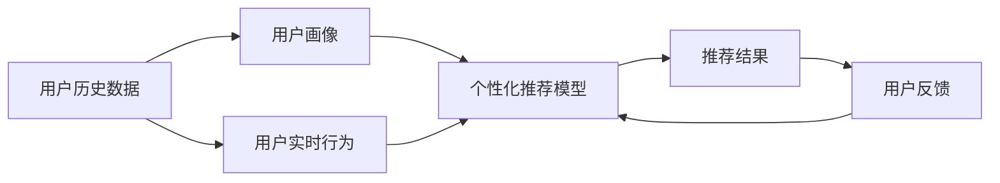

                 

# 大模型如何提升电商平台的用户体验个性化

> 关键词：大模型, 用户行为分析, 推荐系统, 个性化推荐, 电商数据分析, 用户画像, 深度学习, 自然语言处理

## 1. 背景介绍

随着电商行业的迅猛发展，用户日益增加的个性化需求成为电商平台持续提升用户体验的重大挑战。传统基于规则和统计的推荐系统已经难以满足用户的复杂偏好和动态变化，大模型的出现提供了全新的解决方案。通过分析用户的历史行为数据，大模型可以深度学习用户的兴趣偏好，并能够实时动态更新，从而大幅提升个性化推荐的质量。

本文章将详细阐述大模型在电商平台中的具体应用，从背景、原理、实践和未来展望等多个角度探讨如何利用大模型技术，构建用户画像，深入分析用户行为，实现个性化推荐，从而显著提升电商平台的用户体验。

## 2. 核心概念与联系

### 2.1 核心概念概述

为更好理解大模型在电商平台中的应用，本节将详细介绍几个关键概念及其相互之间的联系：

- **大模型**：即预训练语言模型(如BERT, GPT系列)和大规模卷积神经网络等深度学习模型。通过在大规模数据上进行自监督预训练，学习通用知识表示，具备强大的泛化能力。
- **推荐系统**：旨在根据用户的历史行为和实时数据，推荐最符合用户需求的商品或内容，从而提升用户体验和转化率。
- **个性化推荐**：根据每个用户的具体需求和兴趣，推荐个性化的商品或内容，实现从海量数据中提取对用户最有价值的信息。
- **用户行为分析**：通过分析用户在电商平台的浏览、购买、评价等行为，提取用户的兴趣偏好和需求模式。
- **用户画像**：综合多维度的用户信息，构建详细且动态的个体用户模型，用于个性化推荐和后续的精准营销。
- **深度学习**：利用多层神经网络进行复杂的特征提取和模式识别，实现对非结构化数据的深度挖掘。
- **自然语言处理**：以计算机为基础，通过让计算机理解、解释和运用人类语言，实现人机交互的智能化。

这些概念之间紧密关联，通过深度学习技术对用户行为进行分析，构建用户画像，最终借助大模型进行个性化推荐，从而大幅提升电商平台的用户体验。

### 2.2 核心概念原理和架构的 Mermaid 流程图



此流程图展示了用户行为分析、用户画像、个性化推荐模型和推荐结果之间的联系。用户历史数据和实时行为被用于构建用户画像，并输入到个性化推荐模型中，输出个性化推荐结果。用户反馈进一步优化推荐模型，形成闭环。

## 3. 核心算法原理 & 具体操作步骤

### 3.1 算法原理概述

大模型在电商平台中的应用主要体现在用户画像的构建和个性化推荐两个方面。用户画像的构建需要从用户历史数据和实时行为中提取关键特征，并利用大模型进行模式学习和知识表示。个性化推荐则通过大模型对用户画像进行实时分析，从电商平台上筛选出符合用户需求的推荐结果。

### 3.2 算法步骤详解

#### 3.2.1 用户画像构建

1. **数据收集**：从电商平台后台收集用户的历史行为数据，如浏览记录、购买历史、评价信息等。确保数据的全面性和时效性，以便构建精准的用户画像。

2. **特征提取**：利用大模型或机器学习算法，从收集到的数据中提取关键特征，如用户兴趣、偏好、购买力等。常用的特征提取方法包括文本分析、情感分析、行为轨迹分析等。

3. **用户画像生成**：将提取的特征输入大模型进行学习，构建详尽的个体用户模型。常用的用户画像生成方法包括协同过滤、聚类分析、深度神经网络等。

#### 3.2.2 个性化推荐

1. **相似度计算**：基于用户画像，计算用户之间的相似度，找出与当前用户兴趣最接近的用户群体。常用的相似度计算方法包括余弦相似度、皮尔逊相关系数、Jaccard指数等。

2. **推荐结果筛选**：从电商平台中筛选出符合当前用户兴趣的商品或内容，进行排序和推荐。推荐结果的排序方法包括基于内容的排序、基于协同过滤的排序、基于深度学习的排序等。

3. **动态更新**：实时接收用户的行为数据，对用户画像和推荐模型进行动态更新，确保推荐结果的时效性和精准性。

### 3.3 算法优缺点

#### 3.3.1 优点

1. **高性能**：大模型具备强大的泛化能力和知识表示能力，通过深度学习可以处理复杂的非结构化数据，实现对用户行为的深度理解。

2. **灵活性**：用户画像和个性化推荐模型的构建具有高度的灵活性，可以根据电商平台的业务需求，灵活调整特征提取和推荐算法。

3. **实时性**：利用大模型可以实时分析用户行为，动态更新用户画像和推荐结果，确保推荐的时效性和精准性。

4. **可扩展性**：随着数据量的增加和模型的优化，可以不断提升个性化推荐的性能和覆盖率，满足用户多样化的需求。

#### 3.3.2 缺点

1. **计算资源需求高**：大模型的训练和推理需要大量的计算资源和存储空间，对电商平台的技术架构提出了较高要求。

2. **模型复杂度**：大模型结构复杂，参数众多，需要进行合理的特征选择和模型优化，以避免过拟合和计算资源的浪费。

3. **数据隐私问题**：用户数据的收集和分析涉及隐私问题，需要采取有效的数据保护措施，确保用户信息的安全。

4. **模型解释性不足**：大模型通常被视为"黑箱"，难以解释其内部的决策逻辑，需要进一步研究模型的可解释性和可解释性增强技术。

### 3.4 算法应用领域

大模型在电商平台的个性化推荐中有着广泛的应用：

- **用户画像构建**：用于分析和预测用户的兴趣和需求，构建详尽的个体用户模型。
- **行为分析**：用于理解用户在电商平台上的行为模式，提供定制化的内容推荐。
- **推荐系统优化**：用于提升推荐系统的效果，构建更加高效、精准的推荐算法。
- **智能客服**：用于实时回答用户疑问，提升用户体验和平台运营效率。
- **商品分类**：用于对商品进行分类和标签管理，提升搜索和推荐效果。
- **异常检测**：用于检测用户行为中的异常，及时采取措施，防范欺诈和风险。

## 4. 数学模型和公式 & 详细讲解 & 举例说明

### 4.1 数学模型构建

假设用户历史行为数据集为 $D=\{(x_i,y_i)\}_{i=1}^N$，其中 $x_i$ 表示用户的行为序列，$y_i$ 表示用户的行为标签（如购买、浏览、评价等）。定义用户画像的数学模型为 $P=\{p_1,p_2,\cdots,p_k\}$，其中 $p_i$ 表示第 $i$ 个特征向量。

### 4.2 公式推导过程

假设大模型为 $M_{\theta}$，其中 $\theta$ 为模型参数。用户画像 $P$ 经过大模型 $M_{\theta}$ 的编码，得到用户特征向量 $\vec{v}$。设用户行为标签为 $y$，根据softmax函数，模型对用户行为预测的概率为：

$$
\hat{y}_i = softmax(M_{\theta}(\vec{v}_i)) \propto \exp(M_{\theta}(\vec{v}_i))
$$

其中 $softmax$ 函数将模型输出的原始值转化为概率分布，表示用户 $i$ 在不同行为标签下的概率。

### 4.3 案例分析与讲解

以电商平台的个性化推荐为例，我们分析如何通过大模型构建用户画像并进行推荐。首先，从电商平台后台收集用户历史行为数据，利用大模型对这些数据进行编码，得到用户画像 $P$。然后，使用大模型对用户画像进行编码，得到用户特征向量 $\vec{v}$。最后，根据模型预测的概率，从电商平台中筛选出符合用户需求的商品进行推荐。

## 5. 项目实践：代码实例和详细解释说明

### 5.1 开发环境搭建

在进行项目实践前，我们需要准备开发环境：

1. **安装 Python**：确保系统已安装 Python 3.7 或更高版本。

2. **安装 PyTorch**：通过 pip 安装 PyTorch 深度学习框架。

3. **安装 Transformers 库**：通过 pip 安装 Hugging Face 的 Transformers 库。

4. **安装相关工具**：安装 pandas、numpy、matplotlib 等常用的数据处理和可视化工具。

### 5.2 源代码详细实现

以下是一个基于 PyTorch 的简单示例代码，用于电商平台的个性化推荐。

```python
import torch
import torch.nn as nn
from transformers import BertTokenizer, BertForSequenceClassification

# 定义 BERT 分类器
class BERTClassifier(nn.Module):
    def __init__(self, n_classes):
        super(BERTClassifier, self).__init__()
        self.bert = BertForSequenceClassification.from_pretrained('bert-base-uncased', num_labels=n_classes)
        
    def forward(self, input_ids, attention_mask):
        return self.bert(input_ids, attention_mask=attention_mask)
        
# 初始化模型
device = torch.device("cuda" if torch.cuda.is_available() else "cpu")
model = BERTClassifier(n_classes).to(device)

# 定义损失函数和优化器
criterion = nn.CrossEntropyLoss()
optimizer = torch.optim.Adam(model.parameters(), lr=2e-5)

# 训练函数
def train_epoch(model, train_data, optimizer, criterion):
    model.train()
    for data, target in train_data:
        input_ids = data['input_ids'].to(device)
        attention_mask = data['attention_mask'].to(device)
        output = model(input_ids, attention_mask=attention_mask)
        loss = criterion(output, target)
        optimizer.zero_grad()
        loss.backward()
        optimizer.step()
        
# 测试函数
def evaluate(model, test_data, criterion):
    model.eval()
    total_loss = 0
    with torch.no_grad():
        for data, target in test_data:
            input_ids = data['input_ids'].to(device)
            attention_mask = data['attention_mask'].to(device)
            output = model(input_ids, attention_mask=attention_mask)
            total_loss += criterion(output, target).item()
    return total_loss / len(test_data)
        
# 加载数据
train_data = ...
test_data = ...

# 训练模型
epochs = 5
for epoch in range(epochs):
    train_epoch(model, train_data, optimizer, criterion)
    test_loss = evaluate(model, test_data, criterion)
    print(f"Epoch {epoch+1}, test loss: {test_loss:.3f}")
```

此代码实现了基于 BERT 的序列分类模型，可用于电商平台的个性化推荐。首先定义了一个 BERT 分类器，并初始化模型、损失函数和优化器。然后定义了训练和测试函数，最后加载数据，进行模型训练和测试。

### 5.3 代码解读与分析

本节详细解读代码实现的关键部分：

- **BERTClassifier 类**：定义了一个继承自 nn.Module 的 BERT 分类器，用于进行序列分类任务。
- **训练函数 train_epoch**：在每个 epoch 中，通过前向传播和反向传播更新模型参数，最小化损失函数。
- **测试函数 evaluate**：在测试集上评估模型性能，计算模型在所有测试样本上的平均损失。
- **数据加载**：使用 PyTorch 的 DataLoader 对数据进行批处理和迭代，供模型训练和推理使用。

## 6. 实际应用场景

### 6.1 智能客服系统

在智能客服系统中，大模型可以用于处理用户查询，提供个性化的客服解答。通过分析用户的历史查询记录，构建用户画像，再利用大模型进行查询匹配和回答生成，可以显著提升客服系统的响应速度和用户满意度。

### 6.2 推荐系统优化

大模型可以用于优化推荐系统中的用户画像和推荐算法，提升推荐的个性化程度和效果。通过分析用户的浏览记录、购买历史等行为数据，构建详尽的用户画像，再利用大模型进行相似度计算和推荐结果筛选，可以实时动态地生成符合用户需求的商品或内容推荐。

### 6.3 动态定价策略

电商平台上商品的动态定价策略可以通过大模型实现。通过分析用户画像和市场数据，大模型可以预测用户的购买意愿和支付能力，从而制定最优的价格策略，提升平台收入和用户满意度。

### 6.4 未来应用展望

未来，随着大模型的不断演进和优化，其将在电商平台的个性化推荐中发挥更大的作用。大模型不仅能够处理结构化数据，还能够理解非结构化数据，如用户评论、聊天记录等，进一步提升推荐效果。同时，大模型结合多模态数据的融合能力，可以实现视觉、语音等多模态信息的协同建模，拓展推荐系统的应用边界。

## 7. 工具和资源推荐

### 7.1 学习资源推荐

1. **《深度学习与自然语言处理》**：清华大学李斌教授的课程，介绍了深度学习的基本概念和 NLP 任务，包括用户行为分析、推荐系统等内容。
2. **《自然语言处理综述》**：斯坦福大学的 NLP 课程，涵盖自然语言处理的基础知识和前沿技术，推荐给对大模型感兴趣的读者。
3. **《Python 深度学习》**：深入浅出地介绍了深度学习的基本原理和实现方法，包括 PyTorch 的深度学习框架，适用于电商平台的实践开发。

### 7.2 开发工具推荐

1. **PyTorch**：深度学习框架，支持动态计算图和 GPU 加速，适用于大模型的训练和推理。
2. **Hugging Face Transformers**：基于 PyTorch 的 NLP 工具库，提供预训练模型和微调 API，方便用户快速开发和部署。
3. **TensorBoard**：可视化工具，用于实时监测模型的训练状态，提供详细的图表和指标分析。

### 7.3 相关论文推荐

1. **《深度学习在推荐系统中的应用》**：综述了深度学习在推荐系统中的应用现状和发展趋势，推荐给对大模型感兴趣的研究者。
2. **《大规模预训练语言模型在推荐系统中的应用》**：介绍了大模型在推荐系统中的具体应用方法和效果提升策略，值得深入阅读。
3. **《用户画像构建与个性化推荐研究》**：探讨了用户画像的构建方法和个性化推荐算法，提供了丰富的应用案例和实现思路。

## 8. 总结：未来发展趋势与挑战

### 8.1 研究成果总结

大模型在电商平台的用户体验个性化方面展现了强大的潜力，通过用户画像的构建和个性化推荐，显著提升了电商平台的推荐效果和用户满意度。大模型的应用还扩展到了智能客服、动态定价等更多领域，带来了显著的业务价值。

### 8.2 未来发展趋势

1. **多模态信息融合**：未来的推荐系统将更加注重多模态信息的融合，结合用户评论、聊天记录等非结构化数据，提升推荐效果。
2. **实时动态优化**：大模型将能够实时动态地更新用户画像和推荐模型，提升推荐的时效性和精准性。
3. **分布式训练**：随着数据量的增加，大模型的训练将需要分布式计算资源，提升训练效率和效果。
4. **模型解释性增强**：大模型的可解释性和可解释性增强技术将得到广泛应用，提升用户的信任度和接受度。
5. **隐私保护**：用户数据隐私保护将得到更多的关注，采用差分隐私、联邦学习等技术，保护用户信息安全。

### 8.3 面临的挑战

尽管大模型在电商平台中展现了强大的应用潜力，但也面临诸多挑战：

1. **计算资源需求高**：大模型的训练和推理需要大量的计算资源和存储空间，对电商平台的技术架构提出了较高要求。
2. **数据隐私问题**：用户数据的收集和分析涉及隐私问题，需要采取有效的数据保护措施，确保用户信息的安全。
3. **模型复杂度**：大模型结构复杂，参数众多，需要进行合理的特征选择和模型优化，以避免过拟合和计算资源的浪费。
4. **模型解释性不足**：大模型通常被视为"黑箱"，难以解释其内部的决策逻辑，需要进一步研究模型的可解释性和可解释性增强技术。

### 8.4 研究展望

未来的研究需要关注以下几个方面：

1. **模型压缩和优化**：研究如何通过模型压缩和优化技术，提升大模型的计算效率和推理速度。
2. **隐私保护技术**：研究如何利用差分隐私、联邦学习等技术，保护用户数据隐私，提升用户信任度。
3. **多模态数据融合**：研究如何结合用户评论、聊天记录等非结构化数据，提升推荐效果和用户体验。
4. **实时动态优化**：研究如何实时动态更新用户画像和推荐模型，提升推荐的时效性和精准性。
5. **模型解释性增强**：研究如何提升大模型的可解释性和可解释性增强技术，提升用户信任度。

总之，大模型在电商平台中的应用前景广阔，但还需要在计算资源、数据隐私、模型复杂度等方面进行深入研究，逐步克服挑战，推动电商平台的智能化升级。

## 9. 附录：常见问题与解答

**Q1：电商平台的推荐系统为什么需要大模型？**

A: 电商平台的推荐系统需要处理大量的非结构化数据，如用户评论、聊天记录等，而传统的推荐算法难以处理这些复杂的数据。大模型具备强大的知识表示和泛化能力，能够从海量数据中提取用户兴趣和需求，构建详尽的用户画像，实现个性化的推荐。

**Q2：大模型的训练和推理需要哪些计算资源？**

A: 大模型的训练和推理需要高性能 GPU 和 TPU，以及大容量的存储空间。此外，还需要分布式计算资源支持，以提高训练效率和处理海量数据的效率。

**Q3：如何保护用户数据隐私？**

A: 用户数据的隐私保护是电商平台的重要任务。可以通过差分隐私、联邦学习等技术，在保护用户隐私的前提下，进行模型训练和推理。同时，在数据收集和处理过程中，需要严格遵守隐私保护法律法规，确保用户信息的安全。

**Q4：大模型在电商平台的实际应用效果如何？**

A: 大模型在电商平台的实际应用效果显著。通过用户画像的构建和个性化推荐，电商平台能够显著提升推荐效果和用户满意度，实现更高的转化率和收入。

**Q5：大模型在电商平台的推荐系统中有哪些挑战？**

A: 大模型在电商平台的推荐系统中面临的挑战包括计算资源需求高、数据隐私问题、模型复杂度、模型解释性不足等。需要在技术架构、数据处理、模型优化等方面进行深入研究，逐步克服这些挑战，推动大模型在电商平台的广泛应用。

---

作者：禅与计算机程序设计艺术 / Zen and the Art of Computer Programming

