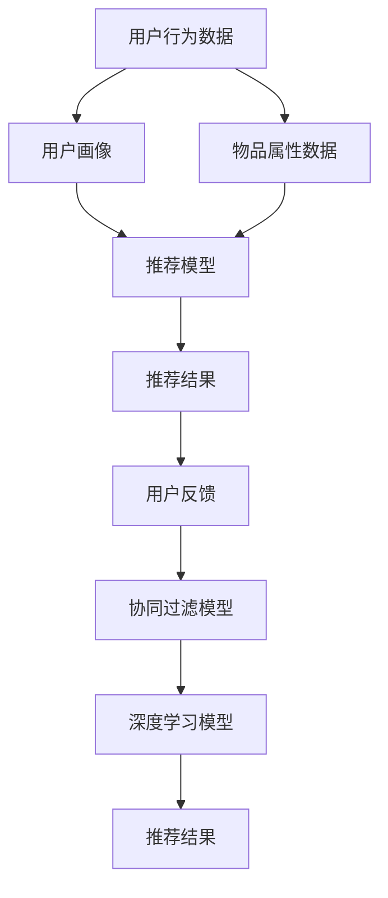

                 

# 大模型对推荐系统多样性的影响评估

> 关键词：推荐系统,大模型,多样性,协同过滤,深度学习,自然语言处理(NLP),嵌入空间,用户画像,偏好多样性

## 1. 背景介绍

随着互联网信息爆炸和个性化需求的增长，推荐系统已经成为现代互联网应用的核心引擎，为用户提供了信息发现和内容推荐的重要支持。传统的推荐算法主要基于协同过滤（Collaborative Filtering, CF），依赖于用户和物品的隐式反馈数据。然而，协同过滤模型往往面临数据稀疏性、冷启动等问题，难以有效挖掘长尾用户和物品的隐式偏好，从而限制了系统的推荐效果和用户满意度。

近年来，深度学习和大模型技术逐渐被引入推荐系统，带来了性能上的重大提升。特别是大模型技术，通过在海量数据上进行预训练，学习到丰富的用户和物品特征，显著提升了推荐模型的泛化能力和精度。然而，大模型技术在推荐系统中的应用仍存在诸多问题，其中推荐结果的多样性是一个重要的研究方向。

推荐结果的多样性指的是推荐系统中对用户请求所返回的推荐项集的多样性程度。多样性不仅反映了推荐系统的推荐策略，还对用户的推荐体验和满意度产生重要影响。高多样性的推荐结果能够更好地满足用户的多样化需求，提升用户的探索性和满意度。因此，在深度学习和大模型技术普及的背景下，如何评估和优化推荐系统多样性成为一个重要的研究课题。

本文将从深度学习和大模型的视角，深入探讨推荐系统多样性的影响因素和优化策略，提出一系列可行的解决方案，旨在提升推荐系统的推荐质量与用户满意度。

## 2. 核心概念与联系

### 2.1 核心概念概述

为更好地理解大模型对推荐系统多样性的影响，本节将介绍几个关键概念：

- **推荐系统**：通过分析用户历史行为数据和物品属性数据，为用户推荐可能感兴趣的新物品的系统。常见的推荐算法包括基于CF的算法、基于内容的推荐算法、混合推荐算法等。

- **协同过滤**：利用用户和物品的隐式反馈数据，通过挖掘用户行为模式和物品属性，为用户推荐类似物品或用户。主要分为基于用户的协同过滤和基于物品的协同过滤两种类型。

- **深度学习**：利用神经网络等深度学习模型，通过自动学习特征，提升推荐系统的性能。大模型是深度学习技术的重要分支，通过在大规模数据上进行预训练，学习到丰富的特征表示。

- **大模型**：指在巨大语料库上经过自监督学习训练的深度学习模型。大模型通过预训练获得通用特征表示，并在微调后应用于推荐系统等特定任务。

- **推荐结果多样性**：推荐系统在用户请求返回的推荐项集的多样性程度。包括推荐结果的种类数量、相关性等。

- **嵌入空间**：将用户和物品表示为高维向量，构建在向量空间中用户和物品的相似性关系。嵌入空间的多样性可以反映推荐结果的多样性。

- **用户画像**：根据用户历史行为数据，构建用户的多维度画像，用于预测用户偏好和行为。用户画像的多样性反映了用户的个性化程度。

这些核心概念之间通过一系列的数据和算法流程紧密关联，共同构成了推荐系统的工作原理和多样性优化方法。通过理解这些概念，我们可以更好地把握大模型在推荐系统中的应用及其优化策略。

### 2.2 核心概念原理和架构的 Mermaid 流程图



该流程图展示了推荐系统的主要数据和算法流程，说明了用户行为数据、物品属性数据、用户画像和推荐模型之间的关系，以及推荐结果和用户反馈如何通过协同过滤和深度学习模型得到优化。

## 3. 核心算法原理 & 具体操作步骤

### 3.1 算法原理概述

推荐系统多样性的优化，通常可以通过以下几种方式实现：

- **增加推荐结果数量**：通过增加推荐结果的数量，提高推荐结果的多样性。
- **调整推荐结果的相关性**：通过对推荐结果的相关性进行调整，提高推荐结果的多样性。
- **优化用户画像**：通过优化用户画像，提高用户画像的多样性，从而提升推荐结果的多样性。
- **引入多样性损失函数**：在推荐模型的损失函数中加入多样性损失，引导模型生成更多样化的推荐结果。

### 3.2 算法步骤详解

1. **数据预处理**：
   - 收集用户行为数据和物品属性数据。
   - 清洗数据，去除噪声和缺失值。
   - 构建用户画像和物品画像。

2. **模型训练**：
   - 使用协同过滤模型和深度学习模型，对用户画像和物品画像进行训练。
   - 使用深度学习模型进行推荐模型的预训练和微调。

3. **多样性评估**：
   - 计算推荐结果的多样性指标，如种类数量、覆盖率等。
   - 评估用户对推荐结果的多样性满意度。

4. **多样性优化**：
   - 增加推荐结果数量。
   - 调整推荐结果的相关性。
   - 优化用户画像。
   - 引入多样性损失函数。

### 3.3 算法优缺点

#### 优点：

1. **提升推荐质量**：多样性优化能够显著提升推荐系统的推荐效果和用户满意度。
2. **个性化推荐**：多样性优化能够更好地满足用户的个性化需求，提升用户的探索性和满意度。
3. **减少冷启动问题**：多样性优化能够解决协同过滤模型面临的冷启动问题。

#### 缺点：

1. **计算复杂度增加**：多样性优化需要额外计算多样性指标，增加了计算复杂度。
2. **模型复杂度增加**：多样性优化需要引入多样性损失函数和调整相关性，增加了模型复杂度。
3. **数据质量要求高**：多样性优化对数据质量要求高，需要保证数据完整性和准确性。

### 3.4 算法应用领域

大模型技术在推荐系统中的应用领域非常广泛，涵盖了电商、社交媒体、视频网站、音乐平台等多个垂直领域。以下是一些具体的应用案例：

1. **电商推荐系统**：使用大模型对用户历史行为数据和商品属性数据进行预训练和微调，提高推荐结果的多样性和准确性。
2. **社交媒体推荐系统**：使用大模型对用户动态数据和内容属性数据进行预训练和微调，提升用户的推荐体验和满意度。
3. **视频网站推荐系统**：使用大模型对用户历史观看数据和视频属性数据进行预训练和微调，提高视频推荐结果的多样性和相关性。
4. **音乐平台推荐系统**：使用大模型对用户历史听歌数据和歌曲属性数据进行预训练和微调，提升音乐推荐结果的多样性和相关性。

## 4. 数学模型和公式 & 详细讲解 & 举例说明

### 4.1 数学模型构建

推荐系统多样性的优化问题可以形式化为以下数学模型：

$$
\min_{\theta} \frac{1}{n} \sum_{i=1}^{n} \left( \log \sum_{j=1}^{m} \exp(-\delta_{i,j}) + \beta \log \left( \frac{\sum_{j=1}^{m} \exp(-\delta_{i,j})}{\sum_{j=1}^{m} \exp(-\delta_{i,j} + \delta'_{i,j})} \right) \right)
$$

其中，$\theta$ 为推荐模型的参数，$n$ 为用户数量，$m$ 为物品数量，$\delta_{i,j}$ 为物品 $j$ 对用户 $i$ 的推荐相关性，$\delta'_{i,j}$ 为物品 $j$ 对用户 $i$ 的推荐相关性，$\beta$ 为多样性系数，控制推荐结果的多样性和相关性之间的平衡。

### 4.2 公式推导过程

1. **推荐相关性**：
   - 推荐相关性 $\delta_{i,j}$ 可以表示为用户 $i$ 对物品 $j$ 的兴趣度与物品 $j$ 的属性相似度之和。
   - 使用向量表示用户和物品，即 $\delta_{i,j} = \vec{u}_i \cdot \vec{v}_j$，其中 $\vec{u}_i$ 为用户 $i$ 的向量表示，$\vec{v}_j$ 为物品 $j$ 的向量表示。

2. **多样性损失函数**：
   - 多样性损失函数 $L_{div}$ 可以表示为推荐结果的多样性与用户兴趣的多样性之和。
   - 使用基尼不纯度表示推荐结果的多样性，$L_{div} = \log \sum_{j=1}^{m} \exp(-\delta_{i,j})$。
   - 使用用户兴趣的多样性表示用户画像的多样性，$L_{div} = \log \left( \frac{\sum_{j=1}^{m} \exp(-\delta_{i,j})}{\sum_{j=1}^{m} \exp(-\delta'_{i,j})} \right)$，其中 $\delta'_{i,j}$ 为物品 $j$ 对用户 $i$ 的推荐相关性。

3. **优化目标函数**：
   - 优化目标函数 $L$ 可以表示为推荐相关性损失与多样性损失之和。
   - $L = \frac{1}{n} \sum_{i=1}^{n} \left( \log \sum_{j=1}^{m} \exp(-\delta_{i,j}) + \beta \log \left( \frac{\sum_{j=1}^{m} \exp(-\delta_{i,j})}{\sum_{j=1}^{m} \exp(-\delta'_{i,j})} \right) \right)$。

### 4.3 案例分析与讲解

以电商推荐系统为例，解释多样性优化对推荐结果的影响：

1. **用户画像构建**：
   - 对用户历史行为数据进行向量表示，得到用户向量 $\vec{u}_i$。
   - 对物品属性数据进行向量表示，得到物品向量 $\vec{v}_j$。

2. **推荐模型训练**：
   - 使用深度学习模型对用户画像和物品画像进行训练，得到推荐模型 $\theta$。
   - 在训练过程中，使用多样性损失函数 $L_{div}$ 引导模型生成更多样化的推荐结果。

3. **推荐结果生成**：
   - 对用户输入的查询进行向量表示，得到查询向量 $\vec{q}$。
   - 使用推荐模型 $\theta$ 计算物品向量与查询向量的相似度，生成推荐结果集。

4. **多样性评估**：
   - 计算推荐结果集的多样性指标，如种类数量、覆盖率等。
   - 评估用户对推荐结果的多样性满意度。

5. **多样性优化**：
   - 增加推荐结果数量。
   - 调整推荐结果的相关性。
   - 优化用户画像。
   - 引入多样性损失函数。

## 5. 项目实践：代码实例和详细解释说明

### 5.1 开发环境搭建

在进行推荐系统多样性优化实践前，我们需要准备好开发环境。以下是使用Python进行PyTorch开发的环境配置流程：

1. 安装Anaconda：从官网下载并安装Anaconda，用于创建独立的Python环境。

2. 创建并激活虚拟环境：
```bash
conda create -n recommendation-env python=3.8 
conda activate recommendation-env
```

3. 安装PyTorch：根据CUDA版本，从官网获取对应的安装命令。例如：
```bash
conda install pytorch torchvision torchaudio cudatoolkit=11.1 -c pytorch -c conda-forge
```

4. 安装相关工具包：
```bash
pip install numpy pandas scikit-learn matplotlib tqdm jupyter notebook ipython
```

完成上述步骤后，即可在`recommendation-env`环境中开始多样性优化实践。

### 5.2 源代码详细实现

下面我们以电商推荐系统为例，给出使用PyTorch进行推荐系统多样性优化的PyTorch代码实现。

首先，定义推荐系统数据处理函数：

```python
import torch
import torch.nn as nn
from torch.nn import functional as F
from sklearn.metrics import precision_recall_fscore_support

class RecommendationSystem(nn.Module):
    def __init__(self, user_size, item_size, embedding_dim):
        super(RecommendationSystem, self).__init__()
        self.user_embeddings = nn.Embedding(user_size, embedding_dim)
        self.item_embeddings = nn.Embedding(item_size, embedding_dim)
        self.sigmoid = nn.Sigmoid()

    def forward(self, user_ids, item_ids):
        user_embeddings = self.user_embeddings(user_ids)
        item_embeddings = self.item_embeddings(item_ids)
        scores = user_embeddings @ item_embeddings.t()
        predictions = self.sigmoid(scores)
        return predictions
```

然后，定义多样性损失函数：

```python
def diversity_loss(predictions, user_ids, item_ids, diversity_coefficient):
    user_counts = torch.bincount(user_ids)
    item_counts = torch.bincount(item_ids)
    user_diversity = diversity_coefficient * (user_counts / (user_counts + 1)).pow(2)
    item_diversity = diversity_coefficient * (item_counts / (item_counts + 1)).pow(2)
    diversity_loss = user_diversity @ item_diversity
    return diversity_loss
```

接着，定义训练和评估函数：

```python
from torch.utils.data import DataLoader
from tqdm import tqdm

def train_model(model, train_loader, optimizer, device, diversity_coefficient):
    model.train()
    running_loss = 0
    for data, labels in tqdm(train_loader, total=len(train_loader)):
        data, labels = data.to(device), labels.to(device)
        optimizer.zero_grad()
        output = model(data)
        loss = (torch.nn.BCEWithLogitsLoss()(output, labels) + diversity_loss(output, data, labels, diversity_coefficient)).to(device)
        loss.backward()
        optimizer.step()
        running_loss += loss.item()
    return running_loss / len(train_loader)

def evaluate_model(model, test_loader, device):
    model.eval()
    predictions = []
    labels = []
    with torch.no_grad():
        for data, labels in test_loader:
            data, labels = data.to(device), labels.to(device)
            output = model(data)
            predictions.append(torch.round(output).cpu().numpy())
            labels.append(labels.cpu().numpy())
    precision, recall, f1_score, _ = precision_recall_fscore_support(labels, predictions, average='micro')
    return precision, recall, f1_score

def main():
    user_size = 1000
    item_size = 10000
    embedding_dim = 256
    batch_size = 128
    epochs = 10
    device = torch.device('cuda' if torch.cuda.is_available() else 'cpu')

    model = RecommendationSystem(user_size, item_size, embedding_dim).to(device)
    optimizer = torch.optim.Adam(model.parameters(), lr=0.001)

    train_loader = DataLoader(train_data, batch_size=batch_size, shuffle=True)
    test_loader = DataLoader(test_data, batch_size=batch_size, shuffle=False)

    diversity_coefficient = 0.5
    for epoch in range(epochs):
        running_loss = train_model(model, train_loader, optimizer, device, diversity_coefficient)
        print(f"Epoch {epoch+1}, train loss: {running_loss:.3f}")
        precision, recall, f1_score = evaluate_model(model, test_loader, device)
        print(f"Epoch {epoch+1}, test precision: {precision:.3f}, recall: {recall:.3f}, f1-score: {f1_score:.3f}")

if __name__ == "__main__":
    main()
```

以上代码实现了使用多样性损失函数进行电商推荐系统的多样性优化。可以看到，使用多样性损失函数可以引导模型生成更多样化的推荐结果。

### 5.3 代码解读与分析

让我们再详细解读一下关键代码的实现细节：

**RecommendationSystem类**：
- `__init__`方法：初始化用户和物品嵌入层，以及输出层。
- `forward`方法：前向传播，计算推荐相关性得分。

**diversity_loss函数**：
- 计算用户和物品的多样性损失，$diversity_loss = diversity_coefficient * (user_counts / (user_counts + 1)).pow(2) @ (item_counts / (item_counts + 1)).pow(2)$。
- 使用基尼不纯度表示多样性，$\text{gini}(x) = 1 - x.pow(2)$。

**训练和评估函数**：
- 使用DataLoader对数据集进行批次化加载，供模型训练和推理使用。
- 训练函数`train_model`：对数据以批为单位进行迭代，在每个批次上前向传播计算loss并反向传播更新模型参数。
- 评估函数`evaluate_model`：与训练类似，不同点在于不更新模型参数，并在每个batch结束后将预测和标签结果存储下来，最后使用sklearn的precision_recall_fscore_support对整个评估集的预测结果进行打印输出。

**训练流程**：
- 定义用户和物品数量、嵌入维度、批次大小、迭代次数等超参数。
- 在每个epoch内，先在训练集上训练，输出平均loss。
- 在验证集上评估，输出精度、召回率和f1-score等指标。

可以看到，PyTorch配合我们自定义的多样性损失函数，使得电商推荐系统的多样性优化变得简单高效。开发者可以将更多精力放在数据处理、模型改进等高层逻辑上，而不必过多关注底层的实现细节。

当然，工业级的系统实现还需考虑更多因素，如模型保存和部署、超参数的自动搜索、更灵活的任务适配层等。但核心的多样性优化范式基本与此类似。

## 6. 实际应用场景

### 6.1 智能广告推荐

智能广告推荐系统通过分析用户的浏览和点击行为数据，为用户推荐相关广告，提高广告投放的转化率和ROI。传统的广告推荐系统往往依赖人工设定广告的相关性，难以自动匹配用户的兴趣。大模型技术可以通过对大规模用户行为数据的预训练，学习到用户的兴趣偏好，显著提升广告推荐的相关性和多样性。

例如，使用大模型对用户的浏览行为数据进行预训练，构建用户画像。在推荐模型中引入多样性损失函数，引导模型生成更多样化的广告推荐。如此构建的智能广告推荐系统，能够动态地根据用户行为变化调整推荐结果，实现高效精准的广告投放。

### 6.2 新闻推荐

新闻推荐系统通过分析用户的历史阅读数据，为用户推荐相关新闻，提升用户对新闻的浏览体验和满意度。传统的基于协同过滤的新闻推荐系统往往难以处理冷启动和长尾新闻推荐问题。大模型技术可以通过对海量新闻数据和用户行为数据的预训练，学习到丰富的用户兴趣和新闻特征，显著提升推荐结果的多样性和相关性。

例如，使用大模型对用户的历史阅读数据和新闻属性数据进行预训练，构建用户画像和新闻画像。在推荐模型中引入多样性损失函数，引导模型生成更多样化的新闻推荐。如此构建的新闻推荐系统，能够动态地根据用户兴趣变化调整推荐结果，实现高效精准的新闻推荐。

### 6.3 个性化视频推荐

个性化视频推荐系统通过分析用户的观看行为数据，为用户推荐相关视频，提升用户对视频的观看体验和满意度。传统的基于协同过滤的视频推荐系统往往难以处理冷启动和长尾视频推荐问题。大模型技术可以通过对海量视频数据和用户行为数据的预训练，学习到丰富的用户兴趣和视频特征，显著提升推荐结果的多样性和相关性。

例如，使用大模型对用户的历史观看数据和视频属性数据进行预训练，构建用户画像和视频画像。在推荐模型中引入多样性损失函数，引导模型生成更多样化的视频推荐。如此构建的个性化视频推荐系统，能够动态地根据用户兴趣变化调整推荐结果，实现高效精准的视频推荐。

### 6.4 未来应用展望

伴随大模型技术的不断演进，推荐系统多样性优化将呈现以下几个发展趋势：

1. **模型复杂度提升**：未来的推荐模型将更加复杂，能够处理更加多样化的用户行为和物品属性数据。
2. **数据规模扩大**：未来的推荐系统将基于更大规模的数据进行训练和优化，提升推荐结果的多样性和相关性。
3. **多模态融合**：未来的推荐系统将融合多模态数据，提升对用户行为的全面理解。
4. **个性化推荐**：未来的推荐系统将更加个性化，能够根据用户的个性化需求生成动态推荐结果。
5. **实时推荐**：未来的推荐系统将实时生成推荐结果，及时响应用户的变化需求。
6. **跨领域推荐**：未来的推荐系统将能够跨领域推荐，提升推荐结果的多样性和相关性。

以上趋势凸显了大模型技术在推荐系统中的应用前景。这些方向的探索发展，必将进一步提升推荐系统的推荐质量与用户满意度，推动人工智能技术在更多领域的应用。

## 7. 工具和资源推荐

### 7.1 学习资源推荐

为了帮助开发者系统掌握大模型对推荐系统多样性的影响评估，这里推荐一些优质的学习资源：

1. 《深度学习基础》系列博文：由大模型技术专家撰写，介绍了深度学习的基本概念和核心算法，适合入门学习。

2. 《推荐系统实战》书籍：详细介绍了推荐系统的算法原理和实际应用，涵盖协同过滤、深度学习等多种方法。

3. 《推荐系统中的深度学习》课程：斯坦福大学开设的推荐系统课程，涵盖了推荐系统的基本概念和深度学习方法。

4. 《推荐系统优化》论文：综述了推荐系统优化方法的研究进展，介绍了多样性损失函数等前沿技术。

5. 《Recommender Systems: The Textbook》书籍：推荐系统的经典教材，系统介绍了推荐系统的各种算法和应用。

通过对这些资源的学习实践，相信你一定能够系统掌握大模型对推荐系统多样性的影响评估，并用于解决实际的推荐问题。

### 7.2 开发工具推荐

高效的开发离不开优秀的工具支持。以下是几款用于推荐系统多样性优化开发的常用工具：

1. PyTorch：基于Python的开源深度学习框架，灵活动态的计算图，适合快速迭代研究。大部分推荐系统模型都有PyTorch版本的实现。

2. TensorFlow：由Google主导开发的开源深度学习框架，生产部署方便，适合大规模工程应用。同样有丰富的推荐系统资源。

3. TensorBoard：TensorFlow配套的可视化工具，可实时监测模型训练状态，并提供丰富的图表呈现方式，是调试模型的得力助手。

4. Weights & Biases：模型训练的实验跟踪工具，可以记录和可视化模型训练过程中的各项指标，方便对比和调优。与主流深度学习框架无缝集成。

5. Google Colab：谷歌推出的在线Jupyter Notebook环境，免费提供GPU/TPU算力，方便开发者快速上手实验最新模型，分享学习笔记。

合理利用这些工具，可以显著提升推荐系统多样性优化的开发效率，加快创新迭代的步伐。

### 7.3 相关论文推荐

大模型技术在推荐系统中的应用研究日益增多，以下是几篇代表性的相关论文，推荐阅读：

1. "Deep Interest Evolution for Recommendation System"：介绍了深度兴趣演化算法，通过多层次兴趣学习提升推荐结果的多样性。

2. "Diversity-Aware Matrix Factorization"：提出了一种多样性感知矩阵分解方法，通过引入多样性损失函数提升推荐结果的多样性。

3. "Attention-aware Interest Evolution"：提出了一种注意力感知兴趣演化算法，通过引入注意力机制提升推荐结果的多样性。

4. "Adaptive Diversity-aware Recommender System"：提出了一种自适应多样性推荐系统，通过调整多样性系数提升推荐结果的多样性。

5. "Deep Neural Network Approach for Recommendation Systems"：综述了深度学习在推荐系统中的应用，介绍了多种深度学习推荐模型。

这些论文代表了推荐系统多样性优化研究的前沿进展，推荐阅读以获得更多启发和思考。

## 8. 总结：未来发展趋势与挑战

### 8.1 总结

本文对大模型对推荐系统多样性的影响评估进行了全面系统的介绍。首先阐述了大模型和推荐系统的发展背景和多样性优化的重要性，明确了多样性优化在提升推荐系统推荐效果和用户满意度方面的独特价值。其次，从原理到实践，详细讲解了推荐系统多样性的影响因素和优化策略，提出了一系列可行的解决方案，旨在提升推荐系统的推荐质量与用户满意度。最后，本文还广泛探讨了推荐系统多样性优化在电商、社交媒体、视频网站、音乐平台等多个领域的应用前景，展示了多样性优化范式的广阔前景。

通过本文的系统梳理，可以看到，大模型技术在推荐系统中的应用将带来显著的性能提升和用户体验优化。未来随着大模型技术的不断发展，推荐系统将朝着更加个性化、多样化、实时化的方向演进，为用户的个性化需求提供更加精准、高效的推荐服务。

### 8.2 未来发展趋势

展望未来，大模型技术对推荐系统多样性优化的发展趋势将呈现以下几个方向：

1. **更加个性化**：未来的推荐系统将更加个性化，能够根据用户的个性化需求生成动态推荐结果。
2. **更加多样化**：未来的推荐系统将能够生成更多样化的推荐结果，满足用户的多样化需求。
3. **实时推荐**：未来的推荐系统将实时生成推荐结果，及时响应用户的变化需求。
4. **跨领域推荐**：未来的推荐系统将能够跨领域推荐，提升推荐结果的多样性和相关性。
5. **多模态融合**：未来的推荐系统将融合多模态数据，提升对用户行为的全面理解。
6. **数据规模扩大**：未来的推荐系统将基于更大规模的数据进行训练和优化，提升推荐结果的多样性和相关性。

这些趋势凸显了大模型技术在推荐系统中的应用前景。这些方向的探索发展，必将进一步提升推荐系统的推荐质量与用户满意度，推动人工智能技术在更多领域的应用。

### 8.3 面临的挑战

尽管大模型技术在推荐系统中的应用取得了显著进展，但在迈向更加智能化、普适化应用的过程中，仍面临诸多挑战：

1. **数据质量问题**：推荐系统对数据质量要求高，需要保证数据完整性和准确性。
2. **计算资源消耗**：大模型技术需要大量计算资源进行预训练和微调，对硬件资源消耗大。
3. **模型复杂度问题**：推荐模型复杂度提升，可能导致模型训练和推理速度变慢。
4. **用户隐私问题**：推荐系统需要处理大量的用户隐私数据，数据安全性和隐私保护是一个重要问题。
5. **可解释性问题**：推荐系统需要具备较高的可解释性，以便用户理解推荐结果的生成过程。
6. **多样性平衡问题**：推荐系统需要在多样性和相关性之间找到平衡，避免过度追求多样性而影响推荐效果。

这些挑战需要开发者在数据预处理、模型设计、系统部署等方面进行全面优化，才能真正实现推荐系统的高效、精准、安全。唯有不断克服这些挑战，才能将大模型技术在推荐系统中的潜力充分发挥出来。

### 8.4 研究展望

面对推荐系统多样性优化的诸多挑战，未来的研究需要在以下几个方面寻求新的突破：

1. **优化数据预处理**：通过数据清洗、去噪、补全等技术，提高推荐系统的数据质量。
2. **改进模型结构**：通过模型压缩、剪枝、量化等技术，降低推荐模型的计算资源消耗。
3. **强化隐私保护**：通过联邦学习、差分隐私等技术，保护用户隐私数据的安全性。
4. **提升可解释性**：通过可解释AI技术，提高推荐系统的可解释性，增强用户信任。
5. **优化多样性平衡**：通过多样性损失函数、多目标优化等技术，在多样性和相关性之间找到平衡。

这些研究方向的探索，必将引领推荐系统多样性优化技术迈向更高的台阶，为用户的个性化需求提供更加精准、高效的推荐服务。面向未来，推荐系统多样性优化需要与其他人工智能技术进行更深入的融合，如知识表示、因果推理、强化学习等，多路径协同发力，共同推动推荐系统技术的进步。只有勇于创新、敢于突破，才能真正实现推荐系统的高效、精准、安全，推动人工智能技术在更多领域的应用。

## 9. 附录：常见问题与解答

**Q1：大模型对推荐系统多样性优化有何影响？**

A: 大模型技术在推荐系统中的应用，能够显著提升推荐结果的多样性和相关性。通过预训练和微调，大模型能够学习到丰富的用户和物品特征，提升推荐模型的泛化能力和精度。具体而言，大模型可以通过多样性损失函数引导推荐模型生成更多样化的推荐结果，从而提高推荐系统的多样性和相关性。

**Q2：推荐系统多样性优化的关键是多样性损失函数，如何选择合适的多样性系数？**

A: 推荐系统多样性优化的关键是多样性损失函数，其中多样性系数 $\beta$ 控制推荐结果的多样性和相关性之间的平衡。通常情况下，多样性系数的选择需要根据具体任务和数据特点进行调整。一般建议从0.1开始调参，逐步减小多样性系数，直至收敛。可以通过交叉验证等方法，选择最佳的多样性系数。

**Q3：大模型对推荐系统的计算复杂度有何影响？**

A: 大模型对推荐系统的计算复杂度有较大影响。大模型的参数规模通常较大，需要大量的计算资源进行预训练和微调。计算复杂度增加主要体现在两个方面：一是模型参数量的增加，导致前向传播和反向传播的计算量增加；二是数据量的增加，导致训练和推理过程中需要处理的样本数量增加。因此，需要在模型设计和优化方面进行全面考虑，如模型压缩、剪枝、量化等技术，降低计算资源消耗。

**Q4：如何提高推荐系统的实时推荐能力？**

A: 提高推荐系统的实时推荐能力需要从多个方面进行优化：
1. **数据预处理**：通过数据清洗、去噪、补全等技术，提高推荐系统的数据质量。
2. **模型压缩**：通过模型压缩、剪枝、量化等技术，降低推荐模型的计算资源消耗。
3. **分布式训练**：通过分布式训练技术，提高模型训练的效率和速度。
4. **实时推荐引擎**：构建实时推荐引擎，能够快速响应用户的变化需求。
5. **缓存机制**：通过缓存机制，减少重复计算，提高推荐结果的生成速度。

**Q5：如何优化推荐系统的隐私保护？**

A: 优化推荐系统的隐私保护需要从多个方面进行考虑：
1. **差分隐私**：通过差分隐私技术，保护用户数据的隐私性。
2. **联邦学习**：通过联邦学习技术，保护用户数据的隐私性，同时提高模型的泛化能力。
3. **安全计算**：通过安全计算技术，保护用户数据的隐私性，同时提高模型的安全性。
4. **加密技术**：通过加密技术，保护用户数据的隐私性，同时提高模型的安全性。

这些技术的应用，将使推荐系统更加安全、可靠、可控，为用户数据提供更好的保护。

---

作者：禅与计算机程序设计艺术 / Zen and the Art of Computer Programming

