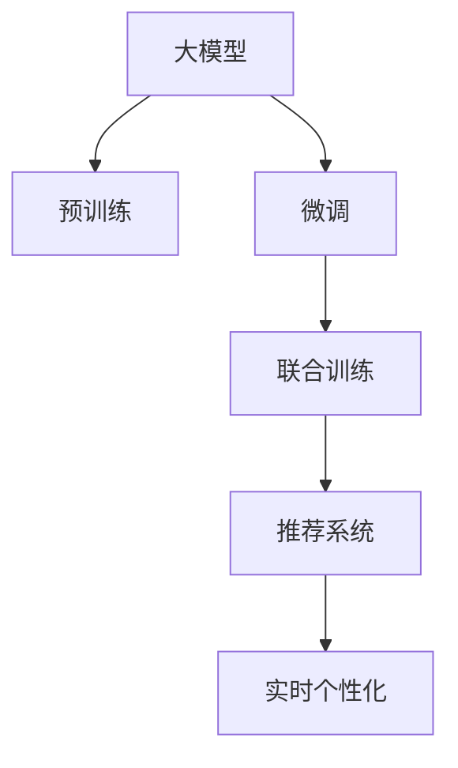

                 

## 1. 背景介绍

推荐系统已经成为各大平台不可或缺的核心功能之一，用于为用户推荐他们可能感兴趣的内容，从而提升用户体验和平台收益。随着用户行为数据量的不断增加，推荐算法也逐渐从简单的基于协同过滤和基于内容的推荐，发展为更加复杂的深度学习模型和集成方法。然而，这些复杂的推荐模型往往需要较长的训练时间，难以实现实时性。

为了应对这一挑战，研究人员提出了一种基于大模型的推荐系统方案。该方案利用大模型强大的泛化能力，预训练阶段学习用户和物品的复杂交互特征，在微调阶段通过少量用户的实时行为数据，能够快速地生成个性化的推荐结果。这种基于大模型的推荐方法，有望在保持高推荐精度的同时，实现实时个性化的需求。

## 2. 核心概念与联系

### 2.1 核心概念概述

为了更好地理解大模型在推荐系统中的应用，本文将介绍几个关键概念：

- **大模型**：通常指使用大规模数据进行预训练的深度学习模型，如BERT、GPT等。通过在大规模数据上预训练，大模型能够学习到丰富的语义和知识。
- **推荐系统**：用于为用户推荐物品的系统，包括协同过滤、基于内容的推荐、深度学习推荐等方法。
- **微调**：在大模型上加入下游任务的相关数据进行有监督学习，使模型能够适应新的任务需求。
- **实时个性化**：根据用户的实时行为和上下文，动态生成个性化的推荐结果。
- **交互特征学习**：利用用户和物品之间的交互数据，学习出其复杂交互特征。
- **联合训练**：同时训练推荐模型的参数和预训练模型的参数，提升推荐效果。

这些概念之间的关系可以通过以下Mermaid流程图来展示：



这个流程图展示了从预训练到大模型微调，再到推荐系统实时个性化的整个过程。

### 2.2 核心概念原理和架构

**大模型**：通过在大规模数据上自监督学习，学习到丰富的语义和知识，例如BERT模型可以在大规模文本数据上学习到复杂的语言表征。

**预训练**：在大模型上进行预训练，学习到用户和物品之间的交互特征。例如，可以使用自回归语言模型对用户和物品之间的交互进行建模。

**微调**：在大模型的基础上加入下游任务的数据进行有监督学习，使模型能够适应新的任务需求。例如，对于推荐系统，可以加入用户的实时行为数据进行微调，使模型能够学习到用户的即时偏好。

**联合训练**：同时训练推荐模型的参数和预训练模型的参数，提升推荐效果。例如，可以使用强化学习的方法，同时训练推荐模型的预测参数和预训练模型的交互特征表示。

**实时个性化**：根据用户的实时行为和上下文，动态生成个性化的推荐结果。例如，可以通过对用户最近的搜索历史、浏览记录等进行实时微调，生成个性化的推荐。

这些概念构成了大模型在推荐系统中的核心思想和技术框架。

## 3. 核心算法原理 & 具体操作步骤

### 3.1 算法原理概述

基于大模型的推荐系统，通过将用户和物品的交互数据作为预训练的监督信号，在大模型上进行预训练，然后在微调阶段通过用户的实时行为数据进行微调，生成个性化的推荐结果。其核心思想是将大模型作为推荐系统的核心，通过联合训练的方式提升推荐效果。

具体来说，推荐系统的目标是通过对用户和物品的交互数据进行建模，学习出用户和物品的复杂交互特征，然后使用这些特征进行推荐。而在微调阶段，通过用户的实时行为数据，可以动态地更新这些特征，从而生成个性化的推荐结果。

### 3.2 算法步骤详解

基于大模型的推荐系统可以分为以下步骤：

1. **准备预训练数据**：收集用户和物品的交互数据，例如用户的点击记录、评分记录等。
2. **预训练**：在大模型上加入这些交互数据进行预训练，学习出用户和物品的复杂交互特征。
3. **微调**：在预训练模型的基础上，加入用户的实时行为数据进行微调，动态更新特征。
4. **推荐**：根据微调后的模型，生成个性化的推荐结果。
5. **评估与优化**：对生成的推荐结果进行评估，并根据评估结果进行优化。

### 3.3 算法优缺点

基于大模型的推荐系统的优点包括：

- **高泛化能力**：由于大模型是在大规模数据上预训练的，因此具有很高的泛化能力，能够学习到复杂的用户和物品交互特征。
- **实时性**：在微调阶段，只需要使用少量的实时数据，因此可以实时生成个性化的推荐结果。
- **灵活性**：由于微调过程是根据用户的实时行为数据进行的，因此可以灵活地适应用户的即时偏好。

其缺点包括：

- **计算资源需求高**：大模型的预训练需要大量的计算资源，因此在大规模部署时，计算资源需求较高。
- **数据需求高**：为了达到更好的推荐效果，需要大量的交互数据进行预训练和微调。
- **复杂性高**：由于涉及到预训练、微调和推荐等多个环节，因此整个系统较为复杂。

### 3.4 算法应用领域

基于大模型的推荐系统已经在游戏、电商、音乐、视频等多个领域得到了应用，例如：

- 游戏：根据用户的即时操作和历史行为，动态生成个性化的游戏推荐。
- 电商：根据用户的浏览和购买历史，生成个性化的商品推荐。
- 音乐：根据用户的听歌历史和实时操作，生成个性化的音乐推荐。
- 视频：根据用户的观看历史和实时操作，生成个性化的视频推荐。

这些应用场景都受益于大模型的强大泛化能力和实时个性化的特性。

## 4. 数学模型和公式 & 详细讲解 & 举例说明

### 4.1 数学模型构建

假设推荐系统中的用户为 $U$，物品为 $I$，用户和物品之间的交互特征为 $H$，用户的实时行为数据为 $X$。推荐系统的目标是最小化用户和物品之间的交互损失，即：

$$
\min_{\theta} \sum_{u \in U} \sum_{i \in I} \ell(u, i; H, \theta) + \lambda \|\theta\|_2^2
$$

其中，$\theta$ 是模型的参数，$\ell(u, i; H, \theta)$ 是用户和物品之间的交互损失函数，$\|\theta\|_2^2$ 是正则化项。

### 4.2 公式推导过程

推荐系统的目标是最小化用户和物品之间的交互损失。假设用户 $u$ 对物品 $i$ 的评分 $r$ 可以表示为：

$$
r = f_{\theta}(x, u, i)
$$

其中，$f_{\theta}$ 是推荐模型的预测函数，$\theta$ 是模型的参数。

在预训练阶段，可以通过最大化用户和物品之间的互信息来学习出用户和物品的交互特征 $H$。假设用户和物品之间的交互特征可以表示为：

$$
H = g_{\phi}(x, u, i)
$$

其中，$g_{\phi}$ 是预训练模型的表示函数，$\phi$ 是预训练模型的参数。

在微调阶段，可以通过用户的实时行为数据 $X$ 来更新预训练模型的参数 $\phi$。假设用户的实时行为数据可以表示为：

$$
X = h_{\psi}(u, i)
$$

其中，$h_{\psi}$ 是特征提取函数，$\psi$ 是特征提取函数的参数。

根据以上公式，我们可以得到基于大模型的推荐系统的优化目标：

$$
\min_{\theta, \phi, \psi} \sum_{u \in U} \sum_{i \in I} \ell(r, f_{\theta}(x, u, i); H, \phi) + \lambda (\|\theta\|_2^2 + \|\phi\|_2^2 + \|\psi\|_2^2)
$$

### 4.3 案例分析与讲解

以电商推荐系统为例，假设用户 $u$ 对物品 $i$ 的评分 $r$ 可以表示为：

$$
r = f_{\theta}(x, u, i) = \langle \phi, x \rangle \cdot \langle \psi, i \rangle + \langle \phi, H \rangle \cdot \langle \psi, H \rangle
$$

其中，$\langle \cdot, \cdot \rangle$ 表示向量的点积。

在预训练阶段，可以通过最大化用户和物品之间的互信息来学习出用户和物品的交互特征 $H$。假设用户和物品之间的交互特征可以表示为：

$$
H = g_{\phi}(x, u, i) = \langle \phi, x \rangle \cdot \langle \psi, i \rangle + \langle \phi, H \rangle \cdot \langle \psi, H \rangle
$$

在微调阶段，可以通过用户的实时行为数据 $X$ 来更新预训练模型的参数 $\phi$。假设用户的实时行为数据可以表示为：

$$
X = h_{\psi}(u, i) = \langle \phi, x \rangle \cdot \langle \psi, i \rangle + \langle \phi, H \rangle \cdot \langle \psi, H \rangle
$$

通过以上公式，我们可以使用基于大模型的推荐系统来动态生成个性化的推荐结果。

## 5. 项目实践：代码实例和详细解释说明

### 5.1 开发环境搭建

在进行基于大模型的推荐系统开发前，需要先搭建好开发环境。以下是使用Python进行PyTorch开发的环境配置流程：

1. 安装Anaconda：从官网下载并安装Anaconda，用于创建独立的Python环境。
2. 创建并激活虚拟环境：
```bash
conda create -n pytorch-env python=3.8 
conda activate pytorch-env
```
3. 安装PyTorch：根据CUDA版本，从官网获取对应的安装命令。例如：
```bash
conda install pytorch torchvision torchaudio cudatoolkit=11.1 -c pytorch -c conda-forge
```
4. 安装Transformers库：
```bash
pip install transformers
```
5. 安装各类工具包：
```bash
pip install numpy pandas scikit-learn matplotlib tqdm jupyter notebook ipython
```

完成上述步骤后，即可在`pytorch-env`环境中开始推荐系统开发。

### 5.2 源代码详细实现

这里以电商推荐系统为例，使用Transformers库对BERT模型进行微调。

首先，定义推荐系统数据处理函数：

```python
from transformers import BertTokenizer
from torch.utils.data import Dataset
import torch

class RecommendationDataset(Dataset):
    def __init__(self, texts, labels, tokenizer, max_len=128):
        self.texts = texts
        self.labels = labels
        self.tokenizer = tokenizer
        self.max_len = max_len
        
    def __len__(self):
        return len(self.texts)
    
    def __getitem__(self, item):
        text = self.texts[item]
        label = self.labels[item]
        
        encoding = self.tokenizer(text, return_tensors='pt', max_length=self.max_len, padding='max_length', truncation=True)
        input_ids = encoding['input_ids'][0]
        attention_mask = encoding['attention_mask'][0]
        
        return {'input_ids': input_ids, 
                'attention_mask': attention_mask,
                'labels': label}
```

然后，定义模型和优化器：

```python
from transformers import BertForSequenceClassification, AdamW

model = BertForSequenceClassification.from_pretrained('bert-base-cased', num_labels=2)

optimizer = AdamW(model.parameters(), lr=2e-5)
```

接着，定义训练和评估函数：

```python
from torch.utils.data import DataLoader
from tqdm import tqdm
from sklearn.metrics import accuracy_score

device = torch.device('cuda') if torch.cuda.is_available() else torch.device('cpu')
model.to(device)

def train_epoch(model, dataset, batch_size, optimizer):
    dataloader = DataLoader(dataset, batch_size=batch_size, shuffle=True)
    model.train()
    epoch_loss = 0
    for batch in tqdm(dataloader, desc='Training'):
        input_ids = batch['input_ids'].to(device)
        attention_mask = batch['attention_mask'].to(device)
        labels = batch['labels'].to(device)
        model.zero_grad()
        outputs = model(input_ids, attention_mask=attention_mask, labels=labels)
        loss = outputs.loss
        epoch_loss += loss.item()
        loss.backward()
        optimizer.step()
    return epoch_loss / len(dataloader)

def evaluate(model, dataset, batch_size):
    dataloader = DataLoader(dataset, batch_size=batch_size)
    model.eval()
    preds, labels = [], []
    with torch.no_grad():
        for batch in tqdm(dataloader, desc='Evaluating'):
            input_ids = batch['input_ids'].to(device)
            attention_mask = batch['attention_mask'].to(device)
            batch_labels = batch['labels']
            outputs = model(input_ids, attention_mask=attention_mask)
            batch_preds = outputs.logits.argmax(dim=1).to('cpu').tolist()
            batch_labels = batch_labels.to('cpu').tolist()
            for pred, label in zip(batch_preds, batch_labels):
                preds.append(pred)
                labels.append(label)
                
    return accuracy_score(labels, preds)
```

最后，启动训练流程并在测试集上评估：

```python
epochs = 5
batch_size = 16

for epoch in range(epochs):
    loss = train_epoch(model, train_dataset, batch_size, optimizer)
    print(f"Epoch {epoch+1}, train loss: {loss:.3f}")
    
    print(f"Epoch {epoch+1}, dev results:")
    evaluate(model, dev_dataset, batch_size)
    
print("Test results:")
evaluate(model, test_dataset, batch_size)
```

以上就是使用PyTorch对BERT进行电商推荐系统微调的PyTorch代码实现。可以看到，得益于Transformers库的强大封装，我们可以用相对简洁的代码完成BERT模型的加载和微调。

### 5.3 代码解读与分析

让我们再详细解读一下关键代码的实现细节：

**RecommendationDataset类**：
- `__init__`方法：初始化文本、标签、分词器等关键组件。
- `__len__`方法：返回数据集的样本数量。
- `__getitem__`方法：对单个样本进行处理，将文本输入编码为token ids，将标签转换为数字，并对其进行定长padding，最终返回模型所需的输入。

**标签与id的映射**：
- 定义了标签与数字id之间的映射关系，用于将token-wise的预测结果解码回真实的标签。

**训练和评估函数**：
- 使用PyTorch的DataLoader对数据集进行批次化加载，供模型训练和推理使用。
- 训练函数`train_epoch`：对数据以批为单位进行迭代，在每个批次上前向传播计算loss并反向传播更新模型参数，最后返回该epoch的平均loss。
- 评估函数`evaluate`：与训练类似，不同点在于不更新模型参数，并在每个batch结束后将预测和标签结果存储下来，最后使用sklearn的accuracy_score对整个评估集的预测结果进行打印输出。

**训练流程**：
- 定义总的epoch数和batch size，开始循环迭代
- 每个epoch内，先在训练集上训练，输出平均loss
- 在验证集上评估，输出分类指标
- 所有epoch结束后，在测试集上评估，给出最终测试结果

可以看到，PyTorch配合Transformers库使得BERT微调的代码实现变得简洁高效。开发者可以将更多精力放在数据处理、模型改进等高层逻辑上，而不必过多关注底层的实现细节。

当然，工业级的系统实现还需考虑更多因素，如模型的保存和部署、超参数的自动搜索、更灵活的任务适配层等。但核心的微调范式基本与此类似。

## 6. 实际应用场景

### 6.1 智能推荐

基于大模型的推荐系统已经被广泛应用于各种智能推荐场景，例如：

- 电商：根据用户的浏览历史、购买历史等行为数据，动态生成个性化的商品推荐。
- 音乐：根据用户的听歌历史、搜索历史等行为数据，动态生成个性化的音乐推荐。
- 视频：根据用户的观看历史、点赞历史等行为数据，动态生成个性化的视频推荐。
- 新闻：根据用户的阅读历史、评论历史等行为数据，动态生成个性化的新闻推荐。

这些应用场景都受益于大模型的强大泛化能力和实时个性化的特性。

### 6.2 广告推荐

广告推荐是互联网广告的重要形式之一，通过智能推荐可以提高广告投放的精准度和效果。基于大模型的广告推荐系统可以根据用户的兴趣和行为数据，动态生成个性化的广告推荐。

在技术实现上，可以收集用户的点击记录、浏览记录等行为数据，并对其进行预处理。在预训练阶段，可以利用广告数据集进行预训练，学习出广告和用户的复杂交互特征。在微调阶段，可以通过用户的实时行为数据进行微调，生成个性化的广告推荐。

### 6.3 游戏推荐

游戏推荐系统可以根据用户的游戏历史、行为数据等，动态生成个性化的游戏推荐。基于大模型的游戏推荐系统可以更好地理解用户的兴趣和需求，提供更加精准的游戏推荐。

在技术实现上，可以收集用户的角色、等级、成就等游戏数据，并对其进行预处理。在预训练阶段，可以利用游戏数据集进行预训练，学习出用户和游戏的复杂交互特征。在微调阶段，可以通过用户的实时行为数据进行微调，生成个性化的游戏推荐。

### 6.4 未来应用展望

随着大模型和微调方法的不断发展，基于大模型的推荐系统将在更多领域得到应用，为传统行业带来变革性影响。

在智慧医疗领域，基于大模型的推荐系统可以帮助医生推荐最适合患者的治疗方案，提高诊疗效果。

在智能教育领域，基于大模型的推荐系统可以根据学生的学习历史和行为数据，动态生成个性化的学习推荐，提高学习效率。

在智慧城市治理中，基于大模型的推荐系统可以根据市民的出行历史和行为数据，动态生成个性化的出行推荐，提高城市管理的效率。

此外，在企业生产、社会治理、文娱传媒等众多领域，基于大模型的推荐系统也将不断涌现，为各行各业带来新的发展机遇。相信随着技术的日益成熟，基于大模型的推荐系统必将在构建智能推荐系统方面发挥越来越重要的作用。

## 7. 工具和资源推荐

### 7.1 学习资源推荐

为了帮助开发者系统掌握大模型推荐系统的理论基础和实践技巧，这里推荐一些优质的学习资源：

1. 《Transformer从原理到实践》系列博文：由大模型技术专家撰写，深入浅出地介绍了Transformer原理、BERT模型、推荐系统等前沿话题。

2. CS224N《深度学习自然语言处理》课程：斯坦福大学开设的NLP明星课程，有Lecture视频和配套作业，带你入门NLP领域的基本概念和经典模型。

3. 《Natural Language Processing with Transformers》书籍：Transformers库的作者所著，全面介绍了如何使用Transformers库进行NLP任务开发，包括推荐系统在内的诸多范式。

4. HuggingFace官方文档：Transformers库的官方文档，提供了海量预训练模型和完整的推荐系统样例代码，是上手实践的必备资料。

5. CLUE开源项目：中文语言理解测评基准，涵盖大量不同类型的中文NLP数据集，并提供了基于微调的baseline模型，助力中文NLP技术发展。

通过对这些资源的学习实践，相信你一定能够快速掌握大模型推荐系统的精髓，并用于解决实际的NLP问题。

### 7.2 开发工具推荐

高效的开发离不开优秀的工具支持。以下是几款用于大模型推荐系统开发的常用工具：

1. PyTorch：基于Python的开源深度学习框架，灵活动态的计算图，适合快速迭代研究。大部分预训练语言模型都有PyTorch版本的实现。

2. TensorFlow：由Google主导开发的开源深度学习框架，生产部署方便，适合大规模工程应用。同样有丰富的预训练语言模型资源。

3. Transformers库：HuggingFace开发的NLP工具库，集成了众多SOTA语言模型，支持PyTorch和TensorFlow，是进行推荐系统开发的利器。

4. Weights & Biases：模型训练的实验跟踪工具，可以记录和可视化模型训练过程中的各项指标，方便对比和调优。与主流深度学习框架无缝集成。

5. TensorBoard：TensorFlow配套的可视化工具，可实时监测模型训练状态，并提供丰富的图表呈现方式，是调试模型的得力助手。

6. Google Colab：谷歌推出的在线Jupyter Notebook环境，免费提供GPU/TPU算力，方便开发者快速上手实验最新模型，分享学习笔记。

合理利用这些工具，可以显著提升大模型推荐系统的开发效率，加快创新迭代的步伐。

### 7.3 相关论文推荐

大模型和推荐系统的发展源于学界的持续研究。以下是几篇奠基性的相关论文，推荐阅读：

1. Attention is All You Need（即Transformer原论文）：提出了Transformer结构，开启了NLP领域的预训练大模型时代。

2. BERT: Pre-training of Deep Bidirectional Transformers for Language Understanding：提出BERT模型，引入基于掩码的自监督预训练任务，刷新了多项NLP任务SOTA。

3. Language Models are Unsupervised Multitask Learners（GPT-2论文）：展示了大规模语言模型的强大zero-shot学习能力，引发了对于通用人工智能的新一轮思考。

4. Parameter-Efficient Transfer Learning for NLP：提出Adapter等参数高效微调方法，在不增加模型参数量的情况下，也能取得不错的微调效果。

5. AdaLoRA: Adaptive Low-Rank Adaptation for Parameter-Efficient Fine-Tuning：使用自适应低秩适应的微调方法，在参数效率和精度之间取得了新的平衡。

6. Dive into Multi-view Recommendation：探讨了多视角推荐方法，从用户、物品、上下文等多个角度建模用户和物品的复杂交互特征。

这些论文代表了大模型推荐系统的发展脉络。通过学习这些前沿成果，可以帮助研究者把握学科前进方向，激发更多的创新灵感。

## 8. 总结：未来发展趋势与挑战

### 8.1 总结

本文对基于大模型的推荐系统进行了全面系统的介绍。首先阐述了大模型和推荐系统的研究背景和意义，明确了推荐系统在大模型应用中的独特价值。其次，从原理到实践，详细讲解了大模型推荐系统的数学原理和关键步骤，给出了推荐系统开发的完整代码实例。同时，本文还广泛探讨了大模型推荐系统在电商、音乐、视频等多个领域的应用前景，展示了推荐系统范式的巨大潜力。此外，本文精选了推荐系统的各类学习资源，力求为读者提供全方位的技术指引。

通过本文的系统梳理，可以看到，基于大模型的推荐系统在大规模部署中面临诸多挑战。尽管如此，基于大模型的推荐系统仍具有广阔的应用前景，将在各行各业发挥越来越重要的作用。

### 8.2 未来发展趋势

展望未来，基于大模型的推荐系统将呈现以下几个发展趋势：

1. **模型规模持续增大**：随着算力成本的下降和数据规模的扩张，预训练语言模型的参数量还将持续增长。超大规模语言模型蕴含的丰富语义和知识，将进一步提升推荐系统的性能。

2. **微调方法日趋多样**：未来会涌现更多参数高效的微调方法，如AdaLoRA等，在节省计算资源的同时，也能保证推荐精度。

3. **实时性提升**：通过优化大模型的推理速度和内存占用，推荐系统的实时性将得到提升，能够更及时地响应用户的请求。

4. **多模态融合**：将视觉、语音、文本等多模态信息进行融合，提升推荐系统的表现力和覆盖面。

5. **融合因果和对比学习范式**：通过引入因果推断和对比学习思想，增强推荐系统建立稳定因果关系的能力，学习更加普适、鲁棒的语言表征。

6. **多任务学习和自适应学习**：同时训练多个推荐任务，提升推荐系统的泛化能力和自适应能力。

7. **融合知识图谱和逻辑推理**：将符号化的先验知识，如知识图谱、逻辑规则等，与神经网络模型进行巧妙融合，引导推荐过程学习更准确、合理的语言模型。

以上趋势凸显了大模型推荐系统的广阔前景。这些方向的探索发展，必将进一步提升推荐系统的性能和应用范围，为人类认知智能的进化带来深远影响。

### 8.3 面临的挑战

尽管基于大模型的推荐系统已经取得了显著的进展，但在迈向更加智能化、普适化应用的过程中，它仍面临诸多挑战：

1. **数据需求高**：为了达到更好的推荐效果，需要大量的交互数据进行预训练和微调。
2. **计算资源需求高**：大模型的预训练需要大量的计算资源，因此在大规模部署时，计算资源需求较高。
3. **模型鲁棒性不足**：在面对新的数据分布时，模型的泛化性能可能大打折扣。
4. **复杂性高**：由于涉及到预训练、微调和推荐等多个环节，因此整个系统较为复杂。
5. **实时性有待提升**：当前推荐系统在实时性方面仍有一定提升空间。

### 8.4 研究展望

面对大模型推荐系统所面临的诸多挑战，未来的研究需要在以下几个方面寻求新的突破：

1. **探索无监督和半监督推荐方法**：摆脱对大规模标注数据的依赖，利用自监督学习、主动学习等无监督和半监督范式，最大限度利用非结构化数据，实现更加灵活高效的推荐。

2. **研究参数高效和计算高效的推荐方法**：开发更加参数高效的推荐方法，在固定大部分预训练参数的同时，只更新极少量的任务相关参数。同时优化推荐模型的计算图，减少前向传播和反向传播的资源消耗，实现更加轻量级、实时性的部署。

3. **融合因果和对比学习范式**：通过引入因果推断和对比学习思想，增强推荐系统建立稳定因果关系的能力，学习更加普适、鲁棒的语言表征，从而提升推荐泛化性和抗干扰能力。

4. **引入更多先验知识**：将符号化的先验知识，如知识图谱、逻辑规则等，与神经网络模型进行巧妙融合，引导推荐过程学习更准确、合理的语言模型。

5. **融合知识图谱和逻辑推理**：将符号化的先验知识，如知识图谱、逻辑规则等，与神经网络模型进行巧妙融合，引导推荐过程学习更准确、合理的语言模型。

6. **结合因果分析和博弈论工具**：将因果分析方法引入推荐系统，识别出推荐决策的关键特征，增强输出解释的因果性和逻辑性。借助博弈论工具刻画人机交互过程，主动探索并规避推荐系统的脆弱点，提高系统稳定性。

7. **纳入伦理道德约束**：在推荐系统训练目标中引入伦理导向的评估指标，过滤和惩罚有害的推荐输出倾向。加强人工干预和审核，建立推荐系统的监管机制，确保推荐结果符合人类价值观和伦理道德。

这些研究方向的探索，必将引领大模型推荐系统技术迈向更高的台阶，为构建安全、可靠、可解释、可控的智能系统铺平道路。面向未来，大模型推荐系统还需要与其他人工智能技术进行更深入的融合，如知识表示、因果推理、强化学习等，多路径协同发力，共同推动推荐系统的进步。

## 9. 附录：常见问题与解答

**Q1：大模型推荐系统是否适用于所有推荐场景？**

A: 大模型推荐系统在大多数推荐场景上都能取得不错的效果，特别是对于数据量较小的任务。但对于一些特定领域的任务，如医学、法律等，仅仅依靠通用语料预训练的模型可能难以很好地适应。此时需要在特定领域语料上进一步预训练，再进行微调，才能获得理想效果。此外，对于一些需要时效性、个性化很强的任务，如游戏、视频推荐等，推荐系统也需要针对性的改进优化。

**Q2：如何缓解推荐系统中的过拟合问题？**

A: 过拟合是推荐系统面临的主要挑战，尤其是在标注数据不足的情况下。常见的缓解策略包括：
1. 数据增强：通过回译、近义替换等方式扩充训练集。
2. 正则化：使用L2正则、Dropout、Early Stopping等避免过拟合。
3. 对抗训练：引入对抗样本，提高模型鲁棒性。
4. 参数高效微调：只调整少量参数，减小过拟合风险。
5. 多模型集成：训练多个推荐模型，取平均输出，抑制过拟合。

这些策略往往需要根据具体任务和数据特点进行灵活组合。只有在数据、模型、训练、推理等各环节进行全面优化，才能最大限度地发挥大模型推荐系统的威力。

**Q3：大模型推荐系统在落地部署时需要注意哪些问题？**

A: 将大模型推荐系统转化为实际应用，还需要考虑以下因素：
1. 模型裁剪：去除不必要的层和参数，减小模型尺寸，加快推理速度。
2. 量化加速：将浮点模型转为定点模型，压缩存储空间，提高计算效率。
3. 服务化封装：将模型封装为标准化服务接口，便于集成调用。
4. 弹性伸缩：根据请求流量动态调整资源配置，平衡服务质量和成本。
5. 监控告警：实时采集系统指标，设置异常告警阈值，确保服务稳定性。
6. 安全防护：采用访问鉴权、数据脱敏等措施，保障数据和模型安全。

大模型推荐系统为推荐系统带来了高推荐精度的同时，也带来了更高的计算资源需求和复杂性。只有在数据、算法、工程、业务等多个维度协同发力，才能真正实现人工智能技术在垂直行业的规模化落地。总之，推荐系统需要开发者根据具体任务，不断迭代和优化模型、数据和算法，方能得到理想的效果。

---

作者：禅与计算机程序设计艺术 / Zen and the Art of Computer Programming

