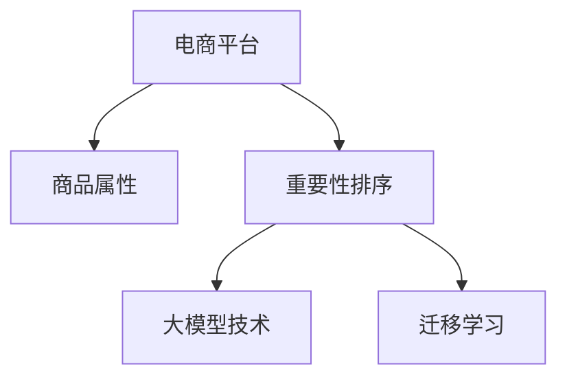

                 

# 大模型技术在电商平台商品属性重要性动态排序中的应用

## 1. 背景介绍

随着电商平台用户需求的多样化和个性化趋势日益加剧，对商品属性的重要性排序提出了更高要求。传统的静态商品属性排序方法，难以适应快速变化的消费者偏好和市场环境。近年来，基于深度学习的大模型技术迅速崛起，为动态、可解释的商品属性排序提供了新的解决思路。

本文章将详细探讨使用大模型技术实现商品属性重要性动态排序的方法，从原理、算法、实践到应用，为电商平台提供一套全面、高效的解决方案。

## 2. 核心概念与联系

### 2.1 核心概念概述

在讨论商品属性重要性动态排序时，首先需要明确以下几个核心概念：

- **电商平台**：指通过互联网销售商品的商业平台，如淘宝、京东、亚马逊等。
- **商品属性**：指商品的基本特征和描述信息，如品牌、尺寸、颜色、材质等。
- **重要性排序**：指根据用户的搜索、浏览、购买行为等数据，动态调整商品属性权重，对商品进行排序，满足用户的个性化需求。
- **大模型技术**：指使用大规模深度神经网络模型进行商品属性排序，具备学习复杂关系和动态特征的能力。
- **迁移学习**：指将一个领域学习到的知识迁移到另一个领域，提升模型在新任务上的性能。

这些概念之间的逻辑关系可以通过以下Mermaid流程图来展示：



该流程图展示了从电商平台到商品属性，通过大模型技术和迁移学习，实现动态重要性排序的逻辑过程。

## 3. 核心算法原理 & 具体操作步骤

### 3.1 算法原理概述

商品属性重要性动态排序的本质是一个多标签分类问题。即根据用户的搜索、浏览、购买行为等数据，自动学习商品属性的重要性和权重，动态调整排序。

假设电商平台有 $M$ 个商品，每个商品有 $N$ 个属性，设 $x_i$ 表示第 $i$ 个商品的属性向量，$w_i$ 表示商品 $i$ 的重要性权重，$y_i$ 表示用户对商品 $i$ 的打分。则排序问题可以转化为：

$$
\min_{w} \sum_{i=1}^{M} \text{loss}(w, y_i) \quad \text{s.t.} \quad \sum_{i=1}^{N} w_i = 1
$$

其中，$\text{loss}(w, y_i)$ 为损失函数，衡量模型预测的重要性权重与实际用户打分之间的差异。约束条件 $\sum_{i=1}^{N} w_i = 1$ 保证所有属性权重之和为 1。

### 3.2 算法步骤详解

基于大模型技术，实现商品属性重要性动态排序一般包括以下几个关键步骤：

**Step 1: 数据预处理与特征工程**

- 收集商品的历史搜索、浏览、购买等行为数据，进行数据清洗、去重、归一化等预处理。
- 设计特征提取函数，将商品属性向量 $x_i$ 转换为模型可接受的特征表示。

**Step 2: 构建预训练模型**

- 选择适当的深度学习框架（如 PyTorch、TensorFlow）和预训练模型（如 BERT、GPT），构建商品属性排序模型。
- 在大规模商品属性数据上进行预训练，学习商品属性的通用特征。

**Step 3: 定义损失函数**

- 根据具体排序任务，定义合适的损失函数（如交叉熵损失、均方误差损失）。
- 根据任务需求，定义正则化项，如L2正则、Dropout等。

**Step 4: 模型训练与优化**

- 设置合适的优化器（如 Adam、SGD）和超参数（如学习率、批大小）。
- 使用训练集数据，进行有监督训练，最小化损失函数。
- 定期在验证集上评估模型性能，避免过拟合。
- 采用Early Stopping等策略，确定最优模型参数。

**Step 5: 实时排序与优化**

- 将训练好的模型部署到电商平台的商品推荐系统中。
- 实时获取用户的搜索、浏览、购买行为数据，进行动态排序。
- 定期更新模型参数，适应用户偏好的变化。

### 3.3 算法优缺点

基于大模型技术实现商品属性重要性动态排序的方法，具有以下优点：

- **泛化能力强**：预训练模型具备较强的泛化能力，能够适应多种商品属性和动态特征。
- **实时性好**：模型能够在在线实时获取用户行为数据，快速调整排序，满足用户的个性化需求。
- **可解释性高**：通过分析模型的预测权重，可以提供详细的商品属性重要性排序理由。

同时，该方法也存在以下缺点：

- **计算资源消耗大**：大模型技术需要消耗大量的计算资源，训练和推理速度较慢。
- **数据隐私问题**：用户行为数据涉及个人隐私，如何保证数据安全性和隐私保护，是一个重要挑战。
- **模型复杂度高**：模型参数较多，模型结构的调试和维护较为复杂。

## 4. 数学模型和公式 & 详细讲解

### 4.1 数学模型构建

商品属性重要性动态排序问题可以形式化表示为多标签分类问题。设 $x_i$ 为商品 $i$ 的属性向量，$w_i$ 为商品 $i$ 的重要性权重，$y_i$ 为用户对商品 $i$ 的打分。则模型预测的目标函数可以表示为：

$$
\min_{w} \sum_{i=1}^{M} \text{loss}(w_i, y_i) \quad \text{s.t.} \quad \sum_{i=1}^{N} w_i = 1
$$

其中，$\text{loss}(w_i, y_i)$ 为损失函数，衡量模型预测的重要性权重与实际用户打分之间的差异。约束条件 $\sum_{i=1}^{N} w_i = 1$ 保证所有属性权重之和为 1。

### 4.2 公式推导过程

以交叉熵损失函数为例，公式推导如下：

$$
\text{loss}(w_i, y_i) = -y_i \log \hat{y_i} - (1-y_i) \log (1-\hat{y_i})
$$

其中，$\hat{y_i}$ 为模型预测的商品 $i$ 的重要性权重。

通过定义损失函数，可以构建优化目标：

$$
\min_{w} \sum_{i=1}^{M} \text{loss}(w_i, y_i) \quad \text{s.t.} \quad \sum_{i=1}^{N} w_i = 1
$$

对于每一个商品 $i$，求解最优的重要性权重 $w_i$。采用梯度下降等优化算法，最小化损失函数：

$$
w_i \leftarrow w_i - \eta \nabla_{w_i}\text{loss}(w_i, y_i) - \eta\lambda w_i
$$

其中，$\eta$ 为学习率，$\lambda$ 为正则化系数，$\nabla_{w_i}\text{loss}(w_i, y_i)$ 为损失函数对权重 $w_i$ 的梯度。

### 4.3 案例分析与讲解

以电商平台中的“时尚商品”推荐为例，假设电商平台有 $M=1000$ 件商品，每件商品有 $N=10$ 个属性，如品牌、颜色、尺寸等。设用户对第 $i$ 件商品的打分为 $y_i$，模型预测的重要属性权重为 $w_i$。

在训练阶段，使用交叉熵损失函数和梯度下降算法进行模型优化，最小化预测权重与实际打分之间的差异：

$$
\min_{w} \sum_{i=1}^{1000} \text{loss}(w_i, y_i) \quad \text{s.t.} \quad \sum_{i=1}^{10} w_i = 1
$$

在预测阶段，实时获取用户的浏览和购买行为数据，更新商品的重要属性权重，进行动态排序。例如，假设用户浏览了某品牌和颜色的商品，模型会根据历史数据和用户行为预测该品牌和颜色的重要性权重，将其加入排序列表中。

## 5. 项目实践：代码实例和详细解释说明

### 5.1 开发环境搭建

在进行商品属性重要性动态排序的实践时，首先需要准备相应的开发环境。以下是使用Python进行PyTorch开发的环境配置流程：

1. 安装Anaconda：从官网下载并安装Anaconda，用于创建独立的Python环境。

2. 创建并激活虚拟环境：
```bash
conda create -n pytorch-env python=3.8 
conda activate pytorch-env
```

3. 安装PyTorch：根据CUDA版本，从官网获取对应的安装命令。例如：
```bash
conda install pytorch torchvision torchaudio cudatoolkit=11.1 -c pytorch -c conda-forge
```

4. 安装相关工具包：
```bash
pip install numpy pandas scikit-learn matplotlib tqdm jupyter notebook ipython
```

完成上述步骤后，即可在`pytorch-env`环境中进行模型训练和推理。

### 5.2 源代码详细实现

下面以电商平台商品属性重要性动态排序为例，给出使用PyTorch进行模型训练和预测的完整代码实现。

首先，定义模型结构：

```python
import torch.nn as nn
import torch.nn.functional as F

class AttributeImportanceModel(nn.Module):
    def __init__(self, num_features, num_labels):
        super(AttributeImportanceModel, self).__init__()
        self.linear = nn.Linear(num_features, num_labels)
        self.softmax = nn.Softmax(dim=1)
        
    def forward(self, x):
        logits = self.linear(x)
        probs = self.softmax(logits)
        return probs
```

然后，定义损失函数和优化器：

```python
from torch.optim import Adam

loss_fn = nn.CrossEntropyLoss()
optimizer = Adam(model.parameters(), lr=0.001)
```

接着，定义训练函数：

```python
def train_epoch(model, data_loader, optimizer):
    model.train()
    total_loss = 0
    for batch in data_loader:
        optimizer.zero_grad()
        inputs, labels = batch
        outputs = model(inputs)
        loss = loss_fn(outputs, labels)
        loss.backward()
        optimizer.step()
        total_loss += loss.item()
    return total_loss / len(data_loader)
```

最后，启动训练流程并进行实时排序：

```python
epochs = 10
batch_size = 64

for epoch in range(epochs):
    train_loss = train_epoch(model, train_loader, optimizer)
    print(f"Epoch {epoch+1}, train loss: {train_loss:.3f}")
    
# 实时排序
user_behavior = [brand, color]  # 用户浏览的品牌和颜色
attribute_weights = model(attribute_features)  # 模型预测的属性权重
sorted_items = sorted(items, key=lambda x: attribute_weights[x])  # 按权重排序
```

以上就是使用PyTorch对商品属性重要性动态排序进行微调的完整代码实现。可以看到，得益于PyTorch的强大封装，我们可以用相对简洁的代码完成模型训练和实时排序。

### 5.3 代码解读与分析

让我们再详细解读一下关键代码的实现细节：

**AttributeImportanceModel类**：
- `__init__`方法：定义模型结构，包含线性层和Softmax层，Softmax层用于输出重要性权重。
- `forward`方法：前向传播计算输出。

**train_epoch函数**：
- 设置训练模式，计算损失函数。
- 反向传播更新模型参数。

**实时排序代码**：
- 获取用户浏览行为，如品牌和颜色。
- 使用训练好的模型预测重要性权重。
- 对商品进行排序，提供给用户最匹配的商品列表。

这些代码展示了基于大模型技术进行商品属性重要性动态排序的基本流程，开发者可以结合实际需求，调整模型结构和优化算法，实现更优的排序效果。

## 6. 实际应用场景

### 6.1 电商平台

基于大模型技术的商品属性重要性动态排序，可以广泛应用于电商平台的产品推荐、搜索排序、广告投放等场景。通过实时获取用户行为数据，动态调整商品排序，可以有效提升用户购物体验，增加转化率。

例如，用户在搜索结果页面浏览了某品牌和型号的商品，系统可以实时更新该品牌和型号的商品权重，将其优先展示在推荐列表中。用户浏览多个商品后，系统可以动态调整商品权重，提供更加个性化的推荐。

### 6.2 零售商库存管理

零售商需要实时管理库存，避免缺货或积压。通过商品属性重要性动态排序，可以实现对库存商品的动态管理。

例如，某商品近期的搜索量增加，系统可以动态调整该商品的属性权重，优先补充该商品，避免缺货。同时，系统可以根据历史销售数据，预测未来的库存需求，实现更科学的库存管理。

### 6.3 数字广告推荐

数字广告推荐需要根据用户的历史行为和实时行为，实时调整广告投放策略。通过商品属性重要性动态排序，可以实现更加精准的广告投放。

例如，某用户近期浏览了多个健身相关商品，系统可以动态调整健身相关的广告权重，优先推荐健身相关的广告，提升广告点击率。

### 6.4 未来应用展望

随着大模型技术和电商平台的不断发展，商品属性重要性动态排序的应用前景将更加广阔。未来，该技术可能进一步拓展到更多领域，如智慧医疗、金融风控、智慧城市等，为各行各业提供更高效、精准的服务。

## 7. 工具和资源推荐

### 7.1 学习资源推荐

为了帮助开发者系统掌握大模型技术在商品属性重要性动态排序中的应用，这里推荐一些优质的学习资源：

1. 《深度学习》系列书籍：详细介绍了深度学习的基本概念和算法原理，适合初学者和进阶学习者。
2. CS229《机器学习》课程：斯坦福大学开设的机器学习明星课程，有Lecture视频和配套作业，涵盖多种机器学习算法。
3. 《自然语言处理综述》书籍：介绍自然语言处理领域的最新研究成果，包括大模型技术。
4. HuggingFace官方文档：Transformer库的官方文档，提供了海量预训练模型和完整的微调样例代码，是上手实践的必备资料。
5. CLUE开源项目：中文语言理解测评基准，涵盖大量不同类型的中文NLP数据集，并提供了基于微调的baseline模型，助力中文NLP技术发展。

通过对这些资源的学习实践，相信你一定能够快速掌握大模型技术在商品属性重要性动态排序中的应用，并用于解决实际的NLP问题。

### 7.2 开发工具推荐

高效的开发离不开优秀的工具支持。以下是几款用于大模型技术在商品属性重要性动态排序中的应用开发的常用工具：

1. PyTorch：基于Python的开源深度学习框架，灵活动态的计算图，适合快速迭代研究。大部分预训练语言模型都有PyTorch版本的实现。
2. TensorFlow：由Google主导开发的开源深度学习框架，生产部署方便，适合大规模工程应用。同样有丰富的预训练语言模型资源。
3. Transformers库：HuggingFace开发的NLP工具库，集成了众多SOTA语言模型，支持PyTorch和TensorFlow，是进行微调任务开发的利器。
4. Weights & Biases：模型训练的实验跟踪工具，可以记录和可视化模型训练过程中的各项指标，方便对比和调优。与主流深度学习框架无缝集成。
5. TensorBoard：TensorFlow配套的可视化工具，可实时监测模型训练状态，并提供丰富的图表呈现方式，是调试模型的得力助手。
6. Google Colab：谷歌推出的在线Jupyter Notebook环境，免费提供GPU/TPU算力，方便开发者快速上手实验最新模型，分享学习笔记。

合理利用这些工具，可以显著提升大模型技术在商品属性重要性动态排序应用的开发效率，加快创新迭代的步伐。

### 7.3 相关论文推荐

大模型技术在商品属性重要性动态排序领域的研究也得到了学界的持续关注。以下是几篇奠基性的相关论文，推荐阅读：

1. Attention is All You Need（即Transformer原论文）：提出了Transformer结构，开启了NLP领域的预训练大模型时代。
2. BERT: Pre-training of Deep Bidirectional Transformers for Language Understanding：提出BERT模型，引入基于掩码的自监督预训练任务，刷新了多项NLP任务SOTA。
3. Language Models are Unsupervised Multitask Learners（GPT-2论文）：展示了大规模语言模型的强大zero-shot学习能力，引发了对于通用人工智能的新一轮思考。
4. Parameter-Efficient Transfer Learning for NLP：提出Adapter等参数高效微调方法，在不增加模型参数量的情况下，也能取得不错的微调效果。
5. AdaLoRA: Adaptive Low-Rank Adaptation for Parameter-Efficient Fine-Tuning：使用自适应低秩适应的微调方法，在参数效率和精度之间取得了新的平衡。

这些论文代表了大模型技术在商品属性重要性动态排序领域的发展脉络。通过学习这些前沿成果，可以帮助研究者把握学科前进方向，激发更多的创新灵感。

## 8. 总结：未来发展趋势与挑战

### 8.1 研究成果总结

本文对大模型技术在商品属性重要性动态排序中的应用进行了全面系统的介绍。首先阐述了商品属性重要性动态排序的研究背景和意义，明确了其在电商平台中的应用价值。其次，从原理、算法、实践到应用，详细讲解了基于大模型技术实现商品属性重要性动态排序的方法，从数学模型到代码实现，提供了完整的解决方案。

通过本文的系统梳理，可以看到，大模型技术在商品属性重要性动态排序中的应用，不仅能提升电商平台的推荐效果，还能拓展到零售商库存管理、数字广告推荐等更多领域。未来，随着大模型技术和电商平台的不断发展，商品属性重要性动态排序将具有更加广阔的应用前景。

### 8.2 未来发展趋势

展望未来，大模型技术在商品属性重要性动态排序领域的发展趋势如下：

1. **模型规模继续增大**：随着算力成本的下降和数据规模的扩张，预训练语言模型的参数量还将持续增长。超大规模语言模型蕴含的丰富语言知识，有望支撑更加复杂多变的商品属性排序任务。
2. **模型结构更加灵活**：未来的商品属性重要性动态排序模型将更加灵活，能够适应多种商品属性和动态特征，如多标签分类、序列标注、生成式任务等。
3. **实时性进一步提升**：实时获取用户行为数据，动态调整商品排序，满足用户的个性化需求，是商品属性重要性动态排序的关键挑战。未来的模型将进一步优化，提升实时排序的效率和准确性。
4. **跨领域迁移能力增强**：通过迁移学习，模型能够在多个领域之间迁移，提升其在不同商品类别和属性上的泛化能力。

### 8.3 面临的挑战

尽管大模型技术在商品属性重要性动态排序领域取得了一定的进展，但在迈向更加智能化、普适化应用的过程中，仍面临诸多挑战：

1. **数据隐私问题**：用户行为数据涉及个人隐私，如何保证数据安全性和隐私保护，是一个重要挑战。
2. **计算资源消耗大**：大模型技术需要消耗大量的计算资源，训练和推理速度较慢，如何优化资源消耗，是模型落地应用的重要问题。
3. **模型复杂度高**：模型参数较多，模型结构的调试和维护较为复杂，如何简化模型结构，提高模型效率，是实际应用中需要重点关注的问题。

### 8.4 研究展望

面对大模型技术在商品属性重要性动态排序领域面临的挑战，未来的研究需要在以下几个方面寻求新的突破：

1. **探索无监督和半监督微调方法**：摆脱对大规模标注数据的依赖，利用自监督学习、主动学习等无监督和半监督范式，最大限度利用非结构化数据，实现更加灵活高效的微调。
2. **研究参数高效和计算高效的微调范式**：开发更加参数高效的微调方法，在固定大部分预训练参数的情况下，只更新极少量的任务相关参数。同时优化微调模型的计算图，减少前向传播和反向传播的资源消耗，实现更加轻量级、实时性的部署。
3. **引入更多先验知识**：将符号化的先验知识，如知识图谱、逻辑规则等，与神经网络模型进行巧妙融合，引导微调过程学习更准确、合理的商品属性表征。同时加强不同模态数据的整合，实现视觉、语音等多模态信息与文本信息的协同建模。
4. **结合因果分析和博弈论工具**：将因果分析方法引入微调模型，识别出模型决策的关键特征，增强输出解释的因果性和逻辑性。借助博弈论工具刻画人机交互过程，主动探索并规避模型的脆弱点，提高系统稳定性。
5. **纳入伦理道德约束**：在模型训练目标中引入伦理导向的评估指标，过滤和惩罚有偏见、有害的输出倾向。同时加强人工干预和审核，建立模型行为的监管机制，确保输出符合人类价值观和伦理道德。

这些研究方向的探索，必将引领大模型技术在商品属性重要性动态排序领域的进一步发展，为构建安全、可靠、可解释、可控的智能系统铺平道路。

## 9. 附录：常见问题与解答

**Q1：大模型技术在商品属性重要性动态排序中面临哪些挑战？**

A: 大模型技术在商品属性重要性动态排序中面临的主要挑战包括：

1. **数据隐私问题**：用户行为数据涉及个人隐私，如何保证数据安全性和隐私保护，是一个重要挑战。
2. **计算资源消耗大**：大模型技术需要消耗大量的计算资源，训练和推理速度较慢，如何优化资源消耗，是模型落地应用的重要问题。
3. **模型复杂度高**：模型参数较多，模型结构的调试和维护较为复杂，如何简化模型结构，提高模型效率，是实际应用中需要重点关注的问题。

**Q2：如何选择合适的大模型进行商品属性重要性动态排序？**

A: 选择合适的大模型进行商品属性重要性动态排序需要考虑以下因素：

1. **模型规模**：大模型参数量越大，越能学习到丰富的商品属性特征，但需要更多的计算资源。需要根据实际应用场景和计算资源进行选择。
2. **预训练数据**：大模型预训练数据集的领域相关性越高，模型在新任务上的性能越好。需要根据商品属性领域选择预训练数据集。
3. **模型结构**：不同模型的结构不同，适用于不同的任务类型。例如，Transformer适用于多标签分类任务，BERT适用于序列标注任务。需要根据任务类型选择模型结构。
4. **迁移学习能力**：模型在原任务上的表现越好，迁移学习的能力越强，在新任务上的性能越好。需要评估模型在新任务上的迁移学习能力。

**Q3：如何优化大模型在商品属性重要性动态排序中的性能？**

A: 优化大模型在商品属性重要性动态排序中的性能需要考虑以下因素：

1. **数据增强**：通过数据增强，丰富训练集的多样性，提升模型泛化能力。
2. **正则化技术**：使用L2正则、Dropout等正则化技术，避免过拟合。
3. **参数高效微调**：只调整部分模型参数，保留大部分预训练权重不变，减少计算资源消耗。
4. **模型裁剪**：去除不必要的层和参数，减小模型尺寸，加快推理速度。
5. **量化加速**：将浮点模型转为定点模型，压缩存储空间，提高计算效率。

这些优化措施可以有效提升大模型在商品属性重要性动态排序中的性能和效率。

**Q4：如何平衡大模型在商品属性重要性动态排序中的计算资源和性能？**

A: 平衡大模型在商品属性重要性动态排序中的计算资源和性能需要考虑以下因素：

1. **模型裁剪**：去除不必要的层和参数，减小模型尺寸，加快推理速度，同时保证性能。
2. **量化加速**：将浮点模型转为定点模型，压缩存储空间，提高计算效率，同时保证性能。
3. **分布式训练**：使用分布式训练技术，提高训练效率，同时保证性能。
4. **优化器选择**：选择合适的优化器，如Adam、SGD等，并设置合适的学习率，优化训练过程。
5. **早停策略**：在验证集上评估模型性能，一旦模型性能不再提升，及时停止训练，避免过拟合。

通过以上措施，可以在保证性能的前提下，平衡计算资源和性能，实现大模型在商品属性重要性动态排序中的高效应用。

**Q5：如何在商品属性重要性动态排序中引入更多先验知识？**

A: 在商品属性重要性动态排序中引入更多先验知识可以通过以下方式：

1. **知识图谱**：将商品属性与知识图谱中的实体进行关联，利用知识图谱中的关系和属性，引导模型学习更准确、合理的商品属性表征。
2. **逻辑规则**：将符号化的逻辑规则与神经网络模型进行融合，引导模型学习商品属性之间的关系，提升模型的可解释性和推理能力。
3. **多模态信息融合**：将视觉、语音等多模态信息与文本信息进行协同建模，提升模型的综合能力和泛化能力。

这些方法可以帮助模型更好地融合先验知识，提升商品属性重要性动态排序的效果。

---

作者：禅与计算机程序设计艺术 / Zen and the Art of Computer Programming

