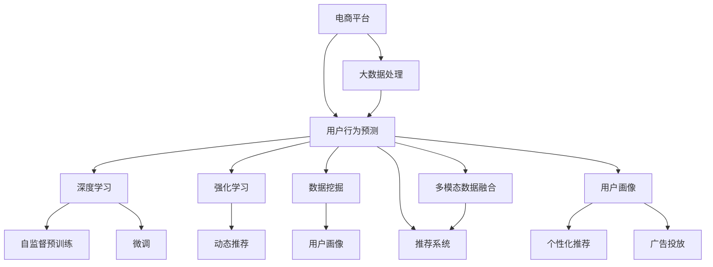

                 

# 大模型技术在电商平台用户行为预测中的应用

> 关键词：大模型技术, 电商平台, 用户行为预测, 深度学习, 强化学习, 数据挖掘, 用户画像, 推荐系统, 电商销售

## 1. 背景介绍

### 1.1 问题由来

随着电商平台的迅速发展，用户行为预测已成为电商平台提升销售转化率、优化用户体验、实现个性化推荐的重要手段。传统的用户行为预测方法基于统计学模型或机器学习算法，难以应对电商平台的复杂非结构化数据。近年来，深度学习和大模型技术在电商领域的应用取得了显著进展，借助大模型在用户行为预测上取得了令人瞩目的成果。

### 1.2 问题核心关键点

大模型技术在电商平台用户行为预测中的核心关键点包括：

1. 大数据处理：电商平台需要处理海量用户数据，包括交易记录、浏览行为、社交互动等。大模型可以通过预训练处理大规模无标签数据，学习丰富的用户行为特征。
2. 模型可解释性：电商平台对模型的解释性要求较高，能够理解模型预测的因果关系，指导产品改进和市场策略。
3. 鲁棒性和泛化能力：电商平台用户行为具有不确定性，模型需要具备较强的鲁棒性和泛化能力，避免过拟合。
4. 实时性要求：电商平台对用户行为预测的实时性有较高要求，需要模型能够在短时间内完成预测并更新推荐结果。
5. 多模态数据融合：电商平台数据不仅包括用户浏览记录，还涉及图片、视频、评论等多模态信息，模型需要具备多模态融合能力。

### 1.3 问题研究意义

电商平台用户行为预测的研究，对提高销售转化率、增强用户体验、提升市场竞争力具有重要意义：

1. 精准推荐：通过预测用户购买意图，实现个性化推荐，提高转化率。
2. 库存管理：预测需求波动，优化库存管理，减少缺货和过剩。
3. 精准营销：预测用户行为，精准投放广告，提高广告效果。
4. 运营优化：通过行为预测，优化运营策略，如促销活动、内容推送等。
5. 客户分析：理解用户行为模式，提升客户留存和忠诚度。

## 2. 核心概念与联系

### 2.1 核心概念概述

为更好地理解大模型技术在电商平台用户行为预测中的应用，本节将介绍几个密切相关的核心概念：

- 大模型技术：指基于深度学习模型的自监督预训练和微调技术，通过大规模数据集进行预训练，学习通用特征表示，然后在特定任务上进行微调，获得领域适应的模型。
- 电商平台：通过互联网提供商品交易、服务等的平台，典型如淘宝、京东、Amazon等。
- 用户行为预测：通过分析用户历史行为数据，预测未来行为或决策，如购买意向、产品评价等。
- 深度学习：一种模拟人脑神经网络结构的学习方法，能够处理大规模数据，学习复杂模式。
- 强化学习：通过奖励机制训练智能体，使其最大化长期奖励，应用于电商平台的动态推荐和个性化策略。
- 数据挖掘：从海量数据中提取有用信息，应用于用户行为分析、用户画像构建等。
- 推荐系统：通过算法推荐用户可能感兴趣的商品或服务，提升用户满意度和销售转化率。
- 用户画像：构建用户特征向量，用于个性化推荐和广告投放。

这些概念之间的逻辑关系可以通过以下Mermaid流程图来展示：



这个流程图展示了大模型技术在电商平台用户行为预测的一般框架：

1. 电商平台收集和处理大数据，进行深度学习和大模型预训练。
2. 对大模型进行多模态数据融合和微调，应用于用户行为预测。
3. 深度学习和强化学习用于动态推荐和个性化策略。
4. 数据挖掘和用户画像技术用于用户行为分析和画像构建。
5. 推荐系统基于预测结果进行个性化推荐和广告投放。

这些概念共同构成了电商平台用户行为预测的完整体系，使得大模型技术能够更好地应用于电商场景，提升平台运营效率和用户体验。

## 3. 核心算法原理 & 具体操作步骤
### 3.1 算法原理概述

电商平台用户行为预测的核心算法原理基于深度学习和强化学习。其核心思想是：通过预训练和微调，学习用户行为的通用特征表示，然后在电商场景中，利用强化学习算法动态调整推荐策略，提高预测精度和转化率。

形式化地，假设电商平台的数据集为 $D=\{(x_i,y_i)\}_{i=1}^N, x_i$ 为用户行为数据，$y_i$ 为预测目标。设大模型为 $M_{\theta}$，其中 $\theta$ 为模型参数。预测目标函数为 $f(x_i)$，则预测模型可以表示为：

$$
f(x_i) = M_{\theta}(x_i)
$$

通过训练模型 $M_{\theta}$，使其最小化预测误差，得到最优参数 $\theta^*$：

$$
\theta^* = \mathop{\arg\min}_{\theta} \mathcal{L}(M_{\theta}, D)
$$

其中 $\mathcal{L}$ 为预测误差损失函数，如均方误差损失、交叉熵损失等。

### 3.2 算法步骤详解

电商平台用户行为预测的算法步骤如下：

**Step 1: 数据预处理**
- 收集电商平台用户行为数据，包括浏览记录、交易记录、评价反馈等，进行数据清洗和格式转换。
- 将数据划分为训练集、验证集和测试集，保证数据分布的一致性。

**Step 2: 自监督预训练**
- 选择适合的预训练模型，如Transformer、BERT等，对其进行自监督预训练，学习用户行为通用特征。
- 利用电商平台无标签大数据，如用户浏览记录、商品描述等，进行自监督学习任务，如语言模型预训练、视觉特征提取等。

**Step 3: 微调与融合**
- 在电商任务上进行微调，优化模型参数，使其适应电商场景。
- 融合多模态数据，如商品图片、用户评论等，通过深度学习模型进行多模态特征提取和融合。

**Step 4: 强化学习优化**
- 设计强化学习环境，将电商推荐任务转化为智能体与环境互动的问题。
- 应用强化学习算法，如Q-learning、Policy Gradient等，训练智能体，优化推荐策略。

**Step 5: 评估与部署**
- 在测试集上评估模型性能，对比预测结果与实际行为的差异。
- 将优化后的模型部署到电商平台，进行实时推荐和预测。

### 3.3 算法优缺点

大模型技术在电商平台用户行为预测中的优点包括：

1. 高精度预测：大模型通过预训练和微调，能够学习到复杂的用户行为特征，提高预测精度。
2. 多模态融合：大模型能够处理多种类型的数据，如文本、图片、视频等，进行多模态特征融合。
3. 动态优化：强化学习算法能够根据用户行为动态调整推荐策略，提升用户体验。
4. 泛化能力强：大模型通过大规模数据预训练，具备较强的泛化能力，适应不同电商场景。

其缺点包括：

1. 数据需求量大：预训练和微调需要大量无标签数据，电商平台可能难以获得足够的数据量。
2. 计算成本高：大模型训练和推理需要强大的计算资源，成本较高。
3. 模型复杂度高：大模型结构复杂，难以解释其内部决策过程。
4. 实时性要求高：电商平台对用户行为预测的实时性要求较高，大模型需要快速处理和预测。
5. 数据隐私问题：电商平台用户行为数据涉及隐私，如何保护用户数据，防止滥用是一个重要问题。

### 3.4 算法应用领域

基于大模型技术在电商平台用户行为预测的应用，主要涉及以下几个领域：

1. 个性化推荐：通过预测用户购买意向，实时生成个性化推荐商品，提高销售转化率。
2. 用户画像构建：通过分析用户行为数据，构建详细的用户画像，提升用户满意度。
3. 动态定价：通过预测市场需求和用户反应，动态调整商品价格，优化销售收益。
4. 广告投放：通过预测用户对广告的反应，优化广告投放策略，提升广告效果。
5. 库存管理：通过预测商品销售趋势，优化库存水平，减少缺货和过剩。
6. 用户流失预测：通过预测用户流失风险，提前采取措施，减少用户流失率。

以上应用领域展示了大模型技术在电商平台用户行为预测中的广阔前景。

## 4. 数学模型和公式 & 详细讲解  
### 4.1 数学模型构建

本节将使用数学语言对电商平台用户行为预测的模型构建过程进行更加严格的刻画。

设电商平台的数据集为 $D=\{(x_i,y_i)\}_{i=1}^N, x_i$ 为用户行为数据，$y_i$ 为预测目标。设大模型为 $M_{\theta}$，其中 $\theta$ 为模型参数。预测目标函数为 $f(x_i)$，则预测模型可以表示为：

$$
f(x_i) = M_{\theta}(x_i)
$$

通过训练模型 $M_{\theta}$，使其最小化预测误差，得到最优参数 $\theta^*$：

$$
\theta^* = \mathop{\arg\min}_{\theta} \mathcal{L}(M_{\theta}, D)
$$

其中 $\mathcal{L}$ 为预测误差损失函数，如均方误差损失、交叉熵损失等。

### 4.2 公式推导过程

以下我们以电商推荐任务为例，推导深度学习模型的预测函数及其梯度计算公式。

设电商平台推荐任务为 $T$，其中 $x_i$ 为用户行为数据，$y_i$ 为推荐商品。设预测模型为 $M_{\theta}$，其中 $\theta$ 为模型参数。预测目标函数为 $f(x_i,y_i)$，则预测模型可以表示为：

$$
f(x_i) = M_{\theta}(x_i)
$$

假设模型 $M_{\theta}$ 在输入 $x_i$ 上的输出为 $\hat{y}=M_{\theta}(x_i)$，表示模型预测的推荐商品。真实标签 $y \in \{1,0\}$，表示用户是否购买了该商品。则二分类交叉熵损失函数定义为：

$$
\ell(M_{\theta}(x_i),y) = -[y\log \hat{y} + (1-y)\log (1-\hat{y})]
$$

将其代入预测误差损失函数，得：

$$
\mathcal{L}(\theta) = -\frac{1}{N}\sum_{i=1}^N [y_i\log M_{\theta}(x_i)+(1-y_i)\log(1-M_{\theta}(x_i))]
$$

根据链式法则，损失函数对参数 $\theta_k$ 的梯度为：

$$
\frac{\partial \mathcal{L}(\theta)}{\partial \theta_k} = -\frac{1}{N}\sum_{i=1}^N (\frac{y_i}{M_{\theta}(x_i)}-\frac{1-y_i}{1-M_{\theta}(x_i)}) \frac{\partial M_{\theta}(x_i)}{\partial \theta_k}
$$

其中 $\frac{\partial M_{\theta}(x_i)}{\partial \theta_k}$ 可进一步递归展开，利用自动微分技术完成计算。

在得到损失函数的梯度后，即可带入参数更新公式，完成模型的迭代优化。重复上述过程直至收敛，最终得到适应电商推荐任务的最优模型参数 $\theta^*$。

## 5. 项目实践：代码实例和详细解释说明
### 5.1 开发环境搭建

在进行电商平台用户行为预测的微调实践前，我们需要准备好开发环境。以下是使用Python进行PyTorch开发的环境配置流程：

1. 安装Anaconda：从官网下载并安装Anaconda，用于创建独立的Python环境。

2. 创建并激活虚拟环境：
```bash
conda create -n pytorch-env python=3.8 
conda activate pytorch-env
```

3. 安装PyTorch：根据CUDA版本，从官网获取对应的安装命令。例如：
```bash
conda install pytorch torchvision torchaudio cudatoolkit=11.1 -c pytorch -c conda-forge
```

4. 安装Transformers库：
```bash
pip install transformers
```

5. 安装各类工具包：
```bash
pip install numpy pandas scikit-learn matplotlib tqdm jupyter notebook ipython
```

完成上述步骤后，即可在`pytorch-env`环境中开始微调实践。

### 5.2 源代码详细实现

这里我们以电商推荐任务为例，给出使用Transformers库对BERT模型进行微调的PyTorch代码实现。

首先，定义电商推荐任务的数据处理函数：

```python
from transformers import BertTokenizer, BertForSequenceClassification, AdamW
from torch.utils.data import Dataset, DataLoader
from sklearn.metrics import accuracy_score

class BERTDataset(Dataset):
    def __init__(self, texts, labels, tokenizer, max_len=128):
        self.texts = texts
        self.labels = labels
        self.tokenizer = tokenizer
        self.max_len = max_len
        
    def __len__(self):
        return len(self.texts)
    
    def __getitem__(self, item):
        text = self.texts[item]
        label = self.labels[item]
        
        encoding = self.tokenizer(text, return_tensors='pt', max_length=self.max_len, padding='max_length', truncation=True)
        input_ids = encoding['input_ids'][0]
        attention_mask = encoding['attention_mask'][0]
        
        # 对标签进行编码
        encoded_labels = [1 if label else 0 for label in self.labels] 
        encoded_labels.extend([0] * (self.max_len - len(encoded_labels)))
        labels = torch.tensor(encoded_labels, dtype=torch.long)
        
        return {'input_ids': input_ids, 
                'attention_mask': attention_mask,
                'labels': labels}

# 加载模型和数据
tokenizer = BertTokenizer.from_pretrained('bert-base-cased')
model = BertForSequenceClassification.from_pretrained('bert-base-cased', num_labels=2)
train_dataset = BERTDataset(train_texts, train_labels, tokenizer)
dev_dataset = BERTDataset(dev_texts, dev_labels, tokenizer)
test_dataset = BERTDataset(test_texts, test_labels, tokenizer)

# 设置优化器
optimizer = AdamW(model.parameters(), lr=2e-5)
```

然后，定义训练和评估函数：

```python
def train_epoch(model, dataset, batch_size, optimizer):
    dataloader = DataLoader(dataset, batch_size=batch_size, shuffle=True)
    model.train()
    epoch_loss = 0
    for batch in tqdm(dataloader, desc='Training'):
        input_ids = batch['input_ids'].to(device)
        attention_mask = batch['attention_mask'].to(device)
        labels = batch['labels'].to(device)
        model.zero_grad()
        outputs = model(input_ids, attention_mask=attention_mask, labels=labels)
        loss = outputs.loss
        epoch_loss += loss.item()
        loss.backward()
        optimizer.step()
    return epoch_loss / len(dataloader)

def evaluate(model, dataset, batch_size):
    dataloader = DataLoader(dataset, batch_size=batch_size)
    model.eval()
    preds, labels = [], []
    with torch.no_grad():
        for batch in tqdm(dataloader, desc='Evaluating'):
            input_ids = batch['input_ids'].to(device)
            attention_mask = batch['attention_mask'].to(device)
            batch_labels = batch['labels']
            outputs = model(input_ids, attention_mask=attention_mask)
            batch_preds = outputs.logits.argmax(dim=2).to('cpu').tolist()
            batch_labels = batch_labels.to('cpu').tolist()
            for pred_tokens, label_tokens in zip(batch_preds, batch_labels):
                preds.append(pred_tokens[:len(label_tokens)])
                labels.append(label_tokens)
                
    return accuracy_score(labels, preds)
```

最后，启动训练流程并在测试集上评估：

```python
epochs = 5
batch_size = 16

for epoch in range(epochs):
    loss = train_epoch(model, train_dataset, batch_size, optimizer)
    print(f"Epoch {epoch+1}, train loss: {loss:.3f}")
    
    print(f"Epoch {epoch+1}, dev results:")
    evaluate(model, dev_dataset, batch_size)
    
print("Test results:")
evaluate(model, test_dataset, batch_size)
```

以上就是使用PyTorch对BERT进行电商推荐任务微调的完整代码实现。可以看到，得益于Transformers库的强大封装，我们可以用相对简洁的代码完成BERT模型的加载和微调。

### 5.3 代码解读与分析

让我们再详细解读一下关键代码的实现细节：

**BERTDataset类**：
- `__init__`方法：初始化文本、标签、分词器等关键组件。
- `__len__`方法：返回数据集的样本数量。
- `__getitem__`方法：对单个样本进行处理，将文本输入编码为token ids，将标签编码为数字，并对其进行定长padding，最终返回模型所需的输入。

**模型和优化器**：
- 加载BERT模型和优化器，设置学习率。

**训练和评估函数**：
- 使用PyTorch的DataLoader对数据集进行批次化加载，供模型训练和推理使用。
- 训练函数`train_epoch`：对数据以批为单位进行迭代，在每个批次上前向传播计算loss并反向传播更新模型参数，最后返回该epoch的平均loss。
- 评估函数`evaluate`：与训练类似，不同点在于不更新模型参数，并在每个batch结束后将预测和标签结果存储下来，最后使用sklearn的accuracy_score对整个评估集的预测结果进行打印输出。

**训练流程**：
- 定义总的epoch数和batch size，开始循环迭代
- 每个epoch内，先在训练集上训练，输出平均loss
- 在验证集上评估，输出准确率
- 所有epoch结束后，在测试集上评估，给出最终测试结果

可以看到，PyTorch配合Transformers库使得BERT微调的代码实现变得简洁高效。开发者可以将更多精力放在数据处理、模型改进等高层逻辑上，而不必过多关注底层的实现细节。

当然，工业级的系统实现还需考虑更多因素，如模型的保存和部署、超参数的自动搜索、更灵活的任务适配层等。但核心的微调范式基本与此类似。

## 6. 实际应用场景
### 6.1 电商平台用户行为预测的应用场景

电商平台用户行为预测具有广泛的应用场景，具体包括：

1. **个性化推荐**：通过预测用户购买意向，实时生成个性化推荐商品，提高销售转化率。
2. **用户画像构建**：通过分析用户行为数据，构建详细的用户画像，提升用户满意度。
3. **动态定价**：通过预测市场需求和用户反应，动态调整商品价格，优化销售收益。
4. **广告投放**：通过预测用户对广告的反应，优化广告投放策略，提升广告效果。
5. **库存管理**：通过预测商品销售趋势，优化库存水平，减少缺货和过剩。
6. **用户流失预测**：通过预测用户流失风险，提前采取措施，减少用户流失率。

### 6.2 未来应用展望

电商平台用户行为预测的未来应用前景广阔，随着大模型技术和深度学习算法的不断发展，可以预见：

1. **跨平台协同**：不同电商平台之间可以共享用户行为数据，进行联合预测，提升推荐效果。
2. **实时动态优化**：结合物联网、大数据等技术，实时监控用户行为，动态调整推荐策略，提升用户体验。
3. **多模态融合**：结合商品图片、视频、评论等多模态数据，提升推荐精度。
4. **个性化推荐优化**：通过强化学习等技术，优化推荐算法，提高用户满意度。
5. **多目标优化**：结合销售、用户满意度、用户留存等多个目标，优化推荐系统。
6. **智能客服**：结合自然语言处理和大模型，实现智能客服，提升用户互动体验。

## 7. 工具和资源推荐
### 7.1 学习资源推荐

为了帮助开发者系统掌握大模型技术在电商平台用户行为预测中的应用，这里推荐一些优质的学习资源：

1. 《深度学习》系列书籍：由多位深度学习专家合著，系统介绍深度学习理论、算法和应用。
2. 《自然语言处理综论》：斯坦福大学李飞飞教授的NLP经典教材，全面介绍NLP技术和应用。
3. 《电商数据科学与算法》：电商数据科学领域的经典教材，涵盖电商数据分析、预测建模、推荐系统等内容。
4. 《强化学习》系列课程：斯坦福大学李航教授的强化学习课程，讲解强化学习原理和应用。
5. 《深度学习框架PyTorch实战》：讲解PyTorch框架的使用和深度学习应用，包括电商平台用户行为预测等。

通过对这些资源的学习实践，相信你一定能够快速掌握大模型技术在电商平台用户行为预测中的精髓，并用于解决实际的NLP问题。
###  7.2 开发工具推荐

高效的开发离不开优秀的工具支持。以下是几款用于电商平台用户行为预测开发的常用工具：

1. PyTorch：基于Python的开源深度学习框架，灵活动态的计算图，适合快速迭代研究。
2. TensorFlow：由Google主导开发的开源深度学习框架，生产部署方便，适合大规模工程应用。
3. Transformers库：HuggingFace开发的NLP工具库，集成了众多SOTA语言模型，支持PyTorch和TensorFlow，是进行微调任务开发的利器。
4. Weights & Biases：模型训练的实验跟踪工具，可以记录和可视化模型训练过程中的各项指标，方便对比和调优。
5. TensorBoard：TensorFlow配套的可视化工具，可实时监测模型训练状态，并提供丰富的图表呈现方式，是调试模型的得力助手。
6. Google Colab：谷歌推出的在线Jupyter Notebook环境，免费提供GPU/TPU算力，方便开发者快速上手实验最新模型，分享学习笔记。

合理利用这些工具，可以显著提升电商平台用户行为预测任务的开发效率，加快创新迭代的步伐。

### 7.3 相关论文推荐

大模型技术在电商平台用户行为预测的应用研究已经取得诸多成果，以下是几篇奠基性的相关论文，推荐阅读：

1. Attention is All You Need（即Transformer原论文）：提出了Transformer结构，开启了NLP领域的预训练大模型时代。
2. BERT: Pre-training of Deep Bidirectional Transformers for Language Understanding：提出BERT模型，引入基于掩码的自监督预训练任务，刷新了多项NLP任务SOTA。
3. Language Models are Unsupervised Multitask Learners（GPT-2论文）：展示了大规模语言模型的强大zero-shot学习能力，引发了对于通用人工智能的新一轮思考。
4. Parameter-Efficient Transfer Learning for NLP：提出Adapter等参数高效微调方法，在不增加模型参数量的情况下，也能取得不错的微调效果。
5. Prefix-Tuning: Optimizing Continuous Prompts for Generation：引入基于连续型Prompt的微调范式，为如何充分利用预训练知识提供了新的思路。
6. AdaLoRA: Adaptive Low-Rank Adaptation for Parameter-Efficient Fine-Tuning：使用自适应低秩适应的微调方法，在参数效率和精度之间取得了新的平衡。

这些论文代表了大模型技术在电商平台用户行为预测领域的发展脉络。通过学习这些前沿成果，可以帮助研究者把握学科前进方向，激发更多的创新灵感。

## 8. 总结：未来发展趋势与挑战

### 8.1 总结

本文对基于深度学习和强化学习的大模型技术在电商平台用户行为预测中的应用进行了全面系统的介绍。首先阐述了电商平台的复杂性和用户行为预测的重要性，明确了微调在电商推荐系统中的应用价值。其次，从原理到实践，详细讲解了电商推荐任务的数学模型和优化算法，给出了微调任务开发的完整代码实例。同时，本文还广泛探讨了电商推荐任务在实际应用中的场景和未来发展趋势，展示了微调范式的巨大潜力。

通过本文的系统梳理，可以看到，大模型技术在电商平台用户行为预测中的应用前景广阔，具有高精度预测、多模态融合、动态优化等优势。面向未来，大模型技术需要在数据隐私、计算效率、模型可解释性等方面进行进一步优化，以适应电商场景的实时性和安全性要求。

### 8.2 未来发展趋势

展望未来，大模型技术在电商平台用户行为预测领域将呈现以下几个发展趋势：

1. **多模态融合**：结合商品图片、视频、评论等多模态数据，提升推荐精度。
2. **跨平台协同**：不同电商平台之间共享用户行为数据，进行联合预测，提升推荐效果。
3. **实时动态优化**：结合物联网、大数据等技术，实时监控用户行为，动态调整推荐策略，提升用户体验。
4. **多目标优化**：结合销售、用户满意度、用户留存等多个目标，优化推荐系统。
5. **个性化推荐优化**：通过强化学习等技术，优化推荐算法，提高用户满意度。
6. **智能客服**：结合自然语言处理和大模型，实现智能客服，提升用户互动体验。

以上趋势凸显了大模型技术在电商平台用户行为预测领域的广阔前景。这些方向的探索发展，必将进一步提升电商平台推荐系统的性能和用户体验，为电商行业带来新的变革。

### 8.3 面临的挑战

尽管大模型技术在电商平台用户行为预测中取得了显著成果，但在迈向更加智能化、普适化应用的过程中，仍面临诸多挑战：

1. **数据隐私问题**：电商平台用户行为数据涉及隐私，如何保护用户数据，防止滥用是一个重要问题。
2. **计算成本高**：大模型训练和推理需要强大的计算资源，成本较高。
3. **模型可解释性不足**：大模型难以解释其内部决策过程，缺乏透明性。
4. **实时性要求高**：电商平台对用户行为预测的实时性要求较高，大模型需要快速处理和预测。
5. **多目标优化困难**：电商平台推荐系统需要同时优化多个目标，如何平衡各方需求是一个挑战。

### 8.4 研究展望

面对大模型技术在电商平台用户行为预测中的挑战，未来的研究需要在以下几个方面寻求新的突破：

1. **隐私保护**：引入隐私保护技术，如差分隐私、联邦学习等，保护用户数据隐私。
2. **模型压缩**：开发更加高效的模型压缩和稀疏化存储技术，降低计算成本。
3. **可解释性增强**：引入可解释性技术，如可视化、模型蒸馏等，提升模型透明性。
4. **实时处理**：优化模型结构，采用并行计算等方法，提升实时处理能力。
5. **多目标优化**：结合多个目标进行优化，设计多目标优化算法，提高推荐系统性能。

这些研究方向的探索，必将引领大模型技术在电商平台用户行为预测领域迈向更高的台阶，为构建智能、安全、高效的推荐系统铺平道路。面向未来，大模型技术还需要与其他人工智能技术进行更深入的融合，如知识表示、因果推理、强化学习等，多路径协同发力，共同推动电商平台推荐系统的进步。只有勇于创新、敢于突破，才能不断拓展电商平台的边界，让智能技术更好地造福用户和社会。

## 9. 附录：常见问题与解答

**Q1：电商平台用户行为预测是否适用于所有电商场景？**

A: 电商平台用户行为预测在大多数电商场景中都能取得不错的效果，但对于一些特定领域，如B2B电商、特色电商等，需要进行领域适应的微调。

**Q2：大模型训练需要大量标注数据，如何获得足够的标注数据？**

A: 可以通过数据标注平台，如Amazon Mechanical Turk，进行人工标注。此外，还可以通过半监督学习、自监督学习等方法，利用无标签数据进行模型预训练，减少对标注数据的依赖。

**Q3：电商推荐系统中的用户行为预测任务是否可以与其他任务共享模型？**

A: 电商平台的用户行为预测任务通常与其他任务（如广告投放、动态定价等）高度相关，可以共享部分模型参数，减少训练成本。

**Q4：电商推荐系统中的推荐算法是否可以结合其他技术，如大数据、物联网等？**

A: 电商推荐系统中的推荐算法可以结合大数据、物联网等技术，实时监控用户行为，动态调整推荐策略，提升用户体验。

**Q5：如何评估电商推荐系统的性能？**

A: 电商推荐系统的性能评估可以通过点击率、转化率、留存率等指标进行。可以使用A/B测试等方法评估推荐系统的实际效果。

**Q6：电商推荐系统中的个性化推荐是否可以实时更新？**

A: 电商推荐系统中的个性化推荐可以实时更新，通过动态学习用户行为，不断优化推荐结果。

**Q7：电商推荐系统中的用户行为预测是否可以结合多模态数据？**

A: 电商推荐系统中的用户行为预测可以结合商品图片、视频、评论等多模态数据，提升推荐精度。

---

作者：禅与计算机程序设计艺术 / Zen and the Art of Computer Programming

