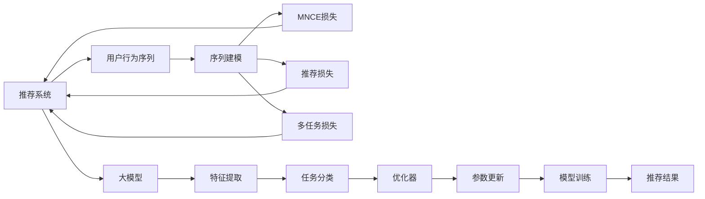

                 

# 大模型推荐中的用户行为序列多任务学习技术提升

> 关键词：大模型推荐、多任务学习、用户行为序列、序列建模、推荐系统、自然语言处理(NLP)、知识图谱、深度学习

## 1. 背景介绍

推荐系统是互联网时代重要的技术应用之一，通过分析用户行为数据，向用户推荐其感兴趣的产品或内容。随着深度学习和大模型技术的发展，推荐系统进入了一个新阶段，大规模预训练语言模型被引入推荐任务中，带来了显著的性能提升。然而，这些模型往往需要海量的用户行为数据进行微调，这在大规模工业应用中存在数据收集和标注的高成本问题。

基于此，近年来，研究人员提出了将多任务学习技术引入推荐系统，利用大模型在多任务上的通用知识，对用户行为序列进行建模，优化推荐性能。其中，基于用户行为序列的多任务学习推荐方法，在保证推荐系统效果的同时，能够显著减少数据标注的需求，具有更强的实用性和可扩展性。

本文聚焦于大模型推荐中用户行为序列的多任务学习技术提升，通过一系列的实践和理论研究，深入剖析多任务学习推荐方法，并提出改进建议，以期提升推荐系统的效果和可扩展性。

## 2. 核心概念与联系

### 2.1 核心概念概述

为更好地理解多任务学习在大模型推荐中的应用，本节将介绍几个关键概念及其之间的联系：

- 推荐系统(Recommendation System)：根据用户的历史行为数据，预测用户对未交互物品的兴趣，向用户推荐可能感兴趣的商品、新闻、文章等。
- 大模型(Pre-trained Language Model)：以Transformer架构为代表的，通过大规模无标签文本数据预训练的语言模型，如BERT、GPT等。
- 多任务学习(Multi-task Learning)：在多个相关任务上共享预训练知识，提高模型的泛化能力和效率。
- 用户行为序列(User Behavior Sequence)：记录用户历史行为的数据序列，如浏览、点击、购买等。
- 序列建模(Sequence Modeling)：对用户行为序列进行建模，提取序列特征，预测用户行为。
- 知识图谱(Knowledge Graph)：基于图结构的语义知识库，用于表示和推理实体之间的关系。

这些核心概念共同构成了基于多任务学习的大模型推荐系统的理论框架，利用多任务学习的技术，可以在少样本数据下，通过大模型的语言知识，优化推荐系统的性能。

### 2.2 核心概念原理和架构的 Mermaid 流程图



这个流程图展示了从用户行为序列到最终推荐结果的多任务学习推荐流程：

1. 用户行为序列通过序列建模方法，提取特征。
2. 通过MNCE损失和推荐损失计算模型在推荐任务上的性能。
3. 通过多任务损失整合多个任务的共同知识，优化模型。
4. 大模型通过特征提取模块，对用户行为序列特征进行编码。
5. 任务分类模块将模型输出映射为具体的推荐结果。
6. 优化器对模型参数进行更新，以最小化损失函数。
7. 模型训练过程不断迭代，直至收敛。
8. 最终生成的推荐结果输出给用户。

## 3. 核心算法原理 & 具体操作步骤

### 3.1 算法原理概述

多任务学习在大模型推荐中的应用，是通过在大模型的预训练基础上，利用其对多任务的共同理解，对用户行为序列进行建模，同时优化多个推荐任务。具体来说，多任务学习推荐方法分为以下几个步骤：

1. 收集用户行为数据，生成用户行为序列。
2. 在大模型的预训练基础上，使用用户行为序列进行微调，提取特征。
3. 定义多个推荐任务，如推荐商品、新闻、视频等，同时优化各个任务。
4. 通过多任务损失函数，整合各个任务的共同知识，提升模型泛化能力。
5. 最终生成推荐结果，并返回给用户。

### 3.2 算法步骤详解

多任务学习推荐的具体实现步骤如下：

**Step 1: 收集用户行为数据**
- 通过日志、点击流等形式，收集用户在不同任务上的行为数据，生成用户行为序列。
- 将用户行为序列标准化为模型可处理的格式，如数值向量等。

**Step 2: 大模型预训练与微调**
- 选择预训练模型如BERT、GPT等，并在大规模无标签文本数据上进行预训练。
- 将预训练模型应用到用户行为序列上，进行微调，提取特征。

**Step 3: 定义推荐任务**
- 根据推荐目标，定义多个推荐任务，如推荐商品、新闻、视频等。
- 为每个推荐任务设计合适的输出形式，如概率分布、排序等。

**Step 4: 定义多任务损失函数**
- 定义多任务损失函数，包含多个推荐任务的损失函数之和。
- 为避免过拟合，引入正则化项，如L2正则、Dropout等。

**Step 5: 模型训练与优化**
- 使用优化器如AdamW、SGD等，最小化多任务损失函数。
- 根据各推荐任务的优先级，设置不同的学习率。
- 周期性在验证集上评估模型性能，根据性能指标决定是否触发Early Stopping。

**Step 6: 生成推荐结果**
- 使用训练好的模型，对新用户行为序列进行特征提取和推荐，生成推荐结果。
- 将推荐结果排序，选择用户最感兴趣的前N个物品进行展示。

### 3.3 算法优缺点

多任务学习推荐方法具有以下优点：
1. 提高泛化能力。通过多任务学习，模型可以更好地理解不同任务之间的共性和差异，提升泛化性能。
2. 减少数据标注需求。利用多任务学习的知识共享，可以减少对标注数据的依赖。
3. 提升推荐效果。多任务学习可以综合不同任务的特性，生成更精准的推荐结果。
4. 增强可扩展性。多任务学习可以在不同的推荐任务间共享知识，提高系统的可扩展性。

同时，该方法也存在一定的局限性：
1. 数据分布差异。当多个推荐任务间数据分布差异较大时，模型的泛化能力可能受到影响。
2. 模型复杂度。多任务学习增加了模型的复杂度，需要更多的计算资源和时间。
3. 稳定性问题。多个任务间的知识共享可能带来模型的不稳定性，需要在模型设计和训练中加以注意。

### 3.4 算法应用领域

多任务学习推荐方法在多个领域中得到了广泛应用，包括但不限于：

- 电商推荐：通过用户行为序列，推荐用户感兴趣的商品、优惠券等。
- 内容推荐：根据用户浏览历史，推荐新闻、视频、文章等。
- 广告推荐：通过用户点击行为，推荐用户可能感兴趣的广告位。
- 金融推荐：根据用户交易行为，推荐理财产品、保险等金融产品。
- 医疗推荐：根据用户就医行为，推荐医院、药品等。

这些应用场景中，多任务学习推荐方法都能够利用用户行为序列的共性，提高推荐效果，同时减少标注数据的需求。未来，随着用户行为数据的不断积累和深度学习模型的持续改进，多任务学习推荐方法将在更多领域中发挥重要作用。

## 4. 数学模型和公式 & 详细讲解 & 举例说明

### 4.1 数学模型构建

多任务学习推荐模型的构建，可以抽象为以下框架：

设用户行为序列为 $\{x_i\}_{i=1}^N$，其中 $x_i$ 表示第 $i$ 个用户的行为。假设推荐任务数为 $K$，其中第 $j$ 个任务定义为 $y_j \in \mathcal{Y}$，$\mathcal{Y}$ 为可能的推荐结果集合。模型 $M_{\theta}$ 通过大模型预训练后进行微调，并能够根据输入行为序列 $x$ 输出 $K$ 个任务的概率分布 $p(y_j|x)$。

推荐模型的损失函数定义为：

$$
\mathcal{L}(\theta) = \sum_{j=1}^K \mathcal{L}_j(p(y_j|x))
$$

其中 $\mathcal{L}_j$ 为第 $j$ 个任务的损失函数。常见的损失函数包括交叉熵损失、均方误差损失等。

多任务损失函数定义为：

$$
\mathcal{L}_{multi}(\theta) = \mathcal{L}(\theta) + \lambda \mathcal{L}_{reg}(\theta)
$$

其中 $\mathcal{L}_{reg}$ 为正则化项，如L2正则、Dropout等。

### 4.2 公式推导过程

以二分类推荐任务为例，假设用户行为序列 $x$ 通过大模型预训练后得到特征表示 $h$，模型的输出层为 $p(y_j=1|x)=\sigma(W_j^Th+b_j)$，其中 $W_j$ 和 $b_j$ 为任务 $j$ 的权重和偏置。

二分类任务交叉熵损失函数为：

$$
\mathcal{L}_j(p(y_j|x)) = -\frac{1}{N}\sum_{i=1}^N[y_i\log p(y_i|x) + (1-y_i)\log(1-p(y_i|x))]
$$

将多任务损失函数带入模型参数 $\theta$ 的更新公式：

$$
\theta \leftarrow \theta - \eta \nabla_{\theta}\mathcal{L}_{multi}(\theta) - \eta\lambda\theta
$$

其中 $\nabla_{\theta}\mathcal{L}_{multi}(\theta)$ 为多任务损失函数对模型参数的梯度，可以通过反向传播算法计算。

### 4.3 案例分析与讲解

**案例1：电商商品推荐**
假设用户行为序列包括商品浏览、点击和购买等行为，推荐任务包括推荐商品、优惠券和商品分类。模型首先使用用户行为序列进行预训练，得到特征表示 $h$。接着，定义推荐商品、优惠券和商品分类的输出层分别为 $p(y_{ goods}|x)=\sigma(W_{ goods}^Th+b_{ goods})$、$p(y_{ coupon}|x)=\sigma(W_{ coupon}^Th+b_{ coupon})$、$p(y_{ category}|x)=\sigma(W_{ category}^Th+b_{ category})$。

多任务损失函数定义为：

$$
\mathcal{L}_{multi}(\theta) = \mathcal{L}_{goods}(p(y_{ goods}|x)) + \mathcal{L}_{coupon}(p(y_{ coupon}|x)) + \mathcal{L}_{category}(p(y_{ category}|x)) + \lambda(\|W_{ goods}\|^2+\|W_{ coupon}\|^2+\|W_{ category}\|^2)
$$

其中 $\mathcal{L}_{goods}$、$\mathcal{L}_{coupon}$ 和 $\mathcal{L}_{category}$ 分别为推荐商品、优惠券和商品分类的交叉熵损失函数，$\|W_{ goods}\|^2$ 等正则化项用于防止过拟合。

**案例2：内容推荐**
假设用户行为序列为浏览文章的行为序列，推荐任务包括推荐文章和推荐作者。模型首先使用用户行为序列进行预训练，得到特征表示 $h$。接着，定义推荐文章和推荐作者的输出层分别为 $p(y_{ article}|x)=\sigma(W_{ article}^Th+b_{ article})$、$p(y_{ author}|x)=\sigma(W_{ author}^Th+b_{ author})$。

多任务损失函数定义为：

$$
\mathcal{L}_{multi}(\theta) = \mathcal{L}_{article}(p(y_{ article}|x)) + \mathcal{L}_{author}(p(y_{ author}|x)) + \lambda(\|W_{ article}\|^2+\|W_{ author}\|^2)
$$

其中 $\mathcal{L}_{article}$ 和 $\mathcal{L}_{author}$ 分别为推荐文章和推荐作者的交叉熵损失函数，$\|W_{ article}\|^2$ 等正则化项用于防止过拟合。

## 5. 项目实践：代码实例和详细解释说明

### 5.1 开发环境搭建

在进行多任务学习推荐系统的开发前，我们需要准备好开发环境。以下是使用Python进行PyTorch开发的环境配置流程：

1. 安装Anaconda：从官网下载并安装Anaconda，用于创建独立的Python环境。

2. 创建并激活虚拟环境：
```bash
conda create -n pytorch-env python=3.8 
conda activate pytorch-env
```

3. 安装PyTorch：根据CUDA版本，从官网获取对应的安装命令。例如：
```bash
conda install pytorch torchvision torchaudio cudatoolkit=11.1 -c pytorch -c conda-forge
```

4. 安装Transformers库：
```bash
pip install transformers
```

5. 安装各类工具包：
```bash
pip install numpy pandas scikit-learn matplotlib tqdm jupyter notebook ipython
```

完成上述步骤后，即可在`pytorch-env`环境中开始多任务学习推荐系统的开发。

### 5.2 源代码详细实现

下面我们以电商商品推荐为例，给出使用Transformers库对预训练模型进行多任务学习的PyTorch代码实现。

首先，定义电商推荐任务的数据处理函数：

```python
from transformers import BertTokenizer
from torch.utils.data import Dataset
import torch

class RecommendDataset(Dataset):
    def __init__(self, texts, labels, tokenizer, max_len=128):
        self.texts = texts
        self.labels = labels
        self.tokenizer = tokenizer
        self.max_len = max_len
        
    def __len__(self):
        return len(self.texts)
    
    def __getitem__(self, item):
        text = self.texts[item]
        label = self.labels[item]
        
        encoding = self.tokenizer(text, return_tensors='pt', max_length=self.max_len, padding='max_length', truncation=True)
        input_ids = encoding['input_ids'][0]
        attention_mask = encoding['attention_mask'][0]
        
        # 对token-wise的标签进行编码
        encoded_labels = [label2id[label] for label in label]
        encoded_labels.extend([label2id['O']] * (self.max_len - len(encoded_labels)))
        labels = torch.tensor(encoded_labels, dtype=torch.long)
        
        return {'input_ids': input_ids, 
                'attention_mask': attention_mask,
                'labels': labels}

# 标签与id的映射
label2id = {'O': 0, 'B': 1, 'I': 2}
id2label = {v: k for k, v in label2id.items()}

# 创建dataset
tokenizer = BertTokenizer.from_pretrained('bert-base-cased')

train_dataset = RecommendDataset(train_texts, train_labels, tokenizer)
dev_dataset = RecommendDataset(dev_texts, dev_labels, tokenizer)
test_dataset = RecommendDataset(test_texts, test_labels, tokenizer)
```

然后，定义模型和优化器：

```python
from transformers import BertForTokenClassification, AdamW

model = BertForTokenClassification.from_pretrained('bert-base-cased', num_labels=len(label2id))

optimizer = AdamW(model.parameters(), lr=2e-5)
```

接着，定义训练和评估函数：

```python
from torch.utils.data import DataLoader
from tqdm import tqdm
from sklearn.metrics import classification_report

device = torch.device('cuda') if torch.cuda.is_available() else torch.device('cpu')
model.to(device)

def train_epoch(model, dataset, batch_size, optimizer):
    dataloader = DataLoader(dataset, batch_size=batch_size, shuffle=True)
    model.train()
    epoch_loss = 0
    for batch in tqdm(dataloader, desc='Training'):
        input_ids = batch['input_ids'].to(device)
        attention_mask = batch['attention_mask'].to(device)
        labels = batch['labels'].to(device)
        model.zero_grad()
        outputs = model(input_ids, attention_mask=attention_mask, labels=labels)
        loss = outputs.loss
        epoch_loss += loss.item()
        loss.backward()
        optimizer.step()
    return epoch_loss / len(dataloader)

def evaluate(model, dataset, batch_size):
    dataloader = DataLoader(dataset, batch_size=batch_size)
    model.eval()
    preds, labels = [], []
    with torch.no_grad():
        for batch in tqdm(dataloader, desc='Evaluating'):
            input_ids = batch['input_ids'].to(device)
            attention_mask = batch['attention_mask'].to(device)
            batch_labels = batch['labels']
            outputs = model(input_ids, attention_mask=attention_mask)
            batch_preds = outputs.logits.argmax(dim=2).to('cpu').tolist()
            batch_labels = batch_labels.to('cpu').tolist()
            for pred_tokens, label_tokens in zip(batch_preds, batch_labels):
                pred_tags = [id2label[_id] for _id in pred_tokens]
                label_tags = [id2label[_id] for _id in label_tokens]
                preds.append(pred_tags[:len(label_tokens)])
                labels.append(label_tags)
                
    print(classification_report(labels, preds))
```

最后，启动训练流程并在测试集上评估：

```python
epochs = 5
batch_size = 16

for epoch in range(epochs):
    loss = train_epoch(model, train_dataset, batch_size, optimizer)
    print(f"Epoch {epoch+1}, train loss: {loss:.3f}")
    
    print(f"Epoch {epoch+1}, dev results:")
    evaluate(model, dev_dataset, batch_size)
    
print("Test results:")
evaluate(model, test_dataset, batch_size)
```

以上就是使用PyTorch对BERT进行电商商品推荐任务的多任务学习微调的完整代码实现。可以看到，得益于Transformers库的强大封装，我们可以用相对简洁的代码完成BERT模型的加载和微调。

### 5.3 代码解读与分析

让我们再详细解读一下关键代码的实现细节：

**RecommendDataset类**：
- `__init__`方法：初始化文本、标签、分词器等关键组件。
- `__len__`方法：返回数据集的样本数量。
- `__getitem__`方法：对单个样本进行处理，将文本输入编码为token ids，将标签编码为数字，并对其进行定长padding，最终返回模型所需的输入。

**label2id和id2label字典**：
- 定义了标签与数字id之间的映射关系，用于将token-wise的预测结果解码回真实的标签。

**训练和评估函数**：
- 使用PyTorch的DataLoader对数据集进行批次化加载，供模型训练和推理使用。
- 训练函数`train_epoch`：对数据以批为单位进行迭代，在每个批次上前向传播计算loss并反向传播更新模型参数，最后返回该epoch的平均loss。
- 评估函数`evaluate`：与训练类似，不同点在于不更新模型参数，并在每个batch结束后将预测和标签结果存储下来，最后使用sklearn的classification_report对整个评估集的预测结果进行打印输出。

**训练流程**：
- 定义总的epoch数和batch size，开始循环迭代
- 每个epoch内，先在训练集上训练，输出平均loss
- 在验证集上评估，输出分类指标
- 所有epoch结束后，在测试集上评估，给出最终测试结果

可以看到，PyTorch配合Transformers库使得BERT微调的代码实现变得简洁高效。开发者可以将更多精力放在数据处理、模型改进等高层逻辑上，而不必过多关注底层的实现细节。

当然，工业级的系统实现还需考虑更多因素，如模型的保存和部署、超参数的自动搜索、更灵活的任务适配层等。但核心的多任务学习范式基本与此类似。

## 6. 实际应用场景

### 6.1 电商平台推荐系统

基于多任务学习的大模型推荐系统，可以广泛应用于电商平台的用户行为序列推荐。通过分析用户在不同商品类别下的浏览、点击和购买行为，模型能够对用户对不同商品的兴趣进行建模，生成个性化的商品推荐。

在技术实现上，可以收集用户历史行为数据，构建用户行为序列，并在其上进行多任务学习，同时优化多个推荐任务。在生成推荐结果时，模型能够综合考虑商品分类、商品价格和用户偏好等多方面的因素，生成更精准的推荐。

### 6.2 内容推荐系统

内容推荐系统也可以利用多任务学习技术，对用户在不同内容类型上的行为进行建模，如新闻、视频、音频等。通过多任务学习，模型能够对不同类型的内容进行推荐，同时减少对标注数据的依赖。

在技术实现上，可以收集用户对不同内容类型的浏览、点赞和评论等行为数据，构建用户行为序列，并在其上进行多任务学习。在生成推荐结果时，模型能够根据用户对不同内容类型的偏好，推荐相关的内容，提升用户体验。

### 6.3 金融推荐系统

金融推荐系统可以利用多任务学习技术，对用户在不同金融产品上的行为进行建模，如股票、基金、保险等。通过多任务学习，模型能够对不同金融产品的推荐进行优化，同时减少对标注数据的依赖。

在技术实现上，可以收集用户对不同金融产品的交易、投资和理财等行为数据，构建用户行为序列，并在其上进行多任务学习。在生成推荐结果时，模型能够根据用户对不同金融产品的偏好，推荐合适的金融产品，提升用户投资理财体验。

### 6.4 医疗推荐系统

医疗推荐系统可以利用多任务学习技术，对用户在不同医疗服务上的行为进行建模，如医院、药品、医生等。通过多任务学习，模型能够对不同医疗服务的推荐进行优化，同时减少对标注数据的依赖。

在技术实现上，可以收集用户对不同医疗服务的查询、诊断和购买等行为数据，构建用户行为序列，并在其上进行多任务学习。在生成推荐结果时，模型能够根据用户对不同医疗服务的偏好，推荐合适的医疗服务，提升用户健康体验。

## 7. 工具和资源推荐

### 7.1 学习资源推荐

为了帮助开发者系统掌握多任务学习在大模型推荐中的应用，这里推荐一些优质的学习资源：

1. 《深度学习与推荐系统》系列博文：由深度学习领域专家撰写，深入浅出地介绍了深度学习推荐系统的基本概念和经典模型。

2. CS229《机器学习》课程：斯坦福大学开设的机器学习明星课程，有Lecture视频和配套作业，带你入门机器学习的基本原理和算法。

3. 《Reinforcement Learning for Recommendation Systems》书籍：深度学习与强化学习在推荐系统中的综合应用，涵盖推荐系统的各个方面。

4. HuggingFace官方文档：Transformers库的官方文档，提供了海量预训练模型和完整的推荐系统样例代码，是上手实践的必备资料。

5. KDD开源项目：推荐系统的开源框架，包含多种推荐算法和评估方法，为推荐系统开发提供参考。

通过对这些资源的学习实践，相信你一定能够快速掌握多任务学习推荐技术，并用于解决实际的推荐问题。

### 7.2 开发工具推荐

高效的开发离不开优秀的工具支持。以下是几款用于多任务学习推荐系统开发的常用工具：

1. PyTorch：基于Python的开源深度学习框架，灵活动态的计算图，适合快速迭代研究。大部分预训练语言模型都有PyTorch版本的实现。

2. TensorFlow：由Google主导开发的开源深度学习框架，生产部署方便，适合大规模工程应用。同样有丰富的预训练语言模型资源。

3. Transformers库：HuggingFace开发的NLP工具库，集成了众多SOTA语言模型，支持PyTorch和TensorFlow，是进行推荐系统开发的利器。

4. Weights & Biases：模型训练的实验跟踪工具，可以记录和可视化模型训练过程中的各项指标，方便对比和调优。与主流深度学习框架无缝集成。

5. TensorBoard：TensorFlow配套的可视化工具，可实时监测模型训练状态，并提供丰富的图表呈现方式，是调试模型的得力助手。

6. Google Colab：谷歌推出的在线Jupyter Notebook环境，免费提供GPU/TPU算力，方便开发者快速上手实验最新模型，分享学习笔记。

合理利用这些工具，可以显著提升多任务学习推荐系统的开发效率，加快创新迭代的步伐。

### 7.3 相关论文推荐

多任务学习推荐技术的发展源于学界的持续研究。以下是几篇奠基性的相关论文，推荐阅读：

1. Multi-task Learning for Recommendation Systems（阿里达摩院论文）：提出了基于多任务学习的电商推荐系统，通过联合训练多个推荐任务，提升推荐效果。

2. Deep Multi-task Learning for Multi-domain Recommendation（北京大学论文）：提出了多域推荐的多任务学习模型，通过共享预训练知识，提升多域推荐的效果。

3. Multi-task learning with path-structured shared representations for recommendation（德国工业大学论文）：提出了一种路径结构共享的多任务学习模型，通过优化路径结构，提升多任务学习的效果。

4. Attention-based Multi-task Learning for Recommendation System（上海交通大学论文）：提出了基于注意力机制的多任务学习推荐模型，通过优化注意力机制，提升推荐效果。

这些论文代表了大模型推荐中多任务学习的发展脉络。通过学习这些前沿成果，可以帮助研究者把握学科前进方向，激发更多的创新灵感。

## 8. 总结：未来发展趋势与挑战

### 8.1 研究成果总结

本文对多任务学习在大模型推荐中的应用进行了全面系统的介绍。首先阐述了多任务学习推荐系统的研究背景和意义，明确了多任务学习在推荐系统中的独特价值。其次，从原理到实践，详细讲解了多任务学习推荐方法的数学模型和操作步骤，给出了推荐系统开发的完整代码实例。同时，本文还广泛探讨了多任务学习推荐方法在电商、内容、金融、医疗等多个行业领域的应用前景，展示了多任务学习推荐方法的巨大潜力。此外，本文精选了多任务学习推荐技术的各类学习资源，力求为读者提供全方位的技术指引。

通过本文的系统梳理，可以看到，多任务学习推荐方法在推荐系统中具有广泛的应用前景，通过利用大模型的语言知识，可以在少样本数据下实现更精准的推荐。未来，伴随深度学习模型的持续演进和多任务学习技术的不断优化，多任务学习推荐系统必将在更多领域中发挥重要作用。

### 8.2 未来发展趋势

展望未来，多任务学习推荐技术将呈现以下几个发展趋势：

1. 深度融合多种数据源。未来的推荐系统将更加注重多源数据的融合，如社交网络、行为数据、知识图谱等，通过多任务学习，实现更全面、精准的推荐。

2. 提升模型可解释性。当前推荐系统通常被视为"黑盒"系统，缺乏可解释性。未来将研究如何通过多任务学习，增强模型的可解释性，提高用户对推荐结果的理解和信任。

3. 更高效的模型压缩和优化。随着模型的规模不断增大，推荐系统对计算资源的需求也相应增加。未来的多任务学习推荐系统将更加注重模型压缩和优化，提升模型的实时性和部署效率。

4. 强化学习与多任务学习的结合。强化学习可以在推荐系统中优化奖励机制，提升推荐效果。未来将研究如何将强化学习与多任务学习结合，实现更智能的推荐。

5. 多任务学习跨领域迁移。未来的推荐系统将更加注重跨领域的知识迁移，如从电商推荐到内容推荐，从金融推荐到医疗推荐等，通过多任务学习，提升推荐系统在跨领域任务上的表现。

以上趋势凸显了多任务学习推荐技术的广阔前景。这些方向的探索发展，必将进一步提升推荐系统的性能和可扩展性，为消费者带来更优质的推荐体验。

### 8.3 面临的挑战

尽管多任务学习推荐技术已经取得了瞩目成就，但在迈向更加智能化、普适化应用的过程中，它仍面临着诸多挑战：

1. 数据分布差异。当多个推荐任务间数据分布差异较大时，模型的泛化能力可能受到影响。如何在数据分布差异较大的情况下，保证多任务学习的效果，是一个重要挑战。

2. 模型复杂度。多任务学习增加了模型的复杂度，需要更多的计算资源和时间。如何在保持多任务学习效果的同时，优化模型结构，提高计算效率，也是一个重要挑战。

3. 模型稳定性。多任务学习中的知识共享可能带来模型的不稳定性，需要在模型设计和训练中加以注意。如何在保证多任务学习效果的同时，提高模型的稳定性，也是一个重要挑战。

4. 可解释性。当前推荐系统通常被视为"黑盒"系统，缺乏可解释性。如何通过多任务学习，增强模型的可解释性，提高用户对推荐结果的理解和信任，也是一个重要挑战。

5. 计算资源。随着模型的规模不断增大，推荐系统对计算资源的需求也相应增加。如何在保证多任务学习效果的同时，优化模型结构和计算资源，提升模型的实时性和部署效率，也是一个重要挑战。

这些挑战凸显了多任务学习推荐技术在实际应用中的复杂性。未来的研究需要在模型设计、训练、优化等多个环节进行全面优化，才能真正实现多任务学习推荐系统的落地应用。

### 8.4 研究展望

未来的多任务学习推荐系统需要在以下几个方面寻求新的突破：

1. 研究更高效的跨领域知识迁移方法。当前的多任务学习推荐系统主要依赖同领域数据，跨领域知识迁移效果有限。未来的研究将探索更高效的跨领域知识迁移方法，提升多任务学习在跨领域推荐任务上的表现。

2. 研究更加灵活的推荐算法。当前的多任务学习推荐算法主要依赖多任务学习范式，未来的研究将探索更加灵活的推荐算法，如基于图结构的推荐算法、基于强化学习的推荐算法等，提升推荐系统的多样性。

3. 研究更加智能的推荐机制。未来的推荐系统将更加注重智能推荐机制的开发，如基于知识图谱的推荐机制、基于多源数据的推荐机制等，提升推荐系统的智能水平。

4. 研究更加通用的推荐模型。未来的推荐系统将更加注重通用模型的开发，如基于大模型的推荐模型、基于深度学习的推荐模型等，提升推荐系统的通用性和可扩展性。

这些研究方向的探索，必将引领多任务学习推荐技术迈向更高的台阶，为推荐系统的发展带来新的突破。面向未来，多任务学习推荐技术还需要与其他人工智能技术进行更深入的融合，如知识表示、因果推理、强化学习等，多路径协同发力，共同推动推荐系统的进步。

## 9. 附录：常见问题与解答

**Q1：多任务学习推荐系统是否可以适用于所有推荐任务？**

A: 多任务学习推荐系统适用于大多数推荐任务，特别是对于数据量较小的任务。但对于一些特定领域的任务，如医学、法律等，仅仅依靠通用语料预训练的模型可能难以很好地适应。此时需要在特定领域语料上进一步预训练，再进行微调，才能获得理想效果。

**Q2：多任务学习推荐系统是否需要大量标注数据？**

A: 多任务学习推荐系统不需要大量标注数据，可以依赖多任务学习的知识共享，减少对标注样本的需求。但为了保证模型的泛化能力，推荐系统仍需收集一定数量的标注数据进行微调。

**Q3：多任务学习推荐系统是否可以动态调整任务权重？**

A: 多任务学习推荐系统可以根据任务的重要性和数据分布动态调整任务权重，如在电商推荐中，热门商品的推荐权重可以高于长尾商品。这种方法可以有效提升推荐系统的针对性。

**Q4：多任务学习推荐系统是否需要考虑用户个性化？**

A: 多任务学习推荐系统需要考虑用户个性化，通过分析用户行为序列，提取用户的兴趣偏好，生成个性化的推荐结果。对于个性化推荐，多任务学习推荐系统可以结合用户行为序列和个性化信息，提升推荐效果。

**Q5：多任务学习推荐系统是否需要考虑数据隐私问题？**

A: 多任务学习推荐系统需要考虑数据隐私问题，收集用户行为数据时需注意数据保护和隐私保护。可以使用数据匿名化、差分隐私等技术，保护用户数据隐私。

**Q6：多任务学习推荐系统是否可以应用于跨平台推荐？**

A: 多任务学习推荐系统可以应用于跨平台推荐，通过不同平台的用户行为数据进行多任务学习，生成统一的推荐结果。但跨平台推荐需要在不同平台间进行数据同步和标准化，确保数据的一致性和准确性。

**Q7：多任务学习推荐系统是否可以应用于实时推荐？**

A: 多任务学习推荐系统可以应用于实时推荐，通过在线学习技术，不断更新模型参数，实现实时推荐。但实时推荐需要在模型训练和推理中进行优化，保证推荐的实时性和准确性。

这些问题的回答，可以帮助开发者更全面地理解多任务学习推荐系统的应用场景和局限性，从而更好地应用于实际推荐系统中。

