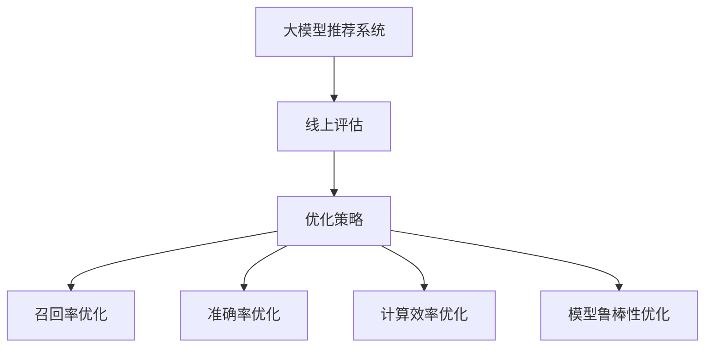

                 

# 大模型推荐效果的线上评估与优化策略升级

## 1. 背景介绍

随着互联网技术的发展和推荐系统的普及，线上推荐已成为电商平台、社交平台、新闻门户等网站不可或缺的核心功能之一。然而，由于推荐系统的复杂性和动态性，线上评估与优化推荐模型的效果成为了一大难题。传统推荐系统主要基于协同过滤、内容推荐等方法，这些方法虽然可以取得一定的效果，但在面对海量用户和动态变化的数据时，仍显力不从心。近年来，基于大模型的推荐系统因其强大的表示学习和泛化能力，逐渐成为推荐系统领域的研究热点。然而，如何高效评估与优化大模型推荐效果，仍是该领域的一大挑战。本文将对大模型推荐效果的线上评估与优化策略进行全面系统的阐述。

## 2. 核心概念与联系

### 2.1 核心概念概述

在介绍线上评估与优化策略前，有必要先理解几个核心概念：

- **大模型推荐系统**：基于深度学习的大规模语言模型在推荐系统中的应用。常见的大模型有BERT、GPT等，通过在用户历史数据上进行预训练，学习用户兴趣表示，再通过在线微调优化推荐效果。
- **线上评估**：在实时数据流上对推荐模型进行评估，实时了解模型表现，动态调整模型参数。
- **优化策略**：通过对线上评估结果的分析，应用各种优化技术调整模型，提升推荐效果。
- **推荐指标**：如召回率、准确率、点击率、覆盖率等，用于衡量推荐系统的效果。
- **计算效率**：在保证推荐精度的情况下，如何高效计算推荐结果。
- **模型鲁棒性**：模型面对不同场景下的稳定性和泛化能力。

通过以下Mermaid流程图，可以更好地理解这些核心概念之间的逻辑关系：



### 2.2 核心概念原理和架构

大模型推荐系统通常基于Transformer模型，通过在大规模用户历史数据上预训练，学习用户兴趣和行为表示。常见的预训练任务包括用户历史数据预测、用户兴趣演化预测等。通过在线微调，对用户输入的实时行为进行动态学习，生成推荐结果。推荐系统的架构一般包括数据预处理、模型预训练、在线微调、结果生成等多个模块。

## 3. 核心算法原理 & 具体操作步骤
### 3.1 算法原理概述

大模型推荐系统的线上评估与优化策略主要分为以下几个步骤：

1. **数据预处理**：收集用户历史行为数据，包括浏览记录、购买记录、评价记录等，进行数据清洗和特征工程，转换为适合大模型处理的格式。
2. **模型预训练**：在大规模用户历史数据上，使用预训练任务对大模型进行训练，学习用户兴趣表示。
3. **在线微调**：在用户实时行为数据上，进行在线微调，优化推荐效果。
4. **推荐结果生成**：根据微调后的模型，生成推荐结果，并进行线上评估。

### 3.2 算法步骤详解

以下将详细介绍每个步骤的实现方法。

**Step 1: 数据预处理**

数据预处理的目标是将原始数据转换为适合大模型处理的形式。主要包括以下步骤：

1. **数据收集**：从电商平台、社交平台、新闻门户等网站收集用户历史行为数据，包括浏览记录、购买记录、评价记录等。
2. **数据清洗**：去除不完整、不相关、错误的数据，保证数据质量。
3. **特征工程**：根据业务需求，设计合适的特征，如用户ID、商品ID、时间戳、位置信息等。
4. **数据分割**：将数据划分为训练集、验证集和测试集，以便进行模型训练和评估。

**Step 2: 模型预训练**

模型预训练的目标是学习用户兴趣和行为表示。主要包括以下步骤：

1. **选择预训练任务**：根据业务需求，选择合适的预训练任务。如用户兴趣演化预测、用户历史数据预测等。
2. **模型初始化**：选择合适的大模型，如BERT、GPT等，并进行初始化。
3. **预训练过程**：在训练集上，使用预训练任务对模型进行训练，学习用户兴趣表示。
4. **模型评估**：在验证集上，评估预训练模型的效果，调整模型参数，提升性能。

**Step 3: 在线微调**

在线微调的目标是动态学习用户实时行为，生成推荐结果。主要包括以下步骤：

1. **数据收集**：在实时数据流上，收集用户行为数据，包括浏览记录、购买记录、评价记录等。
2. **模型微调**：在用户实时行为数据上，进行在线微调，优化推荐效果。
3. **模型评估**：在测试集上，评估微调后的模型效果，调整模型参数，提升性能。

**Step 4: 推荐结果生成**

推荐结果生成的目标是根据微调后的模型，生成推荐结果，并进行线上评估。主要包括以下步骤：

1. **推荐生成**：根据用户实时行为数据，使用微调后的模型生成推荐结果。
2. **结果评估**：在测试集上，评估推荐结果的质量，如召回率、准确率、点击率等。
3. **模型调整**：根据评估结果，调整模型参数，优化推荐效果。

### 3.3 算法优缺点

大模型推荐系统具有以下优点：

1. **强大的表示学习能力**：大模型能够学习到丰富的用户兴趣和行为表示，提升推荐效果。
2. **泛化能力强**：大模型能够适应动态变化的数据，提升推荐系统的实时性。
3. **易于部署**：大模型通常采用预训练-微调的方式，模型结构简单，易于部署。

但同时也存在一些缺点：

1. **计算成本高**：大模型参数量庞大，计算资源消耗大，对算力要求高。
2. **易过拟合**：大模型容易过拟合用户历史数据，导致泛化能力下降。
3. **推理速度慢**：大模型推理速度慢，难以满足实时推荐的需求。

### 3.4 算法应用领域

大模型推荐系统在以下领域得到了广泛应用：

1. **电商平台**：通过推荐商品、个性化推荐活动、促销推荐等，提升用户体验和购买转化率。
2. **社交平台**：通过推荐文章、话题、视频等，提升用户粘性和活跃度。
3. **新闻门户**：通过推荐新闻、文章、视频等，提升内容质量和用户满意度。
4. **旅游平台**：通过推荐目的地、行程、酒店等，提升用户出行体验和满意度。
5. **金融服务**：通过推荐金融产品、理财策略、投资建议等，提升用户金融服务体验。

## 4. 数学模型和公式 & 详细讲解 & 举例说明

### 4.1 数学模型构建

本节将使用数学语言对大模型推荐系统的线上评估与优化策略进行更加严格的刻画。

记大模型推荐系统为 $M_{\theta}(x,y)$，其中 $\theta$ 为模型参数，$x$ 为用户历史行为数据，$y$ 为推荐结果。设训练集为 $D=\{(x_i,y_i)\}_{i=1}^N$，验证集为 $D_v$，测试集为 $D_t$。

定义推荐指标 $\text{Metric}(M_{\theta}, D_t)$，用于衡量推荐系统的效果。常用的推荐指标包括召回率、准确率、点击率、覆盖率等。

定义模型微调过程 $\text{Optimize}(\theta, D)$，用于在用户实时行为数据上进行微调，提升推荐效果。

### 4.2 公式推导过程

以召回率为例，推导基于大模型的推荐评估公式。

假设模型 $M_{\theta}$ 在用户历史行为数据 $x$ 上的推荐结果为 $\hat{y}=M_{\theta}(x)$，真实标签 $y \in \{0,1\}$，其中 $y=1$ 表示推荐成功，$y=0$ 表示推荐失败。则召回率的定义为：

$$
\text{Recall}(\theta) = \frac{\sum_{i=1}^N \mathbb{1}[\hat{y}_i=1]}{N}
$$

其中 $\mathbb{1}[\cdot]$ 为示性函数，当条件成立时返回1，否则返回0。

在验证集上，使用交叉验证方法，对模型进行评估，计算召回率的期望值：

$$
\mathbb{E}_{x \sim D_v}[\text{Recall}(\theta)] = \frac{1}{N}\sum_{i=1}^N \mathbb{E}_{x \sim D_v}[\mathbb{1}[\hat{y}_i=1]]
$$

在测试集上，使用随机采样方法，对模型进行评估，计算召回率的期望值：

$$
\mathbb{E}_{x \sim D_t}[\text{Recall}(\theta)] = \frac{1}{N}\sum_{i=1}^N \mathbb{E}_{x \sim D_t}[\mathbb{1}[\hat{y}_i=1]]
$$

通过公式推导，可以明确地理解召回率的计算方法和使用场景。

### 4.3 案例分析与讲解

以电商平台的推荐系统为例，分析如何使用大模型进行线上评估与优化。

假设电商平台收集了用户的历史浏览记录、购买记录、评价记录等数据，记为 $x$。将用户输入的实时浏览记录作为 $x_t$，使用微调后的模型 $M_{\theta_t}$ 进行推荐，得到推荐结果 $\hat{y}_t$。在测试集 $D_t$ 上，评估推荐效果，计算召回率 $\text{Recall}(\theta_t)$。如果召回率低于预设阈值，则说明模型在用户实时行为数据上的表现不佳，需要进行微调优化。

## 5. 项目实践：代码实例和详细解释说明
### 5.1 开发环境搭建

在进行微调实践前，我们需要准备好开发环境。以下是使用Python进行PyTorch开发的环境配置流程：

1. 安装Anaconda：从官网下载并安装Anaconda，用于创建独立的Python环境。

2. 创建并激活虚拟环境：
```bash
conda create -n pytorch-env python=3.8 
conda activate pytorch-env
```

3. 安装PyTorch：根据CUDA版本，从官网获取对应的安装命令。例如：
```bash
conda install pytorch torchvision torchaudio cudatoolkit=11.1 -c pytorch -c conda-forge
```

4. 安装Transformers库：
```bash
pip install transformers
```

5. 安装各类工具包：
```bash
pip install numpy pandas scikit-learn matplotlib tqdm jupyter notebook ipython
```

完成上述步骤后，即可在`pytorch-env`环境中开始微调实践。

### 5.2 源代码详细实现

这里我们以电商平台推荐系统为例，给出使用Transformers库对BERT模型进行微调的PyTorch代码实现。

首先，定义推荐任务的数据处理函数：

```python
from transformers import BertTokenizer
from torch.utils.data import Dataset
import torch

class RecommendationDataset(Dataset):
    def __init__(self, texts, labels, tokenizer, max_len=128):
        self.texts = texts
        self.labels = labels
        self.tokenizer = tokenizer
        self.max_len = max_len
        
    def __len__(self):
        return len(self.texts)
    
    def __getitem__(self, item):
        text = self.texts[item]
        label = self.labels[item]
        
        encoding = self.tokenizer(text, return_tensors='pt', max_length=self.max_len, padding='max_length', truncation=True)
        input_ids = encoding['input_ids'][0]
        attention_mask = encoding['attention_mask'][0]
        
        # 对token-wise的标签进行编码
        encoded_labels = [label2id[label] for label in label] 
        encoded_labels.extend([label2id['0']] * (self.max_len - len(encoded_labels)))
        labels = torch.tensor(encoded_labels, dtype=torch.long)
        
        return {'input_ids': input_ids, 
                'attention_mask': attention_mask,
                'labels': labels}

# 标签与id的映射
label2id = {'0': 0, '1': 1}
id2label = {v: k for k, v in label2id.items()}

# 创建dataset
tokenizer = BertTokenizer.from_pretrained('bert-base-cased')

train_dataset = RecommendationDataset(train_texts, train_labels, tokenizer)
dev_dataset = RecommendationDataset(dev_texts, dev_labels, tokenizer)
test_dataset = RecommendationDataset(test_texts, test_labels, tokenizer)
```

然后，定义模型和优化器：

```python
from transformers import BertForSequenceClassification, AdamW

model = BertForSequenceClassification.from_pretrained('bert-base-cased', num_labels=len(label2id))

optimizer = AdamW(model.parameters(), lr=2e-5)
```

接着，定义训练和评估函数：

```python
from torch.utils.data import DataLoader
from tqdm import tqdm
from sklearn.metrics import accuracy_score

device = torch.device('cuda') if torch.cuda.is_available() else torch.device('cpu')
model.to(device)

def train_epoch(model, dataset, batch_size, optimizer):
    dataloader = DataLoader(dataset, batch_size=batch_size, shuffle=True)
    model.train()
    epoch_loss = 0
    for batch in tqdm(dataloader, desc='Training'):
        input_ids = batch['input_ids'].to(device)
        attention_mask = batch['attention_mask'].to(device)
        labels = batch['labels'].to(device)
        model.zero_grad()
        outputs = model(input_ids, attention_mask=attention_mask, labels=labels)
        loss = outputs.loss
        epoch_loss += loss.item()
        loss.backward()
        optimizer.step()
    return epoch_loss / len(dataloader)

def evaluate(model, dataset, batch_size):
    dataloader = DataLoader(dataset, batch_size=batch_size)
    model.eval()
    preds, labels = [], []
    with torch.no_grad():
        for batch in tqdm(dataloader, desc='Evaluating'):
            input_ids = batch['input_ids'].to(device)
            attention_mask = batch['attention_mask'].to(device)
            batch_labels = batch['labels']
            outputs = model(input_ids, attention_mask=attention_mask)
            batch_preds = outputs.logits.argmax(dim=2).to('cpu').tolist()
            batch_labels = batch_labels.to('cpu').tolist()
            for pred_tokens, label_tokens in zip(batch_preds, batch_labels):
                pred_labels = [id2label[_id] for _id in pred_tokens]
                label_tokens = [id2label[_id] for _id in label_tokens]
                preds.append(pred_labels[:len(label_tokens)])
                labels.append(label_tokens)
                
    print(accuracy_score(labels, preds))
```

最后，启动训练流程并在测试集上评估：

```python
epochs = 5
batch_size = 16

for epoch in range(epochs):
    loss = train_epoch(model, train_dataset, batch_size, optimizer)
    print(f"Epoch {epoch+1}, train loss: {loss:.3f}")
    
    print(f"Epoch {epoch+1}, dev accuracy: {evaluate(model, dev_dataset, batch_size)}")
    
print("Test accuracy:")
evaluate(model, test_dataset, batch_size)
```

以上就是使用PyTorch对BERT进行电商推荐系统微调的完整代码实现。可以看到，得益于Transformers库的强大封装，我们可以用相对简洁的代码完成BERT模型的加载和微调。

### 5.3 代码解读与分析

让我们再详细解读一下关键代码的实现细节：

**RecommendationDataset类**：
- `__init__`方法：初始化文本、标签、分词器等关键组件。
- `__len__`方法：返回数据集的样本数量。
- `__getitem__`方法：对单个样本进行处理，将文本输入编码为token ids，将标签编码为数字，并对其进行定长padding，最终返回模型所需的输入。

**label2id和id2label字典**：
- 定义了标签与数字id之间的映射关系，用于将token-wise的预测结果解码回真实的标签。

**训练和评估函数**：
- 使用PyTorch的DataLoader对数据集进行批次化加载，供模型训练和推理使用。
- 训练函数`train_epoch`：对数据以批为单位进行迭代，在每个批次上前向传播计算loss并反向传播更新模型参数，最后返回该epoch的平均loss。
- 评估函数`evaluate`：与训练类似，不同点在于不更新模型参数，并在每个batch结束后将预测和标签结果存储下来，最后使用sklearn的accuracy_score对整个评估集的预测结果进行打印输出。

**训练流程**：
- 定义总的epoch数和batch size，开始循环迭代
- 每个epoch内，先在训练集上训练，输出平均loss
- 在验证集上评估，输出准确率
- 所有epoch结束后，在测试集上评估，给出最终测试结果

可以看到，PyTorch配合Transformers库使得BERT微调的代码实现变得简洁高效。开发者可以将更多精力放在数据处理、模型改进等高层逻辑上，而不必过多关注底层的实现细节。

当然，工业级的系统实现还需考虑更多因素，如模型的保存和部署、超参数的自动搜索、更灵活的任务适配层等。但核心的微调范式基本与此类似。

## 6. 实际应用场景
### 6.1 智能客服系统

基于大模型推荐系统的智能客服系统可以显著提升客户咨询体验和问题解决效率。传统客服往往需要配备大量人力，高峰期响应缓慢，且一致性和专业性难以保证。而使用推荐系统推荐最合适的回复，智能客服可以7x24小时不间断服务，快速响应客户咨询，用自然流畅的语言解答各类常见问题。

在技术实现上，可以收集企业内部的历史客服对话记录，将问题和最佳答复构建成监督数据，在此基础上对预训练推荐模型进行微调。微调后的推荐系统能够自动理解用户意图，匹配最合适的回答。对于客户提出的新问题，还可以接入检索系统实时搜索相关内容，动态组织生成回答。如此构建的智能客服系统，能大幅提升客户咨询体验和问题解决效率。

### 6.2 金融舆情监测

金融机构需要实时监测市场舆论动向，以便及时应对负面信息传播，规避金融风险。传统的人工监测方式成本高、效率低，难以应对网络时代海量信息爆发的挑战。基于大模型推荐系统的文本分类和情感分析技术，为金融舆情监测提供了新的解决方案。

具体而言，可以收集金融领域相关的新闻、报道、评论等文本数据，并对其进行主题标注和情感标注。在此基础上对预训练语言模型进行微调，使其能够自动判断文本属于何种主题，情感倾向是正面、中性还是负面。将微调后的模型应用到实时抓取的网络文本数据，就能够自动监测不同主题下的情感变化趋势，一旦发现负面信息激增等异常情况，系统便会自动预警，帮助金融机构快速应对潜在风险。

### 6.3 个性化推荐系统

当前的推荐系统往往只依赖用户的历史行为数据进行物品推荐，无法深入理解用户的真实兴趣偏好。基于大模型推荐系统的个性化推荐系统可以更好地挖掘用户行为背后的语义信息，从而提供更精准、多样的推荐内容。

在实践中，可以收集用户浏览、点击、评价、分享等行为数据，提取和用户交互的物品标题、描述、标签等文本内容。将文本内容作为模型输入，用户的后续行为（如是否点击、购买等）作为监督信号，在此基础上微调预训练语言模型。微调后的模型能够从文本内容中准确把握用户的兴趣点。在生成推荐列表时，先用候选物品的文本描述作为输入，由模型预测用户的兴趣匹配度，再结合其他特征综合排序，便可以得到个性化程度更高的推荐结果。

### 6.4 未来应用展望

随着大模型推荐系统的发展，其在更多领域的应用前景值得期待：

1. **智慧医疗**：基于微调的医疗问答、病历分析、药物研发等应用将提升医疗服务的智能化水平，辅助医生诊疗，加速新药开发进程。
2. **智能教育**：微调技术可应用于作业批改、学情分析、知识推荐等方面，因材施教，促进教育公平，提高教学质量。
3. **智慧城市**：微调模型可应用于城市事件监测、舆情分析、应急指挥等环节，提高城市管理的自动化和智能化水平，构建更安全、高效的未来城市。
4. **企业生产**：基于微调的企业推荐系统能够推荐最适合的生产设备、原材料、工艺流程等，提升企业生产效率和质量。
5. **社会治理**：微调模型可应用于政策评估、舆情分析、舆情预测等方面，辅助政府决策，提升社会治理水平。

以上趋势凸显了大模型推荐系统的广阔前景。这些方向的探索发展，必将进一步提升推荐系统的效果和应用范围，为各行各业带来变革性影响。

## 7. 工具和资源推荐
### 7.1 学习资源推荐

为了帮助开发者系统掌握大模型推荐系统的理论基础和实践技巧，这里推荐一些优质的学习资源：

1. 《Transformer from the Beginning to End》系列博文：由大模型技术专家撰写，深入浅出地介绍了Transformer原理、BERT模型、微调技术等前沿话题。

2. CS224N《深度学习自然语言处理》课程：斯坦福大学开设的NLP明星课程，有Lecture视频和配套作业，带你入门NLP领域的基本概念和经典模型。

3. 《Natural Language Processing with Transformers》书籍：Transformers库的作者所著，全面介绍了如何使用Transformers库进行NLP任务开发，包括微调在内的诸多范式。

4. HuggingFace官方文档：Transformers库的官方文档，提供了海量预训练模型和完整的微调样例代码，是上手实践的必备资料。

5. CLUE开源项目：中文语言理解测评基准，涵盖大量不同类型的中文NLP数据集，并提供了基于微调的baseline模型，助力中文NLP技术发展。

通过对这些资源的学习实践，相信你一定能够快速掌握大模型推荐系统的精髓，并用于解决实际的NLP问题。

### 7.2 开发工具推荐

高效的开发离不开优秀的工具支持。以下是几款用于大模型推荐系统开发的常用工具：

1. PyTorch：基于Python的开源深度学习框架，灵活动态的计算图，适合快速迭代研究。大部分预训练语言模型都有PyTorch版本的实现。

2. TensorFlow：由Google主导开发的开源深度学习框架，生产部署方便，适合大规模工程应用。同样有丰富的预训练语言模型资源。

3. Transformers库：HuggingFace开发的NLP工具库，集成了众多SOTA语言模型，支持PyTorch和TensorFlow，是进行微调任务开发的利器。

4. Weights & Biases：模型训练的实验跟踪工具，可以记录和可视化模型训练过程中的各项指标，方便对比和调优。与主流深度学习框架无缝集成。

5. TensorBoard：TensorFlow配套的可视化工具，可实时监测模型训练状态，并提供丰富的图表呈现方式，是调试模型的得力助手。

6. Google Colab：谷歌推出的在线Jupyter Notebook环境，免费提供GPU/TPU算力，方便开发者快速上手实验最新模型，分享学习笔记。

合理利用这些工具，可以显著提升大模型推荐系统的开发效率，加快创新迭代的步伐。

### 7.3 相关论文推荐

大模型推荐系统的研究始于学界的持续研究。以下是几篇奠基性的相关论文，推荐阅读：

1. Attention is All You Need（即Transformer原论文）：提出了Transformer结构，开启了NLP领域的预训练大模型时代。

2. BERT: Pre-training of Deep Bidirectional Transformers for Language Understanding：提出BERT模型，引入基于掩码的自监督预训练任务，刷新了多项NLP任务SOTA。

3. Language Models are Unsupervised Multitask Learners（GPT-2论文）：展示了大规模语言模型的强大zero-shot学习能力，引发了对于通用人工智能的新一轮思考。

4. Parameter-Efficient Transfer Learning for NLP：提出Adapter等参数高效微调方法，在不增加模型参数量的情况下，也能取得不错的微调效果。

5. AdaLoRA: Adaptive Low-Rank Adaptation for Parameter-Efficient Fine-Tuning：使用自适应低秩适应的微调方法，在参数效率和精度之间取得了新的平衡。

6. SOTA Generalization Framework for Language Models：提出SOTA通用化框架，使大模型在不同任务间实现更好的知识迁移。

这些论文代表了大模型推荐系统的发展脉络。通过学习这些前沿成果，可以帮助研究者把握学科前进方向，激发更多的创新灵感。

## 8. 总结：未来发展趋势与挑战
### 8.1 总结

本文对大模型推荐系统的线上评估与优化策略进行了全面系统的阐述。首先，从电商、智能客服、金融舆情监测等多个实际应用场景出发，展示了大模型推荐系统的广泛应用价值。其次，从数据预处理、模型预训练、在线微调、结果生成等多个环节，详细讲解了线上评估与优化策略的具体步骤。最后，结合实际应用案例和前沿研究进展，对大模型推荐系统的未来发展趋势进行了展望。

通过本文的系统梳理，可以看到，基于大模型的推荐系统不仅在技术上具有强大的泛化能力和表示学习能力，而且在应用场景上具有广泛的可扩展性和灵活性。未来，随着算力的提升和数据的丰富，大模型推荐系统必将在更多领域得到应用，带来深远的影响。

### 8.2 未来发展趋势

展望未来，大模型推荐系统将呈现以下几个发展趋势：

1. **大模型推荐系统的普及**：伴随算力资源的增加和模型算法的改进，大模型推荐系统将逐渐普及，为更多企业提供实时推荐服务。
2. **微调技术的不断发展**：未来将涌现更多高效的微调方法，如参数高效微调、提示学习、知识蒸馏等，进一步提升推荐系统的效果。
3. **跨领域知识融合**：未来将加强与知识图谱、逻辑规则等专家知识的融合，提升推荐系统的跨领域泛化能力。
4. **多模态推荐系统**：未来的推荐系统将融合视觉、语音、文字等多种模态信息，实现更全面、精准的推荐效果。
5. **个性化推荐**：未来的推荐系统将实现更精细化的个性化推荐，提升用户体验和满意度。
6. **动态推荐**：未来的推荐系统将根据用户实时行为数据，动态调整推荐策略，实现更灵活、实时的推荐效果。

### 8.3 面临的挑战

尽管大模型推荐系统已经取得了瞩目成就，但在迈向更加智能化、普适化应用的过程中，它仍面临诸多挑战：

1. **数据隐私问题**：用户行为数据属于敏感信息，如何在保证数据隐私的前提下进行推荐，是大模型推荐系统面临的重要挑战。
2. **模型公平性**：大模型推荐系统可能存在算法偏见，如何确保模型的公平性和公正性，是一个需要解决的问题。
3. **计算资源限制**：大模型推荐系统需要大量计算资源，如何降低计算成本，是一个亟待解决的问题。
4. **用户接受度**：用户对推荐结果的接受度，直接影响到推荐系统的实际应用效果，如何提升用户满意度，是一个需要关注的问题。
5. **模型更新频率**：推荐系统需要定期更新模型，以应对数据分布的变化，如何提升模型更新频率，是一个需要优化的问题。

### 8.4 研究展望

面对大模型推荐系统所面临的诸多挑战，未来的研究需要在以下几个方面寻求新的突破：

1. **数据隐私保护**：开发更安全、更高效的数据隐私保护技术，如差分隐私、联邦学习等，保护用户隐私。
2. **算法公平性**：开发公平性评估指标，优化推荐算法，确保模型的公平性和公正性。
3. **计算资源优化**：采用分布式训练、混合精度训练等技术，降低计算成本。
4. **用户接受度提升**：优化推荐结果展示方式，提升用户对推荐结果的接受度。
5. **模型更新频率提升**：开发增量学习、在线微调等技术，提升模型更新频率，实时应对数据分布的变化。

这些研究方向将有助于进一步提升大模型推荐系统的效果和应用范围，为推荐系统带来更深远的变革性影响。

## 9. 附录：常见问题与解答

**Q1：如何评估大模型推荐系统的效果？**

A: 评估大模型推荐系统的效果通常使用召回率、准确率、点击率、覆盖率等指标。具体来说，可以通过以下步骤进行评估：

1. **数据准备**：准备训练集、验证集和测试集，用于模型训练和评估。
2. **模型训练**：使用训练集对模型进行训练，并使用验证集调整模型参数，提升性能。
3. **评估过程**：在测试集上，计算推荐结果的召回率、准确率、点击率、覆盖率等指标，评估模型效果。

**Q2：如何进行大模型推荐系统的优化？**

A: 大模型推荐系统的优化通常涉及以下几个方面：

1. **数据预处理**：对原始数据进行清洗、特征工程等处理，保证数据质量。
2. **模型微调**：在用户实时行为数据上，进行在线微调，优化推荐效果。
3. **算法优化**：优化推荐算法，如使用深度学习、强化学习等技术，提升推荐效果。
4. **系统优化**：优化推荐系统架构，如分布式训练、模型压缩等，提升系统效率。

**Q3：如何处理大模型推荐系统的冷启动问题？**

A: 大模型推荐系统通常依赖历史数据进行推荐，对于新用户或新物品，需要进行冷启动处理。具体来说，可以使用以下方法：

1. **基于用户历史数据的推荐**：对于新用户，可以使用其历史数据进行推荐，提升推荐效果。
2. **基于物品描述的推荐**：对于新物品，可以使用其描述信息进行推荐，提升推荐效果。
3. **基于协同过滤的推荐**：可以使用协同过滤算法，如基于物品的协同过滤、基于用户的协同过滤等，进行冷启动推荐。

**Q4：如何处理大模型推荐系统的过拟合问题？**

A: 大模型推荐系统通常容易过拟合用户历史数据，导致泛化能力下降。具体来说，可以使用以下方法：

1. **数据增强**：通过回译、近义替换等方式扩充训练集。
2. **正则化**：使用L2正则、Dropout等正则化技术，防止模型过拟合。
3. **对抗训练**：引入对抗样本，提高模型鲁棒性。
4. **参数高效微调**：只调整少量参数，减小过拟合风险。

**Q5：如何处理大模型推荐系统的计算效率问题？**

A: 大模型推荐系统通常需要大量计算资源，因此需要优化计算效率。具体来说，可以使用以下方法：

1. **模型压缩**：使用模型剪枝、量化等技术，压缩模型大小。
2. **分布式训练**：使用分布式训练技术，提升训练速度。
3. **混合精度训练**：使用混合精度训练技术，提升计算效率。
4. **模型并行**：使用模型并行技术，提升推理速度。

通过这些优化措施，可以显著提升大模型推荐系统的计算效率，降低计算成本。

**Q6：如何处理大模型推荐系统的模型鲁棒性问题？**

A: 大模型推荐系统可能存在模型鲁棒性不足的问题，具体来说，可以使用以下方法：

1. **对抗训练**：引入对抗样本，提高模型鲁棒性。
2. **多模型集成**：使用多模型集成技术，提高模型鲁棒性。
3. **数据增强**：通过回译、近义替换等方式扩充训练集，提高模型鲁棒性。
4. **知识蒸馏**：使用知识蒸馏技术，将复杂模型转换为简单模型，提高模型鲁棒性。

通过这些措施，可以显著提升大模型推荐系统的模型鲁棒性，增强其应对不同场景的能力。

**Q7：如何处理大模型推荐系统的可解释性问题？**

A: 大模型推荐系统通常缺乏可解释性，难以解释其内部工作机制和决策逻辑。具体来说，可以使用以下方法：

1. **模型可视化**：使用模型可视化技术，了解模型内部工作机制。
2. **因果分析**：使用因果分析技术，理解模型决策的因果性。
3. **模型解释**：开发模型解释工具，提供模型决策的详细解释。

通过这些方法，可以显著提升大模型推荐系统的可解释性，增强其透明度和可信度。

**Q8：如何处理大模型推荐系统的实时性问题？**

A: 大模型推荐系统通常需要实时处理用户数据，因此需要优化实时性。具体来说，可以使用以下方法：

1. **模型压缩**：使用模型剪枝、量化等技术，压缩模型大小。
2. **分布式推理**：使用分布式推理技术，提升推理速度。
3. **推理优化**：优化推理算法，提高推理效率。
4. **模型并行**：使用模型并行技术，提升推理速度。

通过这些优化措施，可以显著提升大模型推荐系统的实时性，满足用户对实时推荐的需求。

**Q9：如何处理大模型推荐系统的数据分布问题？**

A: 大模型推荐系统通常依赖历史数据进行推荐，但历史数据可能存在数据分布偏差问题。具体来说，可以使用以下方法：

1. **数据重采样**：使用数据重采样技术，调整数据分布。
2. **对抗样本生成**：使用对抗样本生成技术，增加数据多样性。
3. **数据增强**：通过回译、近义替换等方式扩充训练集。
4. **多源数据融合**：使用多源数据融合技术，增加数据多样性。

通过这些方法，可以显著提升大模型推荐系统的数据分布泛化能力，增强其应对数据分布变化的能力。

通过这些常见问题的解答，可以帮助开发者更好地理解和应对大模型推荐系统中的各种挑战，提升系统的效果和稳定性。

---

作者：禅与计算机程序设计艺术 / Zen and the Art of Computer Programming

