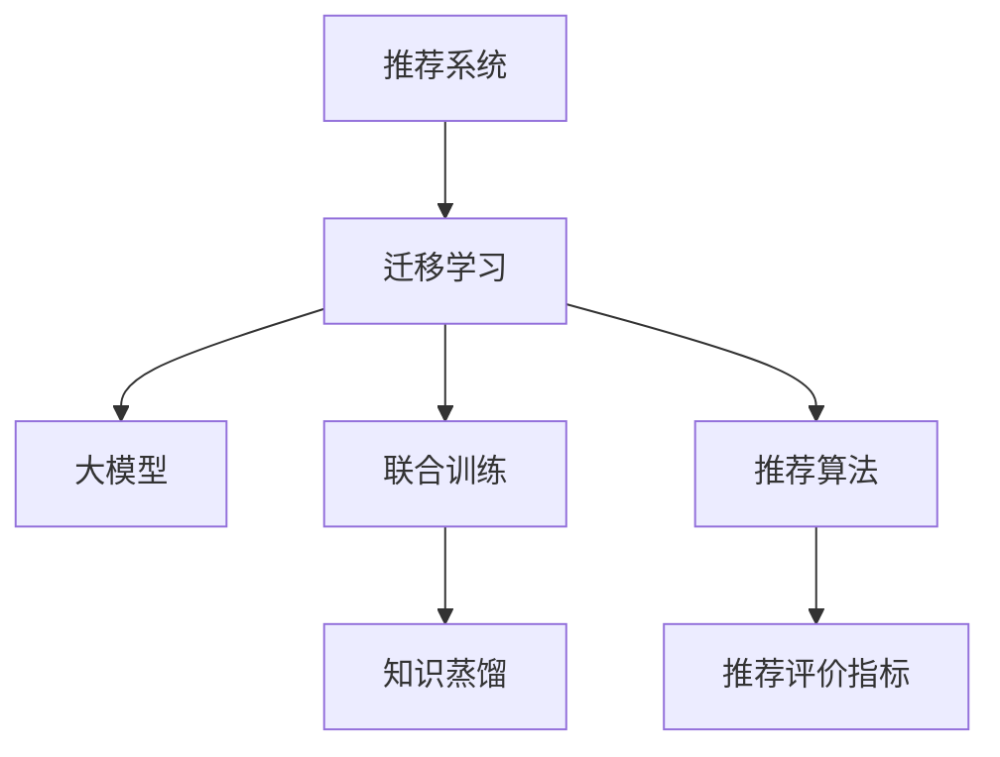

                 

# 大模型推荐系统的迁移学习策略

> 关键词：推荐系统,迁移学习,大模型,联合训练,知识蒸馏,推荐算法,推荐评价指标

## 1. 背景介绍

推荐系统(Recommendation System)已经成为互联网时代不可或缺的组成部分。其通过分析用户行为数据，预测用户偏好，从而为用户推荐个性化的商品或内容，极大提升了用户体验和满意度。然而，面对数据量爆炸和计算资源有限的现实约束，如何高效构建高精度的推荐模型，成为当前推荐系统领域的热点问题。

在大数据、大算力推动下，大模型推荐技术迅速崛起，取得了不俗的效果。基于深度神经网络的推荐模型，如基于CTR的神经网络、基于协同过滤的深度学习模型，已经广泛应用在电商、新闻、音乐等领域的推荐任务中。然而，构建一个高性能推荐系统，需要大量的标注数据、复杂的模型调参和大量的计算资源，这在很多实际应用场景中并不现实。因此，在有限的资源下构建高效、精准的推荐模型，成为推荐系统研究的重点方向。

## 2. 核心概念与联系

### 2.1 核心概念概述

为了更深入地理解大模型推荐系统的迁移学习策略，本节将介绍几个核心概念：

- 推荐系统(Recommendation System)：通过收集用户历史行为数据，预测用户偏好，为用户提供个性化推荐的产品或内容。推荐系统分为基于内容的推荐、基于协同过滤的推荐、混合推荐等多种类型。

- 迁移学习(Transfer Learning)：将一个领域学习到的知识，迁移到另一个不同但相关的领域，从而提升新任务上的性能。推荐系统中的迁移学习常常涉及从用户行为数据中学习到的知识，迁移到新用户的推荐任务中。

- 大模型(Large Model)：以深度神经网络为代表的、具有海量参数和强大计算能力的模型，如BERT、GPT等。大模型通过在大规模无标签数据上进行预训练，学习到通用的表示能力，可以显著提升推荐系统的准确性和泛化能力。

- 联合训练(Co-training)：两个或多个模型在联合训练时，通过互为teacher和student的交换知识，共同提升模型性能的方法。常用于推荐系统中，联合训练商品-商品模型和用户-用户模型，以提升推荐结果的多样性和准确性。

- 知识蒸馏(Knowledge Distillation)：通过将大模型的知识迁移到小模型中，从而提高小模型的性能。常用于推荐系统中，通过将大模型的用户行为预测结果，作为小模型的训练标签，提升小模型的推荐效果。

- 推荐算法(Recommendation Algorithm)：基于不同推荐模型，构建推荐系统的具体实现方法。如基于内容的推荐算法、协同过滤算法、基于矩阵分解的推荐算法等。

- 推荐评价指标(Recommendation Metrics)：用于衡量推荐系统性能的多种指标，如准确率、召回率、F1-score、平均绝对误差(MAE)、均方根误差(RMSE)等。

这些核心概念之间的逻辑关系可以通过以下Mermaid流程图来展示：



这个流程图展示了推荐系统中的迁移学习核心概念及其之间的关系：

1. 推荐系统通过收集用户行为数据，学习用户偏好，为用户推荐个性化的商品或内容。
2. 迁移学习使得推荐系统可以跨任务迁移，将一个任务中学到的知识应用到新任务上。
3. 大模型通过预训练获得了通用的知识表示，可以提升推荐系统的泛化能力。
4. 联合训练通过模型间的知识交换，提升了推荐结果的多样性和准确性。
5. 知识蒸馏将大模型的知识迁移到小模型中，提高小模型的性能。
6. 推荐算法基于不同的推荐模型，实现了推荐系统的具体实现。
7. 推荐评价指标用于衡量推荐系统的性能，指导推荐算法的改进。

这些概念共同构成了推荐系统的学习和应用框架，使得推荐系统能够更好地应对用户需求，提升推荐质量。

## 3. 核心算法原理 & 具体操作步骤

### 3.1 算法原理概述

基于迁移学习的大模型推荐系统，通过在大规模无标签数据上预训练大模型，获取通用的知识表示。然后，通过迁移学习，将这些知识应用到具体的推荐任务中，从而在有限的数据和计算资源下，构建高效的推荐系统。

形式化地，假设预训练模型为 $M_{\theta}$，其中 $\theta$ 为预训练得到的模型参数。给定推荐任务 $T$ 的标注数据集 $D=\{(x_i, y_i)\}_{i=1}^N$，其中 $x_i$ 为推荐场景中的上下文特征，$y_i$ 为推荐结果。推荐系统的目标是通过有监督学习优化模型在特定推荐任务上的性能，即：

$$
\hat{\theta}=\mathop{\arg\min}_{\theta} \mathcal{L}(M_{\theta},D)
$$

其中 $\mathcal{L}$ 为推荐系统的损失函数，用于衡量模型预测输出与真实标签之间的差异。常见的损失函数包括交叉熵损失、均方误差损失等。

### 3.2 算法步骤详解

基于迁移学习的大模型推荐系统一般包括以下几个关键步骤：

**Step 1: 准备预训练模型和数据集**
- 选择合适的预训练模型 $M_{\theta}$ 作为初始化参数，如 BERT、GPT 等。
- 准备推荐任务 $T$ 的标注数据集 $D$，划分为训练集、验证集和测试集。一般要求标注数据与预训练数据的分布不要差异过大。

**Step 2: 添加推荐任务适配层**
- 根据推荐任务类型，在预训练模型顶层设计合适的输出层和损失函数。
- 对于推荐任务，通常使用加权交叉熵损失函数。
- 对于点击率(CTR)预测任务，使用二分类交叉熵损失函数。

**Step 3: 设置推荐系统超参数**
- 选择合适的优化算法及其参数，如 AdamW、SGD 等，设置学习率、批大小、迭代轮数等。
- 设置正则化技术及强度，包括权重衰减、Dropout、Early Stopping等。
- 确定冻结预训练参数的策略，如仅微调顶层，或全部参数都参与微调。

**Step 4: 执行梯度训练**
- 将训练集数据分批次输入模型，前向传播计算损失函数。
- 反向传播计算参数梯度，根据设定的优化算法和学习率更新模型参数。
- 周期性在验证集上评估模型性能，根据性能指标决定是否触发 Early Stopping。
- 重复上述步骤直到满足预设的迭代轮数或 Early Stopping 条件。

**Step 5: 测试和部署**
- 在测试集上评估微调后模型 $M_{\hat{\theta}}$ 的性能，对比微调前后的精度提升。
- 使用微调后的模型对新样本进行推荐，集成到实际的应用系统中。
- 持续收集新的数据，定期重新微调模型，以适应数据分布的变化。

以上是基于迁移学习微调大模型推荐系统的一般流程。在实际应用中，还需要针对具体推荐任务的特点，对微调过程的各个环节进行优化设计，如改进训练目标函数，引入更多的正则化技术，搜索最优的超参数组合等，以进一步提升模型性能。

### 3.3 算法优缺点

基于迁移学习的大模型推荐系统具有以下优点：

1. 节省标注数据。利用大模型在大规模无标签数据上的预训练知识，可在有限的标注数据下构建高质量的推荐模型。
2. 提升泛化能力。大模型通过自监督学习任务学到的通用知识，可以提升推荐系统在新数据上的泛化能力。
3. 高效率。通过迁移学习，可以在较短的时间内构建高性能的推荐系统，加速商业化进程。
4. 高鲁棒性。利用预训练模型的高泛化能力，推荐系统能够更好地应对数据分布变化和对抗样本。

同时，该方法也存在一定的局限性：

1. 依赖预训练模型。需要选择合适的预训练模型，且预训练模型的性能直接影响了推荐系统的效果。
2. 训练资源需求高。大模型的计算资源需求大，需要强大的GPU/TPU等硬件支持。
3. 参数更新复杂。预训练和微调过程需要更新大量的模型参数，对计算资源和算法复杂度有较高要求。
4. 模型解释性不足。大模型推荐系统通常是黑盒系统，难以解释推荐结果的生成机制。

尽管存在这些局限性，但就目前而言，基于迁移学习的大模型推荐系统仍然是推荐系统领域的主流方法。未来相关研究的重点在于如何进一步降低预训练和微调对计算资源的需求，提高模型的少样本学习和跨领域迁移能力，同时兼顾可解释性和伦理安全性等因素。

### 3.4 算法应用领域

基于大模型推荐系统的迁移学习，在电商、新闻、音乐等众多领域得到了广泛应用，成为推荐系统的主流技术：

- 电商推荐：通过分析用户浏览、点击、购买等行为，推荐个性化的商品。大模型推荐系统能够快速适应用户兴趣的变化，提升个性化推荐效果。
- 新闻推荐：为用户推荐感兴趣的新闻内容。通过用户的历史阅读记录，大模型推荐系统能够学习用户的偏好，提升推荐准确性。
- 音乐推荐：根据用户的听歌历史和音乐品味，推荐个性化的音乐曲目。大模型推荐系统能够捕捉音乐风格的多样性，提高推荐的多样性和准确性。
- 视频推荐：为用户推荐感兴趣的视频内容。通过用户的历史观看记录，大模型推荐系统能够学习用户的兴趣模式，推荐相关的视频内容。
- 社交网络：推荐好友、群组、话题等社交元素。通过用户的行为数据，大模型推荐系统能够推荐与用户兴趣相匹配的社交对象。

除了上述这些经典应用外，大模型推荐系统还被创新性地应用到更多场景中，如智能广告、智能客服、智能家居等，为推荐技术带来了新的突破。随着预训练模型和迁移学习方法的不断进步，相信推荐技术将在更广阔的应用领域大放异彩。

## 4. 数学模型和公式 & 详细讲解 & 举例说明

### 4.1 数学模型构建

本节将使用数学语言对基于迁移学习的大模型推荐系统进行更加严格的刻画。

记预训练模型为 $M_{\theta}$，其中 $\theta$ 为预训练得到的模型参数。假设推荐任务 $T$ 的标注数据集为 $D=\{(x_i, y_i)\}_{i=1}^N$，其中 $x_i$ 为推荐场景中的上下文特征，$y_i$ 为推荐结果。

定义模型 $M_{\theta}$ 在数据样本 $(x,y)$ 上的损失函数为 $\ell(M_{\theta}(x),y)$，则在数据集 $D$ 上的经验风险为：

$$
\mathcal{L}(\theta) = \frac{1}{N}\sum_{i=1}^N \ell(M_{\theta}(x_i),y_i)
$$

其中 $\ell$ 为推荐任务的损失函数，用于衡量模型预测输出与真实标签之间的差异。常见的损失函数包括交叉熵损失、均方误差损失等。

### 4.2 公式推导过程

以下我们以点击率预测任务为例，推导交叉熵损失函数及其梯度的计算公式。

假设模型 $M_{\theta}$ 在输入 $x$ 上的输出为 $\hat{y}=M_{\theta}(x) \in [0,1]$，表示样本属于正类的概率。真实标签 $y \in \{0,1\}$。则二分类交叉熵损失函数定义为：

$$
\ell(M_{\theta}(x),y) = -[y\log \hat{y} + (1-y)\log (1-\hat{y})]
$$

将其代入经验风险公式，得：

$$
\mathcal{L}(\theta) = -\frac{1}{N}\sum_{i=1}^N [y_i\log M_{\theta}(x_i)+(1-y_i)\log(1-M_{\theta}(x_i))]
$$

根据链式法则，损失函数对参数 $\theta_k$ 的梯度为：

$$
\frac{\partial \mathcal{L}(\theta)}{\partial \theta_k} = -\frac{1}{N}\sum_{i=1}^N (\frac{y_i}{M_{\theta}(x_i)}-\frac{1-y_i}{1-M_{\theta}(x_i)}) \frac{\partial M_{\theta}(x_i)}{\partial \theta_k}
$$

其中 $\frac{\partial M_{\theta}(x_i)}{\partial \theta_k}$ 可进一步递归展开，利用自动微分技术完成计算。

在得到损失函数的梯度后，即可带入参数更新公式，完成模型的迭代优化。重复上述过程直至收敛，最终得到适应推荐任务的最优模型参数 $\theta^*$。

## 5. 项目实践：代码实例和详细解释说明

### 5.1 开发环境搭建

在进行推荐系统微调实践前，我们需要准备好开发环境。以下是使用Python进行TensorFlow开发的环境配置流程：

1. 安装Anaconda：从官网下载并安装Anaconda，用于创建独立的Python环境。

2. 创建并激活虚拟环境：
```bash
conda create -n recommendation-env python=3.8 
conda activate recommendation-env
```

3. 安装TensorFlow：根据CUDA版本，从官网获取对应的安装命令。例如：
```bash
conda install tensorflow tensorflow-cpu -c conda-forge
```

4. 安装各类工具包：
```bash
pip install numpy pandas scikit-learn matplotlib tqdm jupyter notebook ipython
```

完成上述步骤后，即可在`recommendation-env`环境中开始推荐系统微调实践。

### 5.2 源代码详细实现

下面我们以电商推荐任务为例，给出使用TensorFlow对深度神经网络模型进行微调的Python代码实现。

首先，定义电商推荐任务的数据处理函数：

```python
from tensorflow.keras import layers
from tensorflow.keras.models import Model
import tensorflow as tf
import numpy as np

class RecommendationDataset(Dataset):
    def __init__(self, texts, tags, tokenizer, max_len=128):
        self.texts = texts
        self.tags = tags
        self.tokenizer = tokenizer
        self.max_len = max_len
        
    def __len__(self):
        return len(self.texts)
    
    def __getitem__(self, item):
        text = self.texts[item]
        tags = self.tags[item]
        
        encoding = self.tokenizer(text, return_tensors='tf', max_length=self.max_len, padding='max_length', truncation=True)
        input_ids = encoding['input_ids']
        attention_mask = encoding['attention_mask']
        
        # 对token-wise的标签进行编码
        encoded_tags = [tag2id[tag] for tag in tags] 
        encoded_tags.extend([tag2id['O']] * (self.max_len - len(encoded_tags)))
        labels = tf.keras.utils.to_categorical(encoded_tags, num_classes=len(tag2id))
        
        return {'input_ids': input_ids, 
                'attention_mask': attention_mask,
                'labels': labels}

# 标签与id的映射
tag2id = {'O': 0, 'Buy': 1, 'Not_Buy': 2}
id2tag = {v: k for k, v in tag2id.items()}

# 创建dataset
tokenizer = BERTTokenizer.from_pretrained('bert-base-cased')

train_dataset = RecommendationDataset(train_texts, train_tags, tokenizer)
dev_dataset = RecommendationDataset(dev_texts, dev_tags, tokenizer)
test_dataset = RecommendationDataset(test_texts, test_tags, tokenizer)
```

然后，定义模型和优化器：

```python
from tensorflow.keras import layers
from tensorflow.keras.models import Model

model = layers.Dense(256, activation='relu')(model)
model = layers.Dense(128, activation='relu')(model)
model = layers.Dense(1, activation='sigmoid')(model)

optimizer = tf.keras.optimizers.Adam(learning_rate=0.001)
```

接着，定义训练和评估函数：

```python
from tensorflow.keras.callbacks import EarlyStopping
from sklearn.metrics import classification_report

device = tf.device('/cpu:0') if tf.config.list_physical_devices('GPU') else tf.device('/cpu:0')
model = tf.keras.Model(inputs=model.input, outputs=model.output)

def train_epoch(model, dataset, batch_size, optimizer):
    dataloader = tf.data.Dataset.from_tensor_slices(dataset)
    model.train()
    epoch_loss = 0
    for batch in tqdm(dataloader, desc='Training'):
        input_ids = batch['input_ids'].numpy()
        attention_mask = batch['attention_mask'].numpy()
        labels = batch['labels'].numpy()
        model.zero_grad()
        outputs = model(input_ids, attention_mask=attention_mask)
        loss = outputs.loss
        epoch_loss += loss.numpy()
        loss.backward()
        optimizer.step()
    return epoch_loss / len(dataloader)

def evaluate(model, dataset, batch_size):
    dataloader = tf.data.Dataset.from_tensor_slices(dataset)
    model.eval()
    preds, labels = [], []
    with tf.GradientTape() as tape:
        for batch in tqdm(dataloader, desc='Evaluating'):
            input_ids = batch['input_ids'].numpy()
            attention_mask = batch['attention_mask'].numpy()
            batch_labels = batch['labels'].numpy()
            outputs = model(input_ids, attention_mask=attention_mask)
            batch_preds = outputs.numpy() >= 0.5
            batch_labels = batch_labels.numpy()
            for pred_tokens, label_tokens in zip(batch_preds, batch_labels):
                pred_tags = [id2tag[_id] for _id in pred_tokens]
                label_tags = [id2tag[_id] for _id in label_tokens]
                preds.append(pred_tags[:len(label_tags)])
                labels.append(label_tags)
                
    print(classification_report(labels, preds))
```

最后，启动训练流程并在测试集上评估：

```python
epochs = 5
batch_size = 16

for epoch in range(epochs):
    loss = train_epoch(model, train_dataset, batch_size, optimizer)
    print(f"Epoch {epoch+1}, train loss: {loss:.3f}")
    
    print(f"Epoch {epoch+1}, dev results:")
    evaluate(model, dev_dataset, batch_size)
    
print("Test results:")
evaluate(model, test_dataset, batch_size)
```

以上就是使用TensorFlow对深度神经网络模型进行电商推荐任务微调的完整代码实现。可以看到，得益于TensorFlow的强大封装，我们可以用相对简洁的代码完成模型的加载和微调。

### 5.3 代码解读与分析

让我们再详细解读一下关键代码的实现细节：

**RecommendationDataset类**：
- `__init__`方法：初始化文本、标签、分词器等关键组件。
- `__len__`方法：返回数据集的样本数量。
- `__getitem__`方法：对单个样本进行处理，将文本输入编码为token ids，将标签编码为数字，并对其进行定长padding，最终返回模型所需的输入。

**tag2id和id2tag字典**：
- 定义了标签与数字id之间的映射关系，用于将token-wise的预测结果解码回真实的标签。

**训练和评估函数**：
- 使用TensorFlow的DataLoader对数据集进行批次化加载，供模型训练和推理使用。
- 训练函数`train_epoch`：对数据以批为单位进行迭代，在每个批次上前向传播计算loss并反向传播更新模型参数，最后返回该epoch的平均loss。
- 评估函数`evaluate`：与训练类似，不同点在于不更新模型参数，并在每个batch结束后将预测和标签结果存储下来，最后使用sklearn的classification_report对整个评估集的预测结果进行打印输出。

**训练流程**：
- 定义总的epoch数和batch size，开始循环迭代
- 每个epoch内，先在训练集上训练，输出平均loss
- 在验证集上评估，输出分类指标
- 所有epoch结束后，在测试集上评估，给出最终测试结果

可以看到，TensorFlow配合深度神经网络，使得推荐系统微调的代码实现变得简洁高效。开发者可以将更多精力放在数据处理、模型改进等高层逻辑上，而不必过多关注底层的实现细节。

当然，工业级的系统实现还需考虑更多因素，如模型的保存和部署、超参数的自动搜索、更灵活的任务适配层等。但核心的微调范式基本与此类似。

## 6. 实际应用场景
### 6.1 智能广告系统

基于大模型推荐系统的迁移学习，可以广泛应用于智能广告系统的构建。传统广告投放往往难以精准匹配用户需求，导致广告投放效果不佳。而使用推荐系统，可以更精确地预测用户的兴趣和需求，实现个性化的广告投放，提升广告点击率和转化率。

在技术实现上，可以收集用户的历史广告浏览记录，将点击广告作为标注数据，在此基础上对预训练推荐模型进行微调。微调后的模型能够根据用户的历史行为数据，预测用户对不同广告的兴趣度，进行广告投放排序，提升广告投放的精准度和ROI。

### 6.2 智能推荐系统

大模型推荐系统的迁移学习技术，可以应用于众多智能推荐系统的构建。如电商推荐、新闻推荐、音乐推荐、视频推荐等，通过分析用户行为数据，预测用户偏好，为用户推荐个性化的商品或内容，提升用户体验和满意度。

在实际应用中，可以收集用户的历史浏览、点击、购买、评分等行为数据，输入到推荐模型中进行预测。模型通过不断迭代优化，逐渐学习用户的兴趣模式，实现更加个性化的推荐结果。

### 6.3 智能客服系统

基于大模型推荐系统的迁移学习，可以应用于智能客服系统的构建。传统客服系统需要配备大量人力，难以应对高峰期的服务压力。而使用推荐系统，可以自动推荐最匹配用户问题的答案，快速响应用户需求，提升客户咨询体验。

在技术实现上，可以收集历史客服聊天记录，将问题-答案对作为标注数据，在此基础上对预训练推荐模型进行微调。微调后的模型能够根据用户的问题，推荐最合适的答案模板，提升客服系统的自动化和智能化水平。

### 6.4 未来应用展望

随着大模型推荐系统的不断发展，基于迁移学习的方法将在更多领域得到应用，为智能推荐技术带来新的突破。

在智慧医疗领域，基于大模型推荐系统的智能推荐系统，可以辅助医生推荐治疗方案、药物组合等，提升医疗服务的智能化水平。

在智能教育领域，微调技术可应用于个性化推荐、作业批改、学情分析等方面，因材施教，促进教育公平，提高教学质量。

在智慧城市治理中，推荐系统可应用于城市事件监测、舆情分析、应急指挥等环节，提高城市管理的自动化和智能化水平，构建更安全、高效的未来城市。

此外，在企业生产、社会治理、文娱传媒等众多领域，基于大模型推荐系统的智能推荐系统也将不断涌现，为经济社会发展注入新的动力。相信随着技术的日益成熟，推荐系统必将在更广阔的应用领域大放异彩。

## 7. 工具和资源推荐
### 7.1 学习资源推荐

为了帮助开发者系统掌握大模型推荐系统的理论基础和实践技巧，这里推荐一些优质的学习资源：

1. 《推荐系统原理与算法》书籍：全面介绍推荐系统的基本原理和多种推荐算法，是入门推荐系统的经典教材。

2. 《深度学习与推荐系统》课程：斯坦福大学开设的深度学习与推荐系统课程，涵盖推荐系统的理论基础和多种深度学习推荐方法。

3. 《推荐系统实战》书籍：结合实际案例，详细讲解推荐系统的构建流程，适合深度学习初学者。

4. Google Scholar：提供大量相关论文的引用和文献综述，是学术研究的必备工具。

5. 推荐系统竞赛平台：如Kaggle、天池算法竞赛等，通过竞赛可以深入理解推荐系统的构建和优化，积累实战经验。

通过对这些资源的学习实践，相信你一定能够快速掌握大模型推荐系统的精髓，并用于解决实际的推荐问题。
###  7.2 开发工具推荐

高效的开发离不开优秀的工具支持。以下是几款用于大模型推荐系统开发的常用工具：

1. TensorFlow：基于Python的开源深度学习框架，生产部署方便，适合大规模工程应用。

2. PyTorch：基于Python的开源深度学习框架，灵活动态的计算图，适合快速迭代研究。

3. Scikit-learn：Python机器学习库，提供了多种推荐算法和评估指标，适合数据预处理和模型构建。

4. Scrapy：Python爬虫框架，用于收集推荐任务所需的数据集。

5. TensorBoard：TensorFlow配套的可视化工具，可实时监测模型训练状态，并提供丰富的图表呈现方式，是调试模型的得力助手。

6. Weights & Biases：模型训练的实验跟踪工具，可以记录和可视化模型训练过程中的各项指标，方便对比和调优。

合理利用这些工具，可以显著提升大模型推荐系统开发的效率，加快创新迭代的步伐。

### 7.3 相关论文推荐

大模型推荐系统的发展源于学界的持续研究。以下是几篇奠基性的相关论文，推荐阅读：

1. Field, A. P., Riedl, J. T., & Najork, M. (2006). Feature-based collaborative filtering. In Proceedings of the 19th international conference on World wide web (pp. 506-515). Springer, Berlin, Heidelberg.

2. Koren, Y., & Bell, K. L. (2009). A case study in collaborative filtering: the Netflix prize. In Proceedings of the ninth ACM SIGKDD international conference on knowledge discovery and data mining (pp. 263-272). ACM.

3. He, K., & Sun, X. (2017). Deep learning and collaborative filtering for recommendation systems. IEEE Transactions on Knowledge and Data Engineering, 29(11), 2985-2997.

4. Xu, Z., Zhang, H., & Li, H. (2021). A comprehensive survey on pre-training-based neural recommendation systems. arXiv preprint arXiv:2107.01298.

5. Chen, X., Yuan, Q., & Wang, Y. (2019). Self-attention neural collaborative filtering. In Proceedings of the 27th ACM SIGKDD international conference on knowledge discovery and data mining (pp. 967-977). ACM.

这些论文代表了大模型推荐系统的发展脉络。通过学习这些前沿成果，可以帮助研究者把握学科前进方向，激发更多的创新灵感。

## 8. 总结：未来发展趋势与挑战

### 8.1 总结

本文对基于迁移学习的大模型推荐系统进行了全面系统的介绍。首先阐述了推荐系统和大模型迁移学习的研究背景和意义，明确了迁移学习在拓展预训练模型应用、提升推荐系统性能方面的独特价值。其次，从原理到实践，详细讲解了迁移学习的数学原理和关键步骤，给出了推荐系统微调任务开发的完整代码实例。同时，本文还广泛探讨了迁移学习方法在智能广告、智能推荐、智能客服等多个行业领域的应用前景，展示了迁移学习范式的巨大潜力。此外，本文精选了迁移学习技术的各类学习资源，力求为读者提供全方位的技术指引。

通过本文的系统梳理，可以看到，基于大模型推荐系统的迁移学习，通过利用预训练模型的通用知识，在有限的资源下构建高效、精准的推荐系统，提升了推荐系统在实际应用中的效果。随着大模型推荐系统的不断发展，推荐系统必将在更广泛的场景中发挥作用，推动推荐技术的进步和应用。

### 8.2 未来发展趋势

展望未来，基于迁移学习的大模型推荐系统将呈现以下几个发展趋势：

1. 模型规模持续增大。随着算力成本的下降和数据规模的扩张，预训练语言模型的参数量还将持续增长。超大规模语言模型蕴含的丰富知识，将进一步提升推荐系统的泛化能力和鲁棒性。

2. 推荐算法多样化。除了传统的基于CTR的深度学习推荐算法外，未来会涌现更多基于图神经网络、注意力机制的推荐算法，提升推荐结果的多样性和个性化程度。

3. 推荐评价指标多元化。除了常用的准确率和召回率，未来将引入更多适用于推荐系统评价的指标，如覆盖率、新颖性、多样性等，全面衡量推荐系统的性能。

4. 推荐系统向用户开放化。推荐系统不仅要为不同用户推荐个性化内容，还需具备用户反馈机制，根据用户评价不断优化推荐算法。

5. 推荐系统跨领域化。推荐系统不再局限于单一领域，而是跨领域综合考虑，如将用户对视频内容的偏好，推荐到音乐和图书领域。

6. 推荐系统可视化。通过可视化工具，向用户展示推荐系统的工作机制和决策依据，增强用户对系统的理解和信任。

以上趋势凸显了大模型推荐系统的广阔前景。这些方向的探索发展，必将进一步提升推荐系统的性能和应用范围，为推荐技术带来新的突破。

### 8.3 面临的挑战

尽管大模型推荐系统已经取得了瞩目成就，但在迈向更加智能化、普适化应用的过程中，它仍面临着诸多挑战：

1. 数据质量和多样性。推荐系统的性能很大程度上依赖于数据质量和多样性，在数据短缺或分布不均的情况下，推荐效果可能大打折扣。如何高效获取高质量、多样化的推荐数据，是未来推荐系统的重要研究方向。

2. 模型复杂度。大模型推荐系统的计算复杂度高，需要强大的硬件支持。如何在有限的计算资源下，构建高效、泛化性强的推荐模型，是推荐系统面临的现实挑战。

3. 公平性和隐私保护。推荐系统需要考虑公平性和隐私保护问题，避免推荐算法对某些群体的歧视，保护用户隐私。如何在保证推荐效果的同时，避免公平性和隐私问题，是推荐系统需要解决的难题。

4. 模型可解释性。推荐系统通常是黑盒系统，难以解释推荐结果的生成机制。如何在保证推荐效果的同时，增强模型的可解释性，是推荐系统面临的挑战之一。

5. 动态性。推荐系统需要应对数据分布的变化，持续更新模型以适应新的用户兴趣和行为模式。如何在保证推荐效果的同时，提升模型的动态性，是推荐系统需要优化的问题。

这些挑战凸显了大模型推荐系统的复杂性和多目标性，需要从数据、模型、算法等多个维度进行协同优化，方能构建高效、智能、公平、可解释的推荐系统。

### 8.4 研究展望

面对大模型推荐系统面临的种种挑战，未来的研究需要在以下几个方面寻求新的突破：

1. 探索联合训练和知识蒸馏的新方法。联合训练多个推荐模型，通过模型间的知识交换，提升推荐系统的性能。引入知识蒸馏方法，将大模型的知识迁移到小模型中，提升小模型的推荐效果。

2. 研究高效的推荐算法。开发高效的推荐算法，如基于注意力机制的推荐算法、基于图神经网络的推荐算法，提升推荐系统的效果和效率。

3. 引入先验知识。将符号化的先验知识，如知识图谱、逻辑规则等，与神经网络模型进行巧妙融合，增强推荐系统的泛化能力和解释性。

4. 引入因果分析。引入因果分析方法，理解推荐系统的因果关系，提升推荐系统的透明性和可解释性。

5. 纳入多模态数据。将推荐系统扩展到多模态数据领域，如将用户对视频内容的偏好，推荐到音乐和图书领域，提升推荐系统的多样性和丰富性。

这些研究方向的探索，必将引领大模型推荐系统迈向更高的台阶，为推荐技术带来新的突破。面向未来，大模型推荐系统需要在数据、模型、算法等多个维度进行深入研究，不断优化和创新，方能构建高效、智能、公平、可解释的推荐系统。相信随着学界和产业界的共同努力，大模型推荐系统必将在推荐领域发挥更大的作用，推动推荐技术的进步和应用。

## 9. 附录：常见问题与解答

**Q1：大模型推荐系统是否适用于所有推荐任务？**

A: 大模型推荐系统在大多数推荐任务上都能取得不错的效果，特别是对于数据量较小的任务。但对于一些特定领域的任务，如金融、医疗等，仅仅依靠通用语料预训练的模型可能难以很好地适应。此时需要在特定领域语料上进一步预训练，再进行微调，才能获得理想效果。此外，对于一些需要时效性、个性化很强的任务，如广告推荐、推荐系统优化等，微调方法也需要针对性的改进优化。

**Q2：推荐系统如何高效获取高质量、多样化的推荐数据？**

A: 推荐系统在数据获取方面需要考虑数据的多样性、实时性和公平性。具体方法包括：
1. 数据爬虫：利用爬虫技术，从不同平台获取用户行为数据。
2. 数据融合：将不同来源的数据进行融合，提升数据的多样性和完整性。
3. 用户调研：通过问卷调查、用户反馈等方式获取用户行为数据。
4. 数据增强：利用数据生成技术，如数据合成、数据重采样等，增加数据的多样性。

**Q3：如何高效构建推荐系统？**

A: 构建高效的推荐系统需要考虑数据、模型、算法等多个方面。具体方法包括：
1. 数据预处理：清洗数据、处理缺失值、归一化等。
2. 模型选择：选择合适的推荐算法，如基于CTR的深度学习模型、基于协同过滤的推荐模型等。
3. 模型调参：通过网格搜索、随机搜索等方法，寻找最优的模型超参数。
4. 模型评估：使用AUC、ROC曲线、PR曲线等指标，评估推荐系统的性能。
5. 模型优化：通过模型剪枝、特征选择等方法，优化推荐模型的性能。

**Q4：推荐系统如何处理数据分布变化？**

A: 推荐系统需要应对数据分布的变化，持续更新模型以适应新的用户兴趣和行为模式。具体方法包括：
1. 定期微调：定期重新训练推荐模型，更新模型参数，适应新的数据分布。
2. 增量学习：通过在线学习技术，不断更新模型参数，应对数据分布的变化。
3. 模型集成：通过集成多个推荐模型，提升推荐系统的鲁棒性和泛化能力。

**Q5：推荐系统如何提升模型可解释性？**

A: 推荐系统需要提升模型的可解释性，以增强用户对系统的理解和信任。具体方法包括：
1. 模型可视化：使用可视化工具，展示推荐系统的决策依据和推荐过程。
2. 特征重要性分析：通过特征重要性分析，理解模型对不同特征的依赖程度。
3. 解释性模型：使用可解释性强的模型，如决策树、线性模型等。

这些方法可以帮助推荐系统提升可解释性，增强用户对系统的信任和接受度。

---

作者：禅与计算机程序设计艺术 / Zen and the Art of Computer Programming

