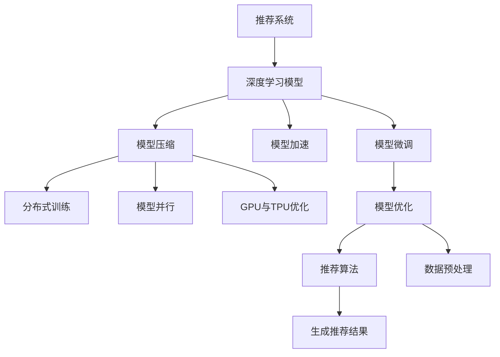

                 

# 大模型推荐落地的性能优化与加速技术创新

> 关键词：大模型推荐,性能优化,加速技术,推荐算法,深度学习

## 1. 背景介绍

### 1.1 问题由来

随着电子商务和互联网的发展，推荐系统已成为用户获取个性化内容的重要手段。然而，传统的协同过滤、基于规则的推荐方法，在面对海量用户和商品时，面临计算资源和算法的瓶颈。与此同时，大模型推荐技术的出现，带来了革命性的变化。

大模型推荐技术，通过在大规模无标签数据上进行预训练，学习用户和商品的表征，并在推荐任务上进行微调，从而能够在不依赖用户显式反馈的情况下，推荐用户可能感兴趣的商品。相较于传统推荐方法，大模型推荐具有如下优势：

- **全面性**：利用大数据训练的深度模型，可以覆盖更广泛的用户行为和商品属性，实现更全面、准确的推荐。
- **可扩展性**：模型可以通过增加数据量进行训练，适应更多用户和商品，而不需要手动添加规则或调整参数。
- **灵活性**：模型可以自动学习用户偏好和商品关联，适应多样化的推荐场景。
- **高效性**：模型的计算复杂度可优化，使得推荐过程能够实时响应。

大模型推荐技术的迅速发展，正在改变推荐系统领域的游戏规则。但随之而来的，是模型部署和优化方面的挑战。本博客将重点探讨大模型推荐在落地过程中，如何进行性能优化和加速，以确保其在实际应用中的高效性和可扩展性。

### 1.2 问题核心关键点

大模型推荐落地的性能优化与加速，涉及多个核心概念和技术点。主要包括：

- **模型压缩与剪枝**：通过减少模型参数和计算量，降低资源消耗。
- **量化与定点化**：通过将模型参数和计算结果转换为定点数，减少存储空间和计算开销。
- **分布式训练与推理**：通过将模型分解成多个部分并行训练和推理，提升并行计算能力。
- **模型并行与模型压缩**：通过将模型参数分布在不同设备上，提升计算效率和存储效率。
- **GPU与TPU优化**：通过硬件优化和算法优化，提高模型在GPU和TPU上的运行效率。
- **剪枝与量化技术融合**：通过将剪枝与量化技术相结合，进一步提升模型的性能和加速效果。

## 2. 核心概念与联系

### 2.1 核心概念概述

为了更好地理解大模型推荐落地的性能优化与加速技术，本节将介绍几个密切相关的核心概念：

- **推荐系统**：基于用户行为和商品属性，推荐用户可能感兴趣的商品的系统。
- **深度学习模型**：利用神经网络等深度学习技术，学习用户和商品的隐含特征，并进行推荐。
- **模型压缩**：通过剪枝、量化等技术，减少模型参数和计算量，降低资源消耗。
- **模型加速**：通过分布式训练、模型并行等技术，提升模型的计算效率和响应速度。
- **模型优化**：通过硬件优化和算法优化，提升模型在特定硬件上的运行效率。
- **推荐算法**：用于生成推荐结果的算法，包括协同过滤、基于内容的推荐、深度推荐等。
- **数据预处理**：对原始数据进行清洗、归一化等预处理，提升模型的训练效果。
- **模型微调**：在大模型上，通过少量标注数据进行微调，提升推荐性能。

这些概念之间的逻辑关系可以通过以下Mermaid流程图来展示：



这个流程图展示了大模型推荐落地的核心概念及其之间的关系：

1. 推荐系统利用深度学习模型学习用户和商品的表征。
2. 深度学习模型需要通过模型压缩、模型加速等技术进行优化，以适应实际应用需求。
3. 模型压缩和模型加速可以采用分布式训练、模型并行等方法，进一步提升模型的性能和效率。
4. 模型微调可以通过模型优化和硬件优化，提升模型的精度和响应速度。
5. 推荐算法需要结合数据预处理和模型微调，生成高质量的推荐结果。

这些概念共同构成了大模型推荐落地的技术框架，使其能够在各类推荐场景中发挥强大的性能。

## 3. 核心算法原理 & 具体操作步骤
### 3.1 算法原理概述

大模型推荐落地的性能优化与加速，本质上是通过一系列的模型压缩、模型加速和模型优化技术，提高模型在推荐场景中的计算效率和资源利用率。其核心思想是：

1. **模型压缩**：通过剪枝、量化等技术，减少模型参数和计算量，降低资源消耗。
2. **模型加速**：通过分布式训练、模型并行等技术，提升模型的计算效率和响应速度。
3. **模型优化**：通过硬件优化和算法优化，提升模型在特定硬件上的运行效率。

以BERT模型为例，其预训练过程和推荐微调过程的计算复杂度如下：

1. BERT模型具有大规模的参数量，计算复杂度高。
2. 在推荐任务上进行微调时，需要考虑如何平衡模型的精度和速度。

### 3.2 算法步骤详解

大模型推荐落地的性能优化与加速，涉及多个关键步骤：

**Step 1: 准备预训练模型和数据集**
- 选择合适的预训练语言模型 $M_{\theta}$ 作为初始化参数，如 BERT、GPT 等。
- 准备推荐任务 $T$ 的标注数据集 $D=\{(x_i, y_i)\}_{i=1}^N$，划分为训练集、验证集和测试集。

**Step 2: 添加任务适配层**
- 根据推荐任务类型，在预训练模型顶层设计合适的输出层和损失函数。
- 对于分类任务，通常在顶层添加线性分类器和交叉熵损失函数。
- 对于生成任务，通常使用语言模型的解码器输出概率分布，并以负对数似然为损失函数。

**Step 3: 设置微调超参数**
- 选择合适的优化算法及其参数，如 AdamW、SGD 等，设置学习率、批大小、迭代轮数等。
- 设置正则化技术及强度，包括权重衰减、Dropout、Early Stopping等。
- 确定冻结预训练参数的策略，如仅微调顶层，或全部参数都参与微调。

**Step 4: 执行梯度训练**
- 将训练集数据分批次输入模型，前向传播计算损失函数。
- 反向传播计算参数梯度，根据设定的优化算法和学习率更新模型参数。
- 周期性在验证集上评估模型性能，根据性能指标决定是否触发 Early Stopping。
- 重复上述步骤直到满足预设的迭代轮数或 Early Stopping 条件。

**Step 5: 测试和部署**
- 在测试集上评估微调后模型 $M_{\hat{\theta}}$ 的性能，对比微调前后的精度提升。
- 使用微调后的模型对新商品进行推荐，集成到实际的应用系统中。
- 持续收集新的用户行为数据，定期重新微调模型，以适应数据分布的变化。

以上是大模型推荐落地的性能优化与加速的一般流程。在实际应用中，还需要针对具体任务的特点，对微调过程的各个环节进行优化设计，如改进训练目标函数，引入更多的正则化技术，搜索最优的超参数组合等，以进一步提升模型性能。

### 3.3 算法优缺点

大模型推荐落地的性能优化与加速，具有以下优点：
1. 提升推荐精度：通过模型压缩和微调，模型能够更好地捕捉用户和商品的隐含特征，提升推荐结果的准确性。
2. 降低计算资源消耗：模型压缩和模型加速技术能够减少模型参数和计算量，降低硬件资源消耗。
3. 提升响应速度：分布式训练和模型并行技术能够加速模型推理过程，使得推荐系统能够实时响应。
4. 降低存储成本：量化与定点化技术能够减少模型的存储空间，降低存储成本。
5. 适应大规模数据：模型优化技术能够提升模型在大规模数据上的计算效率。

同时，该方法也存在一定的局限性：
1. 依赖高质量数据：预训练和微调过程需要高质量的数据，数据获取和标注成本较高。
2. 模型复杂度高：大模型的参数量和计算复杂度较高，对硬件和软件环境要求高。
3. 过度依赖技术：模型的效果高度依赖于技术实现的细节，需要不断迭代优化。
4. 鲁棒性不足：大模型容易受到数据偏差和噪声的影响，需要额外引入鲁棒性技术。

尽管存在这些局限性，但就目前而言，大模型推荐落地的性能优化与加速方法仍是大规模推荐系统的重要范式。未来相关研究的重点在于如何进一步降低技术依赖，提高模型的泛化能力和鲁棒性，同时兼顾计算资源和存储成本。

### 3.4 算法应用领域

大模型推荐落地的性能优化与加速，在推荐系统领域已经得到了广泛的应用，覆盖了几乎所有常见推荐场景，例如：

- **电商推荐**：为用户推荐可能感兴趣的商品。通过微调模型，学习用户行为和商品属性，生成个性化的推荐列表。
- **内容推荐**：为用户推荐可能感兴趣的文章、视频、音乐等。通过微调模型，学习用户阅读和观看习惯，生成内容推荐列表。
- **个性化广告推荐**：为用户推荐可能感兴趣的广告内容。通过微调模型，学习用户行为和广告属性，生成个性化广告推荐。
- **金融理财推荐**：为用户推荐可能感兴趣的理财产品。通过微调模型，学习用户理财偏好和产品属性，生成理财推荐列表。
- **旅游推荐**：为用户推荐可能感兴趣的目的地和旅游活动。通过微调模型，学习用户旅游偏好和景点属性，生成旅游推荐列表。

除了上述这些经典场景外，大模型推荐落地的性能优化与加速，还被创新性地应用到更多场景中，如多模态推荐、实时推荐、跨平台推荐等，为推荐系统带来了全新的突破。

## 4. 数学模型和公式 & 详细讲解
### 4.1 数学模型构建

本节将使用数学语言对大模型推荐落地的性能优化与加速过程进行更加严格的刻画。

记预训练语言模型为 $M_{\theta}$，其中 $\theta$ 为预训练得到的模型参数。假设推荐任务 $T$ 的训练集为 $D=\{(x_i,y_i)\}_{i=1}^N, x_i \in \mathcal{X}, y_i \in \mathcal{Y}$，其中 $y_i$ 为推荐目标。

定义模型 $M_{\theta}$ 在输入 $x$ 上的输出为 $\hat{y}=M_{\theta}(x) \in \mathcal{Y}$，表示模型预测的推荐结果。推荐任务 $T$ 的损失函数定义为：

$$
\ell(M_{\theta}(x),y) = -y\log \hat{y} + (1-y)\log(1-\hat{y})
$$

则在数据集 $D$ 上的经验风险为：

$$
\mathcal{L}(\theta) = \frac{1}{N} \sum_{i=1}^N \ell(M_{\theta}(x_i),y_i)
$$

微调的优化目标是最小化经验风险，即找到最优参数：

$$
\theta^* = \mathop{\arg\min}_{\theta} \mathcal{L}(\theta)
$$

在得到损失函数的梯度后，即可带入参数更新公式，完成模型的迭代优化。重复上述过程直至收敛，最终得到适应推荐任务的最优模型参数 $\theta^*$。

### 4.2 公式推导过程

以下我们以推荐系统的二分类任务为例，推导交叉熵损失函数及其梯度的计算公式。

假设模型 $M_{\theta}$ 在输入 $x$ 上的输出为 $\hat{y}=M_{\theta}(x) \in [0,1]$，表示推荐结果为正的概率。真实标签 $y \in \{0,1\}$。则二分类交叉熵损失函数定义为：

$$
\ell(M_{\theta}(x),y) = -[y\log \hat{y} + (1-y)\log (1-\hat{y})]
$$

将其代入经验风险公式，得：

$$
\mathcal{L}(\theta) = -\frac{1}{N}\sum_{i=1}^N [y_i\log M_{\theta}(x_i)+(1-y_i)\log(1-M_{\theta}(x_i))]
$$

根据链式法则，损失函数对参数 $\theta_k$ 的梯度为：

$$
\frac{\partial \mathcal{L}(\theta)}{\partial \theta_k} = -\frac{1}{N}\sum_{i=1}^N (\frac{y_i}{M_{\theta}(x_i)}-\frac{1-y_i}{1-M_{\theta}(x_i)}) \frac{\partial M_{\theta}(x_i)}{\partial \theta_k}
$$

其中 $\frac{\partial M_{\theta}(x_i)}{\partial \theta_k}$ 可进一步递归展开，利用自动微分技术完成计算。

在得到损失函数的梯度后，即可带入参数更新公式，完成模型的迭代优化。重复上述过程直至收敛，最终得到适应推荐任务的最优模型参数 $\theta^*$。

## 5. 项目实践：代码实例和详细解释说明
### 5.1 开发环境搭建

在进行推荐系统微调实践前，我们需要准备好开发环境。以下是使用Python进行PyTorch开发的环境配置流程：

1. 安装Anaconda：从官网下载并安装Anaconda，用于创建独立的Python环境。

2. 创建并激活虚拟环境：
```bash
conda create -n pytorch-env python=3.8 
conda activate pytorch-env
```

3. 安装PyTorch：根据CUDA版本，从官网获取对应的安装命令。例如：
```bash
conda install pytorch torchvision torchaudio cudatoolkit=11.1 -c pytorch -c conda-forge
```

4. 安装TensorFlow：
```bash
pip install tensorflow==2.7.0
```

5. 安装各类工具包：
```bash
pip install numpy pandas scikit-learn matplotlib tqdm jupyter notebook ipython
```

完成上述步骤后，即可在`pytorch-env`环境中开始推荐系统微调实践。

### 5.2 源代码详细实现

下面我们以电商推荐系统为例，给出使用Transformers库对BERT模型进行推荐系统微调的PyTorch代码实现。

首先，定义推荐系统数据处理函数：

```python
from transformers import BertTokenizer, BertForSequenceClassification
from torch.utils.data import Dataset
import torch

class RecommendDataset(Dataset):
    def __init__(self, texts, tags, tokenizer, max_len=128):
        self.texts = texts
        self.tags = tags
        self.tokenizer = tokenizer
        self.max_len = max_len
        
    def __len__(self):
        return len(self.texts)
    
    def __getitem__(self, item):
        text = self.texts[item]
        tag = self.tags[item]
        
        encoding = self.tokenizer(text, return_tensors='pt', max_length=self.max_len, padding='max_length', truncation=True)
        input_ids = encoding['input_ids'][0]
        attention_mask = encoding['attention_mask'][0]
        
        # 对token-wise的标签进行编码
        encoded_tags = [tag2id[tag] for tag in tag2id]
        encoded_tags.extend([tag2id['O']] * (self.max_len - len(encoded_tags)))
        labels = torch.tensor(encoded_tags, dtype=torch.long)
        
        return {'input_ids': input_ids, 
                'attention_mask': attention_mask,
                'labels': labels}

# 标签与id的映射
tag2id = {'O': 0, 'Buy': 1, 'Not_Buy': 2}
id2tag = {v: k for k, v in tag2id.items()}

# 创建dataset
tokenizer = BertTokenizer.from_pretrained('bert-base-cased')

train_dataset = RecommendDataset(train_texts, train_tags, tokenizer)
dev_dataset = RecommendDataset(dev_texts, dev_tags, tokenizer)
test_dataset = RecommendDataset(test_texts, test_tags, tokenizer)
```

然后，定义模型和优化器：

```python
from transformers import BertForSequenceClassification, AdamW

model = BertForSequenceClassification.from_pretrained('bert-base-cased', num_labels=len(tag2id))

optimizer = AdamW(model.parameters(), lr=2e-5)
```

接着，定义训练和评估函数：

```python
from torch.utils.data import DataLoader
from tqdm import tqdm
from sklearn.metrics import classification_report

device = torch.device('cuda') if torch.cuda.is_available() else torch.device('cpu')
model.to(device)

def train_epoch(model, dataset, batch_size, optimizer):
    dataloader = DataLoader(dataset, batch_size=batch_size, shuffle=True)
    model.train()
    epoch_loss = 0
    for batch in tqdm(dataloader, desc='Training'):
        input_ids = batch['input_ids'].to(device)
        attention_mask = batch['attention_mask'].to(device)
        labels = batch['labels'].to(device)
        model.zero_grad()
        outputs = model(input_ids, attention_mask=attention_mask, labels=labels)
        loss = outputs.loss
        epoch_loss += loss.item()
        loss.backward()
        optimizer.step()
    return epoch_loss / len(dataloader)

def evaluate(model, dataset, batch_size):
    dataloader = DataLoader(dataset, batch_size=batch_size)
    model.eval()
    preds, labels = [], []
    with torch.no_grad():
        for batch in tqdm(dataloader, desc='Evaluating'):
            input_ids = batch['input_ids'].to(device)
            attention_mask = batch['attention_mask'].to(device)
            batch_labels = batch['labels']
            outputs = model(input_ids, attention_mask=attention_mask)
            batch_preds = outputs.logits.argmax(dim=2).to('cpu').tolist()
            batch_labels = batch_labels.to('cpu').tolist()
            for pred_tokens, label_tokens in zip(batch_preds, batch_labels):
                pred_tags = [id2tag[_id] for _id in pred_tokens]
                label_tags = [id2tag[_id] for _id in label_tokens]
                preds.append(pred_tags[:len(label_tags)])
                labels.append(label_tags)
                
    print(classification_report(labels, preds))
```

最后，启动训练流程并在测试集上评估：

```python
epochs = 5
batch_size = 16

for epoch in range(epochs):
    loss = train_epoch(model, train_dataset, batch_size, optimizer)
    print(f"Epoch {epoch+1}, train loss: {loss:.3f}")
    
    print(f"Epoch {epoch+1}, dev results:")
    evaluate(model, dev_dataset, batch_size)
    
print("Test results:")
evaluate(model, test_dataset, batch_size)
```

以上就是使用PyTorch对BERT进行电商推荐系统微调的完整代码实现。可以看到，得益于Transformers库的强大封装，我们可以用相对简洁的代码完成BERT模型的加载和微调。

### 5.3 代码解读与分析

让我们再详细解读一下关键代码的实现细节：

**RecommendDataset类**：
- `__init__`方法：初始化文本、标签、分词器等关键组件。
- `__len__`方法：返回数据集的样本数量。
- `__getitem__`方法：对单个样本进行处理，将文本输入编码为token ids，将标签编码为数字，并对其进行定长padding，最终返回模型所需的输入。

**tag2id和id2tag字典**：
- 定义了标签与数字id之间的映射关系，用于将token-wise的预测结果解码回真实的标签。

**训练和评估函数**：
- 使用PyTorch的DataLoader对数据集进行批次化加载，供模型训练和推理使用。
- 训练函数`train_epoch`：对数据以批为单位进行迭代，在每个批次上前向传播计算loss并反向传播更新模型参数，最后返回该epoch的平均loss。
- 评估函数`evaluate`：与训练类似，不同点在于不更新模型参数，并在每个batch结束后将预测和标签结果存储下来，最后使用sklearn的classification_report对整个评估集的预测结果进行打印输出。

**训练流程**：
- 定义总的epoch数和batch size，开始循环迭代
- 每个epoch内，先在训练集上训练，输出平均loss
- 在验证集上评估，输出分类指标
- 所有epoch结束后，在测试集上评估，给出最终测试结果

可以看到，PyTorch配合Transformers库使得BERT微调的代码实现变得简洁高效。开发者可以将更多精力放在数据处理、模型改进等高层逻辑上，而不必过多关注底层的实现细节。

当然，工业级的系统实现还需考虑更多因素，如模型的保存和部署、超参数的自动搜索、更灵活的任务适配层等。但核心的微调范式基本与此类似。

## 6. 实际应用场景
### 6.1 电商推荐系统

基于大模型推荐落地的性能优化与加速技术，电商推荐系统可以显著提升用户体验和商家收益。传统推荐系统往往只能通过用户的历史行为数据进行推荐，无法应对新商品和变化的用户偏好。而使用微调后的推荐模型，可以实时学习用户的多样化行为，捕捉新商品的信息，实现更精准的个性化推荐。

在技术实现上，可以收集用户浏览、点击、购买等行为数据，提取和商品相关的文本描述、属性等特征。将文本数据作为模型输入，用户的后续行为（如是否购买）作为监督信号，在此基础上微调预训练语言模型。微调后的模型能够从文本描述中准确把握用户的兴趣点，生成推荐列表。对于新商品，可以通过重新微调模型，快速适应其属性和标签，生成推荐结果。

### 6.2 金融理财推荐

当前的金融理财推荐系统往往依赖于用户的历史理财行为和产品评分。但随着金融市场的多样化，理财产品的丰富性增加，传统的推荐方法难以适应。基于大模型推荐落地的性能优化与加速技术，可以更好地应对金融理财推荐场景。

具体而言，可以收集用户的理财行为数据、理财产品的属性和收益数据，将其作为模型输入。利用微调后的模型，学习用户理财偏好和产品关联，生成个性化理财推荐列表。对于新理财产品，可以通过微调模型，快速适应其属性和收益数据，生成推荐结果。

### 6.3 影视推荐系统

影视推荐系统面临着海量用户和影视内容的推荐挑战。传统基于用户协同过滤和内容的推荐方法，计算复杂度高，难以应对大规模数据。基于大模型推荐落地的性能优化与加速技术，可以更高效地处理影视推荐场景。

具体而言，可以收集用户的历史观看记录、影视的属性和评分等数据，将其作为模型输入。利用微调后的模型，学习用户观看偏好和影视关联，生成个性化影视推荐列表。对于新上映的影视，可以通过微调模型，快速适应其属性和评分数据，生成推荐结果。

### 6.4 未来应用展望

随着大模型推荐落地的性能优化与加速技术的不断进步，基于微调范式将在更多领域得到应用，为推荐系统带来新的突破。

在智慧医疗领域，基于微调的医疗推荐系统可以提升医疗服务的智能化水平，辅助医生诊疗，推荐适宜的医疗方案和药品。

在智能教育领域，微调技术可应用于作业批改、学情分析、知识推荐等方面，因材施教，促进教育公平，提高教学质量。

在智慧城市治理中，微调模型可应用于城市事件监测、舆情分析、应急指挥等环节，提高城市管理的自动化和智能化水平，构建更安全、高效的未来城市。

此外，在企业生产、社会治理、文娱传媒等众多领域，基于大模型微调的人工智能应用也将不断涌现，为经济社会发展注入新的动力。相信随着技术的日益成熟，微调方法将成为推荐系统的重要范式，推动推荐系统向更广阔的领域加速渗透。

## 7. 工具和资源推荐
### 7.1 学习资源推荐

为了帮助开发者系统掌握大模型推荐落地的性能优化与加速理论基础和实践技巧，这里推荐一些优质的学习资源：

1. 《Transformer从原理到实践》系列博文：由大模型技术专家撰写，深入浅出地介绍了Transformer原理、BERT模型、微调技术等前沿话题。

2. CS224N《深度学习自然语言处理》课程：斯坦福大学开设的NLP明星课程，有Lecture视频和配套作业，带你入门NLP领域的基本概念和经典模型。

3. 《Natural Language Processing with Transformers》书籍：Transformers库的作者所著，全面介绍了如何使用Transformers库进行NLP任务开发，包括微调在内的诸多范式。

4. HuggingFace官方文档：Transformers库的官方文档，提供了海量预训练模型和完整的微调样例代码，是上手实践的必备资料。

5. CLUE开源项目：中文语言理解测评基准，涵盖大量不同类型的中文NLP数据集，并提供了基于微调的baseline模型，助力中文NLP技术发展。

通过对这些资源的学习实践，相信你一定能够快速掌握大模型推荐落地的性能优化与加速的精髓，并用于解决实际的推荐问题。
###  7.2 开发工具推荐

高效的开发离不开优秀的工具支持。以下是几款用于大模型推荐落地的开发工具：

1. PyTorch：基于Python的开源深度学习框架，灵活动态的计算图，适合快速迭代研究。大部分预训练语言模型都有PyTorch版本的实现。

2. TensorFlow：由Google主导开发的开源深度学习框架，生产部署方便，适合大规模工程应用。同样有丰富的预训练语言模型资源。

3. Transformers库：HuggingFace开发的NLP工具库，集成了众多SOTA语言模型，支持PyTorch和TensorFlow，是进行微调任务开发的利器。

4. Weights & Biases：模型训练的实验跟踪工具，可以记录和可视化模型训练过程中的各项指标，方便对比和调优。与主流深度学习框架无缝集成。

5. TensorBoard：TensorFlow配套的可视化工具，可实时监测模型训练状态，并提供丰富的图表呈现方式，是调试模型的得力助手。

6. Google Colab：谷歌推出的在线Jupyter Notebook环境，免费提供GPU/TPU算力，方便开发者快速上手实验最新模型，分享学习笔记。

合理利用这些工具，可以显著提升大模型推荐落地的性能优化与加速任务的开发效率，加快创新迭代的步伐。

### 7.3 相关论文推荐

大模型推荐落地的性能优化与加速技术的发展源于学界的持续研究。以下是几篇奠基性的相关论文，推荐阅读：

1. Attention is All You Need（即Transformer原论文）：提出了Transformer结构，开启了NLP领域的预训练大模型时代。

2. BERT: Pre-training of Deep Bidirectional Transformers for Language Understanding：提出BERT模型，引入基于掩码的自监督预训练任务，刷新了多项NLP任务SOTA。

3. Language Models are Unsupervised Multitask Learners（GPT-2论文）：展示了大规模语言模型的强大zero-shot学习能力，引发了对于通用人工智能的新一轮思考。

4. Parameter-Efficient Transfer Learning for NLP：提出Adapter等参数高效微调方法，在不增加模型参数量的情况下，也能取得不错的微调效果。

5. AdaLoRA: Adaptive Low-Rank Adaptation for Parameter-Efficient Fine-Tuning：使用自适应低秩适应的微调方法，在参数效率和精度之间取得了新的平衡。

6. Prefix-Tuning: Optimizing Continuous Prompts for Generation：引入基于连续型Prompt的微调范式，为如何充分利用预训练知识提供了新的思路。

这些论文代表了大模型推荐落地的性能优化与加速技术的发展脉络。通过学习这些前沿成果，可以帮助研究者把握学科前进方向，激发更多的创新灵感。

## 8. 总结：未来发展趋势与挑战

### 8.1 总结

本文对大模型推荐落地的性能优化与加速方法进行了全面系统的介绍。首先阐述了大模型推荐落地的背景和意义，明确了性能优化与加速在推荐系统中的重要性。其次，从原理到实践，详细讲解了性能优化与加速的数学原理和关键步骤，给出了推荐系统微调任务开发的完整代码实例。同时，本文还广泛探讨了性能优化与加速方法在电商、金融、影视等多个推荐场景中的应用前景，展示了性能优化与加速技术的广泛潜力。此外，本文精选了性能优化与加速技术的各类学习资源，力求为开发者提供全方位的技术指引。

通过本文的系统梳理，可以看到，大模型推荐落地的性能优化与加速技术正在成为推荐系统的重要范式，极大地拓展了推荐系统的性能边界，催生了更多的落地场景。受益于大规模语料的预训练和微调，推荐系统能够在更广泛的领域中发挥其高效性和智能化，为推荐系统领域带来革命性的变革。未来，伴随预训练语言模型和微调方法的不断演进，相信推荐系统必将在更广阔的应用领域大放异彩，深刻影响人类社会的生产生活方式。

### 8.2 未来发展趋势

展望未来，大模型推荐落地的性能优化与加速技术将呈现以下几个发展趋势：

1. **模型规模持续增大**：随着算力成本的下降和数据规模的扩张，预训练语言模型的参数量还将持续增长。超大规模语言模型蕴含的丰富语言知识，有望支撑更加复杂多变的推荐场景。

2. **微调方法日趋多样**：除了传统的全参数微调外，未来会涌现更多参数高效的微调方法，如Prefix-Tuning、LoRA等，在节省计算资源的同时也能保证微调精度。

3. **持续学习成为常态**：随着数据分布的不断变化，推荐模型也需要持续学习新知识以保持性能。如何在不遗忘原有知识的同时，高效吸收新样本信息，将成为重要的研究课题。

4. **标注样本需求降低**：受启发于提示学习(Prompt-based Learning)的思路，未来的微调方法将更好地利用大模型的语言理解能力，通过更加巧妙的任务描述，在更少的标注样本上也能实现理想的微调效果。

5. **多模态微调崛起**：当前的微调主要聚焦于纯文本数据，未来会进一步拓展到图像、视频、语音等多模态数据微调。多模态信息的融合，将显著提升语言模型对现实世界的理解和建模能力。

6. **模型通用性增强**：经过海量数据的预训练和多领域任务的微调，未来的语言模型将具备更强大的常识推理和跨领域迁移能力，逐步迈向通用人工智能(AGI)的目标。

以上趋势凸显了大模型推荐落地的性能优化与加速技术的广阔前景。这些方向的探索发展，必将进一步提升推荐系统的性能和应用范围，为推荐系统领域带来革命性的变革。

### 8.3 面临的挑战

尽管大模型推荐落地的性能优化与加速技术已经取得了瞩目成就，但在迈向更加智能化、普适化应用的过程中，它仍面临着诸多挑战：

1. **标注成本瓶颈**：预训练和微调过程需要高质量的数据，数据获取和标注成本较高。如何进一步降低微调对标注样本的依赖，将是一大难题。

2. **模型鲁棒性不足**：推荐模型面对域外数据时，泛化性能往往大打折扣。对于测试样本的微小扰动，推荐模型的预测也容易发生波动。如何提高推荐模型的鲁棒性，避免灾难性遗忘，还需要更多理论和实践的积累。

3. **推理效率有待提高**：大规模语言模型虽然精度高，但在实际部署时往往面临推理速度慢、内存占用大等效率问题。如何在保证性能的同时，简化模型结构，提升推理速度，优化资源占用，将是重要的优化方向。

4. **可解释性亟需加强**：推荐系统中的黑盒模型，难以解释其内部工作机制和决策逻辑。对于医疗、金融等高风险应用，算法的可解释性和可审计性尤为重要。如何赋予推荐系统更强的可解释性，将是亟待攻克的难题。

5. **安全性有待保障**：预训练语言模型难免会学习到有偏见、有害的信息，通过微调传递到推荐任务，产生误导性、歧视性的输出，给实际应用带来安全隐患。如何从数据和算法层面消除模型偏见，避免恶意用途，确保输出的安全性，也将是重要的研究课题。

6. **知识整合能力不足**：现有的推荐模型往往局限于任务内数据，难以灵活吸收和运用更广泛的先验知识。如何让推荐过程更好地与外部知识库、规则库等专家知识结合，形成更加全面、准确的信息整合能力，还有很大的想象空间。

正视推荐落地的性能优化与加速面临的这些挑战，积极应对并寻求突破，将是大模型推荐落地走向成熟的必由之路。相信随着学界和产业界的共同努力，这些挑战终将一一被克服，大模型推荐落地必将在构建人机协同的智能时代中扮演越来越重要的角色。

### 8.4 未来突破

面对大模型推荐落地的性能优化与加速所面临的种种挑战，未来的研究需要在以下几个方面寻求新的突破：

1. **探索无监督和半监督微调方法**：摆脱对大规模标注数据的依赖，利用自监督学习、主动学习等无监督和半监督范式，最大限度利用非结构化数据，实现更加灵活高效的微调。

2. **研究参数高效和计算高效的微调范式**：开发更加参数高效的微调方法，在固定大部分预训练参数的同时，只更新极少量的任务相关参数。同时优化微调模型的计算图，减少前向传播和反向传播的资源消耗，实现更加轻量级、实时性的部署。

3. **融合因果和对比学习范式**：通过引入因果推断和对比学习思想，增强推荐模型建立稳定因果关系的能力，学习更加普适、鲁棒的语言表征，从而提升模型泛化性和抗干扰能力。

4. **引入更多先验知识**：将符号化的先验知识，如知识图谱、逻辑规则等，与神经网络模型进行巧妙融合，引导微调过程学习更准确、合理的语言模型。同时加强不同模态数据的整合，实现视觉、语音等多模态信息与文本信息的协同建模。

5. **结合因果分析和博弈论工具**：将因果分析方法引入推荐模型，识别出模型决策的关键特征，增强输出解释的因果性和逻辑性。借助博弈论工具刻画人机交互过程，主动探索并规避模型的脆弱点，提高系统稳定性。

6. **纳入伦理道德约束**：在模型训练目标中引入伦理导向的评估指标，过滤和惩罚有偏见、有害的输出倾向。同时加强人工干预和审核，建立模型行为的监管机制，确保输出符合人类价值观和伦理道德。

这些研究方向的探索，必将引领大模型推荐落地的性能优化与加速技术迈向更高的台阶，为构建安全、可靠、可解释、可控的智能系统铺平道路。面向未来，大模型推荐落地的性能优化与加速技术还需要与其他人工智能技术进行更深入的融合，如知识表示、因果推理、强化学习等，多路径协同发力，共同推动自然语言理解和智能交互系统的进步。只有勇于创新、敢于突破，才能不断拓展语言模型的边界，让智能技术更好地造福人类社会。

## 9. 附录：常见问题与解答

**Q1：大模型推荐落地的性能优化与加速是否适用于所有推荐系统场景？**

A: 大模型推荐落地的性能优化与加速技术，在大多数推荐场景上都能取得不错的效果，特别是对于数据量较小的场景。但对于一些特定领域的推荐场景，如特定商品推荐、个性化广告推荐等，仅仅依靠通用语料预训练的模型可能难以很好地适应。此时需要在特定领域语料上进一步预训练，再进行微调，才能获得理想效果。

**Q2：采用大模型微调时会面临哪些资源瓶颈？**

A: 目前主流的预训练大模型动辄以亿计的参数规模，对算力、内存、存储都提出了很高的要求。GPU/TPU等高性能设备是必不可少的，但即便如此，超大批次的训练和推理也可能遇到显存不足的问题。因此需要采用一些资源优化技术，如梯度积累、混合精度训练、模型并行等，来突破硬件瓶颈。同时，模型的存储和读取也可能占用大量时间和空间，需要采用模型压缩、稀疏化存储等方法进行优化。

**Q3：如何缓解推荐过程中的过拟合问题？**

A: 过拟合是推荐系统面临的主要挑战，尤其是在标注数据不足的情况下。常见的缓解策略包括：
1. 数据增强：通过回译、近义替换等方式扩充训练集
2. 正则化：使用L2正则、Dropout、Early Stopping等避免过拟合
3. 对抗训练：引入对抗样本，提高模型鲁棒性
4. 参数高效微调：只调整少量参数(如Adapter、Prefix等)，减小过拟合风险
5. 多模型集成：训练多个推荐模型，取平均输出，抑制过拟合

这些策略往往需要根据具体任务和数据特点进行灵活组合。只有在数据、模型、训练、推理等各环节进行全面优化，才能最大限度地发挥大模型推荐落地的性能优化与加速威力。

**Q4：微调过程中如何选择合适的学习率？**

A: 微调的学习率一般要比预训练时小1-2个数量级，如果使用过大的学习率，容易破坏预训练权重，导致过拟合。一般建议从1e-5开始调参，逐步减小学习率，直至收敛。也可以使用warmup策略，在开始阶段使用较小的学习率，再逐渐过渡到预设值。需要注意的是，不同的优化器(如AdamW、Adafactor等)以及不同的学习率调度策略，可能需要设置不同的学习率阈值。

**Q5：推荐系统在落地部署时需要注意哪些问题？**

A: 将推荐系统转化为实际应用，还需要考虑以下因素：
1. 模型裁剪：去除不必要的层和参数，减小模型尺寸，加快推理速度
2. 量化与定点化：通过将模型参数和计算结果转换为定点数，减少存储空间和计算开销
3. 服务化封装：将模型封装为标准化服务接口，便于集成调用
4. 弹性伸缩：根据请求流量动态调整资源配置，平衡服务质量和成本
5. 监控告警：实时采集系统指标，设置异常告警阈值，确保服务稳定性
6. 安全防护：采用访问鉴权、数据脱敏等措施，保障数据和模型安全

大模型推荐落地的性能优化与加速为推荐系统提供了强大的技术支持，但如何将强大的性能转化为稳定、高效、安全的业务价值，还需要工程实践的不断打磨。只有从数据、算法、工程、业务等多个维度协同发力，才能真正实现人工智能技术在推荐系统中的规模化落地。总之，微调需要开发者根据具体任务，不断迭代和优化模型、数据和算法，方能得到理想的效果。

---

作者：禅与计算机程序设计艺术 / Zen and the Art of Computer Programming

