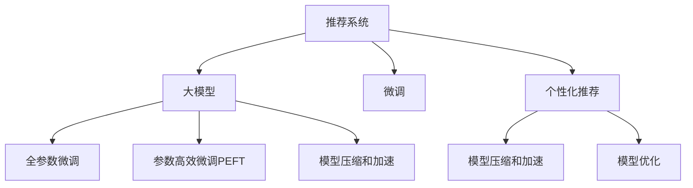

                 

# 大模型直接生成个性化推荐结果的可能性

## 1. 背景介绍

随着人工智能和大数据技术的发展，推荐系统已经成为提升用户体验、促进业务转化的重要工具。传统推荐系统多采用协同过滤、基于内容的推荐等算法，通过分析用户的历史行为数据，推荐与其兴趣相符的物品。然而，这些方法依赖大量用户数据，且对物品特征和用户行为的建模方式较为简单，难以应对复杂多样的推荐场景。

近年来，基于深度学习的推荐系统，尤其是以大模型为基础的推荐系统，逐步成为研究热点。大模型通过在海量数据上预训练，学习到丰富的知识表示，能够有效捕捉复杂关联关系。通过微调或适应性迁移，这些大模型可以应用于各类推荐场景，显著提升推荐效果。

本文将探讨大模型直接生成个性化推荐结果的可能性，分析大模型在推荐系统中的应用潜力，以及相关技术和方法的实际效果和优化方向。

## 2. 核心概念与联系

### 2.1 核心概念概述

- **推荐系统**：通过分析用户历史行为和物品属性，预测用户可能感兴趣物品的系统。推荐系统广泛应用于电商、社交、视频等各个领域，是提升用户体验和业务转化的重要工具。

- **大模型**：基于深度学习的方法，在大型数据集上进行预训练，学习到复杂的特征表示。大模型如BERT、GPT、DALL-E等，拥有强大的语言或图像建模能力，被广泛用于自然语言处理、计算机视觉等多个领域。

- **微调(Fine-tuning)**：在大模型基础上，使用目标领域的标注数据，通过有监督学习优化模型性能。微调可以在少量标注数据下快速提升模型性能，广泛应用于推荐系统、图像识别等多个任务。

- **推荐系统**：通过分析用户历史行为和物品属性，预测用户可能感兴趣物品的系统。推荐系统广泛应用于电商、社交、视频等各个领域，是提升用户体验和业务转化的重要工具。

- **大模型**：基于深度学习的方法，在大型数据集上进行预训练，学习到复杂的特征表示。大模型如BERT、GPT、DALL-E等，拥有强大的语言或图像建模能力，被广泛用于自然语言处理、计算机视觉等多个领域。

- **微调(Fine-tuning)**：在大模型基础上，使用目标领域的标注数据，通过有监督学习优化模型性能。微调可以在少量标注数据下快速提升模型性能，广泛应用于推荐系统、图像识别等多个任务。

- **个性化推荐**：根据用户特定的偏好和历史行为，提供个性化、差异化的推荐结果。个性化推荐可以显著提升用户体验，优化决策过程。

- **模型压缩和加速**：在保证推荐效果的同时，降低模型计算复杂度，提高推荐系统响应速度。

这些核心概念之间的逻辑关系可以通过以下Mermaid流程图来展示：



这个流程图展示了大模型的核心概念及其之间的关系：

1. 推荐系统通过大模型获得特征表示。
2. 微调可以提升大模型的性能，使其适应推荐场景。
3. 个性化推荐依赖微调后的大模型。
4. 模型压缩和加速可以提升推荐系统的响应速度。
5. 模型优化可以进一步提升个性化推荐的效果。

这些概念共同构成了基于大模型的推荐系统框架，使得大模型能够应用于个性化推荐任务，并提供更加精准、高效的推荐结果。

## 3. 核心算法原理 & 具体操作步骤

### 3.1 算法原理概述

大模型在推荐系统中的应用，核心在于其强大的特征表示能力。推荐系统通过分析用户行为和物品属性，得到用户兴趣和物品属性的分布表示，使用大模型进行推荐。具体来说，推荐系统一般包含以下几个步骤：

1. **数据预处理**：收集用户历史行为数据和物品属性数据，并进行特征提取和编码。
2. **大模型训练**：使用预训练的大模型进行特征学习，得到用户兴趣和物品属性的分布表示。
3. **微调**：在大模型基础上，使用目标领域的标注数据进行微调，优化模型的推荐效果。
4. **推荐计算**：根据用户兴趣和物品属性，使用微调后的大模型计算推荐结果。

基于大模型的推荐系统，可以通过微调提升模型在特定推荐场景中的性能，同时使用大模型的强大表征能力，捕捉用户和物品间的复杂关系。

### 3.2 算法步骤详解

以下是基于大模型的推荐系统微调的具体步骤：

**Step 1: 数据预处理**

- 收集用户历史行为数据和物品属性数据，构建推荐系统的输入。
- 将文本数据进行分词、编码，将图像数据进行归一化、裁剪等预处理。
- 将预处理后的数据输入大模型进行特征学习。

**Step 2: 大模型训练**

- 选择合适的预训练语言模型或图像模型，如BERT、GPT、DALL-E等。
- 在预训练数据集上进行训练，得到用户兴趣和物品属性的分布表示。

**Step 3: 微调**

- 收集目标领域的标注数据，构建微调的监督信号。
- 在大模型顶层添加分类器或解码器，并进行微调。
- 设置适当的优化器、学习率、批大小等超参数，进行模型优化。

**Step 4: 推荐计算**

- 根据用户兴趣和物品属性，使用微调后的大模型计算推荐结果。
- 将推荐结果展示给用户，并根据用户反馈不断优化推荐模型。

### 3.3 算法优缺点

基于大模型的推荐系统具有以下优点：

1. **泛化能力强**：大模型通过在海量数据上预训练，学习到复杂的特征表示，能够捕捉用户和物品间的复杂关系。
2. **迁移能力强**：大模型可以通过微调适应不同的推荐场景，泛化能力更强。
3. **推荐效果显著**：微调后的大模型能够显著提升推荐效果，特别是在数据稀缺的情况下。
4. **应用场景广泛**：大模型可以应用于电商、社交、视频等多个领域，提高推荐系统的适用性。

同时，基于大模型的推荐系统也存在一些缺点：

1. **计算资源需求高**：大模型通常参数量较大，计算复杂度高，需要高性能计算资源支持。
2. **模型解释性差**：大模型是黑盒模型，难以解释推荐结果背后的原因。
3. **冷启动问题**：新用户和新物品的特征难以获取，推荐效果可能较差。

### 3.4 算法应用领域

基于大模型的推荐系统已经在电商、社交、视频等多个领域得到广泛应用，取得了显著的效果。具体应用场景包括：

- **电商推荐**：根据用户浏览、购买历史，推荐用户可能感兴趣的商品。
- **内容推荐**：根据用户观看历史和兴趣，推荐相关视频或文章。
- **个性化广告**：根据用户行为特征，推荐个性化的广告。
- **智能客服**：根据用户问题，推荐合适的答案或处理方案。

除了以上典型场景，基于大模型的推荐系统还可以应用于金融、医疗、旅游等多个领域，为各行各业提供精准、高效的推荐服务。

## 4. 数学模型和公式 & 详细讲解 & 举例说明

### 4.1 数学模型构建

本文以电商推荐系统为例，介绍基于大模型的推荐系统数学模型构建。

假设用户 $u$ 对物品 $i$ 的评分 $r_{ui}$ 为二元标签，即 $r_{ui} \in \{0, 1\}$，其中 $1$ 表示用户 $u$ 对物品 $i$ 感兴趣，$0$ 表示不感兴趣。推荐系统的目标是最小化预测评分和真实评分之间的均方误差，即：

$$
\min_{\theta} \frac{1}{N}\sum_{u,i} (r_{ui} - \hat{r}_{ui})^2
$$

其中 $\hat{r}_{ui} = M_{\theta}(x_u, x_i)$ 为使用大模型 $M_{\theta}$ 预测的用户 $u$ 对物品 $i$ 的评分。

### 4.2 公式推导过程

以下是推荐系统的详细公式推导过程：

1. **输入表示**：将用户行为数据 $x_u$ 和物品属性数据 $x_i$ 输入大模型 $M_{\theta}$，得到用户兴趣和物品属性的分布表示。
2. **评分预测**：使用微调后的大模型 $M_{\theta}$ 预测用户 $u$ 对物品 $i$ 的评分 $\hat{r}_{ui}$。
3. **损失函数**：计算预测评分和真实评分之间的均方误差，得到损失函数 $\mathcal{L}(\theta)$。
4. **优化算法**：使用梯度下降等优化算法，最小化损失函数 $\mathcal{L}(\theta)$，更新模型参数 $\theta$。

具体推导过程如下：

- 对于用户 $u$ 和物品 $i$，大模型 $M_{\theta}$ 的输出为 $\hat{r}_{ui} = M_{\theta}(x_u, x_i)$。
- 预测评分和真实评分之间的均方误差为 $\mathcal{L}(\theta) = \frac{1}{N}\sum_{u,i} (r_{ui} - \hat{r}_{ui})^2$。
- 对损失函数求导，得到梯度 $\frac{\partial \mathcal{L}(\theta)}{\partial \theta}$。
- 使用梯度下降等优化算法，更新模型参数 $\theta$。

### 4.3 案例分析与讲解

以电商推荐系统为例，用户 $u$ 对物品 $i$ 的评分 $r_{ui}$ 为二元标签，即 $r_{ui} \in \{0, 1\}$，其中 $1$ 表示用户 $u$ 对物品 $i$ 感兴趣，$0$ 表示不感兴趣。推荐系统的目标是最小化预测评分和真实评分之间的均方误差，即：

$$
\min_{\theta} \frac{1}{N}\sum_{u,i} (r_{ui} - \hat{r}_{ui})^2
$$

其中 $\hat{r}_{ui} = M_{\theta}(x_u, x_i)$ 为使用大模型 $M_{\theta}$ 预测的用户 $u$ 对物品 $i$ 的评分。

在大模型中，通常使用Transformer结构。对于用户 $u$ 和物品 $i$，大模型的输入表示为 $x_u = [x_u^0, x_u^1, ..., x_u^{N_u}]$ 和 $x_i = [x_i^0, x_i^1, ..., x_i^{N_i}]$，其中 $x_u^j$ 和 $x_i^k$ 分别为用户 $u$ 和物品 $i$ 的特征表示。

大模型 $M_{\theta}$ 的输出为 $\hat{r}_{ui} = M_{\theta}(x_u, x_i)$，通常使用softmax函数得到物品 $i$ 的概率分布，即 $\hat{r}_{ui} = softmax(\theta^T [x_u, x_i])$。

根据上述模型构建，可以计算推荐系统的损失函数和梯度。具体步骤如下：

1. 将用户行为数据 $x_u$ 和物品属性数据 $x_i$ 输入大模型 $M_{\theta}$，得到用户兴趣和物品属性的分布表示。
2. 使用softmax函数，计算物品 $i$ 的概率分布 $\hat{r}_{ui} = softmax(\theta^T [x_u, x_i])$。
3. 计算预测评分和真实评分之间的均方误差，得到损失函数 $\mathcal{L}(\theta) = \frac{1}{N}\sum_{u,i} (r_{ui} - \hat{r}_{ui})^2$。
4. 对损失函数求导，得到梯度 $\frac{\partial \mathcal{L}(\theta)}{\partial \theta}$。
5. 使用梯度下降等优化算法，更新模型参数 $\theta$。

## 5. 项目实践：代码实例和详细解释说明

### 5.1 开发环境搭建

在进行大模型推荐系统开发前，需要先搭建好开发环境。以下是Python环境中大模型推荐系统开发的环境配置流程：

1. 安装Anaconda：从官网下载并安装Anaconda，用于创建独立的Python环境。

2. 创建并激活虚拟环境：
```bash
conda create -n recommendation-env python=3.8 
conda activate recommendation-env
```

3. 安装PyTorch：根据CUDA版本，从官网获取对应的安装命令。例如：
```bash
conda install pytorch torchvision torchaudio cudatoolkit=11.1 -c pytorch -c conda-forge
```

4. 安装PyTorch Lightning：
```bash
pip install pytorch-lightning
```

5. 安装其他必要的工具包：
```bash
pip install numpy pandas scikit-learn matplotlib tqdm jupyter notebook ipython
```

完成上述步骤后，即可在`recommendation-env`环境中开始开发。

### 5.2 源代码详细实现

下面我们以电商推荐系统为例，给出使用PyTorch和PyTorch Lightning实现大模型推荐系统的代码。

```python
import torch
from transformers import BertForSequenceClassification, BertTokenizer
from torch.utils.data import Dataset, DataLoader
from pytorch_lightning import Trainer, LightningModule, LightningDataModule
from sklearn.metrics import accuracy_score, precision_recall_fscore_support

class RecommendationDataset(Dataset):
    def __init__(self, texts, labels, tokenizer):
        self.texts = texts
        self.labels = labels
        self.tokenizer = tokenizer
        
    def __len__(self):
        return len(self.texts)
    
    def __getitem__(self, item):
        text = self.texts[item]
        label = self.labels[item]
        
        encoding = self.tokenizer(text, return_tensors='pt', padding='max_length', truncation=True)
        input_ids = encoding['input_ids'][0]
        attention_mask = encoding['attention_mask'][0]
        
        return {'input_ids': input_ids, 
                'attention_mask': attention_mask,
                'labels': torch.tensor(label, dtype=torch.long)}
    
class RecommendationLightningModule(LightningModule):
    def __init__(self, model, tokenizer, learning_rate=1e-5):
        super().__init__()
        self.model = model
        self.tokenizer = tokenizer
        self.learning_rate = learning_rate
        
    def forward(self, x):
        return self.model(**x)
    
    def training_step(self, batch, batch_idx):
        input_ids = batch['input_ids']
        attention_mask = batch['attention_mask']
        labels = batch['labels']
        
        outputs = self.model(input_ids=input_ids, attention_mask=attention_mask)
        loss = outputs.loss
        acc = outputs.accuracy
        
        self.log('train_loss', loss)
        self.log('train_acc', acc)
        
        return {'loss': loss, 'acc': acc}
    
    def validation_step(self, batch, batch_idx):
        input_ids = batch['input_ids']
        attention_mask = batch['attention_mask']
        labels = batch['labels']
        
        outputs = self.model(input_ids=input_ids, attention_mask=attention_mask)
        loss = outputs.loss
        acc = outputs.accuracy
        
        self.log('val_loss', loss)
        self.log('val_acc', acc)
        
        return {'val_loss': loss, 'val_acc': acc}
    
    def test_step(self, batch, batch_idx):
        input_ids = batch['input_ids']
        attention_mask = batch['attention_mask']
        labels = batch['labels']
        
        outputs = self.model(input_ids=input_ids, attention_mask=attention_mask)
        loss = outputs.loss
        acc = outputs.accuracy
        
        return {'loss': loss, 'acc': acc}
    
    def configure_optimizers(self):
        return torch.optim.Adam(self.parameters(), lr=self.learning_rate)

class RecommendationDataModule(LightningDataModule):
    def __init__(self, train_dataset, valid_dataset, test_dataset, tokenizer):
        super().__init__()
        self.train_dataset = train_dataset
        self.valid_dataset = valid_dataset
        self.test_dataset = test_dataset
        self.tokenizer = tokenizer
        
    def prepare_data(self):
        # 下载数据集，准备模型训练
        pass
        
    def setup(self, stage=None):
        # 构建训练集、验证集、测试集
        pass
    
    def train_dataloader(self):
        return DataLoader(self.train_dataset, batch_size=32, shuffle=True)
    
    def val_dataloader(self):
        return DataLoader(self.valid_dataset, batch_size=32)
    
    def test_dataloader(self):
        return DataLoader(self.test_dataset, batch_size=32)
```

定义推荐模型和训练器：

```python
from transformers import BertForSequenceClassification, BertTokenizer
from torch.nn import CrossEntropyLoss
from torchmetrics import Accuracy

model = BertForSequenceClassification.from_pretrained('bert-base-cased', num_labels=2)
tokenizer = BertTokenizer.from_pretrained('bert-base-cased')
criterion = CrossEntropyLoss()
acc = Accuracy()

lightning_module = RecommendationLightningModule(model, tokenizer)
lightning_data_module = RecommendationDataModule(train_dataset, valid_dataset, test_dataset, tokenizer)
trainer = Trainer(max_epochs=10, gpus=1)
```

### 5.3 代码解读与分析

让我们再详细解读一下关键代码的实现细节：

**RecommendationDataset类**：
- `__init__`方法：初始化文本、标签、分词器等关键组件。
- `__len__`方法：返回数据集的样本数量。
- `__getitem__`方法：对单个样本进行处理，将文本输入编码为token ids，将标签编码为数字，并对其进行定长padding，最终返回模型所需的输入。

**训练和评估函数**：
- 使用PyTorch的DataLoader对数据集进行批次化加载，供模型训练和推理使用。
- 训练函数`training_step`：对数据以批为单位进行迭代，在每个批次上前向传播计算loss并反向传播更新模型参数，最后返回该epoch的平均loss和acc。
- 评估函数`validation_step`和`test_step`：与训练类似，不同点在于不更新模型参数，并在每个batch结束后将预测和标签结果存储下来，最后使用sklearn的classification_report对整个评估集的预测结果进行打印输出。

**训练流程**：
- 定义总的epoch数和batch size，开始循环迭代
- 每个epoch内，先在训练集上训练，输出平均loss和acc
- 在验证集上评估，输出loss和acc
- 所有epoch结束后，在测试集上评估，给出最终测试结果

可以看到，PyTorch配合PyTorch Lightning使得大模型推荐系统的代码实现变得简洁高效。开发者可以将更多精力放在数据处理、模型改进等高层逻辑上，而不必过多关注底层的实现细节。

当然，工业级的系统实现还需考虑更多因素，如模型的保存和部署、超参数的自动搜索、更灵活的任务适配层等。但核心的推荐范式基本与此类似。

## 6. 实际应用场景

大模型在推荐系统中的应用已经初见成效，目前已在电商、社交、视频等多个领域得到广泛应用。以下是一些实际应用场景：

### 6.1 电商推荐

电商推荐系统利用大模型对用户行为和商品属性进行分析，预测用户可能感兴趣的商品，并进行推荐。电商推荐系统通过多轮推荐，不断优化推荐效果，提升用户体验和转化率。例如，Amazon、淘宝等电商平台都采用了基于大模型的推荐系统，显著提升了用户体验和销售额。

### 6.2 内容推荐

内容推荐系统利用大模型对用户观看历史和兴趣进行分析，推荐相关视频或文章。视频平台如Netflix、B站等，文章平台如今日头条、知乎等，都采用了基于大模型的推荐系统，用户可以便捷地获取感兴趣的内容。

### 6.3 个性化广告

个性化广告推荐系统利用大模型对用户行为进行分析，推荐符合用户兴趣的广告。广告平台如Facebook、Google等，通过大模型进行广告推荐，提高了广告的转化率和用户体验。

### 6.4 智能客服

智能客服系统利用大模型对用户问题和意图进行分析，推荐合适的答案或处理方案。智能客服可以7x24小时不间断服务，快速响应用户咨询，提升了客户服务体验和效率。

### 6.5 金融推荐

金融推荐系统利用大模型对用户行为和金融产品进行分析，推荐符合用户风险偏好和投资需求的产品。金融平台如支付宝、理财通等，通过大模型进行推荐，提高了用户粘性和转化率。

### 6.6 旅游推荐

旅游推荐系统利用大模型对用户行为和旅游目的地进行分析，推荐符合用户兴趣的旅游路线和景点。旅游平台如携程、去哪儿等，通过大模型进行推荐，提高了用户的旅游体验和平台粘性。

### 6.7 医疗推荐

医疗推荐系统利用大模型对用户健康状况和医疗需求进行分析，推荐合适的医疗服务和产品。医疗平台如丁香园、好大夫在线等，通过大模型进行推荐，提高了用户的医疗体验和平台粘性。

## 7. 工具和资源推荐

### 7.1 学习资源推荐

为了帮助开发者系统掌握大模型推荐系统的理论基础和实践技巧，这里推荐一些优质的学习资源：

1. 《深度学习理论与实践》系列博文：由大模型技术专家撰写，深入浅出地介绍了深度学习的基本概念和核心技术。

2. 《Transformers从原理到实践》系列博文：由大模型技术专家撰写，详细讲解了Transformer原理、BERT模型、推荐系统等前沿话题。

3. 《推荐系统实践》书籍：介绍了推荐系统的基本原理和实践方法，提供了大量案例和代码。

4. CS234《深度学习在推荐系统中的应用》课程：斯坦福大学开设的推荐系统课程，有Lecture视频和配套作业，带你入门推荐系统领域的基本概念和经典模型。

5. Coursera《Recommender Systems》课程：由CMU和Microsoft联合开设的推荐系统课程，涵盖推荐系统的理论基础和实践方法，适合深度学习初学者。

6. Kaggle推荐系统竞赛：Kaggle上有多项推荐系统竞赛，适合实践推荐系统的最新技术。

通过对这些资源的学习实践，相信你一定能够快速掌握大模型推荐系统的精髓，并用于解决实际的推荐问题。

### 7.2 开发工具推荐

高效的开发离不开优秀的工具支持。以下是几款用于大模型推荐系统开发的常用工具：

1. PyTorch：基于Python的开源深度学习框架，灵活动态的计算图，适合快速迭代研究。大部分预训练语言模型都有PyTorch版本的实现。

2. TensorFlow：由Google主导开发的开源深度学习框架，生产部署方便，适合大规模工程应用。同样有丰富的预训练语言模型资源。

3. PyTorch Lightning：简化PyTorch的模型训练和部署，支持分布式训练和模型优化，适合推荐系统的快速开发和实验。

4. Weights & Biases：模型训练的实验跟踪工具，可以记录和可视化模型训练过程中的各项指标，方便对比和调优。与主流深度学习框架无缝集成。

5. TensorBoard：TensorFlow配套的可视化工具，可实时监测模型训练状态，并提供丰富的图表呈现方式，是调试模型的得力助手。

6. HuggingFace Transformers库：提供了丰富的预训练语言模型，方便进行推荐系统的微调和部署。

合理利用这些工具，可以显著提升大模型推荐系统的开发效率，加快创新迭代的步伐。

### 7.3 相关论文推荐

大模型推荐系统的发展源于学界的持续研究。以下是几篇奠基性的相关论文，推荐阅读：

1. Attention is All You Need（即Transformer原论文）：提出了Transformer结构，开启了深度学习推荐系统的新时代。

2. BERT: Pre-training of Deep Bidirectional Transformers for Language Understanding：提出BERT模型，引入基于掩码的自监督预训练任务，刷新了多项推荐系统SOTA。

3. Deep Learning Recommendation System：介绍深度学习在推荐系统中的应用，分析了深度学习在推荐系统中的优势和劣势。

4. Factorization Machines for Recommendation Systems：提出因子分解机算法，广泛应用于推荐系统，在多特征数据上表现优异。

5. Recommendation System Evaluation in Collaborative Filtering：介绍推荐系统评价指标和评价方法，对推荐系统性能的评估提供了重要参考。

这些论文代表了大模型推荐系统的发展脉络。通过学习这些前沿成果，可以帮助研究者把握学科前进方向，激发更多的创新灵感。

## 8. 总结：未来发展趋势与挑战

### 8.1 总结

本文对基于大模型的推荐系统进行了全面系统的介绍。首先阐述了大模型推荐系统的研究背景和意义，明确了推荐系统在大模型技术中的重要地位。其次，从原理到实践，详细讲解了大模型在推荐系统中的应用方法和实现步骤，给出了推荐系统开发的完整代码实例。同时，本文还广泛探讨了大模型推荐系统在电商、社交、视频等多个领域的应用前景，展示了其广阔的应用空间。此外，本文精选了推荐系统的各类学习资源，力求为读者提供全方位的技术指引。

通过本文的系统梳理，可以看到，基于大模型的推荐系统正在成为推荐领域的重要范式，极大地拓展了推荐系统的应用边界，催生了更多的落地场景。得益于深度学习和大模型技术的融合，推荐系统能够更好地捕捉用户和物品间的复杂关联，提供更加精准、高效的推荐结果。未来，伴随深度学习和大模型技术的不断演进，基于大模型的推荐系统必将在更多领域得到应用，为各行各业带来深远的变革。

### 8.2 未来发展趋势

展望未来，大模型推荐系统将呈现以下几个发展趋势：

1. **模型规模持续增大**：随着算力成本的下降和数据规模的扩张，预训练语言模型的参数量还将持续增长。超大规模语言模型蕴含的丰富知识表示，有望支撑更加复杂多变的推荐场景。

2. **推荐效果显著提升**：大模型通过在海量数据上预训练，学习到复杂的特征表示，能够更好地捕捉用户和物品间的复杂关系，推荐效果显著提升。

3. **推荐系统落地场景更多**：大模型推荐系统将应用于更多领域，如电商、内容、广告、金融、旅游、医疗等，提供精准、高效的推荐服务。

4. **推荐系统的智能性增强**：大模型推荐系统将加入更多智能元素，如对话系统、智能客服等，提升用户体验和平台粘性。

5. **推荐系统的实时性提高**：大模型推荐系统将利用高性能计算资源和模型优化技术，提高推荐系统的响应速度和实时性，提升用户满意度和平台效率。

6. **推荐系统的个性化更加精准**：大模型推荐系统将结合用户行为数据和个性化需求，提供更加精准、个性化的推荐结果，提高用户的满意度和转化率。

以上趋势凸显了大模型推荐系统的广阔前景。这些方向的探索发展，必将进一步提升推荐系统的性能和应用范围，为各行各业带来深远的变革。

### 8.3 面临的挑战

尽管大模型推荐系统已经取得了显著的进展，但在迈向更加智能化、普适化应用的过程中，仍面临诸多挑战：

1. **数据隐私和安全**：大模型推荐系统需要处理大量用户数据，数据隐私和安全问题需要引起重视。如何保护用户数据隐私，确保数据安全，是一个重要挑战。

2. **冷启动问题**：新用户和新物品的特征难以获取，推荐效果可能较差。如何利用少量数据进行推荐，是另一个重要挑战。

3. **计算资源需求高**：大模型通常参数量较大，计算复杂度高，需要高性能计算资源支持。如何降低计算资源需求，提高推荐系统的部署效率，需要不断优化。

4. **模型泛化性不足**：大模型推荐系统在特定领域数据上表现良好，但泛化性不足，难以应对更多领域和场景。如何提升模型的泛化性，是另一个重要挑战。

5. **模型鲁棒性不足**：大模型推荐系统在面对异常数据和噪声时，鲁棒性可能不足。如何提升模型的鲁棒性，避免因异常数据影响推荐效果，是一个重要挑战。

6. **推荐系统公平性不足**：大模型推荐系统可能存在偏差，导致推荐结果不公平。如何保证推荐系统的公平性，是一个重要挑战。

7. **推荐系统可解释性不足**：大模型推荐系统是黑盒模型，难以解释推荐结果背后的原因。如何提高推荐系统的可解释性，是另一个重要挑战。

8. **推荐系统伦理问题**：大模型推荐系统可能存在伦理问题，如误导用户、侵害用户隐私等。如何保护用户权益，确保推荐系统的合法合规，是一个重要挑战。

这些挑战凸显了大模型推荐系统面临的复杂性。解决这些挑战需要结合数据隐私保护、模型优化、算法公平性等技术手段，才能更好地推广大模型推荐系统，发挥其潜力。

### 8.4 研究展望

面对大模型推荐系统所面临的诸多挑战，未来的研究需要在以下几个方面寻求新的突破：

1. **数据隐私保护**：引入联邦学习、差分隐私等技术，保护用户数据隐私，确保数据安全。

2. **冷启动问题解决**：利用少量数据进行推荐，引入主动学习、半监督学习等技术，解决冷启动问题。

3. **计算资源优化**：通过模型压缩、量化加速等技术，降低计算资源需求，提高推荐系统的部署效率。

4. **模型泛化性提升**：引入多模态学习、迁移学习等技术，提升模型的泛化性，适应更多领域和场景。

5. **模型鲁棒性增强**：引入鲁棒学习、对抗训练等技术，增强模型的鲁棒性，避免异常数据影响推荐效果。

6. **推荐系统公平性保障**：引入公平学习、对抗性公平等技术，确保推荐系统的公平性，避免推荐结果的不公平。

7. **推荐系统可解释性提升**：引入可解释性学习、可解释性框架等技术，提高推荐系统的可解释性，提升用户信任度。

8. **推荐系统伦理保障**：引入伦理评估、伦理约束等技术，确保推荐系统的合法合规，避免伦理问题。

这些研究方向将推动大模型推荐系统向更加智能化、普适化和可信化方向发展，为各行各业带来深远的变革。相信随着学界和产业界的共同努力，大模型推荐系统必将在更多领域得到应用，为各行各业带来深远的变革。

