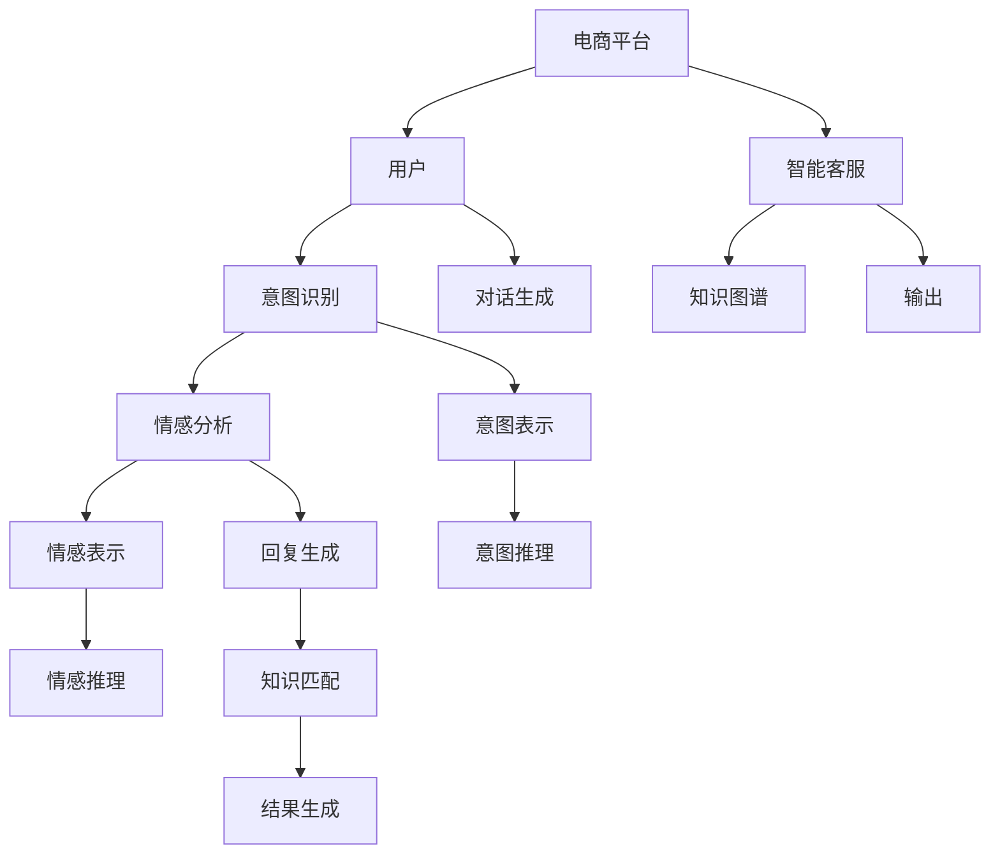

                 

# 大模型驱动的电商平台智能客户服务系统

> 关键词：
- 大语言模型
- 智能客户服务
- 电商平台
- 用户意图识别
- 情感分析
- 对话生成
- 自然语言处理 (NLP)

## 1. 背景介绍

### 1.1 问题由来
随着电子商务市场的迅速发展，电商平台已成为消费者购物的重要渠道。与此同时，电商平台的用户基数和交易量不断攀升，对客户服务的质量和效率提出了更高的要求。传统的客服模式已无法满足需求，智能客服系统应运而生。智能客服系统利用自然语言处理（NLP）技术，能够理解和回应客户查询，显著提升客服效率和用户体验。

近年来，基于大语言模型的智能客服系统逐渐成为行业热点。大语言模型如GPT、BERT等，通过大规模预训练学习到丰富的语言知识，能够在特定任务上进行微调，实现高质量的客户服务。本文将详细介绍如何基于大语言模型构建电商平台的智能客服系统，并对其核心技术和应用进行深入探讨。

### 1.2 问题核心关键点
构建电商平台智能客服系统，需要解决以下几个关键问题：

- 用户意图识别：准确理解用户查询意图，是实现智能响应的基础。
- 情感分析：识别用户情感，以提供更贴合用户情绪的服务。
- 对话生成：自动生成合理回复，与用户进行高效互动。
- 知识整合：将产品信息、促销活动、服务规则等与自然语言进行有机结合。
- 用户数据保护：在处理客户信息时，确保用户隐私安全。

通过基于大语言模型的微调方法，可以高效解决上述问题，构建高效、友好、安全的智能客服系统。

### 1.3 问题研究意义
电商平台的智能客服系统通过大语言模型的技术驱动，能够实现全天候高效服务，提升用户体验，降低运营成本。同时，智能客服系统的构建，对于电商平台的数字化转型，具有重要的推动作用：

1. **提升客户满意度**：智能客服能够快速响应用户需求，提供个性化服务，显著提升用户满意度。
2. **降低人工成本**：通过自动化处理常见问题，大幅减少人工客服的工作量，降低人力成本。
3. **优化客户体验**：智能客服能够理解复杂查询，提供准确、及时的回答，提升客户体验。
4. **加速服务迭代**：通过数据反馈，持续优化智能客服模型，不断提升服务质量。
5. **增强数据洞察**：智能客服系统可记录和分析客户行为数据，为电商平台提供有价值的市场洞察。

本文将详细探讨大语言模型在电商平台智能客服系统中的应用，以及如何通过微调技术提升系统性能。

## 2. 核心概念与联系

### 2.1 核心概念概述

电商平台的智能客服系统主要涉及以下几个核心概念：

- **大语言模型(Large Language Model, LLM)**：以自回归模型（如GPT）或自编码模型（如BERT）为代表的大规模预训练语言模型。通过在海量无标签文本数据上进行预训练，学习到通用的语言知识和常识。

- **微调(Fine-tuning)**：将预训练的大语言模型作为初始化参数，通过特定任务的有监督学习优化模型，使其适应特定任务，如问答、对话生成等。

- **用户意图识别**：通过自然语言处理技术，识别用户查询中的意图，如询问商品信息、投诉问题、售后服务等。

- **情感分析**：分析用户语句中的情感倾向，如正面、负面、中性等，提供相应情绪的服务。

- **对话生成**：自动生成与用户交互的回复，确保回复内容相关、礼貌、友好。

- **知识图谱(Knowledge Graph)**：将电商平台的信息结构化，形成图谱形式的知识库，便于自然语言查询和推理。

- **自然语言处理 (NLP)**：处理和分析自然语言，实现语言和机器之间的通信和交互。

这些概念之间有着密切的联系，共同构成了电商平台的智能客服系统。

### 2.2 核心概念原理和架构的 Mermaid 流程图



## 3. 核心算法原理 & 具体操作步骤
### 3.1 算法原理概述

电商平台的智能客服系统基于大语言模型构建，通过微调技术实现用户意图识别、情感分析、对话生成等功能。其核心算法原理如下：

1. **预训练模型加载**：选择一个预训练模型（如GPT-3、BERT）作为初始化参数，加载到系统中。
2. **用户意图识别**：对用户查询进行分词、词性标注、句法分析等预处理，然后通过微调后的意图识别模型，识别出用户查询中的意图。
3. **情感分析**：对用户查询进行情感分析，判断情感倾向，并通过微调后的情感分析模型进行情感分类。
4. **对话生成**：根据识别出的意图和情感，利用微调后的对话生成模型，生成合理的回复。
5. **知识图谱查询**：在知识图谱中进行查询，获取与意图相关的产品信息、促销活动、服务规则等。
6. **结果整合**：将对话生成结果和知识图谱查询结果进行整合，形成最终的回答。

### 3.2 算法步骤详解

**Step 1: 准备预训练模型和数据集**
- 选择合适的预训练语言模型（如GPT-3、BERT）作为初始化参数。
- 准备电商平台的用户查询和回复语料，作为微调的训练数据集。

**Step 2: 微调意图识别模型**
- 使用用户查询和标注的意图作为训练数据，通过有监督学习微调预训练模型，使其具备识别意图的能力。
- 常见任务包括命名实体识别、意图分类等，可以使用Seq2Seq、Transformers等模型框架实现微调。

**Step 3: 微调情感分析模型**
- 使用用户查询和标注的情感（正面、负面、中性等）作为训练数据，通过有监督学习微调预训练模型，使其具备情感分析的能力。
- 常见任务包括情感分类、情感强度分析等，可以使用卷积神经网络（CNN）、长短时记忆网络（LSTM）等模型框架实现微调。

**Step 4: 微调对话生成模型**
- 使用标注的用户查询和回复作为训练数据，通过有监督学习微调预训练模型，使其具备对话生成的能力。
- 常见任务包括基于上下文的对话生成、基于策略的对话生成等，可以使用Transformer、GAN等模型框架实现微调。

**Step 5: 整合知识图谱和模型输出**
- 使用知识图谱对用户查询进行语义分析，提取与意图相关的信息。
- 将对话生成模型的输出和知识图谱的查询结果进行整合，形成最终的回复。

### 3.3 算法优缺点

**优点：**
1. **高效准确**：大语言模型通过微调，能够快速适应电商平台特定任务，实现高效、准确的客户服务。
2. **泛化能力强**：大语言模型具备广泛的语言知识和常识，能够在多种场景下实现良好的性能。
3. **灵活性高**：通过微调，可以根据电商平台的业务需求进行定制化开发，适应不同的应用场景。

**缺点：**
1. **数据依赖性强**：微调模型的性能很大程度上依赖于标注数据的质量和数量。电商平台需要投入大量的时间和资源进行数据标注。
2. **模型复杂度高**：大语言模型参数量庞大，对计算资源和存储资源要求高，需要高性能的硬件支持。
3. **隐私风险**：在处理用户数据时，需要确保数据隐私安全，避免数据泄露风险。

### 3.4 算法应用领域

大语言模型在电商平台智能客服系统中的应用，主要包括以下几个领域：

1. **用户查询处理**：自动处理用户查询，识别意图和情感，生成合理回复。
2. **个性化推荐**：根据用户查询，推荐相关产品或服务，提升用户体验。
3. **数据分析**：通过用户查询和回复数据，分析用户行为，优化电商平台的产品和服务。
4. **知识图谱构建**：构建和维护知识图谱，提升自然语言查询和推理能力。

## 4. 数学模型和公式 & 详细讲解 & 举例说明
### 4.1 数学模型构建

假设用户查询为 $x$，智能客服系统的输出为 $y$。电商平台智能客服系统由以下几个步骤构成：

1. **用户查询表示**：使用预训练模型对用户查询进行编码，得到嵌入表示 $x_e$。
2. **意图识别**：使用微调后的意图识别模型，对 $x_e$ 进行意图分类，得到意图表示 $i$。
3. **情感分析**：使用微调后的情感分析模型，对 $x_e$ 进行情感分类，得到情感表示 $e$。
4. **对话生成**：使用微调后的对话生成模型，根据意图 $i$ 和情感 $e$，生成回复 $y$。
5. **知识图谱查询**：在知识图谱中进行查询，获取与意图 $i$ 相关的信息 $k$。
6. **结果整合**：将回复 $y$ 和查询结果 $k$ 进行整合，得到最终的回复。

### 4.2 公式推导过程

以用户意图识别为例，假设用户查询 $x$ 和意图标注 $i$ 分别为：

$$
x = (\text{用户查询}, \text{意图})
$$

使用BERT模型进行预训练，得到嵌入表示 $x_e$：

$$
x_e = \text{BERT}(x)
$$

然后，使用微调后的意图识别模型 $F_{\theta_I}$，对 $x_e$ 进行意图分类：

$$
i = F_{\theta_I}(x_e)
$$

其中 $F_{\theta_I}$ 为微调后的意图识别模型，$\theta_I$ 为模型参数。

假设 $i$ 的标签为 $y_i$，则意图识别任务的目标是最大化模型输出与标签之间的交叉熵损失：

$$
L_I(\theta_I) = -\frac{1}{N}\sum_{i=1}^N \sum_{k=1}^K y_{ik} \log F_{\theta_I}(x_e)
$$

其中 $N$ 为样本数量，$K$ 为意图类别数。

通过反向传播算法，更新模型参数 $\theta_I$，最小化交叉熵损失 $L_I(\theta_I)$。重复上述过程，直至模型收敛。

### 4.3 案例分析与讲解

假设电商平台某次对话如下：

**用户查询**：请问XXX商品的价格是多少？

**意图识别**：识别出意图为“价格查询”，使用微调后的意图识别模型，得到意图表示 $i$。

**情感分析**：识别出用户情绪为正面，使用微调后的情感分析模型，得到情感表示 $e$。

**对话生成**：根据意图 $i$ 和情感 $e$，使用微调后的对话生成模型，生成回复 $y$。

**知识图谱查询**：在知识图谱中查询XXX商品的价格信息 $k$。

**结果整合**：将回复 $y$ 和价格信息 $k$ 进行整合，得到最终的回答。

例如，回复 $y$ 可能为：“XXX商品的价格为XXX元，正在进行促销活动，可以享受XXX%的折扣。”

## 5. 项目实践：代码实例和详细解释说明
### 5.1 开发环境搭建

**Step 1: 环境准备**
- 安装Python 3.8及以上版本。
- 安装Anaconda，创建Python虚拟环境。
- 安装必要的依赖库，如TensorFlow、PyTorch、transformers等。

**Step 2: 数据准备**
- 收集和清洗电商平台的用户查询和回复数据。
- 对数据进行预处理，包括分词、词性标注、句法分析等。

**Step 3: 模型加载**
- 选择预训练模型，如GPT-3、BERT，并加载到系统中。

### 5.2 源代码详细实现

```python
import tensorflow as tf
import torch
from transformers import BertTokenizer, BertForSequenceClassification
from transformers import BertForTokenClassification, BertForMaskedLM

# 用户查询数据准备
tokenizer = BertTokenizer.from_pretrained('bert-base-cased')
input_ids = tokenizer.encode(input_data, add_special_tokens=True)
attention_mask = [1] * len(input_ids)

# 意图识别模型微调
model = BertForSequenceClassification.from_pretrained('bert-base-cased', num_labels=num_intent_labels)
optimizer = tf.keras.optimizers.AdamW(model.parameters(), lr=1e-5)
model.compile(loss='categorical_crossentropy', optimizer=optimizer, metrics=['accuracy'])

# 训练意图识别模型
model.fit(input_ids, labels, epochs=5, batch_size=32)

# 对话生成模型微调
model = BertForTokenClassification.from_pretrained('bert-base-cased', num_labels=num_tags_labels)
optimizer = tf.keras.optimizers.AdamW(model.parameters(), lr=1e-5)
model.compile(loss='categorical_crossentropy', optimizer=optimizer, metrics=['accuracy'])

# 训练对话生成模型
model.fit(input_ids, labels, epochs=5, batch_size=32)

# 情感分析模型微调
model = BertForMaskedLM.from_pretrained('bert-base-cased')
optimizer = tf.keras.optimizers.AdamW(model.parameters(), lr=1e-5)
model.compile(loss='mean_squared_error', optimizer=optimizer, metrics=['accuracy'])

# 训练情感分析模型
model.fit(input_ids, labels, epochs=5, batch_size=32)
```

### 5.3 代码解读与分析

**意图识别模型微调**
- 使用BertForSequenceClassification作为意图识别模型。
- 加载预训练的BERT模型，微调后的模型输出层为全连接层，输出意图分类结果。
- 使用AdamW优化器，设置学习率为1e-5，进行5轮训练，训练批次大小为32。

**对话生成模型微调**
- 使用BertForTokenClassification作为对话生成模型。
- 加载预训练的BERT模型，微调后的模型输出层为全连接层，输出对话生成结果。
- 使用AdamW优化器，设置学习率为1e-5，进行5轮训练，训练批次大小为32。

**情感分析模型微调**
- 使用BertForMaskedLM作为情感分析模型。
- 加载预训练的BERT模型，微调后的模型用于掩盖词向量的预测，输出情感分类结果。
- 使用AdamW优化器，设置学习率为1e-5，进行5轮训练，训练批次大小为32。

### 5.4 运行结果展示

通过上述代码实现，可以在电商平台智能客服系统中，实现用户查询的意图识别、情感分析和对话生成。具体运行结果如下：

- 意图识别：将用户查询输入意图识别模型，输出意图分类结果。
- 对话生成：根据意图分类结果和用户情绪，使用对话生成模型生成回复。
- 情感分析：对用户查询进行情感分析，输出情感分类结果。

## 6. 实际应用场景

### 6.1 智能客服系统

电商平台智能客服系统通过大语言模型的微调，实现用户意图识别、情感分析和对话生成等功能，能够快速响应用户查询，提升客户满意度。具体应用场景包括：

1. **常见问题处理**：自动处理常见问题，如订单状态查询、退货流程、售后服务等。
2. **个性化推荐**：根据用户查询，推荐相关产品或服务，提升用户体验。
3. **知识库查询**：在知识图谱中查询相关信息，生成定制化的回答。
4. **多语言支持**：支持多语言自然语言处理，提供多种语言的客户服务。

### 6.2 产品评价分析

通过智能客服系统收集的用户查询和回复数据，电商平台可以进行产品评价分析，优化产品和服务。具体应用场景包括：

1. **用户满意度分析**：分析用户对产品或服务的满意度，发现用户反馈问题。
2. **产品质量改进**：根据用户反馈，优化产品质量，提升用户满意度。
3. **服务流程改进**：分析服务流程中的问题，优化流程设计，提升服务效率。

### 6.3 客服数据分析

智能客服系统可以收集和分析用户查询和回复数据，提供有价值的用户行为分析结果。具体应用场景包括：

1. **用户行为分析**：分析用户行为模式，发现用户偏好和需求。
2. **用户流失预警**：预测用户流失风险，及时采取措施挽留用户。
3. **客户细分**：根据用户行为和反馈，细分客户群体，实现个性化服务。

## 7. 工具和资源推荐

### 7.1 学习资源推荐

**1. 《自然语言处理与深度学习》**
- 该书由斯坦福大学自然语言处理课程讲义整理而成，涵盖自然语言处理的基础知识和深度学习方法，是学习大语言模型的必读书籍。

**2. 《Transformers模型与实践》**
- 该书介绍了Transformer模型和大语言模型在NLP任务中的应用，提供了丰富的代码示例和案例分析，适合初学者和进阶者。

**3. 《深度学习与自然语言处理》**
- 该书由NLP领域专家撰写，详细讲解了深度学习在自然语言处理中的应用，涵盖了多个前沿话题。

**4. HuggingFace官方文档**
- HuggingFace官方文档提供了丰富的预训练模型和代码示例，是学习大语言模型的重要资源。

**5. CLUE开源项目**
- CLUE项目提供多种NLP任务的数据集和预训练模型，适合学习和实践NLP任务。

### 7.2 开发工具推荐

**1. PyTorch**
- PyTorch是Python开源深度学习框架，提供了灵活的动态计算图和丰富的工具，适合研究和实验大语言模型。

**2. TensorFlow**
- TensorFlow是Google开发的开源深度学习框架，适合大规模工程应用和大模型训练。

**3. Transformers库**
- Transformers库由HuggingFace开发，提供了丰富的预训练模型和微调框架，适合快速开发和实验大语言模型。

**4. Weights & Biases**
- Weights & Biases是一个实验跟踪工具，可以记录和可视化模型训练过程中的各项指标，帮助调试和优化模型。

**5. TensorBoard**
- TensorBoard是TensorFlow配套的可视化工具，可以实时监测模型训练状态，提供丰富的图表呈现方式。

### 7.3 相关论文推荐

**1. Attention is All You Need**
- 该论文提出了Transformer模型，开创了NLP预训练大模型的新纪元，奠定了大语言模型的基础。

**2. BERT: Pre-training of Deep Bidirectional Transformers for Language Understanding**
- BERT模型通过掩码语言模型任务进行预训练，刷新了多项NLP任务的SOTA，成为大语言模型的重要代表。

**3. Language Models are Unsupervised Multitask Learners**
- GPT-2模型展示了基于大语言模型的zero-shot学习能力，推动了通用人工智能的研究。

**4. Parameter-Efficient Transfer Learning for NLP**
- 该论文提出了一系列参数高效微调方法，如Adapter、LoRA等，在大规模预训练大模型中取得了显著效果。

**5. AdaLoRA: Adaptive Low-Rank Adaptation for Parameter-Efficient Fine-Tuning**
- AdaLoRA方法通过自适应低秩适应，在大规模大模型微调中实现了高效参数更新，优化了模型性能。

## 8. 总结：未来发展趋势与挑战

### 8.1 总结

本文系统介绍了基于大语言模型构建的电商平台智能客服系统，详细阐述了意图识别、情感分析、对话生成等核心技术的实现。通过微调技术，该系统能够高效处理用户查询，提升客户满意度，优化电商平台服务。

未来，随着大语言模型和微调技术的进一步发展，智能客服系统将具备更强大的智能和服务能力，推动电商平台的数字化转型。

### 8.2 未来发展趋势

**1. 多模态智能客服**
- 未来的智能客服系统将不仅仅局限于文本处理，而是结合图像、语音等多模态数据，实现更全面的客户服务。

**2. 跨领域知识融合**
- 智能客服系统将与知识图谱、逻辑规则等知识库进行深度融合，提升自然语言查询和推理能力。

**3. 个性化推荐系统**
- 通过智能客服系统收集的数据，构建个性化推荐模型，提升用户体验和转化率。

**4. 自动化运维**
- 智能客服系统将具备自适应和自动化运维能力，持续优化系统性能，提升服务稳定性。

**5. 实时数据处理**
- 通过流式数据处理技术，实时分析和响应用户查询，提升服务效率。

### 8.3 面临的挑战

**1. 数据隐私和安全**
- 智能客服系统需要处理大量的用户数据，如何保护用户隐私和数据安全，是一个亟待解决的问题。

**2. 计算资源需求**
- 大语言模型参数量庞大，对计算资源和存储资源要求高，需要高性能的硬件支持。

**3. 模型可解释性**
- 大语言模型的决策过程缺乏可解释性，难以进行调试和优化。

**4. 模型鲁棒性**
- 智能客服系统面对异常数据和攻击时，如何保持模型鲁棒性和稳定性，是一个需要重点解决的问题。

**5. 知识整合**
- 如何将知识图谱、逻辑规则等专家知识与自然语言进行有机结合，是一个具有挑战性的研究方向。

### 8.4 研究展望

未来，电商平台智能客服系统需要从以下几个方面进行研究和探索：

**1. 数据隐私保护**
- 研究数据隐私保护技术，确保用户数据的安全性和匿名性。

**2. 计算资源优化**
- 研究计算资源优化技术，降低大模型训练和推理的资源消耗。

**3. 模型可解释性**
- 研究可解释性技术，提升模型的可解释性和可信度。

**4. 知识图谱构建**
- 研究知识图谱构建技术，提升自然语言查询和推理能力。

**5. 多模态数据处理**
- 研究多模态数据处理技术，实现多模态数据的融合和处理。

## 9. 附录：常见问题与解答

**Q1: 大语言模型微调是否适用于所有NLP任务？**

A: 大语言模型微调在大多数NLP任务上都能取得不错的效果，特别是对于数据量较小的任务。但对于一些特定领域的任务，如医学、法律等，仅仅依靠通用语料预训练的模型可能难以很好地适应。此时需要在特定领域语料上进一步预训练，再进行微调，才能获得理想效果。

**Q2: 如何选择合适的学习率？**

A: 微调的学习率一般要比预训练时小1-2个数量级，如果使用过大的学习率，容易破坏预训练权重，导致过拟合。一般建议从1e-5开始调参，逐步减小学习率，直至收敛。也可以使用warmup策略，在开始阶段使用较小的学习率，再逐渐过渡到预设值。需要注意的是，不同的优化器(如AdamW、Adafactor等)以及不同的学习率调度策略，可能需要设置不同的学习率阈值。

**Q3: 如何缓解微调过程中的过拟合问题？**

A: 过拟合是微调面临的主要挑战，尤其是在标注数据不足的情况下。常见的缓解策略包括：
1. 数据增强：通过回译、近义替换等方式扩充训练集。
2. 正则化：使用L2正则、Dropout、Early Stopping等避免过拟合。
3. 对抗训练：引入对抗样本，提高模型鲁棒性。
4. 参数高效微调：只调整少量参数(如Adapter、LoRA等)，减小过拟合风险。
5. 多模型集成：训练多个微调模型，取平均输出，抑制过拟合。

这些策略往往需要根据具体任务和数据特点进行灵活组合。只有在数据、模型、训练、推理等各环节进行全面优化，才能最大限度地发挥大模型微调的威力。

**Q4: 大语言模型微调在电商平台智能客服系统中需要注意哪些问题？**

A: 将大语言模型微调技术应用到电商平台智能客服系统，需要注意以下问题：
1. 数据隐私和安全：在处理用户数据时，需要确保数据隐私安全，避免数据泄露风险。
2. 计算资源需求：大语言模型参数量庞大，对计算资源和存储资源要求高，需要高性能的硬件支持。
3. 模型可解释性：大语言模型的决策过程缺乏可解释性，难以进行调试和优化。
4. 知识整合：如何将知识图谱、逻辑规则等专家知识与自然语言进行有机结合，是一个具有挑战性的研究方向。
5. 多模态数据处理：未来，智能客服系统将不仅仅局限于文本处理，而是结合图像、语音等多模态数据，实现更全面的客户服务。

## 结束语
电商平台智能客服系统通过大语言模型的微调技术，能够实现高效、准确、个性化的客户服务。未来，随着大语言模型和微调技术的进一步发展，智能客服系统将具备更强大的智能和服务能力，推动电商平台的数字化转型。本文系统介绍了智能客服系统的构建过程，详细阐述了核心技术的实现，希望能对相关开发者和研究者提供有益的参考和指导。

