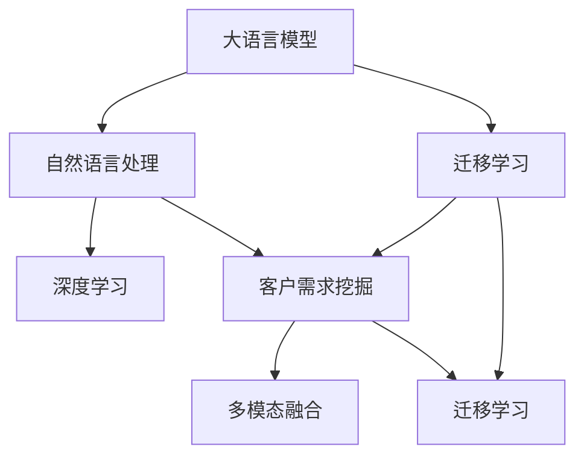

                 

# 大模型驱动的电商平台智能客户需求挖掘

> 关键词：大模型,电商平台,客户需求挖掘,自然语言处理(NLP),深度学习,多模态融合,迁移学习

## 1. 背景介绍

随着互联网的迅猛发展，电子商务已成为消费者日常购物的主要渠道之一。然而，平台上的海量商品信息如何更好地匹配用户需求，提升用户体验，成为电商平台亟需解决的难题。传统的方法大多依赖人工筛选、推荐引擎等手段，无法充分挖掘用户的深度需求，用户体验和转化率也无法得到进一步提升。为此，亟需一种能够自动理解用户需求的智能技术，从海量数据中抽取出用户的真实需求，实现精准推荐和个性化服务。

近年来，大语言模型在大规模预训练和下游微调上取得了显著进展，如GPT-3、BERT、T5等。这些模型在文本处理、对话生成、推荐系统等领域均有优异表现，推动了自然语言处理（NLP）和人工智能（AI）技术的快速发展。本文将探讨如何将大语言模型应用于电商平台，驱动智能客户需求挖掘，从而提升用户体验和转化率，实现电商平台的智能化转型。

## 2. 核心概念与联系

### 2.1 核心概念概述

- **大语言模型**：指通过大规模数据预训练得到的语言模型，如GPT-3、BERT、T5等，具备强大的自然语言处理能力，能够理解语义、生成文本、推理逻辑等。
- **客户需求挖掘**：指从用户行为、评价、评论、咨询等文本数据中，抽取出用户的真实需求和偏好，为个性化推荐和精准营销提供数据基础。
- **自然语言处理（NLP）**：涉及文本处理、语义理解、语言生成等技术，是深度学习在NLP领域的重要应用之一。
- **深度学习**：指通过多层神经网络模拟人类深度感知和学习的能力，在图像、语音、文本等数据上均取得了突破性进展。
- **多模态融合**：指将不同模态的数据（如文本、图像、声音等）进行融合，提升系统对多源数据的理解和处理能力。
- **迁移学习**：指将一个领域学到的知识迁移到另一个领域，利用预训练模型的知识来提升下游任务的性能。

这些概念之间通过以下Mermaid流程图联系起来：



这个流程图展示了从大语言模型到客户需求挖掘的逻辑路径。大语言模型通过深度学习技术，理解自然语言；然后通过迁移学习，将预训练知识应用于客户需求挖掘任务；最终通过多模态融合，提升对多源数据的处理能力。

## 3. 核心算法原理 & 具体操作步骤

### 3.1 算法原理概述

大语言模型驱动的电商平台客户需求挖掘，主要包括以下几个步骤：

1. **数据收集与预处理**：收集电商平台用户的历史行为数据、评价、评论、咨询等文本数据，并进行清洗、分词、去除停用词等预处理。
2. **大模型微调**：在处理好的文本数据上，使用大语言模型进行微调，使其能够理解和生成电商领域的自然语言。
3. **客户需求抽取**：通过大语言模型对用户评论、咨询等文本进行分析，抽取出用户的真实需求和偏好。
4. **多模态融合**：结合用户行为数据、商品评价、商品图片等信息，进行多模态融合，提升对用户需求的理解能力。
5. **个性化推荐**：基于用户需求，结合商品信息和库存情况，生成个性化推荐列表，提升用户体验和转化率。

### 3.2 算法步骤详解

**Step 1: 数据收集与预处理**

电商平台的数据来源主要包括：

- **行为数据**：用户在电商平台上的浏览记录、购买记录、点击记录等。
- **评价与评论**：用户在商品页面上的评价、评论等文本数据。
- **咨询与客服对话**：用户在客服聊天窗口中的咨询记录。

对这些数据进行预处理，包括：

- **清洗与去重**：去除噪音数据和重复数据。
- **分词与词性标注**：对文本数据进行分词和词性标注。
- **去除停用词**：去除常见的停用词（如“的”、“是”等）。
- **标准化处理**：统一文本格式，例如将所有商品名称统一为小写。

**Step 2: 大模型微调**

使用大语言模型进行微调的具体步骤如下：

- **选择大语言模型**：选择预训练好的大语言模型，如GPT-3、BERT等。
- **适配任务**：将原始模型适配为适合电商平台的文本处理任务，如情感分析、实体识别、关键词提取等。
- **微调超参数**：设置学习率、批大小、迭代轮数等超参数。
- **执行微调**：在准备好的数据集上进行微调训练，更新模型参数，使其适应电商平台的特定需求。

**Step 3: 客户需求抽取**

利用微调后的模型进行客户需求抽取，主要包括以下几个步骤：

- **输入文本处理**：将用户评论、咨询等文本数据输入到模型中，进行预处理。
- **特征提取**：使用预训练模型提取文本特征，如词向量、句向量等。
- **需求分类**：通过分类器对文本进行分类，抽取出用户的真实需求和偏好。
- **需求标注**：将抽取的需求进行标注，如需求类别、需求强度等。

**Step 4: 多模态融合**

将用户行为数据、商品评价、商品图片等信息进行融合，具体步骤如下：

- **特征对齐**：将不同模态的特征进行对齐，例如将文本特征与图片特征进行拼接。
- **特征融合**：使用加权平均、拼接、注意力机制等方式进行多模态特征融合。
- **需求融合**：将多模态特征进行融合，得到更加全面、准确的客户需求。

**Step 5: 个性化推荐**

基于用户需求，结合商品信息和库存情况，进行个性化推荐，具体步骤如下：

- **需求匹配**：将用户的真实需求与商品特征进行匹配，找到最符合用户需求的商品。
- **推荐排序**：根据匹配度、库存情况、价格等因素，对推荐商品进行排序。
- **推荐展示**：将推荐结果展示给用户，提升用户体验和转化率。

### 3.3 算法优缺点

大模型驱动的客户需求挖掘算法具有以下优点：

- **强大的自然语言理解能力**：通过大语言模型预训练和微调，模型能够理解电商领域特定的自然语言，提升对用户需求的理解能力。
- **多模态融合**：通过融合用户行为数据、商品评价、商品图片等信息，提升对用户需求的全面理解能力。
- **易于部署**：基于预训练模型和微调模型，可以部署在各种平台上，实现快速响应。

但该算法也存在一些缺点：

- **数据依赖**：需要大量高质量的标注数据进行微调，标注成本较高。
- **过拟合风险**：若标注数据分布不均匀，模型可能对某些类型的数据过拟合。
- **计算资源消耗高**：大语言模型需要大量的计算资源进行预训练和微调，对硬件要求较高。
- **解释性不足**：模型输出的决策过程缺乏可解释性，难以进行调试和优化。

### 3.4 算法应用领域

大模型驱动的客户需求挖掘算法在电商平台中有着广泛的应用，主要包括以下几个方面：

- **个性化推荐**：基于用户需求，生成个性化推荐列表，提升用户体验和转化率。
- **客户分析**：通过分析用户评论、咨询等数据，了解用户需求和偏好，提升用户满意度。
- **情感分析**：分析用户评论中的情感倾向，及时发现并解决用户的问题。
- **客服自动回复**：利用多模态融合技术，自动生成客服回复，提升客户服务效率。

## 4. 数学模型和公式 & 详细讲解 & 举例说明

### 4.1 数学模型构建

假设电商平台有 $N$ 个用户，每个用户有 $M$ 条评价数据，每条评价数据包含 $L$ 个词语。设 $x_i$ 为第 $i$ 个用户的第 $j$ 条评价文本，$y_i$ 为 $x_i$ 对应的需求标签，$z_i$ 为 $x_i$ 的特征向量表示。则需求抽取的数学模型可以表示为：

$$
\min_{\theta} \sum_{i=1}^N \sum_{j=1}^M \ell(\hat{y}_i, y_i; \theta)
$$

其中 $\ell$ 为损失函数，$\hat{y}_i$ 为模型预测的需求标签，$\theta$ 为模型参数。

### 4.2 公式推导过程

以二分类任务为例，假设需求分类器为线性分类器 $f(x) = \langle w, x \rangle + b$，损失函数为交叉熵损失函数，则需求抽取的公式推导如下：

1. **特征提取**：将用户评价文本 $x_i$ 转换为特征向量 $z_i$，例如使用BERT模型提取句子向量 $z_i$。
2. **需求分类**：使用线性分类器对特征向量 $z_i$ 进行分类，得到预测标签 $\hat{y}_i$。
3. **损失计算**：计算预测标签 $\hat{y}_i$ 与真实标签 $y_i$ 之间的交叉熵损失，公式如下：

$$
\ell(\hat{y}_i, y_i; \theta) = -y_i \log \sigma(\langle w, z_i \rangle + b) - (1-y_i) \log (1-\sigma(\langle w, z_i \rangle + b))
$$

其中 $\sigma$ 为sigmoid函数。

### 4.3 案例分析与讲解

以电商平台用户评论数据分析为例，假设用户对某商品进行了评价，输入评论文本为 "商品质量不错，物流速度很快，但客服服务态度一般"，模型需要抽取用户对商品的质量、物流和客服的需求。

1. **预处理**：对评论文本进行分词、去停用词、标准化处理等预处理操作。
2. **特征提取**：使用BERT模型提取评论文本的句子向量 $z_i$。
3. **需求分类**：通过线性分类器对 $z_i$ 进行分类，得到预测标签 $\hat{y}_i$。
4. **需求标注**：将预测标签 $\hat{y}_i$ 进行标注，例如 "商品质量" 的标签为 "高"，"物流速度" 的标签为 "高"，"客服服务态度" 的标签为 "中"。
5. **需求融合**：将多模态特征进行融合，例如结合用户行为数据、商品评价、商品图片等信息，得到更加全面、准确的客户需求。

## 5. 项目实践：代码实例和详细解释说明

### 5.1 开发环境搭建

在进行项目实践前，需要准备好开发环境。以下是使用Python进行PyTorch开发的环境配置流程：

1. 安装Anaconda：从官网下载并安装Anaconda，用于创建独立的Python环境。
2. 创建并激活虚拟环境：
```bash
conda create -n pytorch-env python=3.8 
conda activate pytorch-env
```
3. 安装PyTorch：根据CUDA版本，从官网获取对应的安装命令。例如：
```bash
conda install pytorch torchvision torchaudio cudatoolkit=11.1 -c pytorch -c conda-forge
```
4. 安装Transformers库：
```bash
pip install transformers
```
5. 安装各类工具包：
```bash
pip install numpy pandas scikit-learn matplotlib tqdm jupyter notebook ipython
```

完成上述步骤后，即可在`pytorch-env`环境中开始项目实践。

### 5.2 源代码详细实现

下面我们以客户需求抽取为例，给出使用Transformers库对BERT模型进行微调的PyTorch代码实现。

首先，定义客户需求抽取的函数：

```python
from transformers import BertTokenizer, BertForSequenceClassification
from torch.utils.data import Dataset
import torch

class CustomerRequestDataset(Dataset):
    def __init__(self, texts, labels, tokenizer, max_len=128):
        self.texts = texts
        self.labels = labels
        self.tokenizer = tokenizer
        self.max_len = max_len
        
    def __len__(self):
        return len(self.texts)
    
    def __getitem__(self, item):
        text = self.texts[item]
        label = self.labels[item]
        
        encoding = self.tokenizer(text, return_tensors='pt', max_length=self.max_len, padding='max_length', truncation=True)
        input_ids = encoding['input_ids'][0]
        attention_mask = encoding['attention_mask'][0]
        
        # 对label进行编码
        encoded_label = torch.tensor([label], dtype=torch.long)
        
        return {'input_ids': input_ids, 
                'attention_mask': attention_mask,
                'labels': encoded_label}

# 标签与id的映射
label2id = {'商品质量': 0, '物流速度': 1, '客服服务态度': 2}
id2label = {v: k for k, v in label2id.items()}

# 创建dataset
tokenizer = BertTokenizer.from_pretrained('bert-base-cased')

train_dataset = CustomerRequestDataset(train_texts, train_labels, tokenizer)
dev_dataset = CustomerRequestDataset(dev_texts, dev_labels, tokenizer)
test_dataset = CustomerRequestDataset(test_texts, test_labels, tokenizer)
```

然后，定义模型和优化器：

```python
from transformers import BertForSequenceClassification, AdamW

model = BertForSequenceClassification.from_pretrained('bert-base-cased', num_labels=len(label2id))

optimizer = AdamW(model.parameters(), lr=2e-5)
```

接着，定义训练和评估函数：

```python
from torch.utils.data import DataLoader
from tqdm import tqdm
from sklearn.metrics import accuracy_score, precision_score, recall_score, f1_score

device = torch.device('cuda') if torch.cuda.is_available() else torch.device('cpu')
model.to(device)

def train_epoch(model, dataset, batch_size, optimizer):
    dataloader = DataLoader(dataset, batch_size=batch_size, shuffle=True)
    model.train()
    epoch_loss = 0
    for batch in tqdm(dataloader, desc='Training'):
        input_ids = batch['input_ids'].to(device)
        attention_mask = batch['attention_mask'].to(device)
        labels = batch['labels'].to(device)
        model.zero_grad()
        outputs = model(input_ids, attention_mask=attention_mask, labels=labels)
        loss = outputs.loss
        epoch_loss += loss.item()
        loss.backward()
        optimizer.step()
    return epoch_loss / len(dataloader)

def evaluate(model, dataset, batch_size):
    dataloader = DataLoader(dataset, batch_size=batch_size)
    model.eval()
    preds, labels = [], []
    with torch.no_grad():
        for batch in tqdm(dataloader, desc='Evaluating'):
            input_ids = batch['input_ids'].to(device)
            attention_mask = batch['attention_mask'].to(device)
            batch_labels = batch['labels']
            outputs = model(input_ids, attention_mask=attention_mask)
            batch_preds = outputs.logits.argmax(dim=1).to('cpu').tolist()
            batch_labels = batch_labels.to('cpu').tolist()
            for pred, label in zip(batch_preds, batch_labels):
                preds.append(pred)
                labels.append(label)
                
    print('Accuracy:', accuracy_score(labels, preds))
    print('Precision:', precision_score(labels, preds, average='weighted'))
    print('Recall:', recall_score(labels, preds, average='weighted'))
    print('F1 Score:', f1_score(labels, preds, average='weighted'))

# 训练模型
epochs = 5
batch_size = 16

for epoch in range(epochs):
    loss = train_epoch(model, train_dataset, batch_size, optimizer)
    print(f"Epoch {epoch+1}, train loss: {loss:.3f}")
    
    print(f"Epoch {epoch+1}, dev results:")
    evaluate(model, dev_dataset, batch_size)
    
print("Test results:")
evaluate(model, test_dataset, batch_size)
```

以上就是使用PyTorch对BERT进行客户需求抽取任务的微调代码实现。可以看到，得益于Transformers库的强大封装，我们可以用相对简洁的代码完成BERT模型的加载和微调。

### 5.3 代码解读与分析

让我们再详细解读一下关键代码的实现细节：

**CustomerRequestDataset类**：
- `__init__`方法：初始化文本、标签、分词器等关键组件。
- `__len__`方法：返回数据集的样本数量。
- `__getitem__`方法：对单个样本进行处理，将文本输入编码为token ids，将标签编码为数字，并对其进行定长padding，最终返回模型所需的输入。

**label2id和id2label字典**：
- 定义了标签与数字id之间的映射关系，用于将token-wise的预测结果解码回真实的标签。

**训练和评估函数**：
- 使用PyTorch的DataLoader对数据集进行批次化加载，供模型训练和推理使用。
- 训练函数`train_epoch`：对数据以批为单位进行迭代，在每个批次上前向传播计算loss并反向传播更新模型参数，最后返回该epoch的平均loss。
- 评估函数`evaluate`：与训练类似，不同点在于不更新模型参数，并在每个batch结束后将预测和标签结果存储下来，最后使用sklearn的指标对整个评估集的预测结果进行打印输出。

**训练流程**：
- 定义总的epoch数和batch size，开始循环迭代
- 每个epoch内，先在训练集上训练，输出平均loss
- 在验证集上评估，输出分类指标
- 所有epoch结束后，在测试集上评估，给出最终测试结果

可以看到，PyTorch配合Transformers库使得BERT微调的代码实现变得简洁高效。开发者可以将更多精力放在数据处理、模型改进等高层逻辑上，而不必过多关注底层的实现细节。

当然，工业级的系统实现还需考虑更多因素，如模型的保存和部署、超参数的自动搜索、更灵活的任务适配层等。但核心的微调范式基本与此类似。

## 6. 实际应用场景

### 6.1 智能客服系统

基于大语言模型微调的智能客服系统，能够快速响应客户咨询，用自然流畅的语言解答各类常见问题，极大提升了客服效率和客户满意度。

在技术实现上，可以收集企业内部的历史客服对话记录，将问题和最佳答复构建成监督数据，在此基础上对预训练客服模型进行微调。微调后的模型能够自动理解用户意图，匹配最合适的答案模板进行回复。对于客户提出的新问题，还可以接入检索系统实时搜索相关内容，动态组织生成回答。如此构建的智能客服系统，能大幅提升客户咨询体验和问题解决效率。

### 6.2 金融舆情监测

金融机构需要实时监测市场舆论动向，以便及时应对负面信息传播，规避金融风险。基于大语言模型微调的文本分类和情感分析技术，为金融舆情监测提供了新的解决方案。

具体而言，可以收集金融领域相关的新闻、报道、评论等文本数据，并对其进行主题标注和情感标注。在此基础上对预训练语言模型进行微调，使其能够自动判断文本属于何种主题，情感倾向是正面、中性还是负面。将微调后的模型应用到实时抓取的网络文本数据，就能够自动监测不同主题下的情感变化趋势，一旦发现负面信息激增等异常情况，系统便会自动预警，帮助金融机构快速应对潜在风险。

### 6.3 个性化推荐系统

当前的推荐系统往往只依赖用户的历史行为数据进行物品推荐，无法深入理解用户的真实兴趣偏好。基于大语言模型微调技术，个性化推荐系统可以更好地挖掘用户行为背后的语义信息，从而提供更精准、多样的推荐内容。

在实践中，可以收集用户浏览、点击、评论、分享等行为数据，提取和用户交互的物品标题、描述、标签等文本内容。将文本内容作为模型输入，用户的后续行为（如是否点击、购买等）作为监督信号，在此基础上微调预训练语言模型。微调后的模型能够从文本内容中准确把握用户的兴趣点。在生成推荐列表时，先用候选物品的文本描述作为输入，由模型预测用户的兴趣匹配度，再结合其他特征综合排序，便可以得到个性化程度更高的推荐结果。

### 6.4 未来应用展望

随着大语言模型微调技术的发展，其在电商平台中的应用将越来越广泛，推动电商平台的智能化转型。未来，大模型驱动的客户需求挖掘技术将在以下领域得到更深入的应用：

- **动态定价**：结合用户需求和市场情况，实时调整商品价格，提升销量和利润。
- **库存管理**：预测用户需求，优化商品库存，减少缺货和积压。
- **广告投放**：精准定位用户需求，优化广告投放策略，提高广告效果和ROI。
- **运营优化**：分析用户行为，提升用户体验和平台粘性。

此外，大语言模型微调还将与其他人工智能技术进行更深入的融合，如知识表示、因果推理、强化学习等，多路径协同发力，共同推动电商平台的智能化进程。

## 7. 工具和资源推荐

### 7.1 学习资源推荐

为了帮助开发者系统掌握大语言模型微调的理论基础和实践技巧，这里推荐一些优质的学习资源：

1. 《Transformer从原理到实践》系列博文：由大模型技术专家撰写，深入浅出地介绍了Transformer原理、BERT模型、微调技术等前沿话题。

2. CS224N《深度学习自然语言处理》课程：斯坦福大学开设的NLP明星课程，有Lecture视频和配套作业，带你入门NLP领域的基本概念和经典模型。

3. 《Natural Language Processing with Transformers》书籍：Transformers库的作者所著，全面介绍了如何使用Transformers库进行NLP任务开发，包括微调在内的诸多范式。

4. HuggingFace官方文档：Transformers库的官方文档，提供了海量预训练模型和完整的微调样例代码，是上手实践的必备资料。

5. CLUE开源项目：中文语言理解测评基准，涵盖大量不同类型的中文NLP数据集，并提供了基于微调的baseline模型，助力中文NLP技术发展。

通过对这些资源的学习实践，相信你一定能够快速掌握大语言模型微调的精髓，并用于解决实际的NLP问题。

### 7.2 开发工具推荐

高效的开发离不开优秀的工具支持。以下是几款用于大语言模型微调开发的常用工具：

1. PyTorch：基于Python的开源深度学习框架，灵活动态的计算图，适合快速迭代研究。大部分预训练语言模型都有PyTorch版本的实现。

2. TensorFlow：由Google主导开发的开源深度学习框架，生产部署方便，适合大规模工程应用。同样有丰富的预训练语言模型资源。

3. Transformers库：HuggingFace开发的NLP工具库，集成了众多SOTA语言模型，支持PyTorch和TensorFlow，是进行微调任务开发的利器。

4. Weights & Biases：模型训练的实验跟踪工具，可以记录和可视化模型训练过程中的各项指标，方便对比和调优。与主流深度学习框架无缝集成。

5. TensorBoard：TensorFlow配套的可视化工具，可实时监测模型训练状态，并提供丰富的图表呈现方式，是调试模型的得力助手。

6. Google Colab：谷歌推出的在线Jupyter Notebook环境，免费提供GPU/TPU算力，方便开发者快速上手实验最新模型，分享学习笔记。

合理利用这些工具，可以显著提升大语言模型微调的开发效率，加快创新迭代的步伐。

### 7.3 相关论文推荐

大语言模型和微调技术的发展源于学界的持续研究。以下是几篇奠基性的相关论文，推荐阅读：

1. Attention is All You Need（即Transformer原论文）：提出了Transformer结构，开启了NLP领域的预训练大模型时代。

2. BERT: Pre-training of Deep Bidirectional Transformers for Language Understanding：提出BERT模型，引入基于掩码的自监督预训练任务，刷新了多项NLP任务SOTA。

3. Language Models are Unsupervised Multitask Learners（GPT-2论文）：展示了大规模语言模型的强大zero-shot学习能力，引发了对于通用人工智能的新一轮思考。

4. Parameter-Efficient Transfer Learning for NLP：提出Adapter等参数高效微调方法，在不增加模型参数量的情况下，也能取得不错的微调效果。

5. Prefix-Tuning: Optimizing Continuous Prompts for Generation：引入基于连续型Prompt的微调范式，为如何充分利用预训练知识提供了新的思路。

6. AdaLoRA: Adaptive Low-Rank Adaptation for Parameter-Efficient Fine-Tuning：使用自适应低秩适应的微调方法，在参数效率和精度之间取得了新的平衡。

这些论文代表了大语言模型微调技术的发展脉络。通过学习这些前沿成果，可以帮助研究者把握学科前进方向，激发更多的创新灵感。

## 8. 总结：未来发展趋势与挑战

### 8.1 总结

本文对基于大语言模型的电商平台智能客户需求挖掘方法进行了全面系统的介绍。首先阐述了电商平台的客户需求挖掘背景和挑战，明确了基于大模型微调方法的独特价值。其次，从原理到实践，详细讲解了电商领域微调的数学原理和关键步骤，给出了微调任务开发的完整代码实例。同时，本文还广泛探讨了微调方法在智能客服、金融舆情、个性化推荐等多个电商场景中的应用前景，展示了微调范式的巨大潜力。此外，本文精选了微调技术的各类学习资源，力求为读者提供全方位的技术指引。

通过本文的系统梳理，可以看到，基于大语言模型的微调方法在电商平台中有着广泛的应用前景，通过理解电商场景下的需求，提升用户体验和转化率，驱动电商平台智能化转型。未来，随着大语言模型微调技术的不断进步，相信其在电商领域的应用将更加深入，为电商平台的创新迭代注入新的动力。

### 8.2 未来发展趋势

展望未来，大语言模型微调技术将呈现以下几个发展趋势：

1. **模型规模持续增大**：随着算力成本的下降和数据规模的扩张，预训练语言模型的参数量还将持续增长。超大规模语言模型蕴含的丰富语言知识，有望支撑更加复杂多变的电商需求。

2. **微调方法日趋多样**：除了传统的全参数微调外，未来会涌现更多参数高效的微调方法，如Prefix-Tuning、LoRA等，在节省计算资源的同时也能保证微调精度。

3. **持续学习成为常态**：随着数据分布的不断变化，微调模型也需要持续学习新知识以保持性能。如何在不遗忘原有知识的同时，高效吸收新样本信息，将成为重要的研究课题。

4. **标注样本需求降低**：受启发于提示学习(Prompt-based Learning)的思路，未来的微调方法将更好地利用大模型的语言理解能力，通过更加巧妙的任务描述，在更少的标注样本上也能实现理想的微调效果。

5. **多模态微调崛起**：当前的大语言模型多聚焦于文本数据，未来会进一步拓展到图像、视频、声音等多模态数据微调。多模态信息的融合，将显著提升对电商需求的全面理解能力。

6. **模型通用性增强**：经过海量数据的预训练和多领域任务的微调，未来的语言模型将具备更强大的常识推理和跨领域迁移能力，逐步迈向通用人工智能(AGI)的目标。

以上趋势凸显了大语言模型微调技术的广阔前景。这些方向的探索发展，必将进一步提升电商平台的智能化水平，为电商市场的竞争注入新的活力。

### 8.3 面临的挑战

尽管大语言模型微调技术已经取得了瞩目成就，但在迈向更加智能化、普适化应用的过程中，它仍面临着诸多挑战：

1. **标注成本瓶颈**：需要大量高质量的标注数据进行微调，标注成本较高。如何进一步降低微调对标注样本的依赖，将是一大难题。

2. **过拟合风险**：若标注数据分布不均匀，模型可能对某些类型的数据过拟合。如何在标注数据较少的情况下，提高模型泛化能力，是一个重要的研究方向。

3. **计算资源消耗高**：大语言模型需要大量的计算资源进行预训练和微调，对硬件要求较高。如何在保持模型性能的同时，降低计算资源消耗，是一个亟待解决的问题。

4. **解释性不足**：模型输出的决策过程缺乏可解释性，难以进行调试和优化。如何赋予模型更强的可解释性，将是未来的研究重点之一。

5. **安全性有待保障**：预训练语言模型难免会学习到有偏见、有害的信息，通过微调传递到电商平台上，可能带来安全隐患。如何从数据和算法层面消除模型偏见，保障模型安全性，是一个重要的研究方向。

6. **知识整合能力不足**：现有的微调模型往往局限于任务内数据，难以灵活吸收和运用更广泛的先验知识。如何让微调过程更好地与外部知识库、规则库等专家知识结合，形成更加全面、准确的信息整合能力，还有很大的想象空间。

正视微调面临的这些挑战，积极应对并寻求突破，将是大语言模型微调技术走向成熟的必由之路。相信随着学界和产业界的共同努力，这些挑战终将一一被克服，大语言模型微调必将在电商领域的应用中发挥更大的作用。

### 8.4 研究展望

面向未来，大语言模型微调技术还需要与其他人工智能技术进行更深入的融合，如知识表示、因果推理、强化学习等，多路径协同发力，共同推动电商平台的智能化进程。同时，也需要更加注重模型的可解释性、鲁棒性和安全性，确保模型的应用更加可靠和高效。

总之，大语言模型微调技术在未来电商领域的应用前景广阔，但也需要不断突破现有的技术瓶颈，推动技术向更深层次、更广领域发展。只有在技术与业务、理论与实践不断迭代优化中，才能真正实现电商平台的智能化转型，驱动电商市场的竞争和创新。

