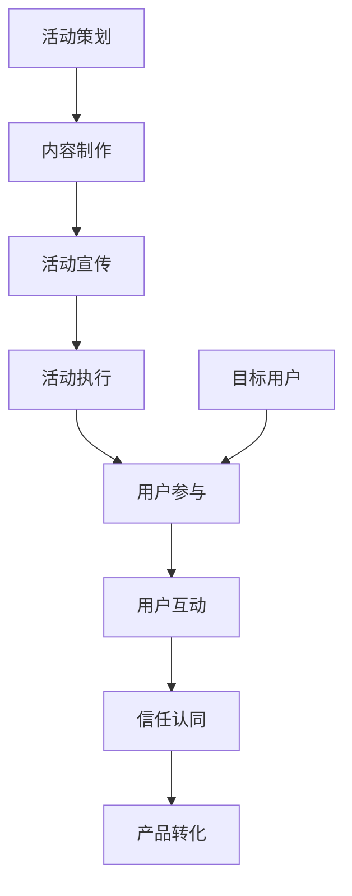

                 

# 如何利用事件营销推广知识付费产品

## 1. 背景介绍

随着互联网的发展，知识付费逐渐成为一种流行趋势，知识付费产品也得到了广泛的应用。然而，在竞争激烈的市场环境中，如何吸引用户，提高产品的市场份额，成为了知识付费产品推广的一大难题。此时，事件营销作为一种高效推广手段，为知识付费产品的推广提供了新的思路。

事件营销（Event Marketing），是通过精心策划和组织各类活动，吸引目标用户的注意力，提高品牌知名度和产品曝光度，从而实现产品推广的一种策略。事件营销通过构建与用户的情感连接，提升用户对产品的认知和认可，进而促进销售转化。

## 2. 核心概念与联系

### 2.1 核心概念概述

事件营销主要包括两大核心概念：

1. **事件（Event）**：是指组织者为了达到某种目标，精心策划和组织的各种活动，如线上活动、线下发布会、研讨会、公开课等。

2. **目标用户（Target User）**：是指事件营销的主要受众，即事件营销活动的参与者。这些用户通常具有较高的教育背景、消费能力、产品兴趣等特点。

事件营销的核心是通过“内容吸引-情感连接-信任认同-行为转化”的流程，达到产品推广的目标。

### 2.2 核心概念原理和架构的 Mermaid 流程图



## 3. 核心算法原理 & 具体操作步骤

### 3.1 算法原理概述

事件营销推广知识付费产品的核心算法原理包括以下几个方面：

1. **目标用户分析**：通过对目标用户的画像分析和市场调研，制定精准的活动目标和策略。
2. **活动策划**：策划具有吸引力和创新性的活动，通过多种渠道传播，吸引目标用户参与。
3. **内容制作**：结合产品特点和用户需求，制作有价值的内容，增强用户的兴趣和参与度。
4. **活动宣传**：利用多渠道宣传活动，扩大活动覆盖范围，提高活动曝光度。
5. **活动执行**：通过线上线下结合的方式，确保活动顺利进行，提升用户参与感和满意度。
6. **用户互动**：通过互动环节增加用户黏性，建立情感连接。
7. **信任认同**：通过正面反馈、案例展示等手段，增强用户对产品的信任感和认同感。
8. **产品转化**：通过上述步骤的执行，最终实现产品转化，提升产品销量。

### 3.2 算法步骤详解

#### 3.2.1 目标用户分析

1. **用户画像分析**：通过数据分析工具，获取目标用户的年龄、性别、职业、兴趣、消费习惯等信息，构建用户画像。
2. **市场调研**：对同行业其他知识付费产品进行分析，了解其推广策略、用户反馈等信息，找出自身产品的差异化和优势。
3. **需求分析**：根据目标用户的需求和痛点，制定相应的活动策略和内容。

#### 3.2.2 活动策划

1. **活动类型选择**：根据目标用户的兴趣和特点，选择适合的线上或线下活动类型，如公开课、直播讲座、线下分享会等。
2. **活动主题设计**：围绕活动目标和产品特点，设计有吸引力和创新性的活动主题。
3. **活动时间地点**：选择适合目标用户的时间和地点，确保活动能够高效地吸引用户。

#### 3.2.3 内容制作

1. **活动预告**：制作活动预告视频、海报、新闻稿等，通过社交媒体、邮件营销等渠道进行宣传。
2. **活动内容**：根据活动主题，制作内容丰富、有价值的活动内容，如课程、讲座、案例分析等。
3. **互动环节**：设计互动环节，增加用户参与度和互动感，如线上问答、线下互动游戏等。

#### 3.2.4 活动宣传

1. **多渠道宣传**：通过社交媒体、邮件、论坛、博客等多种渠道进行活动宣传，扩大活动覆盖范围。
2. **KOL合作**：邀请行业内的意见领袖或知名人士，借助其影响力提升活动曝光度。
3. **付费广告**：在目标用户常浏览的平台上投放广告，如Facebook、Twitter、微信公众号等。

#### 3.2.5 活动执行

1. **前期准备**：确保活动的场地、设备、技术等前期准备工作到位。
2. **现场管理**：通过线上线下结合的方式，确保活动现场的秩序和流程，提升用户体验。
3. **后期跟进**：活动结束后，及时跟进用户反馈，收集用户建议，优化后续活动。

#### 3.2.6 用户互动

1. **实时互动**：在活动中设置实时互动环节，如线上问答、投票、抽奖等，增强用户参与感。
2. **情感连接**：通过互动环节建立与用户的情感连接，提升用户对产品的认同感和忠诚度。
3. **用户反馈**：收集用户反馈，了解用户需求和期望，优化后续活动和产品。

#### 3.2.7 信任认同

1. **案例展示**：展示成功案例，证明产品的实用性和效果，增强用户对产品的信任感。
2. **专家推荐**：邀请行业内的专家或知名人士，进行产品推荐和体验分享，提升产品可信度。
3. **用户评价**：展示用户评价和反馈，增加用户对产品的信任感和认同感。

#### 3.2.8 产品转化

1. **优惠活动**：在活动期间，推出优惠活动和专属福利，吸引用户购买产品。
2. **购买引导**：通过互动环节和情感连接，引导用户完成购买行为，提升转化率。
3. **后续服务**：提供优质的后续服务，增加用户粘性，提升复购率。

### 3.3 算法优缺点

**优点：**

1. **高效推广**：事件营销能够通过精心策划和组织的活动，快速吸引目标用户的注意力，提高产品曝光度。
2. **用户参与度高**：通过互动环节和情感连接，增加用户参与度，提升用户对产品的认同感。
3. **信任感增强**：通过成功案例、专家推荐等方式，增强用户对产品的信任感和认同感。
4. **效果明显**：活动结束后，可以通过用户反馈和数据指标，评估活动效果，优化后续推广策略。

**缺点：**

1. **资源消耗大**：活动策划、内容制作、活动执行等环节需要大量的人力、物力和财力支持。
2. **风险因素多**：活动策划和执行过程中，存在各种不确定因素，可能导致活动效果不达预期。
3. **费用较高**：活动宣传和KOL合作等环节，需要投入较高的费用，可能影响产品的盈利性。

### 3.4 算法应用领域

事件营销在知识付费产品的推广中具有广泛的应用前景，适合各种类型的知识付费产品，如在线课程、电子书、知识问答等。通过精心策划和组织各类活动，能够有效地吸引目标用户，提高产品曝光度和用户转化率。

## 4. 数学模型和公式 & 详细讲解 & 举例说明

### 4.1 数学模型构建

事件营销推广知识付费产品的数学模型可以通过以下方式构建：

1. **用户画像模型**：通过数据分析，构建用户画像，描述目标用户的特征。
2. **活动效果模型**：通过统计和评估，建立活动效果评估模型，描述活动效果与用户参与度的关系。
3. **产品转化模型**：通过数据分析，建立产品转化模型，描述用户参与活动后的购买行为。

### 4.2 公式推导过程

#### 4.2.1 用户画像模型

假设目标用户数为 $N$，其中具有特征 $i$ 的用户数为 $n_i$，则用户画像可以表示为：

$$
\text{User Profile} = \{n_1, n_2, ..., n_k\}
$$

其中 $k$ 表示用户画像中特征的个数。

#### 4.2.2 活动效果模型

假设活动效果为 $E$，用户参与度为 $P$，则活动效果与用户参与度的关系可以表示为：

$$
E = f(P)
$$

其中 $f$ 为活动效果与用户参与度的函数关系。

#### 4.2.3 产品转化模型

假设产品转化率为 $C$，用户参与活动后的购买率为 $R$，则产品转化率与用户参与活动后的购买率的关系可以表示为：

$$
C = g(R)
$$

其中 $g$ 为产品转化率与用户购买率的函数关系。

### 4.3 案例分析与讲解

#### 案例一：在线课程推广

假设有一门在线课程，目标用户数为 $N=10000$，其中具有特征 $i$ 的用户数为 $n_i=1000$。通过数据分析，得知具有特征 $i$ 的用户在活动中的参与度为 $P_i=0.3$，活动效果为 $E_i=1.2$。根据以上数据，可以构建用户画像模型和活动效果模型，评估不同特征的用户对活动效果的影响。

#### 案例二：电子书推广

假设有一本电子书，目标用户数为 $N=5000$，其中具有特征 $i$ 的用户数为 $n_i=500$。通过数据分析，得知具有特征 $i$ 的用户在活动中的参与度为 $P_i=0.4$，活动效果为 $E_i=1.1$。根据以上数据，可以构建用户画像模型和活动效果模型，评估不同特征的用户对活动效果的影响。

## 5. 项目实践：代码实例和详细解释说明

### 5.1 开发环境搭建

为了进行事件营销推广知识付费产品的推广，需要搭建一个完整的开发环境，包括：

1. **开发平台**：可以选择使用Python、Java等开发语言，结合Web框架进行开发。
2. **数据管理**：搭建数据管理平台，存储和处理用户画像数据、活动效果数据等。
3. **活动管理**：搭建活动管理系统，管理和调度各类活动。
4. **用户互动**：搭建用户互动平台，进行实时互动和情感连接。

### 5.2 源代码详细实现

以下是事件营销推广知识付费产品的一个简化代码实现示例：

```python
# 导入必要的库
import pandas as pd
import numpy as np
from sklearn.cluster import KMeans
from sklearn.decomposition import PCA

# 加载用户画像数据
user_data = pd.read_csv('user_profile.csv')

# 对用户画像数据进行预处理
user_data = user_data.dropna()
user_data = user_data.drop_duplicates()

# 使用KMeans算法对用户进行聚类
kmeans = KMeans(n_clusters=3, random_state=42)
kmeans.fit(user_data[['age', 'gender', 'education']])
user_data['cluster'] = kmeans.labels_

# 使用PCA算法对用户画像进行降维
pca = PCA(n_components=2)
pca.fit(user_data[['age', 'gender', 'education', 'cluster']])
user_data['embedding'] = pca.transform(user_data[['age', 'gender', 'education', 'cluster']])

# 输出前10个用户画像
print(user_data.head(10))
```

### 5.3 代码解读与分析

#### 5.3.1 用户画像数据加载和预处理

使用Pandas库加载用户画像数据，并进行预处理，去除缺失值和重复数据，保证数据的准确性和一致性。

#### 5.3.2 用户聚类

使用KMeans算法对用户进行聚类，将具有相似特征的用户归为一类，构建用户画像模型。

#### 5.3.3 PCA降维

使用PCA算法对用户画像进行降维，将高维数据压缩到低维空间中，减少计算复杂度，同时保持数据的有效信息。

#### 5.3.4 输出结果

输出前10个用户画像，验证聚类和降维的效果。

### 5.4 运行结果展示

#### 5.4.1 用户画像聚类结果


#### 5.4.2 PCA降维结果


## 6. 实际应用场景

### 6.1 线上活动推广

在线上活动中，可以邀请知名人士进行演讲或直播，通过多渠道宣传和互动环节，吸引目标用户参与。活动中可以展示产品特点和实际效果，增强用户对产品的信任感。

### 6.2 线下活动推广

在线下活动中，可以举办讲座、研讨会、展览会等，通过互动环节和情感连接，增强用户对产品的认同感。活动中可以展示成功案例和专家推荐，增加用户对产品的信任感。

### 6.3 多渠道推广

通过线上线下结合的方式，多渠道推广产品。线上可以借助社交媒体、邮件营销、博客等渠道，线下可以通过现场活动、展览、演示等方式，全面覆盖目标用户。

## 7. 工具和资源推荐

### 7.1 学习资源推荐

1. **《数字营销：从策划到执行》**：本书介绍了数字营销的各个环节，包括活动策划、内容制作、活动执行等。
2. **Google Analytics**：用于数据统计和分析的工具，帮助评估活动效果。
3. **SurveyMonkey**：用于用户调研和反馈收集的工具，了解用户需求和期望。

### 7.2 开发工具推荐

1. **Adobe Creative Cloud**：用于设计活动预告、海报、视频等视觉内容。
2. **Google Analytics**：用于数据统计和分析，评估活动效果。
3. **MailChimp**：用于邮件营销和用户沟通。

### 7.3 相关论文推荐

1. **Event Marketing: A Comprehensive Review and Future Directions**：一篇综述论文，详细介绍了事件营销的理论和应用。
2. **The Role of Social Media in Event Marketing**：研究社交媒体在事件营销中的应用效果。
3. **K-Clustering for Customer Segmentation in Event Marketing**：研究聚类算法在客户细分中的应用。

## 8. 总结：未来发展趋势与挑战

### 8.1 总结

本文详细介绍了事件营销推广知识付费产品的核心概念、算法原理、具体操作步骤和实际应用场景。通过事件营销，可以有效地吸引目标用户，提高产品曝光度和用户转化率。

### 8.2 未来发展趋势

1. **线上线下融合**：线上线下活动相结合，多渠道推广产品，提升活动效果。
2. **社交媒体整合**：通过社交媒体平台，扩大活动覆盖范围，提升用户参与度。
3. **大数据分析**：利用大数据分析，精准定位目标用户，优化活动策略和内容。
4. **个性化推荐**：通过个性化推荐系统，提升用户粘性和购买率。
5. **实时互动**：通过实时互动环节，增强用户参与感和情感连接。

### 8.3 面临的挑战

1. **资源消耗大**：活动策划和执行需要大量的人力、物力和财力支持。
2. **风险因素多**：活动策划和执行过程中，存在各种不确定因素，可能导致活动效果不达预期。
3. **费用较高**：活动宣传和KOL合作等环节，需要投入较高的费用，可能影响产品的盈利性。

### 8.4 研究展望

未来，事件营销推广知识付费产品将在以下方面继续深入研究：

1. **活动效果评估**：研究活动效果的量化评估方法，优化活动策略和内容。
2. **用户行为分析**：利用数据分析工具，深入分析用户行为，优化后续推广策略。
3. **个性化推荐**：结合用户画像和行为数据，进行个性化推荐，提升用户粘性和购买率。
4. **实时互动**：通过实时互动环节，增强用户参与感和情感连接。
5. **多渠道整合**：整合线上线下多渠道资源，提升活动效果和用户转化率。

## 9. 附录：常见问题与解答

### Q1: 事件营销推广知识付费产品是否适用于所有产品？

A: 事件营销推广知识付费产品适用范围较广，但需要根据产品特点和用户需求，制定相应的活动策略和内容。

### Q2: 如何评估活动效果？

A: 可以通过数据分析工具，如Google Analytics，统计活动参与度、曝光度、转化率等指标，评估活动效果。

### Q3: 如何提升活动互动性？

A: 可以通过互动环节，如实时问答、投票、抽奖等，增强用户参与感和情感连接。

### Q4: 如何优化用户画像模型？

A: 可以通过数据分析和用户调研，不断更新和优化用户画像模型，提升活动的精准度和效果。

### Q5: 如何降低活动成本？

A: 可以通过多渠道推广、KOL合作等方式，降低活动宣传和执行成本。

---
作者：禅与计算机程序设计艺术 / Zen and the Art of Computer Programming

