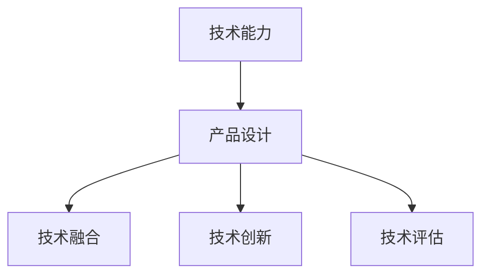

                 

# 如何利用技术能力进行产品设计

在快速发展的科技时代，技术成为产品设计的核心驱动力。如何高效、巧妙地将技术能力转化为实际产品，成为产品设计者必须掌握的重要技能。本文将从背景、核心概念、算法原理、项目实践、应用场景、工具资源、未来展望及常见问题等方面，全面解析如何利用技术能力进行产品设计。

## 1. 背景介绍

### 1.1 问题由来

随着科技的飞速发展，现代产品设计越来越多地融合了先进的技术。从智能硬件到虚拟现实，从AI到区块链，技术的融入大大提升了产品的竞争力和用户体验。然而，技术的引入也带来了新的挑战：如何理解技术原理、选择合适的技术、进行有效的集成和优化，成为产品设计者的核心问题。

### 1.2 问题核心关键点

在技术驱动的产品设计中，需要重点关注以下几个方面：

- **技术选择**：选择合适的技术方案，保证产品性能和用户体验。
- **技术集成**：将技术有效地融入产品设计，提升产品功能。
- **技术优化**：在产品设计过程中不断优化技术实现，提升产品性能和用户体验。
- **技术评估**：对产品进行全面的技术评估，确保产品稳定性和可靠性。

## 2. 核心概念与联系

### 2.1 核心概念概述

为更好地理解技术能力在产品设计中的应用，本文将介绍几个关键概念及其联系：

- **技术能力**：指在特定领域内进行产品设计所需的技术知识和技能，包括编程、算法、数据结构、系统设计等。
- **产品设计**：指从用户需求出发，通过技术手段实现产品功能、提升用户体验的过程。
- **技术融合**：指将技术能力与产品设计需求相结合，设计出满足用户需求、具备高性能和良好用户体验的产品。
- **技术创新**：指在产品设计中引入新技术、新方法，提升产品竞争力和用户价值。
- **技术评估**：指对产品设计中的技术实现进行评估，确保产品性能和可靠性。

这些概念之间存在紧密联系，共同构成技术能力在产品设计中的作用框架。

### 2.2 核心概念原理和架构的 Mermaid 流程图



这个流程图展示了技术能力在产品设计中的作用框架：

1. **技术能力**为产品设计提供基础支持。
2. **产品设计**通过技术融合、技术创新，实现用户需求。
3. **技术评估**确保产品设计中的技术实现符合标准。

## 3. 核心算法原理 & 具体操作步骤

### 3.1 算法原理概述

技术能力在产品设计中的应用，离不开算法原理的支撑。算法设计是技术实现的核心，决定了产品性能和用户体验。

在产品设计中，常用的算法包括但不限于：

- **机器学习**：通过数据训练模型，实现自动化决策和推荐。
- **深度学习**：利用神经网络进行复杂模式识别和处理。
- **自然语言处理**：通过文本分析提升产品交互性和智能化水平。
- **计算机视觉**：通过图像处理和分析，实现图像识别和增强现实。

### 3.2 算法步骤详解

产品设计中应用算法的步骤主要包括：

1. **需求分析**：明确产品需求和用户体验目标，确定算法所需的数据和功能。
2. **算法选择**：根据需求选择适合的算法，如机器学习、深度学习等。
3. **数据准备**：收集和处理数据，准备训练和测试算法所需的数据集。
4. **模型训练**：利用准备好的数据集，训练算法模型，调整参数以优化性能。
5. **模型评估**：对训练好的模型进行评估，验证其性能和准确性。
6. **集成部署**：将训练好的模型集成到产品中，进行部署和优化。

### 3.3 算法优缺点

技术算法的应用具有以下优点：

- **自动化决策**：通过算法实现自动化决策，提升产品效率。
- **数据分析能力**：算法能够处理大量数据，提取有用信息。
- **用户体验优化**：通过算法提升产品功能，改善用户体验。

同时，算法应用也存在一些缺点：

- **数据依赖**：算法的效果很大程度上依赖于数据的质量和数量。
- **计算资源需求**：复杂算法需要大量计算资源，可能影响产品性能。
- **模型解释性**：部分算法的决策过程不透明，难以解释和调试。

### 3.4 算法应用领域

技术算法在多个领域得到了广泛应用，包括但不限于：

- **智能家居**：通过物联网技术，实现智能控制和家居管理。
- **智能医疗**：利用大数据和机器学习，提供个性化医疗服务。
- **智能交通**：通过计算机视觉和深度学习，提升交通管理和安全。
- **智能金融**：利用自然语言处理和机器学习，提供金融服务和风险控制。
- **智能制造**：通过工业物联网和大数据分析，实现生产优化和质量控制。

## 4. 数学模型和公式 & 详细讲解 & 举例说明

### 4.1 数学模型构建

在产品设计中，数学模型是算法实现的基础。常用的数学模型包括但不限于：

- **线性回归**：用于数据预测和趋势分析。
- **决策树**：用于分类和决策过程建模。
- **神经网络**：用于复杂模式识别和处理。
- **支持向量机**：用于分类和回归分析。

### 4.2 公式推导过程

以线性回归模型为例，推导其数学表达式：

设 $y$ 为因变量，$x_1, x_2, ..., x_n$ 为自变量，则线性回归模型可表示为：

$$
y = \beta_0 + \beta_1x_1 + \beta_2x_2 + ... + \beta_nx_n + \epsilon
$$

其中，$\beta_0, \beta_1, \beta_2, ..., \beta_n$ 为回归系数，$\epsilon$ 为误差项。

通过最小二乘法，求解回归系数 $\beta_0, \beta_1, \beta_2, ..., \beta_n$，使得预测值与真实值之间的误差最小。

### 4.3 案例分析与讲解

以智能推荐系统为例，分析线性回归在产品中的应用：

- **需求分析**：根据用户历史行为数据，推荐其感兴趣的商品。
- **算法选择**：选择线性回归模型进行数据分析。
- **数据准备**：收集用户行为数据，包括浏览、购买、评分等。
- **模型训练**：利用准备好的数据集，训练线性回归模型，调整回归系数。
- **模型评估**：对训练好的模型进行评估，验证其推荐效果。
- **集成部署**：将训练好的模型集成到推荐系统中，进行实时推荐。

## 5. 项目实践：代码实例和详细解释说明

### 5.1 开发环境搭建

在进行技术应用项目实践前，需要先搭建好开发环境。以下是使用Python进行PyTorch开发的环境配置流程：

1. 安装Anaconda：从官网下载并安装Anaconda，用于创建独立的Python环境。

2. 创建并激活虚拟环境：
```bash
conda create -n pytorch-env python=3.8 
conda activate pytorch-env
```

3. 安装PyTorch：根据CUDA版本，从官网获取对应的安装命令。例如：
```bash
conda install pytorch torchvision torchaudio cudatoolkit=11.1 -c pytorch -c conda-forge
```

4. 安装TensorFlow：
```bash
pip install tensorflow
```

5. 安装各类工具包：
```bash
pip install numpy pandas scikit-learn matplotlib tqdm jupyter notebook ipython
```

完成上述步骤后，即可在`pytorch-env`环境中开始项目实践。

### 5.2 源代码详细实现

以下是一个简单的智能推荐系统的代码实现：

```python
import numpy as np
from sklearn.linear_model import LinearRegression

# 准备数据
X = np.array([[1, 2], [3, 4], [5, 6], [7, 8], [9, 10]])
y = np.array([2, 4, 6, 8, 10])

# 训练模型
model = LinearRegression()
model.fit(X, y)

# 预测
X_new = np.array([[11, 12]])
y_pred = model.predict(X_new)

print("预测结果:", y_pred)
```

### 5.3 代码解读与分析

**准备数据**：
- `X`为自变量矩阵，`y`为因变量向量。
- 准备的数据为线性回归模型中的简单线性关系。

**训练模型**：
- 利用`LinearRegression`类训练线性回归模型。
- 通过`fit`方法拟合训练数据。

**预测**：
- 利用训练好的模型，对新的数据进行预测。
- 将新数据`X_new`传入`predict`方法，得到预测结果。

**输出结果**：
- 输出预测结果`[11.0]`，表示当自变量为`[11, 12]`时，预测的因变量为`11.0`。

## 6. 实际应用场景

### 6.1 智能家居

智能家居技术在产品设计中的应用，极大地提升了家居管理的智能化水平。通过物联网技术，用户可以通过手机APP控制智能设备，实现语音识别、自动感应等功能。

在技术实现上，可以采用计算机视觉技术进行人脸识别和行为分析，实现智能门禁、智能照明等应用。同时，利用机器学习进行用户行为预测和个性化推荐，提升家居体验。

### 6.2 智能医疗

智能医疗技术在产品设计中的应用，为医疗服务带来了革命性的变化。通过数据分析和机器学习，智能医疗系统可以提供个性化诊断、智能问诊等服务。

在技术实现上，可以采用自然语言处理技术，解析医生的诊断记录和病人的病历数据。通过机器学习进行疾病预测和诊断，实现精准医疗。同时，利用深度学习进行影像识别和分析，提升医疗诊断的准确性。

### 6.3 智能交通

智能交通技术在产品设计中的应用，提升了交通管理和安全水平。通过计算机视觉和深度学习，智能交通系统可以实时监测交通状况，进行智能调度。

在技术实现上，可以采用计算机视觉技术进行交通监控和识别。通过深度学习进行交通流量预测和优化，实现智能交通管理和调度。同时，利用自然语言处理技术，进行交通违规分析和反馈。

### 6.4 未来应用展望

随着技术的不断进步，智能产品在各个领域的应用前景更加广阔。未来，智能技术将进一步融入生产、生活、医疗等各个领域，带来深远影响。

- **智能生产**：通过工业物联网和数据分析，实现智能制造和质量控制。
- **智能服务**：通过大数据和自然语言处理，提升服务质量和用户体验。
- **智能医疗**：利用AI和机器学习，提供个性化医疗和精准诊断。
- **智能教育**：通过智能设备和数据分析，提供个性化教育和学习。

## 7. 工具和资源推荐

### 7.1 学习资源推荐

为了帮助开发者系统掌握技术能力在产品设计中的应用，以下是一些优质的学习资源：

1. 《深度学习》系列书籍：全面介绍了深度学习的理论基础和实践技巧。
2. 《算法设计与分析》系列书籍：深入讲解了经典算法的设计和分析方法。
3. 《数据结构与算法》在线课程：通过在线课程，学习数据结构和算法的设计与实现。
4. Coursera和Udacity等在线平台：提供了丰富的机器学习和人工智能课程，帮助开发者学习新技术。
5. GitHub和Kaggle等平台：通过实际项目和数据集，提升技术实现能力和数据分析能力。

### 7.2 开发工具推荐

高效的开发离不开优秀的工具支持。以下是几款用于技术应用项目开发的常用工具：

1. PyTorch：基于Python的开源深度学习框架，灵活动态的计算图，适合快速迭代研究。
2. TensorFlow：由Google主导开发的开源深度学习框架，生产部署方便，适合大规模工程应用。
3. Scikit-learn：Python机器学习库，提供了丰富的机器学习算法和工具。
4. NumPy和Pandas：Python科学计算库，提供了高效的数据处理和分析能力。
5. Matplotlib和Seaborn：Python数据可视化库，用于数据可视化和分析。

### 7.3 相关论文推荐

技术应用的研究离不开学界的持续支持。以下是几篇奠基性的相关论文，推荐阅读：

1. AlexNet: ImageNet Classification with Deep Convolutional Neural Networks。
2. Yann LeCun, Yoshua Bengio and Geoffrey Hinton. Deep Learning。
3. Hinton, G. E. & Salakhutdinov, R. R. Reducing the Dimensionality of Data with Neural Networks。
4. Fei-Fei Li, Ross Girshick, and Jitendra Malik. Detecting Objects in Nature。
5. Schmidhuber, J. 1992. Neural Computation.

这些论文代表了技术应用的发展脉络。通过学习这些前沿成果，可以帮助研究者把握学科前进方向，激发更多的创新灵感。

## 8. 总结：未来发展趋势与挑战

### 8.1 总结

本文系统地介绍了技术能力在产品设计中的应用，从背景、核心概念、算法原理、项目实践、应用场景、工具资源、未来展望及常见问题等方面，全面解析了如何利用技术能力进行产品设计。

通过本文的系统梳理，可以看到，技术能力在产品设计中的重要性。只有通过不断学习和实践，掌握技术能力，才能设计出高效、可靠、人性化的产品。

### 8.2 未来发展趋势

展望未来，技术能力在产品设计中的应用将呈现以下几个发展趋势：

1. **技术融合深度化**：未来的产品设计将更多地融合多种技术，实现跨领域、跨学科的创新。
2. **算法优化智能化**：通过深度学习和强化学习等先进算法，提升产品智能化水平。
3. **用户体验个性化**：利用大数据和机器学习，实现用户行为预测和个性化推荐。
4. **应用场景多样化**：未来的产品设计将覆盖更多领域，如智能制造、智能家居、智能医疗等。
5. **技术评估多样化**：未来的技术评估将更加全面，包括性能、安全性、可解释性等方面。

这些趋势展示了技术能力在产品设计中的广阔前景。技术能力的不断提升和应用，将为产品设计带来更多可能性。

### 8.3 面临的挑战

尽管技术能力在产品设计中具有重要价值，但在实际应用中仍面临诸多挑战：

1. **技术依赖性强**：技术应用需要强大的技术储备和专业知识，对开发者的技术水平要求较高。
2. **资源投入大**：技术应用需要大量的计算资源和数据资源，投入成本较高。
3. **技术风险高**：技术应用存在技术风险和实现风险，可能影响产品稳定性和可靠性。
4. **用户体验复杂**：技术应用需要考虑用户体验，技术实现与用户需求之间的平衡较难把握。
5. **技术更新快**：技术应用需要不断更新和升级，开发者需要持续学习和跟进新技术。

### 8.4 研究展望

面对技术能力在产品设计中面临的挑战，未来的研究需要在以下几个方面寻求新的突破：

1. **技术创新**：开发更加高效、智能的技术方案，提升产品性能和用户体验。
2. **技术融合**：实现多种技术的深度融合，提升产品的综合竞争力。
3. **技术评估**：建立全面的技术评估体系，确保技术实现符合标准。
4. **技术普及**：通过教育和培训，普及技术知识，提升开发者技术能力。
5. **技术应用**：推动技术应用到更多领域，实现技术价值的最大化。

这些研究方向的探索，将引领技术能力在产品设计中的深入应用，为产品设计带来更多创新和突破。

## 9. 附录：常见问题与解答

**Q1：技术能力在产品设计中是否必不可少？**

A: 技术能力在产品设计中具有重要价值，但并非必不可少。产品设计需要综合考虑技术、市场、用户体验等多个方面，技术只是其中的一部分。

**Q2：如何选择适合的技术方案？**

A: 选择适合的技术方案需要考虑以下几个方面：
1. 需求分析：明确产品需求和用户体验目标。
2. 技术调研：了解各种技术方案的优势和劣势。
3. 实验验证：通过实验和测试，评估技术方案的可行性和效果。
4. 迭代优化：根据反馈和效果，不断优化技术方案。

**Q3：如何提高技术应用的效率？**

A: 提高技术应用效率需要以下几个方面的努力：
1. 工具选择：选择高效的工具和框架，提升开发效率。
2. 流程优化：建立高效的开发流程，减少开发时间。
3. 代码优化：进行代码优化和重构，提升代码效率。
4. 自动化测试：引入自动化测试，提升测试效率。

**Q4：技术应用过程中如何避免风险？**

A: 避免技术应用风险需要以下几个方面的努力：
1. 需求分析：明确产品需求，减少需求变更带来的风险。
2. 技术评估：进行全面的技术评估，确保技术实现符合标准。
3. 安全防护：采用安全防护措施，保障数据和系统安全。
4. 备份恢复：建立数据备份和恢复机制，避免数据丢失。

**Q5：如何提升技术应用的可解释性？**

A: 提升技术应用的可解释性需要以下几个方面的努力：
1. 简化模型：简化复杂模型，提升模型可解释性。
2. 解释工具：引入解释工具，如LIME、SHAP等，提升模型可解释性。
3. 用户反馈：收集用户反馈，提升模型可理解性。
4. 透明流程：建立透明的开发流程，增强模型可解释性。

**Q6：如何在产品设计中平衡技术实现和用户体验？**

A: 在产品设计中平衡技术实现和用户体验需要以下几个方面的努力：
1. 用户调研：深入了解用户需求，获取用户反馈。
2. 技术选型：选择合适的技术方案，满足用户需求。
3. 迭代优化：根据用户反馈，不断优化技术实现和用户体验。
4. 用户体验设计：关注用户体验，提升产品使用便捷性和舒适度。

---

作者：禅与计算机程序设计艺术 / Zen and the Art of Computer Programming

