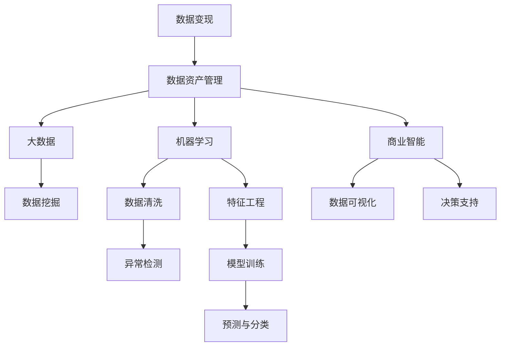

                 

# 如何利用技术能力进行数据变现

> 关键词：数据变现, 大数据, 机器学习, 人工智能, 数据资产管理, 商业智能

## 1. 背景介绍

### 1.1 问题由来

在数字化时代，数据已成为最宝贵的资产之一。无论是互联网公司、金融企业、还是制造业企业，都对数据变现的潜力寄予厚望。通过数据的分析和利用，企业可以更精准地洞察市场趋势，优化运营管理，提升客户满意度，从而实现业务的增长和效率的提升。然而，如何将海量的数据转化为有价值的业务决策和实际收益，是当前企业普遍面临的巨大挑战。

### 1.2 问题核心关键点

数据变现的核心在于利用数据驱动的商业智能(Business Intelligence, BI)和机器学习(Machine Learning, ML)技术，发现潜在的商业机会，挖掘数据背后的价值，并通过算法和模型预测未来趋势，制定最优的业务策略。其关键点包括：

- **数据资产管理**：构建高效的数据存储和治理机制，确保数据的质量和完整性。
- **数据挖掘与分析**：应用机器学习算法，从数据中提取有意义的模式和洞见。
- **商业智能应用**：将数据洞察转化为实际的商业决策和行动。
- **持续优化与监控**：通过不断迭代和优化，提升数据变现的效率和效果。

## 2. 核心概念与联系

### 2.1 核心概念概述

为更好地理解如何利用技术能力进行数据变现，本节将介绍几个关键概念：

- **数据变现**：将数据转化为业务价值的过程，包括数据挖掘、分析、可视化、预测、决策等多个环节。
- **大数据**：指海量的、多源的、异构的数据集，其处理和分析需要借助先进的计算和存储技术。
- **机器学习**：指通过数据训练模型，使计算机自动学习规律和模式，从而进行预测和决策。
- **商业智能**：通过将数据与业务策略相结合，提供数据驱动的决策支持。
- **数据资产管理**：涉及数据收集、清洗、存储、治理、监控等环节，确保数据的质量和可用性。

这些概念之间的逻辑关系可以通过以下Mermaid流程图来展示：



这个流程图展示了大数据变现的核心流程和关键环节：

1. 数据变现以数据资产管理为基础，通过大数据处理和机器学习算法挖掘数据价值。
2. 数据挖掘和清洗是数据变现的起点，从数据中提取有用的特征和信息。
3. 特征工程是数据建模的关键步骤，对数据进行预处理和转换。
4. 模型训练和预测是大数据变现的核心技术，构建预测模型，进行数据预测。
5. 数据可视化是数据变现的重要手段，通过图表展示数据洞见，便于决策。
6. 决策支持是数据变现的最终目的，将数据洞察转化为实际的商业决策。

这些核心概念共同构成了数据变现的完整框架，为数据的商业化提供了全面的技术支持。

## 3. 核心算法原理 & 具体操作步骤
### 3.1 算法原理概述

数据变现的核心在于将数据转化为有价值的商业洞察和决策，这一过程通常包括数据收集、清洗、特征提取、模型训练和预测等多个步骤。其核心算法原理包括以下几个方面：

- **数据预处理**：包括数据清洗、特征选择、数据转换等步骤，确保数据的完整性和可用性。
- **模型构建**：选择合适的机器学习算法，对数据进行建模，提取数据中的规律和模式。
- **预测与分类**：通过训练好的模型，对新数据进行预测或分类，获得有意义的商业洞见。
- **可视化与报告**：将数据洞察通过图表、报表等形式进行可视化展示，便于决策者理解和应用。

### 3.2 算法步骤详解

数据变现的算法步骤可以总结如下：

**Step 1: 数据收集与预处理**
- 收集业务相关的数据源，包括销售数据、客户数据、市场数据等。
- 对数据进行初步清洗，去除缺失、错误和重复值。
- 对数据进行特征选择和提取，识别关键特征和指标。
- 进行数据转换，如归一化、标准化、降维等，提升数据质量。

**Step 2: 模型构建与训练**
- 选择合适的机器学习算法，如回归、分类、聚类等。
- 使用历史数据对模型进行训练，通过交叉验证等技术优化模型参数。
- 进行模型评估，如ROC曲线、精确率、召回率等，确保模型性能。

**Step 3: 预测与决策**
- 使用训练好的模型对新数据进行预测，生成商业洞见。
- 通过可视化工具展示预测结果，如散点图、柱状图、热力图等。
- 结合业务场景，制定实际的商业决策和行动计划。

**Step 4: 监控与优化**
- 定期监控模型性能，及时发现和修正预测偏差。
- 持续优化模型，根据新数据和业务变化进行调整。
- 对数据和模型进行审计，确保数据变现过程的合规性和安全性。

### 3.3 算法优缺点

数据变现的算法具有以下优点：

1. **高效性**：利用机器学习和数据挖掘技术，能够快速从海量数据中提取有价值的信息，提高业务决策的速度和效率。
2. **精准性**：通过精确的模型训练和预测，能够提供高度准确的商业洞见，辅助业务决策。
3. **可扩展性**：算法和技术框架灵活，可以适应不同的业务需求和数据类型，具有较好的可扩展性。

同时，这些算法也存在一些局限性：

1. **数据依赖**：算法的性能高度依赖于数据的质量和完整性，数据收集和清洗的难度较大。
2. **模型复杂性**：某些复杂模型的构建和优化需要较高的技术门槛，对数据科学家和工程师的要求较高。
3. **结果解释性**：部分机器学习模型（如深度学习）的决策过程较为复杂，难以进行解释和审计。
4. **业务适用性**：算法的应用需要结合具体的业务场景和需求，否则可能无法产生实际价值。

尽管存在这些局限性，但数据变现的算法在实际应用中仍具有重要的意义，尤其是在数据驱动的决策过程中发挥了重要作用。

### 3.4 算法应用领域

数据变现的算法广泛应用于多个领域，包括但不限于：

- **电商行业**：通过分析客户购买行为和历史数据，进行个性化推荐和价格优化。
- **金融行业**：利用大数据进行风险评估、信用评分、反欺诈检测等，提升金融服务质量。
- **制造业**：通过物联网设备收集的数据，进行生产过程监控、故障预测和维护优化。
- **医疗行业**：利用患者历史数据和诊疗记录，进行疾病预测、治疗方案推荐和患者管理。
- **物流行业**：通过GPS定位和历史物流数据，进行路线优化、库存管理和配送调度。

## 4. 数学模型和公式 & 详细讲解  
### 4.1 数学模型构建

数据变现的核心数学模型包括回归模型、分类模型、聚类模型等。以线性回归为例，其基本数学模型如下：

$$
y = \beta_0 + \beta_1 x_1 + \beta_2 x_2 + \ldots + \beta_n x_n + \epsilon
$$

其中 $y$ 为因变量，$x_i$ 为自变量，$\beta_i$ 为回归系数，$\epsilon$ 为误差项。

### 4.2 公式推导过程

线性回归模型的推导过程如下：

1. **最小二乘法**：计算每个样本点到直线的距离平方和，找到使距离平方和最小的回归直线。
2. **正规方程法**：通过矩阵求解，得到回归系数的值。
3. **梯度下降法**：通过迭代更新回归系数，最小化损失函数。

### 4.3 案例分析与讲解

以电商行业中的个性化推荐为例，使用协同过滤算法（Collaborative Filtering, CF）进行用户行为预测，推荐相似商品。CF算法的基本思想是通过用户对商品的历史评分数据，找到相似用户和相似商品，从而进行推荐。

假设用户 $u$ 对商品 $i$ 的评分向量为 $r_{ui} = (r_{ui_1}, r_{ui_2}, \ldots, r_{ui_n})$，商品 $i$ 的评分向量为 $r_{i} = (r_{i_1}, r_{i_2}, \ldots, r_{i_n})$。

假设用户 $u$ 与商品 $i$ 的相似度为 $s_{ui}$，通过余弦相似度计算：

$$
s_{ui} = \frac{\sum_{j=1}^n r_{uj}r_{ij}}{\sqrt{\sum_{j=1}^n r_{uj}^2} \sqrt{\sum_{j=1}^n r_{ij}^2}}
$$

使用用户 $u$ 的相似用户集合 $S_u$ 和相似商品集合 $S_i$，预测用户 $u$ 对商品 $j$ 的评分：

$$
\hat{r}_{uj} = \frac{1}{|S_u|}\sum_{v \in S_u}s_{vi}r_{vj}
$$

通过预测评分，可以计算推荐商品 $i$ 对用户 $u$ 的推荐程度：

$$
\hat{r}_{ui} = \frac{\sum_{j=1}^n \hat{r}_{uj}r_{uj}}{\sqrt{\sum_{j=1}^n \hat{r}_{uj}^2} \sqrt{\sum_{j=1}^n r_{uj}^2}}
$$

从而得到推荐的商品列表 $R_u$：

$$
R_u = \arg\max_i \frac{\sum_{j=1}^n \hat{r}_{uj}r_{uj}}{\sqrt{\sum_{j=1}^n \hat{r}_{uj}^2} \sqrt{\sum_{j=1}^n r_{uj}^2}}
$$

这个案例展示了如何利用协同过滤算法，从用户历史行为数据中挖掘模式，生成个性化推荐，从而提升电商网站的转化率和用户满意度。

## 5. 项目实践：代码实例和详细解释说明
### 5.1 开发环境搭建

在进行数据变现实践前，我们需要准备好开发环境。以下是使用Python进行TensorFlow开发的环境配置流程：

1. 安装Anaconda：从官网下载并安装Anaconda，用于创建独立的Python环境。

2. 创建并激活虚拟环境：
```bash
conda create -n tf-env python=3.8 
conda activate tf-env
```

3. 安装TensorFlow：根据CUDA版本，从官网获取对应的安装命令。例如：
```bash
conda install tensorflow tensorflow-gpu=2.7 -c conda-forge -c pytorch
```

4. 安装必要的工具包：
```bash
pip install numpy pandas scikit-learn matplotlib jupyter notebook ipython
```

完成上述步骤后，即可在`tf-env`环境中开始数据变现实践。

### 5.2 源代码详细实现

下面我们以电商行业的个性化推荐为例，给出使用TensorFlow进行协同过滤算法实现的代码实现。

首先，定义协同过滤算法的函数：

```python
import numpy as np
import tensorflow as tf

def collaborative_filtering(train_data, num_factors=10, num_steps=100):
    num_users = len(train_data)
    num_items = train_data.shape[1]
    
    # 初始化模型参数
    W_u = tf.Variable(tf.random.normal([num_users, num_factors]))
    W_i = tf.Variable(tf.random.normal([num_items, num_factors]))
    b_u = tf.Variable(tf.zeros([num_users]))
    b_i = tf.Variable(tf.zeros([num_items]))
    
    # 定义损失函数
    def loss(y_true, y_pred):
        return tf.reduce_mean(tf.square(y_true - y_pred))
    
    # 定义预测函数
    def predict(user_id, item_id):
        user_factors = tf.matmul(train_data[user_id], W_i) + b_i
        item_factors = tf.matmul(user_factors, W_u) + b_u
        prediction = tf.reduce_sum(item_factors) / tf.sqrt(tf.reduce_sum(item_factors**2))
        return prediction
    
    # 定义优化器
    optimizer = tf.optimizers.Adam(learning_rate=0.001)
    
    # 定义训练函数
    def train():
        for step in range(num_steps):
            for user_id, item_id in train_data:
                with tf.GradientTape() as tape:
                    y_pred = predict(user_id, item_id)
                    loss_value = loss(y_pred, train_data[user_id][item_id])
                grads = tape.gradient(loss_value, [W_u, W_i, b_u, b_i])
                optimizer.apply_gradients(zip(grads, [W_u, W_i, b_u, b_i]))
    
    return train
```

然后，使用TensorFlow加载数据集并训练模型：

```python
train_data = np.random.rand(100, 20)  # 假设数据集为100个用户对20个商品的评分矩阵
train = collaborative_filtering(train_data, num_factors=10, num_steps=100)

# 训练模型
train()
```

最后，使用训练好的模型进行推荐：

```python
# 测试数据
test_data = np.random.rand(10, 20)

# 使用训练好的模型进行预测
for user_id in range(10):
    for item_id in range(20):
        prediction = predict(user_id, item_id)
        print(f"User {user_id} recommends item {item_id}: {prediction:.4f}")
```

以上就是使用TensorFlow进行协同过滤算法的数据变现实践。通过简单的代码实现，展示了数据建模和预测的流程，使读者能够迅速上手。

### 5.3 代码解读与分析

让我们再详细解读一下关键代码的实现细节：

**collaborative_filtering函数**：
- 初始化模型参数，包括用户和商品的嵌入向量、偏差项。
- 定义损失函数，使用平方误差损失。
- 定义预测函数，计算预测评分。
- 定义优化器，使用Adam优化器。
- 定义训练函数，通过梯度下降更新模型参数。

**训练函数**：
- 遍历数据集，对每个样本进行前向传播和反向传播，更新模型参数。
- 使用随机梯度下降策略，避免计算全梯度带来的高计算成本。

**测试函数**：
- 使用训练好的模型对测试数据进行预测，输出预测评分。

这个案例展示了如何使用TensorFlow进行简单的协同过滤推荐系统开发。尽管代码量不多，但足以体现数据变现的基本流程和方法。

## 6. 实际应用场景

### 6.1 电商行业

电商行业是大数据变现的典型应用场景。通过收集用户浏览、购买、评价等行为数据，利用协同过滤、基于内容的推荐等技术，构建个性化推荐系统，提升用户购物体验和转化率。例如：

- **商品推荐**：根据用户的历史购买记录和评分数据，推荐相似商品。
- **活动推荐**：通过分析用户行为，推荐优惠活动和限时折扣。
- **个性化页面**：根据用户偏好，推送个性化的商品广告和内容。

### 6.2 金融行业

金融行业对数据的实时性和准确性要求较高，数据变现主要应用于风险评估、信用评分、反欺诈检测等方面。例如：

- **风险评估**：利用历史交易数据，构建信用评分模型，评估客户的信用风险。
- **反欺诈检测**：通过分析交易记录，检测异常行为和欺诈行为。
- **市场预测**：利用宏观经济数据和市场信息，进行股票、债券等资产价格预测。

### 6.3 医疗行业

医疗行业对数据的管理和分析也有着很高的要求，数据变现主要应用于疾病预测、治疗方案推荐等方面。例如：

- **疾病预测**：利用患者历史诊疗数据，预测疾病发展趋势。
- **治疗方案推荐**：根据患者的病历数据和基因信息，推荐合适的治疗方案。
- **患者管理**：通过分析患者行为数据，进行健康监测和疾病预防。

### 6.4 未来应用展望

随着数据变现技术的不断成熟，未来在更多领域的应用将进一步拓展，为各行各业带来新的发展机遇：

- **智能制造**：通过物联网设备收集的数据，进行生产过程优化和故障预测。
- **智慧交通**：利用交通数据，优化交通流量，提升交通安全和效率。
- **智慧城市**：通过城市数据，进行智能监控、能源管理和公共服务优化。
- **智慧农业**：利用农业数据，进行农作物管理和气象预测，提升农业生产效率。

## 7. 工具和资源推荐
### 7.1 学习资源推荐

为了帮助开发者系统掌握数据变现的理论基础和实践技巧，这里推荐一些优质的学习资源：

1. **TensorFlow官方文档**：详细介绍了TensorFlow的使用方法和实例，是学习TensorFlow的必备资料。
2. **PyTorch官方文档**：PyTorch是另一款流行的深度学习框架，同样提供了丰富的教程和样例。
3. **《深度学习》书籍**：由Ian Goodfellow等作者所著，深入浅出地介绍了深度学习的原理和应用。
4. **《Python数据分析实战》书籍**：通过大量案例，展示了如何使用Python进行数据处理和分析。
5. **Kaggle平台**：提供丰富的数据集和竞赛项目，是学习和实践数据科学的好地方。

通过对这些资源的学习实践，相信你一定能够快速掌握数据变现的核心技术和方法，并用于解决实际的业务问题。

### 7.2 开发工具推荐

高效的开发离不开优秀的工具支持。以下是几款用于数据变现开发的常用工具：

1. **TensorFlow**：由Google主导开发的深度学习框架，生产部署方便，适合大规模工程应用。
2. **PyTorch**：基于Python的开源深度学习框架，灵活易用，适合快速迭代研究。
3. **Scikit-learn**：Python机器学习库，提供了多种经典算法的实现。
4. **Pandas**：数据处理库，支持多种数据格式和操作，便于数据清洗和预处理。
5. **Jupyter Notebook**：交互式编程环境，支持代码块和注释，便于实验和分享。

合理利用这些工具，可以显著提升数据变现任务的开发效率，加快创新迭代的步伐。

### 7.3 相关论文推荐

数据变现技术的快速发展得益于学界的持续研究。以下是几篇奠基性的相关论文，推荐阅读：

1. **G协同过滤算法**：由Goldberg等提出，是协同过滤算法的经典方法，广泛应用于推荐系统中。
2. **A神经网络协同过滤算法**：由Sarwar等提出，引入了神经网络结构，提升了协同过滤的精度和泛化能力。
3. **L深度学习在金融风险管理中的应用**：介绍了深度学习技术在金融行业的应用，展示了其在风险评估和欺诈检测中的优势。
4. **H时间序列预测模型**：介绍了时间序列预测模型在医疗、气象等领域的应用，展示了其在预测未来趋势中的有效性。
5. **J自然语言处理与商业智能**：探讨了自然语言处理技术在商业智能中的应用，展示了其在智能客服和舆情监测中的价值。

这些论文代表了大数据变现技术的发展脉络。通过学习这些前沿成果，可以帮助研究者把握学科前进方向，激发更多的创新灵感。

## 8. 总结：未来发展趋势与挑战

### 8.1 总结

本文对数据变现的技术能力进行了全面系统的介绍。首先阐述了数据变现的核心概念和应用背景，明确了数据变现在商业智能和机器学习技术中的独特价值。其次，从原理到实践，详细讲解了数据变现的数学模型和操作步骤，给出了数据变现任务开发的完整代码实例。同时，本文还广泛探讨了数据变现在电商、金融、医疗等多个行业领域的应用前景，展示了数据变现技术的广泛适用性。此外，本文精选了数据变现技术的各类学习资源，力求为读者提供全方位的技术指引。

通过本文的系统梳理，可以看到，数据变现技术正在成为商业智能和机器学习领域的重要范式，极大地拓展了数据的应用边界，催生了更多的落地场景。数据变现技术的不断进步，为各行各业带来了新的发展机遇，未来必将推动数字化转型的进程，促进经济社会的全面发展。

### 8.2 未来发展趋势

展望未来，数据变现技术将呈现以下几个发展趋势：

1. **智能化程度提升**：随着人工智能技术的发展，数据变现将更加智能化，通过机器学习算法，能够从数据中挖掘更深层次的洞见。
2. **实时性增强**：数据变现系统将更加注重实时性，能够及时响应业务需求，进行实时分析和决策。
3. **多模态融合**：数据变现将从单一的数据源扩展到多模态数据，如文本、图像、音频等，提升数据的全面性和准确性。
4. **联邦学习**：分布式数据变现技术将更加成熟，通过联邦学习等技术，能够在不共享原始数据的情况下，进行分布式数据挖掘和分析。
5. **自动化运维**：数据变现系统将更加自动化，通过自动化运维和优化，提升系统的稳定性和效率。

这些趋势凸显了数据变现技术的广阔前景，未来的技术进步将进一步提升数据变现的效率和效果，为各行各业带来新的突破和创新。

### 8.3 面临的挑战

尽管数据变现技术已经取得了显著的成就，但在迈向更加智能化、实时化和自动化应用的过程中，仍面临诸多挑战：

1. **数据质量和安全**：数据变现的效果高度依赖于数据的质量和完整性，如何保障数据的安全和隐私，是一个重要挑战。
2. **算法复杂性和计算成本**：部分复杂算法的计算成本较高，需要高效的硬件和优化技术支持。
3. **业务适配性**：数据变现技术需要结合具体的业务场景和需求，才能发挥其最大价值。
4. **结果解释性**：某些机器学习模型（如深度学习）的决策过程较为复杂，难以进行解释和审计。
5. **人才短缺**：数据变现技术需要具备多学科背景的人才，如何培养和吸引专业人才，是企业面临的现实问题。

尽管存在这些挑战，但随着技术的不断进步和应用实践的深入，数据变现技术的成熟度将不断提高，其应用前景也将更加广阔。

### 8.4 研究展望

面对数据变现技术所面临的挑战，未来的研究需要在以下几个方面寻求新的突破：

1. **分布式计算和存储**：开发高效的分布式计算和存储技术，提升大规模数据集的处理效率。
2. **自动化数据清洗**：开发自动化的数据清洗和预处理技术，提高数据处理的自动化水平。
3. **多模态数据融合**：研究多模态数据的融合技术，提升数据变现的全面性和准确性。
4. **深度学习与符号计算结合**：探索深度学习与符号计算的结合技术，提升模型的解释性和可控性。
5. **联邦学习与隐私保护**：研究联邦学习技术，确保数据在分布式环境下的安全和隐私保护。

这些研究方向的探索，将推动数据变现技术的不断进步，为各行各业带来新的发展机遇。

## 9. 附录：常见问题与解答

**Q1：如何选择合适的数据变现技术？**

A: 数据变现技术的选择应基于业务需求和数据特点。例如，电商行业可以优先考虑协同过滤、基于内容的推荐等技术；金融行业可以优先考虑信用评分、反欺诈检测等技术；医疗行业可以优先考虑疾病预测、治疗方案推荐等技术。

**Q2：数据变现过程中如何进行数据清洗和预处理？**

A: 数据清洗和预处理是数据变现的基础环节，常见的数据清洗步骤包括去除缺失值、异常值、噪声等，常见的预处理步骤包括归一化、标准化、特征选择、特征转换等。具体方法根据数据类型和业务需求而定。

**Q3：数据变现过程中的特征工程有哪些？**

A: 特征工程是数据变现的关键步骤，常见的特征工程方法包括：
1. 特征选择：选择与目标变量相关的特征，去除冗余和噪声。
2. 特征转换：对原始特征进行转换，如生成多项式特征、离散化特征等。
3. 特征组合：通过特征组合和交叉，生成新的特征。
4. 特征降维：通过PCA、LDA等方法进行降维，减少特征维度。

这些特征工程方法可以显著提升数据变现的效果。

**Q4：数据变现过程中如何进行模型评估和选择？**

A: 模型评估和选择是数据变现的重要环节，常见的评估方法包括：
1. 交叉验证：通过交叉验证方法评估模型性能，避免过拟合。
2. ROC曲线：绘制ROC曲线，评估模型的分类性能。
3. 精确率、召回率、F1值：计算模型的精确率、召回率、F1值等指标，评估模型的分类性能。
4. 梯度下降：使用梯度下降算法，调整模型参数，优化模型性能。

选择合适的评估方法，可以帮助评估模型的表现，进行模型选择和优化。

**Q5：如何确保数据变现过程中的数据隐私和安全？**

A: 数据隐私和安全是数据变现的重要考虑因素，常见的数据隐私保护方法包括：
1. 数据脱敏：对敏感数据进行脱敏处理，如去除标识信息、模糊化处理等。
2. 差分隐私：通过添加噪声，保护数据隐私，避免数据泄露。
3. 数据加密：对数据进行加密处理，保护数据安全。
4. 访问控制：设置严格的访问控制，限制数据的访问权限。

通过这些方法，可以在数据变现过程中保障数据隐私和安全。

---

作者：禅与计算机程序设计艺术 / Zen and the Art of Computer Programming

