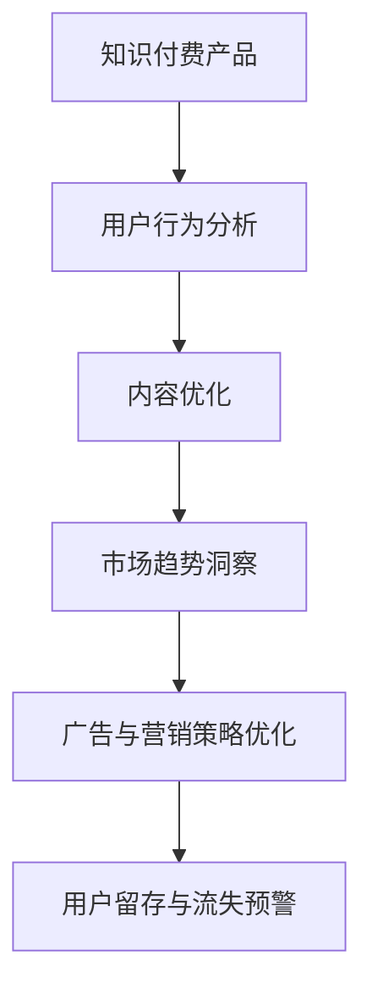

                 

# 如何利用数据分析优化知识付费产品

## 1. 背景介绍

### 1.1 问题由来

在数字化经济和知识经济迅猛发展的今天，知识付费产品（如在线课程、电子书、播客等）已经成为了学习、获取信息的重要渠道之一。然而，这些产品如何吸引用户、提高用户留存率、增加用户消费，成为了平台和内容创作者面临的重大挑战。基于此，利用数据分析对知识付费产品进行优化，已成为提升用户价值和平台盈利能力的关键策略。

### 1.2 问题核心关键点

数据分析在知识付费产品优化中的核心关键点包括：

- **用户行为分析**：通过分析用户的学习路径、互动行为、付费行为等数据，了解用户需求和偏好，提升用户体验。
- **内容优化**：根据用户反馈和历史数据，动态调整课程内容、难度、格式等，以吸引更多用户参与学习。
- **市场趋势洞察**：分析行业趋势、用户兴趣变化、竞争对手表现等，指导产品战略决策，优化资源配置。
- **广告与营销策略优化**：基于用户画像、兴趣标签等数据，精准投放广告，提升转化率。
- **用户留存与流失预警**：预测用户流失风险，通过个性化推荐、促活策略等手段，提高用户黏性。

## 2. 核心概念与联系

### 2.1 核心概念概述

为更好地理解利用数据分析优化知识付费产品的方法，本节将介绍几个密切相关的核心概念：

- **知识付费产品**：包括在线课程、电子书、播客等形式，提供专业知识或技能的学习和获取服务。
- **用户行为分析**：通过追踪和分析用户在产品中的行为数据，了解用户的兴趣、需求和反馈。
- **内容优化**：根据用户行为和反馈，动态调整课程内容、难度、格式等，提升学习效果和用户满意度。
- **市场趋势洞察**：基于外部数据和行业信息，分析用户兴趣变化、市场动态、竞争对手表现等，指导产品决策。
- **广告与营销策略优化**：利用用户画像和兴趣标签等数据，精准投放广告，提升转化率和用户参与度。
- **用户留存与流失预警**：通过机器学习模型，预测用户流失风险，进行早期预警和干预。

这些概念之间的逻辑关系可以通过以下Mermaid流程图来展示：



这个流程图展示了大数据分析在知识付费产品优化中的主要作用流程：首先通过用户行为分析，获取用户兴趣和需求；然后根据分析结果进行内容优化，提升用户体验；接着利用市场趋势洞察，制定精准的广告与营销策略；最后通过用户留存与流失预警，动态调整策略，提升用户黏性。

## 3. 核心算法原理 & 具体操作步骤

### 3.1 算法原理概述

利用数据分析优化知识付费产品，本质上是一个数据驱动的产品优化过程。其核心思想是：通过收集和分析用户在产品中的行为数据，挖掘用户的潜在需求和兴趣，并基于此进行产品改进和策略优化，从而提升用户价值和平台盈利能力。

形式化地，假设知识付费产品 $P$ 中的用户行为数据集为 $D=\{(x_i, y_i)\}_{i=1}^N$，其中 $x_i$ 为用户的各种行为数据（如学习时长、点击率、付费记录等），$y_i$ 为用户的标签信息（如兴趣、性别、年龄等）。通过数据分析，找出数据集 $D$ 中的模式和规律，即找到最优的策略 $\pi$ 和参数 $\theta$，使得产品优化目标函数 $O(P,\pi,\theta)$ 最大化。

### 3.2 算法步骤详解

基于数据分析的知识付费产品优化一般包括以下几个关键步骤：

**Step 1: 数据收集与预处理**
- 收集用户在产品中的行为数据，包括但不限于学习时长、课程点击、付费记录等。
- 清洗数据，去除噪声和不相关数据，确保数据质量和一致性。
- 划分数据集，如训练集、验证集和测试集，用于模型训练和评估。

**Step 2: 数据分析与建模**
- 通过统计分析、聚类分析、关联分析等方法，挖掘数据集 $D$ 中的模式和规律。
- 建立用户画像，识别不同用户群体的兴趣和行为特征。
- 根据分析结果，建立机器学习模型，如决策树、随机森林、神经网络等，预测用户行为和需求。
- 进行模型评估和调优，确保模型的泛化能力和稳定性。

**Step 3: 策略制定与实施**
- 基于模型预测结果，制定个性化的内容推荐、课程调整、广告投放等策略。
- 动态调整产品功能和服务，如学习路径、课程难度、付费优惠等，提升用户体验。
- 实时监控策略效果，如用户参与度、转化率、留存率等，进行持续优化。

**Step 4: 效果评估与反馈**
- 使用测试集对优化后的产品策略进行评估，对比优化前后的效果。
- 收集用户反馈，了解用户满意度、产品使用体验等，进一步优化策略。
- 对产品数据进行长期跟踪，评估优化效果，持续迭代改进。

### 3.3 算法优缺点

利用数据分析优化知识付费产品，具有以下优点：
1. 数据驱动。通过数据分析，制定基于用户需求和偏好的产品策略，提升用户体验和满意度。
2. 精准定位。通过用户画像和行为分析，精准定位目标用户群体，提高营销效率。
3. 实时调整。基于实时数据反馈，动态调整产品策略，提升用户黏性和留存率。
4. 量化评估。通过量化指标，如用户参与度、转化率、留存率等，评估优化效果，便于持续改进。

同时，该方法也存在一些局限性：
1. 数据质量依赖。数据分析结果的质量很大程度上取决于数据的质量和完整性，收集和清洗数据成本较高。
2. 模型依赖。模型性能很大程度上取决于算法的准确性和数据的多样性，建立和维护模型需要专业知识。
3. 隐私问题。用户行为数据的收集和分析可能涉及隐私问题，需要合规处理和保护。
4. 外部因素影响。用户行为受多种外部因素影响，单一的数据分析模型难以全面覆盖，需要多维度分析。

尽管存在这些局限性，但利用数据分析的方法，通过数据驱动的产品优化，已成为知识付费产品提升竞争力的重要手段。未来相关研究的重点在于如何进一步降低数据分析对数据质量和模型准确性的依赖，提高数据处理的效率和模型的鲁棒性，同时兼顾隐私保护和用户数据安全等因素。

### 3.4 算法应用领域

基于数据分析的知识付费产品优化方法，在教育、培训、娱乐等多个领域得到了广泛应用，覆盖了几乎所有常见的知识付费产品，例如：

- 在线教育平台：如Coursera、Udacity等，通过分析用户学习行为，推荐适合课程，提升学习效果。
- 电子书订阅服务：如Kindle Unlimited、Apple Books等，根据用户阅读偏好，推荐相关书籍，增加用户粘性。
- 播客平台：如Spotify、Apple Podcasts等，通过用户收听行为，推荐相关播客，提高用户参与度。
- 技能培训平台：如Udemy、Skillshare等，分析用户学习路径，优化课程内容，提升培训效果。
- 语言学习应用：如Duolingo、Babbel等，通过用户学习数据，个性化推荐学习资源，提升学习效率。

除了上述这些经典应用外，数据分析技术还被创新性地应用于更多场景中，如内容推荐、个性化学习路径设计、广告定向投放等，为知识付费产品带来了全新的突破。随着数据分析方法的不断进步，相信知识付费产品在更多领域将实现更大规模的落地应用。

## 4. 数学模型和公式 & 详细讲解 & 举例说明

### 4.1 数学模型构建

本节将使用数学语言对基于数据分析的知识付费产品优化过程进行更加严格的刻画。

假设知识付费平台有 $M$ 门课程，每门课程有 $N$ 个用户订阅。设 $u_i$ 为第 $i$ 个用户，$C_j$ 为第 $j$ 门课程。用户 $u_i$ 订阅课程 $C_j$ 的概率为 $p_{u_i C_j}$，可通过数据集 $D$ 中的行为数据计算得到。设 $x_{u_i C_j}$ 为 $u_i$ 订阅课程 $C_j$ 的特征向量，$y_{u_i C_j}$ 为 $p_{u_i C_j}$ 的标签值，即 $y_{u_i C_j} = p_{u_i C_j}$。

定义平台优化目标函数为 $O(P,\pi,\theta)$，即平台的总利润，包括用户订阅收入、广告收入等。设 $P_{u_i}$ 为 $u_i$ 的月订阅收入，$C_j$ 的课程售价为 $s_j$，用户 $u_i$ 订阅课程 $C_j$ 的概率为 $p_{u_i C_j}$，广告点击率为 $\alpha_{u_i C_j}$，则优化目标函数为：

$$
O(P,\pi,\theta) = \sum_{i=1}^M \sum_{j=1}^N P_{u_i} s_j p_{u_i C_j} + \sum_{i=1}^M \sum_{j=1}^N \alpha_{u_i C_j} \eta_{u_i C_j}
$$

其中，$\eta_{u_i C_j}$ 为广告点击的实际收入。

### 4.2 公式推导过程

以下是用户订阅概率模型 $p_{u_i C_j}$ 的推导过程：

假设用户 $u_i$ 对课程 $C_j$ 的学习时长为 $t_{u_i C_j}$，历史点击率为 $c_{u_i C_j}$，付费记录为 $p_{u_i C_j}$。设这些行为特征构成向量 $x_{u_i C_j} = (t_{u_i C_j}, c_{u_i C_j}, p_{u_i C_j})$，则用户订阅课程 $C_j$ 的概率模型 $p_{u_i C_j}$ 可表示为：

$$
p_{u_i C_j} = f(x_{u_i C_j}, \theta)
$$

其中 $f(\cdot)$ 为预测函数，$\theta$ 为模型参数。

假设 $f(\cdot)$ 为逻辑回归函数，则：

$$
p_{u_i C_j} = \frac{1}{1+\exp(-\theta^T x_{u_i C_j})}
$$

将 $p_{u_i C_j}$ 带入目标函数 $O(P,\pi,\theta)$ 中，进行优化，即：

$$
\max_{\theta} O(P,\pi,\theta) = \sum_{i=1}^M \sum_{j=1}^N P_{u_i} s_j p_{u_i C_j} + \sum_{i=1}^M \sum_{j=1}^N \alpha_{u_i C_j} \eta_{u_i C_j}
$$

### 4.3 案例分析与讲解

假设有两家在线教育平台 A 和 B，每门课程的平均售价为 100 元，平台 A 的课程内容更加丰富，用户订阅后获得更多学习资源。平台 B 则通过分析用户行为数据，建立了精准的用户画像，根据用户兴趣推荐课程，用户订阅后获得个性化的学习路径和辅导服务。

平台 A 和 B 都收集了 10 万名用户的行为数据，包括用户学习时长、课程点击、付费记录等。平台 A 的课程平均订阅率约为 30%，平均广告点击率为 10%，用户留存率为 20%。平台 B 通过数据分析，发现 60% 的用户对人工智能课程感兴趣，30% 的用户对心理学课程感兴趣，10% 的用户对数据科学课程感兴趣。平台 B 的课程平均订阅率提升至 40%，平均广告点击率提升至 15%，用户留存率提升至 25%。

通过对比分析，可以看出平台 B 在利用数据分析进行用户画像和行为分析方面的优势。平台 B 通过精准的课程推荐和个性化服务，不仅提升了用户订阅率和广告点击率，还提高了用户留存率，整体平台收益和用户满意度得到显著提升。

## 5. 项目实践：代码实例和详细解释说明

### 5.1 开发环境搭建

在进行数据分析优化实践前，我们需要准备好开发环境。以下是使用Python进行TensorFlow开发的环境配置流程：

1. 安装Anaconda：从官网下载并安装Anaconda，用于创建独立的Python环境。

2. 创建并激活虚拟环境：
```bash
conda create -n tensorflow-env python=3.8 
conda activate tensorflow-env
```

3. 安装TensorFlow：根据CUDA版本，从官网获取对应的安装命令。例如：
```bash
conda install tensorflow-gpu==2.7 -c conda-forge -c pytorch
```

4. 安装各类工具包：
```bash
pip install numpy pandas scikit-learn matplotlib tensorflow jupyter notebook ipython
```

完成上述步骤后，即可在`tensorflow-env`环境中开始数据分析优化实践。

### 5.2 源代码详细实现

这里我们以课程推荐系统为例，给出使用TensorFlow和Keras进行用户订阅概率模型训练的Python代码实现。

首先，定义训练集和测试集：

```python
import numpy as np
from sklearn.model_selection import train_test_split
from sklearn.preprocessing import OneHotEncoder

# 假设行为数据集包含 10 万名用户和 10 门课程
data = np.random.rand(100000, 10)  # 行为特征
labels = np.random.rand(100000, 1)  # 订阅概率

# 将标签进行one-hot编码
encoder = OneHotEncoder(sparse=False)
encoded_labels = encoder.fit_transform(labels)
```

然后，定义模型结构：

```python
from tensorflow.keras.models import Sequential
from tensorflow.keras.layers import Dense, Dropout, Activation

# 构建逻辑回归模型
model = Sequential()
model.add(Dense(64, input_shape=(10,)))
model.add(Activation('relu'))
model.add(Dropout(0.5))
model.add(Dense(1))
model.add(Activation('sigmoid'))
```

接着，编译模型：

```python
model.compile(loss='binary_crossentropy', optimizer='adam', metrics=['accuracy'])
```

最后，训练和评估模型：

```python
# 划分训练集和测试集
X_train, X_test, y_train, y_test = train_test_split(data, encoded_labels, test_size=0.2)

# 训练模型
model.fit(X_train, y_train, epochs=10, batch_size=32, validation_data=(X_test, y_test))

# 评估模型
test_loss, test_accuracy = model.evaluate(X_test, y_test)
print(f'Test Loss: {test_loss}, Test Accuracy: {test_accuracy}')
```

以上就是使用TensorFlow和Keras对课程推荐系统进行用户订阅概率模型训练的完整代码实现。可以看到，TensorFlow提供了高效的数据流图计算能力，使得模型训练和评估变得简单高效。

### 5.3 代码解读与分析

让我们再详细解读一下关键代码的实现细节：

**数据处理**：
- 使用NumPy生成随机行为数据，作为模型训练的输入。
- 使用Scikit-learn进行数据集的划分，将数据分为训练集和测试集。
- 使用OneHotEncoder对标签进行one-hot编码，将二元概率转化为多维标签向量。

**模型结构**：
- 使用Keras构建逻辑回归模型，包含一个全连接层、一个ReLU激活层、一个Dropout层和一个输出层。
- 输出层使用sigmoid函数进行二元概率预测。

**模型编译与训练**：
- 使用Keras的compile函数进行模型编译，指定损失函数、优化器和评估指标。
- 使用fit函数进行模型训练，指定训练轮数和批大小，使用测试集进行验证。

**模型评估**：
- 使用evaluate函数在测试集上评估模型性能，输出测试损失和准确率。

通过上述代码实现，我们完成了基于数据分析的知识付费产品优化模型训练和评估，展示了TensorFlow和Keras在构建和训练深度学习模型的便捷性和灵活性。

## 6. 实际应用场景

### 6.1 智能推荐系统

基于数据分析的知识付费产品优化方法，可以广泛应用于智能推荐系统的构建。智能推荐系统通过分析用户的行为数据，推荐用户感兴趣和合适的课程、书籍等，提高用户参与度和满意度。

在技术实现上，可以收集用户的学习行为数据，包括课程点击、学习时长、付费记录等。通过分析这些数据，建立用户画像，识别不同用户群体的兴趣和需求。在此基础上，利用推荐算法，如协同过滤、基于内容的推荐等，为用户推荐个性化课程和资源。智能推荐系统不仅可以提升用户的学习效率，还能增加平台的订阅率和广告收入。

### 6.2 用户画像分析

用户画像分析是知识付费产品优化的重要组成部分。通过分析用户的行为数据，可以构建出详细且具有代表性的用户画像，用于指导产品设计、广告投放等策略。

在实际应用中，可以通过分析用户的订阅行为、课程学习情况、付费记录等数据，提取用户的兴趣、需求和行为特征。例如，可以构建用户画像中的兴趣标签，如AI、心理学、数据科学等，通过这些标签进行精准的广告投放和课程推荐。用户画像分析不仅可以帮助平台了解用户需求，还能提升广告和营销的转化率，增加平台的收入来源。

### 6.3 课程内容优化

课程内容优化是提升知识付费产品品质的重要手段。通过分析用户的行为数据，可以了解课程受欢迎程度和用户反馈，据此进行内容调整和改进。

在实践中，可以收集用户的课程点击率、学习时长、课程评分等数据，分析用户对课程的反馈。例如，可以发现用户对某些课程的点击率高、学习时长长、评分高，说明这些课程内容受到用户欢迎。可以据此优化课程内容，增加用户满意度和订阅率。课程内容优化不仅有助于提升用户体验，还能增加平台的品牌价值和用户黏性。

### 6.4 用户留存与流失预警

用户留存与流失预警是知识付费产品优化的重要目标之一。通过预测用户流失风险，可以提前采取措施，提高用户留存率。

在实际应用中，可以通过建立用户流失预测模型，分析用户的行为数据和属性信息，预测用户流失风险。例如，可以发现用户在学习过程中产生厌学情绪、订阅付费意愿下降等迹象，通过个性化推荐、促活策略等手段，提前干预，提升用户留存率。用户留存与流失预警不仅可以帮助平台提高收益，还能增强用户的信任和忠诚度。

## 7. 工具和资源推荐

### 7.1 学习资源推荐

为了帮助开发者系统掌握基于数据分析的知识付费产品优化方法，这里推荐一些优质的学习资源：

1. **《Python数据分析与可视化》**：介绍使用Python进行数据分析和可视化的方法和工具，涵盖Numpy、Pandas、Matplotlib等基础库的使用。

2. **《TensorFlow实战》**：深入浅出地介绍TensorFlow框架的构建、训练和优化方法，适合TensorFlow初学者和进阶者。

3. **《深度学习入门》**：涵盖深度学习的基本概念、模型架构、训练技巧等，帮助理解基于数据分析的产品优化方法。

4. **《数据科学导论》**：介绍数据科学的基础知识、方法论和工具，适合初学者入门。

5. **Kaggle平台**：提供海量数据集和机器学习竞赛，帮助你实践和提升自己的数据分析和建模能力。

通过对这些资源的学习实践，相信你一定能够快速掌握基于数据分析的知识付费产品优化方法，并用于解决实际的业务问题。

### 7.2 开发工具推荐

高效的开发离不开优秀的工具支持。以下是几款用于知识付费产品优化开发的常用工具：

1. **Python**：作为数据分析和机器学习的通用语言，Python具有丰富的数据处理和分析库，如Numpy、Pandas、Scikit-learn等。

2. **TensorFlow**：由Google主导开发的深度学习框架，支持动态图和静态图两种计算图形式，适合构建复杂模型。

3. **Keras**：基于TensorFlow的高级神经网络API，易于上手且功能丰富，适合快速原型开发。

4. **Jupyter Notebook**：交互式的Python开发环境，支持代码执行、数据可视化等功能，适合进行数据探索和模型开发。

5. **Tableau**：强大的数据可视化工具，支持数据连接、图表绘制、数据探索等功能，适合进行数据可视化和报告生成。

6. **Tableau Public**：Tableau的在线免费版本，支持数据公开和共享，适合进行数据展示和开源交流。

合理利用这些工具，可以显著提升知识付费产品优化的开发效率，加快创新迭代的步伐。

### 7.3 相关论文推荐

基于数据分析的知识付费产品优化技术的发展源于学界的持续研究。以下是几篇奠基性的相关论文，推荐阅读：

1. **《个性化推荐系统：架构与算法》**：介绍个性化推荐系统的发展历程和基本架构，涵盖协同过滤、基于内容的推荐等经典算法。

2. **《用户行为分析在知识付费产品中的应用》**：探讨用户行为分析在知识付费产品中的应用，涵盖用户画像、内容推荐、广告投放等方面。

3. **《基于深度学习的知识付费产品优化》**：介绍使用深度学习进行知识付费产品优化的理论和实践，涵盖数据预处理、模型选择、评估指标等方面。

4. **《课程内容优化与用户参与度提升》**：通过分析用户行为数据，提出课程内容优化的策略和方法，提升用户参与度和满意度。

5. **《用户留存与流失预警模型》**：介绍建立用户流失预测模型的方法和效果，通过预测流失风险，提升用户留存率。

这些论文代表了大数据分析在知识付费产品优化技术的发展脉络。通过学习这些前沿成果，可以帮助研究者把握学科前进方向，激发更多的创新灵感。

## 8. 总结：未来发展趋势与挑战

### 8.1 总结

本文对基于数据分析的知识付费产品优化方法进行了全面系统的介绍。首先阐述了知识付费产品优化的背景和意义，明确了数据分析在优化中的核心作用。其次，从原理到实践，详细讲解了基于数据分析的知识付费产品优化的数学模型和算法步骤，给出了知识付费产品优化的完整代码实例。同时，本文还广泛探讨了数据分析方法在智能推荐系统、用户画像分析、课程内容优化、用户留存与流失预警等多个领域的应用前景，展示了数据分析范式的巨大潜力。此外，本文精选了知识付费产品优化的各类学习资源，力求为读者提供全方位的技术指引。

通过本文的系统梳理，可以看到，基于数据分析的知识付费产品优化方法，通过数据驱动的产品优化，极大地提升了知识付费产品的用户价值和平台盈利能力。随着数据分析方法和技术的不断进步，未来这一方法将在更多领域得到广泛应用，为传统行业带来变革性影响。

### 8.2 未来发展趋势

展望未来，基于数据分析的知识付费产品优化技术将呈现以下几个发展趋势：

1. **数据质量提升**：随着数据收集和清洗技术的进步，数据质量将进一步提升，数据分析结果将更加准确可靠。

2. **模型多样性**：除了传统的逻辑回归、决策树等模型外，未来将涌现更多基于深度学习、强化学习等技术的高效推荐和优化模型，提升推荐效果和优化效率。

3. **实时化优化**：基于实时数据流，动态调整产品策略，实现实时化优化，提升用户体验和满意度。

4. **多模态数据融合**：将用户行为数据与外部数据（如天气、地理位置等）融合，提供更全面、精准的产品优化方案。

5. **自适应算法**：开发自适应算法，根据用户行为数据动态调整推荐策略和优化方法，提高模型鲁棒性和适应性。

6. **跨平台优化**：实现多平台、多设备之间的数据同步和策略统一，提升用户在不同场景下的体验一致性。

以上趋势凸显了基于数据分析的知识付费产品优化技术的广阔前景。这些方向的探索发展，必将进一步提升知识付费产品的竞争力，为知识经济的发展注入新的动力。

### 8.3 面临的挑战

尽管基于数据分析的知识付费产品优化技术已经取得了显著成果，但在迈向更加智能化、普适化应用的过程中，仍面临诸多挑战：

1. **数据隐私问题**：用户行为数据的收集和分析涉及隐私问题，需要合规处理和保护。如何在保护用户隐私的前提下，充分利用数据进行产品优化，是亟待解决的重要问题。

2. **模型鲁棒性不足**：现有模型往往难以应对多变的用户需求和外部环境变化，需要进一步提升模型的鲁棒性和泛化能力。

3. **实时性挑战**：实时数据分析和产品优化对算力要求较高，如何降低计算成本，实现高效实时优化，是未来的一个重要研究方向。

4. **多场景融合**：用户行为数据来源于不同平台和设备，如何实现跨平台数据同步和策略统一，提高用户体验一致性，仍需更多探索。

5. **数据质量和多样性**：数据分析效果很大程度上依赖于数据质量和多样性，如何在保证数据质量的前提下，进一步提升数据多样性，是未来研究的重要方向。

尽管面临这些挑战，但随着技术的不断进步和创新，基于数据分析的知识付费产品优化技术将不断突破现有瓶颈，为知识付费产品的优化提供更高效、更精准的解决方案。

### 8.4 研究展望

面向未来，基于数据分析的知识付费产品优化技术需要在以下几个方面进行深入研究：

1. **多维度数据分析**：除了用户行为数据外，引入外部数据（如天气、地理位置等），进行多维度分析，提供更全面、精准的产品优化方案。

2. **自适应推荐系统**：开发自适应推荐系统，根据用户行为数据动态调整推荐策略和优化方法，提高模型鲁棒性和适应性。

3. **跨平台数据融合**：实现多平台、多设备之间的数据同步和策略统一，提升用户在不同场景下的体验一致性。

4. **隐私保护技术**：研究数据隐私保护技术，如差分隐私、联邦学习等，保护用户隐私的同时，充分利用数据进行产品优化。

5. **实时优化算法**：研究高效实时优化算法，降低计算成本，实现高效实时产品优化。

6. **自动化优化平台**：构建自动化优化平台，实现产品优化策略的自动生成和执行，提升优化效率和效果。

这些研究方向将引领基于数据分析的知识付费产品优化技术迈向更高的台阶，为知识付费产品优化提供更高效、更精准的解决方案。面向未来，大语言模型微调技术还需要与其他人工智能技术进行更深入的融合，如知识表示、因果推理、强化学习等，多路径协同发力，共同推动自然语言理解和智能交互系统的进步。只有勇于创新、敢于突破，才能不断拓展语言模型的边界，让智能技术更好地造福人类社会。

## 9. 附录：常见问题与解答

**Q1：数据分析在知识付费产品优化中的作用是什么？**

A: 数据分析在知识付费产品优化中的作用主要体现在以下几个方面：
1. **用户行为分析**：通过追踪和分析用户在产品中的行为数据，了解用户需求和偏好，提升用户体验。
2. **内容优化**：根据用户反馈和历史数据，动态调整课程内容、难度、格式等，提升学习效果和用户满意度。
3. **市场趋势洞察**：分析行业趋势、用户兴趣变化、竞争对手表现等，指导产品战略决策，优化资源配置。
4. **广告与营销策略优化**：利用用户画像和兴趣标签等数据，精准投放广告，提升转化率。
5. **用户留存与流失预警**：预测用户流失风险，通过个性化推荐、促活策略等手段，提高用户黏性。

通过数据分析，可以全面了解用户需求和行为，指导产品优化和策略制定，提升用户价值和平台盈利能力。

**Q2：在数据分析中，如何避免数据隐私问题？**

A: 数据隐私问题是数据分析中的重要挑战，需要在数据收集、处理和分析过程中进行严格控制。具体措施包括：
1. **匿名化处理**：通过数据匿名化处理，去除个人标识信息，保护用户隐私。
2. **差分隐私技术**：采用差分隐私技术，在保证数据统计分析结果准确性的前提下，保护用户隐私。
3. **联邦学习**：利用联邦学习技术，在本地数据上训练模型，保护用户数据不离开本地设备，减少隐私泄露风险。
4. **合规处理**：遵守相关隐私法规和标准，如GDPR、CCPA等，确保数据处理过程符合法律要求。

通过以上措施，可以在保障用户隐私的前提下，充分利用数据分析提升产品优化效果。

**Q3：如何在知识付费产品优化中，实现高效实时优化？**

A: 实现高效实时优化，需要从以下几个方面进行优化：
1. **数据流处理**：使用流处理技术，如Apache Kafka、Apache Flink等，实时处理和分析用户行为数据，提高数据处理效率。
2. **轻量级模型**：采用轻量级模型，如TensorFlow Lite、ONNX Runtime等，减少计算资源消耗，提高实时优化效率。
3. **分布式计算**：利用分布式计算框架，如Hadoop、Spark等，实现数据和模型的高效分布式计算，提高优化效率。
4. **缓存机制**：使用缓存机制，如Redis、Memcached等，缓存频繁使用的数据和模型参数，减少重复计算。

通过以上措施，可以在保证优化效果的同时，降低计算成本，实现高效实时优化。

**Q4：数据分析在课程内容优化中的应用是什么？**

A: 数据分析在课程内容优化中的应用主要体现在以下几个方面：
1. **用户需求分析**：通过分析用户的学习路径、课程评分、课程点击等数据，识别用户对课程内容的需求和反馈。
2. **内容改进建议**：根据用户需求分析结果，提出课程内容改进建议，如调整课程结构、增加互动环节等，提升课程质量。
3. **个性化推荐**：利用用户行为数据，构建个性化推荐系统，推荐适合用户兴趣和需求的内容，提升学习效果和满意度。

通过数据分析，可以全面了解用户需求和行为，指导课程内容改进和个性化推荐，提升用户参与度和满意度。

**Q5：知识付费产品优化中，如何构建用户画像？**

A: 构建用户画像需要从以下几个方面进行：
1. **行为数据分析**：收集用户的学习行为数据，如课程点击、学习时长、付费记录等，提取用户的兴趣、需求和行为特征。
2. **属性信息分析**：收集用户的基本信息，如年龄、性别、职业等，进一步丰富用户画像。
3. **聚类分析**：利用聚类算法，将用户分为不同的群体，识别不同群体的兴趣和需求。
4. **标签系统**：构建标签系统，将用户画像中的特征和行为转化为标签，方便进行数据管理和分析。

通过以上步骤，可以构建出详细且具有代表性的用户画像，用于指导产品设计、广告投放等策略。

---

作者：禅与计算机程序设计艺术 / Zen and the Art of Computer Programming

