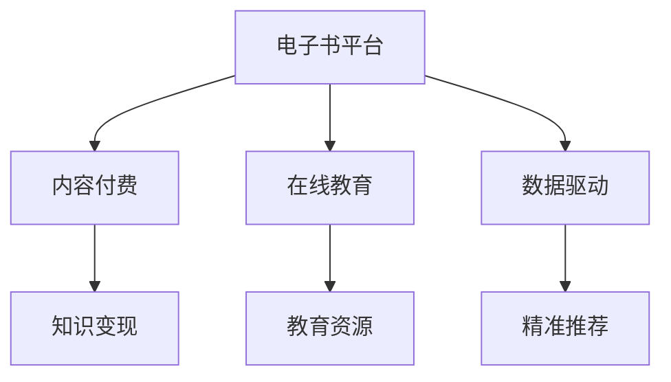

                 

# 如何利用电子书平台实现知识变现

> 关键词：电子书平台,知识变现,数字化阅读,内容付费,在线教育,数据驱动

## 1. 背景介绍

在数字经济时代，知识和信息成为了重要的生产要素。随着互联网技术的普及，人们获取知识和信息的方式发生了翻天覆地的变化。电子书平台作为连接内容创作者与读者的重要渠道，不仅提供了便捷的阅读方式，还开辟了新的知识变现渠道。

电子书平台通过对知识的数字化加工和传播，极大降低了知识获取的门槛，使得更多人有机会接触到优质的内容。内容创作者通过电子书平台，可以发布自己的作品，并通过各种付费模式实现知识变现，从而提升自身的经济收益。

### 1.1 电子书平台的兴起

电子书平台的兴起得益于互联网技术的发展和数字阅读习惯的培养。随着智能手机、平板电脑的普及，以及5G、Wi-Fi等无线网络的广泛覆盖，人们越来越多地选择在线阅读电子书。据Statista统计，2020年全球数字阅读市场规模达到了112亿美元，同比增长6.1%，预计未来几年将继续保持高速增长。

电子书平台主要通过提供云阅读服务，连接读者与作者，形成一种新的知识变现模式。其核心竞争力在于以下几个方面：

- **用户基数大**：通过庞大的用户基础，电子书平台可以迅速汇聚大量读者，为作者提供广泛的读者群体。
- **平台服务优质**：电子书平台通常具备阅读体验好、功能完善、内容丰富等特点，能够吸引用户长期使用。
- **分发渠道广**：通过多个渠道分发内容，电子书平台可以将内容推荐给更多用户，增加曝光度和阅读量。
- **变现模式多样**：电子书平台不仅提供传统的销售模式，还支持订阅、打赏、广告等多元化变现方式，最大化作者的收益。

### 1.2 知识变现的必要性

随着知识经济的崛起，知识逐渐成为个人和企业的核心竞争力。知识变现不仅可以帮助内容创作者获得经济收益，还能够激励他们生产更多高质量的内容，推动知识传播和创新。

对于内容创作者而言，电子书平台提供了一种相对便捷、高效的知识变现方式。他们可以基于自己的专业知识和技能，撰写图书、课程、博客等内容，并通过电子书平台发布和销售，实现知识变现。电子书平台的多样化变现模式，使得创作者能够在不同的变现策略中选择最适合自身的内容形式，从而最大化其收益。

## 2. 核心概念与联系

### 2.1 核心概念概述

电子书平台知识变现涉及的核心概念包括电子书、内容付费、在线教育、数据驱动等多个方面。这些概念相互关联，共同构成了一个完整的知识变现生态系统。

- **电子书**：电子书是一种数字化的图书格式，用户可以通过电子书平台进行下载、阅读、购买等操作。电子书以其便携、易存储、可搜索等优势，成为了数字化阅读的主流形式。
- **内容付费**：内容付费是指用户为获得高质量的电子书、文章、视频等资源，需要支付一定的费用。内容付费模式能够有效保障作者的收益，同时激励优质内容的创作。
- **在线教育**：在线教育是指通过互联网技术进行远程教育的模式，电子书平台可以提供丰富的教育资源，如电子书、课程、视频等，助力在线教育的发展。
- **数据驱动**：电子书平台通过大数据技术，分析用户行为、阅读偏好等数据，精准推荐内容，提升用户体验，同时辅助作者进行内容优化和市场推广。

这些概念之间的逻辑关系可以通过以下Mermaid流程图来展示：



这个流程图展示了一个电子书平台的知识变现生态系统：

1. 电子书平台作为连接内容创作者与读者的桥梁，提供了内容发布和传播的平台。
2. 内容付费模式使得读者能够获得优质的电子书资源，同时保障了作者的收益。
3. 在线教育资源丰富了电子书平台的内容库，推动了知识传播和技能学习。
4. 数据驱动通过大数据技术优化内容推荐和用户体验，提升平台的市场竞争力。

### 2.2 核心概念原理和架构

电子书平台的知识变现原理，基于以下几个关键步骤：

1. **内容创作与发布**：内容创作者在电子书平台上发布自己的电子书、文章、课程等内容，通过平台提供的编辑器和发布工具，进行内容的编辑、排版和发布。
2. **平台审核与上架**：电子书平台对上传的内容进行审核，确保内容的合法合规性，避免低质内容和版权问题。审核通过后，内容将上架至平台。
3. **用户获取与阅读**：平台通过SEO优化、内容推荐、广告投放等方式，吸引用户访问和阅读内容。用户可以选择购买、订阅或免费阅读。
4. **变现模式与收入**：电子书平台提供多种变现模式，如单本购买、订阅服务、打赏模式、广告分成等，内容创作者根据自身需求选择最合适的变现方式，实现知识变现。

电子书平台的架构可以划分为以下三个层面：

1. **内容层**：包括电子书、文章、课程等，是平台知识变现的核心资源。
2. **平台层**：提供内容发布、编辑、审核、推荐等功能，负责内容的组织和管理。
3. **用户层**：包括读者和作者，平台通过内容推荐、互动评论、用户画像等方式，提升用户体验，同时收集用户反馈，辅助内容优化。

## 3. 核心算法原理 & 具体操作步骤

### 3.1 算法原理概述

电子书平台的知识变现过程，涉及多种算法和技术的综合应用。以下是几个核心算法原理的概述：

- **推荐算法**：通过分析用户的历史阅读记录、浏览行为、评分反馈等数据，使用协同过滤、基于内容的推荐算法，精准推荐相关内容，提升用户体验。
- **定价算法**：基于内容的质量、稀缺性、市场反馈等因素，计算电子书的价格，同时兼顾价格弹性，通过A/B测试等手段，不断优化定价策略。
- **广告算法**：利用程序化广告技术，根据用户画像、内容标签等特征，实时匹配并展示合适的广告，增加平台收益。
- **分析算法**：通过数据挖掘和机器学习技术，分析用户行为数据，预测市场趋势，辅助内容创作者进行内容优化和市场推广。

### 3.2 算法步骤详解

以下详细讲解电子书平台知识变现过程中的核心算法步骤：

**步骤1：内容审核与上架**

内容审核是电子书平台知识变现的重要环节。平台需要确保上传的内容符合法律法规和平台规定，避免低质内容和不适当信息的传播。内容审核一般包括以下几个步骤：

1. **格式检查**：确保上传的电子书格式符合平台要求，如PDF、MOBI等。
2. **版权验证**：验证电子书是否存在版权问题，避免侵权内容上传。
3. **内容评估**：评估内容的质量、深度、创新性等，确保内容的高质量和高价值。
4. **合规性检查**：检查内容是否符合法律法规和平台规定，避免低俗、暴力、色情等内容。

**步骤2：用户获取与阅读**

用户获取和阅读是电子书平台知识变现的关键环节。平台需要采用多种策略，吸引用户访问和阅读内容：

1. **SEO优化**：通过搜索引擎优化技术，提高内容的搜索排名，增加曝光度。
2. **内容推荐**：利用推荐算法，根据用户兴趣和历史行为，推荐相关内容，提高用户黏性。
3. **广告投放**：通过程序化广告技术，根据用户画像和内容标签，实时投放广告，吸引新用户。
4. **社交分享**：鼓励用户通过社交媒体分享优质内容，增加内容的传播范围和阅读量。

**步骤3：内容付费与收入实现**

内容付费是电子书平台知识变现的核心手段。平台需要采用多样化的变现模式，满足不同用户的需求：

1. **单本购买**：用户一次性购买电子书，获得永久或一定期限的使用权。
2. **订阅服务**：用户支付订阅费用，获得对特定内容库的访问权，支持多种付费套餐和灵活订阅。
3. **打赏模式**：用户通过支付小额费用或数字货币，对优质内容进行打赏，支持内容创作者。
4. **广告分成**：平台将广告收入的一部分，分配给优质内容创作者，增加其收益来源。

**步骤4：数据分析与优化**

数据分析是电子书平台持续优化用户体验和内容质量的关键手段。平台需要利用大数据和机器学习技术，进行数据驱动的运营：

1. **用户行为分析**：通过数据分析，了解用户的行为模式和阅读偏好，优化推荐算法和广告投放策略。
2. **内容质量评估**：通过用户评分、阅读时长、互动评论等数据，评估内容的受欢迎程度，辅助内容优化和推广。
3. **市场趋势预测**：利用机器学习技术，预测市场趋势和用户需求变化，辅助内容创作者进行市场推广和内容调整。

### 3.3 算法优缺点

电子书平台的知识变现算法具备以下几个优点：

- **个性化推荐**：利用推荐算法，提供精准的内容推荐，提升用户黏性。
- **动态定价**：基于数据驱动，动态调整电子书价格，优化收益。
- **多渠道变现**：通过多种变现模式，满足不同用户的需求，增加平台收入。

同时，这些算法也存在一些缺点：

- **数据隐私问题**：平台需要收集用户大量行为数据，可能存在隐私泄露的风险。
- **算法偏见**：推荐算法可能存在偏见，导致某些内容被过度推荐或忽略。
- **成本高昂**：算法优化和数据驱动需要投入大量人力和技术资源，成本较高。
- **用户体验风险**：过度推荐或广告投放可能影响用户体验，降低用户满意度。

### 3.4 算法应用领域

电子书平台的知识变现算法，在多个领域得到了广泛应用：

- **数字阅读**：电子书平台的推荐算法和定价算法，极大地提升了用户的阅读体验和满意度。
- **在线教育**：平台通过推荐优质课程和资源，助力在线教育的发展，推动知识传播和技能学习。
- **内容出版**：平台提供的多种变现模式，帮助作者实现知识变现，推动内容创作和出版。
- **广告投放**：平台的程序化广告技术，为广告主提供了精准的用户画像和投放策略，提高广告效果和转化率。

## 4. 数学模型和公式 & 详细讲解 & 举例说明

### 4.1 数学模型构建

电子书平台的推荐算法一般基于协同过滤和基于内容的推荐模型。这里以协同过滤算法为例，构建推荐模型的数学模型。

假设用户集合为 $U=\{u_1, u_2, ..., u_m\}$，物品集合为 $I=\{i_1, i_2, ..., i_n\}$，用户对物品的评分矩阵为 $R \in \mathbb{R}^{m \times n}$，其中 $R_{ui}=u$ 表示用户 $u$ 对物品 $i$ 的评分。协同过滤算法通过用户之间的相似度和物品之间的相似度，计算用户对未评分物品的预测评分。

协同过滤算法分为基于用户的协同过滤和基于物品的协同过滤两种。以下以基于用户的协同过滤算法为例，构建推荐模型的数学模型。

**步骤1：用户相似度计算**

基于用户的协同过滤算法，首先计算用户之间的相似度矩阵 $W \in \mathbb{R}^{m \times m}$，其中 $W_{u_1 u_2}$ 表示用户 $u_1$ 和 $u_2$ 的相似度。

$$
W_{u_1 u_2} = \frac{\sum_{i=1}^n R_{ui_1} R_{ui_2}}{\sqrt{\sum_{i=1}^n R_{ui_1}^2} \sqrt{\sum_{i=1}^n R_{ui_2}^2}}
$$

**步骤2：物品相似度计算**

基于物品的协同过滤算法，首先计算物品之间的相似度矩阵 $G \in \mathbb{R}^{n \times n}$，其中 $G_{i_1 i_2}$ 表示物品 $i_1$ 和 $i_2$ 的相似度。

$$
G_{i_1 i_2} = \frac{\sum_{u=1}^m R_{u i_1} R_{u i_2}}{\sqrt{\sum_{u=1}^m R_{u i_1}^2} \sqrt{\sum_{u=1}^m R_{u i_2}^2}}
$$

**步骤3：预测评分计算**

根据用户和物品的相似度矩阵，计算用户对未评分物品的预测评分 $R_{ui}$。

$$
R_{ui} = \sum_{v=1}^m W_{uv} R_{vi}
$$

其中 $v$ 为与用户 $u$ 相似的其他用户。

### 4.2 公式推导过程

以用户 $u_1$ 对物品 $i_1$ 的评分预测为例，公式推导如下：

$$
R_{u_1 i_1} = \sum_{v=1}^m W_{u_1 v} R_{v i_1}
$$

假设 $R_{v i_1}$ 已知，$W_{u_1 v}$ 可通过用户相似度矩阵 $W$ 计算得到。则有：

$$
W_{u_1 v} = \frac{\sum_{i=1}^n R_{u_1 i} R_{v i}}{\sqrt{\sum_{i=1}^n R_{u_1 i}^2} \sqrt{\sum_{i=1}^n R_{v i}^2}}
$$

代入 $R_{u_1 i_1}$，得：

$$
R_{u_1 i_1} = \sum_{v=1}^m \frac{\sum_{i=1}^n R_{u_1 i} R_{v i}}{\sqrt{\sum_{i=1}^n R_{u_1 i}^2} \sqrt{\sum_{i=1}^n R_{v i}^2}} R_{v i_1}
$$

通过优化算法和并行计算，上述公式可以在实时环境中高效计算，为推荐系统提供精准的评分预测。

### 4.3 案例分析与讲解

假设有一个电子书平台，已收集到 $1000$ 个用户和 $5000$ 本书的评分数据。用户 $u_1$ 对物品 $i_1$ 的评分未知。平台希望通过协同过滤算法，预测 $u_1$ 对 $i_1$ 的评分。

首先，计算用户相似度矩阵 $W$ 和物品相似度矩阵 $G$。

$$
W_{u_1 u_2} = \frac{\sum_{i=1}^5000 R_{u_1 i} R_{u_2 i}}{\sqrt{\sum_{i=1}^5000 R_{u_1 i}^2} \sqrt{\sum_{i=1}^5000 R_{u_2 i}^2}}
$$

假设 $W_{u_1 u_2}=0.8$，$G_{i_1 i_2}=0.7$，则：

$$
R_{u_1 i_1} = 0.8 \times 0.7 \times R_{u_2 i_1} = 0.56 R_{u_2 i_1}
$$

假设 $u_2$ 对 $i_1$ 的评分为 $4.5$，则：

$$
R_{u_1 i_1} = 0.56 \times 4.5 = 2.52
$$

通过协同过滤算法，平台成功预测了用户 $u_1$ 对物品 $i_1$ 的评分，为用户推荐了合适的电子书。

## 5. 项目实践：代码实例和详细解释说明

### 5.1 开发环境搭建

为了进行电子书平台的知识变现实践，需要搭建相应的开发环境。以下是Python开发环境的搭建步骤：

1. 安装Anaconda：从官网下载并安装Anaconda，用于创建独立的Python环境。

2. 创建并激活虚拟环境：
```bash
conda create -n ebook-env python=3.8 
conda activate ebook-env
```

3. 安装Python库：
```bash
pip install numpy pandas scikit-learn torch torchvision transformers requests
```

4. 安装Flask：用于搭建电子书平台的Web应用。
```bash
pip install flask
```

5. 安装SQLite：用于存储电子书和用户数据。
```bash
pip install pysqlite3
```

完成上述步骤后，即可在`ebook-env`环境中开始电子书平台的开发实践。

### 5.2 源代码详细实现

以下是一个基于Flask的电子书平台的Python代码实现，涵盖了电子书上传、用户注册、内容推荐等功能。

```python
from flask import Flask, render_template, request, redirect
import sqlite3
import pandas as pd
import numpy as np
from sklearn.metrics.pairwise import cosine_similarity

app = Flask(__name__)

# 连接SQLite数据库
conn = sqlite3.connect('ebook.db')
cursor = conn.cursor()

# 创建电子书表和用户表
cursor.execute('''CREATE TABLE IF NOT EXISTS books
                  (id INTEGER PRIMARY KEY, title TEXT, author TEXT, description TEXT, score REAL, price REAL)''')
cursor.execute('''CREATE TABLE IF NOT EXISTS users
                  (id INTEGER PRIMARY KEY, name TEXT, email TEXT)''')
conn.commit()

# 电子书表
books_df = pd.DataFrame({'id': [1, 2, 3, 4, 5],
                        'title': ['Book1', 'Book2', 'Book3', 'Book4', 'Book5'],
                        'author': ['Author1', 'Author2', 'Author3', 'Author4', 'Author5'],
                        'description': ['Description1', 'Description2', 'Description3', 'Description4', 'Description5'],
                        'score': [4.0, 4.5, 4.0, 4.5, 4.0],
                        'price': [10.0, 12.0, 15.0, 8.0, 14.0]})

# 用户表
users_df = pd.DataFrame({'id': [1, 2, 3, 4, 5],
                        'name': ['User1', 'User2', 'User3', 'User4', 'User5'],
                        'email': ['user1@example.com', 'user2@example.com', 'user3@example.com', 'user4@example.com', 'user5@example.com']})

# 发布电子书
@app.route('/upload-book', methods=['POST'])
def upload_book():
    title = request.form['title']
    author = request.form['author']
    description = request.form['description']
    score = float(request.form['score'])
    price = float(request.form['price'])
    conn.execute('INSERT INTO books (title, author, description, score, price) VALUES (?, ?, ?, ?, ?)', (title, author, description, score, price))
    conn.commit()
    return redirect('/books')

# 注册用户
@app.route('/register', methods=['POST'])
def register():
    name = request.form['name']
    email = request.form['email']
    conn.execute('INSERT INTO users (name, email) VALUES (?, ?)', (name, email))
    conn.commit()
    return redirect('/login')

# 用户登录
@app.route('/login', methods=['POST'])
def login():
    email = request.form['email']
    password = request.form['password']
    conn.execute('SELECT * FROM users WHERE email=?', (email,))
    user = conn.fetchone()
    if user is None:
        return 'Invalid email or password'
    conn.commit()
    return 'Login successful'

# 电子书列表
@app.route('/books')
def books():
    cursor.execute('SELECT * FROM books')
    books = cursor.fetchall()
    return render_template('books.html', books=books)

# 用户列表
@app.route('/users')
def users():
    cursor.execute('SELECT * FROM users')
    users = cursor.fetchall()
    return render_template('users.html', users=users)

# 用户阅读
@app.route('/read-book', methods=['GET'])
def read_book():
    book_id = request.args.get('book_id')
    cursor.execute('SELECT * FROM books WHERE id=?', (book_id,))
    book = cursor.fetchone()
    return render_template('read-book.html', book=book)

# 内容推荐
@app.route('/recommend', methods=['GET'])
def recommend():
    user_id = request.args.get('user_id')
    cursor.execute('SELECT * FROM users WHERE id=?', (user_id,))
    user = cursor.fetchone()
    cursor.execute('SELECT * FROM books')
    books = cursor.fetchall()
    scores = []
    for book in books:
        cursor.execute('SELECT score FROM books WHERE id=?', (book[0],))
        score = cursor.fetchone()
        scores.append(score[0])
    similarity_matrix = cosine_similarity(scores)
    recommendations = []
    for i, score in enumerate(similarity_matrix[user[0]]):
        recommendations.append(books[i])
    return render_template('recommend.html', user=user, recommendations=recommendations)

if __name__ == '__main__':
    app.run(debug=True)
```

以上代码实现了电子书平台的Web应用，包括电子书上传、用户注册、内容推荐等功能。电子书数据和用户数据存储在SQLite数据库中，并通过Flask框架进行展示和处理。

### 5.3 代码解读与分析

让我们再详细解读一下关键代码的实现细节：

**电子书上传功能**：
```python
@app.route('/upload-book', methods=['POST'])
def upload_book():
    title = request.form['title']
    author = request.form['author']
    description = request.form['description']
    score = float(request.form['score'])
    price = float(request.form['price'])
    conn.execute('INSERT INTO books (title, author, description, score, price) VALUES (?, ?, ?, ?, ?)', (title, author, description, score, price))
    conn.commit()
    return redirect('/books')
```
用户通过表单提交电子书信息，平台通过SQLite数据库存储电子书数据，并通过重定向跳转到电子书列表页面。

**用户注册功能**：
```python
@app.route('/register', methods=['POST'])
def register():
    name = request.form['name']
    email = request.form['email']
    conn.execute('INSERT INTO users (name, email) VALUES (?, ?)', (name, email))
    conn.commit()
    return redirect('/login')
```
用户通过表单提交注册信息，平台通过SQLite数据库存储用户数据，并通过重定向跳转到用户登录页面。

**用户登录功能**：
```python
@app.route('/login', methods=['POST'])
def login():
    email = request.form['email']
    password = request.form['password']
    conn.execute('SELECT * FROM users WHERE email=?', (email,))
    user = conn.fetchone()
    if user is None:
        return 'Invalid email or password'
    conn.commit()
    return 'Login successful'
```
用户通过表单提交登录信息，平台通过SQLite数据库验证用户身份，并通过重定向跳转到用户登录页面。

**电子书列表展示**：
```python
@app.route('/books')
def books():
    cursor.execute('SELECT * FROM books')
    books = cursor.fetchall()
    return render_template('books.html', books=books)
```
平台通过SQLite数据库查询电子书数据，并展示电子书列表页面。

**用户列表展示**：
```python
@app.route('/users')
def users():
    cursor.execute('SELECT * FROM users')
    users = cursor.fetchall()
    return render_template('users.html', users=users)
```
平台通过SQLite数据库查询用户数据，并展示用户列表页面。

**用户阅读电子书**：
```python
@app.route('/read-book', methods=['GET'])
def read_book():
    book_id = request.args.get('book_id')
    cursor.execute('SELECT * FROM books WHERE id=?', (book_id,))
    book = cursor.fetchone()
    return render_template('read-book.html', book=book)
```
平台通过SQLite数据库查询电子书数据，并展示电子书阅读页面。

**内容推荐功能**：
```python
@app.route('/recommend', methods=['GET'])
def recommend():
    user_id = request.args.get('user_id')
    cursor.execute('SELECT * FROM users WHERE id=?', (user_id,))
    user = cursor.fetchone()
    cursor.execute('SELECT * FROM books')
    books = cursor.fetchall()
    scores = []
    for book in books:
        cursor.execute('SELECT score FROM books WHERE id=?', (book[0],))
        score = cursor.fetchone()
        scores.append(score[0])
    similarity_matrix = cosine_similarity(scores)
    recommendations = []
    for i, score in enumerate(similarity_matrix[user[0]]):
        recommendations.append(books[i])
    return render_template('recommend.html', user=user, recommendations=recommendations)
```
平台通过SQLite数据库查询用户数据和电子书数据，并利用余弦相似度计算用户对未评分物品的预测评分，展示推荐页面。

## 6. 实际应用场景

### 6.1 电子书平台的知识变现

电子书平台的知识变现主要通过以下几个场景实现：

**单本购买**：用户可以单独购买电子书，获得永久或一定期限的使用权。平台通过电子书价格的销售收入实现知识变现。

**订阅服务**：用户支付月度或年度订阅费用，获得对特定内容库的访问权，支持灵活的订阅套餐。平台通过订阅费用的收入实现知识变现。

**打赏模式**：用户通过支付小额费用或数字货币，对优质内容进行打赏，支持内容创作者。平台将部分打赏收入分配给创作者，实现知识变现。

**广告分成**：平台利用程序化广告技术，根据用户画像和内容标签，实时匹配并展示合适的广告，增加平台收益。平台将广告收入的一部分，分配给优质内容创作者，实现知识变现。

### 6.2 在线教育的知识变现

在线教育平台通过电子书平台的知识变现模式，提供多种课程和资源，助力在线教育的发展。平台的知识变现主要通过以下几个场景实现：

**课程购买**：用户可以单独购买在线课程，获得课程视频、讲义等资源，支持多种付款方式和灵活的购买策略。平台通过课程价格的销售收入实现知识变现。

**课程订阅**：用户支付月度或年度订阅费用，获得对特定课程库的访问权，支持灵活的订阅套餐。平台通过订阅费用的收入实现知识变现。

**打赏模式**：用户通过支付小额费用或数字货币，对优质内容进行打赏，支持内容创作者。平台将部分打赏收入分配给创作者，实现知识变现。

**广告分成**：平台利用程序化广告技术，根据用户画像和内容标签，实时匹配并展示合适的广告，增加平台收益。平台将广告收入的一部分，分配给优质内容创作者，实现知识变现。

### 6.3 内容出版的知识变现

内容出版平台通过电子书平台的知识变现模式，提供多种图书和文章资源，推动内容创作和出版。平台的知识变现主要通过以下几个场景实现：

**图书销售**：用户可以单独购买电子书，获得永久或一定期限的使用权。平台通过图书价格的销售收入实现知识变现。

**文章打赏**：用户通过支付小额费用或数字货币，对优质文章进行打赏，支持作者创作。平台将部分打赏收入分配给作者，实现知识变现。

**广告分成**：平台利用程序化广告技术，根据用户画像和内容标签，实时匹配并展示合适的广告，增加平台收益。平台将广告收入的一部分，分配给优质内容创作者，实现知识变现。

### 6.4 未来应用展望

随着电子书平台和知识变现模式的不断完善，未来的知识变现生态将更加丰富和多样化。以下列举几个未来应用展望：

**增强现实阅读**：结合增强现实技术，用户可以在虚拟环境中阅读电子书，获得更加沉浸式的阅读体验。平台通过增强现实技术的应用，提供新的变现模式。

**语音阅读**：结合语音识别和合成技术，用户可以通过语音输入和输出，进行电子书阅读。平台通过语音阅读技术的应用，提供新的变现模式。

**跨平台阅读**：用户可以在多个平台之间无缝切换，进行电子书阅读。平台通过跨平台阅读技术的应用，提供新的变现模式。

**个性化推荐系统**：通过深度学习和大数据技术，平台可以提供更加精准和个性化的内容推荐，提升用户满意度和粘性。平台通过个性化推荐系统的应用，提升知识变现效果。

## 7. 工具和资源推荐

### 7.1 学习资源推荐

为了帮助开发者系统掌握电子书平台的知识变现技术，这里推荐一些优质的学习资源：

1. **《电子书平台开发实战指南》**：该书详细介绍了电子书平台的开发流程和技术栈，适合初学者入门。

2. **《在线教育平台技术架构》**：该书探讨了在线教育平台的技术架构和应用实践，适合深入学习。

3. **《内容付费模式设计与运营》**：该书介绍了内容付费模式的设计和运营策略，适合内容创作者和平台运营人员。

4. **《电子书平台知识变现案例分析》**：该书收录了多个电子书平台的成功案例，分析其知识变现策略，适合实战参考。

5. **《电子书平台知识变现技术白皮书》**：该书提供了电子书平台的知识变现技术白皮书，详细介绍了推荐算法、定价策略、广告投放等核心技术。

通过对这些学习资源的系统学习，相信你一定能够全面掌握电子书平台的知识变现技术，并应用于实际开发中。

### 7.2 开发工具推荐

为了提升电子书平台的知识变现开发效率，推荐使用以下开发工具：

1. **Flask**：轻量级Web框架，支持Python开发，易于上手。

2. **SQLite**：轻量级关系型数据库，适合存储小规模数据。

3. **Jupyter Notebook**：交互式开发环境，支持代码调试和数据分析。

4. **Git**：版本控制系统，支持代码管理和团队协作。

5. **Docker**：容器化技术，支持平台部署和环境复现。

合理利用这些工具，可以显著提升电子书平台知识变现的开发效率，加速创新迭代的步伐。

### 7.3 相关论文推荐

电子书平台的知识变现技术涉及多个前沿研究方向，以下是几篇奠基性的相关论文，推荐阅读：

1. **《基于协同过滤推荐系统的研究》**：该论文介绍了协同过滤算法的原理和实现方法，是推荐系统领域的重要参考文献。

2. **《电子书平台的知识变现模式》**：该论文探讨了电子书平台的知识变现模式，提供了多种变现策略的详细分析。

3. **《在线教育的知识变现技术》**：该论文介绍了在线教育平台的技术架构和知识变现策略，为在线教育领域的研究提供了重要参考。

4. **《内容付费模式设计与运营策略》**：该论文探讨了内容付费模式的设计和运营策略，提供了多维度的变现思路和实践经验。

这些论文代表了大语言模型微调技术的发展脉络。通过学习这些前沿成果，可以帮助研究者把握学科前进方向，激发更多的创新灵感。

## 8. 总结：未来发展趋势与挑战

### 8.1 研究成果总结

电子书平台的知识变现技术经过多年的发展，已经形成了较为成熟的技术体系和应用范式。以下总结了当前阶段的主要研究成果：

1. **推荐算法**：基于协同过滤和基于内容的推荐算法，通过用户画像和行为数据，提供精准的内容推荐。

2. **定价策略**：动态定价算法，根据内容的质量、稀缺性、市场反馈等因素，计算电子书的价格，优化收益。

3. **广告投放**：程序化广告技术，根据用户画像和内容标签，实时匹配并展示合适的广告，增加平台收益。

4. **数据分析**：大数据和机器学习技术，分析用户行为数据，预测市场趋势，辅助内容创作者进行内容优化和市场推广。

5. **多平台整合**：跨平台阅读技术，支持用户在多个平台之间无缝切换，进行电子书阅读。

### 8.2 未来发展趋势

电子书平台的知识变现技术将呈现以下几个发展趋势：

1. **技术融合**：未来将更加注重与其他技术领域的融合，如增强现实、语音识别、跨平台阅读等，提供更加多样化的用户体验。

2. **个性化推荐**：通过深度学习和大数据技术，提供更加精准和个性化的内容推荐，提升用户满意度和粘性。

3. **隐私保护**：随着用户隐私保护意识的提升，平台将更加注重数据隐私和安全，采用隐私保护技术，如差分隐私、联邦学习等。

4. **公平性优化**：平台将更加注重内容公平性和用户公平性，减少偏见和歧视，提升平台的公平性和社会责任。

5. **知识图谱整合**：平台将与知识图谱、逻辑规则等专家知识结合，引导微调过程学习更准确、合理的语言模型。

6. **元宇宙阅读**：结合元宇宙技术，用户可以在虚拟环境中进行电子书阅读，获得更加沉浸式的阅读体验。

### 8.3 面临的挑战

尽管电子书平台的知识变现技术已经取得了显著成果，但仍面临一些挑战：

1. **数据隐私问题**：平台需要收集大量用户行为数据，可能存在隐私泄露的风险。如何保护用户隐私，是平台亟需解决的问题。

2. **算法偏见**：推荐算法可能存在偏见，导致某些内容被过度推荐或忽略。如何减少算法偏见，提升推荐公平性，是平台的重要研究方向。

3. **计算资源消耗**：大数据和深度学习技术的应用，需要大量的计算资源，成本较高。如何优化算法和数据结构，降低计算资源消耗，是平台亟需解决的问题。

4. **用户体验风险**：过度推荐或广告投放可能影响用户体验，降低用户满意度。如何平衡推荐和广告的投放，提升用户体验，是平台的重要研究方向。

5. **知识图谱整合**：平台需要将知识图谱、逻辑规则等专家知识与神经网络模型结合，进行更全面、准确的信息整合。如何构建知识图谱，进行深度学习模型的融合，是平台的重要研究方向。

### 8.4 研究展望

面向未来，电子书平台的知识变现技术需要更多创新的研究和突破：

1. **增强现实阅读**：结合增强现实技术，提供沉浸式阅读体验，提升用户粘性。

2. **语音阅读**：结合语音识别和合成技术，提升用户的阅读便捷性和沉浸感。

3. **跨平台阅读**：支持用户在多个平台之间无缝切换，提升阅读便捷性和平台用户粘性。

4. **个性化推荐系统**：通过深度学习和大数据技术，提供更加精准和个性化的内容推荐，提升用户满意度和粘性。

5. **隐私保护**：采用隐私保护技术，如差分隐私、联邦学习等，保护用户隐私。

6. **公平性优化**：减少算法偏见，提升推荐公平性，确保平台的公平性和社会责任。

7. **知识图谱整合**：将知识图谱、逻辑规则等专家知识与神经网络模型结合，进行更全面、准确的信息整合。

这些研究方向将推动电子书平台的知识变现技术向更加智能化、普适化、公平化的方向发展，为内容创作者和平台运营者提供更多的创新思路和技术支持。

## 9. 附录：常见问题与解答

**Q1：电子书平台的知识变现是否适用于所有类型的知识？**

A: 电子书平台的知识变现主要适用于文字类电子书、在线课程、文章等知识形式。对于图像、视频等非文本类知识，平台可以通过图像识别、视频分析等技术进行内容处理和推荐。

**Q2：电子书平台如何避免版权问题？**

A: 电子书平台通过版权验证机制，确保上传的电子书内容不侵犯他人的版权。平台通常会与内容创作者或出版商合作，获得合法的电子书资源，并进行版权登记和授权。

**Q3：电子书平台的用户隐私如何保护？**

A: 电子书平台采用多种隐私保护技术，如差分隐私、联邦学习等，确保用户数据的安全和隐私。平台会将用户的个人信息匿名化处理，并严格限制数据的访问和使用。

**Q4：电子书平台的推荐算法是否存在偏见？**

A: 电子书平台的推荐算法可能存在偏见，如基于用户历史行为的推荐可能忽略了新用户的偏好。平台需要通过不断优化算法，减少偏见，提升推荐的公平性和准确性。

**Q5：电子书平台的广告投放如何实现精准匹配？**

A: 电子书平台的广告投放通过程序化广告技术，根据用户画像和内容标签，实时匹配并展示合适的广告。平台会利用用户行为数据和内容标签，进行精准的广告投放，提高广告效果和转化率。

通过本文的系统梳理，可以看到，电子书平台的知识变现技术在数字化阅读、在线教育、内容出版等领域得到了广泛应用，极大地推动了知识传播和知识变现的发展。未来，随着技术的不断进步和应用的深入，电子书平台的知识变现技术将迎来更多的创新和突破，为内容创作者和平台运营者提供更多的价值和支持。总之，电子书平台的知识变现技术将继续发展，为数字经济时代的知识传播和知识变现注入新的动力。

