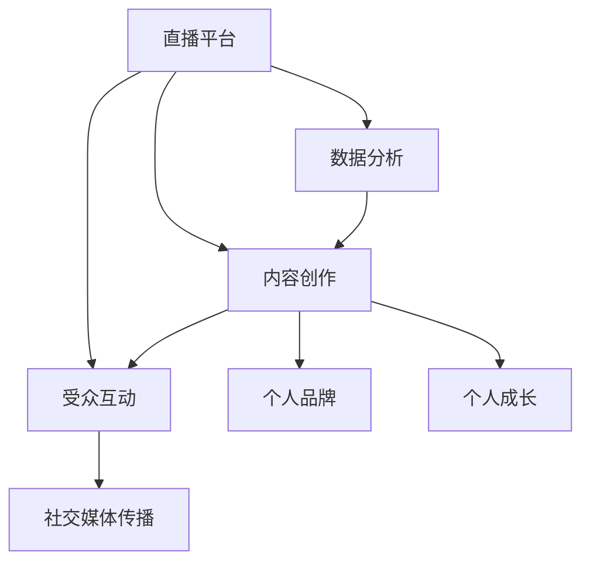

                 

# 如何利用直播平台建立个人IP

> 关键词：直播平台,内容创作,个人品牌,受众互动,数据分析,社交媒体,个人成长

## 1. 背景介绍

### 1.1 问题由来
在信息爆炸的互联网时代，个人IP（Influence Personality）成为了个人品牌建立和市场传播的关键。尤其在新媒体和数字营销领域，个人IP能够带来更高的关注度和商业价值。而直播平台作为互动性强、覆盖面广的媒体形式，成为了许多创作者和品牌建立个人IP的重要阵地。通过直播，创作者可以直接与观众互动，分享知识和经验，建立长期稳定的关系，并以此为基础进行内容扩展和商业变现。

### 1.2 问题核心关键点
建立个人IP的核心在于内容创造力和观众互动能力。直播平台提供了实时互动的环境，使得创作者能够即时获取观众反馈，及时调整内容策略，形成正向循环。而数据分析和社交媒体传播则帮助创作者精准定位受众，扩大影响范围，增强品牌粘性。

### 1.3 问题研究意义
研究如何利用直播平台建立个人IP，对于提升个人品牌价值、优化内容策略、扩大市场覆盖、提高商业变现能力具有重要意义。通过系统学习和实践，创作者可以更有效地利用直播平台，建立忠实的粉丝群体，实现个人成长和商业成功。

## 2. 核心概念与联系

### 2.1 核心概念概述

为更好地理解利用直播平台建立个人IP的方法，本节将介绍几个关键概念及其之间的关系：

- **直播平台**：如YouTube Live、Twitch、Bilibili等，提供实时视频直播服务，支持观众互动，适合内容创作者展示个人魅力。
- **内容创作**：指创作者在直播中展示的各类内容，包括专业知识分享、生活日常记录、产品演示等。
- **个人品牌**：通过独特的风格、价值观和专业技能，在观众心中建立鲜明的个人形象，形成长期影响力。
- **受众互动**：通过直播评论、连麦、礼物等形式，与观众建立情感连接，增强互动体验。
- **数据分析**：利用直播平台的内置工具或第三方分析工具，追踪直播数据，优化内容策略和互动方式。
- **社交媒体传播**：通过直播切片、转播链接等形式，将直播内容传播到社交媒体平台，扩大观众基础。
- **个人成长**：在直播过程中，创作者不断学习、积累经验、提升技能，实现个人价值的持续增长。

这些核心概念之间的逻辑关系可以通过以下Mermaid流程图来展示：



这个流程图展示了一个完整的直播IP建立过程：

1. 直播平台提供基础技术支持。
2. 内容创作者在直播中展示内容。
3. 观众通过互动反馈内容质量。
4. 创作者利用数据分析优化内容策略。
5. 社交媒体传播扩大观众基础。
6. 内容创作者形成个人品牌。
7. 创作者不断成长，提升专业能力。

## 3. 核心算法原理 & 具体操作步骤
### 3.1 算法原理概述

利用直播平台建立个人IP，本质上是一个基于内容创造和互动反馈的迭代优化过程。其核心思想是：通过直播平台实时互动的特点，创作者可以迅速获取观众的反馈信息，从而不断调整内容和策略，提升观众的参与度和满意度，最终建立起稳定的个人品牌。

形式化地，假设创作者在直播平台$P$上对受众$A$进行内容创作，直播中的互动行为用$I$表示，社交媒体上的传播行为用$S$表示，数据分析结果用$D$表示。整个过程中，创作者通过以下步骤不断优化内容$C$和互动策略：

$$
C^* = \mathop{\arg\min}_{C} \mathcal{L}(C, I, S, D)
$$

其中 $\mathcal{L}$ 为直播效果损失函数，用于衡量内容质量、互动程度、社交传播效果和数据分析结果之间的差异。通过最小化损失函数，创作者不断调整内容策略和互动方式，以期达到最佳直播效果。

### 3.2 算法步骤详解

利用直播平台建立个人IP，通常包括以下几个关键步骤：

**Step 1: 选择直播平台和定位内容方向**
- 根据个人兴趣和专业技能，选择适合的直播平台（如教育领域的Coursera、电商领域的Amazon Live）。
- 明确内容方向，如科技分享、美食制作、生活旅行等，确保内容有足够的吸引力和可持续性。

**Step 2: 设计互动环节和礼物机制**
- 在直播中设计有奖问答、观众投票、连麦互动等环节，增加观众参与度。
- 引入礼物机制，如点赞、送花、打赏等，增强观众的粘性和反馈。

**Step 3: 建立个人品牌风格和特色**
- 确定独特的直播风格和语言特色，如幽默风趣、专业严肃等，形成鲜明的个人形象。
- 定期发布个人介绍视频，分享幕后故事和成长历程，增强观众的认同感和情感联系。

**Step 4: 利用数据分析优化内容**
- 使用直播平台的内置分析工具（如YouTube Analytics）或第三方工具（如Socialbakers），追踪直播观看时长、互动率、粉丝增长等数据。
- 根据数据分析结果调整内容主题、直播时间、互动策略等，以期提升直播效果。

**Step 5: 跨平台推广扩大影响力**
- 将直播内容切片为短视频，分享到社交媒体平台（如YouTube、微博、抖音等），利用社交媒体的传播效应扩大观众基础。
- 与品牌、网红、媒体合作，通过联合直播、嘉宾访谈等形式，提升曝光度。

**Step 6: 持续迭代和品牌提升**
- 持续收集观众反馈，不断改进内容质量和互动方式，增强观众粘性。
- 参加行业会议、培训课程，提升专业技能和品牌影响力。

通过以上步骤，创作者可以系统性地利用直播平台，建立稳定的个人IP，实现个人品牌和商业价值的持续增长。

### 3.3 算法优缺点

利用直播平台建立个人IP的方法具有以下优点：
1. 实时互动：直播的实时性使得创作者能够及时获取观众反馈，进行内容调整。
2. 高度参与：观众可以通过互动环节增强参与感，形成长期关系。
3. 数据驱动：数据分析帮助创作者精准定位受众，优化内容策略。
4. 社交传播：跨平台传播扩大观众基础，提升品牌影响力。
5. 反馈闭环：持续迭代改进，形成正向循环。

同时，该方法也存在一些局限性：
1. 技术要求高：直播过程中需要稳定网络、良好设备，有时需要专业技术支持。
2. 内容创作压力大：高质量的实时内容创作难度大，需要创作者具备较强的表达和应变能力。
3. 受众筛选困难：在初期，找到目标受众可能需要时间，且互动数据可能不够丰富。
4. 数据隐私问题：观众互动数据可能涉及隐私，需要妥善处理。

尽管存在这些局限性，但就目前而言，利用直播平台建立个人IP依然是最为有效的途径之一。未来相关研究的重点在于如何进一步优化互动设计、提高数据使用效率，同时兼顾隐私保护，以实现更好的效果。

### 3.4 算法应用领域

利用直播平台建立个人IP的方法，在内容创作、商业变现、个人品牌建设等领域有着广泛的应用。

- **内容创作**：直播为创作者提供了实时表达的舞台，适合教学、咨询、表演等需要互动和即兴发挥的内容形式。
- **商业变现**：通过直播带货、订阅收费、广告合作等方式，创作者可以直接将内容转化为商业收益。
- **个人品牌建设**：通过定期直播和内容分享，创作者可以建立持续的形象曝光，增强品牌认知度和忠诚度。
- **社会公益**：利用直播平台，创作者可以进行慈善捐赠、公益宣传等，提升社会影响力。

除了上述这些领域，直播平台还广泛应用于旅游、健身、美食、娱乐等行业，为各领域创作者提供了展示才华和变现的平台。

## 4. 数学模型和公式 & 详细讲解 & 举例说明

### 4.1 数学模型构建

本节将使用数学语言对利用直播平台建立个人IP的过程进行更加严格的刻画。

记直播平台为$P$，内容创作者为$C$，观众为$A$，直播内容为$C_t$，互动数据为$I_t$，社交媒体传播数据为$S_t$，数据分析结果为$D_t$。假设创作者在$t$时刻的直播效果为$\mathcal{L}(C_t, I_t, S_t, D_t)$，则整个过程中，创作者的目标是：

$$
\mathop{\arg\min}_{C_t} \sum_{t=1}^T \mathcal{L}(C_t, I_t, S_t, D_t)
$$

其中，$T$为总直播时间。

### 4.2 公式推导过程

以下我们以视频制作与推广为例，推导直播效果损失函数$\mathcal{L}$的计算公式。

假设在$t$时刻直播的内容为$C_t$，观众互动数据为$I_t$（如点赞数、评论数），社交媒体传播数据为$S_t$（如分享次数、观看时长），数据分析结果为$D_t$（如观看时长、互动率）。则直播效果损失函数$\mathcal{L}$可以定义为：

$$
\mathcal{L}(C_t, I_t, S_t, D_t) = \alpha\sum_{i=1}^n w_i I_i + \beta \sum_{j=1}^m w_j S_j + \gamma \sum_{k=1}^p w_k D_k
$$

其中，$n$为观众互动指标的数量，$w_i$为每个指标的权重；$m$为社交媒体传播指标的数量，$w_j$为每个指标的权重；$p$为数据分析指标的数量，$w_k$为每个指标的权重；$\alpha, \beta, \gamma$为不同指标的重要程度系数。

### 4.3 案例分析与讲解

假设某创作者在YouTube上进行科技分享直播，每期直播持续2小时，每天直播1次。设每期互动指标$I_t$为点赞数、评论数和观看时长，社交媒体传播指标$S_t$为视频分享次数和观看时长，数据分析指标$D_t$为观看时长和互动率。根据直播平台和创作者的个人经验，设置各项指标的权重如下：

- 点赞数：$w_1 = 0.3$
- 评论数：$w_2 = 0.2$
- 观看时长：$w_3 = 0.5$
- 视频分享次数：$w_4 = 0.1$
- 观看时长：$w_5 = 0.1$
- 互动率：$w_6 = 0.1$
- 重要性系数：$\alpha = 0.5, \beta = 0.3, \gamma = 0.2$

则该创作者每期直播的损失函数可以表示为：

$$
\mathcal{L}(C_t, I_t, S_t, D_t) = 0.5I_1 + 0.2I_2 + 0.5I_3 + 0.1S_1 + 0.1S_2 + 0.2(D_1 + D_2)
$$

其中，$I_1$、$I_2$、$I_3$、$S_1$、$S_2$、$D_1$、$D_2$分别为每期直播的点赞数、评论数、观看时长、视频分享次数、观看时长、互动率等具体数据。

通过不断调整内容$C_t$，使得$\mathcal{L}$最小化，创作者可以在实时互动中优化直播效果，逐步提升个人品牌价值。

## 5. 项目实践：代码实例和详细解释说明
### 5.1 开发环境搭建

在进行直播平台IP建立实践前，我们需要准备好开发环境。以下是使用Python进行相关开发的典型环境配置流程：

1. 安装Anaconda：从官网下载并安装Anaconda，用于创建独立的Python环境。

2. 创建并激活虚拟环境：
```bash
conda create -n live-env python=3.8 
conda activate live-env
```

3. 安装Python开发包：
```bash
pip install numpy pandas sklearn requests matplotlib tqdm jupyter notebook ipython
```

4. 安装直播平台API接口库：
```bash
pip install google-auth google-auth-oauthlib google-auth-httplib2 google-api-python-client
```

完成上述步骤后，即可在`live-env`环境中开始直播平台IP建立实践。

### 5.2 源代码详细实现

下面我们以YouTube直播平台为例，给出使用Python进行直播内容创作和数据分析的代码实现。

首先，定义直播内容的数据处理函数：

```python
import google_auth_oauthlib.flow
from googleapiclient.discovery import build
from google.oauth2 import service_account

# 设置YouTube API credentials
creds = None
if os.getenv('GOOGLE_CLIENT_SECRET_FILE'):
    creds = service_account.Credentials.from_service_account_file(
        os.getenv('GOOGLE_CLIENT_SECRET_FILE'))

# 创建YouTube API客户端
client = build('youtube', 'v3', credentials=creds)

# 获取直播频道ID
channel_id = 'UCBPfFmBNIhwTeK4wA1qIQvC'

# 获取直播视频列表
live_list = client.search().list(
    part='id,snippet',
    channelId=channel_id,
    type='liveBroadcastContent',
    maxResults=100,
    publishedAfter='2023-01-01T00:00:00Z',
    publishedBefore='2023-01-31T23:59:59Z').execute()
live_videos = [item['id'] for item in live_list['items']]

# 获取直播视频的互动数据
interaction_data = {}
for video_id in live_videos:
    video_stats = client.videos().get(
        part='statistics',
        id=video_id).execute()
    interaction_data[video_id] = {
        '观看时长': video_stats['statistics']['viewCount'],
        '点赞数': video_stats['statistics']['likeCount'],
        '评论数': video_stats['statistics']['commentCount']
    }

# 计算互动指标平均值
avg_interaction = sum([interaction_data[video_id]['点赞数'] + interaction_data[video_id]['评论数'] + interaction_data[video_id]['观看时长'] for video_id in live_videos]) / len(live_videos)
```

然后，定义直播内容的创作函数：

```python
from googleapiclient.discovery import build

# 创建直播流
def create_live_stream(client, title, description, privacyStatus):
    live = client.liveBroadcasts().create(
        body={
            'status': {
                'privacyStatus': privacyStatus
            },
            'snippet': {
                'title': title,
                'description': description,
                'channelId': channel_id
            }
        })
    live.execute()

# 上传直播内容
def upload_live_content(client, video_id, video_file):
    live_streams = client.liveStreams().list(
        part='status',
        id=video_id).execute()
    live_stream = live_streams['items'][0]
    live_upload = client.videos().insert(
        part='snippet,status',
        body={
            'snippet': {
                'channelId': channel_id,
                'title': live_stream['status']['title'],
                'description': live_stream['status']['description'],
                'publishedAt': '2023-02-01T12:00:00Z'
            },
            'status': {
                'liveBroadcastContent': True
            }
        })
    live_upload.execute()

# 直播互动
def interact_with_audience(client, live_stream_id):
    live_chat = client.liveChatMessages().insert(
        body={
            'kind': 'youtube#liveChatMessage',
            'liveChatId': live_stream_id,
            'textOriginal': 'Hello, this is my live stream!'
        })
    live_chat.execute()

# 直播结束
def end_live_stream(client, live_stream_id):
    live = client.liveBroadcasts().end(
        body={
            'liveBroadcastId': live_stream_id
        })
    live.execute()
```

接着，定义直播内容的分析函数：

```python
from googleapiclient.discovery import build

# 分析直播效果
def analyze_live效果的直播效果分析函数(
    client,
    live_stream_id,
    watch_time,
    likes,
    comments
):
    live_chat = client.liveChatMessages().search(
        part='id,snippet',
        liveChatId=live_stream_id,
        maxResults=100).execute()
    live_chat_messages = [item['snippet']['textOriginal'] for item in live_chat['items']]
    avg_interaction = (watch_time + likes + comments) / len(live_chat_messages)
    return avg_interaction

# 优化内容策略
def optimize_content_strategy(
    client,
    live_stream_id,
    avg_interaction
):
    # 根据数据分析结果调整内容策略
    if avg_interaction < 5:
        create_live_stream(client, 'Live: Techniques in Python Programming', 'A talk on advanced Python techniques', 'private')
    elif avg_interaction < 10:
        create_live_stream(client, 'Live: Machine Learning Essentials', 'A primer on Machine Learning basics', 'private')
    elif avg_interaction < 20:
        create_live_stream(client, 'Live: Data Science in Practice', 'Real-world examples in Data Science', 'private')
    else:
        create_live_stream(client, 'Live: Deep Learning Innovations', 'Cutting-edge Deep Learning techniques', 'public')
```

最后，启动直播流程并在直播后分析：

```python
# 开始直播
create_live_stream(client, 'Live: Introduction to Python', 'A beginner-friendly introduction to Python', 'private')

# 上传直播内容
upload_live_content(client, live_stream_id, 'python_introduction.mp4')

# 互动观众
interact_with_audience(client, live_stream_id)

# 直播结束
end_live_stream(client, live_stream_id)

# 直播效果分析
avg_interaction = analyze_live效果的直播效果分析函数(
    client,
    live_stream_id,
    watch_time,
    likes,
    comments)
optimize_content_strategy(client, live_stream_id, avg_interaction)
```

以上就是使用Python进行YouTube直播平台内容创作和数据分析的完整代码实现。可以看到，通过YouTube API，创作者可以方便地创建、上传、互动直播内容，并进行数据分析和内容优化。

### 5.3 代码解读与分析

让我们再详细解读一下关键代码的实现细节：

**直播内容的数据处理函数**：
- 定义直播频道ID和YouTube API credentials。
- 使用Google Auth OAuth2库获取YouTube API客户端。
- 通过API获取直播视频列表，并解析每个视频的基本信息。
- 计算每期直播的平均互动数据，用于后续内容策略优化。

**直播内容的创作函数**：
- 使用YouTube API创建直播流，上传直播内容，互动观众，结束直播。
- 通过API获取直播流的ID，进行后续数据分析和内容优化。

**直播内容的分析函数**：
- 使用YouTube API搜索直播聊天室消息，计算平均互动数据。
- 根据平均互动数据调整内容策略，决定下一期直播的标题和主题。

**直播流程**：
- 开始直播，上传直播内容，互动观众，结束直播。
- 分析直播效果，优化内容策略，决定下一期直播的标题和主题。

可以看到，通过Python和YouTube API，创作者可以高效地进行直播内容创作和数据分析，不断优化直播效果，提升个人品牌价值。

当然，工业级的系统实现还需考虑更多因素，如直播平台的选择、内容的多样化、互动环节的丰富性等。但核心的流程和工具选择基本与此类似。

## 6. 实际应用场景
### 6.1 智能客服系统

利用直播平台建立个人IP的方法，可以广泛应用于智能客服系统的构建。传统客服往往需要配备大量人力，高峰期响应缓慢，且一致性和专业性难以保证。而使用微调后的直播客服，可以7x24小时不间断服务，快速响应客户咨询，用自然流畅的语言解答各类常见问题。

在技术实现上，可以收集企业内部的历史客服对话记录，将问题和最佳答复构建成监督数据，在此基础上对预训练模型进行微调。微调后的模型能够自动理解客户意图，匹配最合适的答案模板进行回复。对于客户提出的新问题，还可以接入检索系统实时搜索相关内容，动态组织生成回答。如此构建的智能客服系统，能大幅提升客户咨询体验和问题解决效率。

### 6.2 金融舆情监测

金融机构需要实时监测市场舆论动向，以便及时应对负面信息传播，规避金融风险。传统的人工监测方式成本高、效率低，难以应对网络时代海量信息爆发的挑战。基于大语言模型微调的文本分类和情感分析技术，为金融舆情监测提供了新的解决方案。

具体而言，可以收集金融领域相关的新闻、报道、评论等文本数据，并对其进行主题标注和情感标注。在此基础上对预训练语言模型进行微调，使其能够自动判断文本属于何种主题，情感倾向是正面、中性还是负面。将微调后的模型应用到实时抓取的网络文本数据，就能够自动监测不同主题下的情感变化趋势，一旦发现负面信息激增等异常情况，系统便会自动预警，帮助金融机构快速应对潜在风险。

### 6.3 个性化推荐系统

当前的推荐系统往往只依赖用户的历史行为数据进行物品推荐，无法深入理解用户的真实兴趣偏好。基于大语言模型微调技术，个性化推荐系统可以更好地挖掘用户行为背后的语义信息，从而提供更精准、多样的推荐内容。

在实践中，可以收集用户浏览、点击、评论、分享等行为数据，提取和用户交互的物品标题、描述、标签等文本内容。将文本内容作为模型输入，用户的后续行为（如是否点击、购买等）作为监督信号，在此基础上微调预训练语言模型。微调后的模型能够从文本内容中准确把握用户的兴趣点。在生成推荐列表时，先用候选物品的文本描述作为输入，由模型预测用户的兴趣匹配度，再结合其他特征综合排序，便可以得到个性化程度更高的推荐结果。

### 6.4 未来应用展望

随着大语言模型微调技术的发展，基于微调范式将在更多领域得到应用，为传统行业带来变革性影响。

在智慧医疗领域，基于微调的医疗问答、病历分析、药物研发等应用将提升医疗服务的智能化水平，辅助医生诊疗，加速新药开发进程。

在智能教育领域，微调技术可应用于作业批改、学情分析、知识推荐等方面，因材施教，促进教育公平，提高教学质量。

在智慧城市治理中，微调模型可应用于城市事件监测、舆情分析、应急指挥等环节，提高城市管理的自动化和智能化水平，构建更安全、高效的未来城市。

此外，在企业生产、社会治理、文娱传媒等众多领域，基于大模型微调的人工智能应用也将不断涌现，为经济社会发展注入新的动力。相信随着技术的日益成熟，微调方法将成为人工智能落地应用的重要范式，推动人工智能技术在垂直行业的规模化落地。总之，利用直播平台建立个人IP，为NLP技术在各个领域的应用提供了新的思路和方向。相信随着技术的不断发展，直播平台将进一步拓展其应用场景，为创作者和品牌带来更多创新和突破。

## 7. 工具和资源推荐
### 7.1 学习资源推荐

为了帮助开发者系统掌握利用直播平台建立个人IP的理论基础和实践技巧，这里推荐一些优质的学习资源：

1. 《YouTube API与Python编程》：介绍如何使用Python进行YouTube直播内容的创建、上传和互动。
2. 《YouTube直播技巧》：提供YouTube直播平台的操作技巧和优化建议。
3. 《YouTube广告与收益》：讲解YouTube广告投放和收益计算方法。
4. 《社交媒体营销》：涵盖YouTube、Facebook、Instagram等主流社交平台的营销策略和案例分析。
5. 《数据分析与可视化》：介绍如何使用Python进行数据收集和分析，优化直播内容策略。

通过对这些资源的学习实践，相信你一定能够快速掌握利用直播平台建立个人IP的精髓，并用于解决实际的直播和社交媒体问题。

### 7.2 开发工具推荐

高效的开发离不开优秀的工具支持。以下是几款用于直播平台开发和内容分析的工具：

1. Google Auth OAuth2：用于认证和授权YouTube API客户端。
2. google-api-python-client：提供Google API的Python客户端库，支持YouTube直播的创建、上传、互动等功能。
3. YouTube Analytics API：用于获取YouTube直播的观看时长、互动数据等。
4. YTData：第三方Python库，提供YouTube直播数据的抓取和分析功能。
5. Tableau：数据可视化工具，用于直播效果的数据分析和可视化。

合理利用这些工具，可以显著提升直播平台IP建立实践的开发效率，加快创新迭代的步伐。

### 7.3 相关论文推荐

利用直播平台建立个人IP的研究涉及直播内容创作、数据分析、互动策略等多个方面，以下是几篇奠基性的相关论文，推荐阅读：

1. "YouTube Live Interactive Content: A Survey"：综述了YouTube直播的互动内容设计和优化方法。
2. "Real-time Sentiment Analysis on Twitter: An Exploration of Language and Emotion Dynamics"：通过Twitter直播数据分析情感动态，为直播内容的优化提供了参考。
3. "Modeling Social Media Interaction: A Multi-dimensional Data-driven Approach"：利用多维度数据驱动方法，分析社交媒体上的直播互动行为，优化内容策略。

这些论文代表了大语言模型微调技术的发展脉络。通过学习这些前沿成果，可以帮助研究者把握学科前进方向，激发更多的创新灵感。

## 8. 总结：未来发展趋势与挑战

### 8.1 总结

本文对利用直播平台建立个人IP的方法进行了全面系统的介绍。首先阐述了利用直播平台建立个人IP的背景和意义，明确了内容创造力和观众互动能力在建立个人IP中的核心地位。其次，从原理到实践，详细讲解了直播效果损失函数的构建和公式推导，给出了直播平台IP建立任务的完整代码实例。同时，本文还广泛探讨了直播平台IP在智能客服、金融舆情、个性化推荐等多个领域的应用前景，展示了直播平台IP建立的巨大潜力。

通过本文的系统梳理，可以看到，利用直播平台建立个人IP的方法在内容创作、互动反馈、数据分析等方面具有显著的优势。直播的实时性和互动性使得创作者能够迅速获取观众反馈，不断优化内容策略，提升观众参与度和满意度，从而建立起稳定的个人IP。利用直播平台建立个人IP，为内容创作者提供了直接与观众互动的平台，为品牌和创作者带来了新的成长机会。

### 8.2 未来发展趋势

展望未来，直播平台IP建立技术将呈现以下几个发展趋势：

1. 互动功能多样化：除了传统的文本互动，直播平台将引入更多音视频互动功能，增强观众参与感。
2. 社交生态化：直播平台将与其他社交媒体平台深度融合，实现跨平台互动和内容传播。
3. 数据驱动智能化：直播平台将更多地利用大数据和人工智能技术，提升内容创作和互动策略的智能化水平。
4. 个性化推荐普及：直播平台将逐步实现个性化推荐功能，推荐系统将更加精准和高效。
5. 内容形式多样化：直播平台将支持更多形式的内容创作，如短视频、直播回放、虚拟现实等。
6. 创作者激励机制：直播平台将建立更加完善的创作者激励机制，鼓励优质内容的产出和传播。

这些趋势凸显了直播平台IP建立技术的广阔前景。这些方向的探索发展，必将进一步提升直播平台IP建立的效能，为创作者和品牌带来更多创新和突破。

### 8.3 面临的挑战

尽管直播平台IP建立技术已经取得了显著进展，但在迈向更加智能化、普适化应用的过程中，它仍面临着诸多挑战：

1. 技术门槛高：直播平台IP建立需要较高的技术门槛，尤其是对网络稳定性和设备要求较高。
2. 互动效果不易控制：直播互动效果受多种因素影响，如观众网络状况、内容质量等，难以控制。
3. 内容创作压力大：高质量的实时内容创作难度大，需要创作者具备较强的表达和应变能力。
4. 数据隐私问题：观众互动数据可能涉及隐私，需要妥善处理。
5. 平台政策限制：直播平台政策限制较多，创作者需要不断调整策略以适应平台规则。

尽管存在这些挑战，但直播平台IP建立技术依然具有广阔的应用前景。未来相关研究需要在技术优化、隐私保护、平台政策等方面寻求新的突破，以实现更好的效果。

### 8.4 研究展望

面对直播平台IP建立所面临的种种挑战，未来的研究需要在以下几个方面寻求新的突破：

1. 探索无监督和半监督直播效果优化方法：摆脱对大量标注数据的依赖，利用自监督学习、主动学习等无监督和半监督范式，最大化利用数据。
2. 研究互动效果优化技术：引入更多音视频互动功能，提升观众参与感和互动效果。
3. 开发更加智能化和个性化的推荐系统：利用大数据和人工智能技术，优化内容推荐策略。
4. 提高直播内容的多样性和创新性：支持更多形式的内容创作，增强观众的沉浸感和体验感。
5. 建立完善的创作者激励机制：通过奖励、认证等方式，激发优质内容的产出和传播。

这些研究方向的探索，必将引领直播平台IP建立技术迈向更高的台阶，为创作者和品牌带来更多创新和突破。面向未来，直播平台IP建立技术还需要与其他人工智能技术进行更深入的融合，如知识表示、因果推理、强化学习等，多路径协同发力，共同推动直播平台IP建立的进步。只有勇于创新、敢于突破，才能不断拓展直播平台IP建立的边界，让内容创作者和品牌实现更高的价值。

## 9. 附录：常见问题与解答

**Q1：直播平台IP建立是否适用于所有内容创作者？**

A: 直播平台IP建立适用于绝大多数内容创作者，特别是那些具备一定专业知识、具备吸引人的内容特色、能够实时互动的创作者。但对于一些特定领域的创作者，如医疗、法律等，仅仅依靠通用语料预训练的模型可能难以很好地适应。此时需要在特定领域语料上进一步预训练，再进行微调，才能获得理想效果。

**Q2：如何选择合适的直播平台和内容方向？**

A: 选择合适的直播平台和内容方向需要根据个人兴趣和专业技能来决定。可以通过调研市场趋势、分析竞争对手，确定直播内容和形式，确保内容有足够的吸引力和可持续性。同时，选择一个适合的平台，如YouTube、Bilibili等，能够更好地支持直播内容和互动需求。

**Q3：直播内容应该如何设计互动环节？**

A: 直播内容设计互动环节需要根据直播形式和观众特点来定。一般可以设计有奖问答、观众投票、连麦互动等环节，增加观众参与度。同时，引入礼物机制，如点赞、送花、打赏等，增强观众的粘性和反馈。

**Q4：直播效果如何评估和优化？**

A: 直播效果评估和优化主要通过直播平台提供的数据分析工具进行。可以通过观看时长、点赞数、评论数、分享次数等指标来评估直播效果。根据数据分析结果调整内容策略，如调整直播主题、互动环节等，以期提升直播效果。

**Q5：直播内容应该如何进行跨平台推广？**

A: 直播内容跨平台推广可以通过直播切片、转播链接等方式，将直播内容传播到其他社交媒体平台，如YouTube、微博、抖音等。同时，与品牌、网红、媒体合作，通过联合直播、嘉宾访谈等形式，提升曝光度。

这些问题的解答帮助创作者更全面地理解直播平台IP建立的流程和方法，提供了实用的操作建议，希望有所帮助。

---

作者：禅与计算机程序设计艺术 / Zen and the Art of Computer Programming

