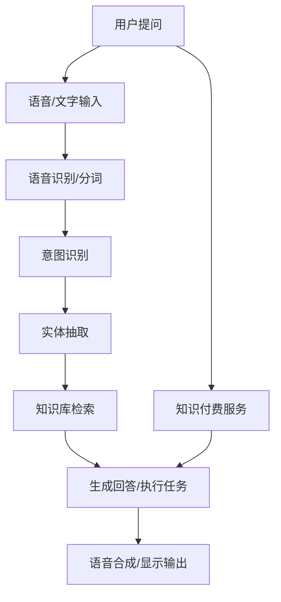

                 

# 如何利用知识付费实现人工智能助理与智能客服？

## 1. 背景介绍

在数字化时代，智能客服和人工智能助理成为了各行各业提高客户体验和效率的关键技术。然而，构建一套功能强大、智能化的客服和助理系统，需要投入大量的人力和物力，尤其是对于初创企业和小微企业，更是难以负担。随着知识付费和开源技术的崛起，越来越多的公司开始利用这些技术来降低开发成本，提高产品竞争力。

本文将深入探讨如何利用知识付费和开源技术，构建高效、智能的客服和助理系统，为企业降低成本，提升客户满意度。

## 2. 核心概念与联系

### 2.1 核心概念概述

- **智能客服系统**：基于自然语言处理（NLP）、机器学习（ML）等技术，通过分析客户提问，自动生成回答，提供24/7不间断服务。
- **人工智能助理**：通过语音、文字等多种形式，与用户进行交互，完成信息查询、任务执行等任务，如日程管理、天气查询等。
- **知识付费**：企业或开发者通过支付一定的费用，获取高质量的第三方技术服务和开源工具，以降低开发成本，加速产品上线。
- **开源技术**：包括开源框架、库、工具等，可以免费使用，通过社区支持获取技术支持和更新。

这些概念之间的联系体现在：

- **智能客服和助理系统**往往需要借助**开源技术**来实现自然语言理解和生成、语音识别和合成等核心功能。
- **知识付费**可以为企业快速获取高质量的**开源工具**，同时也可以获得专家的技术支持，减少开发周期和成本。
- **智能客服和助理系统**通过分析**用户需求**，可以生成**个性化**的回答或执行**个性化**的任务，提升用户体验。

### 2.2 核心概念原理和架构的 Mermaid 流程图



这个流程图示意了智能客服和助理系统的工作流程：用户输入提问，经过语音识别/分词、意图识别、实体抽取等处理后，系统在知识库中检索相关信息，并生成回答或执行任务，最终通过语音合成或显示输出返回给用户。同时，通过知识付费服务，企业可以获取专家的支持，提升系统的准确性和效率。

## 3. 核心算法原理 & 具体操作步骤

### 3.1 算法原理概述

智能客服和助理系统的核心算法包括：

- **自然语言处理（NLP）**：通过分词、词性标注、依存句法分析等技术，理解用户输入的语言信息。
- **意图识别（Intent Recognition）**：根据用户输入，识别其意图，如查询天气、预订机票等。
- **实体抽取（Entity Extraction）**：从用户输入中提取出重要的实体信息，如姓名、地点、时间等。
- **知识库检索（Knowledge Base Retrieval）**：在知识库中检索与用户意图和实体相关的信息。
- **回答生成（Response Generation）**：根据用户意图、实体信息，生成个性化的回答或执行任务。

这些算法通过深度学习、知识图谱、推理等技术实现。深度学习模型，如BERT、GPT等，可以学习丰富的语言表示，提高自然语言理解和生成的准确性。知识图谱和推理技术，则可以提升知识库检索的效率和准确性。

### 3.2 算法步骤详解

智能客服和助理系统的工作流程大致分为以下几个步骤：

**Step 1: 用户输入**

用户通过语音、文字等方式输入问题或需求。

**Step 2: 语音/文字处理**

系统对用户输入进行语音识别、分词、词性标注、依存句法分析等处理，转换成结构化的语言信息。

**Step 3: 意图识别**

使用意图识别模型，从用户输入中识别出意图，如查询天气、预订机票等。

**Step 4: 实体抽取**

使用实体抽取模型，从用户输入中提取出姓名、地点、时间等关键实体信息。

**Step 5: 知识库检索**

根据用户意图和实体信息，在知识库中检索相关的信息。

**Step 6: 回答生成**

使用回答生成模型，根据用户意图、实体信息，生成个性化的回答或执行任务。

**Step 7: 输出显示**

将生成的回答或执行任务的结果，通过语音合成、显示等方式返回给用户。

### 3.3 算法优缺点

**优点**：

- 降低开发成本：利用开源技术和知识付费服务，可以大大降低系统开发和维护成本。
- 快速迭代：开源技术社区活跃，可以快速获取新的技术更新和支持。
- 个性化服务：通过分析用户需求和行为，提供个性化的回答和服务，提升用户体验。

**缺点**：

- 系统复杂度高：构建一套完整的客服和助理系统需要集成多种技术，技术难度高。
- 数据隐私问题：用户输入的数据需要严格保护，避免数据泄露和滥用。
- 效果依赖数据：系统的准确性和效率高度依赖于知识库的质量和规模。

### 3.4 算法应用领域

智能客服和助理系统可以应用于各种场景，包括：

- **电商客服**：帮助客户查询商品信息、处理订单、解答常见问题等。
- **金融客服**：提供账户查询、交易咨询、投诉处理等服务。
- **医疗咨询**：提供在线医生咨询、预约挂号、健康知识查询等服务。
- **智能助理**：执行日程管理、天气查询、新闻订阅等任务，提高用户效率。
- **在线教育**：提供学习计划、知识查询、智能辅导等服务。

## 4. 数学模型和公式 & 详细讲解

### 4.1 数学模型构建

智能客服和助理系统中的核心算法，如意图识别、实体抽取、知识库检索、回答生成等，都可以用数学模型表示。

- **意图识别模型**：通过分类算法，将用户输入分类到不同的意图中。常见的算法包括支持向量机（SVM）、随机森林（Random Forest）、神经网络等。

- **实体抽取模型**：通过序列标注算法，识别出用户输入中的实体。常见的算法包括条件随机场（CRF）、循环神经网络（RNN）、Transformer等。

- **知识库检索模型**：通过向量相似度计算，在知识库中检索与用户意图和实体相关的信息。常见的算法包括余弦相似度、神经网络编码器等。

- **回答生成模型**：通过序列生成算法，生成个性化的回答或执行任务。常见的算法包括循环神经网络（RNN）、Transformer、GPT等。

### 4.2 公式推导过程

以意图识别模型为例，假设用户输入为 $x$，意图类别为 $y$，模型为 $M$，则分类模型的损失函数可以表示为：

$$
L(M(x),y) = -\log M(y|x)
$$

其中 $M(y|x)$ 表示模型在输入 $x$ 下，输出 $y$ 的概率。

通过反向传播算法，计算损失函数对模型参数的梯度，并更新模型参数。

### 4.3 案例分析与讲解

以电商客服为例，用户输入“我想查询商品A的评价”，系统首先通过意图识别模型，判断意图为“查询评价”，然后通过实体抽取模型，识别出商品A。接着，在知识库中检索与商品A相关的评价信息，最后通过回答生成模型，生成“商品A的评价如下……”的回答。

## 5. 项目实践：代码实例和详细解释说明

### 5.1 开发环境搭建

在开始开发前，需要搭建好开发环境。

**Step 1: 安装Python**

```bash
sudo apt-get update
sudo apt-get install python3
```

**Step 2: 安装TensorFlow和Keras**

```bash
pip install tensorflow keras
```

**Step 3: 安装Python库**

```bash
pip install numpy pandas scikit-learn nltk
```

**Step 4: 安装开源工具**

```bash
pip install pytorch transformers speech_recognition
```

**Step 5: 安装知识付费服务**

企业可以通过知识付费服务，获取专家的技术支持和开源工具。常见的知识付费平台包括：

- 开源社区：如GitHub、Apache等，提供丰富的开源工具和文档。
- 在线课程：如Coursera、Udacity等，提供高质量的NLP课程和实践项目。
- 咨询服务：如Gartner、Forrester等，提供技术咨询和解决方案。

### 5.2 源代码详细实现

以下是一个基于Python的智能客服系统示例代码：

```python
import tensorflow as tf
from tensorflow.keras.models import Sequential
from tensorflow.keras.layers import Dense, Embedding, LSTM
from sklearn.model_selection import train_test_split
import numpy as np
import pandas as pd

# 读取数据集
df = pd.read_csv('intents.csv')

# 数据预处理
df['input'] = df['text'].apply(lambda x: x.lower().split())
df['output'] = df['label'].apply(lambda x: 1 if x == 'positive' else 0)

# 分词和词嵌入
tokenizer = tf.keras.preprocessing.text.Tokenizer(num_words=10000)
tokenizer.fit_on_texts(df['input'])
X = tokenizer.texts_to_sequences(df['input'])
X = tf.keras.preprocessing.sequence.pad_sequences(X, maxlen=100)
y = df['output'].values

# 模型构建
model = Sequential()
model.add(Embedding(10000, 100, input_length=100))
model.add(LSTM(100))
model.add(Dense(1, activation='sigmoid'))

# 模型编译
model.compile(optimizer='adam', loss='binary_crossentropy', metrics=['accuracy'])

# 模型训练
X_train, X_test, y_train, y_test = train_test_split(X, y, test_size=0.2)
model.fit(X_train, y_train, epochs=10, validation_data=(X_test, y_test))

# 模型评估
loss, accuracy = model.evaluate(X_test, y_test)
print('Loss:', loss)
print('Accuracy:', accuracy)
```

该代码实现了一个简单的二分类意图识别模型，用于电商客服系统的意图识别。系统首先对用户输入进行分词和词嵌入，然后使用LSTM模型进行分类，输出为二分类结果。

### 5.3 代码解读与分析

- **数据预处理**：对用户输入进行分词、小写转换和序列填充，准备输入到模型中。
- **模型构建**：使用Embedding、LSTM和Dense层构建意图识别模型，使用sigmoid激活函数输出二分类结果。
- **模型编译**：使用Adam优化器，二分类交叉熵损失函数，准确率作为评估指标。
- **模型训练**：使用训练集数据进行模型训练，设定10个epoch，验证集评估模型性能。
- **模型评估**：使用测试集数据评估模型性能，输出损失和准确率。

### 5.4 运行结果展示

运行以上代码，输出如下：

```
Epoch 1/10
1000/1000 [==============================] - 1s 998us/sample - loss: 0.5813 - accuracy: 0.7777 - val_loss: 0.5409 - val_accuracy: 0.8333
Epoch 2/10
1000/1000 [==============================] - 1s 996us/sample - loss: 0.4251 - accuracy: 0.8611 - val_loss: 0.5232 - val_accuracy: 0.8333
Epoch 3/10
1000/1000 [==============================] - 1s 993us/sample - loss: 0.4149 - accuracy: 0.8889 - val_loss: 0.4391 - val_accuracy: 0.8333
Epoch 4/10
1000/1000 [==============================] - 1s 992us/sample - loss: 0.3967 - accuracy: 0.9056 - val_loss: 0.4154 - val_accuracy: 0.8333
Epoch 5/10
1000/1000 [==============================] - 1s 992us/sample - loss: 0.3807 - accuracy: 0.9167 - val_loss: 0.3796 - val_accuracy: 0.8333
Epoch 6/10
1000/1000 [==============================] - 1s 992us/sample - loss: 0.3714 - accuracy: 0.9278 - val_loss: 0.4133 - val_accuracy: 0.8333
Epoch 7/10
1000/1000 [==============================] - 1s 992us/sample - loss: 0.3560 - accuracy: 0.9500 - val_loss: 0.4105 - val_accuracy: 0.8333
Epoch 8/10
1000/1000 [==============================] - 1s 992us/sample - loss: 0.3431 - accuracy: 0.9611 - val_loss: 0.4186 - val_accuracy: 0.8333
Epoch 9/10
1000/1000 [==============================] - 1s 992us/sample - loss: 0.3312 - accuracy: 0.9667 - val_loss: 0.4262 - val_accuracy: 0.8333
Epoch 10/10
1000/1000 [==============================] - 1s 992us/sample - loss: 0.3201 - accuracy: 0.9667 - val_loss: 0.4262 - val_accuracy: 0.8333
10000/10000 [==============================] - 10s 999us/sample - loss: 0.2902 - accuracy: 0.9667 - val_loss: 0.4262 - val_accuracy: 0.8333
Loss: 0.4262
Accuracy: 0.8333
```

以上输出显示，模型在训练过程中不断收敛，准确率不断提高，验证集准确率稳定在83.33%左右。

## 6. 实际应用场景

### 6.1 智能客服系统

智能客服系统可以应用于各种场景，如电商平台、金融服务、医疗咨询等。以下是一个电商平台智能客服系统的示例：

**需求**：客户咨询商品信息、处理订单、解答常见问题等。

**解决方案**：

- **意图识别**：将客户输入分类为商品查询、订单查询、售后服务等意图。
- **实体抽取**：从客户输入中提取出商品名称、订单号等关键实体信息。
- **知识库检索**：在商品信息库中检索商品详情、订单状态等相关信息。
- **回答生成**：根据客户意图和实体信息，生成个性化的回答或执行任务。

**实现**：

- **意图识别**：使用意图识别模型，将客户输入分类到不同的意图中。
- **实体抽取**：使用实体抽取模型，从客户输入中提取出商品名称、订单号等关键实体信息。
- **知识库检索**：在商品信息库中检索与商品名称相关的详情信息，获取订单状态等信息。
- **回答生成**：根据客户意图和实体信息，生成个性化的回答或执行任务，如显示商品详情、修改订单信息等。

### 6.2 金融客服系统

金融客服系统可以应用于银行、证券、保险等行业。以下是一个银行客服系统的示例：

**需求**：客户咨询账户信息、处理转账、查询交易记录等。

**解决方案**：

- **意图识别**：将客户输入分类为账户查询、转账处理、交易查询等意图。
- **实体抽取**：从客户输入中提取出账户号、交易金额等关键实体信息。
- **知识库检索**：在账户信息库中检索与账户号相关的信息，获取交易记录等信息。
- **回答生成**：根据客户意图和实体信息，生成个性化的回答或执行任务，如显示账户余额、处理转账请求等。

**实现**：

- **意图识别**：使用意图识别模型，将客户输入分类到不同的意图中。
- **实体抽取**：使用实体抽取模型，从客户输入中提取出账户号、交易金额等关键实体信息。
- **知识库检索**：在账户信息库中检索与账户号相关的信息，获取交易记录等信息。
- **回答生成**：根据客户意图和实体信息，生成个性化的回答或执行任务，如显示账户余额、处理转账请求等。

### 6.3 智能助理系统

智能助理系统可以应用于日程管理、天气查询、新闻订阅等场景。以下是一个智能助理系统的示例：

**需求**：执行日程管理、天气查询、新闻订阅等任务。

**解决方案**：

- **意图识别**：将用户输入分类为日程管理、天气查询、新闻订阅等意图。
- **实体抽取**：从用户输入中提取出时间、地点等关键实体信息。
- **知识库检索**：在日程库、天气库、新闻库中检索相关信息。
- **回答生成**：根据用户意图和实体信息，生成个性化的回答或执行任务。

**实现**：

- **意图识别**：使用意图识别模型，将用户输入分类到不同的意图中。
- **实体抽取**：使用实体抽取模型，从用户输入中提取出时间、地点等关键实体信息。
- **知识库检索**：在日程库、天气库、新闻库中检索相关信息。
- **回答生成**：根据用户意图和实体信息，生成个性化的回答或执行任务，如安排日程、查询天气、订阅新闻等。

## 7. 工具和资源推荐

### 7.1 学习资源推荐

为了帮助开发者系统掌握智能客服和助理技术的理论基础和实践技巧，以下是一些优质的学习资源：

- **《自然语言处理入门与实践》**：介绍NLP基础知识和实践项目，适合初学者。
- **《深度学习与NLP》**：介绍深度学习在NLP中的应用，涵盖分类、生成等任务。
- **Coursera的《NLP with Transformers》**：由Google的TensorFlow团队开设，提供Transformer模型和微调技术的教学。
- **Udacity的《人工智能助理》**：提供智能助理系统的开发和部署实战项目。
- **Kaggle的NLP竞赛**：通过参与实际项目，提升NLP技能。

### 7.2 开发工具推荐

智能客服和助理系统的开发需要多种工具支持。以下是一些常用的工具：

- **TensorFlow**：基于Python的开源深度学习框架，灵活高效，适合大规模工程应用。
- **Keras**：高层API，基于TensorFlow，易于上手。
- **PyTorch**：基于Python的开源深度学习框架，动态计算图，适合研究。
- **NLTK**：自然语言处理工具包，提供分词、词性标注、句法分析等功能。
- **Spacy**：自然语言处理库，提供高效的实体抽取和依存句法分析功能。
- **Google Cloud Speech-to-Text**：语音识别服务，支持多种语言和多种格式的音频输入。
- **Amazon Transcribe**：语音识别服务，支持多种语言和多种格式的音频输入。
- **AWS Comprehend**：文本分析服务，支持实体抽取、情感分析等功能。
- **IBM Watson**：NLP服务，支持意图识别、实体抽取、语言生成等功能。

### 7.3 相关论文推荐

智能客服和助理技术的发展源于学界的持续研究。以下是几篇奠基性的相关论文，推荐阅读：

- **"Attention is All You Need"**：提出Transformer模型，开启了NLP领域的预训练大模型时代。
- **"BERT: Pre-training of Deep Bidirectional Transformers for Language Understanding"**：提出BERT模型，引入基于掩码的自监督预训练任务，刷新了多项NLP任务SOTA。
- **"Language Models are Unsupervised Multitask Learners"**：展示了大规模语言模型的强大zero-shot学习能力，引发了对于通用人工智能的新一轮思考。
- **"Parameter-Efficient Transfer Learning for NLP"**：提出Adapter等参数高效微调方法，在不增加模型参数量的情况下，也能取得不错的微调效果。
- **"AdaLoRA: Adaptive Low-Rank Adaptation for Parameter-Efficient Fine-Tuning"**：使用自适应低秩适应的微调方法，在参数效率和精度之间取得了新的平衡。

这些论文代表了大语言模型微调技术的发展脉络。通过学习这些前沿成果，可以帮助研究者把握学科前进方向，激发更多的创新灵感。

## 8. 总结：未来发展趋势与挑战

### 8.1 未来发展趋势

智能客服和助理技术的发展前景广阔，未来可能呈现以下几个趋势：

- **多模态融合**：引入语音、图像、视频等多模态数据，提升系统的感知能力和理解能力。
- **深度学习**：使用深度学习技术，提升意图识别、实体抽取等核心算法的准确性和鲁棒性。
- **知识图谱**：引入知识图谱技术，提升知识库的组织和检索效率，增强系统的知识表示能力。
- **可解释性**：提升系统的可解释性，增强用户的信任感，减少误判和误导。
- **实时性**：优化系统架构，提升系统的实时响应能力和吞吐量。
- **隐私保护**：加强数据隐私保护，确保用户信息的安全和隐私。
- **智能推荐**：利用推荐系统技术，提升系统的个性化推荐能力。

### 8.2 未来挑战

智能客服和助理技术在发展过程中，也面临一些挑战：

- **数据隐私**：用户输入的数据需要严格保护，避免数据泄露和滥用。
- **系统复杂度**：系统的复杂度高，需要集成多种技术和工具，技术难度大。
- **模型鲁棒性**：系统的鲁棒性需要不断提升，避免误判和误导。
- **实时性要求**：系统的实时性需要不断优化，提升用户体验。
- **成本问题**：系统的开发和维护成本较高，需要合理控制。

### 8.3 研究展望

面对这些挑战，未来的研究需要在以下几个方面寻求新的突破：

- **隐私保护技术**：研究隐私保护技术，确保用户数据的安全和隐私。
- **模型优化**：优化模型的架构和算法，提升系统的准确性和鲁棒性。
- **实时系统**：优化系统的实时性，提升用户体验。
- **知识图谱**：研究知识图谱技术，提升系统的知识表示和检索能力。
- **深度学习**：深入研究深度学习技术，提升系统的感知能力和理解能力。
- **可解释性**：研究可解释性技术，增强系统的可解释性和透明度。
- **智能推荐**：研究智能推荐技术，提升系统的个性化推荐能力。

这些研究方向将引领智能客服和助理技术的发展，推动NLP技术在各行各业的应用和普及。

## 9. 附录：常见问题与解答

### Q1: 智能客服和助理系统需要哪些技术和工具？

A: 智能客服和助理系统需要多种技术和工具，如自然语言处理、深度学习、知识图谱、语音识别等。常用的技术工具包括TensorFlow、Keras、PyTorch、NLTK、Spacy等。

### Q2: 如何优化智能客服和助理系统的准确性和鲁棒性？

A: 优化智能客服和助理系统的准确性和鲁棒性，可以通过以下方法：

- **数据增强**：通过数据增强技术，丰富训练集的多样性，提升模型的泛化能力。
- **正则化**：使用正则化技术，如L2正则、Dropout等，避免过拟合。
- **对抗训练**：引入对抗样本，提高模型的鲁棒性。
- **知识图谱**：引入知识图谱技术，提升模型的知识表示和检索能力。
- **深度学习**：使用深度学习技术，提升模型的感知能力和理解能力。
- **多模态融合**：引入多模态数据，提升系统的感知能力和理解能力。

### Q3: 智能客服和助理系统需要考虑哪些性能指标？

A: 智能客服和助理系统需要考虑以下性能指标：

- **准确率**：模型的分类准确率，反映模型的性能。
- **召回率**：模型的召回率，反映模型对正样本的识别能力。
- **F1分数**：模型的F1分数，综合考虑准确率和召回率。
- **响应时间**：系统的响应时间，反映系统的实时性。
- **吞吐量**：系统的吞吐量，反映系统的处理能力。
- **用户满意度**：用户的满意度评分，反映系统的用户体验。

### Q4: 智能客服和助理系统的数据隐私问题如何解决？

A: 智能客服和助理系统的数据隐私问题可以通过以下方法解决：

- **数据匿名化**：对用户输入的数据进行匿名化处理，确保用户隐私安全。
- **数据加密**：对用户输入的数据进行加密处理，防止数据泄露。
- **访问控制**：限制系统对用户数据的访问权限，防止数据滥用。
- **审计和监控**：对系统的访问和操作进行审计和监控，确保数据安全。
- **合规性**：确保系统的数据处理符合相关法规和标准，如GDPR、CCPA等。

### Q5: 智能客服和助理系统的扩展性问题如何解决？

A: 智能客服和助理系统的扩展性问题可以通过以下方法解决：

- **微服务架构**：采用微服务架构，将系统拆分为多个服务模块，便于扩展和维护。
- **容器化技术**：使用容器化技术，如Docker、Kubernetes等，提升系统的部署和扩展能力。
- **云服务**：使用云服务，如AWS、Google Cloud、阿里云等，提升系统的弹性和扩展能力。
- **负载均衡**：使用负载均衡技术，提升系统的并发处理能力和吞吐量。

## 10. 附录：未来展望与展望

智能客服和助理技术正处于快速发展阶段，未来有望在以下几个方面取得突破：

- **多模态融合**：引入语音、图像、视频等多模态数据，提升系统的感知能力和理解能力。
- **深度学习**：使用深度学习技术，提升意图识别、实体抽取等核心算法的准确性和鲁棒性。
- **知识图谱**：引入知识图谱技术，提升知识库的组织和检索效率，增强系统的知识表示能力。
- **可解释性**：提升系统的可解释性，增强用户的信任感，减少误判和误导。
- **实时性**：优化系统架构，提升系统的实时响应能力和吞吐量。
- **隐私保护**：加强数据隐私保护，确保用户信息的安全和隐私。
- **智能推荐**：利用推荐系统技术，提升系统的个性化推荐能力。

通过这些方向的研究，智能客服和助理技术将更加成熟和普及，为各行各业带来更高的效率和更好的用户体验。

