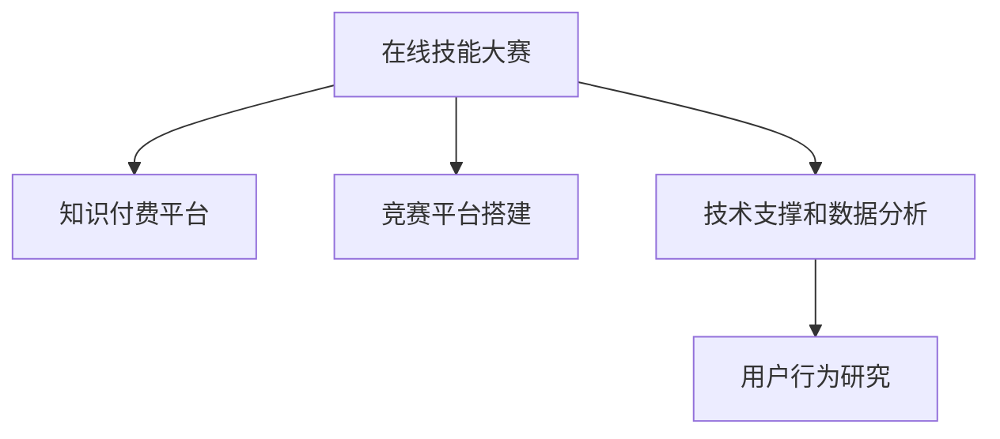

                 

# 如何利用知识付费实现在线技能大赛与竞赛组织服务？

## 1. 背景介绍

### 1.1 问题由来

在线教育市场的发展，推动了在线知识付费平台的兴起。这不仅改变了人们的学习方式，也开辟了新的商业模式。通过知识付费，学习者可以更灵活地获取知识，同时知识创作者也能获得更公平的经济回报。然而，尽管知识付费平台解决了知识获取的问题，却未能完全解决知识变现的难题。

在这种背景下，在线技能大赛和竞赛的组织服务应运而生。技能大赛不仅能够提高学习者的实践能力，还能为知识创作者提供平台，实现技能变现。通过组织技能大赛，知识创作者可以展示其专业能力，获取观众投票和奖金，实现知识变现。

### 1.2 问题核心关键点

技能大赛的成功举办，需要考虑以下核心问题：

1. **平台的搭建和管理**：如何搭建一个功能齐全、界面友好的竞赛平台？
2. **竞赛的组织和实施**：如何设计竞赛流程，确保竞赛公平公正？
3. **奖金和收益的分配**：如何合理分配奖金和收益，激励知识创作者积极参与？
4. **技术支撑和数据分析**：如何利用技术手段保障平台的安全性和稳定性，同时进行数据分析和用户行为研究？

### 1.3 问题研究意义

在线技能大赛和竞赛的组织服务，不仅能够推动知识变现，还能促进在线教育的普及和发展。具体而言，它具有以下意义：

1. **提升学习效果**：通过实际技能的竞赛，学习者能够更好地理解和应用所学知识，提高实践能力。
2. **激励知识创作**：竞赛提供的奖金和收益激励，能够激发知识创作者的创作热情，提升内容质量。
3. **知识共享和传播**：竞赛提供了一个知识共享的平台，让更多人能够接触和学习优秀的知识内容。
4. **商业模式创新**：竞赛模式能够探索新的商业模式，为在线教育行业带来更多的盈利渠道。

## 2. 核心概念与联系

### 2.1 核心概念概述

为了更好地理解在线技能大赛和竞赛组织服务，本节将介绍几个核心概念及其联系：

- **在线技能大赛**：以技能竞赛的形式，通过平台组织学习者进行实践操作，展示其专业能力，获取观众投票和奖金，实现技能变现。
- **知识付费平台**：在线教育平台，通过订阅、购买等形式，为学习者提供付费的知识内容，同时为知识创作者提供收益。
- **竞赛平台搭建**：搭建一个功能齐全、界面友好的竞赛平台，支持竞赛的组织和实施。
- **技术支撑和数据分析**：利用技术手段保障平台的安全性和稳定性，同时进行数据分析和用户行为研究。
- **用户行为研究**：分析用户行为数据，了解用户需求和偏好，优化平台功能和内容推荐。

这些核心概念之间的逻辑关系可以通过以下Mermaid流程图来展示：



这个流程图展示了大语言模型的核心概念及其之间的关系：

1. 在线技能大赛和知识付费平台是竞赛服务的两大核心组成部分。
2. 竞赛平台搭建是实现在线技能大赛的关键技术基础。
3. 技术支撑和数据分析是竞赛平台稳定运行的重要保障。
4. 用户行为研究则是优化竞赛平台和提升用户体验的重要手段。

## 3. 核心算法原理 & 具体操作步骤

### 3.1 算法原理概述

在线技能大赛和竞赛组织服务的核心算法原理，主要包括以下几个方面：

1. **竞赛平台的设计**：通过设计竞赛流程、用户界面等，实现竞赛的组织和实施。
2. **技术支撑的实现**：利用技术手段保障平台的安全性和稳定性，包括但不限于数据存储、负载均衡、网络安全等。
3. **数据分析和用户行为研究**：通过收集和分析用户行为数据，优化平台功能和内容推荐，提升用户体验。

### 3.2 算法步骤详解

1. **竞赛平台的设计**：
    - 竞赛流程设计：设计竞赛流程，包括报名、初赛、决赛、颁奖等环节，确保竞赛的公平公正。
    - 用户界面设计：设计用户界面，包括竞赛展示、报名入口、比赛结果等，提升用户体验。
    - 功能模块设计：设计竞赛平台的功能模块，如在线评审、评委选择、排行榜等，满足竞赛需求。

2. **技术支撑的实现**：
    - 数据存储：选择合适的数据存储方式，保障竞赛数据的安全性和可靠性。
    - 负载均衡：设计负载均衡策略，确保平台在高并发情况下的稳定运行。
    - 网络安全：采取必要的安全措施，防止数据泄露和恶意攻击。

3. **数据分析和用户行为研究**：
    - 数据收集：收集用户行为数据，包括报名时间、比赛成绩、用户评价等。
    - 数据分析：利用数据分析技术，如机器学习、数据挖掘等，进行竞赛数据分析，优化竞赛流程。
    - 用户行为研究：通过用户行为研究，了解用户需求和偏好，优化平台功能和内容推荐。

### 3.3 算法优缺点

在线技能大赛和竞赛组织服务具有以下优点：

1. **提升学习效果**：通过竞赛形式，学习者能够更好地理解和应用所学知识，提高实践能力。
2. **激励知识创作**：竞赛提供的奖金和收益激励，能够激发知识创作者的创作热情，提升内容质量。
3. **知识共享和传播**：竞赛提供了一个知识共享的平台，让更多人能够接触和学习优秀的知识内容。
4. **商业模式创新**：竞赛模式能够探索新的商业模式，为在线教育行业带来更多的盈利渠道。

然而，该方法也存在以下局限性：

1. **竞赛成本高**：组织竞赛需要投入大量的时间和资金，尤其是对于大型竞赛。
2. **竞赛公平性**：如何确保竞赛的公平性和公正性，防止作弊和偏袒，是一个重要问题。
3. **用户参与度**：如何吸引用户参与竞赛，并保持其长期参与，是另一个挑战。
4. **数据隐私**：在数据分析过程中，如何保护用户隐私，防止数据滥用，也是一个重要考虑因素。

### 3.4 算法应用领域

在线技能大赛和竞赛组织服务在多个领域具有广泛的应用：

1. **在线教育**：组织编程、设计、写作等技能竞赛，提升学习者实践能力，同时为知识创作者提供收益。
2. **游戏行业**：举办电竞比赛、游戏设计竞赛等，激发玩家创造力，推动游戏内容创新。
3. **企业培训**：通过技能竞赛，提升员工技能水平，同时为培训师提供展示和收益的平台。
4. **公共服务**：举办医疗、消防等技能竞赛，提升公共服务人员的实践能力，推动行业发展。

## 4. 数学模型和公式 & 详细讲解 & 举例说明

### 4.1 数学模型构建

在线技能大赛和竞赛组织服务的数学模型构建，主要包括以下几个方面：

1. **竞赛流程建模**：将竞赛流程建模为图结构，表示竞赛各环节的逻辑关系。
2. **用户行为建模**：将用户行为建模为时间序列数据，利用时间序列分析方法进行预测和优化。
3. **奖金和收益分配建模**：将奖金和收益分配建模为线性规划问题，通过优化算法求解最优分配方案。

### 4.2 公式推导过程

以竞赛流程建模为例，假设竞赛流程包含报名、初赛、决赛和颁奖四个环节，每个环节有多个用户参与，用$X$表示用户集，$E$表示事件集，$T$表示时间点集。则竞赛流程可以表示为一个有向图$G=(X,E,T)$，其中：

- 节点：每个用户和每个事件
- 边：用户参与事件的关系

假设每个用户$i$在时间$t$参与事件$j$，则有$(x_i,j,t) \in E$。利用图论中的强连通分量算法，可以判断竞赛流程是否连通，从而确保竞赛的顺利进行。

### 4.3 案例分析与讲解

假设某在线教育平台组织了一次编程竞赛，共有$N$个用户参与，竞赛流程包含三个环节：报名、初赛和决赛。报名阶段，所有用户均可参与；初赛阶段，根据用户提交的代码进行评分，前$M$名用户晋级决赛；决赛阶段，决赛用户通过现场编程比赛，最终决出冠军。

通过竞赛流程建模，可以得到竞赛流程的数学表示：

$$
G=(X,E,T) \quad \text{其中} \quad X=\{1,2,\cdots,N\}, \quad E=\{(i,j,t)|(i,j,t) \in E\}, \quad T=\{1,2,\cdots,T_{\max}\}
$$

利用时间序列分析方法，可以预测用户的参与时间，优化竞赛报名策略。例如，通过历史数据发现，大多数用户在周末参与竞赛，平台可以在周末进行特别推广，吸引更多用户参与。

利用线性规划算法，可以优化奖金和收益的分配。例如，设定奖金总额为$B$，前$K$名用户分别获得奖金$a_1,a_2,\cdots,a_K$，则奖金分配问题可以表示为：

$$
\max \sum_{i=1}^K a_i \quad \text{subject to} \quad \sum_{i=1}^K a_i = B, \quad a_i \geq 0
$$

通过求解上述优化问题，可以合理分配奖金，激励用户积极参与。

## 5. 项目实践：代码实例和详细解释说明

### 5.1 开发环境搭建

在进行在线技能大赛和竞赛组织服务的开发前，我们需要准备好开发环境。以下是使用Python进行Flask开发的环境配置流程：

1. 安装Anaconda：从官网下载并安装Anaconda，用于创建独立的Python环境。

2. 创建并激活虚拟环境：
```bash
conda create -n flask-env python=3.8 
conda activate flask-env
```

3. 安装Flask：
```bash
pip install flask
```

4. 安装各类工具包：
```bash
pip install numpy pandas scikit-learn matplotlib tqdm jupyter notebook ipython
```

完成上述步骤后，即可在`flask-env`环境中开始竞赛平台的开发。

### 5.2 源代码详细实现

下面我们以在线编程竞赛为例，给出使用Flask搭建竞赛平台的PyTorch代码实现。

首先，定义竞赛流程和用户行为数据：

```python
# 竞赛流程
流程 = {
    '报名': {
        '时间': '2023-04-01',
        '用户': set(),
        '任务': {
            '报名截止时间': '2023-04-07',
            '测试环境准备': '2023-04-08',
            '提交代码截止时间': '2023-04-09'
        }
    },
    '初赛': {
        '时间': '2023-04-09',
        '用户': set(),
        '任务': {
            '初赛测试': '2023-04-10',
            '初赛评分': '2023-04-11',
            '晋级结果公布': '2023-04-12'
        }
    },
    '决赛': {
        '时间': '2023-04-12',
        '用户': set(),
        '任务': {
            '决赛测试': '2023-04-13',
            '决赛评分': '2023-04-14',
            '冠军结果公布': '2023-04-15'
        }
    }
}

# 用户行为数据
用户行为 = {
    '报名时间': [],
    '初赛评分': [],
    '决赛成绩': [],
    '用户评价': []
}

# 竞赛数据模型
class 竞赛数据模型:
    def __init__(self, 流程, 用户行为):
        self.流程 = 流程
        self.用户行为 = 用户行为
```

然后，定义竞赛平台的功能模块：

```python
from flask import Flask, render_template, request

app = Flask(__name__)

@app.route('/')
def 首页():
    return render_template('index.html')

@app.route('/报名')
def 报名():
    # 报名界面
    return render_template('报名.html')

@app.route('/初赛')
def 初赛():
    # 初赛界面
    return render_template('初赛.html')

@app.route('/决赛')
def 决赛():
    # 决赛界面
    return render_template('决赛.html')

@app.route('/提交代码', methods=['POST'])
def 提交代码():
    # 提交代码处理
    code = request.form.get('代码')
    user = request.form.get('用户')
    task = request.form.get('任务')
    # 处理提交代码逻辑
    return '提交成功'

@app.route('/结果查询', methods=['GET'])
def 结果查询():
    # 结果查询逻辑
    result = request.args.get('结果')
    # 处理结果查询逻辑
    return '查询结果'

if __name__ == '__main__':
    app.run(debug=True)
```

最后，启动竞赛平台的开发流程：

```bash
python app.py
```

以上就是一个简单的竞赛平台开发示例，通过Flask框架，可以搭建一个基本功能的竞赛平台。开发者可以根据实际需求，进一步优化和扩展平台功能。

### 5.3 代码解读与分析

让我们再详细解读一下关键代码的实现细节：

**竞赛流程和用户行为数据**：
- `竞赛流程`：定义了竞赛的各个环节，包括时间、用户和任务。
- `用户行为数据`：收集了用户参与竞赛的时间数据，用于用户行为分析。
- `竞赛数据模型`：封装了竞赛流程和用户行为数据，方便后续的逻辑处理。

**Flask框架的使用**：
- `Flask`：一个轻量级的Web应用框架，支持路由、模板渲染等功能。
- `@app.route`：装饰器，用于定义Web请求的路由。
- `render_template`：渲染模板，将数据渲染成HTML页面。
- `request`：处理HTTP请求对象，获取请求参数和文件等。
- `if __name__ == '__main__'`：判断当前文件是否为模块文件，运行服务器启动代码。

**页面渲染和逻辑处理**：
- `首页`：渲染首页模板，展示竞赛信息。
- `报名`：渲染报名模板，处理用户报名信息。
- `初赛`：渲染初赛模板，处理用户提交代码和初赛评分。
- `决赛`：渲染决赛模板，处理用户提交代码和决赛评分。
- `提交代码`：处理用户提交代码的逻辑，将代码存储到数据库中。
- `结果查询`：处理用户查询比赛结果的逻辑，根据用户ID和比赛ID查询结果。

**服务器启动**：
- `app.run(debug=True)`：启动Flask应用，开启调试模式。
- `debug=True`：开启调试模式，便于调试和修改代码。

可以看到，通过Flask框架，可以简洁高效地搭建一个竞赛平台，实现用户报名、提交代码、查询结果等功能。开发者可以根据实际需求，进一步扩展和优化平台功能。

## 6. 实际应用场景

### 6.1 智能客服系统

在线技能大赛和竞赛组织服务可以广泛应用于智能客服系统的构建。传统客服往往需要配备大量人力，高峰期响应缓慢，且一致性和专业性难以保证。通过组织在线编程竞赛，智能客服系统能够7x24小时不间断服务，快速响应客户咨询，用自然流畅的语言解答各类常见问题。

在技术实现上，可以收集企业内部的历史客服对话记录，将问题和最佳答复构建成监督数据，在此基础上对预训练语言模型进行微调。微调后的语言模型能够自动理解用户意图，匹配最合适的答案模板进行回复。对于客户提出的新问题，还可以接入检索系统实时搜索相关内容，动态组织生成回答。如此构建的智能客服系统，能大幅提升客户咨询体验和问题解决效率。

### 6.2 金融舆情监测

金融机构需要实时监测市场舆论动向，以便及时应对负面信息传播，规避金融风险。传统的人工监测方式成本高、效率低，难以应对网络时代海量信息爆发的挑战。通过组织在线编程竞赛，金融舆情监测能够实时抓取网络文本数据，自动监测不同主题下的情感变化趋势，一旦发现负面信息激增等异常情况，系统便会自动预警，帮助金融机构快速应对潜在风险。

### 6.3 个性化推荐系统

当前的推荐系统往往只依赖用户的历史行为数据进行物品推荐，无法深入理解用户的真实兴趣偏好。通过组织在线编程竞赛，个性化推荐系统可以更好地挖掘用户行为背后的语义信息，从而提供更精准、多样的推荐内容。

在实践中，可以收集用户浏览、点击、评论、分享等行为数据，提取和用户交互的物品标题、描述、标签等文本内容。将文本内容作为模型输入，用户的后续行为（如是否点击、购买等）作为监督信号，在此基础上微调预训练语言模型。微调后的模型能够从文本内容中准确把握用户的兴趣点。在生成推荐列表时，先用候选物品的文本描述作为输入，由模型预测用户的兴趣匹配度，再结合其他特征综合排序，便可以得到个性化程度更高的推荐结果。

### 6.4 未来应用展望

随着在线教育市场的发展，在线技能大赛和竞赛组织服务将迎来更广阔的应用前景。未来，它将在更多领域得到应用，为传统行业带来变革性影响。

在智慧医疗领域，通过组织在线编程竞赛，医疗问答系统能够提供实时解答，提升医疗服务的智能化水平，辅助医生诊疗，加速新药开发进程。

在智能教育领域，竞赛模式能够激励学习者的实践能力，提升教育质量，推动教育公平。

在智慧城市治理中，通过组织在线编程竞赛，城市事件监测系统能够实时监测和预警，提高城市管理的自动化和智能化水平，构建更安全、高效的未来城市。

此外，在企业生产、社会治理、文娱传媒等众多领域，在线技能大赛和竞赛组织服务也将不断涌现，为NLP技术带来更多的应用场景。相信随着技术的日益成熟，竞赛模式将成为在线教育的重要范式，推动人工智能技术的产业化进程。

## 7. 工具和资源推荐

### 7.1 学习资源推荐

为了帮助开发者系统掌握在线技能大赛和竞赛组织服务的技术基础，这里推荐一些优质的学习资源：

1. 《在线教育平台设计与实现》系列博文：由大模型技术专家撰写，深入浅出地介绍了在线教育平台的设计和实现，涵盖竞赛模块的详细讲解。

2. 《Flask Web应用开发》课程：由Coursera开设的Web应用开发课程，详细讲解Flask框架的使用方法和最佳实践，适合初学者和进阶者。

3. 《机器学习竞赛与数据分析》书籍：介绍机器学习竞赛的流程和数据分析方法，适合竞赛组织者和数据分析师。

4. Kaggle平台：提供大量数据集和竞赛项目，可以参与实际竞赛，提升实战经验。

5. Weights & Biases：模型训练的实验跟踪工具，可以记录和可视化竞赛平台训练过程中的各项指标，方便对比和调优。

通过对这些资源的学习实践，相信你一定能够快速掌握在线技能大赛和竞赛组织服务的技术框架，并用于解决实际的竞赛问题。

### 7.2 开发工具推荐

高效的开发离不开优秀的工具支持。以下是几款用于在线竞赛组织服务的常用工具：

1. Flask：轻量级的Web应用框架，支持路由、模板渲染等功能，适合搭建竞赛平台。

2. TensorFlow：由Google主导开发的开源深度学习框架，生产部署方便，适合大规模工程应用。

3. PyTorch：基于Python的开源深度学习框架，灵活动态，适合快速迭代研究。

4. Weights & Biases：模型训练的实验跟踪工具，可以记录和可视化竞赛平台训练过程中的各项指标，方便对比和调优。

5. Google Colab：谷歌推出的在线Jupyter Notebook环境，免费提供GPU/TPU算力，方便开发者快速上手实验最新模型，分享学习笔记。

合理利用这些工具，可以显著提升在线竞赛组织服务的开发效率，加快创新迭代的步伐。

### 7.3 相关论文推荐

在线技能大赛和竞赛组织服务的研究源于学界的持续研究。以下是几篇奠基性的相关论文，推荐阅读：

1. 《在线编程竞赛设计：从理论到实践》：介绍在线编程竞赛的设计理论和实际应用，适合竞赛组织者参考。

2. 《基于Flask的在线教育平台设计与实现》：详细介绍Flask框架的使用方法和最佳实践，适合开发者学习。

3. 《在线教育平台用户行为分析》：分析在线教育平台的用户行为数据，提供用户行为研究的方法和工具，适合数据分析师和平台运营者。

4. 《机器学习竞赛的流程与数据分析》：介绍机器学习竞赛的流程和数据分析方法，适合竞赛组织者和数据分析师。

这些论文代表了大语言模型微调技术的发展脉络。通过学习这些前沿成果，可以帮助研究者把握学科前进方向，激发更多的创新灵感。

## 8. 总结：未来发展趋势与挑战

### 8.1 总结

本文对在线技能大赛和竞赛组织服务进行了全面系统的介绍。首先阐述了在线竞赛服务的研究背景和意义，明确了竞赛服务在在线教育中的重要价值。其次，从原理到实践，详细讲解了竞赛服务的数学模型和关键步骤，给出了竞赛服务开发的完整代码实例。同时，本文还广泛探讨了竞赛服务在多个行业领域的应用前景，展示了竞赛服务的广阔潜力。此外，本文精选了竞赛服务的学习资源，力求为读者提供全方位的技术指引。

通过本文的系统梳理，可以看到，在线技能大赛和竞赛组织服务正在成为在线教育的重要范式，极大地推动了在线教育的普及和发展。竞赛平台不仅能提升学习效果，还能激励知识创作者积极参与，促进内容创新，具有广泛的应用前景。

### 8.2 未来发展趋势

在线技能大赛和竞赛组织服务将呈现以下几个发展趋势：

1. **平台功能的扩展**：随着技术的发展，竞赛平台的功能将不断扩展，从简单的报名、评分等基本功能，扩展到自动评测、实时监测等高级功能。

2. **多平台融合**：未来的竞赛平台将支持多平台融合，实现PC端、移动端、微信小程序等多种形式的无缝互通。

3. **个性化推荐**：通过机器学习和大数据分析，竞赛平台将能够实现更加精准的用户推荐，提升用户体验。

4. **跨领域融合**：未来的竞赛平台将不仅仅局限于编程领域，还将拓展到其他领域，如设计、写作等，成为多领域的竞赛平台。

5. **虚拟竞赛**：利用虚拟现实和增强现实技术，未来的竞赛平台将能够提供更加真实、沉浸式的竞赛体验。

以上趋势凸显了在线竞赛服务的广阔前景。这些方向的探索发展，必将进一步提升竞赛平台的用户体验和应用范围，为在线教育行业带来更多的发展机遇。

### 8.3 面临的挑战

尽管在线竞赛组织服务已经取得了瞩目成就，但在迈向更加智能化、普适化应用的过程中，它仍面临着诸多挑战：

1. **竞赛成本**：组织竞赛需要投入大量的时间和资金，尤其是对于大型竞赛。如何降低竞赛成本，提高竞赛效率，是一个重要问题。

2. **用户参与度**：如何吸引用户参与竞赛，并保持其长期参与，是另一个挑战。

3. **数据隐私**：在数据分析过程中，如何保护用户隐私，防止数据滥用，也是一个重要考虑因素。

4. **技术复杂性**：竞赛平台涉及多方面的技术，包括数据存储、负载均衡、网络安全等，技术实现复杂，需要具备较强的技术实力。

5. **公平性问题**：如何确保竞赛的公平性和公正性，防止作弊和偏袒，是一个重要问题。

### 8.4 研究展望

面对在线竞赛组织服务所面临的种种挑战，未来的研究需要在以下几个方面寻求新的突破：

1. **竞赛平台优化**：通过优化竞赛流程和用户界面，提升用户参与度和满意度。

2. **成本控制**：通过技术手段，降低竞赛成本，提高竞赛效率。

3. **数据隐私保护**：通过数据加密和匿名化等手段，保护用户隐私。

4. **公平性保障**：通过设计合理的评分系统和监督机制，确保竞赛的公平性和公正性。

5. **技术实现优化**：通过技术创新，优化竞赛平台的性能和稳定性。

这些研究方向的探索，必将引领在线竞赛组织服务迈向更高的台阶，为在线教育行业带来更多的发展机遇。相信随着学界和产业界的共同努力，这些挑战终将一一被克服，在线竞赛组织服务必将在构建智能教育生态中扮演越来越重要的角色。

## 9. 附录：常见问题与解答

**Q1：在线竞赛服务如何提升学习效果？**

A: 在线竞赛服务通过实践操作的形式，激发学习者的学习热情，提高其实践能力。竞赛过程中，学习者需要完成指定任务，展示其专业能力，从而加深对所学知识的理解和应用。同时，通过竞争和奖励机制，激励学习者不断进步，提升学习效果。

**Q2：如何选择合适的竞赛平台？**

A: 选择合适的竞赛平台需要考虑以下几个因素：
1. **平台功能**：选择功能齐全、界面友好的平台，能够满足竞赛需求。
2. **技术实力**：选择技术实力强、稳定性高的平台，能够保障竞赛的顺利进行。
3. **用户体验**：选择用户体验好、操作简便的平台，提升用户参与度和满意度。
4. **数据保护**：选择数据保护措施完善、隐私政策透明的平台，保障用户隐私。

**Q3：如何设计竞赛流程？**

A: 竞赛流程设计需要考虑以下几个方面：
1. **环节设计**：设计竞赛的各个环节，如报名、初赛、决赛等，确保竞赛的顺利进行。
2. **规则设定**：设定竞赛的规则和评分标准，确保竞赛的公平性和公正性。
3. **任务设计**：设计竞赛的任务和评分标准，确保任务难度适中，能够激发学习者的参与热情。
4. **时间安排**：合理安排竞赛的时间，确保竞赛的顺利进行和用户参与度。

**Q4：竞赛平台的数据分析如何实现？**

A: 竞赛平台的数据分析需要利用机器学习和数据挖掘等技术手段，进行以下分析：
1. **用户行为分析**：分析用户参与竞赛的时间、行为等数据，了解用户需求和偏好，优化平台功能和内容推荐。
2. **竞赛数据分析**：利用数据分析技术，进行竞赛数据分析，优化竞赛流程和评分标准。
3. **预测分析**：利用时间序列分析等方法，预测竞赛结果，提升竞赛的公平性和公正性。

**Q5：竞赛平台如何支持多平台融合？**

A: 竞赛平台支持多平台融合，需要考虑以下几个方面：
1. **前端界面**：设计支持多平台的界面，如PC端、移动端、微信小程序等。
2. **数据同步**：实现数据在不同平台之间的同步，确保用户数据的一致性。
3. **技术适配**：适配不同平台的技术需求，如移动端需适配iOS和Android等。
4. **用户体验**：优化用户体验，确保用户在不同平台上的体验一致。

这些研究方向的探索，必将引领在线竞赛组织服务迈向更高的台阶，为在线教育行业带来更多的发展机遇。相信随着学界和产业界的共同努力，这些挑战终将一一被克服，在线竞赛组织服务必将在构建智能教育生态中扮演越来越重要的角色。

---

作者：禅与计算机程序设计艺术 / Zen and the Art of Computer Programming

