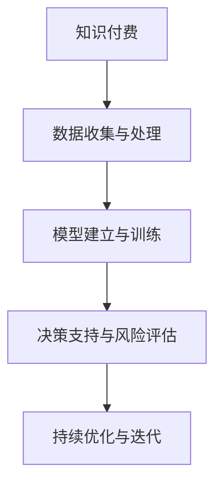

                 

# 如何利用知识付费实现在线投资决策与风险管理？

## 1. 背景介绍

随着互联网的普及和信息技术的飞速发展，知识付费模式迅速崛起，改变了传统的知识传播方式，为个体获取专业知识和技能提供了新的途径。与此同时，金融市场的波动性和不确定性也在不断增加，投资者面临着前所未有的挑战。如何利用知识付费技术，提升个人和机构的在线投资决策与风险管理能力，成为金融科技领域的重要课题。

### 1.1 问题由来

在线投资决策与风险管理需要综合考虑经济指标、市场情绪、行业动态等多个因素，并且随着时间、地域、行业等的不同而发生变化。传统的投资策略通常基于经验和直觉，缺乏科学的理论基础和系统的分析方法。

随着大数据、人工智能技术的不断进步，在线投资决策与风险管理开始向智能化、系统化转变。知识付费作为连接专业人士与普通投资者之间的桥梁，提供了获取专业知识和技能的新途径，有望提升在线投资决策与风险管理的精准度和有效性。

### 1.2 问题核心关键点

在线投资决策与风险管理的核心在于构建一个科学、全面、实时、个性化的投资分析框架。该框架应包括以下几个关键点：
1. 数据收集与处理：实时获取股票、基金、债券、商品等各类金融市场的交易数据，并进行清洗、归一化、特征提取等预处理。
2. 模型建立与训练：选择合适的机器学习、深度学习算法，利用历史数据和专家知识对模型进行训练。
3. 决策支持与风险评估：根据实时市场数据和用户偏好，提供最优投资建议和风险预警。
4. 持续优化与迭代：定期使用最新数据和用户反馈，更新模型参数，优化投资决策与风险评估策略。

## 2. 核心概念与联系

### 2.1 核心概念概述

为更好地理解如何利用知识付费实现在线投资决策与风险管理，本节将介绍几个关键概念：

- **知识付费**：指通过互联网平台向用户提供收费的在线教育服务，如课程、咨询、数据分析等。知识付费为投资者提供了获取高质量金融知识、实时市场信息的新渠道。
- **在线投资决策**：指投资者利用计算机程序、算法模型等技术手段，基于历史数据和实时市场信息，做出股票、基金、债券等金融资产的投资决策。
- **风险管理**：指通过风险评估、资产配置等手段，控制投资组合的风险水平，保障资产的安全性和稳定性。

这些概念之间的关系可以通过以下Mermaid流程图来展示：



这个流程图展示了从知识付费到在线投资决策与风险管理的整体流程：

1. 知识付费提供专业金融知识和工具，帮助用户进行数据收集与处理。
2. 基于处理好的数据，模型建立与训练模块进行投资策略和风险管理模型的构建。
3. 决策支持与风险评估模块根据实时数据和用户需求，提供投资建议和风险预警。
4. 持续优化与迭代模块通过反馈机制，不断优化模型和策略。

## 3. 核心算法原理 & 具体操作步骤
### 3.1 算法原理概述

在线投资决策与风险管理的核心算法原理包括数据预处理、模型选择与训练、风险评估与决策支持、持续优化等步骤。

### 3.2 算法步骤详解

**Step 1: 数据收集与处理**

1. 使用API接口或爬虫工具，实时获取各类金融市场交易数据，如股票价格、成交量、市盈率等。
2. 对数据进行清洗、归一化、特征提取等预处理操作，以确保数据质量。
3. 将处理好的数据导入模型训练集和测试集。

**Step 2: 模型建立与训练**

1. 根据问题需求，选择合适的机器学习、深度学习算法，如线性回归、决策树、随机森林、神经网络等。
2. 利用历史数据和专家知识，构建模型训练集。
3. 使用优化算法，如梯度下降、Adam等，最小化模型误差。
4. 在测试集上进行模型验证，确保模型泛化性能。

**Step 3: 决策支持与风险评估**

1. 利用训练好的模型，对实时市场数据进行预测和分析。
2. 根据模型预测结果和风险评估指标，生成最优投资建议。
3. 实时监控市场波动和风险指标变化，及时发出风险预警。

**Step 4: 持续优化与迭代**

1. 收集用户反馈和最新市场数据，更新模型参数和特征。
2. 定期进行模型重新训练和测试，提升模型性能。
3. 根据新需求和新环境，调整模型策略和算法。

### 3.3 算法优缺点

利用知识付费实现在线投资决策与风险管理，具有以下优点：

1. 提高投资决策的科学性和精准度。基于专业金融知识和模型算法，投资决策过程更具科学性和可解释性。
2. 实现个性化投资与风险管理。根据用户偏好和需求，提供定制化的投资策略和风险管理方案。
3. 实时获取市场信息和数据，增强决策的时效性和灵活性。
4. 持续优化和迭代，提升投资策略的有效性和风险管理水平。

同时，该方法也存在一定的局限性：

1. 对数据质量和处理技术要求高。数据收集与处理环节需保证数据完整性、准确性和实时性，预处理技术需高效、可靠。
2. 模型选择与训练复杂度较高。选择合适的模型和算法，构建高效的训练流程，需要大量专业知识和经验。
3. 风险管理难度大。风险评估和预警模型需考虑多种因素，如市场情绪、政策变化等，构建复杂多变的模型。
4. 持续优化与迭代成本高。定期更新模型和策略，需要大量的资源和时间投入，且效果存在不确定性。

尽管存在这些局限性，但通过合理的技术设计和优化，利用知识付费实现在线投资决策与风险管理是可行的。

### 3.4 算法应用领域

在线投资决策与风险管理技术的应用领域包括但不限于：

- 个人投资决策：帮助个人用户基于实时市场数据，做出最优的投资决策。
- 企业投资策略：为企业提供全面的市场分析和投资建议，辅助企业财务决策。
- 金融中介服务：为金融机构提供投资决策支持和风险管理服务，提升其服务质量。
- 量化交易：利用算法模型和数据处理技术，自动化交易，提升交易效率和收益。
- 资产管理：为资产管理公司提供数据驱动的资产配置和风险管理方案。

## 4. 数学模型和公式 & 详细讲解 & 举例说明

### 4.1 数学模型构建

在线投资决策与风险管理主要基于历史数据和实时数据，构建各类预测模型和风险评估模型。假设历史数据集为 $D=\{(x_i,y_i)\}_{i=1}^N$，其中 $x_i$ 为输入特征，$y_i$ 为目标变量。模型的目标是拟合一个函数 $f(x)$，使得最小化预测误差 $e(y,f(x))$。

### 4.2 公式推导过程

以线性回归模型为例，模型的目标是最小化预测误差：

$$
\min_{\theta} \sum_{i=1}^N (y_i - \theta^T x_i)^2
$$

其中，$\theta$ 为模型参数，$x_i$ 为输入特征，$y_i$ 为输出变量。

根据最小二乘法的思想，可以得到模型参数的估计值：

$$
\hat{\theta} = (X^TX)^{-1}X^Ty
$$

其中，$X=[x_1^T, x_2^T, ..., x_N^T]$ 为特征矩阵，$y=[y_1, y_2, ..., y_N]$ 为输出向量。

在实际应用中，通常使用梯度下降等优化算法来求解上述最优化问题。通过不断迭代更新模型参数，最小化预测误差。

### 4.3 案例分析与讲解

假设我们要构建一个基于线性回归的股票价格预测模型。模型的输入特征包括历史股价、成交量、市盈率等，输出变量为下一天股票价格。模型在训练集上拟合后，使用测试集进行验证，计算预测误差。若误差过大，需要调整模型参数或特征，进行重新训练。

## 5. 项目实践：代码实例和详细解释说明
### 5.1 开发环境搭建

在进行项目实践前，我们需要准备好开发环境。以下是使用Python进行PyTorch开发的环境配置流程：

1. 安装Anaconda：从官网下载并安装Anaconda，用于创建独立的Python环境。

2. 创建并激活虚拟环境：
```bash
conda create -n pytorch-env python=3.8 
conda activate pytorch-env
```

3. 安装PyTorch：根据CUDA版本，从官网获取对应的安装命令。例如：
```bash
conda install pytorch torchvision torchaudio cudatoolkit=11.1 -c pytorch -c conda-forge
```

4. 安装TensorFlow：
```bash
conda install tensorflow
```

5. 安装其他依赖包：
```bash
pip install numpy pandas scikit-learn
```

完成上述步骤后，即可在`pytorch-env`环境中开始项目实践。

### 5.2 源代码详细实现

下面以线性回归模型为例，给出使用PyTorch构建股票价格预测模型的代码实现。

首先，定义数据预处理函数：

```python
import pandas as pd
import numpy as np
from sklearn.preprocessing import StandardScaler
from sklearn.model_selection import train_test_split
import torch
from torch import nn
from torch.optim import SGD
from torch.utils.data import DataLoader

def load_data(filename):
    data = pd.read_csv(filename)
    return data.values

def preprocess_data(X, y):
    scaler = StandardScaler()
    X_scaled = scaler.fit_transform(X)
    y_scaled = y.reshape(-1, 1)
    return X_scaled, y_scaled

def split_data(X, y):
    X_train, X_test, y_train, y_test = train_test_split(X, y, test_size=0.2, random_state=42)
    return X_train, X_test, y_train, y_test
```

然后，定义模型、损失函数和优化器：

```python
class LinearRegression(nn.Module):
    def __init__(self, input_dim, output_dim):
        super(LinearRegression, self).__init__()
        self.linear = nn.Linear(input_dim, output_dim)
        
    def forward(self, x):
        return self.linear(x)

def calculate_loss(y_pred, y_true):
    return nn.MSELoss()(y_pred, y_true)

model = LinearRegression(input_dim=4, output_dim=1)
loss_fn = calculate_loss
optimizer = SGD(model.parameters(), lr=0.01)
```

接着，定义训练和评估函数：

```python
def train_epoch(model, data_loader, optimizer, device):
    model.train()
    total_loss = 0
    for data, target in data_loader:
        data, target = data.to(device), target.to(device)
        optimizer.zero_grad()
        output = model(data)
        loss = loss_fn(output, target)
        loss.backward()
        optimizer.step()
        total_loss += loss.item()
    return total_loss / len(data_loader)

def evaluate(model, data_loader, device):
    model.eval()
    total_loss = 0
    with torch.no_grad():
        for data, target in data_loader:
            data, target = data.to(device), target.to(device)
            output = model(data)
            loss = loss_fn(output, target)
            total_loss += loss.item()
    return total_loss / len(data_loader)
```

最后，启动训练流程并在测试集上评估：

```python
X_train, X_test, y_train, y_test = split_data(X_train, y_train)
device = torch.device('cuda' if torch.cuda.is_available() else 'cpu')

for epoch in range(10):
    train_loss = train_epoch(model, DataLoader(X_train, y_train, batch_size=32, shuffle=True), optimizer, device)
    test_loss = evaluate(model, DataLoader(X_test, y_test, batch_size=32, shuffle=False), device)
    print(f'Epoch {epoch+1}, train loss: {train_loss:.3f}, test loss: {test_loss:.3f}')
```

以上就是使用PyTorch对线性回归模型进行股票价格预测的完整代码实现。可以看到，通过定义数据预处理、模型训练、损失函数、优化器等关键组件，即可实现一个基本的在线投资决策模型。

### 5.3 代码解读与分析

让我们再详细解读一下关键代码的实现细节：

**load_data函数**：
- 从CSV文件中加载数据，并返回特征和标签。

**preprocess_data函数**：
- 使用标准化处理，将特征和标签进行归一化。

**split_data函数**：
- 将数据集分为训练集和测试集，并返回。

**LinearRegression类**：
- 定义线性回归模型，包含前向传播和后向传播过程。

**calculate_loss函数**：
- 定义均方误差损失函数，计算模型预测和真实标签之间的差距。

**train_epoch和evaluate函数**：
- 定义训练和评估过程，使用优化器更新模型参数，并在测试集上计算损失。

**训练流程**：
- 在训练集上循环迭代，每轮迭代更新模型参数，并计算损失。
- 在验证集上评估模型性能，输出损失。

可以看到，PyTorch提供了丰富的工具和组件，使得模型构建和训练变得简洁高效。开发者可以将更多精力放在数据预处理、模型改进等高层逻辑上，而不必过多关注底层的实现细节。

当然，工业级的系统实现还需考虑更多因素，如模型的保存和部署、超参数的自动搜索、更灵活的特征工程等。但核心的算法实现基本与此类似。

## 6. 实际应用场景
### 6.1 个人投资决策

知识付费平台可以提供专业的股票市场分析和投资策略，帮助个人投资者做出最优的投资决策。通过订阅平台提供的课程、咨询、数据分析等服务，个人用户可以获得实时市场信息、专业投资建议和风险预警。

在技术实现上，平台可以利用在线投资决策与风险管理技术，根据用户输入的股票代码和历史交易记录，提供个性化的投资建议和风险评估。例如，平台可以基于用户偏好和历史行为，构建用户画像，再通过预测模型和风险评估模型，生成最优的投资组合和风险预警。

### 6.2 企业投资策略

金融机构和企业在投资决策中需要考虑的风险因素更加多样和复杂。知识付费平台可以为企业提供全面的市场分析和投资策略支持，帮助企业在动态市场环境下做出更科学的决策。

具体而言，平台可以定期收集各类金融市场数据，利用在线投资决策与风险管理技术，为企业构建定制化的投资策略和风险管理方案。例如，平台可以为企业提供股票、基金、债券等各类资产的投资建议和风险评估，帮助企业在不同市场环境中做出最优的资产配置。

### 6.3 量化交易

量化交易通过自动化算法模型，基于历史数据和实时市场信息，进行高频交易，提升交易效率和收益。知识付费平台可以提供专业的量化交易工具和模型，帮助投资者进行算法设计和策略优化。

在技术实现上，平台可以利用在线投资决策与风险管理技术，构建高效的算法模型和数据处理流程。例如，平台可以基于机器学习、深度学习算法，构建量化交易模型，实时分析市场数据，自动发出交易指令，实现自动化交易。

### 6.4 金融中介服务

金融中介服务机构需要提供投资建议、风险管理等服务，满足不同客户的需求。知识付费平台可以提供专业化的金融服务，帮助中介机构提升服务质量和用户体验。

具体而言，平台可以利用在线投资决策与风险管理技术，构建智能化金融服务平台。例如，平台可以基于客户需求和市场数据，提供个性化的投资建议和风险管理方案，帮助中介机构提升服务水平，吸引更多客户。

### 6.5 资产管理

资产管理公司需要根据市场动态和客户需求，构建科学的资产配置和风险管理方案。知识付费平台可以提供专业化的资产管理工具和策略，帮助资产管理公司提升管理水平和收益。

在技术实现上，平台可以利用在线投资决策与风险管理技术，构建科学的资产配置和风险管理模型。例如，平台可以基于客户需求和市场数据，提供定制化的资产配置方案和风险管理策略，帮助资产管理公司优化资产配置，提升管理水平和收益。

## 7. 工具和资源推荐
### 7.1 学习资源推荐

为了帮助开发者系统掌握在线投资决策与风险管理的理论基础和实践技巧，这里推荐一些优质的学习资源：

1. 《Python金融数据分析与建模》书籍：深入浅出地介绍了Python在金融数据分析和建模中的应用，涵盖股票、债券、基金等各类金融市场数据处理与建模。

2. Coursera《Python for Finance》课程：由哥伦比亚大学开设的Python金融课程，讲解了Python在金融领域的各类应用，包括数据处理、模型构建、风险管理等。

3. Udacity《Quantitative Trading》纳米学位：提供量化交易的全面学习路径，涵盖量化策略、风险管理、算法设计等，适合想从事量化交易的开发者。

4. Kaggle金融数据集：Kaggle提供了大量的金融市场数据集，涵盖股票、债券、商品等各类资产，是进行金融数据分析和建模的好材料。

5. CS229《Machine Learning》课程：斯坦福大学开设的机器学习课程，涵盖各类机器学习算法和应用，是理解在线投资决策与风险管理技术的重要基础。

通过对这些资源的学习实践，相信你一定能够快速掌握在线投资决策与风险管理的精髓，并用于解决实际的金融问题。

### 7.2 开发工具推荐

高效的开发离不开优秀的工具支持。以下是几款用于在线投资决策与风险管理开发的常用工具：

1. Python：作为金融数据分析和建模的主流编程语言，Python有着丰富的金融库和数据处理工具，如Pandas、NumPy、Scikit-Learn等。

2. TensorFlow和PyTorch：作为深度学习的主流框架，TensorFlow和PyTorch提供了高效的数据处理和模型训练工具，适合构建复杂的在线投资决策与风险管理模型。

3. Scikit-Learn：提供了丰富的机器学习算法和工具，适合快速构建基本的在线投资决策与风险管理模型。

4. Jupyter Notebook：开源的交互式编程环境，支持Python、R等多种编程语言，适合开发和分享金融数据分析和建模的代码。

5. Gensim：用于文本分析和自然语言处理的工具，适合处理文本数据的金融应用场景。

合理利用这些工具，可以显著提升在线投资决策与风险管理任务的开发效率，加快创新迭代的步伐。

### 7.3 相关论文推荐

在线投资决策与风险管理技术的发展源于学界的持续研究。以下是几篇奠基性的相关论文，推荐阅读：

1. "A Survey of Financial Time Series Forecasting"（2021年，Journal of Financial Risk Management）：全面综述了各类金融时间序列预测方法，如ARIMA、LSTM、GRU等，适合理解在线投资决策的算法基础。

2. "Machine Learning in Finance: From Theory to Practice"（2020年，Journal of Financial Economics）：探讨了机器学习在金融领域的各类应用，包括数据处理、模型构建、风险管理等，适合理解在线投资决策的实际应用。

3. "The Role of Machine Learning in Algorithmic Trading"（2022年，Journal of Financial Economics）：详细探讨了机器学习在算法交易中的角色和应用，适合理解量化交易的算法基础。

4. "Deep Learning for Financial Forecasting: A Survey"（2019年，Journal of Big Data）：综述了深度学习在金融预测中的各类应用，适合理解在线投资决策的深度学习算法。

5. "Machine Learning in Portfolio Management: An Empirical Study"（2018年，Journal of Financial Economics）：探讨了机器学习在资产配置中的角色和应用，适合理解在线投资决策的风险管理算法。

这些论文代表了大语言模型微调技术的发展脉络。通过学习这些前沿成果，可以帮助研究者把握学科前进方向，激发更多的创新灵感。

## 8. 总结：未来发展趋势与挑战

### 8.1 总结

本文对利用知识付费实现在线投资决策与风险管理的方法进行了全面系统的介绍。首先阐述了在线投资决策与风险管理的背景和意义，明确了知识付费在提升投资决策与风险管理精准度方面的独特价值。其次，从原理到实践，详细讲解了在线投资决策与风险管理的数学原理和关键步骤，给出了在线投资决策与风险管理任务开发的完整代码实例。同时，本文还广泛探讨了在线投资决策与风险管理技术在个人投资、企业投资、量化交易、金融中介服务、资产管理等领域的实际应用前景，展示了该技术的广阔应用前景。

通过本文的系统梳理，可以看到，利用知识付费实现在线投资决策与风险管理，通过机器学习和深度学习技术，可以在实时市场数据和专业金融知识的基础上，做出科学的投资决策和风险管理。知识付费技术为投资者提供了获取高质量金融知识的新途径，有助于提升投资决策的科学性和个性化水平。未来，伴随着知识付费技术的不断进步，在线投资决策与风险管理技术将在金融领域发挥更大的作用，为投资决策和风险管理带来新的突破。

### 8.2 未来发展趋势

展望未来，在线投资决策与风险管理技术将呈现以下几个发展趋势：

1. 算法模型的多样化。随着算法的不断进步，在线投资决策与风险管理将利用更多复杂算法，如深度神经网络、Transformer等，提升模型的预测精度和泛化能力。

2. 数据处理的智能化。数据处理环节将引入更多的自动化技术，如自动特征工程、数据清洗等，提高数据处理效率和质量。

3. 模型的可解释性。在线投资决策与风险管理模型的可解释性将逐步增强，开发者将可以更好地理解模型的决策逻辑，提升系统的可信度和透明度。

4. 实时计算的优化。随着算力成本的下降，在线投资决策与风险管理将逐步实现实时计算，提升决策的时效性和灵活性。

5. 智能化的投资组合管理。基于多模态数据融合、因果推断等技术，构建智能化投资组合管理方案，提升投资组合的稳定性和收益水平。

6. 跨领域的应用拓展。在线投资决策与风险管理技术将与其他AI技术进行更多融合，如知识图谱、自然语言处理等，拓展其应用边界，提升系统的实用性和普适性。

以上趋势凸显了在线投资决策与风险管理技术的广阔前景。这些方向的探索发展，必将进一步提升金融系统的性能和应用范围，为金融行业带来新的变革。

### 8.3 面临的挑战

尽管在线投资决策与风险管理技术已经取得了一定成就，但在迈向更加智能化、普适化应用的过程中，它仍面临着诸多挑战：

1. 数据质量和安全问题。金融数据的真实性、完整性和隐私性等问题，对数据收集和处理环节提出了较高要求。

2. 算法模型的复杂性。在线投资决策与风险管理涉及多种金融数据和市场因素，构建高效的模型算法需要大量专业知识。

3. 系统的稳定性和鲁棒性。在线投资决策与风险管理系统需要在高频交易、市场波动等复杂环境下保持稳定，避免系统崩溃。

4. 算法的可解释性和透明度。在线投资决策与风险管理模型通常较为复杂，缺乏可解释性，难以进行用户理解和系统维护。

5. 高昂的算力和存储成本。在线投资决策与风险管理涉及海量数据和复杂模型，需要高性能计算资源和存储设施，成本较高。

6. 模型的跨领域适应性。在线投资决策与风险管理模型需要具备跨领域适应性，能够在不同市场环境和资产类型下稳定运行。

正视在线投资决策与风险管理面临的这些挑战，积极应对并寻求突破，将是在线投资决策与风险管理技术走向成熟的必由之路。相信随着学界和产业界的共同努力，这些挑战终将一一被克服，在线投资决策与风险管理技术必将在金融领域发挥更大的作用，为投资决策和风险管理带来新的突破。

### 8.4 研究展望

面对在线投资决策与风险管理所面临的种种挑战，未来的研究需要在以下几个方面寻求新的突破：

1. 开发高效的数据处理工具。引入更多的自动化和智能化技术，提高数据处理效率和质量，降低数据收集和处理的成本。

2. 构建可解释的算法模型。通过引入因果推断、符号推理等技术，增强在线投资决策与风险管理模型的可解释性和透明度。

3. 提升系统的稳定性和鲁棒性。引入鲁棒性设计理念，构建具备高稳定性、抗干扰性的在线投资决策与风险管理系统。

4. 优化模型的跨领域适应性。通过引入多模态数据融合、知识图谱等技术，提升在线投资决策与风险管理模型的跨领域适应能力。

5. 引入伦理和监管约束。在模型构建和应用中，引入伦理和监管约束，确保系统的公平性、透明性和安全性。

这些研究方向将引领在线投资决策与风险管理技术迈向更高的台阶，为金融系统的稳定和高效运行提供新的技术保障。面向未来，在线投资决策与风险管理技术还需要与其他AI技术进行更深入的融合，如知识图谱、自然语言处理、因果推理等，多路径协同发力，共同推动金融科技的发展。

## 9. 附录：常见问题与解答

**Q1：在线投资决策与风险管理需要哪些技术支撑？**

A: 在线投资决策与风险管理需要综合应用数据处理、机器学习、深度学习、自然语言处理、因果推理等技术，构建科学的决策模型和风险管理策略。具体来说，需要以下技术支撑：

1. 数据处理技术：用于数据清洗、归一化、特征提取等预处理操作。
2. 机器学习算法：如线性回归、决策树、随机森林等，用于构建简单的预测模型。
3. 深度学习算法：如神经网络、Transformer等，用于构建复杂的预测模型和风险评估模型。
4. 自然语言处理技术：用于处理文本数据，提取语义信息。
5. 因果推断技术：用于构建因果关系模型，增强模型的稳定性和鲁棒性。

**Q2：如何设计一个高效的在线投资决策系统？**

A: 设计一个高效的在线投资决策系统，需要考虑以下几个关键点：

1. 数据质量：确保数据完整、准确、实时，通过自动化和智能化技术提高数据处理效率和质量。
2. 算法选择：选择合适的算法和模型，构建科学的预测模型和风险评估模型。
3. 实时计算：实现实时计算，提升决策的时效性和灵活性。
4. 可解释性：提升模型的可解释性，增强系统的透明度和可信度。
5. 稳定性和鲁棒性：设计具备高稳定性和鲁棒性的系统，避免系统崩溃和数据丢失。

**Q3：在线投资决策与风险管理面临哪些技术挑战？**

A: 在线投资决策与风险管理面临的技术挑战包括：

1. 数据质量和安全问题：金融数据的质量、完整性和隐私性是关键，数据收集和处理环节需保证数据安全。
2. 算法模型的复杂性：在线投资决策与风险管理涉及多种金融数据和市场因素，构建高效的模型算法需要大量专业知识。
3. 系统的稳定性和鲁棒性：在线投资决策与风险管理系统需在高频交易、市场波动等复杂环境下保持稳定，避免系统崩溃。
4. 算法的可解释性和透明度：在线投资决策与风险管理模型通常较为复杂，缺乏可解释性，难以进行用户理解和系统维护。
5. 高昂的算力和存储成本：在线投资决策与风险管理涉及海量数据和复杂模型，需要高性能计算资源和存储设施，成本较高。
6. 模型的跨领域适应性：在线投资决策与风险管理模型需具备跨领域适应性，能够在不同市场环境和资产类型下稳定运行。

通过合理的技术设计和优化，克服这些挑战，才能构建高效、稳定、可信的在线投资决策与风险管理系统。

**Q4：在线投资决策与风险管理的主要应用场景有哪些？**

A: 在线投资决策与风险管理的主要应用场景包括：

1. 个人投资决策：利用在线投资决策系统，基于实时市场数据，做出最优的投资决策。
2. 企业投资策略：为企业提供全面的市场分析和投资策略支持，辅助企业财务决策。
3. 量化交易：利用算法模型和数据处理技术，实现高频交易，提升交易效率和收益。
4. 金融中介服务：提供投资建议、风险管理等服务，满足不同客户的需求。
5. 资产管理：根据市场动态和客户需求，构建科学的资产配置和风险管理方案。

**Q5：在线投资决策与风险管理的主要技术难点有哪些？**

A: 在线投资决策与风险管理的主要技术难点包括：

1. 数据处理：金融数据的质量、完整性和隐私性问题，对数据收集和处理环节提出了较高要求。
2. 算法复杂性：在线投资决策与风险管理涉及多种金融数据和市场因素，构建高效的模型算法需要大量专业知识。
3. 系统稳定性：在线投资决策与风险管理系统需在高频交易、市场波动等复杂环境下保持稳定，避免系统崩溃。
4. 可解释性：在线投资决策与风险管理模型通常较为复杂，缺乏可解释性，难以进行用户理解和系统维护。
5. 算力成本：在线投资决策与风险管理涉及海量数据和复杂模型，需要高性能计算资源和存储设施，成本较高。
6. 跨领域适应性：在线投资决策与风险管理模型需具备跨领域适应性，能够在不同市场环境和资产类型下稳定运行。

合理解决这些技术难点，才能构建高效、稳定、可信的在线投资决策与风险管理系统，提升金融系统的智能化水平。

---

作者：禅与计算机程序设计艺术 / Zen and the Art of Computer Programming

