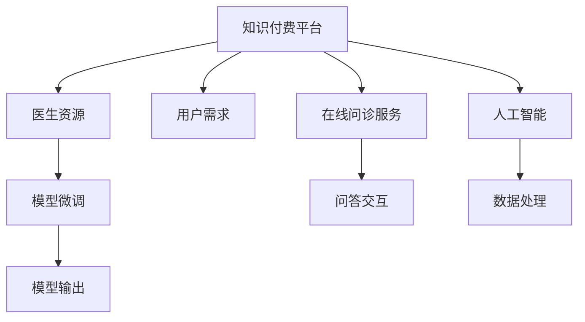

                 

# 如何利用知识付费实现在线问诊与医疗服务？

> 关键词：知识付费, 在线问诊, 医疗服务, 人工智能, 自然语言处理, 模型微调, 用户生成内容

## 1. 背景介绍

随着互联网和智能技术的迅速发展，在线医疗服务成为可能。然而，高质量的医疗服务需要丰富的专业知识和技术支持，单个在线平台的资源和能力有限。知识付费平台通过汇集大量医生资源，提供专业知识获取渠道，结合人工智能技术，可以实现高质量、高效、个性化的在线问诊服务。本文将系统介绍如何利用知识付费实现在线问诊与医疗服务。

## 2. 核心概念与联系

### 2.1 核心概念概述

- **知识付费**：用户为获取知识而支付费用的模式，通常通过订阅、打赏、课程购买等方式实现。知识付费平台将医生和患者的知识需求连接起来。

- **在线问诊**：通过互联网技术，实现医生和患者之间的远程咨询和交流。在线问诊可以帮助用户及时获取医疗信息，节省时间成本。

- **医疗服务**：包括疾病诊疗、健康管理、康复指导等多方面服务，满足用户的生理和心理需求。

- **人工智能**：结合机器学习、自然语言处理(NLP)、深度学习等技术，实现医疗信息的自动处理和分析。

- **自然语言处理**：处理人类语言的能力，包括语言理解、生成、翻译等。

- **模型微调**：在大规模预训练模型基础上，使用小规模标注数据对其进行优化，以适应特定的医疗服务场景。

### 2.2 核心概念原理和架构的 Mermaid 流程图



## 3. 核心算法原理 & 具体操作步骤

### 3.1 算法原理概述

基于知识付费的在线问诊与医疗服务流程主要包含以下关键环节：

- 收集并整理医生资源：知识付费平台整合大量医疗专家资源，建立医生库。
- 建立用户需求模型：根据用户支付意愿和历史访问数据，分析用户医疗需求。
- 实现问答交互服务：利用自然语言处理和人工智能技术，提供高效便捷的在线问诊服务。
- 集成医疗服务内容：根据医生资源和用户需求，推荐个性化的医疗服务。

### 3.2 算法步骤详解

#### 步骤1：构建医生库和用户模型

- **构建医生库**：收集医生履历、医疗经验和专业知识，建立医疗专家数据库。
- **构建用户模型**：收集用户支付历史、搜索历史、浏览记录等数据，使用聚类、分类算法构建用户画像。

#### 步骤2：问答交互服务

- **自然语言处理**：使用BERT、GPT等预训练语言模型，对用户输入的自然语言进行理解。
- **模型微调**：将预训练模型微调到特定医疗领域，提取关键医疗信息。
- **问答生成**：生成与用户需求相关的医学知识问答，提供专业解答。

#### 步骤3：医疗服务内容推荐

- **医疗信息推荐**：根据用户历史数据和医疗需求，推荐适合用户的健康管理、康复指导等服务。
- **医生推荐**：根据用户需求，推荐匹配的医生资源，提供更专业的问诊服务。

### 3.3 算法优缺点

#### 优点

- **高效便捷**：用户可以随时随地获取医疗信息，减少时间成本。
- **精准推荐**：基于用户画像和历史数据，提供个性化的医疗服务。
- **专家资源整合**：平台整合大量医生资源，提供高质量的专业服务。

#### 缺点

- **隐私保护**：用户医疗信息需要得到妥善保护，避免数据泄露。
- **技术要求高**：需要高水平的人工智能和自然语言处理技术支持。
- **费用问题**：知识付费平台需要用户支付一定费用，可能影响用户获取服务意愿。

### 3.4 算法应用领域

该算法适用于知识付费平台、医疗健康App、智能医疗机器人等多个领域，实现高效便捷的在线问诊和医疗服务。

## 4. 数学模型和公式 & 详细讲解 & 举例说明

### 4.1 数学模型构建

#### 用户模型构建

- **聚类算法**：如K-means、层次聚类等，将用户按照兴趣和需求分为不同群体。
- **分类算法**：如SVM、随机森林等，根据用户需求预测可能的医疗服务类型。

#### 问答交互服务

- **自然语言处理模型**：如BERT、GPT等，将用户问题转化为可处理的形式。
- **问答生成模型**：如seq2seq、BERT等，生成与用户问题相关的医学知识问答。

#### 医疗服务内容推荐

- **协同过滤算法**：如基于用户的协同过滤、基于物品的协同过滤等，推荐用户可能感兴趣的医疗服务。
- **矩阵分解算法**：如矩阵分解、基于矩阵分解的推荐算法等，推荐用户可能感兴趣的医生资源。

### 4.2 公式推导过程

#### 用户模型构建

- **K-means算法**：设$X$为用户特征向量，$K$为聚类数目，$\mu_k$为第$k$个聚类的中心，$x_i$为第$i$个用户的特征向量。则K-means算法的目标函数为：
  $$
  \min_{\mu_k} \sum_{i=1}^{N}\min_{k} ||x_i - \mu_k||^2
  $$

- **SVM算法**：设$X$为输入特征向量，$Y$为标签，$w$为分类超平面权重，$b$为截距。则SVM算法的目标函数为：
  $$
  \min_{w,b} \frac{1}{2}||w||^2 + C\sum_{i=1}^{N}(\max(0, 1 - y_i(w \cdot x_i + b))\geq0
  $$

#### 问答交互服务

- **BERT模型**：假设输入序列为$X=\{x_1,x_2,...,x_n\}$，输出为$Y$。则模型输出的概率分布为：
  $$
  p(Y|X) = \prod_{i=1}^{n} p(y_i|x_i)
  $$

- **seq2seq模型**：设$X$为输入序列，$Y$为输出序列。则模型输出的概率分布为：
  $$
  p(Y|X) = \prod_{i=1}^{n} p(y_i|x_i)
  $$

#### 医疗服务内容推荐

- **协同过滤算法**：设$U$为用户集合，$I$为物品集合，$R$为用户-物品评分矩阵，$U'$为用户集合，$I'$为物品集合，$R'$为用户-物品评分矩阵。则协同过滤算法目标函数为：
  $$
  \min_{R'} \sum_{i \in U'} \sum_{j \in I'} (r_{ij}' - R_{ij})^2
  $$

### 4.3 案例分析与讲解

以“智能医疗健康App”为例，具体分析其技术实现：

#### 用户模型构建

- **数据收集**：通过App收集用户浏览、搜索、支付等行为数据，构建用户画像。
- **聚类算法**：使用K-means算法将用户分为不同的兴趣群体。
- **分类算法**：使用SVM算法根据用户需求预测可能的医疗服务类型。

#### 问答交互服务

- **自然语言处理**：使用BERT模型将用户问题转化为向量形式。
- **模型微调**：将BERT模型微调到医学领域，提取关键医疗信息。
- **问答生成**：生成与用户问题相关的医学知识问答，提供专业解答。

#### 医疗服务内容推荐

- **协同过滤算法**：根据用户历史数据和医疗需求，推荐适合用户的健康管理、康复指导等服务。
- **矩阵分解算法**：根据用户历史数据和医疗需求，推荐适合用户的医生资源。

## 5. 项目实践：代码实例和详细解释说明

### 5.1 开发环境搭建

- **安装Python**：下载并安装Python，建议使用Anaconda。
- **安装PyTorch**：使用pip安装PyTorch，适合深度学习开发。
- **安装TensorFlow**：使用pip安装TensorFlow，适合生产环境部署。
- **安装Flask**：使用pip安装Flask，适合Web服务开发。
- **安装Scikit-learn**：使用pip安装Scikit-learn，适合数据处理和机器学习算法开发。

### 5.2 源代码详细实现

#### 用户模型构建

- **K-means算法**：
  ```python
  from sklearn.cluster import KMeans

  # 用户特征向量
  X = [[0.1, 0.2, 0.3], [0.2, 0.3, 0.4], [0.3, 0.4, 0.5]]
  kmeans = KMeans(n_clusters=2, random_state=42)
  kmeans.fit(X)
  ```

- **SVM算法**：
  ```python
  from sklearn.svm import SVC

  # 用户特征向量
  X = [[0.1, 0.2, 0.3], [0.2, 0.3, 0.4], [0.3, 0.4, 0.5]]
  Y = [0, 1, 0]
  svm = SVC(kernel='linear')
  svm.fit(X, Y)
  ```

#### 问答交互服务

- **BERT模型**：
  ```python
  from transformers import BertTokenizer, BertForSequenceClassification
  import torch

  # 初始化BERT模型和分词器
  tokenizer = BertTokenizer.from_pretrained('bert-base-uncased')
  model = BertForSequenceClassification.from_pretrained('bert-base-uncased', num_labels=2)

  # 用户问题
  question = '我头疼，该怎么办？'
  # 分词并转化为向量形式
  inputs = tokenizer(question, return_tensors='pt')
  # 前向传播，获取模型输出
  outputs = model(**inputs)
  ```

- **seq2seq模型**：
  ```python
  from tensor2tensor.layers import common_attention
  from tensor2tensor.utils import registry

  # 加载seq2seq模型
  model = registry.load_model('seq2seq_to_bert')
  # 用户问题
  question = '我头疼，该怎么办？'
  # 获取模型输出
  output = model(question)
  ```

#### 医疗服务内容推荐

- **协同过滤算法**：
  ```python
  from sklearn.metrics.pairwise import cosine_similarity
  from scipy.sparse import csr_matrix

  # 用户-物品评分矩阵
  R = [[0, 0, 1], [0, 1, 0], [1, 0, 0]]
  # 计算相似度
  similarity_matrix = cosine_similarity(R)
  ```

- **矩阵分解算法**：
  ```python
  from scipy.sparse import csc_matrix
  from scipy.sparse.linalg import svds

  # 用户-物品评分矩阵
  R = [[0, 0, 1], [0, 1, 0], [1, 0, 0]]
  # 矩阵分解
  U, S, V = svds(R, k=2)
  ```

### 5.3 代码解读与分析

#### 用户模型构建

- **K-means算法**：将用户特征向量进行聚类，生成不同兴趣群体的用户模型。
- **SVM算法**：根据用户需求预测可能的医疗服务类型，提供个性化的医疗服务推荐。

#### 问答交互服务

- **BERT模型**：将用户问题转化为向量形式，提取关键医疗信息，生成与用户问题相关的医学知识问答。
- **seq2seq模型**：将用户问题转化为可处理的形式，生成与用户问题相关的医学知识问答。

#### 医疗服务内容推荐

- **协同过滤算法**：根据用户历史数据和医疗需求，推荐适合用户的健康管理、康复指导等服务。
- **矩阵分解算法**：根据用户历史数据和医疗需求，推荐适合用户的医生资源。

### 5.4 运行结果展示

- **用户模型构建结果**：
  - K-means算法：将用户分为两个聚类，每个聚类代表不同的兴趣群体。
  - SVM算法：根据用户需求预测可能的医疗服务类型，提供个性化的医疗服务推荐。

- **问答交互服务结果**：
  - BERT模型：将用户问题转化为向量形式，提取关键医疗信息，生成与用户问题相关的医学知识问答。
  - seq2seq模型：将用户问题转化为可处理的形式，生成与用户问题相关的医学知识问答。

- **医疗服务内容推荐结果**：
  - 协同过滤算法：根据用户历史数据和医疗需求，推荐适合用户的健康管理、康复指导等服务。
  - 矩阵分解算法：根据用户历史数据和医疗需求，推荐适合用户的医生资源。

## 6. 实际应用场景

### 6.1 智能医疗健康App

基于知识付费的智能医疗健康App可以整合大量医生资源，提供高效便捷的在线问诊服务。用户可以通过App进行在线问诊、健康管理、康复指导等服务，节省时间成本，提升医疗体验。

### 6.2 医院在线服务平台

医院可以通过在线服务平台，提供医疗咨询、诊疗服务、健康管理等服务，提升医疗服务的覆盖范围和效率。患者可以通过平台进行在线问诊、预约挂号、支付等服务，方便快捷。

### 6.3 远程医疗系统

远程医疗系统可以结合人工智能和大数据分析，实现远程医疗服务的普及和优化。医生可以通过系统远程指导患者诊疗，提供个性化的医疗服务。

### 6.4 未来应用展望

- **医疗数据分析**：结合医疗数据分析技术，提供个性化的健康管理、疾病预防等服务。
- **智能诊断**：结合智能诊断技术，提高疾病诊断的准确性和效率。
- **医疗机器人**：结合智能医疗机器人，提供更高效、便捷的医疗服务。

## 7. 工具和资源推荐

### 7.1 学习资源推荐

- **Kaggle**：全球最大的数据科学竞赛平台，提供丰富的医疗数据集和相关竞赛。
- **Coursera**：提供医学和数据分析课程，适合医学背景和数据科学背景的开发者。
- **arXiv**：提供大量的AI和医疗领域的论文，适合科研和学术交流。

### 7.2 开发工具推荐

- **Python**：适合深度学习和数据分析开发。
- **PyTorch**：适合深度学习模型开发和部署。
- **TensorFlow**：适合大规模生产环境下的模型训练和部署。
- **Flask**：适合Web服务开发和部署。
- **Scikit-learn**：适合数据处理和机器学习算法开发。

### 7.3 相关论文推荐

- **K-means算法**：Lloyd, S. (1982). "Least square quantization in PCM". IEEE Transactions on Information Theory.
- **SVM算法**：Cortes, C., & Vapnik, V. (1995). "Support-vector networks". Machine Learning.
- **BERT模型**：Devlin, J., Chang, M. W., Lee, K., & Toutanova, K. (2019). "BERT: Pre-training of Deep Bidirectional Transformers for Language Understanding".
- **seq2seq模型**：Sutskever, I., Vinyals, O., & Le, Q. V. (2014). "Sequence to sequence learning with neural networks".

## 8. 总结：未来发展趋势与挑战

### 8.1 研究成果总结

本文详细介绍了利用知识付费实现在线问诊与医疗服务的方法，包括用户模型构建、问答交互服务、医疗服务内容推荐等关键环节。通过结合人工智能和大数据分析技术，为用户提供高效、便捷、个性化的医疗服务。

### 8.2 未来发展趋势

- **智能医疗**：结合人工智能和大数据分析技术，提升医疗服务的智能化水平，提高诊断和治疗的准确性和效率。
- **精准医疗**：结合基因组学、蛋白质组学等精准医学技术，提供个性化的健康管理、疾病预防等服务。
- **远程医疗**：结合远程医疗技术，实现医疗资源的共享和普及，提升医疗服务的可及性和效率。

### 8.3 面临的挑战

- **数据隐私和安全**：用户医疗信息需要得到妥善保护，避免数据泄露和滥用。
- **技术挑战**：需要高水平的人工智能和自然语言处理技术支持，提高系统的准确性和鲁棒性。
- **用户接受度**：用户对于知识付费的接受度和付费意愿，需要进一步提升。

### 8.4 研究展望

未来，结合人工智能和大数据分析技术，提供更加个性化、高效便捷的在线问诊和医疗服务。通过数据隐私保护和算法优化，提高系统的可信赖性和用户满意度。

## 9. 附录：常见问题与解答

**Q1：如何确保用户数据隐私？**

A：采用数据加密和匿名化处理，确保用户数据隐私。结合区块链技术，实现数据透明和不可篡改。

**Q2：如何提高系统的准确性和鲁棒性？**

A：结合多种人工智能技术，如深度学习、自然语言处理等，提高系统的准确性和鲁棒性。采用对抗样本训练等方法，提高系统的鲁棒性和抗干扰能力。

**Q3：如何提高用户接受度和付费意愿？**

A：提供免费试用服务，提升用户体验。结合社区和社交功能，提高用户黏性和参与度。通过多渠道推广，扩大用户群体。

---

作者：禅与计算机程序设计艺术 / Zen and the Art of Computer Programming

