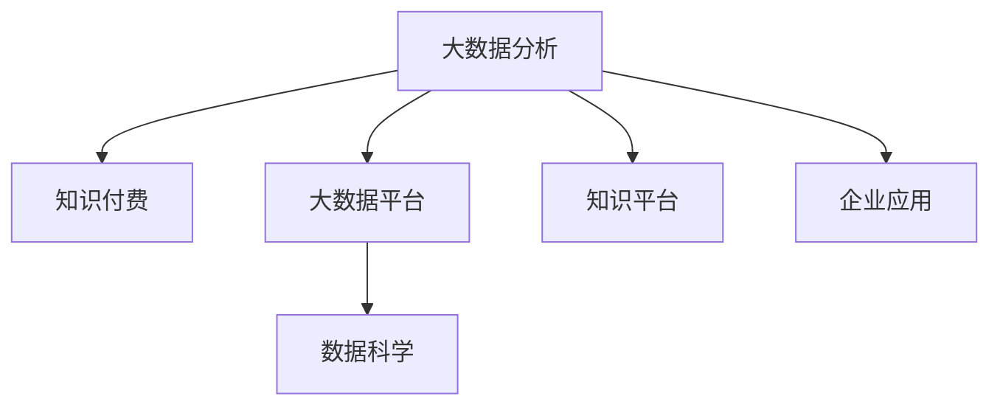

                 

# 如何利用知识付费实现大数据分析与应用？

## 1. 背景介绍

随着互联网和移动互联网的普及，大数据已广泛应用于各行各业，为企业决策、产品研发、市场营销等提供了重要支持。然而，对于许多中小企业，尤其是创新型企业，缺乏专业的大数据分析能力，难以从海量的数据中挖掘出有价值的洞见。知识付费作为一种新型的知识获取方式，利用了互联网平台的便利性和共享经济的优势，通过付费订阅、按需付费等形式，为用户提供了更为精准、便捷的知识服务。本文将探讨如何利用知识付费模式，结合大数据分析技术，提升企业的数据应用能力，实现精准决策与创新。

## 2. 核心概念与联系

### 2.1 核心概念概述

为更好地理解知识付费结合大数据分析的应用，本节将介绍几个关键概念：

- 大数据分析（Big Data Analysis）：通过收集、存储、管理和分析海量数据，揭示数据背后的模式、趋势和关联，辅助企业决策和产品开发。
- 知识付费（Knowledge Pay-to-Use）：用户为获取深度、结构化、高质量的知识内容而支付的费用，形式包括订阅、购买等。
- 知识平台（Knowledge Platform）：如Coursera、Udacity、知识星球等，为用户提供专业化、系统化的知识内容服务。
- 大数据平台（Big Data Platform）：如Hadoop、Spark、Flink等，提供了数据存储、计算和分析的基础设施。
- 数据科学（Data Science）：融合统计学、计算机科学、机器学习等学科，通过数据驱动决策和产品创新的交叉学科。

这些概念之间的关系可以表示为：



这个图表展示了大数据分析与知识付费、数据平台、数据科学以及企业应用之间的逻辑联系：

- 大数据分析依托于大数据平台，通过数据科学方法，对海量数据进行深度分析，帮助企业洞察市场趋势，提升决策质量。
- 知识付费则为企业提供了获取高质量知识内容的方式，使企业能够更好地利用大数据分析的成果。
- 知识平台和数据平台为大数据分析提供了重要的基础设施和技术支持。
- 企业应用则将大数据分析的洞察与知识付费获取的深度内容相结合，推动企业创新和优化。

### 2.2 核心概念原理和架构

大数据分析的核心流程包括数据收集、数据存储、数据预处理、数据分析和数据可视化五个步骤。具体而言：

1. **数据收集**：通过网络爬虫、传感器、API接口等方式，收集企业内外部的各类数据，包括用户行为数据、交易数据、市场数据等。

2. **数据存储**：将收集到的数据存储在分布式存储系统中，如Hadoop、Spark等。这些系统能够高效地处理海量数据，支持大规模的存储和查询。

3. **数据预处理**：对原始数据进行清洗、归一化、采样等处理，确保数据的质量和可用性。常用的预处理技术包括ETL（Extract, Transform, Load）和数据清洗工具。

4. **数据分析**：利用统计学和机器学习算法，对处理后的数据进行分析，提取有价值的信息和洞见。常用的分析技术包括描述性统计、回归分析、聚类分析、预测分析等。

5. **数据可视化**：将分析结果转化为图表、报表等可视化形式，直观地展示给决策者和用户，辅助他们理解和应用。常用的可视化工具包括Tableau、Power BI、D3.js等。

## 3. 核心算法原理 & 具体操作步骤

### 3.1 算法原理概述

知识付费结合大数据分析的基本原理是：通过支付费用获取优质的知识内容，结合大数据分析技术，对数据进行深入挖掘和应用，从而为企业提供精准的决策支持和创新灵感。

具体而言，知识付费平台提供了高质量的课程、讲座、书籍等内容，企业可以通过订阅或购买，获取这些知识资源。在知识付费内容的基础上，结合企业自身的数据，利用大数据分析技术，进行数据挖掘和建模，得出有价值的洞见和结论。

### 3.2 算法步骤详解

基于知识付费和大数据分析的应用流程可以总结为以下六个步骤：

1. **知识内容获取**：选择适合企业需求的知识内容，通过知识付费平台订阅或购买，获取高质量的课程、文章、报告等资源。

2. **数据整合**：将知识内容中的关键概念、理论、方法等与企业内部数据进行整合，构建综合的数据集。

3. **数据清洗与预处理**：对整合后的数据进行清洗、归一化、采样等处理，确保数据的质量和可用性。

4. **数据分析**：利用统计学和机器学习算法，对处理后的数据进行分析，提取有价值的信息和洞见。

5. **知识应用**：将分析结果转化为具体的应用方案，如产品优化、市场策略、用户体验提升等。

6. **效果评估**：对应用方案的效果进行评估和反馈，持续优化知识应用过程。

### 3.3 算法优缺点

#### 优点

1. **深度内容获取**：通过知识付费获取深度、结构化、高质量的内容，有助于提升企业的数据应用能力。

2. **知识与数据融合**：结合知识内容和实际数据，进行更深入、全面的数据分析，得到有价值的洞见。

3. **定制化服务**：根据企业需求，选择适合的知识内容，进行个性化定制，提高应用效果。

4. **成本效益**：知识付费模式降低了获取优质知识资源的门槛，同时提高了数据分析的效率和效果，具有较高的成本效益。

#### 缺点

1. **成本投入**：企业需要支付知识内容的使用费用，长期来看可能有一定成本压力。

2. **知识内容匹配**：选择适合的知识内容需要一定的筛选和匹配过程，需要一定的专业知识和判断。

3. **知识内容更新**：知识内容需要不断更新，以保证其时效性和相关性，这增加了知识获取和管理的复杂性。

4. **数据分析门槛**：需要一定的数据分析能力和技术支持，对企业的技术团队提出了较高的要求。

### 3.4 算法应用领域

知识付费结合大数据分析的方法可以广泛应用于以下几个领域：

1. **市场营销**：利用用户行为数据和市场趋势，制定精准的市场营销策略，提升广告投放效果和客户转化率。

2. **产品研发**：通过数据分析和市场洞察，了解用户需求和市场趋势，指导产品设计和迭代，提升用户体验和满意度。

3. **客户服务**：利用客户反馈数据和市场分析，改进客户服务流程和策略，提升客户满意度和忠诚度。

4. **供应链管理**：通过数据分析和市场预测，优化供应链管理，降低库存成本，提高运营效率。

5. **财务分析**：利用交易数据和财务数据，进行财务分析和风险管理，提升企业财务决策能力。

6. **人力资源管理**：通过员工数据和市场分析，优化人力资源配置和管理，提升企业人才竞争力和绩效。

## 4. 数学模型和公式 & 详细讲解 & 举例说明

### 4.1 数学模型构建

知识付费结合大数据分析的数学模型构建主要包括以下几个部分：

- **数据收集与整合**：
  $$
  D = \bigcup \{d_i\}_{i=1}^N
  $$
  其中，$D$为整合后的数据集，$d_i$为单个数据样本。

- **数据清洗与预处理**：
  $$
  D_{\text{clean}} = \bigcap \{D_{\text{clean}_i}\}_{i=1}^N
  $$
  其中，$D_{\text{clean}_i}$为第$i$个数据样本的清洗与预处理结果。

- **数据分析**：
  $$
  A(D_{\text{clean}}) = \{a_i\}_{i=1}^M
  $$
  其中，$A$为数据分析过程，$a_i$为分析结果。

- **知识应用**：
  $$
  P(A(D_{\text{clean}})) = \{p_i\}_{i=1}^N
  $$
  其中，$P$为知识应用过程，$p_i$为应用方案。

### 4.2 公式推导过程

以市场营销为例，我们可以使用回归分析来推导市场营销中的关键公式：

1. **销售预测模型**：
  $$
  y = \beta_0 + \beta_1 x_1 + \beta_2 x_2 + \cdots + \beta_k x_k + \epsilon
  $$
  其中，$y$为预测的销售额，$x_i$为第$i$个特征，$\beta_i$为回归系数，$\epsilon$为误差项。

2. **客户细分模型**：
  $$
  T = \sum_{i=1}^K \delta_i T_i
  $$
  其中，$T$为客户的细分结果，$T_i$为第$i$个细分类别，$\delta_i$为分配权重。

3. **广告效果评估模型**：
  $$
  E = \frac{\sum_{i=1}^N (y_i - \hat{y}_i)^2}{\sum_{i=1}^N (y_i - \bar{y})^2}
  $$
  其中，$E$为广告效果评估指标，$y_i$为实际销售额，$\hat{y}_i$为预测销售额，$\bar{y}$为平均销售额。

### 4.3 案例分析与讲解

**案例一：电商平台用户行为分析**

某电商平台希望通过知识付费结合大数据分析，提升用户转化率和销售额。具体步骤包括：

1. **知识内容获取**：选择市场营销和用户行为分析相关的课程和文章，订阅付费学习。

2. **数据整合**：将课程中的理论和方法与平台的用户行为数据进行整合，构建综合的数据集。

3. **数据清洗与预处理**：对整合后的数据进行清洗、归一化、采样等处理，确保数据的质量和可用性。

4. **数据分析**：利用回归分析、聚类分析等方法，对用户行为数据进行分析，找出影响用户转化的关键因素。

5. **知识应用**：根据分析结果，优化广告投放策略和产品推荐算法，提升用户转化率和销售额。

6. **效果评估**：对优化后的策略进行效果评估，持续优化和改进。

通过这些步骤，电商平台能够充分利用大数据分析的优势，结合知识付费获取的深度内容，实现精准的市场营销和用户转化。

**案例二：餐饮行业需求预测**

某餐饮企业希望通过知识付费结合大数据分析，进行需求预测和供应链管理。具体步骤包括：

1. **知识内容获取**：选择供应链管理和需求预测相关的课程和文章，订阅付费学习。

2. **数据整合**：将课程中的理论和实际需求数据进行整合，构建综合的数据集。

3. **数据清洗与预处理**：对整合后的数据进行清洗、归一化、采样等处理，确保数据的质量和可用性。

4. **数据分析**：利用时间序列分析、回归分析等方法，对需求数据进行分析，预测未来需求变化趋势。

5. **知识应用**：根据需求预测结果，优化库存管理和供应链策略，降低库存成本，提高运营效率。

6. **效果评估**：对优化后的策略进行效果评估，持续优化和改进。

通过这些步骤，餐饮企业能够充分利用大数据分析的优势，结合知识付费获取的深度内容，实现精准的需求预测和供应链管理。

## 5. 项目实践：代码实例和详细解释说明

### 5.1 开发环境搭建

在进行知识付费结合大数据分析的项目实践前，我们需要准备好开发环境。以下是使用Python进行Pandas、NumPy、Scikit-Learn等数据科学库开发的Python环境配置流程：

1. 安装Anaconda：从官网下载并安装Anaconda，用于创建独立的Python环境。

2. 创建并激活虚拟环境：
```bash
conda create -n data-env python=3.8 
conda activate data-env
```

3. 安装数据科学库：
```bash
conda install pandas numpy scikit-learn statsmodels scipy matplotlib seaborn tqdm jupyter notebook ipython
```

4. 安装知识付费平台API：
```bash
pip install knowledge-payment-api
```

5. 安装大数据平台API：
```bash
pip install big-data-platform-api
```

完成上述步骤后，即可在`data-env`环境中开始知识付费结合大数据分析的实践。

### 5.2 源代码详细实现

这里我们以电商平台的市场营销分析为例，给出使用Pandas、NumPy、Scikit-Learn库进行市场营销分析的Python代码实现。

```python
import pandas as pd
from sklearn.linear_model import LinearRegression

# 加载数据
data = pd.read_csv('sales_data.csv')

# 数据清洗与预处理
data = data.dropna()
data = data.drop_duplicates()

# 特征选择
features = ['feature1', 'feature2', 'feature3']
X = data[features]
y = data['sales']

# 模型训练
model = LinearRegression()
model.fit(X, y)

# 预测与评估
test_data = pd.read_csv('test_data.csv')
test_data = test_data.dropna()
test_data = test_data.drop_duplicates()
predictions = model.predict(test_data[features])

# 效果评估
from sklearn.metrics import r2_score
score = r2_score(y, predictions)
print(f'R-squared score: {score:.2f}')
```

### 5.3 代码解读与分析

让我们再详细解读一下关键代码的实现细节：

**加载数据**：使用Pandas库的`read_csv`方法加载CSV格式的数据文件。

**数据清洗与预处理**：使用`dropna`和`drop_duplicates`方法，清洗和去重数据，确保数据的质量和可用性。

**特征选择**：根据市场营销分析的需要，选择影响销售额的关键特征。

**模型训练**：使用Scikit-Learn库的`LinearRegression`模型进行回归分析，拟合数据并得到预测模型。

**预测与评估**：使用训练好的模型对测试数据进行预测，并使用R-squared评分指标评估模型的效果。

通过这些步骤，我们能够快速搭建起一个市场营销分析的Python代码框架，并结合知识付费获取的深度内容，进行数据分析和应用。

## 6. 实际应用场景

### 6.1 电商平台的市场营销分析

电商平台的市场营销分析是大数据与知识付费结合的重要应用场景之一。通过分析用户行为数据，了解用户需求和市场趋势，制定精准的市场营销策略，提升广告投放效果和客户转化率。具体应用包括：

1. **用户行为分析**：利用用户浏览、点击、购买等行为数据，进行聚类分析，了解不同用户群体的特征和需求。

2. **广告效果评估**：通过A/B测试等方法，评估不同广告策略的效果，优化广告投放。

3. **销售预测**：利用历史销售数据和用户行为数据，构建预测模型，预测未来的销售额。

4. **推荐系统**：结合用户行为数据和市场趋势，优化推荐算法，提升用户满意度和转化率。

### 6.2 餐饮行业的需求预测

餐饮行业的需求预测是大数据与知识付费结合的另一个重要应用场景。通过分析历史订单数据，预测未来的需求变化趋势，优化供应链管理，降低库存成本，提高运营效率。具体应用包括：

1. **需求预测**：利用时间序列分析等方法，预测未来的订单需求变化趋势。

2. **库存管理**：根据预测结果，调整库存策略，避免库存过剩或不足。

3. **供应链优化**：利用数据分析结果，优化供应链管理和物流配送，降低运营成本。

4. **市场分析**：通过数据分析，了解市场趋势和用户需求，指导产品设计和市场推广。

### 6.3 医疗行业的健康数据分析

医疗行业的健康数据分析是大数据与知识付费结合的另一个重要应用场景。通过分析患者健康数据，了解疾病发展趋势和患者行为特征，优化健康管理和医疗服务。具体应用包括：

1. **健康数据分析**：利用患者健康数据和基因数据，进行数据分析，了解疾病发展趋势和患者行为特征。

2. **疾病预测**：利用机器学习模型，预测患者未来的疾病风险和病情发展。

3. **健康管理**：结合患者行为数据和健康数据分析结果，制定个性化的健康管理方案。

4. **医疗服务优化**：通过数据分析，优化医疗资源配置和医疗服务流程，提高医疗服务的质量和效率。

## 7. 工具和资源推荐

### 7.1 学习资源推荐

为了帮助开发者系统掌握知识付费结合大数据分析的理论基础和实践技巧，这里推荐一些优质的学习资源：

1. **《大数据分析与应用》课程**：由知名大学开设的线上课程，涵盖大数据分析的基本概念、工具和应用。

2. **《Python数据科学手册》书籍**：详细介绍Python在数据分析和数据科学中的应用，适合初学者和中级开发者。

3. **《深度学习与大数据分析》课程**：结合深度学习和大数据分析的综合性课程，适合有编程基础的学习者。

4. **《知识付费模式与数据分析》博客**：专业博客，详细介绍知识付费模式与大数据分析的结合方法，案例分析详尽。

5. **《数据分析与可视化》课程**：重点讲解数据分析和数据可视化技术的在线课程，涵盖Pandas、NumPy、Matplotlib等工具。

通过这些资源的学习实践，相信你一定能够快速掌握知识付费结合大数据分析的精髓，并用于解决实际的商业问题。

### 7.2 开发工具推荐

高效的开发离不开优秀的工具支持。以下是几款用于知识付费结合大数据分析开发的常用工具：

1. **Pandas**：数据处理和分析的Python库，提供了灵活的数据处理和分析功能。

2. **NumPy**：数学计算库，提供了高效的多维数组和矩阵计算功能。

3. **Scikit-Learn**：机器学习库，提供了丰富的机器学习算法和模型。

4. **TensorFlow**：深度学习框架，提供了灵活的深度学习模型和算法。

5. **Jupyter Notebook**：交互式编程环境，方便进行数据分析和模型调试。

合理利用这些工具，可以显著提升知识付费结合大数据分析任务的开发效率，加快创新迭代的步伐。

### 7.3 相关论文推荐

知识付费结合大数据分析的发展源于学界的持续研究。以下是几篇奠基性的相关论文，推荐阅读：

1. **《大数据与知识付费：理论基础与实践探索》**：探讨大数据与知识付费的理论基础和实践方法，提出系统的应用框架。

2. **《知识付费模式与数据科学：案例分析与建模》**：详细介绍知识付费模式与数据科学的结合方法，提供多个实际案例分析。

3. **《大数据分析与机器学习：方法与技术》**：综合介绍大数据分析和机器学习的基本方法和技术，适合理论学习者。

4. **《数据科学在知识付费中的应用》**：详细探讨数据科学在知识付费平台中的应用，提供丰富的实例和应用场景。

这些论文代表了大数据与知识付费结合技术的发展脉络。通过学习这些前沿成果，可以帮助研究者把握学科前进方向，激发更多的创新灵感。

## 8. 总结：未来发展趋势与挑战

### 8.1 总结

本文对知识付费结合大数据分析的应用进行了全面系统的介绍。首先阐述了知识付费和大数据分析的研究背景和应用意义，明确了知识付费在提升企业数据分析能力方面的独特价值。其次，从原理到实践，详细讲解了知识付费结合大数据分析的数学模型和关键步骤，给出了知识付费结合大数据分析的完整代码实例。同时，本文还广泛探讨了知识付费结合大数据分析在电商、餐饮、医疗等多个行业领域的应用前景，展示了知识付费结合大数据分析的广阔潜力。最后，本文精选了知识付费结合大数据分析的相关资源，力求为读者提供全方位的技术指引。

通过本文的系统梳理，可以看到，知识付费结合大数据分析为中小企业提供了一种高效、便捷、精准的数据应用方式，有助于提升企业的决策能力和创新能力。未来，伴随知识付费和数据分析技术的不断演进，相信知识付费结合大数据分析必将在更多领域大放异彩，推动企业在数字化转型中迈向新的高度。

### 8.2 未来发展趋势

展望未来，知识付费结合大数据分析技术将呈现以下几个发展趋势：

1. **智能分析**：结合人工智能技术，提高数据分析的自动化和智能化水平，降低人工干预的复杂性。

2. **个性化服务**：根据用户需求和行为，提供个性化的数据分析和知识服务，提升用户体验和满意度。

3. **实时分析**：通过实时数据流处理技术，实现对数据的实时分析，及时响应市场变化和用户需求。

4. **跨领域应用**：结合不同领域的数据和知识，进行多领域融合分析，拓展数据分析的应用范围。

5. **数据治理**：建立数据治理体系，确保数据质量和安全，提升数据分析的可靠性和可解释性。

6. **知识自动化**：通过知识图谱等技术，实现知识的自动化和智能化处理，提高知识管理的效率和效果。

以上趋势凸显了知识付费结合大数据分析技术的广阔前景。这些方向的探索发展，必将进一步提升知识付费服务的内容质量和应用效果，为知识付费平台的长期发展提供新的动力。

### 8.3 面临的挑战

尽管知识付费结合大数据分析技术已经取得了瞩目成就，但在迈向更加智能化、普适化应用的过程中，它仍面临着诸多挑战：

1. **数据隐私与安全**：在数据分析过程中，需要保护用户隐私和数据安全，避免数据泄露和滥用。

2. **数据质量和一致性**：不同数据源的数据质量和一致性差异较大，需要进行数据清洗和整合，确保数据的一致性和完整性。

3. **知识匹配与适配**：选择适合的知识内容需要进行一定的筛选和匹配，需要一定的专业知识和判断。

4. **知识更新与维护**：知识内容需要不断更新，以保证其时效性和相关性，增加了知识获取和管理的复杂性。

5. **成本效益**：知识付费模式下，企业需要支付知识内容的使用费用，长期来看可能有一定成本压力。

6. **技术门槛**：需要一定的数据分析能力和技术支持，对企业的技术团队提出了较高的要求。

正视知识付费结合大数据分析面临的这些挑战，积极应对并寻求突破，将使知识付费结合大数据分析技术走向成熟，更好地服务于企业和用户。

### 8.4 研究展望

面对知识付费结合大数据分析所面临的种种挑战，未来的研究需要在以下几个方面寻求新的突破：

1. **数据隐私保护**：研究数据隐私保护技术，确保用户数据的安全和隐私，建立数据使用规范。

2. **知识匹配算法**：开发更加智能的知识匹配算法，根据用户需求和行为，推荐适合的知识内容。

3. **数据治理体系**：建立数据治理体系，确保数据质量和安全，提升数据分析的可靠性和可解释性。

4. **知识图谱与自动化**：研究知识图谱技术，实现知识的自动化和智能化处理，提高知识管理的效率和效果。

5. **跨领域融合**：结合不同领域的数据和知识，进行多领域融合分析，拓展数据分析的应用范围。

6. **实时数据处理**：研究实时数据流处理技术，实现对数据的实时分析，及时响应市场变化和用户需求。

这些研究方向的探索，必将引领知识付费结合大数据分析技术迈向更高的台阶，为知识付费平台的长期发展提供新的动力。面向未来，知识付费结合大数据分析技术还需要与其他人工智能技术进行更深入的融合，如知识图谱、深度学习、增强学习等，多路径协同发力，共同推动知识付费平台的发展和创新。

## 9. 附录：常见问题与解答

**Q1：知识付费结合大数据分析的流程是怎样的？**

A: 知识付费结合大数据分析的流程主要包括以下几个步骤：

1. **知识内容获取**：选择适合企业需求的知识内容，通过知识付费平台订阅或购买，获取高质量的课程、文章、报告等资源。

2. **数据整合**：将知识内容中的关键概念、理论、方法等与企业内部数据进行整合，构建综合的数据集。

3. **数据清洗与预处理**：对整合后的数据进行清洗、归一化、采样等处理，确保数据的质量和可用性。

4. **数据分析**：利用统计学和机器学习算法，对处理后的数据进行分析，提取有价值的信息和洞见。

5. **知识应用**：将分析结果转化为具体的应用方案，如产品优化、市场策略、用户体验提升等。

6. **效果评估**：对应用方案的效果进行评估和反馈，持续优化知识应用过程。

通过这些步骤，企业能够充分利用大数据分析的优势，结合知识付费获取的深度内容，实现精准的数据应用。

**Q2：知识付费结合大数据分析有哪些应用场景？**

A: 知识付费结合大数据分析的应用场景非常广泛，包括：

1. **市场营销**：利用用户行为数据和市场趋势，制定精准的市场营销策略，提升广告投放效果和客户转化率。

2. **产品研发**：通过数据分析和市场洞察，了解用户需求和市场趋势，指导产品设计和迭代，提升用户体验和满意度。

3. **客户服务**：利用客户反馈数据和市场分析，改进客户服务流程和策略，提升客户满意度和忠诚度。

4. **供应链管理**：通过数据分析和市场预测，优化供应链管理，降低库存成本，提高运营效率。

5. **财务分析**：利用交易数据和财务数据，进行财务分析和风险管理，提升企业财务决策能力。

6. **人力资源管理**：通过员工数据和市场分析，优化人力资源配置和管理，提升企业人才竞争力和绩效。

**Q3：如何选择合适的知识付费内容？**

A: 选择合适的知识付费内容需要综合考虑以下几个方面：

1. **内容质量**：选择高质量的课程、讲座、书籍等，确保内容的专业性和实用性。

2. **内容适用性**：选择与企业需求和业务场景相匹配的内容，确保知识内容的有效性和可应用性。

3. **知识更新**：选择具有时效性和相关性的内容，确保知识内容的及时性和可靠性。

4. **知识匹配**：根据企业的具体需求和业务场景，选择适合的知识内容，确保知识内容的适用性和匹配度。

5. **学习效果**：选择具有良好学习效果和反馈机制的内容，确保知识内容的实用性和效果。

**Q4：如何评估知识付费结合大数据分析的效果？**

A: 评估知识付费结合大数据分析的效果可以从以下几个方面进行：

1. **数据分析结果**：评估数据分析结果的准确性和可靠性，确保分析结果的实用性和可操作性。

2. **应用效果**：评估应用方案的效果，通过对比前后数据变化，评估知识应用的效果。

3. **用户反馈**：通过用户反馈和满意度调查，评估知识应用的用户接受度和效果。

4. **经济效益**：评估知识应用带来的经济效益，如成本降低、收益增加等。

5. **技术指标**：评估知识应用的技术指标，如处理速度、系统稳定性等。

通过这些评估方法，可以全面了解知识付费结合大数据分析的效果，并进行持续优化和改进。

**Q5：知识付费结合大数据分析的实现难度在哪里？**

A: 知识付费结合大数据分析的实现难度主要在于以下几个方面：

1. **数据整合**：不同数据源的数据质量和一致性差异较大，需要进行数据清洗和整合，确保数据的一致性和完整性。

2. **知识匹配**：选择适合的知识内容需要进行一定的筛选和匹配，需要一定的专业知识和判断。

3. **数据分析复杂性**：数据分析过程需要一定的数据分析能力和技术支持，对企业的技术团队提出了较高的要求。

4. **数据隐私与安全**：在数据分析过程中，需要保护用户隐私和数据安全，避免数据泄露和滥用。

5. **知识更新与维护**：知识内容需要不断更新，以保证其时效性和相关性，增加了知识获取和管理的复杂性。

6. **技术门槛**：需要一定的数据分析能力和技术支持，对企业的技术团队提出了较高的要求。

通过克服这些实现难度，企业能够充分利用知识付费结合大数据分析的优势，实现精准的数据应用和业务优化。

---

作者：禅与计算机程序设计艺术 / Zen and the Art of Computer Programming

