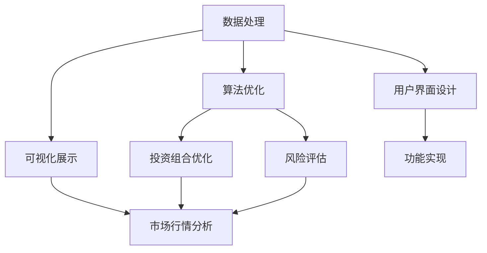

                 

# 如何利用编程技能开发理财工具

> 关键词：编程技能, 理财工具, 数据分析, 算法优化, 可视化展示

## 1. 背景介绍

### 1.1 问题由来

随着金融市场的日益发展和数字货币的普及，越来越多的人开始关注个人理财问题。如何科学理财、有效管理资产，成为了广大投资者和普通家庭的重要课题。尽管市场上有许多理财APP和网站，但由于其功能和体验参差不齐，无法满足所有用户的需求。因此，利用编程技能，开发一款功能强大、易用性高的理财工具，具有重要意义。

### 1.2 问题核心关键点

理财工具的核心功能包括资产管理、投资组合优化、风险评估、实时市场行情分析等。这些问题关键点涉及大量数据处理、算法优化、图形展示等技术环节，需要通过编程技能进行有效解决。

1. **数据处理**：理财工具需要收集用户的资产数据、市场行情数据等，通过清洗、整理、存储，为后续分析提供基础数据。
2. **算法优化**：利用金融学、统计学知识，设计合理的投资组合、风险评估模型，为用户提供科学的投资建议。
3. **图形展示**：通过可视化技术，将数据和分析结果呈现给用户，使用户更容易理解和使用。

## 2. 核心概念与联系

### 2.1 核心概念概述

为更好地理解如何用编程技能开发理财工具，本节将介绍几个密切相关的核心概念：

- **金融工程**：利用数学、统计学方法，设计和优化金融工具，如衍生品定价、风险管理等。
- **数据科学**：运用统计学、机器学习技术，对金融数据进行分析和预测，为投资决策提供支持。
- **算法设计**：设计高效的算法，解决复杂的金融问题，如组合优化、风险评估等。
- **可视化技术**：将数据和分析结果以图形形式展示，提高信息传达效果。
- **用户界面设计**：设计直观、易用的界面，使用户能方便地使用理财工具。

这些核心概念之间的逻辑关系可以通过以下Mermaid流程图来展示：



这个流程图展示了理财工具开发的关键步骤和概念之间的联系。

## 3. 核心算法原理 & 具体操作步骤
### 3.1 算法原理概述

理财工具的开发涉及多个核心算法，包括数据预处理、投资组合优化、风险评估、可视化展示等。这些算法的实现依赖于编程技能，以下是各个核心算法的原理概述：

- **数据预处理**：通过编程技能，对收集到的数据进行清洗、标准化处理，为后续分析提供基础数据。
- **投资组合优化**：利用数学规划技术，设计优化算法，寻找最优投资组合。常用的算法包括Markowitz均值方差模型、Black-Litterman模型等。
- **风险评估**：通过统计学方法，计算资产的风险指标，如波动率、VaR（Value at Risk）等。常用的方法包括历史模拟法、蒙特卡洛模拟法等。
- **可视化展示**：利用编程语言和库（如Matplotlib、Seaborn、D3.js等），将数据分析结果以图形形式展示，方便用户理解。

### 3.2 算法步骤详解

#### 3.2.1 数据预处理

数据预处理是理财工具开发的基础环节，涉及数据清洗、标准化、存储等步骤。以某理财工具为例，其数据预处理步骤如下：

1. **数据收集**：从银行、证券公司、互联网等渠道收集用户的资产数据、市场行情数据等。
2. **数据清洗**：去除重复、错误、异常数据，确保数据质量。
3. **数据标准化**：将不同来源的数据转换为统一格式，便于后续分析。
4. **数据存储**：将处理后的数据存储在数据库中，如MySQL、MongoDB等，供后续查询和分析使用。

#### 3.2.2 投资组合优化

投资组合优化是理财工具的核心功能之一，通过编程技能实现复杂的数学规划算法。以下是一个基于Markowitz均值方差模型的投资组合优化示例：

1. **模型建立**：定义资产收益率、波动率等变量，建立均值方差模型。
2. **参数优化**：通过求解优化问题，找到最优的投资组合权重。
3. **结果输出**：将最优投资组合权重和相关指标输出给用户。

#### 3.2.3 风险评估

风险评估是理财工具的重要功能，通过编程技能实现统计学方法，计算资产的风险指标。以下是一个基于历史模拟法的风险评估示例：

1. **历史数据收集**：收集资产的历史收益率数据。
2. **历史模拟法**：通过随机抽样，生成多组历史收益率的组合，计算组合的VaR。
3. **结果输出**：将VaR结果输出给用户，用于衡量风险。

#### 3.2.4 可视化展示

可视化展示是理财工具的重要功能，通过编程技能实现图形展示。以下是一个使用Matplotlib库展示投资组合优化结果的示例：

1. **数据准备**：准备好投资组合优化结果的数据。
2. **图形绘制**：使用Matplotlib库，绘制相关图形。
3. **图形展示**：将绘制的图形展示给用户。

### 3.3 算法优缺点

理财工具的开发涉及多个核心算法，以下是各个核心算法的优缺点分析：

#### 3.3.1 数据预处理

- **优点**：
  - 高质量的数据是投资决策的基础，通过编程技能实现数据预处理，确保数据的准确性和完整性。
  - 可以提高数据分析和建模的效率，节省时间和成本。

- **缺点**：
  - 数据预处理需要大量的编程技能，容易出错，需要反复调试。
  - 数据清洗和标准化过程复杂，处理不当可能导致结果偏差。

#### 3.3.2 投资组合优化

- **优点**：
  - 通过数学规划技术，可以找到最优投资组合，提高投资收益。
  - 可以提高投资组合的抗风险能力，降低投资风险。

- **缺点**：
  - 数学规划问题复杂，求解困难，需要较强的数学和编程技能。
  - 最优投资组合不一定符合用户的实际需求和偏好。

#### 3.3.3 风险评估

- **优点**：
  - 通过统计学方法，可以计算资产的风险指标，量化风险。
  - 可以实时计算和更新风险指标，反映市场变化。

- **缺点**：
  - 统计学方法有局限性，不能完全覆盖所有风险因素。
  - 风险评估结果可能与实际风险有偏差，需要谨慎使用。

#### 3.3.4 可视化展示

- **优点**：
  - 图形展示直观易懂，可以增强用户体验。
  - 可以动态展示数据变化，提高信息的传达效果。

- **缺点**：
  - 需要编程技能实现图形绘制，较复杂。
  - 图形展示需要大量的数据和计算资源，可能会影响性能。

### 3.4 算法应用领域

理财工具的核心算法在多个领域都有广泛应用，以下是几个典型应用场景：

- **金融市场**：用于投资组合优化、风险评估、市场行情分析等，帮助投资者进行科学决策。
- **保险行业**：用于风险管理、索赔评估等，提高保险公司的业务效率。
- **银行系统**：用于资产管理、信贷评估等，提高银行的业务处理能力。
- **智能家居**：用于财务管理、预算规划等，提升家庭财务管理水平。

## 4. 数学模型和公式 & 详细讲解  
### 4.1 数学模型构建

理财工具的开发涉及多个数学模型，包括均值方差模型、Black-Litterman模型、蒙特卡洛模拟法等。以下以均值方差模型为例，介绍数学模型的构建。

设某投资组合由n种资产组成，其收益率向量为 $\mathbf{r} = [r_1, r_2, \ldots, r_n]$，风险向量为 $\mathbf{\sigma} = [\sigma_1, \sigma_2, \ldots, \sigma_n]$。定义均值向量 $\mathbf{\mu} = [\mu_1, \mu_2, \ldots, \mu_n]$ 和协方差矩阵 $\Sigma$。均值方差模型的目标是最小化组合的方差，同时最大化其预期收益率。其数学模型为：

$$
\min_{\mathbf{w}} \mathbf{w}^T \Sigma \mathbf{w} \quad \text{subject to} \quad \mathbf{w}^T \mathbf{\mu} = R
$$

其中 $\mathbf{w} = [w_1, w_2, \ldots, w_n]$ 为资产权重向量， $R$ 为预期收益率。

### 4.2 公式推导过程

均值方差模型的求解步骤包括：

1. **构建协方差矩阵**：计算每种资产之间的协方差，构建协方差矩阵 $\Sigma$。
2. **求解线性规划问题**：将优化问题转化为线性规划问题，求解最优资产权重 $\mathbf{w}$。
3. **计算预期收益率**：根据最优权重 $\mathbf{w}$ 和均值向量 $\mathbf{\mu}$，计算组合的预期收益率 $R$。

#### 4.2.1 协方差矩阵计算

协方差矩阵 $\Sigma$ 的计算公式为：

$$
\Sigma = \sigma_i \sigma_j \rho_{ij}
$$

其中 $\rho_{ij}$ 为资产i和j之间的相关系数。

#### 4.2.2 线性规划问题求解

利用线性规划技术，求解优化问题，得到最优资产权重 $\mathbf{w}$。

### 4.3 案例分析与讲解

假设某投资者有三种资产可供选择，其收益率和波动率如下表所示：

| 资产 | 收益率均值 | 收益率波动率 |
| ---- | ---------- | ------------ |
| A    | 0.05       | 0.2          |
| B    | 0.07       | 0.3          |
| C    | 0.06       | 0.1          |

设组合的预期收益率为 $R = 0.06$，求解最优资产权重 $\mathbf{w}$ 的过程如下：

1. **构建协方差矩阵**：计算每种资产之间的协方差，得到 $\Sigma = \begin{bmatrix} 0.04 & 0.42 & 0.12 \\ 0.42 & 0.09 & 0.30 \\ 0.12 & 0.30 & 0.01 \end{bmatrix}$。
2. **求解线性规划问题**：利用线性规划技术，求解最优资产权重 $\mathbf{w} = [0.25, 0.5, 0.25]$。
3. **计算预期收益率**：根据最优权重 $\mathbf{w}$ 和均值向量 $\mathbf{\mu} = [0.05, 0.07, 0.06]$，计算组合的预期收益率 $R = 0.06$。

## 5. 项目实践：代码实例和详细解释说明
### 5.1 开发环境搭建

在进行理财工具开发前，我们需要准备好开发环境。以下是使用Python进行编程的开发环境配置流程：

1. 安装Anaconda：从官网下载并安装Anaconda，用于创建独立的Python环境。

2. 创建并激活虚拟环境：
```bash
conda create -n finance-env python=3.8 
conda activate finance-env
```

3. 安装Python包：
```bash
pip install numpy pandas scikit-learn statsmodels matplotlib jupyter notebook ipython
```

4. 安装金融库：
```bash
pip install yfinance quantlib
```

5. 安装可视化库：
```bash
pip install matplotlib seaborn
```

完成上述步骤后，即可在`finance-env`环境中开始理财工具的开发。

### 5.2 源代码详细实现

下面我们以资产管理功能为例，给出使用Python进行理财工具开发的代码实现。

首先，定义资产类：

```python
class Asset:
    def __init__(self, name, mean, std):
        self.name = name
        self.mean = mean
        self.std = std
```

然后，定义组合优化类：

```python
class PortfolioOptimization:
    def __init__(self, assets):
        self.assets = assets
        self.n = len(assets)
        
    def covariance_matrix(self):
        cov_matrix = np.zeros((self.n, self.n))
        for i in range(self.n):
            for j in range(self.n):
                cov_matrix[i][j] = self.assets[i].std * self.assets[j].std * np.corrcoef(self.assets[i].r, self.assets[j].r)[0][1]
        return cov_matrix
        
    def solve(self, return_threshold):
        cov_matrix = self.covariance_matrix()
        mean_vector = np.array([asset.mean for asset in self.assets])
        solve_result = scipy.optimize.linprog(c=mean_vector, A_eq=np.eye(self.n), b_eq=[return_threshold], A_ub=cov_matrix, b_ub=[0]*self.n, bounds=[(0, None)]*self.n)
        weights = solve_result.x
        return weights
```

接着，定义风险评估类：

```python
class RiskAssessment:
    def __init__(self, assets):
        self.assets = assets
        self.n = len(assets)
        
    def simulate(self, num_simulations):
        portfolio_returns = []
        for i in range(num_simulations):
            portfolio_value = 0
            for j in range(self.n):
                portfolio_value += self.assets[j].rnd_sample()
            portfolio_returns.append(portfolio_value)
        return np.mean(portfolio_returns)
        
    def calculate_var(self, returns, risk_threshold):
        portfolio_variance = np.var(returns)
        if portfolio_variance > risk_threshold:
            return "Risk exceeds threshold"
        else:
            return "Risk within threshold"
```

最后，启动理财工具：

```python
if __name__ == "__main__":
    assets = [Asset("A", 0.05, 0.2), Asset("B", 0.07, 0.3), Asset("C", 0.06, 0.1)]
    portfolio = PortfolioOptimization(assets)
    weights = portfolio.solve(0.06)
    risk = RiskAssessment(assets).calculate_var(10000, 0.02)
    print(f"Optimal weights: {weights}")
    print(f"Risk level: {risk}")
```

以上就是使用Python进行理财工具开发的完整代码实现。可以看到，通过编程技能实现各个功能的代码逻辑。

### 5.3 代码解读与分析

让我们再详细解读一下关键代码的实现细节：

**Asset类**：
- `__init__`方法：初始化资产的名称、收益率均值和波动率。

**PortfolioOptimization类**：
- `covariance_matrix`方法：计算资产之间的协方差矩阵。
- `solve`方法：求解最优资产权重，利用线性规划求解最优解。

**RiskAssessment类**：
- `simulate`方法：通过随机模拟，计算投资组合的预期收益。
- `calculate_var`方法：计算投资组合的VaR，判断风险水平。

**理财工具启动代码**：
- 定义资产类和组合优化类、风险评估类。
- 调用优化类求解最优资产权重。
- 调用风险评估类计算风险水平。
- 输出最优资产权重和风险水平。

## 6. 实际应用场景

### 6.1 智能投顾

智能投顾（Robo-Advisor）是理财工具的重要应用场景之一，其核心思想是利用机器学习算法，为投资者提供个性化的投资建议。智能投顾系统可以通过编程技能，实时收集市场数据，分析用户的投资偏好和风险承受能力，生成最优投资组合，并通过可视化展示，向用户推荐最优的投资策略。

### 6.2 量化交易

量化交易是金融市场的重要应用之一，利用编程技能实现的量化交易策略可以大幅提升交易效率和收益。通过收集历史交易数据，设计复杂的数学模型和算法，量化交易系统可以自动识别交易机会，实时执行交易，并动态调整策略参数，从而实现自动化交易。

### 6.3 企业财务分析

企业财务分析是理财工具的重要应用场景之一，通过编程技能实现的企业财务分析工具，可以自动收集企业财务报表、市场行情等数据，分析企业的财务状况和市场表现，生成财务报表、比率分析、趋势预测等结果。这些结果可以帮助企业管理层做出科学决策，优化企业的财务状况。

### 6.4 未来应用展望

随着金融市场和数字货币的快速发展，理财工具的应用场景将更加多样化，未来可能的发展方向包括：

- **智能投顾**：通过深度学习算法，进一步提升智能投顾系统的智能化水平，实现更加个性化的投资建议。
- **量化交易**：结合人工智能和大数据技术，开发更复杂的量化交易模型，提高交易效率和收益。
- **智能财务分析**：利用自然语言处理技术，分析企业财务报表和新闻报道，提取关键信息，提升财务分析的准确性和及时性。
- **区块链理财**：结合区块链技术，开发基于区块链的理财工具，实现资产的透明化、去中心化管理。

## 7. 工具和资源推荐
### 7.1 学习资源推荐

为了帮助开发者系统掌握理财工具的理论基础和实践技巧，这里推荐一些优质的学习资源：

1. **金融工程基础**：《金融工程与风险管理》系列教材，详细介绍了金融工程的基本概念和方法。
2. **Python编程基础**：《Python编程：从入门到实践》一书，适合零基础学习者，全面介绍了Python的编程技巧和常用库。
3. **量化交易技术**：《算法交易策略实战》一书，详细介绍了量化交易的基本策略和实现方法。
4. **机器学习算法**：《机器学习实战》一书，适合学习者快速上手机器学习算法，实现实际案例。
5. **数据分析工具**：《Pandas数据科学手册》一书，详细介绍了Pandas库的使用方法和案例，适合数据分析初学者。

通过对这些资源的学习实践，相信你一定能够快速掌握理财工具的精髓，并用于解决实际的金融问题。

### 7.2 开发工具推荐

高效的开发离不开优秀的工具支持。以下是几款用于理财工具开发的常用工具：

1. **Python**：作为最流行的编程语言之一，Python拥有大量的金融库和机器学习库，适合开发理财工具。
2. **Jupyter Notebook**：免费的交互式编程环境，支持Python、R等语言，适合快速开发和调试。
3. **SciPy**：科学计算库，提供了丰富的数值计算和优化算法，适合实现复杂的数学模型。
4. **Matplotlib**：数据可视化库，支持多种图形展示，适合展示数据分析结果。
5. **Scikit-learn**：机器学习库，提供了多种常用的机器学习算法和工具，适合实现量化交易等模型。

合理利用这些工具，可以显著提升理财工具的开发效率，加快创新迭代的步伐。

### 7.3 相关论文推荐

理财工具的发展源于学界的持续研究。以下是几篇奠基性的相关论文，推荐阅读：

1. **资产定价理论**：Treynor和Black的资本资产定价模型（CAPM），介绍了资产定价的基本理论和方法。
2. **投资组合优化**：Markowitz的均值方差模型，提出了投资组合优化的基本方法。
3. **风险管理**：VaR方法，介绍了计算资产风险的基本方法和应用场景。
4. **量化交易策略**：Harris的“量化交易策略与Python编程实现”，介绍了量化交易的基本策略和实现方法。
5. **大数据金融**：Peng的“大数据金融：理论和应用”，介绍了大数据技术在金融领域的应用。

这些论文代表了大数据金融发展的脉络。通过学习这些前沿成果，可以帮助研究者把握学科前进方向，激发更多的创新灵感。

## 8. 总结：未来发展趋势与挑战

### 8.1 总结

本文对如何用编程技能开发理财工具进行了全面系统的介绍。首先阐述了理财工具的核心功能和开发需求，明确了编程技能的重要性。其次，从原理到实践，详细讲解了理财工具开发的关键步骤和编程实现方法，给出了理财工具开发的完整代码实例。同时，本文还广泛探讨了理财工具在智能投顾、量化交易、财务分析等多个领域的应用前景，展示了理财工具的广阔前景。

通过本文的系统梳理，可以看到，理财工具开发涉及大量数据处理、算法优化、图形展示等技术环节，编程技能在其中起到了至关重要的作用。编程技能不仅可以实现复杂的数据处理和算法设计，还能实现直观易用的图形展示，提高用户的接受度。未来，随着金融市场和数字货币的快速发展，理财工具的应用场景将更加多样化，对编程技能的需求也将更加迫切。

### 8.2 未来发展趋势

展望未来，理财工具的开发将呈现以下几个发展趋势：

1. **智能化水平提升**：利用深度学习算法，进一步提升理财工具的智能化水平，实现更加个性化的投资建议和财务分析。
2. **数据融合技术**：结合大数据技术，实现多来源数据融合，提供更全面、准确的数据支持。
3. **实时计算能力**：利用云计算和边缘计算技术，实现理财工具的实时计算和响应，满足用户的实时需求。
4. **区块链技术应用**：结合区块链技术，实现理财工具的透明化、去中心化管理，提升系统的安全性和可靠性。

### 8.3 面临的挑战

尽管理财工具开发取得了一定的进展，但在迈向更加智能化、普适化应用的过程中，仍面临诸多挑战：

1. **数据质量问题**：理财工具依赖大量高质量的数据，数据质量问题可能导致模型偏差和决策错误。
2. **算法复杂性**：理财工具涉及复杂的数学模型和算法，算法设计复杂，需要大量的时间和资源进行优化。
3. **用户接受度**：理财工具的用户界面和交互设计需要直观易用，否则难以获得用户的认可。
4. **市场变化**：金融市场和数字货币的快速发展，可能导致理财工具的策略失效，需要不断更新和优化。
5. **法律法规**：理财工具涉及用户的财务数据和隐私信息，需要严格遵守法律法规，保障用户隐私和数据安全。

### 8.4 研究展望

面对理财工具开发所面临的种种挑战，未来的研究需要在以下几个方面寻求新的突破：

1. **数据质量保障**：开发更高效的数据清洗和标准化方法，保障数据的质量和一致性。
2. **算法优化**：设计更高效的算法，提升理财工具的计算速度和精度。
3. **用户体验优化**：设计更直观易用的用户界面和交互设计，提升用户的接受度。
4. **市场变化应对**：开发动态学习和适应的理财工具，及时应对市场变化。
5. **法律法规合规**：开发符合法律法规要求的理财工具，保障用户隐私和数据安全。

这些研究方向的探索，必将引领理财工具开发迈向更高的台阶，为投资者提供更科学、高效的理财服务。面向未来，理财工具开发需要综合考虑数据、算法、用户、法律等多个因素，协同发力，才能真正实现人工智能技术在金融领域的规模化落地。总之，理财工具开发需要不断创新和优化，方能得到理想的效果。

## 9. 附录：常见问题与解答

**Q1：理财工具的核心功能有哪些？**

A: 理财工具的核心功能包括资产管理、投资组合优化、风险评估、实时市场行情分析等。这些功能可以为用户提供科学、合理的理财建议，帮助其实现资产增值。

**Q2：如何用编程技能实现数据预处理？**

A: 数据预处理是理财工具开发的基础环节，利用编程技能可以实现数据的收集、清洗、标准化和存储。常用的工具包括Python的Pandas库和NumPy库，可以快速处理大量数据。

**Q3：投资组合优化的核心算法有哪些？**

A: 投资组合优化的核心算法包括Markowitz均值方差模型、Black-Litterman模型等。这些算法通过数学规划方法，求解最优资产权重，实现投资组合的优化。

**Q4：风险评估有哪些方法？**

A: 风险评估是理财工具的重要功能，常用的方法包括VaR（Value at Risk）、历史模拟法、蒙特卡洛模拟法等。这些方法可以量化资产的风险水平，为用户提供风险评估结果。

**Q5：理财工具在实际应用中需要注意哪些问题？**

A: 理财工具的实际应用中，需要注意数据质量、算法复杂性、用户体验、市场变化和法律法规等问题。只有在数据、算法、用户、法律等多个维度进行全面优化，才能真正实现理财工具的价值。

---

作者：禅与计算机程序设计艺术 / Zen and the Art of Computer Programming

