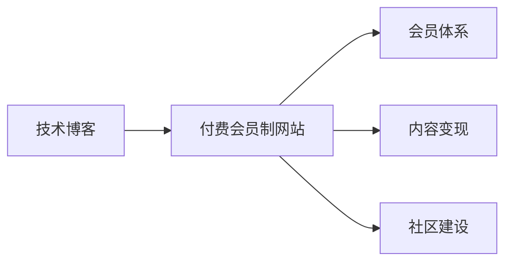
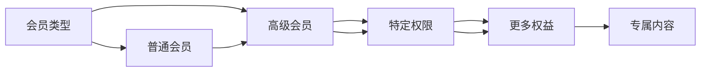

                 

# 如何将技术博客转化为付费会员制网站

在数字时代，技术博客已经成为内容创作者分享知识、连接用户的重要平台。然而，单纯依靠免费内容难以维持博客的运营成本和内容质量。因此，将技术博客转化为付费会员制网站，成为很多博客主探索的新方向。本文将系统探讨如何将技术博客成功转型为付费会员制网站，涵盖核心概念、具体操作、常见问题和解决方案等内容。

## 1. 背景介绍

### 1.1 问题由来
随着互联网和移动互联网的普及，技术博客市场呈现出空前的繁荣。技术博客不仅能吸引技术爱好者，还能为企业提供技术人才的招聘渠道，甚至直接变现。然而，多数技术博客仍采取传统的免费内容模式，广告收入有限，难以维持长期运营。因此，探索新的盈利模式，将博客转化为付费会员制网站，成为内容创作者急需解决的问题。

### 1.2 问题核心关键点
博客转型的关键在于找到与用户需求高度匹配的高价值内容，并设计有效的付费模式。具体而言，需要考虑以下问题：
- 如何利用技术博客的独特价值，吸引高粘性的会员用户？
- 如何设计合理的付费会员体系，并实现用户转化？
- 如何通过会员付费订阅模式，提升运营收入？

### 1.3 问题研究意义
技术博客转化为付费会员制网站，有助于：
- 提升内容质量和用户体验，构建深度互动的社区环境。
- 吸引高价值会员用户，拓展核心受众群体。
- 实现内容变现，增加博客的盈利能力。

## 2. 核心概念与联系

### 2.1 核心概念概述

在讨论技术博客的转型问题时，需要关注几个核心概念：

- **技术博客**：以技术分享和讨论为主题的博客平台。通常提供高质量的技术文章、开源项目、编程示例等。
- **付费会员制网站**：基于订阅模式的网站，用户需要支付一定费用才能访问特定内容或享受高级服务。
- **会员体系**：会员制网站的核心，包括会员类型、会员权益、会员管理等。
- **内容变现**：通过付费模式实现内容变现，提升网站收入。
- **社区建设**：构建具有高粘性、高互动的社区，提升用户参与度和平台价值。

这些核心概念之间的联系如图1所示。技术博客通过提供有价值的内容，吸引用户付费订阅，形成付费会员体系，最终实现内容变现和社区建设。



### 2.2 核心概念原理和架构的 Mermaid 流程图
下面以会员体系为例，展示其核心原理和架构。会员体系通过设定不同的会员类型和权益，吸引用户订阅并保持高粘性。



## 3. 核心算法原理 & 具体操作步骤

### 3.1 算法原理概述

博客转型的核心算法在于：

- **用户需求匹配**：通过调研分析用户需求，设计满足不同需求的内容产品。
- **会员体系设计**：确定会员类型、权益、费用等关键参数，构建科学合理的会员体系。
- **付费模式设计**：选择合适的付费模式，如按月、按年、按内容等，提升用户转化率。
- **用户行为分析**：通过数据分析，优化用户体验和内容推荐，提升用户留存率。

### 3.2 算法步骤详解

以下详细介绍博客转化为付费会员制网站的核心算法步骤：

**Step 1: 调研分析用户需求**

通过调查问卷、数据分析、用户访谈等手段，了解目标用户群体的需求。根据需求设计高价值的内容产品，如深度技术文章、高级课程、专家讲座等。

**Step 2: 设计会员体系**

确定会员类型（如普通会员、高级会员），并明确每个会员类型的权益。例如，普通会员可以访问基础内容，高级会员可以享受专属技术资料、社区特权、VIP服务、一对一专家咨询等。

**Step 3: 选择合适的付费模式**

选择合适的付费模式，如月度付费、年度付费、单篇付费等。根据用户画像和需求，设计合理的会员费用和升级路径，增强用户粘性。

**Step 4: 设计用户订阅流程**

设计简洁友好的订阅流程，确保用户易于理解和操作。提供多渠道订阅选项，如网站、App、邮件订阅等，提升用户转化率。

**Step 5: 实现会员管理系统**

开发完善的会员管理系统，实现用户订阅、取消订阅、会员升级、权限管理等功能。系统应支持多平台接入，确保用户无缝切换。

**Step 6: 优化用户体验和内容推荐**

通过数据分析和算法优化，提升网站的用户体验和内容推荐效果。例如，根据用户浏览记录和购买行为，推荐相关文章和课程，提升用户粘性。

**Step 7: 监控和反馈**

建立会员服务监控和反馈机制，及时响应用户反馈，提升用户体验。收集用户反馈，持续优化内容和会员体系。

### 3.3 算法优缺点

将博客转化为付费会员制网站，具有以下优点：
- 提升内容质量：通过会员付费模式，可以激励创作者生产高质量内容，提升平台整体质量。
- 增强用户粘性：通过高价值内容和专属权益，吸引高粘性会员用户，提升用户留存率。
- 实现内容变现：通过付费模式，增加网站收入，实现商业化盈利。

同时，也存在以下缺点：
- 用户获取成本高：高价值内容的提供往往需要较高成本，可能影响初期会员用户获取。
- 运营管理复杂：会员体系的设计和管理较为复杂，需要持续优化和维护。
- 用户流失风险：如果内容或服务不符合用户预期，可能引发用户流失。

### 3.4 算法应用领域

博客转型的付费会员制模式，已成功应用于多个领域：

- **技术博客**：如极客时间、掘金、博客园等，通过提供深度技术文章、课程和专家讲座，吸引高价值会员。
- **编程社区**：如Stack Overflow、GitHub、CoderPad等，提供代码库、协作工具、高级服务，实现内容变现。
- **教育平台**：如Coursera、Udemy、网易云课堂等，通过提供高质量课程和专业认证，增加用户粘性和收入。

## 4. 数学模型和公式 & 详细讲解

### 4.1 数学模型构建

为更好地理解博客转型的算法原理，以下通过数学语言详细刻画。

假设博客平台拥有 $N$ 篇高质量技术文章，并吸引 $M$ 位潜在会员用户。每位用户每月产生 $p_i$ 的转化率，即每月成为付费会员的概率。

定义博客平台的月度收入 $R$ 为：

$$ R = \sum_{i=1}^M p_i \cdot C_i $$

其中 $C_i$ 为第 $i$ 位用户的年度订阅费用。

### 4.2 公式推导过程

根据上述定义，博客平台的月度收入可进一步推导为：

$$ R = \sum_{i=1}^M p_i \cdot C_i = \sum_{i=1}^M p_i \cdot P_i \cdot \frac{C_i}{P_i} $$

其中 $P_i$ 为第 $i$ 位用户成为付费会员的期望次数，$P_i = \frac{C_i}{12}$。

### 4.3 案例分析与讲解

以Coursera为例，分析其博客转型的收入模型：

Coursera通过提供高质量在线课程，吸引全球数百万用户。通过设定不同的课程定价和订阅计划，实现内容变现。例如，Coursera的付费课程价格为49美元/门，高级订阅用户（Professional Memberships）每年只需99美元，即可访问所有课程和专业认证。

具体分析如下：

- 假设Coursera平台每月新增用户100万，其中20%成为付费会员。
- 普通课程每门49美元，高级订阅用户全年199美元，即每月16.58美元。
- 假设全球每年新增用户1000万，每年付费用户200万。

根据上述假设，计算Coursera的月度收入为：

$$ R = 100万 \times 20\% \times 16.58美元 = 3322万美元 $$

## 5. 项目实践：代码实例和详细解释说明

### 5.1 开发环境搭建

博客转型的关键在于网站和会员管理系统的开发。以下是Python和Flask框架搭建的开发环境配置流程：

1. 安装Anaconda：从官网下载并安装Anaconda，用于创建独立的Python环境。

2. 创建并激活虚拟环境：
```bash
conda create -n blog-env python=3.8 
conda activate blog-env
```

3. 安装Flask：
```bash
pip install Flask
```

4. 安装相关库：
```bash
pip install Jinja2 Flask-SQLAlchemy Flask-Login Flask-WTF
```

5. 安装数据库：
```bash
pip install mysql-connector-python
```

### 5.2 源代码详细实现

以下以技术博客平台为例，展示如何通过Flask搭建会员管理系统的基本功能。

**Member模型**：
```python
from flask_sqlalchemy import SQLAlchemy

db = SQLAlchemy()

class Member(db.Model):
    id = db.Column(db.Integer, primary_key=True)
    username = db.Column(db.String(100), unique=True, nullable=False)
    email = db.Column(db.String(100), unique=True, nullable=False)
    password = db.Column(db.String(100), nullable=False)
    is_admin = db.Column(db.Boolean, default=False)
```

**Login视图**：
```python
from flask_login import LoginManager, login_user, logout_user, login_required

login_manager = LoginManager()
login_manager.login_view = 'login'

@login_manager.user_loader
def load_user(user_id):
    return Member.query.get(int(user_id))

@app.route('/login', methods=['GET', 'POST'])
def login():
    if request.method == 'POST':
        username = request.form['username']
        password = request.form['password']
        member = Member.query.filter_by(username=username).first()
        if member and member.check_password(password):
            login_user(member)
            return redirect(url_for('home'))
    return render_template('login.html')
```

**Dashboard视图**：
```python
@app.route('/dashboard')
@login_required
def dashboard():
    members = Member.query.all()
    return render_template('dashboard.html', members=members)
```

**订阅视图**：
```python
@app.route('/subscribe', methods=['GET', 'POST'])
@login_required
def subscribe():
    if request.method == 'POST':
        subscription = request.form.get('subscription')
        if subscription == 'monthly':
            price = 5
        elif subscription == 'yearly':
            price = 50
        else:
            price = 0
        member = g.member
        member.balance -= price
        db.session.commit()
        flash(f'Your subscription has been upgraded to a {subscription} plan.')
        return redirect(url_for('dashboard'))
```

**文章模型**：
```python
class Article(db.Model):
    id = db.Column(db.Integer, primary_key=True)
    title = db.Column(db.String(100), nullable=False)
    content = db.Column(db.Text, nullable=False)
    member_id = db.Column(db.Integer, db.ForeignKey('member.id'), nullable=False)
    member = db.relationship('Member', backref='articles', lazy=True)
```

### 5.3 代码解读与分析

让我们再详细解读一下关键代码的实现细节：

**Member模型**：
- 定义Member实体，包含用户名、邮箱、密码等基本信息，以及是否是管理员权限。

**Login视图**：
- 实现用户登录功能，通过用户名和密码验证后，将用户登录状态保存在Flask-Login扩展中，并重定向到首页。

**Dashboard视图**：
- 展示所有会员信息，供管理员查看和管理。

**订阅视图**：
- 实现会员订阅功能的后端处理，包括会员余额管理、订阅类型设置等。

**文章模型**：
- 定义文章实体，包含文章标题、内容等，并与会员关联，实现文章的所有者功能。

通过上述代码实现，博客平台的基本会员管理功能已经搭建完成，包括用户登录、仪表盘展示、会员订阅等。

### 5.4 运行结果展示

在开发环境中运行Flask应用，通过访问不同的路由，可以体验到博客平台的会员管理功能。例如，在仪表盘页面上可以查看所有会员信息，在订阅页面上可以管理会员订阅，在文章页面上可以查看会员发布的文章等。

## 6. 实际应用场景

### 6.1 智能内容平台

将技术博客转化为付费会员制网站，可以在智能内容平台中发挥巨大作用。智能内容平台通过提供高质量的内容，吸引高粘性会员用户，提升平台价值。

例如，GitHub的Gist功能就采用了类似的付费模式，用户可以付费访问更高级的存储和搜索功能。通过这种模式，GitHub不仅实现了商业化盈利，还提升了平台的整体价值和用户体验。

### 6.2 教育培训平台

教育培训平台通过提供优质的在线课程和认证服务，吸引高价值会员用户。通过设定不同的会员类型和权益，满足不同用户的学习需求。

Coursera、Udemy等平台通过设置会员订阅计划，提供免费试用期和优惠券，吸引用户试用并最终转化。通过这种方式，平台不仅实现了商业化盈利，还提高了用户的参与度和留存率。

### 6.3 技术社区平台

技术社区平台通过提供高价值的社区内容和技术讨论，吸引高粘性会员用户。通过设定不同的会员类型和特权，增强用户粘性和参与度。

例如，Stack Overflow通过提供高质量的问答内容和技术文章，吸引全球数百万程序员。通过设定不同的会员类型和特权，如无限提问次数、优先回答、高级搜索等，提升用户体验和平台价值。

## 7. 工具和资源推荐

### 7.1 学习资源推荐

为帮助开发者系统掌握博客转型的理论基础和实践技巧，以下推荐一些优质的学习资源：

1. **《Web应用开发实战》**：介绍Flask等Web框架的使用方法，提供详细的开发实例。
2. **《Python Web开发基础》**：讲解Python Web开发的基础知识，包括Flask、Django等框架的使用。
3. **《网站运营实战》**：介绍网站运营的策略和方法，涵盖内容运营、用户运营、市场运营等。
4. **《付费会员制网站构建》**：系统讲解付费会员制网站的构建方法和实践案例。
5. **《会员体系设计与运营》**：详细介绍会员体系的设计和运营策略，提供实际操作建议。

通过这些资源的学习，相信你一定能够快速掌握博客转型的精髓，并用于解决实际的博客运营问题。

### 7.2 开发工具推荐

高效的开发离不开优秀的工具支持。以下是几款用于博客转型的常用工具：

1. **Flask**：轻量级的Web框架，易于上手和扩展，适合中小型网站开发。
2. **SQLAlchemy**：Python ORM框架，支持多种数据库，提供便捷的数据访问和操作功能。
3. **Flask-Login**：Flask的认证扩展，提供用户登录和会话管理功能。
4. **Jinja2**：Python的模板引擎，用于生成HTML页面。
5. **GitHub**：版本控制平台，提供代码托管、协作开发、项目管理等功能。

合理利用这些工具，可以显著提升博客转型的开发效率，加快创新迭代的步伐。

### 7.3 相关论文推荐

博客转型的过程涉及多个学科的理论和方法，以下推荐几篇具有代表性的论文，供参考：

1. **《Web应用开发模式》**：介绍Web应用开发的常见模式和最佳实践，涵盖前后端分离、API设计等。
2. **《内容运营策略》**：分析内容运营的策略和方法，提供实际操作建议。
3. **《会员制网站的用户模型与推荐系统》**：研究会员制网站的用户模型和推荐算法，提升用户体验和用户粘性。
4. **《付费订阅模式的心理学分析》**：分析用户订阅心理，提供设计付费模式的策略和方法。

这些论文代表了大语言模型微调技术的发展脉络。通过学习这些前沿成果，可以帮助研究者把握学科前进方向，激发更多的创新灵感。

## 8. 总结：未来发展趋势与挑战

### 8.1 总结

本文对博客转化为付费会员制网站的过程进行了全面系统的介绍。首先阐述了博客转型的背景和意义，明确了转型的关键步骤和核心算法。通过具体的代码实现和实例分析，展示了博客转型的实际应用场景。

通过本文的系统梳理，可以看到，博客转型的过程需要考虑用户需求匹配、会员体系设计、付费模式选择等多方面因素。只有在数据、算法、工程、业务等多个维度协同发力，才能实现博客的商业化盈利和长期运营。

### 8.2 未来发展趋势

展望未来，博客转型的趋势如下：

1. **个性化推荐**：通过算法优化，提供更加个性化的内容推荐，提升用户体验和留存率。
2. **多渠道接入**：开发多平台接入功能，提升用户在不同设备上的访问体验。
3. **社交功能增强**：增加社交功能，如评论、点赞、分享等，增强用户互动和社区粘性。
4. **大数据分析**：利用大数据分析技术，优化用户行为分析和内容推荐，提升运营效率。
5. **国际化支持**：支持多语言和地区性运营，扩大全球用户群体。

### 8.3 面临的挑战

尽管博客转型的趋势向好，但仍面临诸多挑战：

1. **用户获取成本高**：高价值内容的提供往往需要较高成本，可能影响初期会员用户获取。
2. **会员管理复杂**：会员体系的设计和管理较为复杂，需要持续优化和维护。
3. **用户流失风险**：如果内容或服务不符合用户预期，可能引发用户流失。
4. **安全防护**：会员信息的安全性问题，如账号盗用、数据泄露等，需要重点防范。

### 8.4 研究展望

未来需要在以下几个方面进行进一步研究：

1. **会员行为分析**：通过数据分析和算法优化，提升会员行为分析和预测准确性，优化会员服务。
2. **内容变现策略**：探索更多内容变现方式，如知识付费、会员专享课程等，提升收入来源多样性。
3. **社区互动机制**：研究社区互动机制的优化方法，提升用户参与度和平台粘性。
4. **技术栈优化**：采用更高效的技术栈，提升网站性能和用户体验。
5. **用户反馈机制**：建立有效的用户反馈机制，及时响应用户需求，提升用户体验。

这些研究方向将有助于博客转型取得更大的成功，提升平台的商业价值和社会价值。

## 9. 附录：常见问题与解答

**Q1: 博客转型的关键步骤有哪些？**

A: 博客转型的关键步骤包括用户需求调研、会员体系设计、付费模式选择、订阅流程优化、会员管理系统开发、用户体验和内容推荐优化、会员服务监控和反馈机制建立等。

**Q2: 如何设计合理的会员体系？**

A: 设计合理的会员体系需要考虑以下因素：
1. 设定不同的会员类型，如普通会员、高级会员、VIP会员等。
2. 明确每个会员类型的权益，如内容访问权限、专属功能、专家咨询等。
3. 确定合理的会员费用，提升用户转化率。

**Q3: 如何优化用户体验和内容推荐？**

A: 优化用户体验和内容推荐的方法包括：
1. 通过数据分析，了解用户需求和行为。
2. 利用算法优化，提供个性化内容推荐。
3. 优化网站性能和界面设计，提升用户体验。

**Q4: 如何应对用户流失风险？**

A: 应对用户流失风险的方法包括：
1. 提供优质的内容和服务，满足用户需求。
2. 建立用户反馈机制，及时响应用户意见。
3. 定期推出新内容和活动，提升用户粘性。

**Q5: 如何保障用户数据安全？**

A: 保障用户数据安全的方法包括：
1. 采用安全的认证和授权机制，防止账号盗用。
2. 加密用户数据，防止数据泄露。
3. 定期进行安全检查和漏洞修复，提升安全防护能力。

---

作者：禅与计算机程序设计艺术 / Zen and the Art of Computer Programming

