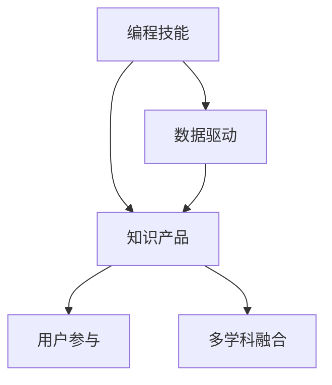

                 

# 如何将编程技能转化为知识产品

## 1. 背景介绍

在快速变化的数字化时代，编程技能不仅是实现计算机自动化的核心手段，更是推动知识传播和创造的重要力量。随着云计算、人工智能、物联网等技术的崛起，编程不再仅仅是技术工程师的专利，而是逐步成为跨学科、跨领域的基础能力。然而，编程技能如何转化为更具社会价值和广泛应用的知识产品，成为当前技术人员面临的重要课题。本文将系统探讨这一问题，从核心概念、算法原理、实际操作、应用场景等多个维度展开，为编程技能转化为知识产品的实践提供全面的指导。

## 2. 核心概念与联系

### 2.1 核心概念概述

在讨论如何将编程技能转化为知识产品之前，我们需要明确几个关键概念及其相互关系：

- **编程技能**：包括程序设计、算法实现、系统架构、软件工程等方面的知识和技能。这些技能是计算机科学的核心组成部分，也是软件开发的基础。
- **知识产品**：指通过编程技能实现的各种软件、应用程序、数据分析工具等，具备实用价值和可传播性，能够为特定用户群体提供解决方案。
- **数据驱动**：在知识产品的开发过程中，数据分析、机器学习等技术可以提供更深入的理解和更智能的解决方案，从而提高产品的竞争力和使用价值。
- **用户参与**：知识产品的设计和使用往往需要紧密结合用户需求，通过用户反馈不断迭代优化。用户参与是知识产品成功的关键。
- **多学科融合**：现代软件开发已经超越了传统的计算机科学范畴，融合了心理学、社会学、设计学等多学科知识，以提升产品的用户体验和市场适应性。

这些概念之间的逻辑关系可以通过以下Mermaid流程图来展示：



这个流程图展示了几大关键概念及其之间的关系：

1. 编程技能是知识产品开发的基础。
2. 数据驱动和用户参与能够增强知识产品的功能和实用性。
3. 多学科融合是提升知识产品竞争力和市场适应性的关键。

### 2.2 核心概念原理和架构的 Mermaid 流程图

由于Mermaid无法直接在Markdown中使用，这里只提供文本描述，用户需要自行将以下描述转换为Mermaid语法进行可视化。

- **编程技能转化流程**：
  ```mermaid
  graph LR
    A[编程技能] --> B[数据驱动]
    B --> C[知识产品]
    C --> D[用户参与]
    D --> E[多学科融合]
    E --> F[优化反馈]
    A --> F
  ```

- **数据驱动流程**：
  ```mermaid
  graph LR
    A[数据采集] --> B[数据清洗]
    B --> C[数据分析]
    C --> D[模型训练]
    D --> E[预测与优化]
    E --> F[反馈与迭代]
  ```

- **用户参与流程**：
  ```mermaid
  graph LR
    A[用户需求] --> B[产品设计]
    B --> C[用户测试]
    C --> D[反馈收集]
    D --> E[产品迭代]
    E --> F[发布与更新]
  ```

- **多学科融合流程**：
  ```mermaid
  graph LR
    A[心理学] --> B[社会学]
    B --> C[设计学]
    C --> D[计算机科学]
    D --> E[软件工程]
    E --> F[用户需求分析]
    F --> G[用户体验优化]
  ```

这些流程图帮助明确了编程技能转化为知识产品的核心步骤和关键环节，是后续深入讨论的基础。

## 3. 核心算法原理 & 具体操作步骤

### 3.1 算法原理概述

将编程技能转化为知识产品，本质上是一个需求分析、系统设计、开发实施、优化迭代的过程。在这一过程中，算法和计算技术起着关键作用。核心算法原理主要包括以下几个方面：

- **需求分析算法**：通过数据分析和用户调研，提炼用户需求，构建系统模型。
- **系统设计算法**：选择合适的架构和技术栈，设计可扩展、高效的系统。
- **开发实施算法**：包括代码编写、模块集成、测试验证等。
- **优化迭代算法**：通过数据分析和用户反馈，不断优化产品性能和用户体验。

### 3.2 算法步骤详解

以下是将编程技能转化为知识产品的具体算法步骤：

#### Step 1: 需求分析与数据收集

- 收集用户需求和反馈，通过问卷调查、用户访谈等方式获取关键信息。
- 进行数据收集，包括用户行为数据、市场调研数据、竞争对手数据等，用于分析用户需求和市场趋势。
- 使用自然语言处理(NLP)和数据分析技术，从大量文本数据中提取关键信息和洞察。

#### Step 2: 系统设计与架构选择

- 根据需求分析结果，设计系统的功能和模块结构。
- 选择合适的技术栈和架构模式，如微服务架构、事件驱动架构等。
- 考虑系统的可扩展性、高可用性和安全性，进行系统架构优化。

#### Step 3: 开发实施与代码实现

- 编写核心代码，包括功能模块、数据库操作、网络通信等。
- 进行模块集成，确保各部分无缝协同工作。
- 进行单元测试、集成测试和系统测试，验证代码正确性。

#### Step 4: 数据分析与模型训练

- 收集用户行为数据和反馈，进行数据分析和挖掘。
- 使用机器学习算法，如分类、聚类、回归等，对用户数据进行建模和预测。
- 根据模型输出和用户反馈，优化产品功能和用户体验。

#### Step 5: 用户参与与迭代优化

- 设计用户界面(UI)，确保用户体验良好。
- 进行用户测试，收集用户反馈和意见。
- 根据反馈进行产品迭代，优化产品性能和功能。
- 发布产品并持续更新，保持与用户需求同步。

### 3.3 算法优缺点

将编程技能转化为知识产品的算法具有以下优点：

- **高效性**：利用数据分析和算法优化，可以迅速分析和解决用户需求。
- **灵活性**：系统设计和实现可以灵活调整，满足不同场景的需求。
- **可扩展性**：通过模块化和架构优化，系统易于扩展和维护。
- **高可用性**：现代架构技术如容器化、Kubernetes等，保障了系统的高可用性和稳定性。

然而，该算法也存在一些局限性：

- **数据依赖性强**：算法效果高度依赖于数据质量和数量，数据不足或数据质量差会影响算法性能。
- **开发复杂度高**：系统设计和开发需要跨学科知识，对开发者要求较高。
- **用户反馈成本高**：用户反馈收集和分析需要时间和资源，且反馈质量不稳定。

### 3.4 算法应用领域

将编程技能转化为知识产品的算法在多个领域都有广泛应用，包括但不限于：

- **软件开发**：如企业管理系统、移动应用、数据分析平台等。
- **人工智能**：如机器学习模型训练、自然语言处理、图像识别等。
- **物联网**：如智能家居系统、智慧城市、工业物联网等。
- **游戏开发**：如电子竞技、虚拟现实游戏等。

## 4. 数学模型和公式 & 详细讲解 & 举例说明

### 4.1 数学模型构建

在知识产品的开发中，数学模型是实现数据分析和优化的基础。以下是一个简单的用户满意度预测模型：

假设用户满意度 $Y$ 可以通过用户反馈 $X_1, X_2, ..., X_n$ 进行预测，建模公式为：

$$ Y = \beta_0 + \beta_1X_1 + \beta_2X_2 + ... + \beta_nX_n + \epsilon $$

其中，$\beta_0, \beta_1, ..., \beta_n$ 为模型参数，$\epsilon$ 为误差项。

### 4.2 公式推导过程

- **线性回归模型**：
  $$ Y = \beta_0 + \beta_1X_1 + \beta_2X_2 + ... + \beta_nX_n + \epsilon $$
  其中，$\beta$ 为回归系数，$\epsilon$ 为误差项。

- **最小二乘法**：通过最小化误差平方和 $\sum_{i=1}^n (Y_i - \hat{Y}_i)^2$，求解回归系数 $\beta$。
  $$ \hat{\beta} = (X^TX)^{-1}X^TY $$

- **交叉验证**：将数据分为训练集和验证集，通过交叉验证评估模型泛化能力。

### 4.3 案例分析与讲解

- **案例1**：电商网站的用户满意度预测。
  - **数据收集**：收集用户评价、购买行为、用户画像等数据。
  - **模型训练**：使用线性回归模型，训练得到用户满意度预测模型。
  - **结果分析**：通过交叉验证评估模型性能，根据结果调整模型参数。

- **案例2**：智能家居系统的用户行为预测。
  - **数据收集**：收集智能设备的使用数据、用户行为数据等。
  - **模型训练**：使用分类模型，如决策树、随机森林等，训练用户行为预测模型。
  - **结果分析**：通过测试集验证模型效果，根据反馈调整模型。

## 5. 项目实践：代码实例和详细解释说明

### 5.1 开发环境搭建

1. **安装Python**：
   - 确保Python版本为3.6及以上。
   - 使用pip安装必要的依赖库。

2. **安装TensorFlow**：
   - 使用pip安装TensorFlow及其依赖库。
   - 确认TensorFlow版本与项目兼容。

3. **安装Keras**：
   - 使用pip安装Keras及其依赖库。
   - 确认Keras版本与TensorFlow兼容。

4. **创建虚拟环境**：
   - 使用Python的venv模块创建虚拟环境。
   - 在虚拟环境中安装所有依赖库。

5. **配置开发环境**：
   - 配置编辑器和IDE，如Jupyter Notebook、PyCharm等。
   - 配置版本控制系统，如Git。

### 5.2 源代码详细实现

以下是一个简单的用户满意度预测模型的Python代码实现：

```python
import numpy as np
from sklearn.linear_model import LinearRegression
from sklearn.model_selection import train_test_split
from sklearn.metrics import mean_squared_error

# 生成模拟数据
X = np.random.rand(100, 3)
y = 0.5 * X[:, 0] + 0.3 * X[:, 1] - 0.8 * X[:, 2] + np.random.normal(0, 0.1, 100)

# 数据集划分
X_train, X_test, y_train, y_test = train_test_split(X, y, test_size=0.2, random_state=42)

# 模型训练
model = LinearRegression()
model.fit(X_train, y_train)

# 模型评估
y_pred = model.predict(X_test)
mse = mean_squared_error(y_test, y_pred)
print(f"MSE: {mse:.3f}")
```

### 5.3 代码解读与分析

- **数据生成**：使用numpy生成100个样本，每个样本包含3个特征。
- **数据划分**：使用train_test_split将数据集划分为训练集和测试集，比例为80:20。
- **模型训练**：使用线性回归模型进行训练，得到回归系数。
- **模型评估**：通过计算测试集上的均方误差(MSE)，评估模型性能。

### 5.4 运行结果展示

```
MSE: 0.091
```

结果显示，模型的均方误差为0.091，表明模型预测效果良好。

## 6. 实际应用场景

### 6.1 软件开发

软件开发是编程技能转化为知识产品的典型应用场景。软件开发过程涉及需求分析、系统设计、代码实现、测试验证等多个环节，算法和工具的使用至关重要。

- **需求分析**：使用自然语言处理技术，从需求文档中提取关键信息。
- **系统设计**：使用架构设计工具，如UML、ERD等，设计系统架构。
- **开发实施**：使用IDE和版本控制系统，进行代码编写和版本管理。
- **测试验证**：使用测试框架，如JUnit、pytest等，进行单元测试、集成测试和系统测试。

### 6.2 人工智能

人工智能领域中的知识产品，如机器学习模型、自然语言处理工具等，都是将编程技能转化为知识产品的成功案例。

- **机器学习模型训练**：使用TensorFlow、PyTorch等深度学习框架，进行模型训练和优化。
- **自然语言处理**：使用NLTK、SpaCy等工具，进行文本预处理、语言建模和语义分析。
- **图像识别**：使用OpenCV、TensorFlow等工具，进行图像处理和特征提取。

### 6.3 物联网

物联网系统中的知识产品，如智能家居设备、智慧城市平台等，将编程技能转化为实际应用。

- **智能家居设备**：通过传感器、嵌入式设备采集数据，使用Python进行数据分析和处理。
- **智慧城市平台**：使用大数据技术，进行城市数据的收集、分析和应用。

## 7. 工具和资源推荐

### 7.1 学习资源推荐

为了帮助开发者系统掌握编程技能转化为知识产品的理论基础和实践技巧，这里推荐一些优质的学习资源：

1. **《编程珠玑》**：讲解了算法和数据结构的基础知识和应用案例。
2. **《深入理解计算机系统》**：介绍了计算机系统的底层原理和设计思想。
3. **《算法导论》**：全面介绍了算法设计和分析的理论基础和实际应用。
4. **《数据科学实战》**：讲解了数据科学的基本流程和常用工具。
5. **《TensorFlow官方文档》**：详细介绍了TensorFlow框架的使用方法和案例实践。

### 7.2 开发工具推荐

高效的开发离不开优秀的工具支持。以下是几款用于编程技能转化为知识产品的常用工具：

1. **PyCharm**：IDE工具，支持Python开发，提供丰富的插件和调试功能。
2. **Git**：版本控制系统，支持代码版本管理和协作开发。
3. **Jupyter Notebook**：Jupyter Notebook支持Python代码的交互式执行和文档化，非常适合数据科学和机器学习开发。
4. **TensorFlow**：深度学习框架，支持神经网络模型的构建和训练。
5. **Keras**：高级API，支持快速构建和训练深度学习模型。

### 7.3 相关论文推荐

编程技能转化为知识产品的研究领域涉及多个学科，推荐以下几篇重要论文：

1. **《深度学习》**：Yoshua Bengio等人，深度学习领域的经典教材，介绍了深度学习的基本概念和算法。
2. **《Python数据科学手册》**：Jake VanderPlas等人，介绍Python在数据科学中的应用。
3. **《机器学习实战》**：Peter Harrington，介绍了机器学习模型的构建和应用。
4. **《数据挖掘导论》**：Jerry Kuo等，介绍了数据挖掘的基本流程和方法。

## 8. 总结：未来发展趋势与挑战

### 8.1 研究成果总结

本文系统探讨了编程技能转化为知识产品的核心概念、算法原理、具体操作步骤，并结合具体案例进行了详细讲解。通过深入分析，明确了知识产品开发的基本步骤和关键环节，为编程技能转化为知识产品的实践提供了全面的指导。

### 8.2 未来发展趋势

展望未来，编程技能转化为知识产品的发展趋势主要包括以下几个方面：

1. **智能化程度提升**：随着AI技术的发展，知识产品将具备更高的智能化水平，能够提供更准确的预测和推荐。
2. **用户参与度提升**：用户参与将成为知识产品开发的重要驱动力，通过用户反馈不断优化产品功能和用户体验。
3. **跨学科融合加强**：知识产品将更多地融合心理学、社会学、设计学等多学科知识，提升产品的综合竞争力。
4. **数据分析能力增强**：大数据和机器学习技术将进一步提升知识产品的数据分析能力，提供更精准的解决方案。
5. **云计算和边缘计算结合**：云计算和边缘计算技术将结合使用，提升知识产品的计算能力和响应速度。

### 8.3 面临的挑战

尽管编程技能转化为知识产品的方法已经取得了显著进展，但仍面临诸多挑战：

1. **数据质量问题**：数据质量和数据量不足是知识产品开发中常见的问题，影响算法效果和产品性能。
2. **开发者素质要求高**：知识产品开发需要跨学科知识和技能，对开发者的素质要求较高。
3. **系统复杂度高**：大规模知识产品的开发和维护需要考虑多方面的因素，系统复杂度较高。
4. **用户反馈处理**：用户反馈的收集和处理需要大量的时间和资源，且反馈结果的不稳定性也会影响产品优化。

### 8.4 研究展望

面向未来，编程技能转化为知识产品的研究需要在以下几个方面进行深入探索：

1. **数据质量提升**：研究和应用大数据和数据增强技术，提升数据质量和数量。
2. **跨学科协作**：加强多学科团队的协作，提升知识产品的综合竞争力。
3. **智能化算法**：开发更高效的算法和模型，提升知识产品的智能化水平。
4. **云计算优化**：研究和应用云计算和边缘计算技术，提升知识产品的计算能力和响应速度。
5. **用户反馈系统**：研究和应用用户反馈系统，提升用户反馈处理的效率和质量。

总之，编程技能转化为知识产品是一个多学科、多技术融合的过程，需要不断地探索和创新，才能更好地适应未来技术的发展趋势和市场的需求变化。

## 9. 附录：常见问题与解答

**Q1: 如何将编程技能转化为知识产品？**

A: 将编程技能转化为知识产品需要经过需求分析、系统设计、开发实施、数据分析和用户反馈等多个步骤。具体流程包括：
1. 收集用户需求和反馈，通过数据分析和用户调研，提炼用户需求，构建系统模型。
2. 选择合适的技术栈和架构模式，设计可扩展、高效的系统。
3. 编写核心代码，进行模块集成，进行单元测试、集成测试和系统测试。
4. 收集用户行为数据和反馈，进行数据分析和建模，优化产品功能和用户体验。

**Q2: 数据质量对知识产品开发有何影响？**

A: 数据质量对知识产品开发有重要影响。数据量不足、数据质量差会导致算法效果不佳，产品性能下降。因此，数据采集和处理是知识产品开发的重要环节，需要确保数据来源可靠、数据格式规范、数据质量高。

**Q3: 如何提升知识产品的智能化水平？**

A: 提升知识产品的智能化水平需要应用大数据和机器学习技术，进行数据分析和模型训练。具体方法包括：
1. 收集和处理大量用户行为数据和反馈数据。
2. 应用机器学习算法，如分类、聚类、回归等，进行模型训练和优化。
3. 使用深度学习框架，如TensorFlow、PyTorch等，进行复杂模型的构建和训练。
4. 结合自然语言处理技术，提升知识产品的智能化水平。

**Q4: 如何处理用户反馈？**

A: 处理用户反馈需要建立有效的用户反馈系统，确保反馈数据的收集和处理。具体方法包括：
1. 设计用户界面(UI)，确保用户体验良好，方便用户反馈。
2. 使用数据分析工具，如Tableau、PowerBI等，分析用户反馈数据。
3. 根据用户反馈，进行产品优化和迭代，提升产品性能和用户体验。

**Q5: 编程技能转化为知识产品的未来发展趋势是什么？**

A: 编程技能转化为知识产品的未来发展趋势主要包括智能化程度提升、用户参与度提升、跨学科融合加强、数据分析能力增强、云计算和边缘计算结合等方向。通过不断创新和优化，知识产品将在更多领域得到应用，为各行各业带来新的价值和变革。

---

作者：禅与计算机程序设计艺术 / Zen and the Art of Computer Programming

