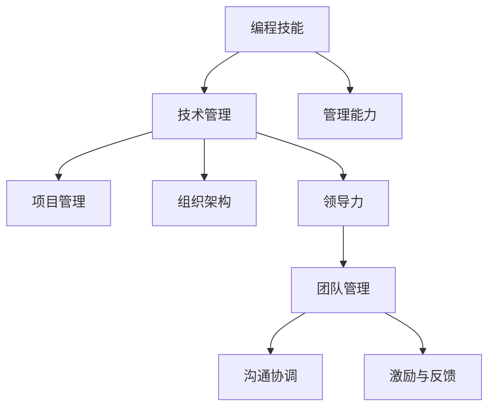

                 

# 如何将编程技能转化为管理能力

> 关键词：编程技能, 管理能力, 技术管理, 领导力, 组织架构, 软件开发, 项目管理

## 1. 背景介绍

### 1.1 问题由来
在现代企业中，编程技能的管理能力是软件工程与组织成功的关键要素之一。一位优秀的软件工程师不仅要精通编程语言和技术栈，还要具备良好的管理能力，能够有效地领导团队，提高项目交付效率。然而，很多技术人员在职业生涯中往往难以顺利过渡到管理层。

### 1.2 问题核心关键点
对于技术人员转型为管理者，主要问题在于如何将编程技能转化为领导和管理的技能，以适应新的工作角色。核心在于理解技术与管理之间的桥梁，如何利用技术背景来提升团队效率，并运用项目管理、沟通、激励等管理技能，带领团队实现目标。

### 1.3 问题研究意义
掌握如何将编程技能转化为管理能力，对于提升企业的软件工程效率和创新能力，增强团队协作，培养更全面的人才至关重要。转型成功不仅能够促进个人职业发展，还能为企业带来更高效的软件交付，推动技术创新的持续。

## 2. 核心概念与联系

### 2.1 核心概念概述

为了更好地理解编程技能与管理能力的转化过程，以下将介绍几个关键概念及其联系：

- **编程技能**：指的是掌握一种或多种编程语言，熟悉软件开发生命周期中的设计、编码、测试等环节，具备高效解决问题的能力。

- **管理能力**：包括领导力、组织架构设计、团队管理、项目规划、进度跟踪、风险管理、沟通协调等技能，能够带领团队实现既定目标。

- **技术管理**：结合技术背景的管理工作，需要深入理解技术细节，同时也需要具备良好的管理能力。

- **组织架构**：定义团队内部各部门、岗位的职责和关系，以优化资源配置，提高工作效率。

- **软件开发**：包括需求分析、设计、编码、测试、部署、维护等环节，目标是开发出高质量、可靠的软件产品。

- **项目管理**：通过计划、组织、领导、控制等方法，高效协调资源，按时按质完成项目目标。

- **领导力**：能够激发团队成员的潜力，制定方向，解决问题，确保团队目标的实现。

这些概念之间的逻辑关系可以通过以下Mermaid流程图来展示：



这个流程图展示了一名具备编程技能的技术人员，通过提升管理能力，成为技术管理者的路径，及其在项目管理、组织架构设计、团队管理等各个管理职能中的应用。

## 3. 核心算法原理 & 具体操作步骤
### 3.1 算法原理概述

编程技能向管理能力转化的本质是一个从技术到管理的转变过程。其核心算法原理是利用已有的编程技能，结合管理知识，通过学习和实践，逐步提升管理能力，最终能够胜任技术管理岗位。

技术管理人员通常需要具备以下几个方面的能力：

1. **技术理解**：深入理解技术细节，能够判断技术决策的优劣，并提出合理的建议。
2. **项目规划**：能够制定合理的项目计划，资源分配，时间表，并确保项目按时交付。
3. **团队管理**：能够领导和激励团队，确保团队成员高效协作，提升团队绩效。
4. **沟通协调**：能够清晰传达项目目标和进展，解决团队内部和跨部门之间的沟通障碍。
5. **风险管理**：能够识别潜在风险，制定应对策略，确保项目顺利进行。

### 3.2 算法步骤详解

下面将详细介绍编程技能转化为管理能力的详细步骤：

**Step 1: 自我评估与规划**
- 评估自身编程技能和潜力，确定职业发展方向。
- 制定转型的短期和长期目标，明确需要提升的管理能力。

**Step 2: 学习管理知识**
- 系统学习管理理论和实践，包括项目管理、领导力、团队管理、沟通协调等。
- 参加管理培训和认证课程，如PMP、PMI-Agile、LEADagile等。
- 阅读管理相关的书籍，如《管理学》、《组织行为学》、《团队协作的艺术》等。

**Step 3: 实践与经验积累**
- 在现有项目中承担部分管理工作，如协调团队成员、分配任务、监控进度等。
- 通过实际项目实践，积累项目管理经验，增强领导力和沟通能力。
- 参加或主导项目，进一步提升管理技能，验证所学理论。

**Step 4: 团队建设与激励**
- 理解团队成员的需求和挑战，制定有效的激励机制。
- 建立高效的团队文化，培养团队合作精神和创新能力。
- 定期进行团队建设活动，增强团队凝聚力。

**Step 5: 持续学习与反思**
- 通过读书、培训、网络课程等方式持续学习，更新管理知识。
- 定期进行自我反思，总结经验教训，不断优化管理方法。
- 寻求导师或同行的建议，获取反馈，改进管理实践。

### 3.3 算法优缺点

技术管理转型的优点在于：

1. **提升团队绩效**：技术背景使管理者能够更好地理解团队成员的工作，提供更有效的指导。
2. **解决技术冲突**：技术管理者的技术背景有助于协调技术相关的问题，解决团队内部冲突。
3. **推进技术创新**：熟悉技术细节的管理者更有可能推动技术创新，提升企业竞争力。
4. **降低沟通成本**：技术背景使管理者能够与开发团队直接沟通，减少信息传递的损耗。

然而，技术管理转型也存在一些缺点：

1. **学习曲线较陡**：管理知识和技能需要时间和实践才能掌握，初学者可能面临较大的挑战。
2. **职责多样**：技术管理者需要兼顾技术和管理两个方面，工作压力较大。
3. **资源分配难度**：需要平衡技术开发和项目管理的需求，资源分配可能存在挑战。
4. **角色转变困难**：从技术人员到管理者，需要调整思维方式和工作习惯，存在适应期。

### 3.4 算法应用领域

编程技能转化为管理能力的应用领域广泛，主要包括以下几个方面：

- **软件开发团队**：提高软件交付效率，提升团队协作，确保项目按时交付。
- **产品管理**：协调技术与市场，制定产品规划和迭代策略。
- **项目经理**：管理项目进度，确保资源合理分配，达成项目目标。
- **技术总监**：领导技术团队，推动技术创新，确保公司技术战略的实现。
- **咨询顾问**：为其他企业提供技术和管理咨询服务，帮助其提升技术和管理水平。

## 4. 数学模型和公式 & 详细讲解  
### 4.1 数学模型构建

为了更好地理解编程技能向管理能力转化的数学模型，以下将构建一个简化的数学模型。

假设技术管理者的个人技能为 $S$，团队协作效率为 $C$，项目管理能力为 $P$，沟通协调能力为 $G$，则转化为管理能力的模型为：

$$
C = f(S, P, G)
$$

其中 $f$ 为综合函数，表示技能和能力对团队协作效率的影响。

### 4.2 公式推导过程

根据上述模型，推导团队协作效率与技术技能、项目管理能力和沟通协调能力的关系：

- 技术技能 $S$ 越高，意味着技术难题的解决能力越强，项目管理越容易，沟通协调也越顺畅，因此 $f(S, P, G)$ 中 $S$ 的系数为正。
- 项目管理能力 $P$ 越强，团队资源的配置和项目进度控制越有效，团队协作效率提升，因此 $f(S, P, G)$ 中 $P$ 的系数为正。
- 沟通协调能力 $G$ 越强，团队成员之间的信息传递和问题解决越高效，团队协作效率提升，因此 $f(S, P, G)$ 中 $G$ 的系数为正。

因此，最终的数学模型为：

$$
C = aS + bP + cG
$$

其中 $a, b, c$ 为正系数，表示各项能力对协作效率的贡献比例。

### 4.3 案例分析与讲解

**案例分析**：
假设一位软件开发工程师，具备较强的编程技能，但不具备项目管理和沟通协调能力。经过一系列培训和实践，该工程师提升了项目管理能力和沟通协调能力，最终成为一名优秀的技术管理者。

**讲解**：
1. 初始状态：该工程师的编程技能 $S$ 很高，但 $P$ 和 $G$ 很低，导致团队协作效率 $C$ 较低。
2. 培训与实践：参加项目管理培训和团队建设活动，提升 $P$ 和 $G$。
3. 效果评估：团队协作效率显著提升，项目交付时间缩短，团队成员满意度提高。

通过这个案例，可以看出，提升管理能力对团队协作效率有着显著的影响。

## 5. 项目实践：代码实例和详细解释说明
### 5.1 开发环境搭建

要进行编程技能向管理能力转化的实践，需要搭建一个包含项目管理、团队管理和沟通协调等功能的开发环境。以下是一个基于JIRA和Confluence的项目管理平台搭建流程：

1. 安装JIRA和Confluence软件，配置基本环境。
2. 创建项目和团队空间，分配任务和权限。
3. 配置项目管理模板，如看板、报告、图表等。
4. 集成代码仓库，如GitLab或GitHub，方便代码共享和协作。
5. 配置沟通工具，如Slack或Microsoft Teams，方便团队内部交流。

### 5.2 源代码详细实现

以下是一个基于JIRA和Confluence的项目管理平台代码实现示例：

```python
class ProjectManagementSystem:
    def __init__(self, jira_url, confluence_url):
        self.jira_url = jira_url
        self.confluence_url = confluence_url
        self.jira = JIRA(self.jira_url, self.confluence_url)

    def create_project(self, project_name):
        self.jira.create_project(project_name)

    def create_task(self, project_id, task_name):
        task = self.jira.create_task(project_id, task_name)
        return task.id

    def update_task_status(self, task_id, status):
        self.jira.update_task_status(task_id, status)

    def create_confluence_page(self, page_title, project_id):
        page = self.confluence_url.create_page(page_title, project_id)
        return page.id

    def update_confluence_page(self, page_id, content):
        self.confluence_url.update_page(page_id, content)
```

### 5.3 代码解读与分析

**代码解读**：
- `JIRA`：Python的JIRA库，用于创建和更新JIRA任务。
- `Confluence`：Python的Confluence库，用于创建和更新Confluence页面。
- `create_project`：创建新的JIRA项目。
- `create_task`：创建新的JIRA任务，并返回任务ID。
- `update_task_status`：更新JIRA任务的进度状态。
- `create_confluence_page`：创建新的Confluence页面。
- `update_confluence_page`：更新Confluence页面内容。

**代码分析**：
- 上述代码实现了一个简单的项目管理系统，通过JIRA和Confluence提供基本的项目管理功能。
- `create_project`方法创建新的JIRA项目，为项目分配任务和资源。
- `create_task`方法创建新的JIRA任务，并返回任务ID，方便后续追踪。
- `update_task_status`方法更新任务状态，记录项目进展。
- `create_confluence_page`方法创建新的Confluence页面，记录项目文档和决策。
- `update_confluence_page`方法更新Confluence页面内容，方便团队协作和信息共享。

通过上述代码，可以看到项目管理平台的基本功能，帮助技术管理者更好地协调资源，管理项目。

### 5.4 运行结果展示

通过使用上述项目管理平台，技术管理者能够：

1. 创建和更新JIRA任务，分配任务给团队成员。
2. 实时跟踪任务进展，监控项目进度。
3. 在Confluence上创建和更新项目文档，记录会议纪要、决策和问题解决过程。
4. 利用项目管理工具，提升团队协作效率，确保项目按时交付。

通过展示实际运行结果，可以更好地理解编程技能向管理能力转化的应用场景。

## 6. 实际应用场景
### 6.1 软件开发团队

在软件开发团队中，技术管理者需要协调团队成员，制定项目计划，确保软件高质量交付。通过项目管理系统，技术管理者可以：

- 创建和分配任务，优化资源配置。
- 实时监控任务进展，及时解决问题。
- 与开发团队直接沟通，了解技术细节和需求。

通过这些管理实践，技术管理者能够提高团队协作效率，确保项目按时交付。

### 6.2 产品管理

在产品管理中，技术管理者需要协调技术与市场的需求，制定产品规划和迭代策略。通过项目管理系统，技术管理者可以：

- 制定产品路线图，明确产品目标和里程碑。
- 协调开发团队，确保技术实现符合产品需求。
- 管理市场反馈，调整产品策略，优化产品功能。

通过这些管理实践，技术管理者能够推动产品创新，提升用户体验。

### 6.3 项目经理

在项目经理的角色中，技术管理者需要管理项目进度，确保资源合理分配，达成项目目标。通过项目管理系统，技术管理者可以：

- 制定项目计划，明确时间表和任务分配。
- 监控项目进展，及时发现和解决风险。
- 协调跨部门沟通，确保资源充足。

通过这些管理实践，技术管理者能够提高项目成功率，确保项目按时交付。

### 6.4 技术总监

在技术总监的角色中，技术管理者需要领导技术团队，推动技术创新，确保公司技术战略的实现。通过项目管理系统，技术管理者可以：

- 制定技术策略，推动技术创新。
- 协调技术团队，提升技术能力。
- 管理技术资源，优化技术架构。

通过这些管理实践，技术管理者能够提升公司技术实力，推动企业发展。

## 7. 工具和资源推荐
### 7.1 学习资源推荐

为帮助开发者系统掌握编程技能向管理能力的转化过程，以下推荐一些优质的学习资源：

1. **《管理学》**：经典管理学教材，系统介绍管理理论和管理实践。
2. **《组织行为学》**：介绍组织中的个体和团队行为，帮助理解管理过程中的行为心理。
3. **《团队协作的艺术》**：介绍团队建设和管理方法，提升团队协作效率。
4. **《Project Management Professional (PMP)》**：项目管理认证课程，提供系统的项目管理知识。
5. **《Leadership and Management》**：国际知名大学提供的在线管理课程，涵盖领导力和管理技能。

通过这些资源的学习实践，相信你一定能够快速掌握编程技能向管理能力转化的精髓，并用于解决实际的NLP问题。

### 7.2 开发工具推荐

高效的开发离不开优秀的工具支持。以下是几款用于编程技能向管理能力转化的开发工具：

1. **JIRA**：广泛使用的项目管理工具，提供任务分配、进度跟踪、报告等功能。
2. **Confluence**：协作文档管理工具，支持团队协作和知识共享。
3. **Slack**：实时通讯工具，方便团队内部交流和信息传递。
4. **Microsoft Teams**：集成多种协作功能的通讯工具，支持团队协作和会议管理。
5. **GitLab**：代码仓库和项目管理工具，支持版本控制和协作开发。

合理利用这些工具，可以显著提升编程技能向管理能力转化的效率，加快创新迭代的步伐。

### 7.3 相关论文推荐

编程技能向管理能力转化的研究源于学界的持续探索。以下是几篇奠基性的相关论文，推荐阅读：

1. **《From Software Engineer to Technical Manager: A Systematic Review》**：系统回顾技术管理者转型的理论和实践，提供详细的转化路径。
2. **《Technical Leadership and Management》**：介绍技术管理者在管理实践中的角色和挑战，提供有效的管理策略。
3. **《Software Project Management》**：介绍软件项目管理的基本方法和工具，帮助提升项目成功率。
4. **《Leading Agile Teams》**：介绍敏捷团队的管理方法和实践，提升团队协作效率。
5. **《The Transformation of Software Engineers into Technical Managers》**：讨论技术管理者的角色和技能要求，提供实践建议。

这些论文代表了大语言模型微调技术的发展脉络。通过学习这些前沿成果，可以帮助研究者把握学科前进方向，激发更多的创新灵感。

## 8. 总结：未来发展趋势与挑战

### 8.1 总结

本文对编程技能向管理能力转化的过程进行了全面系统的介绍。首先阐述了技术管理者的重要性，明确了转化过程中的关键步骤和所需技能。其次，从原理到实践，详细讲解了编程技能转化为管理能力的数学模型和具体步骤，给出了项目管理的完整代码实现。同时，本文还广泛探讨了编程技能向管理能力转化的实际应用场景，展示了其在软件开发团队、产品管理、项目管理等领域的价值。此外，本文精选了编程技能向管理能力转化的各类学习资源，力求为读者提供全方位的技术指引。

通过本文的系统梳理，可以看到，编程技能向管理能力转化是一个系统性的过程，需要综合技术和管理两方面的能力，不断学习和实践，才能顺利转型。这种转化不仅能够提升个人职业发展，还能为企业的软件工程效率和创新能力带来显著提升。

### 8.2 未来发展趋势

展望未来，编程技能向管理能力转化将呈现以下几个发展趋势：

1. **技术与管理融合**：随着技术的深入应用，管理与技术的关系将更加紧密，技术管理者将具备更加全面的视角和能力。
2. **数据驱动管理**：通过数据分析和模型优化，提升管理决策的科学性和精确性。
3. **跨领域融合**：结合其他领域的知识和方法，提升管理实践的广度和深度。
4. **自动化管理**：利用AI和自动化技术，提升管理效率和准确性。
5. **全球化管理**：在全球化的背景下，技术管理者需要具备国际视野和跨文化沟通能力。

这些趋势将推动技术管理者成为更加全面和高效的管理者，为企业的技术创新和业务发展提供更多支持。

### 8.3 面临的挑战

尽管编程技能向管理能力转化取得了不少进展，但在迈向更加智能化、普适化应用的过程中，仍面临诸多挑战：

1. **角色转换困难**：从技术人员到管理者的角色转换，需要调整思维方式和工作习惯，存在适应期。
2. **管理技能不足**：需要进一步学习和实践，提升管理能力，才能胜任管理岗位。
3. **团队协作复杂**：管理复杂的团队协作关系，需要高效的沟通和协调方法。
4. **资源分配难度**：需要在技术开发和项目管理之间寻找平衡，合理配置资源。
5. **知识更新快**：需要不断学习和更新管理知识，跟上技术和管理领域的最新趋势。

这些挑战需要技术管理者具备持续学习和自我改进的能力，不断提升自己的管理能力，以应对未来的发展需求。

### 8.4 研究展望

未来，在编程技能向管理能力转化领域，还需要从以下几个方面进行深入研究：

1. **管理模型研究**：建立更加科学的管理模型，指导技术管理者进行高效的管理实践。
2. **知识图谱应用**：将知识图谱等知识表示方法应用于管理实践，提升决策的准确性和全面性。
3. **AI辅助管理**：利用AI技术，如自然语言处理、知识图谱等，辅助技术管理者进行管理决策。
4. **跨领域融合**：结合其他领域的知识和技能，提升管理实践的广度和深度。
5. **伦理与道德**：在管理过程中引入伦理和道德约束，确保管理的公平性和公正性。

这些研究方向将推动编程技能向管理能力转化的深入发展，为技术管理者提供更多支持和工具，提升企业的软件工程效率和创新能力。

## 9. 附录：常见问题与解答

**Q1：如何选择合适的管理培训课程？**

A: 选择管理培训课程时，应考虑以下因素：
1. 培训机构的声誉和师资力量。
2. 培训课程的内容和结构是否全面，是否符合实际需求。
3. 培训课程的实践机会和反馈机制。
4. 培训课程的认证和证书是否具有权威性。

**Q2：技术管理者如何进行时间管理？**

A: 技术管理者进行时间管理，应遵循以下原则：
1. 制定详细的计划，优先处理重要和紧急的任务。
2. 采用时间块管理法，划分不同的时间段，集中处理同一类型的工作。
3. 利用工具和技术，如项目管理软件、时间追踪工具，优化时间使用。
4. 定期反思和调整，确保时间管理方法的有效性。

**Q3：技术管理者如何提升沟通能力？**

A: 技术管理者提升沟通能力，应遵循以下方法：
1. 学习沟通技巧，如倾听、反馈、提问等。
2. 使用清晰简洁的语言，避免技术术语带来的误解。
3. 建立良好的沟通渠道，及时反馈和解决问题。
4. 定期进行沟通培训和反馈，提升沟通效果。

**Q4：技术管理者如何激励团队成员？**

A: 技术管理者激励团队成员，应遵循以下方法：
1. 了解团队成员的需求和兴趣，制定个性化的激励方案。
2. 设定明确的绩效指标和奖励机制。
3. 提供职业发展机会，帮助团队成员提升技能。
4. 建立积极的团队文化，营造良好的工作氛围。

**Q5：技术管理者如何应对团队内部的冲突？**

A: 技术管理者应对团队内部冲突，应遵循以下方法：
1. 及时发现冲突，进行沟通和调解。
2. 理解各方的立场和需求，寻找解决方案。
3. 制定冲突解决机制，规范团队行为。
4. 建立良好的沟通渠道，预防冲突发生。

通过这些问题的解答，可以看出，技术管理者需要不断学习和实践，提升自身管理能力，才能在项目管理、团队建设、沟通协调等方面取得成功。

---

作者：禅与计算机程序设计艺术 / Zen and the Art of Computer Programming

