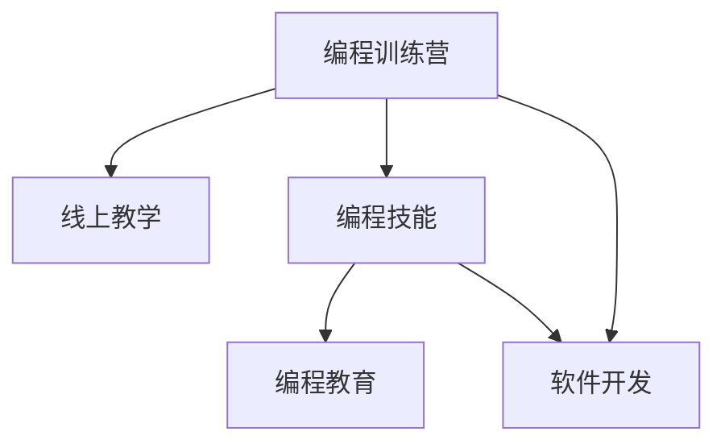

                 

# 如何将编程技能转化为线上编程训练营

> 关键词：编程训练营,线上教学,编程技能,编程教育,软件开发

## 1. 背景介绍

### 1.1 问题由来

随着互联网和信息技术的快速发展，线上教育已经成为全球教育的重要组成部分。编程技能作为数字时代必备的核心技能，其教育与培训方式也正在经历一场深刻的变革。传统的线下编程培训班往往面临着场地、师资、管理等多方面的限制，难以大规模推广。相比之下，线上编程训练营不受地域限制，覆盖范围更广，运营成本更低，成为编程教育的重要发展方向。

### 1.2 问题核心关键点

将编程技能转化为线上编程训练营的核心在于如何利用先进的线上技术和丰富的教学资源，构建一个高效、互动、可持续的编程学习环境。本节将从以下几个方面探讨这一问题：

1. **课程设计**：如何设计课程内容，使其既覆盖基础知识又兼具实战项目，满足不同水平学习者的需求。
2. **教学模式**：如何选择适宜的教学模式，如视频讲解、在线互动、小组讨论等，提升学习效果。
3. **学习评估**：如何设计科学的评估机制，对学习者的学习过程和成果进行全面评估，并提供及时反馈。
4. **技术支持**：如何构建稳定可靠的技术架构，确保线上平台的稳定运行和用户交互流畅。

### 1.3 问题研究意义

将编程技能转化为线上编程训练营，对于推动编程教育的普及、提升学习者的编程能力、促进软件开发产业的发展，具有重要意义：

1. **普及教育**：突破地域和资源的限制，让更多人能够接触到高质量的编程教育资源。
2. **能力提升**：通过系统化的课程设计和实战项目，显著提升学习者的编程技能和实际应用能力。
3. **产业促进**：为软件开发企业提供源源不断的高素质人才，推动产业升级和创新。
4. **技术创新**：通过线上教育的研究和实践，推动教育技术和方法论的创新，加速信息技术领域的进步。

## 2. 核心概念与联系

### 2.1 核心概念概述

为了更好地理解如何将编程技能转化为线上编程训练营，本节将介绍几个关键概念及其相互联系：

- **编程训练营(Programming Camp)**：通过系统的课程设计、实战项目、教学互动等方式，提升学习者的编程技能和实际应用能力，面向企业招聘或自驱提升。
- **线上教学(Online Teaching)**：通过互联网平台，利用视频、文本、互动工具等，实现教师和学生之间的远程教学，不受时间和空间限制。
- **编程技能(Programming Skills)**：包括编程语言基础、算法设计、数据结构、软件开发流程等，是信息技术领域的重要核心技能。
- **编程教育(Programming Education)**：旨在提升学习者的编程能力，包括基础教育、职业培训、终身学习等。
- **软件开发(Software Development)**：通过编程技能实现软件系统的设计、开发、测试和维护，是编程技能在实际应用中的重要体现。

这些概念之间的联系可以通过以下Mermaid流程图来展示：



这个流程图展示了编程训练营与其他概念之间的逻辑关系：

1. 编程训练营通过线上教学和编程技能教育，提升学习者的软件开发能力。
2. 编程教育为编程训练营提供理论基础和支持。
3. 软件开发是编程技能在实际应用中的体现。

## 3. 核心算法原理 & 具体操作步骤

### 3.1 算法原理概述

将编程技能转化为线上编程训练营，本质上是一个系统的教育技术设计与实践过程。其核心思想是：利用互联网和信息技术，构建一个能够高效、互动、可持续的教育平台，通过系统化的课程设计、实战项目、教学互动等手段，实现编程技能的有效传递和应用。

具体而言，编程训练营的实现包括以下几个关键步骤：

1. **课程设计**：根据不同水平的学习者，设计具有层次性的课程内容，涵盖基础知识和实战项目，满足其学习需求。
2. **教学模式**：选择合适的教学模式，如视频讲解、在线互动、小组讨论等，提升学习效果。
3. **学习评估**：设计科学的评估机制，对学习者的学习过程和成果进行全面评估，并提供及时反馈。
4. **技术支持**：构建稳定可靠的技术架构，确保线上平台的稳定运行和用户交互流畅。

### 3.2 算法步骤详解

以下是将编程技能转化为线上编程训练营的具体操作步骤：

**Step 1: 确定课程目标和内容**

- 分析目标受众的编程水平和需求，确定适合的教学内容。
- 划分课程模块，涵盖基础知识、高级技巧、实战项目等。
- 设计每个模块的教学目标和评估标准。

**Step 2: 选择合适的教学模式**

- 根据课程内容，选择适宜的教学模式。例如，视频讲解适合基础理论的介绍，在线互动适合疑难点的讨论，小组讨论适合项目实践。
- 设计教学计划，合理分配每个模式的时间和比例。
- 引入互动工具，如在线问答、实时反馈等，增强学习者的参与感。

**Step 3: 构建技术架构**

- 选择合适的技术栈和框架，确保平台稳定运行和用户交互流畅。
- 设计数据流和用户流，确保数据安全和用户隐私。
- 引入容错和负载均衡机制，提升系统的可靠性和可扩展性。

**Step 4: 设计评估机制**

- 设计科学的评估标准，涵盖理论知识、编程技能、项目实践等多个方面。
- 采用多维度评估方式，如在线测试、项目评审、同伴互评等，全面评估学习者的学习成果。
- 引入反馈机制，及时向学习者提供评估结果和改进建议。

**Step 5: 运营和优化**

- 根据用户反馈和评估结果，持续优化课程内容和教学模式。
- 引入激励机制，如证书、奖金等，提升学习者的参与度和积极性。
- 定期更新课程内容和引入新技术，保持课程的先进性和实用性。

### 3.3 算法优缺点

将编程技能转化为线上编程训练营的方法具有以下优点：

1. **灵活性高**：线上课程不受时间和空间的限制，学习者可以自主安排学习时间和地点，灵活性高。
2. **覆盖面广**：线上平台可以同时覆盖大量学习者，普及程度高。
3. **资源丰富**：学习者可以接触到丰富的学习资源和实践项目，提升学习效果。
4. **互动性强**：通过在线互动和小组讨论等模式，增强学习者的参与感和互动性。

同时，该方法也存在一些局限性：

1. **自律性要求高**：线上学习需要学习者的高度自律，容易受到外界干扰。
2. **技术门槛高**：需要一定的技术能力来构建和维护线上平台。
3. **评估难度大**：线上评估方式可能存在一些局限，难以全面评估学习者的学习效果。

尽管存在这些局限性，但线上编程训练营作为编程教育的创新形式，具有广阔的应用前景，值得持续探索和优化。

### 3.4 算法应用领域

线上编程训练营的应用领域非常广泛，涵盖了从基础编程教育到高级软件开发培训等多个方面。以下是几个典型的应用场景：

- **基础编程教育**：面向中小学生、大学生、职业培训等人群，提供系统化的编程教育，培养编程兴趣和基础能力。
- **软件开发培训**：面向企业员工、创业者等人群，提供实战项目和技能提升，满足企业招聘和自我提升的需求。
- **技术交流平台**：面向开源社区、技术爱好者等人群，提供技术分享、项目协作、在线讨论等服务，促进技术交流和合作。
- **企业内部培训**：面向企业内部员工，提供定制化的编程培训，提升团队的技术能力和项目开发效率。

## 4. 数学模型和公式 & 详细讲解 & 举例说明

### 4.1 数学模型构建

为了更好地理解线上编程训练营的设计原理，本节将从数学模型的角度进行分析。

设编程训练营中的课程数量为 $n$，每个课程的目标分数为 $g_i$，学习者的实际学习效果为 $l_i$，其中 $i \in [1,n]$。假设每个课程的评估分为 $m$ 个维度，记为 $v_{i,j}$，其中 $j \in [1,m]$。

课程的总评估分数为 $G=\sum_{i=1}^n g_i$，学习者的总评估分数为 $L=\sum_{i=1}^n l_i$。

### 4.2 公式推导过程

根据上述模型，我们可以推导出一个基本的评估公式：

$$
\text{Score} = \frac{L}{G} \times 100
$$

其中 $\text{Score}$ 表示学习者最终的成绩。学习者成绩与目标课程的评估分数之比，乘以100，得到百分制分数。

### 4.3 案例分析与讲解

假设某课程的目标分数为 $g_i=100$，学习者的实际学习效果为 $l_i=90$，课程的评估维度为 $v_{i,j}$，其中 $j=1,2,3$，评估结果分别为 $v_{i,1}=80$，$v_{i,2}=90$，$v_{i,3}=95$。

则该学习者的课程评估分数为：

$$
l_i = \frac{80+90+95}{3} = 90
$$

最终的总评估分数为：

$$
L = \frac{90}{100} \times 100 = 90
$$

该学习者的总评估分数为：

$$
\text{Score} = \frac{90}{100} \times 100 = 90
$$

## 5. 项目实践：代码实例和详细解释说明

### 5.1 开发环境搭建

在进行线上编程训练营的开发前，我们需要准备好开发环境。以下是使用Python进行Django开发的环境配置流程：

1. 安装Anaconda：从官网下载并安装Anaconda，用于创建独立的Python环境。

2. 创建并激活虚拟环境：
```bash
conda create -n django-env python=3.8 
conda activate django-env
```

3. 安装Django：从官网获取对应的安装命令。例如：
```bash
pip install django==3.2
```

4. 安装必要的依赖库：
```bash
pip install django-crispy-forms django-plotly django-tables2 django-socketio
```

5. 安装Nginx：用于部署Django应用，提高Web服务的性能。
```bash
sudo apt-get update
sudo apt-get install nginx
```

6. 安装Python解释器：
```bash
sudo apt-get install python3
```

完成上述步骤后，即可在`django-env`环境中开始开发实践。

### 5.2 源代码详细实现

下面是一个简单的Django项目的代码实现，用于演示如何将编程技能转化为线上编程训练营。

```python
from django.urls import path
from django.shortcuts import render
from . import views

urlpatterns = [
    path('', views.home, name='home'),
    path('courses/', views.courses, name='courses'),
    path('course_details/<int:course_id>/', views.course_details, name='course_details'),
    path('enroll/<int:course_id>/', views.enroll, name='enroll'),
]
```

其中，`views.py`文件包含了项目的主要逻辑实现：

```python
from django.shortcuts import render
from django.http import HttpResponse
from django.views.decorators.csrf import csrf_exempt

@csrf_exempt
def home(request):
    return render(request, 'home.html')

@csrf_exempt
def courses(request):
    courses = fetch_courses()
    return render(request, 'courses.html', {'courses': courses})

@csrf_exempt
def course_details(request, course_id):
    course = fetch_course(course_id)
    return render(request, 'course_details.html', {'course': course})

@csrf_exempt
def enroll(request, course_id):
    course = fetch_course(course_id)
    if request.method == 'POST':
        user_id = request.POST.get('user_id')
        enroll_course(user_id, course_id)
        return HttpResponse("Enrollment successful!")
    else:
        return render(request, 'enroll.html', {'course': course})

def fetch_courses():
    # 从数据库或API获取所有课程信息
    pass

def fetch_course(course_id):
    # 从数据库或API获取指定课程信息
    pass

def enroll_course(user_id, course_id):
    # 将用户加入指定课程
    pass
```

### 5.3 代码解读与分析

让我们再详细解读一下关键代码的实现细节：

**views.py文件**：
- `home`视图：返回课程主页。
- `courses`视图：返回所有课程列表。
- `course_details`视图：返回指定课程的详细信息。
- `enroll`视图：处理课程报名逻辑，将用户加入指定课程。

**fetch_courses和fetch_course函数**：
- 用于从数据库或API获取课程信息，返回一个包含课程列表或指定课程详细信息的字典。

**enroll_course函数**：
- 用于将用户加入指定课程，可以整合到后端服务或数据库中进行保存。

这些代码展示了如何将编程技能转化为线上编程训练营的基本逻辑，包括课程的展示、报名和加入等。在实际项目中，还需要考虑课程设计、评估机制、技术架构等更多细节。

## 6. 实际应用场景

### 6.1 智能教育

线上编程训练营在智能教育领域有着广泛的应用前景。传统教育往往存在师资力量不足、教学资源有限的问题，而线上编程训练营可以提供系统化的编程教育资源，满足不同水平学习者的需求。

在技术实现上，可以设计多样化的课程内容，涵盖基础知识、高级技巧、实战项目等。通过视频讲解、在线互动、小组讨论等教学模式，提升学习效果。设计科学的评估机制，对学习者的学习过程和成果进行全面评估，并提供及时反馈。

### 6.2 软件开发

线上编程训练营可以面向企业员工、创业者等人群，提供实战项目和技能提升，满足企业招聘和自我提升的需求。

通过系统的课程设计和实战项目，学习者可以系统掌握编程技能，提升实际应用能力。通过在线互动和小组讨论等模式，增强学习者的参与感和互动性。设计科学的评估机制，全面评估学习者的学习成果，并提供及时反馈。

### 6.3 技术交流

线上编程训练营可以面向开源社区、技术爱好者等人群，提供技术分享、项目协作、在线讨论等服务，促进技术交流和合作。

通过技术分享和项目协作，学习者可以获取最新的技术动态，提升自身技术能力。通过在线讨论和互动，学习者可以与其他技术爱好者交流经验，分享知识。设计科学的评估机制，全面评估学习者的技术水平，并提供及时反馈。

### 6.4 未来应用展望

随着线上教育技术的不断进步，线上编程训练营的应用场景将更加丰富，覆盖领域也将更加广泛。未来，线上编程训练营有望在以下几个方面取得突破：

1. **跨领域融合**：线上编程训练营将与在线教育、职业培训、技术社区等多个领域融合，形成更加综合化的教育平台。
2. **个性化学习**：通过数据分析和人工智能技术，实现个性化学习路径推荐，提升学习效果。
3. **混合学习模式**：结合在线学习与线下实践，形成混合学习模式，提升学习者的实战能力。
4. **国际合作**：与全球顶尖的编程教育和培训机构合作，引入国际化的课程内容和评估机制，提升教育水平。
5. **技术创新**：通过不断探索和实践，推动教育技术和方法论的创新，促进教育技术的进步。

## 7. 工具和资源推荐

### 7.1 学习资源推荐

为了帮助开发者系统掌握线上编程训练营的设计和实践，这里推荐一些优质的学习资源：

1. **Django官方文档**：Django的官方文档提供了完整的框架介绍和示例代码，是学习Django的必备资料。

2. **Coursera《编程基础》课程**：由斯坦福大学开设的编程教育课程，涵盖编程基础、数据结构、算法设计等，适合初学者入门。

3. **edX《计算机科学导论》课程**：由哈佛大学开设的计算机科学入门课程，涵盖计算机科学的各个方面，适合深入学习。

4. **Udacity《全栈Web开发》纳米学位**：通过实战项目和项目评审，全面提升Web开发能力，适合有实际工作经验的学习者。

5. **Kaggle竞赛平台**：提供丰富的数据集和竞赛任务，可以实践编程技能和数据处理能力，适合进阶学习。

通过这些资源的学习实践，相信你一定能够快速掌握线上编程训练营的设计和实践方法，将其应用于实际的教育和培训中。

### 7.2 开发工具推荐

高效的开发离不开优秀的工具支持。以下是几款用于线上编程训练营开发的常用工具：

1. **Django**：基于Python的开源Web框架，灵活、高效，适合构建复杂的网络应用。

2. **React**：用于前端开发，提供组件化的开发模式，提升开发效率和用户体验。

3. **Git**：版本控制工具，便于团队协作和管理代码版本。

4. **JIRA**：项目管理工具，便于任务管理和进度跟踪。

5. **Docker**：容器化技术，便于环境部署和管理。

6. **AWS/Azure/GCP**：云计算平台，提供弹性计算和存储资源，便于构建和部署线上应用。

合理利用这些工具，可以显著提升线上编程训练营的开发效率，加快创新迭代的步伐。

### 7.3 相关论文推荐

线上编程训练营的发展源于学界的持续研究。以下是几篇奠基性的相关论文，推荐阅读：

1. **Django web framework**：Django的官方文档，提供了完整的框架介绍和示例代码。

2. **Coursera《编程基础》课程论文**：斯坦福大学的编程教育课程，涵盖编程基础、数据结构、算法设计等。

3. **edX《计算机科学导论》课程论文**：哈佛大学的计算机科学入门课程，涵盖计算机科学的各个方面。

4. **Udacity《全栈Web开发》纳米学位论文**：通过实战项目和项目评审，全面提升Web开发能力。

5. **Kaggle竞赛平台论文**：提供丰富的数据集和竞赛任务，可以实践编程技能和数据处理能力。

这些论文代表了大规模编程训练营的发展脉络，通过学习这些前沿成果，可以帮助研究者把握学科前进方向，激发更多的创新灵感。

## 8. 总结：未来发展趋势与挑战

### 8.1 研究成果总结

本文对如何将编程技能转化为线上编程训练营进行了全面系统的介绍。首先阐述了线上编程训练营的研究背景和意义，明确了其在编程教育中的重要作用。其次，从原理到实践，详细讲解了线上编程训练营的设计和实践方法，给出了具体的操作步骤和案例分析。

通过本文的系统梳理，可以看到，线上编程训练营作为编程教育的创新形式，具有广阔的应用前景。它能够突破地域和资源的限制，提供高效、互动、可持续的编程教育，满足不同水平学习者的需求，提升学习者的编程能力和实际应用能力。

### 8.2 未来发展趋势

展望未来，线上编程训练营的发展将呈现以下几个趋势：

1. **数据驱动**：通过数据分析和人工智能技术，实现个性化学习路径推荐，提升学习效果。
2. **跨领域融合**：与在线教育、职业培训、技术社区等多个领域融合，形成更加综合化的教育平台。
3. **混合学习模式**：结合在线学习与线下实践，形成混合学习模式，提升学习者的实战能力。
4. **国际合作**：与全球顶尖的编程教育和培训机构合作，引入国际化的课程内容和评估机制，提升教育水平。
5. **技术创新**：通过不断探索和实践，推动教育技术和方法论的创新，促进教育技术的进步。

### 8.3 面临的挑战

尽管线上编程训练营已经取得了一定的成果，但在迈向更加智能化、普适化应用的过程中，仍面临诸多挑战：

1. **技术门槛高**：需要一定的技术能力来构建和维护线上平台，技术门槛较高。
2. **数据安全和隐私**：学习者的数据安全和隐私保护需要严格保障，避免数据泄露和滥用。
3. **互动性和参与度**：如何增强学习者的互动性和参与度，避免在线学习的枯燥和低效。
4. **评估难度大**：线上评估方式可能存在一些局限，难以全面评估学习者的学习效果。
5. **可持续发展**：如何保证线上平台的可持续发展，避免资金和资源的浪费。

### 8.4 研究展望

面对线上编程训练营所面临的挑战，未来的研究需要在以下几个方面寻求新的突破：

1. **降低技术门槛**：通过工具封装和技术组件化，降低线上编程训练营的技术门槛，使其更加易用和易部署。
2. **强化数据安全和隐私**：引入加密技术、区块链技术等手段，提升数据安全和隐私保护能力。
3. **提升互动性和参与度**：通过引入虚拟现实、增强现实等技术，提升学习者的互动性和参与度。
4. **探索新型评估方式**：引入游戏化评估、项目评审等新型评估方式，全面评估学习者的学习效果。
5. **探索可持续发展模式**：通过商业化运营、众筹等手段，实现线上编程训练营的可持续发展。

这些研究方向的探索，必将引领线上编程训练营技术迈向更高的台阶，为编程教育带来新的突破。面向未来，线上编程训练营需要从技术、教育、商业等多个维度协同发力，共同推动编程教育的进步。

## 9. 附录：常见问题与解答

**Q1：如何设计多样化的课程内容？**

A: 设计多样化的课程内容需要考虑以下方面：

1. **基础与进阶**：课程内容应覆盖基础知识和进阶技巧，满足不同水平学习者的需求。
2. **实战项目**：通过实战项目，提升学习者的实际应用能力。
3. **技术前沿**：引入最新的技术动态和趋势，保持课程的先进性和实用性。

**Q2：如何提升学习者的互动性和参与度？**

A: 提升学习者的互动性和参与度可以通过以下方式：

1. **在线互动**：通过在线问答、实时反馈等工具，增强学习者的互动性。
2. **小组讨论**：通过小组讨论，提升学习者的参与感和团队协作能力。
3. **项目实践**：通过实战项目，让学习者在实践中提升技能和兴趣。

**Q3：如何评估学习者的学习效果？**

A: 设计科学的评估机制可以通过以下方式：

1. **在线测试**：通过在线测试，评估学习者的理论知识掌握情况。
2. **项目评审**：通过项目评审，评估学习者的实战能力和项目完成质量。
3. **同伴互评**：通过同伴互评，评估学习者的团队协作能力和沟通能力。

**Q4：线上编程训练营的技术架构需要注意哪些问题？**

A: 构建稳定可靠的技术架构需要注意以下问题：

1. **系统扩展性**：确保系统能够扩展，支持大规模用户同时在线。
2. **数据安全**：确保数据传输和存储的安全性，避免数据泄露和滥用。
3. **性能优化**：优化代码和数据库，提升系统的响应速度和处理能力。

**Q5：线上编程训练营的商业模式有哪些？**

A: 线上编程训练营的商业模式可以包括以下几种：

1. **付费模式**：通过订阅或单次购买，获取课程和服务的访问权限。
2. **免费模式**：通过广告、赞助等方式，实现内容的免费获取。
3. **C2C模式**：通过众包和共享，实现内容的共享和创新。

---

作者：禅与计算机程序设计艺术 / Zen and the Art of Computer Programming

