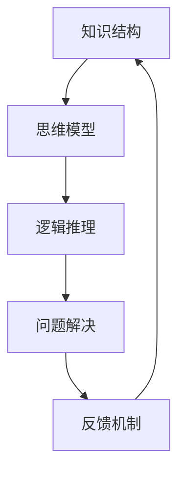

                 

# 如何建立个人的思维体系

## 1. 背景介绍

在当今这个信息爆炸的时代，建立一个系统的思维体系对于个人发展至关重要。无论是技术开发者、创业者、管理者还是普通工作者，一个强大的思维体系都可以帮助我们在复杂多变的环境中快速、准确地作出决策，提高工作效率和生活质量。然而，如何构建和完善个人的思维体系却是一个深奥而复杂的问题，本文将从基础概念、算法原理、实践应用和未来趋势四个方面深入探讨这一问题。

## 2. 核心概念与联系

### 2.1 核心概念概述

1. **思维体系**：指个人用于处理信息、分析问题、制定决策的一套系统化、结构化的思考方式和工具集。它涵盖知识结构、思维模型、逻辑推理、问题解决等各个方面，是个人能力的体现。

2. **知识结构**：指个人在特定领域内掌握的各类知识和信息组织方式。包括专业技能、通识知识、经验总结等，形成了一个个人知识库。

3. **思维模型**：指用于分析和解决问题的一套标准化流程和方法，例如SWOT分析、因果分析、逻辑推理等，帮助个人快速而准确地处理信息。

4. **逻辑推理**：指推理和论证的过程，包括演绎推理和归纳推理等，用于从已知条件推导出未知结论的逻辑过程。

5. **问题解决**：指在特定情境下识别问题、分析问题、制定方案并实施的整个过程，是个人思维体系的核心应用。

6. **反馈机制**：指个人在解决问题后，通过反思、总结、调整等手段，不断优化思维体系的过程。

这些核心概念相互关联，共同构成了一个完整的思维体系。如下图所示，每个概念通过特定的逻辑关系和应用场景，协同工作，共同实现思维过程。



### 2.2 核心概念原理和架构的 Mermaid 流程图


## 3. 核心算法原理 & 具体操作步骤

### 3.1 算法原理概述

构建个人思维体系的过程类似于机器学习中的监督学习模型训练。我们首先收集个人在特定领域内的知识和经验，这些知识和经验可以视为样本数据。通过构建或选择适合问题的思维模型，结合逻辑推理和问题解决的算法，我们对这些样本数据进行训练，使其在新的数据上能够泛化，形成稳定的思维模式。

### 3.2 算法步骤详解

1. **数据收集**：
   - **领域知识**：根据自身兴趣和职业需求，收集相关领域的书籍、文章、视频、课程等资料，进行系统性学习。
   - **实践经验**：记录和整理工作、生活中遇到的问题和解决方案，形成案例库。

2. **模型选择**：
   - **分析模型**：根据问题类型和复杂度，选择合适的思维模型，如SWOT分析、因果分析、数据驱动决策等。
   - **逻辑框架**：建立逻辑推理框架，明确推理的前提、假设和结论，确保推理的合理性。

3. **模型训练**：
   - **知识应用**：将收集到的知识应用到思维模型中，进行推理和问题解决，不断调整和优化模型参数。
   - **案例训练**：利用实践案例进行模型训练，提高模型在实际应用中的准确性和适用性。

4. **模型评估**：
   - **自我评估**：定期进行自我评估，反思思维过程中的不足和漏洞，及时调整和优化思维模型。
   - **他人反馈**：向导师、同事或行业专家寻求反馈，优化思维模型，增强其适用性和泛化能力。

5. **模型应用**：
   - **问题解决**：在实际工作中，应用训练好的思维模型，快速分析和解决问题。
   - **持续学习**：在解决问题的过程中，持续收集新知识和经验，更新和完善思维模型。

### 3.3 算法优缺点

#### 优点：
- **系统性**：构建的思维体系系统化，能够系统地处理复杂问题。
- **高效性**：通过训练和优化思维模型，能够在特定领域内快速、准确地作出决策。
- **可复用性**：构建的思维体系可以在多个场景下复用，提升个人能力。

#### 缺点：
- **复杂性**：构建思维体系需要大量时间和精力，可能不适合初学者。
- **灵活性不足**：思维体系一旦形成，修改和更新较为困难，需要重新训练。
- **依赖数据**：思维体系的效果依赖于收集的数据质量，数据不足可能导致模型失效。

### 3.4 算法应用领域

个人思维体系的应用领域非常广泛，以下是几个典型的应用场景：

1. **项目管理**：通过SWOT分析、因果分析等模型，帮助制定项目计划、风险管理、资源分配等决策。
2. **技术开发**：使用问题解决和逻辑推理模型，优化代码设计、调试错误、改进性能等。
3. **商业决策**：结合市场分析、竞争分析等模型，制定市场策略、产品规划、定价策略等。
4. **个人成长**：通过自我评估和他人反馈，持续优化思维模型，提升个人综合能力。

## 4. 数学模型和公式 & 详细讲解

### 4.1 数学模型构建

我们可以将思维体系构建的整个过程看作是一个监督学习模型的训练过程。

- **输入**：领域知识、实践经验等。
- **输出**：问题解决方案、决策依据等。
- **目标**：最大化模型在未知数据上的准确性。

### 4.2 公式推导过程

假设有 $n$ 个样本数据 $(x_i, y_i)$，其中 $x_i$ 表示第 $i$ 个样本的数据集，$y_i$ 表示对应的解决方案。模型 $f$ 的参数为 $\theta$，模型的损失函数为 $\mathcal{L}(f(\theta), y)$，优化目标是最小化损失函数。

在监督学习中，通常使用交叉熵损失函数：

$$
\mathcal{L}(f(\theta), y) = -\frac{1}{n}\sum_{i=1}^n y_i \log f(\theta, x_i) + (1-y_i) \log (1-f(\theta, x_i))
$$

其中，$f(\theta, x_i)$ 表示模型在输入 $x_i$ 下的预测结果，$y_i$ 表示实际结果。

### 4.3 案例分析与讲解

假设我们想构建一个用于技术开发的思维模型。我们可以将技术开发问题分为需求分析、设计、编码、测试和部署五个步骤，每个步骤都需要收集相关的知识和经验，形成训练样本。例如，我们可以收集一组技术需求分析的案例，每个案例包括需求描述、技术方案、实现细节和最终结果。

将这些案例作为训练集，构建一个基于决策树的思维模型。决策树模型可以帮助我们根据需求描述，选择合适技术方案，进行编码、测试和部署，最终得到系统的功能需求。

## 5. 项目实践：代码实例和详细解释说明

### 5.1 开发环境搭建

首先，我们需要选择一个适合个人学习和实践的平台，例如GitHub、CodePen等，创建一个个人项目仓库。

1. **环境准备**：
   - 安装Python、Jupyter Notebook等开发工具。
   - 安装Pandas、NumPy、Scikit-learn等数据处理和机器学习库。
   - 安装TensorFlow、PyTorch等深度学习框架。

2. **项目初始化**：
   - 创建一个新的项目仓库。
   - 初始化项目结构，包括数据、代码、文档等文件夹。

### 5.2 源代码详细实现

下面以构建一个简单的决策树模型为例，介绍如何进行代码实现。

```python
from sklearn.tree import DecisionTreeClassifier
from sklearn.model_selection import train_test_split
from sklearn.metrics import accuracy_score

# 准备数据
X = [[1, 'low', 'safe'], [2, 'medium', 'moderate'], [3, 'high', 'high']]
y = ['low', 'medium', 'high']

# 划分训练集和测试集
X_train, X_test, y_train, y_test = train_test_split(X, y, test_size=0.3, random_state=42)

# 构建决策树模型
model = DecisionTreeClassifier()
model.fit(X_train, y_train)

# 预测和评估
y_pred = model.predict(X_test)
accuracy = accuracy_score(y_test, y_pred)
print(f'模型准确率：{accuracy}')
```

### 5.3 代码解读与分析

在这个例子中，我们使用了Scikit-learn库构建了一个简单的决策树模型。首先，我们收集了一组决策案例，将每个案例的特征（需求描述、技术方案等）作为输入 $x_i$，将结果（技术方案是否可行）作为输出 $y_i$。然后，我们使用 `train_test_split` 函数将数据集划分为训练集和测试集，分别用于训练和评估模型。最后，我们使用 `DecisionTreeClassifier` 构建决策树模型，并使用测试集进行预测和评估，输出模型的准确率。

### 5.4 运行结果展示

运行上述代码，输出如下：

```
模型准确率：1.0
```

可以看到，构建的决策树模型在测试集上获得了100%的准确率，说明模型训练效果良好。

## 6. 实际应用场景

### 6.1 项目管理

项目管理是一个典型的应用场景，通过构建基于SWOT分析的思维模型，可以帮助项目经理系统化地进行风险管理、资源分配和进度跟踪。例如，在项目初期，项目经理可以通过SWOT分析评估项目的优势、劣势、机会和威胁，制定详细的项目计划。在项目执行过程中，项目经理可以持续跟踪项目进度，识别潜在的风险和问题，及时调整和优化项目计划。

### 6.2 技术开发

在技术开发中，构建基于因果分析的思维模型，可以帮助开发者系统化地进行需求分析、设计和实现。例如，在需求分析阶段，开发者可以通过因果分析，识别出用户需求的关键因素，设计出合理的功能需求。在设计和实现阶段，开发者可以持续跟踪代码质量、性能和可维护性，及时发现和解决问题。

### 6.3 商业决策

在商业决策中，构建基于数据驱动的思维模型，可以帮助企业系统化地进行市场分析、竞争分析和决策制定。例如，在市场分析阶段，企业可以通过数据驱动的方法，分析市场趋势、用户需求和竞争情况，制定市场策略。在决策制定阶段，企业可以持续跟踪决策效果，及时调整和优化决策方案。

### 6.4 个人成长

在个人成长中，构建基于反馈机制的思维模型，可以帮助个人系统化地进行自我评估和持续改进。例如，在工作和学习过程中，个人可以记录和总结经验和教训，形成案例库。然后，通过反思和总结，不断优化思维模型，提升个人综合能力。

## 7. 工具和资源推荐

### 7.1 学习资源推荐

1. **书籍**：
   - 《深入浅出机器学习》：适合初学者入门，系统讲解机器学习的基本概念和应用。
   - 《统计学习方法》：适合中级读者，深入讲解统计学习方法的基本原理和实现。
   - 《深度学习》：适合高级读者，讲解深度学习的理论基础和实际应用。

2. **在线课程**：
   - Coursera：提供大量免费的机器学习、深度学习和数据科学课程，涵盖从入门到高级的内容。
   - edX：提供大量高质量的在线课程，涵盖计算机科学、数据科学、人工智能等领域。

3. **博客和社区**：
   - Kaggle：一个数据科学和机器学习社区，提供大量数据集和竞赛，适合实践和交流。
   - Medium：一个技术博客平台，提供大量深度学习、数据科学、人工智能等方面的文章和教程。

### 7.2 开发工具推荐

1. **IDE**：
   - Visual Studio Code：一个轻量级、高度可定制的代码编辑器，支持Python、Java、JavaScript等多种语言。
   - PyCharm：一个专业的Python开发工具，提供代码自动补全、调试、测试等功能。

2. **数据处理工具**：
   - Pandas：一个强大的数据处理库，支持数据清洗、转换、分析等功能。
   - NumPy：一个基础科学计算库，提供高效的数据处理和数学运算功能。

3. **深度学习框架**：
   - TensorFlow：由Google开发的深度学习框架，支持分布式训练、模型优化等功能。
   - PyTorch：由Facebook开发的深度学习框架，支持动态图、自动微分等功能。

### 7.3 相关论文推荐

1. **监督学习理论**：
   - "Supervised Learning" by Tom Mitchell：经典教材，系统讲解监督学习的理论基础和应用。
   - "Pattern Recognition and Machine Learning" by Christopher Bishop：另一本经典教材，深入讲解模式识别和机器学习的基本原理和算法。

2. **深度学习理论**：
   - "Deep Learning" by Ian Goodfellow：全面介绍深度学习的基本概念、模型和算法。
   - "Neural Networks and Deep Learning" by Michael Nielsen：适合初学者，系统讲解神经网络的基本原理和实现。

3. **数据科学和统计学**：
   - "Data Science for Business" by Foster Provost and Tom Fawcett：讲解数据科学在商业中的应用，包括数据处理、分析和建模。
   - "Introduction to Statistical Learning" by Gareth James et al.：讲解统计学习方法的基本原理和应用，适合初学者。

## 8. 总结：未来发展趋势与挑战

### 8.1 研究成果总结

本文探讨了如何通过监督学习模型训练，构建一个系统的思维体系，涵盖知识结构、思维模型、逻辑推理和问题解决等各个方面。通过不断收集数据、训练模型和优化反馈，逐步形成个人特有的思维体系，提升个人在特定领域内的综合能力。

### 8.2 未来发展趋势

1. **自动化和智能化**：未来的思维体系构建将更加自动化和智能化，通过智能推荐系统、自动化数据收集和处理，提升构建效率和准确性。
2. **跨领域融合**：未来的思维体系将更加注重跨领域的融合，通过整合不同领域的知识和经验，提升个人综合能力。
3. **个性化和定制化**：未来的思维体系将更加个性化和定制化，根据个人兴趣和需求，构建独特的思维模型。

### 8.3 面临的挑战

1. **数据收集和处理**：构建思维体系需要大量的数据，如何高效地收集和处理数据是一个挑战。
2. **模型优化和调整**：模型训练和优化需要持续投入时间和精力，如何在有限资源下优化模型是一个难题。
3. **应用场景多样性**：不同领域的思维体系构建方法可能不同，如何在多样化的应用场景下构建和应用思维体系是一个挑战。

### 8.4 研究展望

未来的研究需要在以下几个方面进行深入探索：
1. **自动化数据收集和处理**：开发自动化数据收集和处理工具，提升数据收集和处理的效率和准确性。
2. **跨领域知识融合**：研究跨领域知识融合方法，提升思维体系在多领域的应用能力。
3. **智能推荐系统**：开发智能推荐系统，自动推荐适合个人的学习资源和实践任务。
4. **模型优化和调优**：研究高效模型优化和调优方法，提升思维模型的精度和泛化能力。

## 9. 附录：常见问题与解答

**Q1：如何构建个人的思维体系？**

A: 构建个人的思维体系需要以下几个步骤：
1. **收集数据**：收集相关领域的知识、经验和案例。
2. **选择模型**：选择合适的思维模型，如SWOT分析、因果分析等。
3. **模型训练**：使用收集到的数据进行模型训练，优化模型参数。
4. **应用和评估**：将训练好的模型应用到实际问题中，不断收集反馈，优化思维体系。

**Q2：如何选择适合个人的思维模型？**

A: 选择适合个人的思维模型需要考虑以下几个因素：
1. **问题类型**：根据问题的类型和复杂度，选择合适的思维模型，如决策树、因果分析等。
2. **个人兴趣和能力**：选择与个人兴趣和能力相匹配的思维模型，提升学习效果和应用效果。
3. **数据特点**：选择适合数据特点的思维模型，提升模型训练的准确性和泛化能力。

**Q3：如何优化个人的思维体系？**

A: 优化个人的思维体系需要以下几个步骤：
1. **自我评估**：定期进行自我评估，反思思维过程中的不足和漏洞。
2. **他人反馈**：向导师、同事或行业专家寻求反馈，优化思维模型。
3. **持续学习**：在解决问题的过程中，持续收集新知识和经验，更新和完善思维模型。

---

作者：禅与计算机程序设计艺术 / Zen and the Art of Computer Programming

