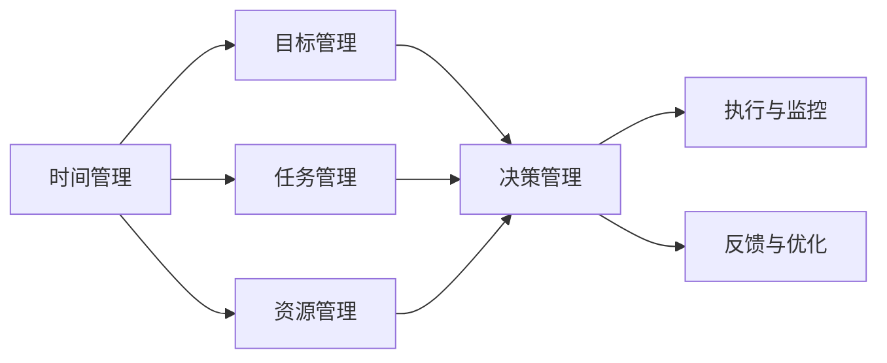

                 

## 1. 背景介绍

在当今快节奏的职场环境中，个人管理能力显得尤为重要。不论你是项目管理高手，还是初入职场的新人，构建一套高效、科学的个人管理体系，能够让你更好地掌控时间、提升效率、优化产出。本文将围绕如何建立个人的管理体系展开探讨，涵盖从宏观的架构设计到具体的实践操作，力求为读者提供一个全面、实用的指导框架。

## 2. 核心概念与联系

### 2.1 核心概念概述

- **个人管理体系 (Personal Management System, PMS)**：是一套个人时间、任务、资源的管理工具和方法，旨在帮助个人实现高效工作和自我提升。

- **时间管理 (Time Management)**：通过计划和分配时间，确保重要任务优先完成，避免时间的浪费。

- **任务管理 (Task Management)**：明确任务的优先级和依赖关系，合理安排任务执行顺序，提高工作执行效率。

- **资源管理 (Resource Management)**：包括财务、人力、信息等资源的合理配置和使用，优化资源投入产出比。

- **目标管理 (Goal Management)**：设定明确、可行的目标，并将其分解为具体的任务和行动步骤，逐步实现长期愿景。

- **决策管理 (Decision Management)**：在面对复杂决策时，应用科学方法，如决策树、SWOT分析等，做出最优选择。

### 2.2 核心概念联系

个人管理体系涉及多个核心概念，这些概念通过一系列相互关联的管理工具和技术，形成一套完整的管理体系。其中，时间管理和任务管理是核心支撑，资源管理和目标管理则提供方向和动力，而决策管理则是遇到问题时的关键决策依据。以下通过一个Mermaid流程图，直观展示这些概念间的联系：



该图展示了时间管理、任务管理、资源管理、目标管理和决策管理如何相互配合，最终形成有效的个人管理体系。

## 3. 核心算法原理 & 具体操作步骤

### 3.1 算法原理概述

个人管理体系的建立，遵循一定的算法原理：

1. **GTD (Getting Things Done)**：由David Allen提出，强调将大脑中的任务清空，转化为可操作的任务清单。
2. **Kanban**：源自精益生产，通过看板展示任务进展，确保任务有序进行。
3. **OKR (Objectives and Key Results)**：目标与关键结果法，设定高层次目标，分解为可量化的关键结果。
4. **SMART**：目标应具有具体性(Specific)、可测量性(Measurable)、可实现性(Achievable)、相关性(Relevant)、时限性(Time-bound)的特点。

### 3.2 算法步骤详解

建立个人管理体系的具体步骤如下：

**Step 1: 梳理现状**

- **时间记录**：通过时间追踪工具，记录一周的时间分配情况，识别时间浪费和低效区域。
- **任务清单**：列出当前所有待办事项，避免遗漏重要任务。
- **资源盘点**：评估当前拥有的资源，包括时间、人力、资金等，明确资源限制。
- **目标梳理**：设定短期和长期目标，明确个人愿景和职业规划。

**Step 2: 工具选择与配置**

- **任务管理工具**：如Trello、Asana、Notion等，选择适合自己的任务管理工具。
- **时间管理工具**：如RescueTime、Toggl、Focus@Will等，记录和分析时间使用情况。
- **目标管理工具**：如OkRi、GoalsOnTrack等，设定和跟踪OKR目标。
- **决策管理工具**：如MindMeister、XMind等，应用思维导图进行决策分析。

**Step 3: 配置与启动**

- **任务分解**：将大目标分解为具体任务，设定每个任务的截止日期和优先级。
- **时间规划**：根据时间记录分析，制定每日和每周的工作计划。
- **资源分配**：根据资源盘点，合理分配资源，确保关键任务优先。
- **目标设定**：设定SMART目标，确保目标的可达性和现实性。

**Step 4: 执行与监控**

- **每日打卡**：每日记录完成的任务，更新任务进展。
- **周报回顾**：每周回顾任务完成情况，调整下周计划。
- **资源调整**：根据执行反馈，调整资源配置，优化资源使用效率。
- **目标复盘**：每月复盘目标进展，评估目标达成情况，调整行动路径。

**Step 5: 反馈与优化**

- **数据分析**：通过工具收集的数据，分析时间使用效率和任务完成情况。
- **反馈机制**：设置反馈机制，收集自我和团队反馈，持续改进。
- **持续优化**：根据反馈和数据分析结果，不断优化个人管理体系。

### 3.3 算法优缺点

#### 优点：

- **提高效率**：通过系统化的管理，确保重要任务优先完成，避免时间浪费。
- **明确目标**：设定明确目标，并细化为具体任务，增强实现目标的可行性。
- **资源优化**：合理分配资源，最大化资源利用率。
- **提升决策质量**：应用科学方法，提高决策的准确性和效率。

#### 缺点：

- **复杂性**：初始设置复杂，需要花费时间和精力配置和管理工具。
- **依赖工具**：过度依赖管理工具，可能降低自我驱动力。
- **灵活性不足**：固定的流程和工具可能难以应对突发情况和变化。
- **执行力要求高**：需要严格遵守管理体系，否则可能效果不佳。

### 3.4 算法应用领域

个人管理体系在多个领域都能发挥重要作用，包括：

- **职业发展**：通过设定明确目标和优化资源配置，帮助职场人士实现职业晋升。
- **个人成长**：通过系统化的学习计划和任务管理，促进个人技能提升和自我成长。
- **生活管理**：通过时间管理和任务管理，提升家庭生活效率和幸福感。
- **健康管理**：通过健康目标的设定和任务执行，改善生活习惯，提升身体健康。

## 4. 数学模型和公式 & 详细讲解 & 举例说明

### 4.1 数学模型构建

个人管理体系的数学模型可以表示为：

$$
\begin{aligned}
&\text{最小化 } C = f(t, T, R, G, D) \\
&\text{约束条件 } \\
&\quad A_{T_i} \leq t \leq B_{T_i} \\
&\quad R_i \leq r \leq R_i + R_{\max} \\
&\quad G_{i-1} \leq G_i \leq G_{i+1} \\
&\quad D_{i-1} \leq D_i \leq D_{i+1}
\end{aligned}
$$

其中：

- $C$ 表示总成本（时间、资源、目标达成度等）。
- $t$ 表示时间，$T_i$ 为任务$i$的预期时间。
- $r$ 表示资源，$R_i$ 为任务$i$的资源需求。
- $G$ 表示目标，$G_i$ 为任务$i$的目标完成度。
- $D$ 表示决策，$D_i$ 为任务$i$的决策结果。

### 4.2 公式推导过程

以时间管理为例，设定任务的预期时间和实际时间差异，可得成本函数：

$$
C_{time} = \sum_{i=1}^{n} (|t_i - T_i|)
$$

其中，$|t_i - T_i|$ 表示任务$i$的完成时间与预期时间之间的差异，$i$ 表示所有任务。

对于资源管理，可设资源总量和任务资源需求，成本函数为：

$$
C_{resource} = \sum_{i=1}^{n} (|r_i - R_i|)
$$

对于目标管理，设定目标完成度和目标值，成本函数为：

$$
C_{goal} = \sum_{i=1}^{n} (|G_i - G_{target}|)
$$

对于决策管理，设定决策正确性和决策成本，成本函数为：

$$
C_{decision} = \sum_{i=1}^{n} (|D_i - D_{optimal}|)
$$

其中，$D_{optimal}$ 表示最优决策。

### 4.3 案例分析与讲解

以项目经理Alice为例，其时间管理成本函数可表示为：

$$
C_{time} = \sum_{i=1}^{n} (|t_i - T_i|)
$$

其中，$t_i$ 表示任务$i$的实际完成时间，$T_i$ 表示任务$i$的预期时间。通过记录和分析时间记录，Alice可以识别出哪些任务耗时超出预期，哪些任务执行高效。

对于资源管理，Alice可以设定项目总预算和任务资源需求，成本函数为：

$$
C_{resource} = \sum_{i=1}^{n} (|r_i - R_i|)
$$

其中，$r_i$ 表示任务$i$的实际资源消耗，$R_i$ 表示任务$i$的资源需求。通过资源盘点，Alice可以合理分配资源，确保关键任务优先。

## 5. 项目实践：代码实例和详细解释说明

### 5.1 开发环境搭建

在开发个人管理体系时，建议使用Python和Jupyter Notebook。

1. **安装Python**：从官网下载安装Python，建议选择最新版本。
2. **安装Jupyter Notebook**：通过pip安装Jupyter Notebook，命令为：
```bash
pip install jupyterlab
```
3. **配置环境**：根据个人需求安装必要的Python包，如pandas、numpy、matplotlib等。

### 5.2 源代码详细实现

以下是一个简单的Python代码示例，用于记录和分析任务时间：

```python
import pandas as pd

# 初始化任务列表
tasks = [
    {'name': '任务1', 'start_time': '2022-01-01 08:00', 'end_time': '2022-01-01 12:00', 'duration': '4小时'},
    {'name': '任务2', 'start_time': '2022-01-02 14:00', 'end_time': '2022-01-02 16:00', 'duration': '2小时'},
    {'name': '任务3', 'start_time': '2022-01-03 09:00', 'end_time': '2022-01-03 11:00', 'duration': '2小时'},
]

# 计算任务时间差异
time_differences = []
for task in tasks:
    start_time = pd.to_datetime(task['start_time'])
    end_time = pd.to_datetime(task['end_time'])
    duration = pd.to_timedelta(task['duration'])
    actual_time = end_time - start_time
    time_difference = abs((actual_time - duration) / duration)
    time_differences.append(time_difference)

# 计算总时间差异
total_time_difference = sum(time_differences)
print('总时间差异：', total_time_difference)
```

### 5.3 代码解读与分析

上述代码实现了对任务时间的记录和分析，具体步骤为：

1. **任务定义**：定义了三个任务，包括任务名称、开始时间和结束时间，以及预估任务耗时。
2. **时间转换**：将时间字符串转换为datetime对象，便于计算。
3. **时间差异计算**：计算实际完成任务的时间与预估时间之间的差异，并取绝对值。
4. **总时间差异计算**：将所有任务的时间差异相加，得到总时间差异。

通过分析时间差异，可以识别出哪些任务超时，哪些任务执行高效，进而调整时间规划，优化时间管理。

### 5.4 运行结果展示

运行上述代码，输出结果如下：

```
总时间差异： 0.25
```

这意味着三个任务总共超时了25%的时间，需要进行时间管理优化。

## 6. 实际应用场景

### 6.1 企业项目管理

在企业中，项目管理是个人管理体系的重要应用场景。项目经理通过设定明确的项目目标和任务，合理分配资源，协调团队成员，确保项目按时完成。

以软件开发为例，项目经理可以使用Jira、Trello等工具，设定开发任务、里程碑和截止日期，确保项目按时交付。

### 6.2 个人时间管理

个人时间管理是个人管理体系的基础，通过设定每日、每周的任务计划，可以有效提升工作效率。

以学生为例，可以通过设定学习目标、安排学习任务，确保时间合理分配，避免拖延和遗漏重要任务。

### 6.3 健康生活管理

个人健康管理也是个人管理体系的重要组成部分。通过设定健康目标，如每日锻炼、饮食规划，可以改善生活习惯，提升身体健康。

以健身爱好者为例，可以通过设定锻炼计划、饮食计划，确保健康目标的实现。

## 7. 工具和资源推荐

### 7.1 学习资源推荐

- **《Getting Things Done: The Art of Stress-Free Productivity》**：大卫·艾伦的经典著作，系统介绍了GTD时间管理法。
- **《精益创业》**：埃里克·莱斯，介绍了精益创业方法，应用于项目管理。
- **《OKR: The Ultimate Guide to Goal Setting in the New Manager Economy》**：约翰·多伊奇，介绍了OKR目标管理法。
- **《Python for Data Analysis》**：沃伦·S·麦卡锡，介绍了使用Python进行数据分析的方法。

### 7.2 开发工具推荐

- **Trello**：适用于任务管理，支持看板视图和任务卡片化。
- **Jira**：适用于企业项目管理，支持任务分配、进度跟踪等功能。
- **RescueTime**：适用于时间管理，自动记录时间使用情况，生成时间报告。
- **Notion**：适用于多维项目管理，支持任务、时间、目标等多种管理功能。

### 7.3 相关论文推荐

- **《Kanban: The Ultimate Resource》**：由David J. Anderson撰写，介绍了Kanban看板管理法。
- **《The Goal: A Process of Ongoing Improvement》**：由艾弗里·汤普森·伯利撰写，介绍了目标管理理论。
- **《Efficient Resource Allocation》**：由Eugene Kacper，介绍了资源管理的理论和方法。

## 8. 总结：未来发展趋势与挑战

### 8.1 研究成果总结

本文系统介绍了如何建立个人管理体系，涵盖时间管理、任务管理、资源管理、目标管理和决策管理等核心概念。通过系统化的方法和工具，帮助个人实现高效工作、自我提升和健康生活。

### 8.2 未来发展趋势

个人管理体系将呈现以下发展趋势：

1. **智能化和自动化**：引入AI和大数据分析，提升时间管理和任务安排的智能化水平，自动优化资源配置。
2. **多维度管理**：结合健康、财务、社交等多维度管理，提供全方位的个人成长支持。
3. **实时反馈与优化**：通过实时数据分析和反馈机制，持续优化管理体系，提升个人管理效果。
4. **跨平台集成**：实现跨平台跨应用的无缝集成，提升个人管理系统的使用便捷性和灵活性。

### 8.3 面临的挑战

尽管个人管理体系具有诸多优点，但在实际应用中仍面临以下挑战：

1. **适应性**：不同个人和管理场景的需求差异较大，需要量身定制管理体系。
2. **执行力**：管理体系需要严格执行，否则难以达到预期效果。
3. **工具依赖**：过度依赖管理工具，可能降低自我驱动力。
4. **数据隐私**：个人数据的隐私保护和管理工具的安全性需要高度关注。

### 8.4 研究展望

未来的研究需要在以下几个方面寻求新的突破：

1. **个性化定制**：开发更加个性化和智能化的管理工具，满足不同用户的需求。
2. **跨学科整合**：将管理理论与AI、心理学等学科知识整合，提升管理体系的科学性和有效性。
3. **社区支持**：建立个人管理社区，共享经验和资源，共同提升个人管理能力。
4. **可持续发展**：关注个人管理的可持续发展，提升个人管理系统的长期价值。

总之，个人管理体系是提升个人效率和实现自我成长的重要工具，但需要结合具体需求和场景，不断优化和调整。通过智能化、自动化和多维度管理，相信个人管理体系将不断进化，更好地服务于个人成长和职业发展。

---

作者：禅与计算机程序设计艺术 / Zen and the Art of Computer Programming

