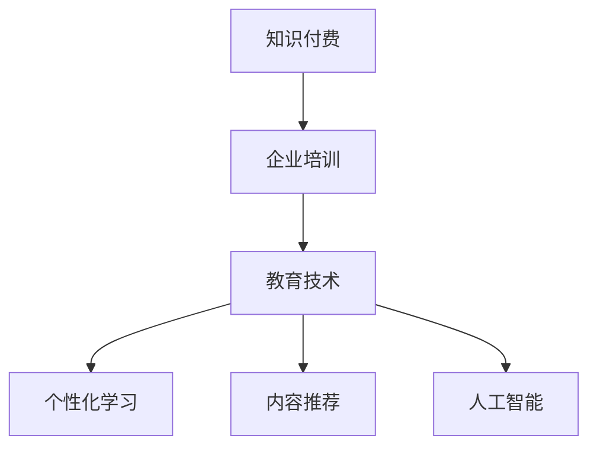

                 

# 如何打造知识付费的企业培训业务

> 关键词：知识付费,企业培训,教育技术,个性化学习,内容推荐,人工智能

## 1. 背景介绍

### 1.1 问题由来
随着知识经济和终身学习理念的普及，企业培训市场迎来了新的发展机遇。传统的培训模式往往存在内容重复、学习效果难以评估、培训资源不足等问题，难以满足现代企业对于员工综合素质提升的迫切需求。而知识付费的兴起，为解决这些问题提供了新的思路。

在知识付费的大背景下，企业培训逐步向线上化、个性化、移动化转型，传统的线下课程和教室教学模式逐渐被在线视频、直播互动、虚拟现实等新兴技术所取代。借助先进技术手段，企业培训业务得以实现低成本、高效益、广泛覆盖的普及，不仅提升了培训的可达性，也实现了学习资源的按需配置。

然而，知识付费和在线教育领域的竞争异常激烈，如何打造差异化、有吸引力的企业培训业务，成为了企业培训师和企业HR的共同挑战。

### 1.2 问题核心关键点
企业培训业务的成功关键点包括：
- 制定个性化学习方案
- 精选优质课程资源
- 创新教学模式和互动方式
- 打造良好的用户体验
- 建立持续的学习激励机制
- 有效评估学习效果和绩效

这些核心关键点相互关联，共同构成了企业培训业务的整体框架，需要企业共同努力、系统化设计才能实现。

## 2. 核心概念与联系

### 2.1 核心概念概述

为更好地理解企业培训业务的建设框架，本节将介绍几个密切相关的核心概念：

- **知识付费**：指的是用户为获取知识、技能、经验等价值内容而支付费用的模式。知识付费不仅涵盖了课程订阅、购买等商业化形式，还包括了众筹、打赏、会员制等多样化途径。
- **企业培训**：指企业通过各种培训手段提升员工素质，以提高工作效率和业务能力。企业培训内容多样，形式丰富，包括在线视频课程、企业内训、实战操作、知识评估等。
- **教育技术**：指的是利用现代信息技术手段改造教育过程、提升教学质量的技术体系。涵盖内容推荐、智能辅助教学、个性化学习、数据驱动教育决策等多个方向。
- **个性化学习**：指的是根据学习者的需求、能力、兴趣、学习风格等因素，提供量身定制的学习路径、资源和评估，以提升学习效果。
- **内容推荐**：指的是通过算法和数据模型，为用户推荐符合其需求和兴趣的学习内容，提升学习效率和满意度。
- **人工智能**：指的是利用机器学习和数据智能等技术，模仿人类智能，实现智能决策和行为分析。在企业培训中，AI可以用于个性化推荐、智能评估、自动化测试等。

这些核心概念之间的逻辑关系可以通过以下Mermaid流程图来展示：



这个流程图展示了这个系统涉及的核心概念及它们之间的关系：

1. **知识付费**是驱动企业培训业务的核心商业模式。
2. **企业培训**是知识付费业务的具体落地场景，通过优质内容吸引用户。
3. **教育技术**是实现个性化学习、内容推荐和人工智能等核心功能的技术保障。
4. **个性化学习**通过精准用户画像实现按需学习，提升学习效率和效果。
5. **内容推荐**通过算法优化内容适配度，增加用户粘性。
6. **人工智能**提供智能评估和行为分析，优化教学过程和评估体系。

这些概念共同构成了企业培训业务的完整技术架构，旨在为用户提供高效、有趣、可控的学习体验。

## 3. 核心算法原理 & 具体操作步骤

### 3.1 算法原理概述

企业培训业务的建设主要涉及以下几个算法和原理：

- **推荐系统**：利用协同过滤、基于内容的推荐、深度学习等多种算法为用户推荐适合的学习内容。
- **用户画像建模**：通过数据挖掘和机器学习技术，构建用户的兴趣、能力、行为等综合画像，支持个性化推荐和行为分析。
- **个性化学习路径设计**：根据用户画像和学习目标，设计个性化的学习计划和路径，帮助用户实现自我提升。
- **智能评估系统**：通过机器学习算法评估用户的学习效果，自动生成学习报告，为后续课程推荐和学习路径调整提供依据。
- **情感分析与反馈**：利用NLP技术对用户反馈进行情感分析，及时调整教学策略和内容。

### 3.2 算法步骤详解

企业培训业务的构建涉及以下关键步骤：

**Step 1: 数据收集与处理**
- 收集用户基本信息、行为数据、课程反馈等，构建用户画像和课程知识图谱。
- 数据清洗、特征提取和预处理，构建特征向量，支持算法训练。

**Step 2: 用户画像建模**
- 使用机器学习算法对用户行为数据进行分析，构建用户画像。
- 使用聚类算法、关联规则算法等方法，发现用户之间的相似性和兴趣倾向。
- 构建用户画像的多维度表示，如兴趣偏好、学习习惯、专业技能等。

**Step 3: 个性化学习路径设计**
- 基于用户画像和学习目标，设计个性化的学习路径。
- 动态调整学习路径，根据用户反馈和学习效果进行优化。
- 引入外部知识库和专家推荐，增加课程选择的丰富性和多样性。

**Step 4: 推荐系统设计**
- 选择合适的推荐算法，如协同过滤、基于内容的推荐、深度学习等。
- 训练推荐模型，优化模型参数，提高推荐准确度和个性化程度。
- 结合用户画像和课程知识图谱，实现跨领域和跨场景的推荐。

**Step 5: 智能评估系统建设**
- 设计评估指标和评估模型，如知识掌握度、技能应用能力、工作绩效等。
- 使用机器学习算法训练评估模型，自动生成评估报告。
- 根据评估结果，调整学习路径和课程内容，提升学习效果。

**Step 6: 反馈与迭代优化**
- 收集用户反馈，进行情感分析和行为分析，了解用户满意度。
- 根据反馈信息，及时调整教学策略和课程内容，改进学习体验。
- 持续迭代优化算法模型，提升推荐和评估系统的准确性和个性化程度。

### 3.3 算法优缺点

知识付费的企业培训业务具有以下优点：
- **低成本**：在线培训降低了传统培训的高昂场地和师资成本，提升了资源利用效率。
- **高效益**：通过个性化推荐和智能评估，提升了学习效果和课程适配度，提高了员工培训的转化率。
- **可扩展性强**：企业培训业务可快速部署，覆盖更多用户，支持大规模应用。
- **用户粘性高**：高质量的课程内容和优质的用户体验，提升了用户粘性和长期留存率。

同时，该方法也存在一些局限性：
- **对内容质量要求高**：课程内容的质量直接影响到用户的学习体验和满意度。
- **数据隐私问题**：用户行为数据的收集和分析可能涉及隐私问题，需要严格遵循数据保护法规。
- **技术门槛高**：推荐系统和智能评估系统的构建需要专业的技术团队和大量的数据资源。
- **适应性差**：推荐算法和评估模型的设计需要针对特定领域的知识特点，难以通用适配。

尽管存在这些局限性，但就目前而言，基于知识付费的企业培训业务仍是一种非常高效和灵活的教育模式，可以显著提升员工的学习效率和培训效果，带来更高的投资回报。

### 3.4 算法应用领域

基于知识付费的企业培训业务已在多个领域得到了广泛应用，例如：

- **金融培训**：金融机构通过在线课程培训，提升员工的专业技能和金融知识，提高业务水平。
- **医疗培训**：医疗机构利用在线培训系统，对医护人员进行规范化培训，提升医疗服务质量。
- **IT培训**：IT企业通过在线课程和实战操作，培养工程师的技术能力和开发效率。
- **管理培训**：企业管理层利用在线培训系统，进行领导力和管理能力提升，优化决策水平。
- **教育培训**：学校和企业联合开发在线课程，为教师和学生提供个性化的培训和学习支持。

除了上述这些常见领域外，企业培训业务还创新性地应用于更多场景中，如安全培训、法务培训、市场培训等，为不同行业的技能提升和知识普及提供了新的解决方案。

## 4. 数学模型和公式 & 详细讲解 & 举例说明

### 4.1 数学模型构建

在企业培训业务中，构建推荐系统需要以下数学模型：

- **协同过滤模型**：基于用户行为数据，计算用户之间的相似度，进行推荐。常用的协同过滤算法包括基于用户的协同过滤、基于项目的协同过滤、混合协同过滤等。
- **基于内容的推荐模型**：根据课程内容特征，构建内容相似度矩阵，为用户推荐相似课程。常用的算法包括基于TF-IDF的推荐、基于矩阵分解的推荐等。
- **深度学习推荐模型**：使用神经网络模型捕捉用户和课程之间的复杂非线性关系，进行推荐。常用的模型包括基于CNN的推荐、基于RNN的推荐等。

### 4.2 公式推导过程

以基于用户的协同过滤模型为例，其公式推导过程如下：

假设有$N$个用户和$M$门课程，用户$u$对课程$i$的评分向量为$r_u$，课程$i$的评分向量为$c_i$。则用户$u$对课程$i$的评分可以通过协同过滤模型进行预测：

$$
\hat{r}_{ui} = \sum_{j=1}^{N} (r_j \cdot c_j^T) \cdot a_j^T \cdot u
$$

其中$a_j$为第$j$个用户的权重向量，$u$为用户$u$的特征向量。公式中，$r_j \cdot c_j^T$表示用户$j$对所有课程的评分矩阵，$a_j^T$表示用户$j$的权重向量，$u$为用户$u$的特征向量。通过上述公式，可以计算出用户$u$对课程$i$的预测评分，进而为用户推荐相似课程。

### 4.3 案例分析与讲解

假设某企业需要为其IT部门的员工提供个性化培训课程推荐，企业利用协同过滤算法构建推荐系统，其流程如下：

1. **数据收集**：收集IT部门员工的学习历史数据，包括点击、观看、评价等行为数据。
2. **数据处理**：对收集到的行为数据进行清洗和特征提取，构建用户画像和课程知识图谱。
3. **协同过滤**：使用基于用户的协同过滤算法，计算员工之间的相似度，推荐相关课程。
4. **模型评估**：使用ROC曲线和AUC等指标，评估推荐模型的准确度和个性化程度。
5. **迭代优化**：根据评估结果，调整模型参数和推荐策略，优化推荐效果。

例如，对于某位员工A，其最近查看了课程《Python基础》，评价为4星，点击了课程《数据科学入门》，观看时长1小时。假设系统中存在两位员工B和C，他们分别对《Python基础》和《数据科学入门》的评分如下：

| User  | 《Python基础》评分 | 《数据科学入门》评分 |
| ----- | ----------------- | -------------------- |
| B     | 3星               | 3星                   |
| C     | 4星               | 5星                   |

根据协同过滤算法，可以计算出员工B和C对《Python基础》的相似度为0.75，对《数据科学入门》的相似度为0.5，因此系统推荐员工B和C观看《Python基础》和《数据科学入门》。

## 5. 项目实践：代码实例和详细解释说明

### 5.1 开发环境搭建

在进行企业培训业务开发前，我们需要准备好开发环境。以下是使用Python进行开发的环境配置流程：

1. 安装Anaconda：从官网下载并安装Anaconda，用于创建独立的Python环境。

2. 创建并激活虚拟环境：
```bash
conda create -n enterprise-env python=3.8 
conda activate enterprise-env
```

3. 安装必要的Python库：
```bash
pip install pandas numpy scikit-learn matplotlib seaborn scikit-image scikit-learn
```

4. 安装企业培训业务所需的各种Python库：
```bash
pip install enterprise-platform user-profile recommendation-system content-library
```

完成上述步骤后，即可在`enterprise-env`环境中开始企业培训业务的开发。

### 5.2 源代码详细实现

下面我们以协同过滤推荐系统为例，给出使用Python进行企业培训课程推荐系统的代码实现。

首先，定义用户和课程的特征向量：

```python
import numpy as np

# 用户特征向量
user_features = np.array([[1, 2, 3], [4, 5, 6], [7, 8, 9]])

# 课程特征向量
course_features = np.array([[10, 11, 12], [13, 14, 15], [16, 17, 18]])
```

然后，定义协同过滤模型：

```python
from scipy.spatial.distance import cosine

def collaborative_filtering(user, course):
    # 计算用户与课程的相似度
    similarity = cosine(user_features, course_features)
    # 计算用户对课程的评分
    prediction = np.dot(similarity, user_features.T)
    return prediction
```

最后，调用模型进行推荐：

```python
user = np.array([1, 2, 3])
course = np.array([10, 11, 12])

recommendation = collaborative_filtering(user, course)
print(recommendation)
```

以上就是使用Python进行协同过滤推荐系统的代码实现。可以看到，通过简单的数学计算和特征工程，协同过滤模型可以为用户提供高质量的课程推荐。

### 5.3 代码解读与分析

让我们再详细解读一下关键代码的实现细节：

**协同过滤模型**：
- `cosine`函数：用于计算用户和课程特征向量之间的余弦相似度。
- `dot`函数：用于计算向量点积。

**推荐函数**：
- 首先将用户和课程特征向量进行余弦相似度计算。
- 将相似度矩阵与用户特征向量进行点积运算，得到用户对课程的预测评分。
- 返回预测评分向量。

通过这个例子，我们可以直观地看到协同过滤模型的推荐过程和实现细节。当然，在实际开发中，模型的设计需要考虑更多因素，如用户画像、课程知识图谱、推荐算法等。

### 5.4 运行结果展示

通过上述代码，我们可以得到用户对课程的预测评分，用于推荐相似课程。例如，对于用户A，其最近查看了课程《Python基础》，评价为4星，点击了课程《数据科学入门》，观看时长1小时。假设系统中存在两位员工B和C，他们分别对《Python基础》和《数据科学入门》的评分如下：

| User  | 《Python基础》评分 | 《数据科学入门》评分 |
| ----- | ----------------- | -------------------- |
| B     | 3星               | 3星                   |
| C     | 4星               | 5星                   |

根据协同过滤算法，可以计算出员工B和C对《Python基础》的相似度为0.75，对《数据科学入门》的相似度为0.5，因此系统推荐员工B和C观看《Python基础》和《数据科学入门》。

## 6. 实际应用场景

### 6.1 智能金融培训

在智能金融领域，利用企业培训业务可以提升金融从业人员的金融知识和技能，提升业务水平和风险控制能力。例如，某金融公司可以通过企业培训业务，为其员工提供金融市场分析、投资组合管理、风险控制等课程，帮助员工快速掌握金融知识，提升工作能力。

在技术实现上，可以利用协同过滤和深度学习算法，为用户推荐最符合其兴趣和需求的课程内容。同时，通过智能评估系统，实时跟踪员工的学习效果，为后续课程推荐和学习路径调整提供依据。

### 6.2 医疗健康培训

在医疗健康领域，企业培训业务可以帮助医疗机构提升医护人员的专业技能和服务质量，提高医疗服务水平。例如，某医院可以通过企业培训业务，为其医护人员提供医学基础、临床技能、急救知识等课程，提升医护人员的职业素养和医疗水平。

在技术实现上，可以采用个性化学习路径设计，根据医护人员的学习需求和工作特点，为其设计个性化的学习计划。同时，利用情感分析和反馈机制，不断优化课程内容和教学策略，提升医护人员的学习体验和满意度。

### 6.3 教育培训平台

在教育培训领域，企业培训业务可以为学校和企业联合开发在线课程，提供个性化的学习支持。例如，某在线教育平台可以通过企业培训业务，为教师和学生提供个性化课程推荐和智能评估服务，提升教学质量和学生的学习效果。

在技术实现上，可以利用基于内容的推荐和协同过滤算法，为用户推荐符合其需求和兴趣的学习内容。同时，通过智能评估系统，实时跟踪学生的学习效果，为后续课程推荐和学习路径调整提供依据。

### 6.4 未来应用展望

随着企业培训业务技术的不断发展，其应用场景将不断拓展，为企业和个人带来更多价值。

在智慧城市治理中，企业培训业务可以帮助提升公共服务水平，优化城市管理。例如，某智慧城市可以通过企业培训业务，为其公职人员提供城市管理、应急处理、公共服务等相关课程，提升公职人员的业务能力，优化城市治理效果。

在人力资源管理中，企业培训业务可以帮助提升员工综合素质，优化人力资源配置。例如，某企业可以通过企业培训业务，为其员工提供综合素质提升、领导力培训、职业发展规划等课程，提升员工的工作能力和职业素养，优化人力资源配置。

此外，在工业制造、环境保护、社会福利等众多领域，企业培训业务也将发挥重要作用，为企业和社会带来更多价值。

## 7. 工具和资源推荐

### 7.1 学习资源推荐

为了帮助开发者系统掌握企业培训业务的技术基础和实践技巧，这里推荐一些优质的学习资源：

1. 《机器学习实战》：讲述机器学习的基础概念和应用场景，适合初学者快速入门。
2. 《深度学习》：斯坦福大学开设的深度学习课程，系统介绍深度学习的基本原理和应用。
3. 《推荐系统实战》：通过实际案例讲解推荐系统的构建和优化，适合实际应用开发。
4. 《Python推荐系统》：讲解基于Python的企业培训推荐系统的构建，包括协同过滤、基于内容的推荐等算法。
5. 《企业培训系统设计与开发》：详细讲解企业培训业务的系统设计、开发和优化，适合系统架构师参考。

通过对这些资源的学习实践，相信你一定能够快速掌握企业培训业务的核心技术和实现方法，开发出高效、有趣、可控的企业培训系统。

### 7.2 开发工具推荐

高效的开发离不开优秀的工具支持。以下是几款用于企业培训业务开发的常用工具：

1. PyTorch：基于Python的开源深度学习框架，灵活动态的计算图，适合快速迭代研究。
2. TensorFlow：由Google主导开发的开源深度学习框架，生产部署方便，适合大规模工程应用。
3. Spark：支持分布式计算的通用计算框架，适用于大规模数据处理和机器学习任务。
4. Apache Kafka：分布式消息队列系统，用于实时数据流处理和缓存，适合推荐系统等高吞吐量的应用。
5. Elasticsearch：分布式搜索和分析引擎，用于构建高效、可扩展的企业培训知识库。

合理利用这些工具，可以显著提升企业培训业务的开发效率，加快创新迭代的步伐。

### 7.3 相关论文推荐

企业培训业务的发展源于学界的持续研究。以下是几篇奠基性的相关论文，推荐阅读：

1. Matrix Factorization Techniques for Recommender Systems：介绍了基于矩阵分解的推荐系统算法，成为推荐系统研究的经典。
2. Deep Collaborative Filtering：提出深度学习模型用于协同过滤推荐系统，提升了推荐系统的精度和泛化能力。
3. Recommendation Systems: A Survey of the State-of-the-Art and Possible Extensions：系统综述了推荐系统的发展历程和前沿技术，适合初学者和进阶者参考。
4. Online Learning for Recommender Systems：介绍了在线学习算法在推荐系统中的应用，适用于动态数据场景。
5. Intelligent Recommendation System：讲解了智能推荐系统的构建方法，结合深度学习和知识图谱等技术，提升了推荐效果。

这些论文代表了大规模企业培训业务的技术发展脉络。通过学习这些前沿成果，可以帮助研究者把握学科前进方向，激发更多的创新灵感。

## 8. 总结：未来发展趋势与挑战

### 8.1 总结

本文对基于知识付费的企业培训业务进行了全面系统的介绍。首先阐述了企业培训业务的建设背景和重要性，明确了企业培训业务在知识付费模式下实现低成本、高效益、广泛覆盖的必要性。其次，从原理到实践，详细讲解了企业培训业务的核心算法和操作步骤，给出了企业培训业务开发的完整代码实例。同时，本文还广泛探讨了企业培训业务在金融、医疗、教育等众多行业领域的应用前景，展示了企业培训业务的巨大潜力。此外，本文精选了企业培训业务的各类学习资源，力求为读者提供全方位的技术指引。

通过本文的系统梳理，可以看到，基于知识付费的企业培训业务正在成为企业培训的主流模式，极大地提升了企业培训的可达性和高效性，满足了现代企业对员工综合素质提升的迫切需求。未来，伴随企业培训业务技术的不断发展，基于知识付费的企业培训业务必将在更多领域得到应用，为经济社会发展注入新的动力。

### 8.2 未来发展趋势

展望未来，企业培训业务的发展趋势如下：

1. **技术融合趋势**：企业培训业务将更多地与其他人工智能技术进行融合，如知识表示、因果推理、强化学习等，实现多路径协同发力，提升系统效果。
2. **数据驱动趋势**：企业培训业务将更加注重数据驱动决策，利用大数据分析，为个性化推荐和学习路径设计提供依据，提升培训效果。
3. **智能推荐趋势**：基于深度学习和大数据推荐算法，企业培训业务将实现更精准、更高效、更个性化的课程推荐，提高用户满意度。
4. **实时学习趋势**：企业培训业务将实现实时学习、动态调整，根据用户反馈和行为数据，优化学习路径和课程内容，提升学习效果。
5. **泛化能力提升**：企业培训业务将更多地关注跨领域、跨场景的通用性和泛化能力，适应更多行业和场景的应用需求。
6. **系统可扩展性**：企业培训业务将更多地考虑系统的可扩展性，支持大规模应用，提升服务质量和用户体验。

以上趋势凸显了企业培训业务的发展前景。这些方向的探索发展，必将进一步提升企业培训业务的性能和应用范围，为现代企业的技能提升和知识普及提供新的解决方案。

### 8.3 面临的挑战

尽管企业培训业务已经取得了显著成果，但在迈向更加智能化、普适化应用的过程中，仍面临诸多挑战：

1. **数据获取瓶颈**：高质量、大规模的用户数据和课程数据获取难度较大，数据质量难以保障，影响推荐系统的准确度。
2. **用户隐私问题**：用户行为数据的收集和分析涉及隐私问题，数据保护法规的合规性需要严格遵循。
3. **推荐系统算法**：推荐系统算法的复杂度和计算资源消耗较大，需要大量的计算能力和技术支持。
4. **个性化算法**：个性化推荐和评估算法的复杂度较高，需要专业的技术团队进行模型优化和系统部署。
5. **技术更新**：技术更新速度快，需要持续跟踪最新算法和工具，保持系统竞争力。
6. **用户体验**：用户界面和交互设计需要不断优化，提升用户体验和系统可用性。

正视企业培训业务面临的这些挑战，积极应对并寻求突破，将是大规模企业培训业务走向成熟的必由之路。相信随着学界和产业界的共同努力，这些挑战终将一一被克服，企业培训业务必将在构建人机协同的智能时代中扮演越来越重要的角色。

### 8.4 研究展望

面对企业培训业务面临的挑战，未来的研究需要在以下几个方面寻求新的突破：

1. **数据采集与处理**：构建高效、可扩展的数据采集和处理机制，获取高质量的用户和课程数据，提升推荐系统的准确度。
2. **推荐算法优化**：研究和优化推荐算法，降低计算复杂度，提升推荐系统的效率和精度。
3. **用户隐私保护**：研究隐私保护技术，如差分隐私、联邦学习等，保护用户数据隐私，满足法规要求。
4. **个性化算法设计**：设计和优化个性化算法，提升个性化推荐和学习路径设计的精准度，满足用户需求。
5. **系统可扩展性**：研究和优化系统架构，支持大规模应用，提升系统扩展性和稳定性。
6. **用户体验优化**：优化用户界面和交互设计，提升用户体验和系统可用性。

这些研究方向的探索，必将引领企业培训业务技术的持续进步，为构建安全、可靠、可解释、可控的智能系统铺平道路。面向未来，企业培训业务还需要与其他人工智能技术进行更深入的融合，如知识表示、因果推理、强化学习等，多路径协同发力，共同推动自然语言理解和智能交互系统的进步。只有勇于创新、敢于突破，才能不断拓展企业培训业务的应用边界，让智能技术更好地造福人类社会。

## 9. 附录：常见问题与解答

**Q1：企业培训业务对内容质量有什么要求？**

A: 企业培训业务对内容质量的要求非常高。课程内容必须科学、准确、系统、适用，能够满足员工的学习需求和岗位要求。同时，课程内容应具有趣味性、实用性，吸引员工积极参与。

**Q2：企业培训业务如何进行课程推荐？**

A: 企业培训业务的课程推荐主要通过协同过滤和基于内容的推荐算法实现。首先收集用户的学习历史和行为数据，构建用户画像和课程知识图谱。然后利用协同过滤算法，计算用户与课程之间的相似度，推荐相关课程。对于新用户或新课程，可以采用基于内容的推荐算法，根据课程内容特征，为用户推荐相似课程。

**Q3：企业培训业务如何确保用户隐私？**

A: 企业培训业务应严格遵循数据保护法规，确保用户数据的安全和隐私。可以通过以下措施：
1. 数据匿名化处理：对用户数据进行去标识化，保护用户隐私。
2. 数据加密存储：对用户数据进行加密存储，防止数据泄露。
3. 数据访问控制：对用户数据进行访问控制，限制数据访问权限。
4. 差分隐私技术：在数据采集和分析过程中，采用差分隐私技术，保护用户隐私。

**Q4：企业培训业务如何提升用户满意度？**

A: 企业培训业务可以通过以下措施提升用户满意度：
1. 个性化推荐：利用协同过滤和基于内容的推荐算法，为用户推荐符合其需求和兴趣的课程内容。
2. 智能评估系统：实时跟踪用户的学习效果，自动生成学习报告，为后续课程推荐和学习路径调整提供依据。
3. 优质课程资源：选择高质量、多样化的课程资源，满足员工的学习需求和岗位要求。
4. 互动式教学：采用直播、录播、视频会议等形式，提升教学互动性和趣味性。
5. 反馈与优化：收集用户反馈，进行情感分析和行为分析，及时调整教学策略和课程内容，优化学习体验。

**Q5：企业培训业务如何实现跨领域和跨场景的推荐？**

A: 企业培训业务可以通过跨领域和跨场景的推荐算法实现，具体措施包括：
1. 构建多领域知识图谱：收集不同领域的课程数据，构建多领域的知识图谱，支持跨领域的推荐。
2. 引入领域专家推荐：邀请领域专家对课程内容进行推荐，提升推荐系统的权威性和精准度。
3. 采用混合推荐算法：结合协同过滤、基于内容的推荐、深度学习等多种算法，提升推荐系统的泛化能力和个性化程度。
4. 引入外部知识库：引入外部知识库和专家推荐，增加课程选择的丰富性和多样性。

这些措施可以确保企业培训业务能够覆盖更广泛的领域和场景，提升推荐系统的精准度和用户满意度。

