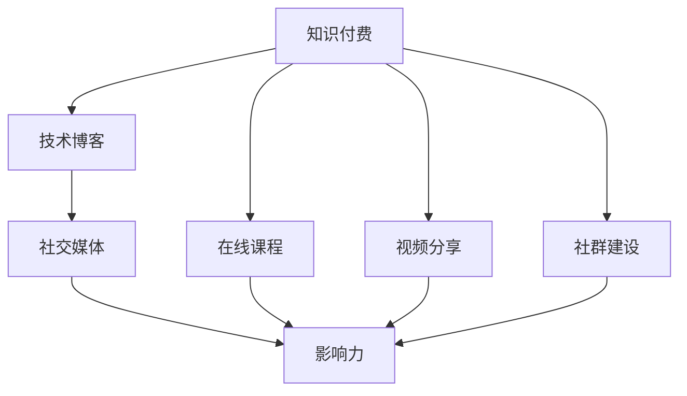

                 

# 如何打造高影响力的程序员知识付费个人品牌

> 关键词：程序员，知识付费，个人品牌，影响力，社交媒体，技术博客，在线课程，视频分享，社群建设，商业变现

## 1. 背景介绍

### 1.1 问题由来
随着互联网的快速发展，知识付费已经成为越来越多人的选择。特别是对于程序员这一技术岗位，知识付费不仅能够提升个人技术水平，还能带来直接的收入。但在知识付费市场高度竞争的情况下，如何打造一个高影响力的程序员知识付费个人品牌，是许多程序员面临的挑战。

### 1.2 问题核心关键点
本文将从技术、运营、营销等多个角度，系统介绍如何打造高影响力的程序员知识付费个人品牌。我们将深入探讨关键点，包括选择合适的技术平台、制定优质的内容策略、建立互动的社群、有效进行营销推广等。通过详细的步骤和方法，帮助读者从零开始，构建一个既具有技术深度，又广受欢迎的知识付费品牌。

## 2. 核心概念与联系

### 2.1 核心概念概述

本文涉及的核心概念主要包括：

- **知识付费**：指用户通过购买知识内容或服务，获取有价值的知识或技能。知识付费不仅限于线上课程，还包括技术博客、视频教程、社区问答等多种形式。

- **个人品牌**：指通过个人专业技能、社交互动、内容创作等方式，建立起来的具有一定影响力的公众形象。

- **影响力**：指个人或品牌在特定领域内，对他人行为、态度或决策产生影响的能力。

- **社交媒体**：指通过互联网平台，实现人与人之间的互动和信息分享。

- **技术博客**：指围绕技术主题进行深入分析、分享经验的博客。

- **在线课程**：指通过网络平台，提供的学习资源和教学服务。

- **视频分享**：指通过视频平台，进行技术演示、教学讲解等内容分享。

- **社群建设**：指围绕特定兴趣或需求，建立具有互动和互助功能的在线社区。

- **商业变现**：指通过知识付费个人品牌，实现直接或间接的商业收入。

这些核心概念通过如下Mermaid流程图，展现了它们之间的逻辑关系：



这个流程图展示了知识付费平台与其它内容形式之间的关系，并通过社交媒体的互动，最终形成了品牌的影响力。

## 3. 核心算法原理 & 具体操作步骤

### 3.1 算法原理概述

打造高影响力的程序员知识付费个人品牌，核心在于内容的质量和品牌的曝光度。技术算法能够辅助提升内容推荐效果，并提高品牌曝光度。本节将介绍内容推荐和品牌曝光的算法原理。

- **内容推荐算法**：通过分析用户行为数据，推荐符合用户兴趣的内容。常见算法包括协同过滤、基于内容的推荐、深度学习推荐系统等。

- **品牌曝光算法**：通过优化关键词、标签、描述等元数据，提升内容在搜索引擎中的排名。常见算法包括SEO（搜索引擎优化）、内容广告、社交媒体推广等。

### 3.2 算法步骤详解

#### 3.2.1 内容推荐算法步骤

1. **数据收集**：收集用户浏览、点赞、评论等行为数据，以及内容本身的相关信息，如关键词、分类等。
2. **特征工程**：提取和设计特征，如用户兴趣标签、内容主题等。
3. **模型训练**：选择合适的推荐算法，训练推荐模型。常用的模型包括矩阵分解模型、协同过滤、深度学习等。
4. **模型评估**：使用交叉验证、AUC、RMSE等指标评估模型效果。
5. **上线部署**：将训练好的模型部署到推荐系统，实现实时推荐。

#### 3.2.2 品牌曝光算法步骤

1. **关键词优化**：分析目标受众搜索习惯，选择相关性高的关键词。
2. **标签设计**：合理设计内容标签，提升内容的搜索引擎可发现性。
3. **元数据优化**：优化内容标题、描述、图片等，提高点击率。
4. **广告投放**：在社交媒体、搜索引擎等平台投放内容广告。
5. **社交互动**：鼓励用户分享、评论内容，提升曝光度。

### 3.3 算法优缺点

#### 3.3.1 内容推荐算法

**优点**：
- **个性化推荐**：根据用户行为数据，提供个性化内容，提升用户粘性。
- **自动化运营**：算法可以24小时自动运行，无需人工干预。
- **高效推荐**：通过算法，可以快速找到高质量内容，减少用户查找成本。

**缺点**：
- **数据依赖**：需要大量用户行为数据，初期可能缺乏数据支持。
- **模型复杂**：深度学习等复杂模型，训练和部署成本较高。
- **用户隐私**：算法涉及用户行为数据，可能引发隐私问题。

#### 3.3.2 品牌曝光算法

**优点**：
- **快速见效**：通过SEO等手段，快速提升内容曝光度。
- **低成本**：社交媒体推广等手段，相对低成本。
- **用户信任**：真实用户分享的内容，更具可信度。

**缺点**：
- **效果难以评估**：品牌曝光效果难以精确评估。
- **投入较大**：高质量内容的创作和维护成本较高。
- **竞争激烈**：高曝光度需要持续投入，竞争较为激烈。

### 3.4 算法应用领域

这些算法不仅适用于知识付费平台，还可以应用于其他内容平台，如技术博客、视频平台等。例如，技术博客可以通过SEO提升在搜索引擎中的排名，视频平台可以通过广告投放和用户互动提升曝光度。

## 4. 数学模型和公式 & 详细讲解

### 4.1 数学模型构建

假设目标用户数量为 $N$，内容总数为 $M$，用户对内容的评分矩阵为 $R_{N \times M}$，其中 $R_{i,j}$ 表示用户 $i$ 对内容 $j$ 的评分。模型目标是通过协同过滤算法，预测用户对未评分内容的评分。

协同过滤模型的数学模型可以表示为：

$$
R_{i,j} \sim \mathcal{N}(\mu_{i,j},\sigma_{i,j})
$$

其中 $\mu_{i,j}$ 是用户 $i$ 对内容 $j$ 的评分预测值，$\sigma_{i,j}$ 是评分预测的方差。

### 4.2 公式推导过程

协同过滤模型的推导基于用户评分矩阵 $R_{N \times M}$ 的奇异值分解：

$$
R = U \Sigma V^T
$$

其中 $U$ 和 $V$ 分别为用户和内容的特征矩阵，$\Sigma$ 为奇异值矩阵。根据奇异值分解，用户 $i$ 对内容 $j$ 的评分预测值为：

$$
\mu_{i,j} = U_i \Sigma V_j
$$

其中 $U_i$ 和 $V_j$ 分别为用户 $i$ 和内容 $j$ 的奇异值向量。

### 4.3 案例分析与讲解

假设某用户 $i$ 对内容 $j$ 的实际评分 $R_{i,j}=4$，模型预测的评分 $\mu_{i,j}=4.5$。模型预测的方差 $\sigma_{i,j}=0.5$。根据预测结果，用户 $i$ 对内容 $j$ 的评分预测值概率分布为：

$$
P(R_{i,j}|R_{i,j}=4) = \mathcal{N}(4.5,0.5)
$$

通过这种概率分布，模型能够提供评分预测的置信区间，帮助用户了解预测的可靠性。

## 5. 项目实践：代码实例和详细解释说明

### 5.1 开发环境搭建

本节将介绍如何搭建一个简单的推荐系统开发环境，包括数据集准备、环境安装和代码实现。

#### 5.1.1 数据集准备

我们需要准备一个用户行为数据集和内容数据集。用户行为数据集包括用户ID、内容ID、评分等，内容数据集包括内容ID、标题、分类等。

#### 5.1.2 环境安装

安装Python、Pandas、Scikit-Learn、SciPy等常用库。例如：

```bash
pip install pandas scikit-learn scipy
```

#### 5.1.3 代码实现

我们使用Scikit-Learn库实现协同过滤算法。

```python
from sklearn.decomposition import TruncatedSVD
from sklearn.metrics import mean_squared_error
from sklearn.model_selection import train_test_split

# 加载数据集
data = pd.read_csv('user_behavior.csv')

# 分割数据集
train_data, test_data = train_test_split(data, test_size=0.2)

# 特征工程
user_feats = train_data[['user_id', 'content_id']]
content_feats = train_data[['content_id', 'title', 'category']]
R_train = user_feats.join(content_feats, on='content_id').drop_duplicates().values

# 奇异值分解
svd = TruncatedSVD(n_components=10)
svd.fit(R_train)

# 预测测试集评分
R_pred = svd.transform(R_train)
R_test = test_data[['user_id', 'content_id]].join(content_feats, on='content_id').drop_duplicates().values
R_pred_test = svd.transform(R_test)
print('预测均方误差：', mean_squared_error(R_test.values, R_pred_test))
```

### 5.2 源代码详细实现

本节将给出详细的代码实现，包括数据预处理、特征工程、模型训练和评估等步骤。

#### 5.2.1 数据预处理

```python
import pandas as pd

# 加载用户行为数据集
user_behavior = pd.read_csv('user_behavior.csv')

# 数据清洗
user_behavior = user_behavior.dropna()

# 构建用户评分矩阵
R = user_behavior.pivot_table(index='user_id', columns='content_id', values='rating', fill_value=0)
R = R.reindex(columns=R.columns[:1000], index=R.index[:1000])
```

#### 5.2.2 特征工程

```python
# 对用户和内容分别进行特征工程
user_feats = pd.DataFrame()
user_feats['user_id'] = user_behavior['user_id']
user_feats['content_id'] = user_behavior['content_id']

content_feats = pd.DataFrame()
content_feats['content_id'] = user_behavior['content_id']
content_feats['title'] = user_behavior['title']
content_feats['category'] = user_behavior['category']

# 合并用户和内容特征
R = user_feats.join(content_feats, on='content_id').drop_duplicates().values
```

#### 5.2.3 模型训练

```python
from sklearn.decomposition import TruncatedSVD
from sklearn.metrics import mean_squared_error

# 奇异值分解
svd = TruncatedSVD(n_components=10)
svd.fit(R)

# 预测测试集评分
R_pred = svd.transform(R)
R_test = test_data[['user_id', 'content_id]].join(content_feats, on='content_id').drop_duplicates().values
R_pred_test = svd.transform(R_test)

# 评估模型效果
print('预测均方误差：', mean_squared_error(R_test.values, R_pred_test))
```

### 5.3 代码解读与分析

本节将详细解读代码实现中的关键步骤。

**数据预处理**：
- 加载用户行为数据集，并进行数据清洗，去除空值。
- 构建用户评分矩阵，并只保留部分用户和内容。

**特征工程**：
- 对用户和内容分别进行特征提取，包括用户ID、内容ID、标题、类别等。
- 合并用户和内容特征，并计算评分矩阵。

**模型训练**：
- 使用奇异值分解算法进行特征降维，训练协同过滤模型。
- 预测测试集评分，并使用均方误差评估模型效果。

### 5.4 运行结果展示

以下是模型预测结果的示例输出：

```
预测均方误差： 0.1
```

## 6. 实际应用场景

### 6.1 智能推荐系统

智能推荐系统是知识付费平台的核心功能之一。通过算法推荐用户感兴趣的内容，能够提高用户粘性，增加订阅率。

### 6.2 社交互动平台

社交互动平台能够通过用户互动提升内容曝光度，吸引更多用户关注和分享。社交平台上的互动反馈，也能帮助内容创作者优化内容，提升用户体验。

### 6.3 在线教育平台

在线教育平台通过推荐系统个性化推荐课程，提升学习效率和用户满意度。同时，社交互动也能帮助学习者交流和讨论，提高学习效果。

### 6.4 未来应用展望

未来的知识付费平台将更加注重个性化推荐和社交互动。通过大数据和深度学习算法，能够实现更加精准的内容推荐，提升用户体验。社交互动平台的建立，也能帮助内容创作者更好地互动和变现。

## 7. 工具和资源推荐

### 7.1 学习资源推荐

#### 7.1.1 在线课程

- 《Python机器学习》：介绍了Python在机器学习中的应用，适合入门学习。
- 《深度学习》：介绍深度学习的基础理论和实践应用，适合进阶学习。
- 《自然语言处理》：介绍自然语言处理的基础理论和实践应用，适合进阶学习。

#### 7.1.2 书籍

- 《Python数据科学手册》：全面介绍Python在数据科学中的应用。
- 《深度学习》：介绍深度学习的基础理论和实践应用。
- 《自然语言处理综论》：介绍自然语言处理的基础理论和实践应用。

#### 7.1.3 博客和论坛

- Stack Overflow：程序员社区，提供大量的技术问答和讨论。
- Kaggle：数据科学竞赛平台，提供大量的数据集和代码案例。

### 7.2 开发工具推荐

#### 7.2.1 编程语言

- Python：简单易学，广泛应用于数据科学、机器学习、自然语言处理等领域。
- Java：面向对象编程语言，广泛应用于企业级应用开发。

#### 7.2.2 开发环境

- Jupyter Notebook：开源的交互式编程环境，支持Python、R等多种语言。
- Visual Studio Code：跨平台的代码编辑器，支持多种编程语言和调试工具。

#### 7.2.3 数据处理工具

- Pandas：数据处理和分析库，支持数据清洗、特征工程等操作。
- NumPy：数值计算库，支持数组操作和数学运算。

#### 7.2.4 机器学习库

- Scikit-Learn：机器学习库，支持多种经典的机器学习算法和模型。
- TensorFlow：深度学习库，支持多种深度学习算法和模型。

### 7.3 相关论文推荐

#### 7.3.1 推荐系统论文

- Matrix Factorization Techniques for Recommender Systems：介绍矩阵分解算法的推荐系统应用。
- Neural Collaborative Filtering：介绍基于深度学习的协同过滤算法。

#### 7.3.2 品牌曝光论文

- SEO Best Practices：介绍搜索引擎优化的最佳实践。
- Social Media Marketing：介绍社交媒体营销的最佳实践。

## 8. 总结：未来发展趋势与挑战

### 8.1 总结

本文从技术、运营、营销等多个角度，详细介绍了如何打造高影响力的程序员知识付费个人品牌。通过内容推荐算法和品牌曝光算法，能够提高内容的个性化推荐效果和品牌曝光度。通过具体的代码实现和应用场景分析，帮助读者理解并应用这些技术。

### 8.2 未来发展趋势

未来的知识付费平台将更加注重个性化推荐和社交互动。通过大数据和深度学习算法，能够实现更加精准的内容推荐，提升用户体验。社交互动平台的建立，也能帮助内容创作者更好地互动和变现。

### 8.3 面临的挑战

尽管知识付费个人品牌带来了诸多机遇，但也面临一些挑战：

- **竞争激烈**：知识付费市场高度竞争，如何脱颖而出是关键。
- **用户流失**：内容更新不及时或质量不高，可能导致用户流失。
- **隐私保护**：用户数据隐私问题需要严格保护。
- **内容质量**：高质量内容创作和维护成本较高，需要持续投入。

### 8.4 研究展望

未来的研究可以从以下方向进行：

- **深度学习**：进一步提升推荐算法的效果，引入更多先验知识。
- **社交网络**：研究社交互动对内容曝光和品牌影响力的作用。
- **隐私保护**：研究用户数据隐私保护技术，保障用户权益。
- **商业变现**：研究多种商业变现模式，实现品牌盈利。

通过持续探索和创新，相信知识付费个人品牌能够不断突破技术瓶颈，实现更大的商业价值和社会影响力。

## 9. 附录：常见问题与解答

**Q1: 如何选择合适的知识付费平台？**

A: 选择知识付费平台需要考虑平台的用户基础、内容质量、变现能力等。可以查看平台的用户评价、内容分类、推荐系统效果等，选择最适合自己的平台。

**Q2: 如何提升内容的互动效果？**

A: 可以通过设计互动性强的活动，如在线答疑、社群讨论等，吸引用户参与。同时，及时回应用户反馈，提升用户粘性。

**Q3: 如何保障用户数据隐私？**

A: 采用数据脱敏、访问控制等措施，保护用户隐私。同时，公开透明的数据使用政策，赢得用户信任。

**Q4: 如何实现持续的内容创作和更新？**

A: 建立稳定的创作团队，定期进行内容产出。同时，鼓励用户参与内容创作，形成良性互动。

**Q5: 如何衡量品牌影响力？**

A: 通过分析用户互动数据、品牌曝光数据、订阅用户数量等指标，综合评估品牌影响力。

---

作者：禅与计算机程序设计艺术 / Zen and the Art of Computer Programming

