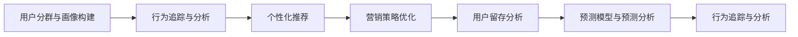

                 

# 如何进行有效的用户生命周期管理

> 关键词：用户生命周期管理(UCLM)、客户关系管理(CRM)、数据分析、个性化推荐、营销策略、转化率优化(CRO)、行为追踪、用户留存、用户细分、情感分析、数据可视化、预测模型

## 1. 背景介绍

### 1.1 问题由来

随着互联网的普及和电子商务的快速发展，越来越多的企业开始重视在线用户的生命周期管理，以期通过精准化的运营策略，提升用户转化率、留存率和消费价值。然而，用户生命周期管理涉及多个复杂环节，如用户分群、行为分析、个性化推荐、营销策略等，使得许多企业在实际操作中面临诸多挑战。因此，本文将详细阐述用户生命周期管理的核心概念、算法原理和实践技巧，帮助企业构建高效的用户生命周期管理系统。

### 1.2 问题核心关键点

进行有效的用户生命周期管理，核心在于以下几个关键点：

- **用户分群与画像构建**：基于用户的行为、属性、消费习惯等维度，将用户进行合理分群，构建详细的用户画像。
- **行为追踪与分析**：利用数据追踪技术，收集用户的浏览、购买、互动等行为数据，分析用户行为特征。
- **个性化推荐**：根据用户画像和行为特征，进行个性化商品或内容推荐，提升用户体验。
- **营销策略与优化**：根据用户行为数据，优化营销策略，提升转化率和用户留存。
- **预测模型与预测分析**：构建预测模型，预测用户流失概率、消费行为等，为决策提供数据支持。

### 1.3 问题研究意义

用户生命周期管理对于提升企业市场竞争力和用户满意度具有重要意义：

1. **提升转化率和用户留存率**：通过精准的个性化推荐和有效的营销策略，显著提升新用户转化率和老用户留存率，降低用户流失。
2. **优化用户体验**：个性化推荐和营销策略的精细化调整，使每位用户都能获得最佳的用户体验。
3. **提高运营效率**：数据驱动的用户生命周期管理，可帮助企业优化资源配置，提高运营效率。
4. **增强决策能力**：基于预测模型的数据分析，帮助企业进行精准决策，提升市场响应速度。
5. **推动业务增长**：通过精准的用户运营策略，促进企业业务增长，提升企业品牌影响力。

## 2. 核心概念与联系

### 2.1 核心概念概述

- **用户生命周期管理 (UCLM)**：指从潜在客户到忠实客户的全生命周期管理，包括客户获取、转化、流失等多个环节，通过数据驱动，实现精准运营。
- **客户关系管理 (CRM)**：指通过技术手段，管理客户信息、交互记录等数据，提升客户体验，提高客户满意度。
- **个性化推荐**：指根据用户行为、偏好，提供个性化的商品或内容推荐，提升用户粘性和满意度。
- **营销策略优化**：指基于用户行为数据，调整优化营销策略，提高广告效果和转化率。
- **用户留存分析**：指通过分析用户行为，识别流失风险，采取措施提升用户留存。
- **行为追踪与分析**：指利用数据追踪技术，收集和分析用户行为数据，为运营决策提供依据。
- **预测模型与预测分析**：指构建预测模型，预测用户行为、流失概率等，为运营策略提供数据支撑。

这些核心概念之间的关系可以通过以下Mermaid流程图来展示：



### 2.2 核心概念原理和架构

用户生命周期管理涉及多个环节，核心在于通过数据驱动，实现精准的运营策略。以下是用户生命周期管理的基本原理和架构：

**1. 用户分群与画像构建**

用户分群与画像构建是用户生命周期管理的第一步，旨在基于用户的多维度特征，将用户进行合理分群，构建详细的用户画像。主要分为以下几步：

1. **数据收集**：收集用户的属性、行为、购买记录等数据，包括基本信息、消费偏好、购买记录等。
2. **特征提取**：从收集的数据中提取关键特征，如年龄、性别、地域、消费金额、购买频率等。
3. **聚类分析**：采用聚类算法（如K-Means、层次聚类等）将用户进行分群，形成不同特征的用户群体。
4. **画像构建**：根据聚类结果，构建详细用户画像，描述不同群体的特征。

**2. 行为追踪与分析**

行为追踪与分析是用户生命周期管理的核心环节，通过追踪用户行为数据，分析用户行为特征，为个性化推荐和营销策略优化提供依据。主要分为以下几步：

1. **追踪技术**：利用浏览器Cookie、页面访问日志、点击流日志等技术，追踪用户行为数据。
2. **数据清洗**：对收集到的行为数据进行清洗和预处理，去除无效数据和噪声。
3. **行为分析**：采用数据分析技术（如TF-IDF、LDA、关联规则等）分析用户行为特征，识别用户兴趣点。
4. **数据可视化**：利用数据可视化工具（如Tableau、Power BI等）展示用户行为特征，便于直观分析。

**3. 个性化推荐**

个性化推荐是用户生命周期管理的重要组成部分，通过精准推荐，提升用户满意度和消费价值。主要分为以下几步：

1. **推荐算法**：采用推荐算法（如协同过滤、基于内容的推荐、深度学习推荐等），生成个性化推荐结果。
2. **A/B测试**：对推荐结果进行A/B测试，评估推荐效果，优化推荐策略。
3. **推荐系统优化**：根据用户反馈和行为数据，不断优化推荐系统，提升推荐精度和效果。

**4. 营销策略优化**

营销策略优化是用户生命周期管理的重要环节，通过优化营销策略，提升广告效果和转化率。主要分为以下几步：

1. **营销渠道选择**：选择适合的营销渠道（如搜索引擎广告、社交媒体广告、邮件营销等），进行精准投放。
2. **广告效果评估**：利用数据分析技术评估广告效果，如点击率、转化率、ROI等指标。
3. **策略调整**：根据广告效果，调整优化广告策略，提升广告效果。

**5. 用户留存分析**

用户留存分析是用户生命周期管理的核心环节，通过分析用户行为，识别流失风险，采取措施提升用户留存。主要分为以下几步：

1. **流失用户识别**：利用数据分析技术（如回归分析、分类算法等）识别流失用户，分析流失原因。
2. **留存策略制定**：根据流失原因，制定相应的留存策略，如发送关怀邮件、提供专属优惠等。
3. **效果评估**：评估留存策略效果，调整优化策略。

**6. 预测模型与预测分析**

预测模型与预测分析是用户生命周期管理的高级环节，通过构建预测模型，预测用户行为、流失概率等，为运营策略提供数据支撑。主要分为以下几步：

1. **数据准备**：准备用户行为数据、属性数据等，进行特征工程。
2. **模型构建**：采用机器学习算法（如线性回归、决策树、随机森林、神经网络等）构建预测模型。
3. **模型评估**：评估预测模型效果，如准确率、召回率、F1-score等指标。
4. **预测应用**：将预测模型应用于实际运营中，如用户流失预警、推荐系统优化等。

通过以上步骤，可以构建完整的用户生命周期管理系统，实现精准化的用户运营策略。

## 3. 核心算法原理 & 具体操作步骤

### 3.1 算法原理概述

用户生命周期管理涉及多个复杂算法，核心在于数据驱动的精准运营策略。以下将详细介绍核心算法的原理和操作步骤：

**1. 聚类算法**

聚类算法是用户分群与画像构建的核心算法，通过将用户聚类，形成不同特征的用户群体。主要算法包括K-Means、层次聚类等。

K-Means算法的基本步骤如下：

1. 随机初始化聚类中心。
2. 计算每个数据点到聚类中心的距离，将数据点分配到最近的聚类中心。
3. 计算聚类中心的平均值，更新聚类中心。
4. 重复步骤2和3，直到聚类中心不再变化。

层次聚类算法的基本步骤如下：

1. 将每个数据点看作一个聚类。
2. 不断合并距离最近的聚类，形成新的聚类。
3. 重复步骤2，直到所有数据点都在一个聚类中。

**2. 推荐算法**

推荐算法是个性化推荐的核心算法，通过精准推荐，提升用户满意度和消费价值。主要算法包括协同过滤、基于内容的推荐、深度学习推荐等。

协同过滤算法的基本步骤如下：

1. 收集用户行为数据，如浏览记录、购买记录等。
2. 计算用户之间的相似度。
3. 根据相似度推荐商品或内容。

基于内容的推荐算法的基本步骤如下：

1. 收集商品或内容的特征数据。
2. 计算用户行为与商品特征的相似度。
3. 根据相似度推荐商品或内容。

深度学习推荐算法的基本步骤如下：

1. 收集用户行为数据、商品特征等数据。
2. 构建神经网络模型，如RNN、CNN等。
3. 训练模型，生成推荐结果。

**3. 预测模型**

预测模型是用户留存分析的核心算法，通过预测用户行为、流失概率等，为运营策略提供数据支撑。主要算法包括回归模型、分类模型、神经网络模型等。

回归模型（如线性回归、岭回归、Lasso回归等）的基本步骤如下：

1. 收集用户行为数据、属性数据等，进行特征工程。
2. 构建回归模型。
3. 训练模型，进行预测。

分类模型（如逻辑回归、决策树、随机森林等）的基本步骤如下：

1. 收集用户行为数据、属性数据等，进行特征工程。
2. 构建分类模型。
3. 训练模型，进行预测。

神经网络模型（如MLP、CNN、RNN等）的基本步骤如下：

1. 收集用户行为数据、属性数据等，进行特征工程。
2. 构建神经网络模型。
3. 训练模型，进行预测。

### 3.2 算法步骤详解

**用户分群与画像构建**

1. **数据收集**
   - 使用API接口，从电商平台收集用户基本信息、消费偏好、购买记录等数据。
   - 利用数据抽取工具，从社交媒体、论坛等渠道收集用户行为数据。

2. **特征提取**
   - 提取用户基本信息（如年龄、性别、地域等）、消费偏好（如喜欢的商品类型、品牌等）、购买记录（如消费金额、购买频率等）等关键特征。

3. **聚类分析**
   - 使用K-Means算法，将用户分为不同特征群体。
   - 根据聚类结果，构建用户画像，描述不同群体的特征。

**行为追踪与分析**

1. **追踪技术**
   - 在用户访问页面时，记录点击流日志、浏览记录等数据。
   - 使用Cookie技术，追踪用户在不同时间段内的行为数据。

2. **数据清洗**
   - 对收集到的行为数据进行去重、去噪、格式转换等处理。
   - 利用数据清洗工具，如Pandas、NumPy等，进行数据预处理。

3. **行为分析**
   - 使用TF-IDF算法，分析用户的浏览记录，提取关键词。
   - 使用LDA算法，分析用户的浏览行为，识别主题。
   - 使用关联规则算法，发现用户行为之间的关联关系。

4. **数据可视化**
   - 使用Tableau、Power BI等工具，构建用户行为分析报表。
   - 展示用户行为特征，如浏览行为、购买行为等，便于直观分析。

**个性化推荐**

1. **推荐算法**
   - 使用协同过滤算法，生成个性化推荐结果。
   - 使用基于内容的推荐算法，生成个性化推荐结果。
   - 使用深度学习推荐算法，生成个性化推荐结果。

2. **A/B测试**
   - 将推荐结果分成多个测试组，进行A/B测试。
   - 评估推荐效果，如点击率、转化率等指标。
   - 根据测试结果，优化推荐算法和策略。

3. **推荐系统优化**
   - 根据用户反馈，优化推荐系统。
   - 利用在线学习技术，实时更新推荐结果。

**营销策略优化**

1. **营销渠道选择**
   - 根据用户行为数据，选择适合的营销渠道。
   - 设置广告预算，进行精准投放。

2. **广告效果评估**
   - 收集广告数据，如点击率、转化率、ROI等指标。
   - 利用数据分析技术，评估广告效果。

3. **策略调整**
   - 根据广告效果，调整优化广告策略。
   - 利用机器学习算法，自动生成广告投放方案。

**用户留存分析**

1. **流失用户识别**
   - 使用回归模型，预测用户流失概率。
   - 使用分类模型，预测用户流失风险。
   - 使用神经网络模型，预测用户流失概率。

2. **留存策略制定**
   - 根据流失原因，制定相应的留存策略。
   - 发送关怀邮件、提供专属优惠等。

3. **效果评估**
   - 收集用户反馈，评估留存策略效果。
   - 调整优化策略，提升用户留存率。

**预测模型与预测分析**

1. **数据准备**
   - 准备用户行为数据、属性数据等，进行特征工程。
   - 使用数据抽取工具，如Apache NiFi、ETL工具等，进行数据准备。

2. **模型构建**
   - 构建回归模型，如线性回归、岭回归等。
   - 构建分类模型，如逻辑回归、决策树等。
   - 构建神经网络模型，如MLP、CNN等。

3. **模型评估**
   - 评估预测模型效果，如准确率、召回率、F1-score等指标。
   - 使用交叉验证技术，评估模型泛化能力。

4. **预测应用**
   - 将预测模型应用于实际运营中，如用户流失预警、推荐系统优化等。
   - 实时更新预测模型，提升预测精度。

### 3.3 算法优缺点

用户生命周期管理涉及多个复杂算法，各有其优缺点：

**聚类算法**

- **优点**：能够将用户分成不同特征群体，便于精细化运营。
- **缺点**：对数据质量和特征提取要求较高，容易过拟合。

**推荐算法**

- **优点**：能够生成个性化推荐结果，提升用户满意度。
- **缺点**：需要大量数据支持，算法复杂度较高。

**预测模型**

- **优点**：能够预测用户行为、流失概率等，为运营策略提供数据支撑。
- **缺点**：模型构建复杂，需要大量数据和计算资源。

### 3.4 算法应用领域

用户生命周期管理涉及多个复杂算法，主要应用于以下几个领域：

1. **电商行业**：利用用户分群与画像构建、个性化推荐等算法，提升用户转化率和购物体验。
2. **金融行业**：利用用户分群与画像构建、个性化推荐等算法，提升用户体验和交易成功率。
3. **媒体行业**：利用用户分群与画像构建、个性化推荐等算法，提升用户粘性和广告效果。
4. **社交网络**：利用用户分群与画像构建、个性化推荐等算法，提升用户活跃度和留存率。
5. **旅游行业**：利用用户分群与画像构建、个性化推荐等算法，提升用户消费体验和预订成功率。

## 4. 数学模型和公式 & 详细讲解 & 举例说明

### 4.1 数学模型构建

用户生命周期管理涉及多个复杂数学模型，主要包括以下几个方面：

**1. 聚类模型**

K-Means算法的数学模型如下：

$$
\min_{K, \mu} \sum_{k=1}^K \sum_{x \in C_k} ||x - \mu_k||^2
$$

其中，K为聚类数，$\mu_k$为第k个聚类中心，$C_k$为第k个聚类。

**2. 推荐模型**

协同过滤算法的数学模型如下：

$$
R(u, i) = \sum_{v \in N(u)} \frac{A(u, v) \cdot I(i \in N(v))}{\sqrt{\hat{A}(u, v) \cdot \hat{A}(v, v)}}
$$

其中，$A$为用户-项目评分矩阵，$N(u)$为与用户u共同评分项目集合，$I$为指示函数，$\hat{A}$为归一化评分矩阵。

基于内容的推荐模型的数学模型如下：

$$
R(u, i) = \sum_{k=1}^K \alpha_k \cdot \langle p(u), c_i \rangle_k
$$

其中，$p(u)$为用户特征向量，$c_i$为项目特征向量，$\alpha_k$为特征权重。

深度学习推荐模型的数学模型如下：

$$
R(u, i) = \sum_{k=1}^K w_k \cdot \langle h_u, c_i \rangle_k
$$

其中，$h_u$为用户嵌入向量，$c_i$为项目嵌入向量，$w_k$为层权重。

**3. 预测模型**

回归模型的数学模型如下：

$$
y = \sum_{k=1}^K \beta_k \cdot X_k
$$

其中，$y$为预测值，$X_k$为第k个特征，$\beta_k$为回归系数。

分类模型的数学模型如下：

$$
P(y|X) = \frac{exp(\sum_{k=1}^K \beta_k \cdot X_k)}{\sum_{y} exp(\sum_{k=1}^K \beta_k \cdot X_k)}
$$

其中，$P(y|X)$为条件概率，$X$为输入特征。

神经网络模型的数学模型如下：

$$
h^{(l)} = g(\sum_{k=1}^K w_k \cdot h^{(l-1)} + b_k)
$$

其中，$h^{(l)}$为第l层隐藏状态，$g$为激活函数，$w_k$为权重，$b_k$为偏置。

### 4.2 公式推导过程

**聚类算法**

K-Means算法的推导过程如下：

1. 随机初始化聚类中心$\mu_k$。
2. 计算每个数据点$x$到聚类中心的距离，分配到最近的聚类中心$C_k$。
3. 计算聚类中心的平均值，更新聚类中心$\mu_k$。
4. 重复步骤2和3，直到聚类中心不再变化。

**推荐算法**

协同过滤算法的推导过程如下：

1. 收集用户行为数据，如浏览记录、购买记录等。
2. 计算用户之间的相似度$\sigma_{u, v}$。
3. 根据相似度推荐商品或内容$R(u, i)$。

基于内容的推荐算法的推导过程如下：

1. 收集商品或内容的特征数据。
2. 计算用户行为与商品特征的相似度$\sigma_{u, i}$。
3. 根据相似度推荐商品或内容$R(u, i)$。

深度学习推荐算法的推导过程如下：

1. 收集用户行为数据、商品特征等数据。
2. 构建神经网络模型，如RNN、CNN等。
3. 训练模型，生成推荐结果。

**预测模型**

回归模型的推导过程如下：

1. 收集用户行为数据、属性数据等，进行特征工程。
2. 构建回归模型$R(u, i)$。
3. 训练模型，进行预测。

分类模型的推导过程如下：

1. 收集用户行为数据、属性数据等，进行特征工程。
2. 构建分类模型$P(y|X)$。
3. 训练模型，进行预测。

神经网络模型的推导过程如下：

1. 收集用户行为数据、属性数据等，进行特征工程。
2. 构建神经网络模型$h^{(l)}$。
3. 训练模型，进行预测。

### 4.3 案例分析与讲解

**案例1：电商平台用户生命周期管理**

某电商平台通过用户生命周期管理，提升用户转化率和留存率。具体步骤如下：

1. **数据收集**：收集用户基本信息、消费偏好、购买记录等数据。
2. **特征提取**：提取用户基本信息（如年龄、性别、地域等）、消费偏好（如喜欢的商品类型、品牌等）、购买记录（如消费金额、购买频率等）等关键特征。
3. **聚类分析**：使用K-Means算法，将用户分为不同特征群体。
4. **个性化推荐**：使用基于内容的推荐算法，生成个性化推荐结果。
5. **营销策略优化**：根据用户行为数据，优化营销策略。
6. **用户留存分析**：使用回归模型，预测用户流失概率。

**案例2：在线教育平台用户生命周期管理**

某在线教育平台通过用户生命周期管理，提升用户活跃度和留存率。具体步骤如下：

1. **数据收集**：收集用户基本信息、学习行为数据等数据。
2. **特征提取**：提取用户基本信息（如年龄、性别、地域等）、学习行为（如学习时间、学习内容等）、学习效果（如考试成绩等）等关键特征。
3. **聚类分析**：使用层次聚类算法，将用户分为不同特征群体。
4. **个性化推荐**：使用协同过滤算法，生成个性化推荐内容。
5. **营销策略优化**：根据用户行为数据，优化营销策略。
6. **用户留存分析**：使用分类模型，预测用户流失风险。

## 5. 项目实践：代码实例和详细解释说明

### 5.1 开发环境搭建

在进行用户生命周期管理项目实践前，我们需要准备好开发环境。以下是使用Python进行PyTorch开发的环境配置流程：

1. 安装Anaconda：从官网下载并安装Anaconda，用于创建独立的Python环境。

2. 创建并激活虚拟环境：
```bash
conda create -n uclm-env python=3.8 
conda activate uclm-env
```

3. 安装PyTorch：根据CUDA版本，从官网获取对应的安装命令。例如：
```bash
conda install pytorch torchvision torchaudio cudatoolkit=11.1 -c pytorch -c conda-forge
```

4. 安装TensorFlow：从官网下载并安装TensorFlow，并配置环境变量。

5. 安装各类工具包：
```bash
pip install numpy pandas scikit-learn matplotlib tqdm jupyter notebook ipython
```

完成上述步骤后，即可在`uclm-env`环境中开始用户生命周期管理实践。

### 5.2 源代码详细实现

这里我们以用户分群与画像构建为例，给出使用Python进行用户分群和聚类分析的代码实现。

首先，定义用户基本信息数据：

```python
import pandas as pd
import numpy as np

# 用户基本信息数据
user_data = pd.read_csv('user_data.csv')

# 特征工程
features = ['age', 'gender', 'location', 'purchase_frequency', 'purchase_amount']
user_data = user_data[features]
```

然后，定义K-Means算法：

```python
from sklearn.cluster import KMeans

# 聚类分析
kmeans = KMeans(n_clusters=5, random_state=0).fit(user_data)

# 用户画像
user_profiles = pd.DataFrame({'cluster': kmeans.labels_, 'age': user_data['age'], 'gender': user_data['gender'], 'location': user_data['location'], 'purchase_frequency': user_data['purchase_frequency'], 'purchase_amount': user_data['purchase_amount']})
user_profiles.to_csv('user_profiles.csv', index=False)
```

最后，可视化用户画像：

```python
import seaborn as sns
import matplotlib.pyplot as plt

# 可视化用户画像
plt.figure(figsize=(10, 5))
sns.barplot(x='cluster', y='purchase_amount', data=user_profiles)
plt.title('User Purchase Amount by Cluster')
plt.xlabel('Cluster')
plt.ylabel('Purchase Amount')
plt.show()
```

以上就是使用Python进行用户分群与画像构建的完整代码实现。可以看到，通过简单的代码实现，就能完成用户分群与画像构建，为后续的个性化推荐和营销策略优化提供基础数据支持。

### 5.3 代码解读与分析

让我们再详细解读一下关键代码的实现细节：

**用户基本信息数据**

1. **数据收集**：使用`pandas`库，从CSV文件中读取用户基本信息数据。
2. **特征提取**：提取用户基本信息（如年龄、性别、地域等）、消费偏好（如喜欢的商品类型、品牌等）、购买记录（如消费金额、购买频率等）等关键特征。

**K-Means算法**

1. **模型初始化**：使用`KMeans`类，设置聚类数和随机种子。
2. **聚类分析**：对用户基本信息数据进行聚类分析，生成聚类结果。
3. **用户画像**：将聚类结果与用户基本信息数据合并，生成用户画像。

**可视化**

1. **可视化工具**：使用`seaborn`库，绘制条形图。
2. **数据展示**：展示不同聚类群体的平均购买金额，直观展示聚类效果。

通过以上代码，实现了用户分群与画像构建的全流程操作，为后续的个性化推荐和营销策略优化提供数据基础。

## 6. 实际应用场景

### 6.1 智能推荐系统

智能推荐系统是用户生命周期管理的重要应用场景，通过精准推荐，提升用户满意度和消费价值。

某电商平台通过用户生命周期管理，提升用户转化率和购物体验。具体步骤如下：

1. **数据收集**：收集用户浏览记录、购买记录等数据。
2. **特征提取**：提取用户行为特征，如浏览时长、浏览页面、购买频率等。
3. **聚类分析**：使用K-Means算法，将用户分为不同特征群体。
4. **个性化推荐**：使用协同过滤算法，生成个性化推荐结果。
5. **推荐系统优化**：根据用户反馈和行为数据，优化推荐系统。

**案例2：金融行业用户生命周期管理**

某金融平台通过用户生命周期管理，提升用户体验和交易成功率。具体步骤如下：

1. **数据收集**：收集用户基本信息、交易记录等数据。
2. **特征提取**：提取用户基本信息（如年龄、性别、地域等）、交易行为（如交易金额、交易频率等）等关键特征。
3. **聚类分析**：使用层次聚类算法，将用户分为不同特征群体。
4. **个性化推荐**：使用基于内容的推荐算法，生成个性化推荐内容。
5. **营销策略优化**：根据用户行为数据，优化营销策略。
6. **用户留存分析**：使用分类模型，预测用户流失风险。

### 6.2 智能营销

智能营销是用户生命周期管理的重要应用场景，通过精准营销策略，提升广告效果和转化率。

某电商公司通过用户生命周期管理，提升广告效果和转化率。具体步骤如下：

1. **数据收集**：收集用户浏览记录、购买记录等数据。
2. **特征提取**：提取用户行为特征，如浏览时长、浏览页面、购买频率等。
3. **聚类分析**：使用K-Means算法，将用户分为不同特征群体。
4. **个性化推荐**：使用协同过滤算法，生成个性化推荐结果。
5. **营销策略优化**：根据用户行为数据，优化营销策略。
6. **广告效果评估**：使用数据分析技术，评估广告效果。

### 6.3 在线教育平台

在线教育平台通过用户生命周期管理，提升用户活跃度和留存率。具体步骤如下：

1. **数据收集**：收集用户基本信息、学习行为数据等数据。
2. **特征提取**：提取用户基本信息（如年龄、性别、地域等）、学习行为（如学习时间、学习内容等）、学习效果（如考试成绩等）等关键特征。
3. **聚类分析**：使用层次聚类算法，将用户分为不同特征群体。
4. **个性化推荐**：使用协同过滤算法，生成个性化推荐内容。
5. **营销策略优化**：根据用户行为数据，优化营销策略。
6. **用户留存分析**：使用分类模型，预测用户流失风险。

### 6.4 未来应用展望

随着大数据和人工智能技术的不断进步，用户生命周期管理将进一步拓展应用场景，为各行各业带来深远影响：

1. **金融行业**：通过用户生命周期管理，提升用户体验和交易成功率，降低金融风险。
2. **电商行业**：通过用户生命周期管理，提升用户转化率和购物体验，提高运营效率。
3. **媒体行业**：通过用户生命周期管理，提升用户粘性和广告效果，增加广告收入。
4. **社交网络**：通过用户生命周期管理，提升用户活跃度和留存率，增加平台粘性。
5. **旅游行业**：通过用户生命周期管理，提升用户消费体验和预订成功率，增加旅游收入。

未来，用户生命周期管理将在更多领域得到应用，为各行各业带来变革性影响。相信随着技术的不断进步，用户生命周期管理将更加精准、高效、智能，为人类生产生活带来更多便捷和实惠。

## 7. 工具和资源推荐

### 7.1 学习资源推荐

为了帮助开发者系统掌握用户生命周期管理的核心技术和实践技巧，这里推荐一些优质的学习资源：

1. **《Python数据科学手册》**：介绍Python在数据科学中的应用，涵盖数据分析、机器学习、数据可视化等技术。
2. **《数据科学与机器学习》课程**：由Coursera提供的经典课程，涵盖数据科学、机器学习、深度学习等核心技术。
3. **Kaggle**：数据科学竞赛平台，提供丰富的数据集和案例，适合实战训练。
4. **Udacity**：提供高质量的数据科学和机器学习课程，适合进阶学习。
5. **GitHub**：开源代码平台，提供大量用户生命周期管理的代码实现和案例。

通过对这些资源的学习实践，相信你一定能够快速掌握用户生命周期管理的精髓，并用于解决实际的业务问题。

### 7.2 开发工具推荐

高效的工具支持对于用户生命周期管理的开发至关重要。以下是几款推荐的开发工具：

1. **PyTorch**：基于Python的深度学习框架，灵活动态的计算图，适合快速迭代研究。
2. **TensorFlow**：由Google主导开发的深度学习框架，生产部署方便，适合大规模工程应用。
3. **Scikit-learn**：基于Python的机器学习库，包含多种经典算法和工具。
4. **Jupyter Notebook**：交互式编程环境，支持Python、R、MATLAB等多种语言。
5. **Tableau**：数据可视化工具，支持丰富的图表和报表，便于数据展示。
6. **Power BI**：微软提供的数据可视化工具，支持数据集成和报表展示。

合理利用这些工具，可以显著提升用户生命周期管理的开发效率，加速创新迭代的步伐。

### 7.3 相关论文推荐

用户生命周期管理涉及多个复杂算法，相关的论文研究也在不断进步。以下是几篇奠基性的相关论文，推荐阅读：

1. **《数据挖掘与统计学习》**：介绍数据挖掘和统计学习的核心技术，涵盖分类、聚类、关联规则等算法。
2. **《Python数据科学库》**：介绍Python在数据科学中的应用，涵盖数据处理、机器学习、数据可视化等技术。
3. **《用户生命周期管理》论文**：系统阐述用户生命周期管理的核心概念、算法原理和实践技巧，是用户生命周期管理的经典文献。
4. **《深度学习推荐系统》论文**：介绍深度学习在推荐系统中的应用，涵盖协同过滤、基于内容的推荐、深度学习推荐等算法。

这些论文代表了大数据和人工智能领域的最新研究进展，通过学习这些前沿成果，可以帮助研究者把握学科前进方向，激发更多的创新灵感。

## 8. 总结：未来发展趋势与挑战

### 8.1 研究成果总结

用户生命周期管理涉及多个复杂算法，通过数据驱动，实现精准化的运营策略。主要研究方向包括：

1. **用户分群与画像构建**：基于用户的多维度特征，将用户进行合理分群，构建详细的用户画像。
2. **行为追踪与分析**：利用数据追踪技术，收集用户行为数据，分析用户行为特征。
3. **个性化推荐**：根据用户画像和行为特征，进行个性化商品或内容推荐，提升用户体验。
4. **营销策略优化**：基于用户行为数据，优化营销策略，提升广告效果和转化率。
5. **用户留存分析**：通过分析用户行为，识别流失风险，采取措施提升用户留存。
6. **预测模型与预测分析**：构建预测模型，预测用户行为、流失概率等，为运营策略提供数据支撑。

通过以上研究方向，用户生命周期管理在电商、金融、教育等多个领域取得了显著成效。未来，随着技术的不断进步，用户生命周期管理将更加精准、高效、智能，为各行各业带来深远影响。

### 8.2 未来发展趋势

展望未来，用户生命周期管理将呈现以下几个发展趋势：

1. **技术进步**：随着深度学习、机器学习、大数据等技术的不断进步，用户生命周期管理将更加精准、高效、智能。
2. **应用拓展**：用户生命周期管理将在更多领域得到应用，如金融、电商、教育、旅游等，带来深远影响。
3. **数据驱动**：数据驱动的用户生命周期管理将更加重要，通过大数据分析和机器学习技术，实现精准运营。
4. **多模态融合**：将符号化的先验知识与神经网络模型结合，提升用户生命周期管理的准确性和鲁棒性。
5. **实时化运营**：实时化运营将成为趋势，通过在线学习技术，实时更新推荐系统和营销策略。
6. **跨领域应用**：用户生命周期管理将在更多领域得到应用，提升各行业的运营效率和用户体验。

### 8.3 面临的挑战

尽管用户生命周期管理已经取得了显著成效，但仍面临以下挑战：

1. **数据质量问题**：用户生命周期管理需要大量高质量数据支持，但数据质量往往难以保证，影响算法的准确性。
2. **模型复杂性**：用户生命周期管理涉及多个复杂算法，模型构建和训练复杂，计算资源消耗较大。
3. **用户隐私问题**：用户生命周期管理需要收集大量用户数据，如何保护用户隐私成为重要问题。
4. **算法公平性**：用户生命周期管理算法需要避免算法偏见，确保算法公平性，避免歧视性输出。
5. **跨领域应用**：用户生命周期管理需要在不同领域推广应用，面临模型泛化性和跨领域适应性的挑战。

### 8.4 研究展望

未来，用户生命周期管理需要在以下方面进行进一步研究：

1. **无监督和半监督学习**：探索无监督和半监督学习范式，降低对标注数据的依赖，提高模型的泛化性和鲁棒性。
2. **参数高效和计算高效**：开发更加参数高效和计算高效的推荐算法，提升用户生命周期管理的效率。
3. **多模态融合**：将符号化的先验知识与神经网络模型结合，提升用户生命周期管理的准确性和鲁棒性。
4. **因果学习和博弈论**：引入因果推断和博弈论方法，增强用户生命周期管理的稳定性，规避脆弱点。
5. **可解释性和可控性**：提升用户生命周期管理的可解释性和可控性，增强系统的可信度和安全性。

通过这些研究方向，用户生命周期管理将更加精准、高效、智能，为人类生产生活带来更多便捷和实惠。面向未来，用户生命周期管理还需要与其他人工智能技术进行更深入的融合，如知识表示、因果推理、强化学习等，多路径协同发力，共同推动自然语言理解和智能交互系统的进步。只有勇于创新、敢于突破，才能不断拓展用户生命周期管理的边界，让智能技术更好地造福人类社会。

## 9. 附录：常见问题与解答

**Q1：用户生命周期管理需要哪些数据支持？**

A: 用户生命周期管理需要收集用户的基本信息、行为数据、交易数据等。具体包括：

1. **基本信息**：年龄、性别、地域、职业等。
2. **行为数据**：浏览记录、购买记录、点击流日志等。
3. **交易数据**：交易金额、交易频率、交易时间等。

这些数据可以通过API接口、网页数据抓取、第三方数据合作等方式获取。

**Q2：用户生命周期管理有哪些应用场景？**

A: 用户生命周期管理在电商、金融、媒体、社交网络、旅游等多个领域都有广泛应用，具体包括：

1. **电商行业**：提升用户转化率和购物体验，提高运营效率。
2. **金融行业**：提升用户体验和交易成功率，降低金融风险。
3. **媒体行业**：提升用户粘性和广告效果，增加广告收入。
4. **社交网络**：提升用户活跃度和留存率，增加平台粘性。
5. **旅游行业**：提升用户消费体验和预订成功率，增加旅游收入。

**Q3：用户生命周期管理的核心算法有哪些？**

A: 用户生命周期管理涉及多个复杂算法，主要包括以下几个方面：

1. **聚类算法**：如K-Means、层次聚类等。
2. **推荐算法**：如协同过滤、基于内容的推荐、深度学习推荐等。
3. **预测模型**：如回归模型、分类模型、神经网络模型等。

这些算法各有优缺点，需要根据具体场景选择合适算法。

**Q4：用户生命周期管理有哪些关键步骤？**

A: 用户生命周期管理主要包括以下关键步骤：

1. **数据收集**：收集用户基本信息、行为数据、交易数据等。
2. **特征提取**：提取用户基本信息、行为特征、交易特征等关键特征。
3. **聚类分析**：使用聚类算法，将用户分成不同特征群体。
4. **个性化推荐**：根据用户画像和行为特征，进行个性化推荐。
5. **营销策略优化**：根据用户行为数据，优化营销策略。
6. **用户留存分析**：通过分析用户行为，识别流失风险，采取措施提升用户留存。

通过以上步骤，可以构建完整的用户生命周期管理系统，实现精准化的用户运营策略。

**Q5：用户生命周期管理需要哪些工具支持？**

A: 用户生命周期管理需要多种工具支持，主要包括以下几个方面：

1. **Python**：基于Python的编程语言，适合快速迭代研究。
2. **PyTorch**：基于Python的深度学习框架，适合深度学习算法实现。
3. **TensorFlow**：由Google主导开发的深度学习框架，生产部署方便。
4. **Scikit-learn**：基于Python的机器学习库，涵盖多种经典算法。
5. **Jupyter Notebook**：交互式编程环境，支持Python、R、MATLAB等多种语言。
6. **Tableau**：数据可视化工具，支持丰富的图表和报表展示。
7. **Power BI**：微软提供的数据可视化工具，支持数据集成和报表展示。

通过这些工具，可以显著提升用户生命周期管理的开发效率，加速创新迭代的步伐。

**Q6：用户生命周期管理的未来发展趋势是什么？**

A: 用户生命周期管理未来将呈现以下几个发展趋势：

1. **技术进步**：随着深度学习、机器学习、大数据等技术的不断进步，用户生命周期管理将更加精准、高效、智能。
2. **应用拓展**：用户生命周期管理将在更多领域得到应用，如金融、电商、教育、旅游等，带来深远影响。
3. **数据驱动**：数据驱动的用户生命周期管理将更加重要，通过大数据分析和机器学习技术，实现精准运营。
4. **多模态融合**：将符号化的先验知识与神经网络模型结合，提升用户生命周期管理的准确性和鲁棒性。
5. **实时化运营**：实时化运营将成为趋势，通过在线学习技术，实时更新推荐系统和营销策略。
6. **跨领域应用**：用户生命周期管理需要在不同领域推广应用，面临模型泛化性和跨领域适应性的挑战。

通过这些研究方向，用户生命周期管理将更加精准、高效、智能，为各行各业带来深远影响。

