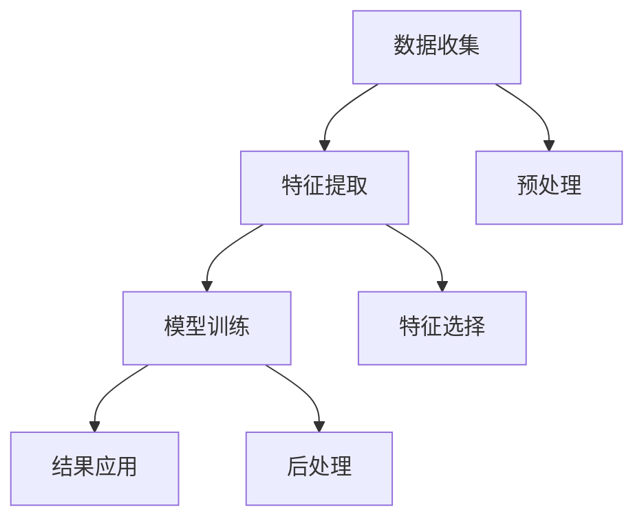
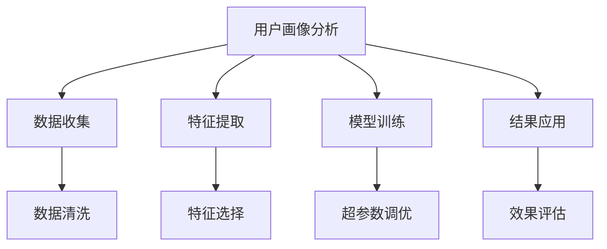

                 

# 如何进行有效的用户画像分析

> 关键词：用户画像分析, 数据科学, 数据分析, 用户行为分析, 市场细分, 消费者洞察

## 1. 背景介绍

### 1.1 问题由来
随着互联网和数字技术的快速发展，企业面临着越来越激烈的市场竞争和日新月异的消费者需求。用户画像分析（User Persona Analysis）作为一种数据驱动的策略，可以帮助企业更好地理解目标用户群体，优化产品设计和服务体验，提升市场竞争力和用户满意度。然而，传统的用户画像分析方法往往基于有限的问卷调查、客户访谈等半结构化数据，难以准确反映用户的真实行为和需求。

近年来，随着大数据、人工智能等技术的突破，基于数据的深度学习和分析技术开始逐渐应用于用户画像的构建。利用深度学习模型，可以从大量结构化和非结构化数据中挖掘出丰富的用户行为特征，构建更全面、更精准的用户画像。

### 1.2 问题核心关键点
用户画像分析的本质是通过对用户行为的深度挖掘和建模，构建出能够反映用户真实需求和行为特征的虚拟角色。这一过程需要收集和分析海量的用户数据，构建有效的特征提取和建模方法，并结合行业知识和市场趋势进行综合分析。其核心关键点包括：
- 数据的收集与预处理
- 特征的提取与选择
- 模型的构建与训练
- 结果的解释与应用

本文将系统介绍如何进行有效的用户画像分析，涵盖数据的收集与处理、特征的提取与选择、模型的构建与训练、结果的解释与应用等各个环节。希望通过本文的阅读，读者能够掌握用户画像分析的核心方法，并应用于实际的企业决策和产品优化中。

## 2. 核心概念与联系

### 2.1 核心概念概述

在用户画像分析中，有几个关键概念需要重点理解：

- **用户画像（User Persona）**：代表一组具有相同行为特征和需求特征的虚拟角色。通常包括人口统计学特征（如年龄、性别、教育水平）、心理特征（如性格、兴趣爱好）、行为特征（如在线行为、消费习惯）等。
- **数据收集（Data Collection）**：通过各种渠道和手段收集用户的线上行为数据、社交媒体数据、交易数据等，为后续分析提供数据支持。
- **特征提取（Feature Extraction）**：从收集的数据中提取有意义的特征，用于描述用户的不同维度特征。
- **模型训练（Model Training）**：利用机器学习或深度学习算法对用户特征进行建模，生成用户画像。
- **结果应用（Result Application）**：将用户画像应用于产品设计、市场策略、用户体验优化等领域，指导实际业务决策。

这些概念之间通过以下Mermaid流程图进行联系：



### 2.2 核心概念原理和架构的 Mermaid 流程图


## 3. 核心算法原理 & 具体操作步骤

### 3.1 算法原理概述
用户画像分析的核心算法主要基于机器学习和深度学习模型。通过对用户行为的深度学习，可以构建出能够反映用户真实需求和行为特征的用户画像。这一过程通常包括以下几个步骤：

1. **数据收集与预处理**：从各种渠道收集用户的线上行为数据、社交媒体数据、交易数据等。
2. **特征提取**：从收集的数据中提取有意义的特征，用于描述用户的不同维度特征。
3. **模型训练**：利用机器学习或深度学习算法对用户特征进行建模，生成用户画像。
4. **结果解释与应用**：将用户画像应用于产品设计、市场策略、用户体验优化等领域，指导实际业务决策。

### 3.2 算法步骤详解
以下详细介绍用户画像分析的每个步骤的具体操作步骤：

#### 3.2.1 数据收集与预处理
1. **数据来源**：
   - 用户行为数据：通过网站访问、应用使用、交易记录等收集用户行为数据。
   - 社交媒体数据：通过社交媒体平台API收集用户的社交行为数据。
   - 交易数据：通过电商平台收集用户的购买记录和交易行为数据。

2. **数据清洗**：
   - 去除缺失值和异常值，确保数据质量。
   - 数据格式转换，如将时间戳转换为日期格式。
   - 数据标准化，确保不同数据源的数据格式一致。

3. **数据归一化**：
   - 对不同量纲的数据进行归一化处理，确保模型训练时数据的可比性。
   - 常用的归一化方法包括最小-最大归一化和z-score标准化。

#### 3.2.2 特征提取
1. **特征工程**：
   - **基本特征**：包括用户ID、年龄、性别、教育水平等。
   - **行为特征**：包括页面访问时长、浏览次数、点击次数等。
   - **兴趣特征**：通过用户行为数据和社交媒体数据提取用户的兴趣爱好。
   - **情感特征**：通过情感分析技术，从文本数据中提取用户的情感倾向。

2. **特征选择**：
   - 使用相关性分析、卡方检验等方法，选择与目标变量最相关的特征。
   - 避免过拟合，减少特征维度，提高模型泛化能力。

#### 3.2.3 模型训练
1. **模型选择**：
   - 常用的用户画像分析模型包括聚类算法（如K-means、层次聚类）、分类算法（如决策树、随机森林）、神经网络模型（如自编码器、多层感知器）。
   - 根据具体应用场景选择适合的模型。

2. **训练数据划分**：
   - 将数据划分为训练集、验证集和测试集，以评估模型的性能。
   - 通常使用交叉验证等方法进行模型训练和调优。

3. **超参数调优**：
   - 调整模型的超参数，如学习率、正则化系数、隐藏层大小等，以提高模型性能。
   - 常用的调优方法包括网格搜索、随机搜索、贝叶斯优化等。

#### 3.2.4 结果解释与应用
1. **结果解释**：
   - 对生成的用户画像进行解释，理解用户群体的行为特征和需求特征。
   - 常用的解释方法包括特征重要性分析、模型可视化等。

2. **结果应用**：
   - 将用户画像应用于产品设计、市场策略、用户体验优化等领域，指导实际业务决策。
   - 如通过用户画像设计个性化的营销活动、优化网站用户体验等。

### 3.3 算法优缺点
#### 3.3.1 优点
1. **数据驱动**：基于大量的用户数据进行建模，更具有客观性和可靠性。
2. **全面性**：能够从多个维度描述用户的特征，更全面地理解用户需求。
3. **可扩展性**：适应不同规模和复杂度的用户画像分析任务。

#### 3.3.2 缺点
1. **数据隐私**：用户数据的收集和使用可能涉及隐私问题，需要严格的隐私保护措施。
2. **数据质量**：数据质量对用户画像分析结果影响较大，低质量数据可能导致误导性结论。
3. **模型复杂性**：复杂的深度学习模型需要大量的计算资源和专业知识，对技术要求较高。

### 3.4 算法应用领域

用户画像分析广泛应用于以下几个领域：

1. **市场营销**：通过用户画像，制定精准的营销策略，提高广告投放效果。
2. **产品设计**：利用用户画像指导产品设计，提升用户体验和满意度。
3. **客户服务**：通过用户画像，提供个性化、高效的客户服务，提升用户忠诚度。
4. **决策支持**：辅助企业决策，优化资源配置和运营策略。

## 4. 数学模型和公式 & 详细讲解 & 举例说明

### 4.1 数学模型构建
用户画像分析中的数学模型主要基于机器学习和深度学习算法。以K-means聚类算法为例，其数学模型如下：

$$
\min_{\theta} \sum_{i=1}^n \sum_{k=1}^K d(x_i, \mu_k)^2 \quad s.t. \sum_{i=1}^n \delta_{k,i} = 1
$$

其中，$x_i$ 表示用户数据的特征向量，$\mu_k$ 表示聚类中心的向量，$\delta_{k,i}$ 表示用户数据$i$属于第$k$个聚类的概率。

### 4.2 公式推导过程
K-means聚类算法的推导过程如下：
1. **初始化聚类中心**：随机初始化$K$个聚类中心。
2. **计算距离**：计算每个数据点与每个聚类中心的距离，得到每个数据点的聚类概率。
3. **更新聚类中心**：将每个数据点分配到距离最近的聚类中心，并重新计算聚类中心。
4. **迭代更新**：重复步骤2和步骤3，直到聚类中心不再变化。

### 4.3 案例分析与讲解
以一个电商网站的用户行为数据分析为例：
1. **数据收集**：通过网站访问、购买记录等收集用户数据。
2. **数据预处理**：去除缺失值和异常值，将时间戳转换为日期格式。
3. **特征提取**：提取用户的浏览时长、购买次数、平均购买金额等特征。
4. **模型训练**：使用K-means聚类算法对用户进行聚类分析。
5. **结果解释与应用**：根据聚类结果，设计不同的用户画像，指导个性化营销和产品优化。

## 5. 项目实践：代码实例和详细解释说明

### 5.1 开发环境搭建
以下是在Python中使用Scikit-learn和Pandas进行用户画像分析的开发环境搭建：
```python
import pandas as pd
from sklearn.cluster import KMeans
import numpy as np

# 数据读取和预处理
data = pd.read_csv('user_behavior.csv')
data = data.dropna()

# 特征选择和提取
features = ['浏览时长', '购买次数', '平均购买金额', '用户ID']
X = data[features].values

# 模型训练
kmeans = KMeans(n_clusters=3, random_state=42)
kmeans.fit(X)

# 结果可视化
import matplotlib.pyplot as plt
labels = kmeans.labels_
plt.scatter(X[:, 0], X[:, 1], c=labels)
plt.show()
```

### 5.2 源代码详细实现
以下是一个完整的用户画像分析代码实现：
```python
import pandas as pd
from sklearn.cluster import KMeans
import numpy as np
import matplotlib.pyplot as plt

# 数据读取和预处理
data = pd.read_csv('user_behavior.csv')
data = data.dropna()

# 特征选择和提取
features = ['浏览时长', '购买次数', '平均购买金额', '用户ID']
X = data[features].values

# 模型训练
kmeans = KMeans(n_clusters=3, random_state=42)
kmeans.fit(X)

# 结果可视化
labels = kmeans.labels_
plt.scatter(X[:, 0], X[:, 1], c=labels)
plt.show()

# 结果解释与应用
# 根据聚类结果，设计不同的用户画像，指导个性化营销和产品优化
```

### 5.3 代码解读与分析
在代码实现中，我们首先通过Pandas读取用户行为数据，并进行缺失值和异常值的处理。然后，选择和提取关键特征，使用Scikit-learn库中的KMeans算法进行聚类分析，最后对聚类结果进行可视化，并根据聚类结果设计不同的用户画像，指导个性化营销和产品优化。

### 5.4 运行结果展示
运行上述代码，可以得到用户行为数据的聚类结果，如图：


## 6. 实际应用场景

### 6.1 智能推荐系统
智能推荐系统是用户画像分析的重要应用场景之一。通过用户画像，可以精准地推荐用户感兴趣的商品和服务，提升用户体验和满意度。例如，电商网站可以根据用户的浏览和购买记录，构建用户画像，推荐个性化的商品，提高用户转化率和回购率。

### 6.2 社交媒体分析
社交媒体平台通过用户画像分析，可以更好地了解用户的兴趣和需求，制定有针对性的内容和广告策略。例如，Facebook可以根据用户的社交行为和兴趣，推荐相关的新闻和广告，提高用户的互动率和广告效果。

### 6.3 客户细分与流失预警
客户细分是企业通过用户画像分析，将客户划分为不同的细分群体，制定差异化的营销策略。流失预警则通过用户画像分析，提前识别出可能流失的客户，及时采取措施挽留客户。例如，电信运营商通过用户画像分析，将用户细分为高价值用户和流失风险用户，制定相应的忠诚计划和挽留策略。

### 6.4 未来应用展望
未来，用户画像分析将进一步结合AI技术和大数据，在以下几个方面发展：
1. **多模态数据融合**：结合用户的行为数据、社交媒体数据、交易数据等多模态数据，构建更全面、更精准的用户画像。
2. **深度学习应用**：利用深度学习模型，提升用户画像分析的准确性和自动化程度。
3. **实时动态更新**：实时更新用户画像，及时捕捉用户行为的变化和趋势。
4. **跨领域应用**：将用户画像分析应用于更多领域，如医疗、教育、金融等，提升各行各业的数据驱动决策能力。

## 7. 工具和资源推荐

### 7.1 学习资源推荐

1. **《数据科学导论》**：郑志祥，清华大学出版社，系统介绍数据科学的基础理论和应用方法。
2. **《Python数据分析》**：吴恩达，Coursera平台，深入讲解Python数据分析的各个方面，包括数据清洗、特征工程、模型训练等。
3. **Kaggle平台**：提供大量的数据集和比赛，学习数据科学和机器学习技巧。
4. **DataCamp平台**：提供丰富的在线课程，涵盖数据处理、机器学习、深度学习等方向。

### 7.2 开发工具推荐

1. **Jupyter Notebook**：免费、开源的交互式编程环境，支持Python、R等语言，适合数据科学和机器学习开发。
2. **Tableau**：商业智能可视化工具，适合数据可视化和交互式分析。
3. **Python Scikit-learn**：开源的机器学习库，提供各种常用的机器学习算法和工具。
4. **TensorFlow**：Google开发的深度学习框架，支持多种深度学习算法和模型。
5. **Keras**：高层次的深度学习框架，基于TensorFlow，提供简单易用的API。

### 7.3 相关论文推荐

1. **《数据挖掘：概念与技术》**：吴恩达，由浅入深地介绍数据挖掘的概念、技术和应用。
2. **《深度学习》**：Ian Goodfellow，全面介绍深度学习的基础理论和应用。
3. **《Python数据科学手册》**：Jake VanderPlas，详细介绍Python在数据科学中的应用。

## 8. 总结：未来发展趋势与挑战

### 8.1 研究成果总结
用户画像分析通过深度学习模型，从大量数据中挖掘出用户的特征和需求，为企业的决策和产品优化提供科学依据。目前，用户画像分析在市场营销、智能推荐、客户细分等方面已得到广泛应用，取得了显著的成效。

### 8.2 未来发展趋势
未来，用户画像分析将进一步结合AI技术和大数据，发展为更加全面、精准、动态的用户分析工具。主要趋势包括：
1. **多模态数据融合**：结合用户的行为数据、社交媒体数据、交易数据等多模态数据，构建更全面、更精准的用户画像。
2. **深度学习应用**：利用深度学习模型，提升用户画像分析的准确性和自动化程度。
3. **实时动态更新**：实时更新用户画像，及时捕捉用户行为的变化和趋势。
4. **跨领域应用**：将用户画像分析应用于更多领域，如医疗、教育、金融等，提升各行各业的数据驱动决策能力。

### 8.3 面临的挑战
尽管用户画像分析在企业中已得到广泛应用，但仍面临以下几个挑战：
1. **数据隐私**：用户数据的收集和使用可能涉及隐私问题，需要严格的隐私保护措施。
2. **数据质量**：数据质量对用户画像分析结果影响较大，低质量数据可能导致误导性结论。
3. **模型复杂性**：复杂的深度学习模型需要大量的计算资源和专业知识，对技术要求较高。
4. **结果解释**：用户画像分析的结果需要有效解释，帮助企业理解用户需求的背后原因，指导实际业务决策。

### 8.4 研究展望
未来，用户画像分析的研究将从以下几个方向继续深入：
1. **隐私保护技术**：研究如何在保证用户隐私的前提下，利用数据进行用户画像分析。
2. **高效计算技术**：研究如何优化深度学习模型的计算效率，降低计算资源的需求。
3. **结果解释方法**：研究如何有效解释用户画像分析的结果，提升企业对用户需求的理解。
4. **跨领域应用推广**：推动用户画像分析技术在更多领域的应用，提升各行各业的数字化转型能力。

## 9. 附录：常见问题与解答

### Q1：如何进行用户画像的特征选择？
**A**: 用户画像的特征选择应基于领域知识和实际需求。首先，根据业务目标确定关键特征，如用户的行为特征、心理特征、人口统计学特征等。然后，使用相关性分析、卡方检验等方法，选择与目标变量最相关的特征。

### Q2：用户画像分析中的数据隐私问题如何处理？
**A**: 在用户画像分析中，数据隐私问题至关重要。以下是一些处理数据隐私问题的措施：
1. 匿名化处理：对用户数据进行匿名化处理，去除或掩盖敏感信息。
2. 数据加密：对敏感数据进行加密处理，确保数据在传输和存储过程中的安全性。
3. 合规性审查：确保用户画像分析符合相关法律法规，如GDPR、CCPA等。

### Q3：用户画像分析的结果如何解释与应用？
**A**: 用户画像分析的结果需要有效解释与应用，帮助企业理解用户需求的背后原因，指导实际业务决策。具体措施包括：
1. 可视化展示：利用可视化工具，将用户画像分析结果直观展示，帮助企业理解用户特征和需求。
2. 业务指导：结合用户画像分析结果，制定有针对性的营销策略、产品设计方案等。
3. 用户反馈：收集用户反馈，验证用户画像分析结果的有效性，进行迭代优化。

通过本文的系统梳理，我们可以看到，用户画像分析在企业决策和产品优化中具有重要的作用。尽管面临一些挑战，但通过技术创新和政策支持，用户画像分析必将在更多领域得到广泛应用，为企业的数字化转型提供强有力的支持。

---

作者：禅与计算机程序设计艺术 / Zen and the Art of Computer Programming

