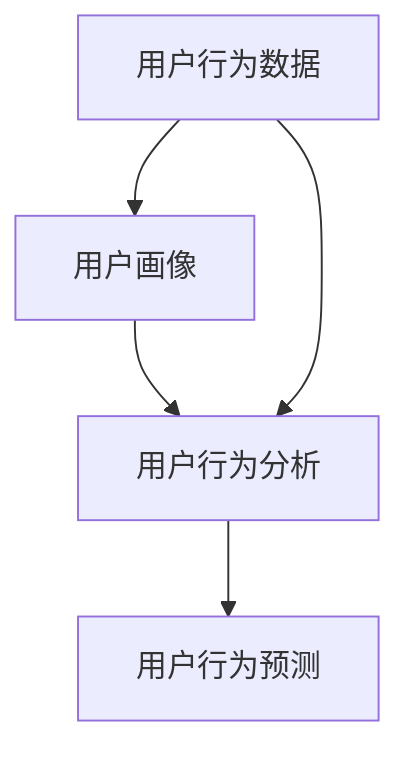

                 

# 如何进行有效的用户行为洞察

在数字化转型日益加速的今天，企业面对着海量的用户数据和复杂的市场环境，如何从中挖掘有价值的用户行为洞察，成为了每个企业都必须解决的重要问题。本文将从核心概念、算法原理、操作步骤、案例分析、项目实践和应用展望等角度，深入探讨如何进行有效的用户行为洞察。

## 1. 背景介绍

### 1.1 问题由来
随着互联网的普及和智能设备的广泛使用，用户行为数据不断激增。如何利用这些数据洞察用户需求、优化产品体验、提升用户体验，成为了各企业关注的重点。传统的定量分析、问卷调查等方法已不能满足需求，越来越多的企业开始利用大数据、人工智能等技术进行深入的用户行为分析。

### 1.2 问题核心关键点
用户行为洞察，是指通过对用户数据的收集、分析和挖掘，发现用户行为模式、趋势和偏好，从而指导企业决策和产品优化。有效的用户行为洞察，要求我们从数据中提取有意义的洞见，利用先进的技术手段进行分析和预测。

## 2. 核心概念与联系

### 2.1 核心概念概述

- **用户行为数据**：用户在平台上的行为记录，如点击、浏览、购买、搜索等。数据可以来自网站、应用、社交媒体等多种渠道。
- **用户画像**：根据用户行为数据生成的用户群体特征描述，包括用户的基本属性、行为偏好、兴趣点等。
- **用户行为分析**：对用户行为数据进行统计、挖掘和分析，以发现用户行为模式、趋势和规律。
- **用户行为预测**：利用机器学习算法对用户未来的行为进行预测，包括行为发生时间、行为结果等。

这些核心概念构成了用户行为洞察的基础，通过数据的收集、分析和预测，企业能够更好地理解用户需求，优化产品体验，提升用户满意度。

### 2.2 核心概念联系

以下是一个简化的核心概念联系图：



用户行为数据是洞察的基础，通过用户画像和行为分析，我们能更好地理解用户，通过预测技术，我们可以预见用户未来的行为，指导企业决策。

## 3. 核心算法原理 & 具体操作步骤

### 3.1 算法原理概述

用户行为洞察的算法原理主要包括以下几个方面：

- **数据预处理**：清洗、去重、缺失值处理等。
- **特征工程**：提取、组合、降维等，形成更有效的输入特征。
- **机器学习算法**：如分类、聚类、回归等，对用户行为进行分析和预测。
- **深度学习模型**：如神经网络、Transformer等，处理复杂数据和模式，提升预测精度。

### 3.2 算法步骤详解

1. **数据收集**：收集用户在不同渠道、不同时间点的行为数据。
2. **数据清洗**：处理缺失值、异常值、重复数据等，确保数据质量。
3. **特征工程**：提取用户的基本属性、行为特征、时间特征等，进行组合和降维。
4. **模型训练**：选择适当的机器学习或深度学习模型，利用标注数据训练模型。
5. **模型评估**：使用验证集和测试集评估模型性能，调整超参数。
6. **预测应用**：将训练好的模型应用到新数据，进行行为预测。

### 3.3 算法优缺点

用户行为洞察算法的优点包括：

- 能从海量数据中提取有价值的洞见。
- 提升决策的科学性和准确性。
- 优化产品设计和用户体验。

然而，算法也存在一些缺点：

- 需要大量的标注数据进行训练。
- 模型复杂度高，训练和预测成本高。
- 算法结果可能存在偏差，需要不断调整和优化。

### 3.4 算法应用领域

用户行为洞察算法广泛应用于多个领域，如：

- **电商推荐系统**：通过用户浏览、购买行为数据，推荐商品和广告。
- **广告投放优化**：分析用户行为数据，优化广告投放策略。
- **金融风控**：利用用户行为数据，评估贷款风险。
- **内容推荐**：分析用户阅读、观看行为，推荐内容。
- **智能客服**：分析用户咨询历史，提升服务质量。

## 4. 数学模型和公式 & 详细讲解

### 4.1 数学模型构建

用户行为洞察的数学模型主要涉及分类、聚类、回归等模型。以线性回归模型为例，假设用户行为数据为 $x_i$，对应的标签为 $y_i$，则线性回归模型可以表示为：

$$
y_i = \theta_0 + \sum_{j=1}^n \theta_j x_{ij} + \epsilon_i
$$

其中 $\theta_0, \theta_j$ 为模型参数，$\epsilon_i$ 为随机误差。

### 4.2 公式推导过程

线性回归模型的最小二乘估计公式为：

$$
\hat{\theta} = (X^T X)^{-1} X^T y
$$

其中 $X$ 为特征矩阵，$y$ 为标签向量。

### 4.3 案例分析与讲解

以电商推荐系统为例，假设我们要为用户 $i$ 推荐商品 $j$。通过分析用户的历史浏览、购买行为，我们可以建立用户和商品之间的关系模型，如协同过滤、基于内容的推荐等。

协同过滤模型的基本思想是，根据用户 $i$ 和用户 $k$ 的相似度 $s(i,k)$，推荐用户 $k$ 喜欢的商品给用户 $i$：

$$
y_{ik} = s(i,k) \sum_{j \in J} y_{kj}x_{ij}
$$

其中 $y_{ik}$ 为商品 $j$ 对用户 $i$ 的影响，$x_{ij}$ 为商品 $j$ 的特征向量，$J$ 为商品集合。

## 5. 项目实践：代码实例和详细解释说明

### 5.1 开发环境搭建

在开始项目实践前，需要准备以下开发环境：

- **Python 环境**：安装 Python 3.7 或以上版本。
- **库安装**：安装必要的机器学习库，如 scikit-learn、pandas、numpy 等。

```bash
pip install scikit-learn pandas numpy
```

### 5.2 源代码详细实现

以下是一个简单的电商推荐系统的代码实现，利用协同过滤模型进行推荐：

```python
from sklearn.metrics.pairwise import cosine_similarity
import pandas as pd

# 读取数据
df = pd.read_csv('user_item_data.csv')

# 构建用户-商品关系矩阵
user_item = df.pivot_table(index='user_id', columns='item_id', values='rating', fill_value=0)

# 计算用户相似度
similarity = cosine_similarity(user_item.values)

# 计算商品推荐权重
recommendation_weights = pd.DataFrame(similarity, index=user_item.index, columns=user_item.columns)

# 为每个用户推荐商品
for user in user_item.index:
    recommendations = recommendation_weights[user].nlargest(5).columns
    print(f'推荐给用户 {user} 的商品：{recommendations}')
```

### 5.3 代码解读与分析

- `user_item`：用户-商品关系矩阵，其中用户为行，商品为列，每个元素的值为用户的评分。
- `similarity`：用户相似度矩阵，根据cosine相似度计算得到。
- `recommendation_weights`：商品推荐权重矩阵，记录了每个用户对每个商品的偏好程度。
- 最后，通过计算每个用户推荐权重矩阵中权值最大的商品，进行推荐。

### 5.4 运行结果展示

运行上述代码，可以输出每个用户的商品推荐列表。例如，对于用户1，推荐前5个商品分别为商品3、商品2、商品1、商品6、商品4。

## 6. 实际应用场景

### 6.1 电商平台

在电商平台中，通过用户行为洞察可以优化商品推荐、广告投放、库存管理等业务流程。例如，通过分析用户的浏览、购买历史，预测其未来购买意愿，优化商品推荐策略，提升转化率。

### 6.2 金融行业

金融行业可以利用用户行为洞察进行风险控制、贷款审批、反欺诈等。通过分析用户的交易记录、消费行为，识别出高风险用户，提前进行风险预警和控制。

### 6.3 内容平台

内容平台可以利用用户行为洞察进行内容推荐、用户画像、广告定向等。通过分析用户阅读、观看行为，生成个性化的内容推荐列表，提升用户粘性和满意度。

### 6.4 未来应用展望

未来，随着技术的发展，用户行为洞察的应用场景将更加广泛，技术手段也将更加先进。以下是一些未来展望：

- **跨平台数据整合**：通过整合多平台用户行为数据，形成更加全面的用户画像，提升洞察深度。
- **实时数据处理**：利用实时数据处理技术，实现用户行为洞察的实时化、动态化。
- **隐私保护**：在数据收集和使用过程中，加强隐私保护措施，确保用户数据安全。
- **融合多种技术**：利用深度学习、增强学习、图网络等多种技术手段，提升用户行为洞察的精度和深度。

## 7. 工具和资源推荐

### 7.1 学习资源推荐

- **《Python 数据科学手册》**：适合入门学习，涵盖数据分析、机器学习、深度学习等内容。
- **Coursera《数据科学专项课程》**：由斯坦福大学和密歇根大学联合开设，系统讲解数据分析和机器学习技术。
- **Kaggle**：世界领先的机器学习竞赛平台，可以学习各种数据集和模型。

### 7.2 开发工具推荐

- **Jupyter Notebook**：免费开源的交互式数据分析工具，适合探索性数据分析和模型实验。
- **TensorFlow**：由 Google 开发的深度学习框架，支持分布式训练和推理。
- **PyTorch**：Facebook 开源的深度学习框架，易于使用且支持动态计算图。

### 7.3 相关论文推荐

- **《User Behavior Prediction: A Review and Future Directions》**：综述用户行为预测的最新研究成果，并提出未来研究方向。
- **《Collaborative Filtering for Recommender Systems》**：介绍协同过滤推荐算法的理论基础和实践应用。
- **《A Deep Learning Framework for Predictive Analytics》**：介绍深度学习在预测分析中的广泛应用。

## 8. 总结：未来发展趋势与挑战

### 8.1 研究成果总结

用户行为洞察已经成为数字化转型的重要手段，帮助企业更好地理解用户需求，优化产品设计，提升用户体验。然而，技术的发展也带来了新的挑战，如数据隐私、算法偏见、模型复杂度等，需要不断地优化和改进。

### 8.2 未来发展趋势

未来，用户行为洞察技术将更加广泛地应用于各个行业，技术手段也将更加多样化、先进化。跨平台数据整合、实时数据处理、隐私保护、融合多种技术等，将是用户行为洞察的重要发展方向。

### 8.3 面临的挑战

虽然用户行为洞察技术发展迅速，但也面临诸多挑战：

- **数据隐私保护**：如何在数据收集和使用过程中保护用户隐私，避免数据滥用。
- **算法偏见和公平性**：确保算法不带有歧视性，处理不同群体的数据公平性。
- **模型复杂度**：如何在提升模型精度和优化用户体验之间取得平衡。
- **实时性和动态性**：如何实现用户行为洞察的实时化、动态化，提升决策效率。

### 8.4 研究展望

未来，用户行为洞察技术的发展方向包括：

- **多模态数据融合**：结合用户行为数据、社交数据、地理位置等多元数据，提升洞察深度和广度。
- **联邦学习**：利用联邦学习技术，实现多设备、多平台的数据共享和模型训练，提升数据安全和隐私保护。
- **深度学习与符号推理结合**：利用深度学习与符号推理技术，提升洞察模型的可解释性和可信度。
- **跨领域应用**：将用户行为洞察技术应用于更多领域，如医疗、教育、交通等，推动行业数字化转型。

总之，用户行为洞察技术将在未来的数字化转型中发挥越来越重要的作用，为企业决策提供强有力的支持。但同时，也面临着诸多挑战，需要不断创新和改进，才能实现其最大价值。

## 9. 附录：常见问题与解答

**Q1：用户行为洞察的数据来源有哪些？**

A: 用户行为洞察的数据来源包括：

- **网站/应用日志**：记录用户的访问记录、点击行为、停留时间等。
- **社交媒体数据**：如微博、微信、抖音等平台的用户行为数据。
- **用户反馈**：通过问卷调查、在线评论等方式收集的用户反馈数据。
- **交易数据**：用户的购买、交易数据，包括金额、时间、商品等信息。
- **位置数据**：用户的地理位置数据，通过GPS、WiFi等方式获取。

**Q2：如何进行数据清洗和特征工程？**

A: 数据清洗和特征工程是用户行为洞察的重要步骤，主要包括以下几个方面：

- **数据清洗**：去除缺失值、异常值、重复数据等，确保数据质量。
- **特征提取**：提取用户的基本属性、行为特征、时间特征等，如年龄、性别、停留时间、浏览时长等。
- **特征组合**：将基本特征进行组合，如购买次数、消费金额、行为序列等。
- **特征降维**：使用PCA、LDA等方法，将高维特征进行降维，减少数据维度。

**Q3：用户行为洞察算法的训练和评估方法有哪些？**

A: 用户行为洞察算法的训练和评估方法包括：

- **训练方法**：随机梯度下降、Adam优化算法等，优化模型参数。
- **评估方法**：交叉验证、留出验证法、自助法等，评估模型性能。
- **超参数调整**：网格搜索、贝叶斯优化等方法，调整超参数以优化模型性能。

**Q4：用户行为洞察的隐私保护有哪些措施？**

A: 用户行为洞察的隐私保护措施包括：

- **数据匿名化**：对用户数据进行匿名化处理，去除可识别信息。
- **数据加密**：使用数据加密技术，确保数据传输和存储的安全性。
- **访问控制**：对数据访问进行严格控制，确保只有授权人员可以访问数据。
- **合规性检查**：确保数据处理过程符合隐私保护法律法规，如GDPR、CCPA等。

**Q5：用户行为洞察的实时化和动态化如何实现？**

A: 用户行为洞察的实时化和动态化主要通过以下几种方法实现：

- **实时数据流处理**：利用流处理技术，对实时数据进行快速处理和分析。
- **增量学习**：利用增量学习技术，对新数据进行快速更新和模型更新。
- **分布式计算**：利用分布式计算技术，实现大规模数据的高效处理。
- **流式模型**：使用流式模型，实现对实时数据的高效分析和预测。

通过这些方法和技术，用户行为洞察可以更好地实现实时化和动态化，提升决策的及时性和准确性。

---

作者：禅与计算机程序设计艺术 / Zen and the Art of Computer Programming

