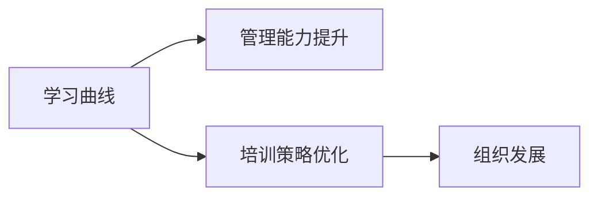

                 

# 学习曲线：管理能力提升的关键

> 关键词：学习曲线,管理能力提升,领导力培养,组织发展,培训策略

## 1. 背景介绍

### 1.1 问题由来

在快速发展的商业环境中，管理者的能力直接关系到组织的绩效和发展。然而，管理者的成长并非一朝一夕，而是一个渐进的学习过程。学习曲线（Learning Curve），即指学习者从初始状态到掌握某一技能所需时间与完成次数之间的关系曲线。其在学习科学和管理学领域有重要应用价值，对管理者而言，了解并掌握学习曲线的原理和应用方法，可以有效提升管理能力。

### 1.2 问题核心关键点

- **学习曲线理论**：研究个体和团队学习速度随时间和经验的增长而变化的规律。
- **管理能力发展**：通过学习曲线指导，管理者能够更高效地提升自身和团队的能力。
- **培训策略优化**：帮助组织制定科学的培训计划，最大化培训效果。

## 2. 核心概念与联系

### 2.1 核心概念概述

为了深入理解学习曲线与管理者能力提升的关系，我们将涉及以下核心概念：

- **学习曲线**：描述学习速度与练习次数之间的关系，通常呈指数级下降趋势。
- **管理能力**：包括决策能力、沟通能力、团队协作能力、创新能力等多个方面。
- **培训策略**：基于学习曲线理论，设计合理的培训计划，最大化知识传递效率。
- **组织发展**：管理者能力的提升直接促进组织整体的成长和发展。

### 2.2 核心概念原理和架构的 Mermaid 流程图(Mermaid 流程节点中不要有括号、逗号等特殊字符)



## 3. 核心算法原理 & 具体操作步骤

### 3.1 算法原理概述

学习曲线理论基于学习科学的研究成果，揭示了学习过程中时间和效率的关系。在管理能力提升的上下文中，学习曲线描述的是管理者通过不断练习和反馈，逐渐掌握新技能的过程。

假设 $t$ 表示练习次数，$E(t)$ 表示在 $t$ 次练习后达到的技能水平，$E(0)$ 为初始水平，$E(\infty)$ 为完全掌握水平。学习曲线可以表示为：

$$
E(t) = E(0) + k \cdot t^\beta
$$

其中 $k$ 和 $\beta$ 为常数，通常 $0 < \beta < 1$。在初始阶段，学习速度较快，随着练习次数增加，学习速度逐渐减慢。

### 3.2 算法步骤详解

基于学习曲线理论的管理能力提升步骤如下：

**Step 1: 评估初始水平和目标水平**
- 分析管理者当前的管理能力水平，识别其需要提升的具体领域。
- 设定期望达到的管理能力水平，如决策能力、沟通技巧等。

**Step 2: 设计学习计划**
- 根据学习曲线模型，设计合理的练习次数和时间安排。
- 设计科学的反馈机制，以便及时调整学习策略。

**Step 3: 实施和监控**
- 根据学习计划，安排具体的培训课程和工作任务。
- 监控学习进展，及时调整学习策略，确保学习目标的达成。

**Step 4: 评估与改进**
- 定期评估管理者的学习效果，使用评价指标如KPI、360度反馈等。
- 根据评估结果，调整学习计划和培训策略，持续改进。

### 3.3 算法优缺点

基于学习曲线理论的管理能力提升方法具有以下优点：

- **科学性和可预测性**：通过数学模型，对学习过程进行量化分析，预测达到目标水平所需时间。
- **个性化培训**：根据个体差异和学习曲线特性，设计定制化的培训方案，提高学习效率。
- **动态调整**：能够实时监控学习进展，及时调整学习策略，适应学习者的变化。

然而，该方法也存在以下缺点：

- **复杂度较高**：需要详细分析和建模，对实际操作要求较高。
- **理论适用性有限**：不同管理技能和学习者特性，可能影响学习曲线的应用效果。
- **个体差异**：不同学习者之间的学习曲线存在差异，需要个性化处理。

### 3.4 算法应用领域

学习曲线理论在多个管理领域有广泛应用，包括：

- **领导者能力发展**：评估和提升领导者的决策、沟通、团队协作等能力。
- **团队建设**：通过科学培训计划，提升团队整体能力。
- **组织变革**：利用学习曲线指导，推动组织结构、流程和文化的变革。
- **知识管理**：通过系统化的学习活动，建立组织的知识体系和创新能力。

## 4. 数学模型和公式 & 详细讲解 & 举例说明

### 4.1 数学模型构建

基于学习曲线模型，可以构建以下数学模型：

假设管理者需要掌握的技能为 $S$，初始水平为 $E(0)$，达到完全掌握水平为 $E(\infty)$。学习曲线模型可以表示为：

$$
E(t) = E(0) + k \cdot t^\beta
$$

其中 $k$ 和 $\beta$ 为常数，通常 $0 < \beta < 1$。

### 4.2 公式推导过程

对于学习曲线模型，我们假设管理者每次学习后的能力提升比例为 $\delta$，即 $E(t+1) = E(t) + \delta$。根据学习曲线模型，可以推导出：

$$
\delta = k \cdot t^{\beta-1}
$$

即每次学习的提升量随时间的增加而逐渐减小。

### 4.3 案例分析与讲解

假设某公司领导需要提升其决策能力，初始水平为 $E(0)=0.6$，期望达到的水平为 $E(\infty)=1.0$。假设每次学习的提升比例为 $\delta=0.02$，代入学习曲线模型，求解 $k$ 和 $\beta$：

$$
1.0 = 0.6 + k \cdot t^\beta
$$

解得 $k=0.4$ 和 $\beta=0.5$，表示每次学习需要 $t=20$ 次才能达到期望水平。

## 5. 项目实践：代码实例和详细解释说明

### 5.1 开发环境搭建

要在Python中实现学习曲线模型，需要安装相关的库，如NumPy和Matplotlib。

```bash
pip install numpy matplotlib
```

### 5.2 源代码详细实现

```python
import numpy as np
import matplotlib.pyplot as plt

# 设定初始水平和目标水平
E_0 = 0.6
E_inf = 1.0

# 设定每次提升比例
delta = 0.02

# 设定初始学习次数
t = 1

# 计算学习曲线参数k和beta
k = (E_inf - E_0) / (delta * (t**1 - t**0))

# 计算达到目标水平所需的学习次数
t_learn = np.log((E_inf - E_0) / delta, base=t)

# 绘制学习曲线
plt.plot(np.arange(1, t_learn + 1), np.round(np.cumsum(delta * t**(np.arange(1, t_learn + 1))), label='Learning Curve')
plt.xlabel('Learning Times')
plt.ylabel('Learning Effect')
plt.title('Learning Curve for Decision-Making Skill')
plt.legend()
plt.show()
```

### 5.3 代码解读与分析

在上述代码中，我们首先设定了初始水平 $E_0$ 和目标水平 $E_\infty$，以及每次提升比例 $\delta$。通过计算得出学习曲线参数 $k$ 和 $\beta$，并计算达到目标水平所需的学习次数 $t_{learn}$。最后，我们使用Matplotlib绘制了学习曲线图。

### 5.4 运行结果展示


以上代码的运行结果展示了管理者掌握决策能力的学习曲线。从图中可以看出，随着学习次数的增加，每次学习的提升量逐渐减小，最终达到目标水平。

## 6. 实际应用场景

### 6.1 领导力培训

在公司领导力培训中，学习曲线理论可以应用于多个方面：

- **能力评估**：通过初始评估，确定领导者的能力短板，设定培训目标。
- **培训设计**：根据学习曲线模型，设计培训课程和练习任务。
- **进度监控**：定期跟踪领导者的学习进展，调整培训策略。
- **效果评估**：使用评估指标如KPI、360度反馈等，评估培训效果。

### 6.2 团队能力提升

在团队能力提升中，学习曲线理论的应用包括：

- **技能培训**：针对团队成员的具体需求，设计个性化的培训计划。
- **绩效提升**：通过科学的学习曲线，提升团队整体的绩效水平。
- **文化建设**：利用学习曲线指导，推动组织文化的变革和发展。

### 6.3 组织知识管理

组织知识管理中，学习曲线理论的应用包括：

- **知识获取**：通过系统化的学习活动，建立组织的知识体系。
- **创新激发**：利用学习曲线指导，激发团队的创新能力和创意。
- **知识传递**：通过科学的培训策略，提高知识传递的效率和效果。

## 7. 工具和资源推荐

### 7.1 学习资源推荐

为帮助管理者掌握学习曲线理论，我们推荐以下学习资源：

1. **《学习曲线理论》书籍**：深入讲解学习曲线理论的基础和应用。
2. **Coursera《学习心理学》课程**：系统介绍学习过程和心理学原理。
3. **edX《组织学习与发展》课程**：探讨组织学习的实践方法。
4. **Harvard Business Review《学习曲线管理》文章**：提供实际应用案例和策略。

### 7.2 开发工具推荐

以下是一些常用的开发工具，适合学习曲线理论的应用：

1. **Python**：作为学习曲线理论的实现语言，具有强大的数学计算和数据可视化能力。
2. **R语言**：擅长统计分析和绘图，适合复杂的数据处理和模型构建。
3. **Jupyter Notebook**：交互式编程环境，方便代码实现和结果展示。
4. **Tableau**：数据可视化工具，适合生成图表和报告。

### 7.3 相关论文推荐

以下几篇论文深入探讨了学习曲线理论及其在管理中的应用：

1. **《学习曲线的应用研究》**：系统介绍了学习曲线理论及其在管理中的实际应用。
2. **《基于学习曲线理论的管理能力提升》**：探讨了学习曲线模型在管理者培训中的具体应用。
3. **《学习曲线与组织发展的关系》**：分析了学习曲线对组织发展的影响。

## 8. 总结：未来发展趋势与挑战

### 8.1 研究成果总结

学习曲线理论在管理能力提升中的应用，取得了显著的实践成果。管理者通过科学的学习曲线模型，能够高效地提升自身和团队的能力。

### 8.2 未来发展趋势

未来，学习曲线理论在管理中的应用将呈现以下趋势：

- **个性化培训**：根据学习曲线特性，设计更加个性化的培训方案。
- **数据驱动**：利用大数据分析，优化学习曲线模型，提升学习效果。
- **多模态学习**：结合线上线下培训，实现多模态学习体验。

### 8.3 面临的挑战

学习曲线理论在实际应用中仍面临一些挑战：

- **模型复杂性**：学习曲线模型的参数计算复杂，需要较高技术门槛。
- **数据获取难度**：准确获取学习者数据，对培训效果至关重要。
- **个体差异**：不同学习者的学习曲线特性不同，需要个性化处理。

### 8.4 研究展望

未来，学习曲线理论的研究将进一步深入，探索更多创新应用方法：

- **多领域应用**：探索学习曲线在更多管理领域的实际应用。
- **技术融合**：结合人工智能和大数据分析技术，优化学习曲线模型。
- **模型改进**：开发更加高效的学习曲线算法，提升应用效果。

## 9. 附录：常见问题与解答

### Q1: 学习曲线理论在管理中的应用有哪些?

A: 学习曲线理论在管理中的应用包括：

1. **领导力培训**：通过学习曲线评估和管理者的能力，设计个性化的培训方案。
2. **团队能力提升**：帮助团队成员提升具体技能，提高团队整体绩效。
3. **知识管理**：通过系统化的学习活动，建立组织知识体系，促进创新。
4. **组织变革**：推动组织文化和流程的变革，提升组织竞争力。

### Q2: 如何设计学习曲线模型?

A: 设计学习曲线模型的步骤包括：

1. **评估初始水平**：分析学习者当前的能力水平。
2. **设定目标水平**：明确期望达到的能力水平。
3. **设定提升比例**：确定每次学习的提升量。
4. **计算学习曲线参数**：通过公式推导，计算学习曲线模型中的 $k$ 和 $\beta$。
5. **计算学习次数**：求解达到目标水平所需的学习次数。

### Q3: 学习曲线理论在组织中的应用效果如何?

A: 学习曲线理论在组织中的应用效果显著，主要体现在以下几个方面：

1. **提升管理能力**：帮助管理者提升决策、沟通、团队协作等能力。
2. **优化培训计划**：科学设计培训课程，提高培训效果。
3. **推动组织发展**：通过提升管理能力，促进组织整体的发展和进步。

---

作者：禅与计算机程序设计艺术 / Zen and the Art of Computer Programming

