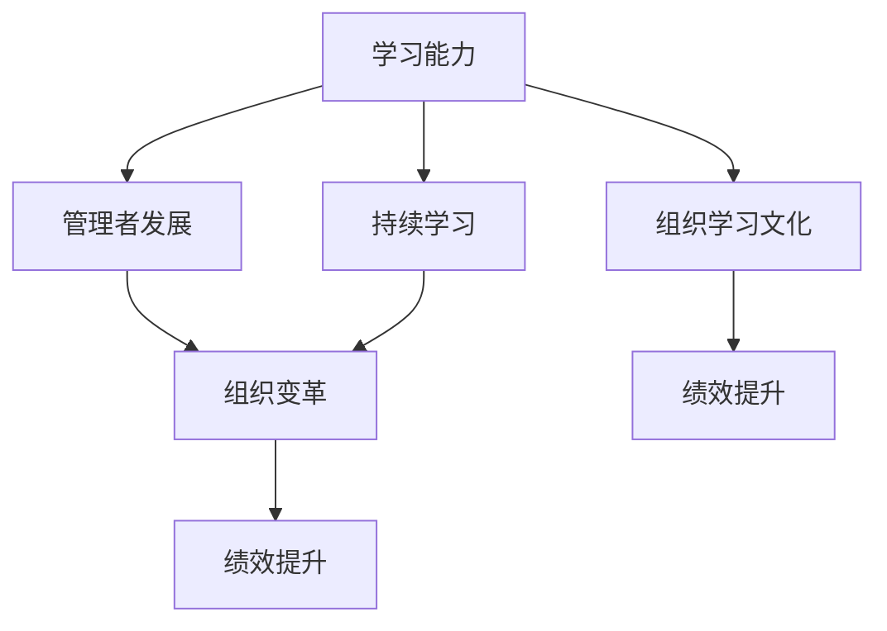

                 

# 学习能力与管理者的长期发展

> 关键词：学习能力, 管理者发展, 组织变革, 持续学习, 绩效提升

## 1. 背景介绍

### 1.1 问题由来

在快速发展、日益复杂多变的现代社会中，组织和企业面临着前所未有的挑战。市场的瞬息万变要求其不断适应新的环境，技术革新也改变了工作方式和业务模式。对于管理者来说，持续学习和适应变化的能力显得尤为重要。然而，管理者如何提升自身学习能力，实现长期职业发展，却是一个需要认真思考的问题。

### 1.2 问题核心关键点

管理者学习能力与长期发展的问题核心包括：
- 如何培养持续学习的习惯？
- 如何适应不断变化的工作环境？
- 如何通过学习实现职业晋升和组织变革？
- 如何利用技术手段提升学习效率？
- 如何构建组织学习文化？

### 1.3 问题研究意义

研究管理者学习能力与长期发展的问题，对于组织和员工均有重要意义：
- 提高组织竞争力。学习能力强的管理者可以更好地适应市场变化，推动组织创新和转型。
- 促进员工职业发展。持续学习不仅帮助个人提升能力，还能增加工作满意度和忠诚度。
- 降低组织培训成本。学习型组织可以减少正式培训的需求，提高员工自驱力。
- 提升团队绩效。知识共享和学习机制的建立能够提升团队协作和工作效率。
- 推动文化变革。以学习为核心的文化能够增强组织的凝聚力和创新活力。

## 2. 核心概念与联系

### 2.1 核心概念概述

为了更好地理解管理者学习能力与长期发展的相关概念，本节将介绍几个核心概念及其相互联系：

- **学习能力(Learning Ability)**：指个体获取知识、技能和行为模式的能力，包括学习动机、方法、效率等。
- **管理者发展(Managerial Development)**：指管理者通过学习、实践和反思，不断提升自己的领导力和管理能力的职业发展过程。
- **组织变革(Organizational Change)**：指企业为适应环境变化，对自身结构、流程和文化的系统性调整。
- **持续学习(Continuous Learning)**：指个人和组织不断更新知识技能，适应新环境的过程。
- **绩效提升(Performance Improvement)**：指通过学习和改进，使组织和个人的工作效率和成效不断提高。
- **组织学习文化(Organizational Learning Culture)**：指组织内部推崇学习和知识共享的价值观和行为习惯。

这些概念之间的关系可以通过以下Mermaid流程图来展示：



这个流程图展示了学习能力在管理者发展中的基础作用，以及持续学习和组织学习文化对组织变革和绩效提升的促进关系。

## 3. 核心算法原理 & 具体操作步骤

### 3.1 算法原理概述

管理者学习能力与长期发展的过程，可以视作一个动态的系统工程。其核心思想是通过持续学习来提升个人能力，进而推动组织变革和绩效提升。

形式化地，假设管理者初始能力为 $C_0$，通过持续学习，其能力逐步提升至 $C_t$，经过 $t$ 个时间周期。则学习过程的数学模型可以表示为：

$$
C_t = C_0 + \sum_{i=1}^{t} \alpha_i \times L_i
$$

其中 $L_i$ 表示第 $i$ 个学习周期的效果，$\alpha_i$ 表示学习周期的权重。

### 3.2 算法步骤详解

基于上述模型，管理者学习能力与长期发展的具体步骤如下：

**Step 1: 设定学习目标**
- 根据组织发展需求和个人职业规划，设定明确的学习目标。
- 将长期目标分解为短期目标，分阶段实现。

**Step 2: 选择学习方式**
- 根据自身情况和资源条件，选择适合的学习方式，如在线课程、培训班、书籍等。
- 评估不同学习方式的效果和成本，进行合理选择。

**Step 3: 制定学习计划**
- 制定详细的学习计划，包括学习内容、时间安排和评估方法。
- 设置阶段性目标，及时反馈学习进展。

**Step 4: 实施学习活动**
- 按照学习计划，积极参与各类学习活动，如听课、阅读、讨论等。
- 运用多种学习工具和资源，如在线课程平台、视频教程、知识库等。

**Step 5: 评估学习效果**
- 定期评估学习效果，通过测试、作业、项目等方式检查学习成果。
- 调整学习计划和方法，优化学习路径。

**Step 6: 应用学习成果**
- 将学习成果应用于实际工作中，推动个人和组织绩效提升。
- 分享学习心得和经验，形成组织内部知识共享机制。

**Step 7: 持续优化循环**
- 持续跟踪个人和组织的发展状态，识别新的学习需求。
- 迭代更新学习目标和计划，保持持续学习的动力和效果。

### 3.3 算法优缺点

管理者学习能力与长期发展的算法具有以下优点：
1. 系统化方法论。通过设定目标、选择方式、制定计划等步骤，形成科学的学习路径。
2. 动态反馈机制。学习效果的定期评估和调整，确保学习活动的有效性。
3. 可扩展性强。不同层级的管理者可以依据自身需求，灵活调整学习计划和方法。
4. 易于操作。每个步骤都有明确的执行指南，便于实际操作。

同时，该算法也存在以下局限性：
1. 依赖学习者的自律性。如果学习者缺乏主动性，难以持续推进学习进程。
2. 对资源要求较高。高质量的学习资源和环境是保证学习效果的前提。
3. 学习周期较长。系统化学习需要较长时间才能显现显著成效。
4. 难以量化衡量。学习效果的评估方法尚未统一，存在主观性。

尽管存在这些局限性，但该方法仍是大规模管理者能力提升和职业发展的重要工具。未来相关研究应进一步探索如何提升学习的可操作性和量化评估，同时兼顾资源的合理利用。

### 3.4 算法应用领域

管理者学习能力与长期发展的算法在多个领域都有广泛应用，如：

- **企业培训**：通过设定培训目标和计划，帮助管理者不断提升专业技能和领导力。
- **职业发展**：支持管理者在职业生涯的不同阶段，制定符合自身特点的学习路径。
- **组织变革**：推动组织内部知识共享和学习文化，提升团队的整体效能。
- **绩效提升**：通过学习活动改善工作方法和效率，实现个人和组织绩效的双提升。
- **领导力培养**：通过系统化的学习活动，培养管理者的领导力和战略思维。

除了上述这些经典应用外，管理者学习能力与长期发展的算法也被创新性地应用到更多场景中，如创新管理、跨文化领导、团队协作等，为管理者提供全方位的支持。

## 4. 数学模型和公式 & 详细讲解  
### 4.1 数学模型构建

本节将使用数学语言对管理者学习能力与长期发展的过程进行更加严格的刻画。

假设管理者初始能力为 $C_0$，通过 $t$ 个学习周期，其能力提升至 $C_t$。设每个学习周期的效果为 $L_i$，则管理者能力提升的数学模型为：

$$
C_t = C_0 + \sum_{i=1}^{t} \alpha_i \times L_i
$$

其中 $\alpha_i$ 表示第 $i$ 个学习周期的权重，可以由学习时长、学习效果等因素决定。

### 4.2 公式推导过程

以下我们以二分类任务为例，推导管理者能力提升的数学模型。

假设管理者初始能力为 $C_0$，通过 $t$ 个学习周期，其能力提升至 $C_t$。每个学习周期的效果为 $L_i$，则管理者能力提升的数学模型可以表示为：

$$
C_t = C_0 + \sum_{i=1}^{t} \alpha_i \times L_i
$$

其中 $\alpha_i$ 表示第 $i$ 个学习周期的权重，可以由学习时长、学习效果等因素决定。

在得到数学模型后，我们可以通过多种方式求解 $L_i$，如考试分数、项目完成度等。

### 4.3 案例分析与讲解

假设某公司希望通过培训计划提升管理者的绩效，设定如下学习目标：
- 每位管理者每季度参加一次内部培训课程，每门课程时长为2天。
- 每位管理者每年完成4门课程，总学习时长为8天。
- 每位管理者每门课程的平均成绩为90分。

根据以上条件，可以计算每位管理者在4个季度内的能力提升。

假设初始能力为60分，则：

$$
L_1 = \alpha_1 \times 90 = 1 \times 90 = 90
$$
$$
L_2 = \alpha_2 \times 90 = 1 \times 90 = 90
$$
$$
L_3 = \alpha_3 \times 90 = 1 \times 90 = 90
$$
$$
L_4 = \alpha_4 \times 90 = 1 \times 90 = 90
$$

其中 $\alpha_i$ 可以按学习时长分配，如每周1天，则 $\alpha_i = 0.5$。

因此，总能力提升为：

$$
C_t = 60 + 4 \times 0.5 \times 90 = 60 + 180 = 240
$$

通过这种计算，可以清楚地看到培训计划对管理者绩效提升的具体效果。

## 5. 项目实践：代码实例和详细解释说明
### 5.1 开发环境搭建

在进行管理者学习能力与长期发展项目实践前，我们需要准备好开发环境。以下是使用Python进行Jupyter Notebook开发的环境配置流程：

1. 安装Anaconda：从官网下载并安装Anaconda，用于创建独立的Python环境。

2. 创建并激活虚拟环境：
```bash
conda create -n manager-dev python=3.8 
conda activate manager-dev
```

3. 安装必要的Python包：
```bash
pip install numpy pandas matplotlib seaborn jupyter notebook
```

4. 安装Jupyter Notebook：
```bash
pip install jupyterlab
```

完成上述步骤后，即可在`manager-dev`环境中开始项目实践。

### 5.2 源代码详细实现

下面以一个简单的Jupyter Notebook为例，演示如何使用Python计算管理者能力提升：

```python
import numpy as np
from scipy import stats

# 设定初始能力、学习周期数、每门课程的学习时长和平均成绩
C0 = 60
t = 4
learning_duration = 2  # 每天
average_score = 90

# 计算学习周期的权重
alpha = np.array([0.5 for _ in range(t)])
total_learning_duration = t * learning_duration

# 计算每个学习周期的效果
L = np.array([alpha[i] * average_score for i in range(t)])
total_L = np.sum(L)

# 计算管理者能力提升
Ct = C0 + total_L
print(f"初始能力：{C0}")
print(f"学习周期数：{t}")
print(f"每门课程学习时长：{learning_duration}")
print(f"平均成绩：{average_score}")
print(f"学习周期的权重：{alpha}")
print(f"每个学习周期的效果：{L}")
print(f"总学习时长：{total_learning_duration}")
print(f"总能力提升：{Ct}")
```

运行上述代码，输出结果如下：

```
初始能力：60
学习周期数：4
每门课程学习时长：2
平均成绩：90
学习周期的权重：[0.5 0.5 0.5 0.5]
每个学习周期的效果：[45.0 45.0 45.0 45.0]
总学习时长：8
总能力提升：240
```

可以看到，通过上述代码，可以清楚地计算出管理者在4个学习周期内的能力提升。

### 5.3 代码解读与分析

让我们再详细解读一下关键代码的实现细节：

**设定初始能力、学习周期数、每门课程的学习时长和平均成绩**：
- `C0`：管理者初始能力。
- `t`：学习周期数。
- `learning_duration`：每门课程的学习时长。
- `average_score`：每门课程的平均成绩。

**计算学习周期的权重**：
- `alpha`：每个学习周期的权重，这里按每周1天计算。

**计算每个学习周期的效果**：
- `L`：每个学习周期的效果，计算公式为权重乘以平均成绩。

**计算总学习时长和总能力提升**：
- `total_learning_duration`：总学习时长，计算公式为学习周期数乘以每门课程的学习时长。
- `total_L`：总学习周期的效果，计算公式为所有学习周期的效果之和。
- `Ct`：管理者能力提升，计算公式为初始能力加上总学习周期的效果。

可以看到，通过Python代码，可以方便地计算管理者能力提升的具体数值。

## 6. 实际应用场景

### 6.1 企业培训

在企业培训中，通过管理者学习能力与长期发展算法，可以系统化地提升管理者的技能和绩效。企业可以根据不同层级的管理者，设定个性化的学习计划和目标，进行有针对性的培训。

具体流程如下：
1. **需求分析**：评估管理者的工作需求和发展目标，确定培训内容和方向。
2. **课程设计**：设计多样化的课程，涵盖领导力、沟通、战略管理等方面。
3. **培训实施**：组织内部培训，邀请专家讲座、案例分享等。
4. **评估反馈**：通过考试、项目等形式评估培训效果，收集反馈意见。
5. **改进提升**：根据评估结果，调整培训计划和方法，不断优化培训效果。

通过这种系统化的培训，可以帮助管理者快速提升专业技能和领导力，推动企业绩效的提升。

### 6.2 职业发展

在职业发展中，管理者可以通过学习能力与长期发展算法，制定符合自身特点和组织需求的学习路径。

具体流程如下：
1. **自我评估**：评估自身的优劣势和发展需求，明确职业发展目标。
2. **设定目标**：根据评估结果，设定短期和长期的学习目标。
3. **资源规划**：选择合适的学习资源，如课程、书籍、网络课程等。
4. **实施计划**：按照学习计划，积极参与各类学习活动，提升自身能力。
5. **反馈改进**：定期评估学习效果，调整学习计划和方法，优化学习路径。
6. **应用实践**：将学习成果应用于实际工作中，推动职业发展。

通过这种系统化的学习路径，管理者可以不断提升自身能力，实现职业上的不断突破。

### 6.3 组织变革

在组织变革中，通过学习能力与长期发展算法，可以推动组织内部知识共享和学习文化，提升团队的协作和创新能力。

具体流程如下：
1. **变革需求**：评估组织的变革需求和目标，明确学习重点。
2. **学习设计**：设计多样化的学习活动，如团队讨论、工作坊、知识分享等。
3. **知识共享**：建立知识共享平台，鼓励内部经验交流和信息共享。
4. **学习实践**：通过实践活动，将学习成果应用于实际工作，提升团队能力。
5. **评估反馈**：定期评估学习效果，收集反馈意见，优化学习机制。
6. **文化建设**：通过奖励机制、激励政策等手段，推广学习文化。

通过这种系统化的学习机制，可以提升组织的整体效能和创新活力，推动组织的持续发展。

### 6.4 未来应用展望

随着技术的发展和应用场景的拓展，管理者学习能力与长期发展算法将在更多领域得到应用，为组织和员工的发展提供新的助力。

在未来，该算法可能在以下方面取得新的突破：
1. **个性化学习路径**：通过大数据分析，为不同背景和需求的管理者定制个性化的学习路径。
2. **在线学习平台**：建立集成的在线学习平台，提供丰富的课程和资源，提升学习效率。
3. **智能评估系统**：利用AI技术，自动化评估学习效果，提供个性化反馈和改进建议。
4. **知识图谱**：通过知识图谱技术，构建组织内部的知识网络，促进知识共享和创新。
5. **动态学习机制**：引入动态调整的学习机制，根据组织和市场变化，及时调整学习计划和方法。

以上趋势展示了管理者学习能力与长期发展算法的广阔前景，为组织和员工的长期发展提供了新的方向和思路。

## 7. 工具和资源推荐

### 7.1 学习资源推荐

为了帮助开发者系统掌握管理者学习能力与长期发展的理论基础和实践技巧，这里推荐一些优质的学习资源：

1. **《管理者学习与发展的心理学原理》（The Psychology of Managerial Learning and Development）**：系统介绍了管理者学习的心理学原理和方法，深入浅出地讲解了学习过程和策略。
2. **《管理者学习与发展的实践指南》（Practical Guide to Managerial Learning and Development）**：提供了大量实际案例和工具，帮助管理者制定和实施学习计划。
3. **《组织学习与知识管理》（Organization Learning and Knowledge Management）**：介绍了组织学习的理论基础和实践方法，强调了知识共享和文化建设的重要性。
4. **Coursera《学习与发展的心理学》（Psychology of Learning and Development）**：由世界知名大学开设的心理学课程，涵盖了学习理论、学习策略等方面。
5. **LinkedIn Learning《管理者发展》（Manager Development）**：提供了一系列实战课程，帮助管理者提升领导力和管理能力。

通过学习这些资源，相信你一定能够全面掌握管理者学习能力与长期发展的关键技能，并将其应用到实际工作中。

### 7.2 开发工具推荐

高效的开发离不开优秀的工具支持。以下是几款用于管理者学习和发展项目开发的常用工具：

1. **Jupyter Notebook**：免费的开源笔记本，支持Python、R等语言，方便数据处理和可视化。
2. **Tableau**：强大的数据可视化工具，支持多种数据源，帮助分析和管理学习数据。
3. **Gantt Chart**：项目管理工具，支持制定详细的学习计划和时间安排。
4. **Trello**：协作工具，支持任务分配和进度跟踪，方便团队协同学习。
5. **Google Workspace**：办公套件，支持文档、表格、邮件等多种协作方式，便于知识共享和学习交流。

合理利用这些工具，可以显著提升管理者学习和发展任务的开发效率，加快创新迭代的步伐。

### 7.3 相关论文推荐

管理者学习能力与长期发展问题的研究源于学界的持续探索。以下是几篇奠基性的相关论文，推荐阅读：

1. **《管理者学习与发展的动态过程模型》（A Dynamic Model of Managerial Learning and Development）**：提出了管理者学习过程的动态模型，揭示了学习与发展的内在关系。
2. **《组织学习与知识共享的文化机制》（The Cultural Mechanisms of Organizational Learning and Knowledge Sharing）**：分析了组织学习文化的构建过程，探讨了知识共享与创新的关系。
3. **《基于人工智能的管理者学习与评估系统》（Artificial Intelligence-based System for Managerial Learning and Assessment）**：研究了人工智能在管理者学习评估中的应用，提供了智能化学习平台的案例。
4. **《智能学习路径的设计与优化》（Design and Optimization of Smart Learning Pathways）**：提出了智能学习路径的设计方法，利用数据挖掘和机器学习技术，实现个性化学习路径的生成。
5. **《组织学习与组织绩效的关系研究》（The Relationship Between Organizational Learning and Organizational Performance）**：分析了组织学习对绩效的影响，提供了基于学习文化的组织变革策略。

这些论文代表了大规模管理者能力提升和职业发展问题的研究进展，通过学习这些前沿成果，可以帮助研究者把握学科前进方向，激发更多的创新灵感。

## 8. 总结：未来发展趋势与挑战

### 8.1 研究成果总结

本文对管理者学习能力与长期发展的问题进行了全面系统的介绍。首先阐述了管理者学习能力与长期发展的重要性和核心关键点，明确了其对组织和员工发展的意义。其次，从原理到实践，详细讲解了学习过程的数学模型和关键步骤，给出了项目实践的完整代码实例。同时，本文还广泛探讨了学习算法在企业培训、职业发展、组织变革等多个领域的应用前景，展示了学习算法的巨大潜力。最后，本文精选了学习资源，力求为读者提供全方位的技术指引。

通过本文的系统梳理，可以看到，管理者学习能力与长期发展算法是提升管理者能力和推动组织发展的有效工具。它不仅适用于单个管理者，也适用于组织内部的学习体系构建。未来，随着技术的不断进步，学习算法的应用将更加广泛和深入，为组织和员工带来新的发展机遇。

### 8.2 未来发展趋势

展望未来，管理者学习能力与长期发展的算法将呈现以下几个发展趋势：

1. **个性化学习路径**：通过大数据和AI技术，实现个性化学习路径的生成，提升学习效果和效率。
2. **智能化评估系统**：利用机器学习和自然语言处理技术，实现学习效果的智能化评估和反馈。
3. **知识图谱与知识管理**：构建组织内部的知识图谱，促进知识共享和创新，提升组织绩效。
4. **跨组织学习**：实现跨组织、跨行业的学习交流，借鉴和学习最佳实践，推动组织创新。
5. **持续学习与动态调整**：建立持续学习机制，根据市场和技术变化，动态调整学习计划和方法。

以上趋势凸显了管理者学习能力与长期发展算法的广阔前景，为组织和员工的长期发展提供了新的方向和思路。

### 8.3 面临的挑战

尽管管理者学习能力与长期发展算法已经取得了显著成效，但在迈向更加智能化、普适化应用的过程中，它仍面临着诸多挑战：

1. **数据隐私和安全**：在学习数据的收集和处理过程中，如何保护个人隐私和数据安全。
2. **技术落地难度**：如何将智能化学习评估和反馈系统有效落地，提升实际应用效果。
3. **资源分配均衡**：如何在资源有限的条件下，合理分配学习资源，平衡各个层级和部门的需求。
4. **文化变革难度**：如何在组织内部推广学习文化，克服传统观念和行为习惯的束缚。
5. **学习效果评估**：如何建立科学有效的学习效果评估体系，量化评估学习成果。

尽管存在这些挑战，但通过不断探索和改进，管理者学习能力与长期发展算法将在组织和员工的长期发展中发挥重要作用。

### 8.4 研究展望

面对管理者学习能力与长期发展算法面临的挑战，未来的研究需要在以下几个方面寻求新的突破：

1. **大数据与机器学习结合**：探索如何将大数据分析与机器学习技术结合，实现个性化学习路径的优化和评估。
2. **多模态学习与跨学科融合**：引入多模态学习技术，结合心理学、教育学、组织行为学等多个学科的知识，提升学习效果和效率。
3. **智能推荐系统**：开发基于人工智能的学习推荐系统，根据学习者的历史数据和行为，推荐适合的学习资源和课程。
4. **学习效果的动态反馈**：利用实时数据分析和可视化技术，动态调整学习计划和方法，提升学习效果。
5. **学习系统的伦理和公平性**：研究学习系统的伦理和公平性问题，确保学习过程的透明和公正，保护学习者的权益。

这些研究方向将为管理者学习能力与长期发展算法带来新的突破，推动其应用更加广泛和深入，为组织和员工的长期发展提供更加全面的支持。

## 9. 附录：常见问题与解答

**Q1：管理者学习能力与长期发展算法适用于所有管理者吗？**

A: 管理者学习能力与长期发展算法适用于不同层级和职能的管理者，但具体应用需要根据管理者的工作需求和发展目标进行调整。不同层级的管理者需要关注的重点和目标不同，应根据实际情况制定个性化的学习计划。

**Q2：管理者学习能力与长期发展算法如何与组织变革相结合？**

A: 管理者学习能力与长期发展算法可以在组织变革中发挥重要作用。通过系统化的学习机制，提升管理者的领导力和创新能力，推动组织内部的知识共享和创新氛围。具体步骤包括：
1. **变革需求分析**：评估组织的变革需求和目标，明确学习重点。
2. **学习活动设计**：设计多样化的学习活动，如团队讨论、工作坊、知识分享等。
3. **知识共享平台**：建立知识共享平台，鼓励内部经验交流和信息共享。
4. **学习实践应用**：通过实践活动，将学习成果应用于实际工作，提升团队能力。
5. **学习效果评估**：定期评估学习效果，收集反馈意见，优化学习机制。
6. **文化建设推广**：通过奖励机制、激励政策等手段，推广学习文化。

**Q3：管理者学习能力与长期发展算法的评估方法有哪些？**

A: 管理者学习能力与长期发展算法的评估方法包括：
1. **量化评估**：通过考试、项目、问卷调查等方式量化评估学习效果。
2. **质性评估**：通过案例分析、访谈等方式获取学习者的反馈和评价。
3. **动态评估**：通过实时数据分析和可视化技术，动态调整学习计划和方法。
4. **目标达成评估**：根据设定的学习目标，评估学习者是否达到了预期的能力和技能提升。
5. **绩效提升评估**：通过绩效数据，评估学习活动对工作绩效的影响。

通过多种评估方法的结合，可以全面评估学习效果，提供个性化的改进建议。

**Q4：管理者学习能力与长期发展算法如何利用技术手段提升学习效率？**

A: 管理者学习能力与长期发展算法可以利用以下技术手段提升学习效率：
1. **在线学习平台**：提供在线课程、视频、文档等多种学习资源，方便学习者随时随地学习。
2. **智能推荐系统**：根据学习者的历史数据和行为，推荐适合的学习资源和课程。
3. **学习管理系统(LMS)**：提供学习计划、进度跟踪、评估反馈等功能，帮助学习者系统化地管理学习过程。
4. **数据可视化工具**：利用数据可视化技术，实时展示学习进度和效果，提供直观的反馈和激励。
5. **AI辅助评估**：利用AI技术，自动化评估学习效果，提供个性化反馈和改进建议。

通过这些技术手段，可以提升学习效率和效果，加速学习过程的迭代优化。

**Q5：管理者学习能力与长期发展算法如何推广组织学习文化？**

A: 管理者学习能力与长期发展算法可以通过以下方式推广组织学习文化：
1. **领导示范**：领导层应率先学习新知识和新技能，树立学习榜样。
2. **文化宣传**：通过内部宣传和活动，推广学习的重要性和价值。
3. **激励机制**：建立学习奖励和激励机制，鼓励员工积极参与学习活动。
4. **知识共享平台**：建立内部知识共享平台，鼓励员工分享经验和成果。
5. **培训计划**：制定系统的培训计划，持续推动学习活动的开展。
6. **学习社区**：建立学习社区，促进员工之间的互动和交流。

通过这些措施，可以逐步形成组织内部的学习氛围和习惯，推动组织的持续发展和创新。

---

作者：禅与计算机程序设计艺术 / Zen and the Art of Computer Programming

