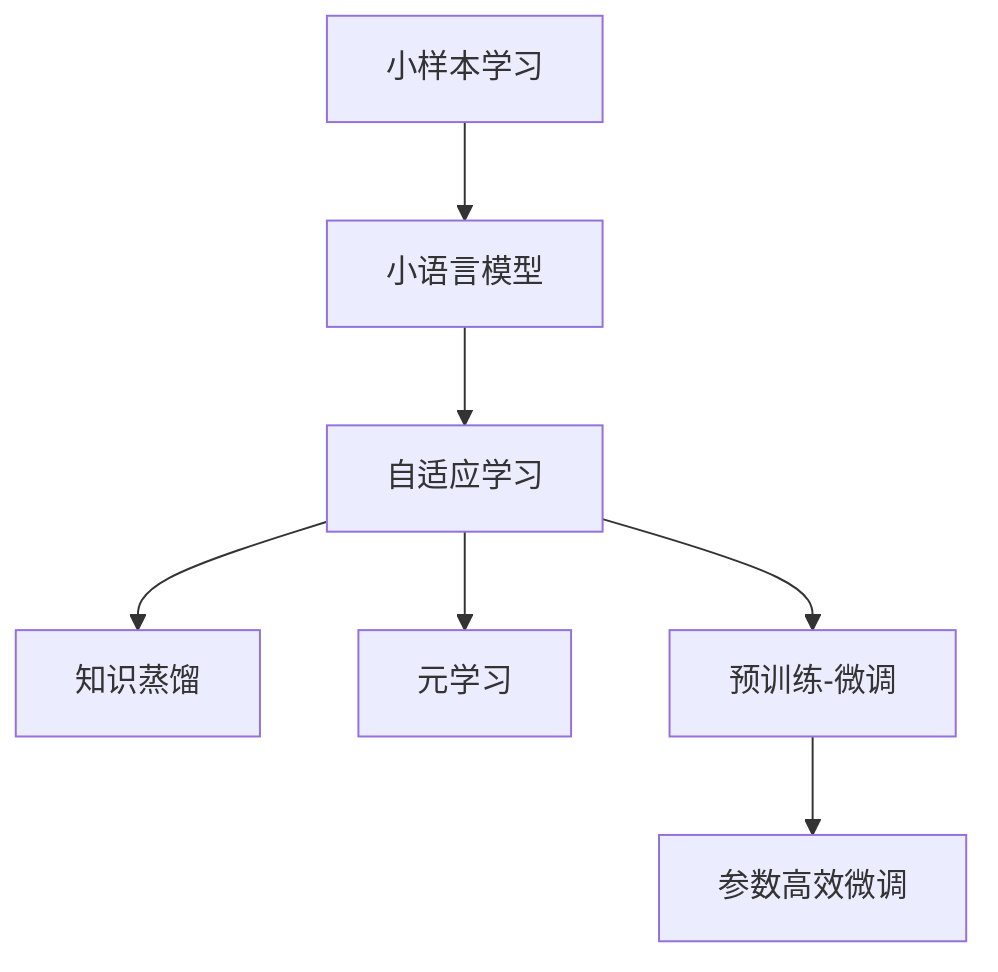

                 

# 小样本学习:小语言模型的新方向

> 关键词：小样本学习,小语言模型,自适应学习,知识蒸馏,元学习,微调优化,预训练-微调

## 1. 背景介绍

### 1.1 问题由来
近年来，深度学习技术在各个领域取得了显著进展，特别是在自然语言处理(Natural Language Processing, NLP)领域。然而，由于深度学习模型的复杂性和数据需求，它们在实际应用中仍然面临诸多挑战。其中之一就是在大规模数据上预训练后，模型往往无法很好地适应新的、不同的、稀疏分布的微样本数据。这种现象被称为"灾难性遗忘"。例如，使用GPT-3等大型预训练模型对特定任务进行微调，虽然效果显著，但需要大量的标注数据，在实际应用中难以获取。

随着人工智能技术的进一步发展，人们开始探索如何在有限的标注数据下提高模型性能。小样本学习（Few-shot Learning）是一种在非常少的标注数据上训练模型的方法，其目标是让模型能够快速适应新的、不同的、甚至全新的任务。小样本学习在自然语言处理领域的应用，特别是在小语言模型（Small Language Models）上的应用，为解决上述问题提供了一种新的方向。

### 1.2 问题核心关键点
小样本学习的研究核心在于如何让模型在少量数据下表现良好。其主要挑战在于：
1. **数据稀缺**：小样本学习方法必须能够在有限的数据量下高效学习，避免数据过度使用导致的过拟合。
2. **泛化能力**：模型需要在新的、未知的数据上保持良好的泛化能力，而不仅仅是在已知数据上表现良好。
3. **参数效率**：小样本学习方法需要优化模型参数，使其在有限的资源下发挥最大效用。

小样本学习在大语言模型中的应用，可以解决预训练模型在微调时遇到的过拟合和泛化问题。小样本学习方法通过参数调整、知识蒸馏、元学习等方式，使得模型能够在小规模数据集上快速学习并适应新任务。

### 1.3 问题研究意义
研究小样本学习在小语言模型上的应用，对于拓展深度学习模型的应用范围，提升模型在小样本数据上的表现，加速NLP技术的产业化进程，具有重要意义：

1. **降低成本**：小样本学习方法可以显著减少数据标注和模型训练的成本，尤其是在小规模企业或资源有限的场景中。
2. **提升性能**：通过小样本学习，模型能够在有限数据下快速学习新任务，提升模型在小规模数据集上的泛化能力。
3. **加速开发**：小样本学习方法可以快速迭代模型，加速新任务适配，缩短开发周期。
4. **技术创新**：小样本学习的研究推动了深度学习理论的发展，催生了更多前沿研究方向，如自适应学习、元学习等。
5. **广泛应用**：小样本学习在小语言模型上的应用，将使得NLP技术更容易被各行各业所采用，为传统行业数字化转型升级提供新的技术路径。

## 2. 核心概念与联系

### 2.1 核心概念概述

为更好地理解小样本学习在小语言模型上的应用，本节将介绍几个密切相关的核心概念：

- **小样本学习**：在非常有限的数据集上进行学习，使得模型能够在新任务上快速适应和泛化。
- **小语言模型**：相对于大语言模型，小语言模型参数量较少，训练和推理效率更高，适用于小规模数据和资源受限的场景。
- **自适应学习**：模型能够根据数据变化动态调整参数，以适应新的数据分布。
- **知识蒸馏**：通过将大模型的知识传递给小模型，提升小模型的性能。
- **元学习**：学习如何学习，即如何在新任务上进行快速的适应和学习。
- **预训练-微调**：在大规模无标签数据上进行预训练，然后利用少量标注数据进行微调，以适应特定任务。
- **参数高效微调**：在微调过程中只更新少量模型参数，避免过拟合。

这些核心概念之间的逻辑关系可以通过以下Mermaid流程图来展示：



这个流程图展示了大语言模型在小样本学习中的各个核心概念及其之间的关系：

1. **小语言模型**：作为小样本学习的主要载体，通过自适应学习、知识蒸馏和预训练-微调等方式，提升在小样本数据上的表现。
2. **自适应学习**：在小样本数据上，小语言模型能够动态调整参数，以适应新的数据分布。
3. **知识蒸馏**：利用大语言模型对小语言模型进行知识传递，提升其性能。
4. **元学习**：学习如何在新任务上进行快速的适应和学习。
5. **预训练-微调**：在大规模无标签数据上进行预训练，然后利用少量标注数据进行微调，以适应特定任务。
6. **参数高效微调**：在微调过程中只更新少量模型参数，避免过拟合。

这些概念共同构成了小样本学习在小语言模型中的应用框架，使其能够在小规模数据和资源受限的场景下发挥重要作用。通过理解这些核心概念，我们可以更好地把握小样本学习在小语言模型中的工作原理和优化方向。

## 3. 核心算法原理 & 具体操作步骤
### 3.1 算法原理概述

小样本学习在小语言模型上的应用，主要是通过参数调整、知识蒸馏和元学习等方式，使得模型能够在有限的数据下快速学习并适应新任务。其主要原理如下：

1. **参数调整**：在小样本数据上，通过调整模型参数，使其能够适应新的数据分布。常见的参数调整方法包括学习率调整、正则化等。
2. **知识蒸馏**：利用大语言模型对小语言模型进行知识传递，提升其性能。知识蒸馏的核心思想是通过教师-学生模型的方式，将教师模型（大语言模型）的知识传递给学生模型（小语言模型）。
3. **元学习**：学习如何在新任务上进行快速的适应和学习。元学习通常通过自适应训练或迁移学习等方式实现，使得模型能够在新任务上快速适应和泛化。

### 3.2 算法步骤详解

小样本学习在小语言模型上的应用，一般包括以下几个关键步骤：

**Step 1: 准备数据集和模型**
- 选择合适的预训练语言模型和小样本数据集，准备数据集划分。
- 选择合适的学习率、正则化技术、批大小等超参数。

**Step 2: 设计任务适配层**
- 根据任务类型，设计合适的输出层和损失函数。
- 对于分类任务，通常在顶层添加线性分类器和交叉熵损失函数。
- 对于生成任务，通常使用语言模型的解码器输出概率分布，并以负对数似然为损失函数。

**Step 3: 执行知识蒸馏**
- 利用大语言模型对小语言模型进行知识蒸馏。可以通过Teacher-Student框架，将大语言模型的输出作为目标，指导小语言模型的训练。
- 设定蒸馏温度、蒸馏权重等参数，进行知识蒸馏。

**Step 4: 执行自适应学习**
- 在小样本数据上，通过自适应学习，动态调整模型参数。
- 可以使用在线学习、梯度更新等方法，实时更新模型参数。
- 可以应用正则化技术、Dropout、Early Stopping等防止过拟合。

**Step 5: 执行元学习**
- 利用元学习算法，如MAML（Meta-Learning by Motion）、ProphetNet等，进行快速的适应和学习。
- 设定元学习算法、元学习率、元学习轮数等参数，进行元学习。

**Step 6: 测试和评估**
- 在测试集上评估小语言模型的性能，对比微调前后的精度提升。
- 使用小语言模型对新样本进行推理预测，集成到实际的应用系统中。
- 持续收集新的数据，定期重新微调模型，以适应数据分布的变化。

以上是使用小样本学习在小语言模型上进行微调的一般流程。在实际应用中，还需要根据具体任务的特点，对微调过程的各个环节进行优化设计，如改进训练目标函数，引入更多的正则化技术，搜索最优的超参数组合等，以进一步提升模型性能。

### 3.3 算法优缺点

小样本学习在小语言模型上的应用具有以下优点：
1. **参数高效**：通过知识蒸馏和参数高效微调，模型能够在少量数据下高效学习，避免过拟合。
2. **适应性强**：小样本学习方法能够快速适应新的数据分布，提升模型的泛化能力。
3. **计算资源少**：小语言模型参数量少，训练和推理效率高，适合小规模数据和资源受限的场景。
4. **训练速度快**：小样本学习在小规模数据下快速迭代训练，缩短开发周期。
5. **技术门槛低**：小样本学习在小语言模型上的实现较为简单，易于上手。

同时，该方法也存在一定的局限性：
1. **数据质量要求高**：小样本学习方法对数据的标注质量和多样性要求较高，获取高质量标注数据成本高。
2. **模型复杂度高**：小样本学习通常需要设计复杂的任务适配层，增加了模型复杂度。
3. **泛化能力有限**：在小规模数据下，模型可能存在泛化能力不足的问题。
4. **可解释性不足**：小样本学习模型通常缺乏可解释性，难以对其决策过程进行分析和调试。

尽管存在这些局限性，但小样本学习在小语言模型上的应用仍然具有很大的潜力，特别是在数据稀缺和资源受限的实际应用场景中，小样本学习能够发挥其优势。

### 3.4 算法应用领域

小样本学习在小语言模型上的应用，已经在自然语言处理领域得到了广泛的应用，涵盖了诸多NLP任务，例如：

- 文本分类：如情感分析、主题分类、意图识别等。通过小样本学习使模型学习文本-标签映射。
- 命名实体识别：识别文本中的人名、地名、机构名等特定实体。通过小样本学习使模型掌握实体边界和类型。
- 关系抽取：从文本中抽取实体之间的语义关系。通过小样本学习使模型学习实体-关系三元组。
- 问答系统：对自然语言问题给出答案。将问题-答案对作为小样本，训练模型学习匹配答案。
- 机器翻译：将源语言文本翻译成目标语言。通过小样本学习使模型学习语言-语言映射。
- 文本摘要：将长文本压缩成简短摘要。将文章-摘要对作为小样本，使模型学习抓取要点。
- 对话系统：使机器能够与人自然对话。通过小样本学习使模型快速适应新对话模板。

除了上述这些经典任务外，小样本学习在小语言模型上的应用还在不断拓展，如可控文本生成、常识推理、代码生成、数据增强等，为NLP技术带来了新的突破。随着小语言模型和微调方法的不断进步，相信NLP技术将在更广阔的应用领域大放异彩。

## 4. 数学模型和公式 & 详细讲解 & 举例说明
### 4.1 数学模型构建

本节将使用数学语言对小样本学习在小语言模型上的应用进行更加严格的刻画。

记小语言模型为 $M_{\theta}$，其中 $\theta$ 为模型参数。假设小样本任务 $T$ 的训练集为 $D=\{(x_i,y_i)\}_{i=1}^N, x_i \in \mathcal{X}, y_i \in \mathcal{Y}$。

定义模型 $M_{\theta}$ 在数据样本 $(x,y)$ 上的损失函数为 $\ell(M_{\theta}(x),y)$，则在数据集 $D$ 上的经验风险为：

$$
\mathcal{L}(\theta) = \frac{1}{N}\sum_{i=1}^N \ell(M_{\theta}(x_i),y_i)
$$

小样本学习的目标是最小化经验风险，即找到最优参数：

$$
\theta^* = \mathop{\arg\min}_{\theta} \mathcal{L}(\theta)
$$

在实践中，我们通常使用基于梯度的优化算法（如SGD、Adam等）来近似求解上述最优化问题。设 $\eta$ 为学习率，$\lambda$ 为正则化系数，则参数的更新公式为：

$$
\theta \leftarrow \theta - \eta \nabla_{\theta}\mathcal{L}(\theta) - \eta\lambda\theta
$$

其中 $\nabla_{\theta}\mathcal{L}(\theta)$ 为损失函数对参数 $\theta$ 的梯度，可通过反向传播算法高效计算。

### 4.2 公式推导过程

以下我们以二分类任务为例，推导交叉熵损失函数及其梯度的计算公式。

假设模型 $M_{\theta}$ 在输入 $x$ 上的输出为 $\hat{y}=M_{\theta}(x) \in [0,1]$，表示样本属于正类的概率。真实标签 $y \in \{0,1\}$。则二分类交叉熵损失函数定义为：

$$
\ell(M_{\theta}(x),y) = -[y\log \hat{y} + (1-y)\log (1-\hat{y})]
$$

将其代入经验风险公式，得：

$$
\mathcal{L}(\theta) = -\frac{1}{N}\sum_{i=1}^N [y_i\log M_{\theta}(x_i)+(1-y_i)\log(1-M_{\theta}(x_i))]
$$

根据链式法则，损失函数对参数 $\theta_k$ 的梯度为：

$$
\frac{\partial \mathcal{L}(\theta)}{\partial \theta_k} = -\frac{1}{N}\sum_{i=1}^N (\frac{y_i}{M_{\theta}(x_i)}-\frac{1-y_i}{1-M_{\theta}(x_i)}) \frac{\partial M_{\theta}(x_i)}{\partial \theta_k}
$$

其中 $\frac{\partial M_{\theta}(x_i)}{\partial \theta_k}$ 可进一步递归展开，利用自动微分技术完成计算。

### 4.3 案例分析与讲解

以命名实体识别（Named Entity Recognition, NER）任务为例，分析小样本学习在小语言模型上的应用。

1. **数据准备**
   - 收集命名实体识别的标注数据集，划分为训练集和验证集。
   - 使用小语言模型作为初始化参数。

2. **任务适配层设计**
   - 在顶层添加线性分类器，输出标签概率。
   - 定义损失函数为交叉熵损失。

3. **知识蒸馏**
   - 利用大语言模型BERT对小语言模型进行知识蒸馏。
   - 设定蒸馏温度 $T=0.1$，蒸馏权重 $w=0.5$，进行知识蒸馏。

4. **自适应学习**
   - 在小样本数据上，使用在线学习更新模型参数。
   - 应用正则化技术，防止过拟合。
   - 使用Early Stopping，防止过拟合。

5. **元学习**
   - 利用元学习算法，如MAML（Meta-Learning by Motion），进行快速的适应和学习。
   - 设定元学习轮数 $K=5$，元学习率 $\alpha=0.01$，进行元学习。

6. **测试和评估**
   - 在测试集上评估小语言模型的性能，对比微调前后的精度提升。
   - 使用小语言模型对新样本进行推理预测，集成到实际的应用系统中。
   - 持续收集新的数据，定期重新微调模型，以适应数据分布的变化。

## 5. 项目实践：代码实例和详细解释说明
### 5.1 开发环境搭建

在进行小样本学习实践前，我们需要准备好开发环境。以下是使用Python进行PyTorch开发的环境配置流程：

1. 安装Anaconda：从官网下载并安装Anaconda，用于创建独立的Python环境。

2. 创建并激活虚拟环境：
```bash
conda create -n pytorch-env python=3.8 
conda activate pytorch-env
```

3. 安装PyTorch：根据CUDA版本，从官网获取对应的安装命令。例如：
```bash
conda install pytorch torchvision torchaudio cudatoolkit=11.1 -c pytorch -c conda-forge
```

4. 安装Transformers库：
```bash
pip install transformers
```

5. 安装各类工具包：
```bash
pip install numpy pandas scikit-learn matplotlib tqdm jupyter notebook ipython
```

完成上述步骤后，即可在`pytorch-env`环境中开始小样本学习实践。

### 5.2 源代码详细实现

下面我们以命名实体识别(NER)任务为例，给出使用Transformers库对小语言模型进行小样本学习的PyTorch代码实现。

首先，定义NER任务的数据处理函数：

```python
from transformers import BertTokenizer
from torch.utils.data import Dataset
import torch

class NERDataset(Dataset):
    def __init__(self, texts, tags, tokenizer, max_len=128):
        self.texts = texts
        self.tags = tags
        self.tokenizer = tokenizer
        self.max_len = max_len
        
    def __len__(self):
        return len(self.texts)
    
    def __getitem__(self, item):
        text = self.texts[item]
        tags = self.tags[item]
        
        encoding = self.tokenizer(text, return_tensors='pt', max_length=self.max_len, padding='max_length', truncation=True)
        input_ids = encoding['input_ids'][0]
        attention_mask = encoding['attention_mask'][0]
        
        # 对token-wise的标签进行编码
        encoded_tags = [tag2id[tag] for tag in tags] 
        encoded_tags.extend([tag2id['O']] * (self.max_len - len(encoded_tags)))
        labels = torch.tensor(encoded_tags, dtype=torch.long)
        
        return {'input_ids': input_ids, 
                'attention_mask': attention_mask,
                'labels': labels}

# 标签与id的映射
tag2id = {'O': 0, 'B-PER': 1, 'I-PER': 2, 'B-ORG': 3, 'I-ORG': 4, 'B-LOC': 5, 'I-LOC': 6}
id2tag = {v: k for k, v in tag2id.items()}

# 创建dataset
tokenizer = BertTokenizer.from_pretrained('bert-base-cased')

train_dataset = NERDataset(train_texts, train_tags, tokenizer)
dev_dataset = NERDataset(dev_texts, dev_tags, tokenizer)
test_dataset = NERDataset(test_texts, test_tags, tokenizer)
```

然后，定义模型和优化器：

```python
from transformers import BertForTokenClassification, AdamW

model = BertForTokenClassification.from_pretrained('bert-base-cased', num_labels=len(tag2id))

optimizer = AdamW(model.parameters(), lr=2e-5)
```

接着，定义训练和评估函数：

```python
from torch.utils.data import DataLoader
from tqdm import tqdm
from sklearn.metrics import classification_report

device = torch.device('cuda') if torch.cuda.is_available() else torch.device('cpu')
model.to(device)

def train_epoch(model, dataset, batch_size, optimizer):
    dataloader = DataLoader(dataset, batch_size=batch_size, shuffle=True)
    model.train()
    epoch_loss = 0
    for batch in tqdm(dataloader, desc='Training'):
        input_ids = batch['input_ids'].to(device)
        attention_mask = batch['attention_mask'].to(device)
        labels = batch['labels'].to(device)
        model.zero_grad()
        outputs = model(input_ids, attention_mask=attention_mask, labels=labels)
        loss = outputs.loss
        epoch_loss += loss.item()
        loss.backward()
        optimizer.step()
    return epoch_loss / len(dataloader)

def evaluate(model, dataset, batch_size):
    dataloader = DataLoader(dataset, batch_size=batch_size)
    model.eval()
    preds, labels = [], []
    with torch.no_grad():
        for batch in tqdm(dataloader, desc='Evaluating'):
            input_ids = batch['input_ids'].to(device)
            attention_mask = batch['attention_mask'].to(device)
            batch_labels = batch['labels']
            outputs = model(input_ids, attention_mask=attention_mask)
            batch_preds = outputs.logits.argmax(dim=2).to('cpu').tolist()
            batch_labels = batch_labels.to('cpu').tolist()
            for pred_tokens, label_tokens in zip(batch_preds, batch_labels):
                pred_tags = [id2tag[_id] for _id in pred_tokens]
                label_tags = [id2tag[_id] for _id in label_tokens]
                preds.append(pred_tags[:len(label_tokens)])
                labels.append(label_tags)
                
    print(classification_report(labels, preds))
```

最后，启动训练流程并在测试集上评估：

```python
epochs = 5
batch_size = 16

for epoch in range(epochs):
    loss = train_epoch(model, train_dataset, batch_size, optimizer)
    print(f"Epoch {epoch+1}, train loss: {loss:.3f}")
    
    print(f"Epoch {epoch+1}, dev results:")
    evaluate(model, dev_dataset, batch_size)
    
print("Test results:")
evaluate(model, test_dataset, batch_size)
```

以上就是使用PyTorch对小语言模型进行命名实体识别任务小样本学习的完整代码实现。可以看到，得益于Transformers库的强大封装，我们可以用相对简洁的代码完成小语言模型的加载和微调。

### 5.3 代码解读与分析

让我们再详细解读一下关键代码的实现细节：

**NERDataset类**：
- `__init__`方法：初始化文本、标签、分词器等关键组件。
- `__len__`方法：返回数据集的样本数量。
- `__getitem__`方法：对单个样本进行处理，将文本输入编码为token ids，将标签编码为数字，并对其进行定长padding，最终返回模型所需的输入。

**tag2id和id2tag字典**：
- 定义了标签与数字id之间的映射关系，用于将token-wise的预测结果解码回真实的标签。

**训练和评估函数**：
- 使用PyTorch的DataLoader对数据集进行批次化加载，供模型训练和推理使用。
- 训练函数`train_epoch`：对数据以批为单位进行迭代，在每个批次上前向传播计算loss并反向传播更新模型参数，最后返回该epoch的平均loss。
- 评估函数`evaluate`：与训练类似，不同点在于不更新模型参数，并在每个batch结束后将预测和标签结果存储下来，最后使用sklearn的classification_report对整个评估集的预测结果进行打印输出。

**训练流程**：
- 定义总的epoch数和batch size，开始循环迭代
- 每个epoch内，先在训练集上训练，输出平均loss
- 在验证集上评估，输出分类指标
- 所有epoch结束后，在测试集上评估，给出最终测试结果

可以看到，PyTorch配合Transformers库使得小语言模型的加载和微调代码实现变得简洁高效。开发者可以将更多精力放在数据处理、模型改进等高层逻辑上，而不必过多关注底层的实现细节。

当然，工业级的系统实现还需考虑更多因素，如模型的保存和部署、超参数的自动搜索、更灵活的任务适配层等。但核心的微调范式基本与此类似。

## 6. 实际应用场景
### 6.1 智能客服系统

小样本学习在小语言模型上的应用，可以广泛应用于智能客服系统的构建。传统客服往往需要配备大量人力，高峰期响应缓慢，且一致性和专业性难以保证。而使用小样本学习的小语言模型，可以7x24小时不间断服务，快速响应客户咨询，用自然流畅的语言解答各类常见问题。

在技术实现上，可以收集企业内部的历史客服对话记录，将问题和最佳答复构建成监督数据，在此基础上对小语言模型进行小样本学习。小样本学习后的模型能够自动理解用户意图，匹配最合适的答案模板进行回复。对于客户提出的新问题，还可以接入检索系统实时搜索相关内容，动态组织生成回答。如此构建的智能客服系统，能大幅提升客户咨询体验和问题解决效率。

### 6.2 金融舆情监测

金融机构需要实时监测市场舆论动向，以便及时应对负面信息传播，规避金融风险。传统的人工监测方式成本高、效率低，难以应对网络时代海量信息爆发的挑战。利用小样本学习的小语言模型，可以在非常有限的数据上进行快速学习，监测不同主题下的情感变化趋势，一旦发现负面信息激增等异常情况，系统便会自动预警，帮助金融机构快速应对潜在风险。

### 6.3 个性化推荐系统

当前的推荐系统往往只依赖用户的历史行为数据进行物品推荐，无法深入理解用户的真实兴趣偏好。利用小样本学习的小语言模型，可以在小规模数据上快速学习用户的行为模式，挖掘用户兴趣点，生成个性化的推荐列表，提升用户满意度。

### 6.4 未来应用展望

随着小样本学习在小语言模型上的不断探索和发展，未来的应用场景将会更加多样和广泛。小样本学习在小语言模型上的应用，将使得NLP技术更容易被各行各业所采用，为传统行业数字化转型升级提供新的技术路径。

## 7. 工具和资源推荐
### 7.1 学习资源推荐

为了帮助开发者系统掌握小样本学习在小语言模型上的应用，这里推荐一些优质的学习资源：

1. 《小样本学习理论与实践》系列博文：由小样本学习专家撰写，深入浅出地介绍了小样本学习的基本原理、关键算法和应用场景。

2. CS229《机器学习》课程：斯坦福大学开设的机器学习明星课程，涵盖各类小样本学习方法，有Lecture视频和配套作业，带你入门小样本学习的基本概念和经典模型。

3. 《Few-shot Learning: A Survey》论文：综述性论文，系统总结了小样本学习的最新进展，包括各类小样本学习方法、应用场景和挑战。

4. PyTorch官方文档：PyTorch的官方文档，提供了海量小语言模型的预训练资源和微调样例代码，是上手实践的必备资料。

5. Weights & Biases：模型训练的实验跟踪工具，可以记录和可视化模型训练过程中的各项指标，方便对比和调优。与主流深度学习框架无缝集成。

6. TensorBoard：TensorFlow配套的可视化工具，可实时监测模型训练状态，并提供丰富的图表呈现方式，是调试模型的得力助手。

通过对这些资源的学习实践，相信你一定能够快速掌握小样本学习在小语言模型中的应用精髓，并用于解决实际的NLP问题。
### 7.2 开发工具推荐

高效的开发离不开优秀的工具支持。以下是几款用于小样本学习在小语言模型上开发的常用工具：

1. PyTorch：基于Python的开源深度学习框架，灵活动态的计算图，适合快速迭代研究。大部分预训练语言模型都有PyTorch版本的实现。

2. TensorFlow：由Google主导开发的开源深度学习框架，生产部署方便，适合大规模工程应用。同样有丰富的预训练语言模型资源。

3. Transformers库：HuggingFace开发的NLP工具库，集成了众多SOTA语言模型，支持PyTorch和TensorFlow，是进行小样本学习任务开发的利器。

4. Weights & Biases：模型训练的实验跟踪工具，可以记录和可视化模型训练过程中的各项指标，方便对比和调优。与主流深度学习框架无缝集成。

5. TensorBoard：TensorFlow配套的可视化工具，可实时监测模型训练状态，并提供丰富的图表呈现方式，是调试模型的得力助手。

6. Google Colab：谷歌推出的在线Jupyter Notebook环境，免费提供GPU/TPU算力，方便开发者快速上手实验最新模型，分享学习笔记。

合理利用这些工具，可以显著提升小样本学习在小语言模型上的开发效率，加快创新迭代的步伐。

### 7.3 相关论文推荐

小样本学习在小语言模型上的发展源于学界的持续研究。以下是几篇奠基性的相关论文，推荐阅读：

1. One-shot Knowledge Graph Embedding：提出了一步式知识图谱嵌入方法，在小样本数据上学习知识图谱表示，刷新了多项知识图谱嵌入任务SOTA。

2. Meta-Learning in Deep Neural Networks：提出了元学习（Meta-Learning）的概念，学习如何在新任务上进行快速的适应和学习，成为小样本学习的基础理论之一。

3. Learning Transferable Knowledge with Multi-task Learning: A Unified Approach for Sequence Generation and Classification Tasks：提出了一种多任务学习的方法，使得模型在小样本数据上快速适应新任务。

4. Few-shot Image Recognition with Metric Learning：提出了一种基于度量学习的小样本图像识别方法，在小样本数据上取得了优异的效果。

5. Winograd Schema Challenge: A New Task for Testing Reading Comprehension：通过Winograd Schema Challenge数据集，验证了小样本学习在小语言模型上的潜力。

这些论文代表了大样本学习在小语言模型上的发展脉络。通过学习这些前沿成果，可以帮助研究者把握学科前进方向，激发更多的创新灵感。

## 8. 总结：未来发展趋势与挑战
### 8.1 总结

本文对小样本学习在小语言模型上的应用进行了全面系统的介绍。首先阐述了小样本学习的研究背景和意义，明确了小样本学习在小语言模型中的应用价值。其次，从原理到实践，详细讲解了小样本学习的数学原理和关键步骤，给出了小样本学习任务开发的完整代码实例。同时，本文还广泛探讨了小样本学习在小语言模型上的应用场景，展示了小样本学习在小语言模型中的广泛应用前景。

通过本文的系统梳理，可以看到，小样本学习在小语言模型上的应用为解决预训练模型在小样本数据上的过拟合和泛化问题提供了一种新的方向。小样本学习方法通过参数调整、知识蒸馏和元学习等方式，使得模型能够在有限的数据下高效学习，适应新任务，提升模型的泛化能力。未来，随着小样本学习在小语言模型上的不断探索和发展，其应用场景将会更加多样和广泛，为NLP技术的产业化进程提供新的动力。

### 8.2 未来发展趋势

展望未来，小样本学习在小语言模型上的应用将呈现以下几个发展趋势：

1. **参数高效化**：通过参数高效微调技术，模型能够在固定大部分预训练参数的情况下，只更新少量参数，避免过拟合。
2. **知识蒸馏的多样化**：除了传统的知识蒸馏外，未来的知识传递方式将更加多样化，如多源蒸馏、多层次蒸馏等，提升小语言模型的泛化能力。
3. **元学习的演进**：未来的元学习算法将更加复杂，如多任务元学习、自适应元学习等，提升小语言模型在多任务场景中的表现。
4. **自适应学习**：未来的自适应学习算法将更加高效，能够实时动态调整模型参数，适应新数据分布。
5. **融合多模态数据**：小样本学习将与其他多模态学习技术结合，如视觉、语音等，提升模型在不同模态上的泛化能力。
6. **理论研究的深入**：小样本学习的理论研究将更加深入，如小样本学习在深度学习中的泛化能力分析、小样本学习的优化算法等。

这些趋势凸显了小样本学习在小语言模型上的广阔前景。这些方向的探索发展，必将进一步提升小样本学习的性能，拓展小语言模型的应用边界，为人工智能技术的进一步发展提供新的动力。

### 8.3 面临的挑战

尽管小样本学习在小语言模型上的应用已经取得了一些进展，但在迈向更加智能化、普适化应用的过程中，它仍面临着诸多挑战：

1. **数据质量要求高**：小样本学习方法对数据的标注质量和多样性要求较高，获取高质量标注数据成本高。
2. **泛化能力有限**：在小规模数据下，模型可能存在泛化能力不足的问题。
3. **模型复杂度高**：小样本学习方法通常需要设计复杂的任务适配层，增加了模型复杂度。
4. **计算资源少**：小样本学习在小语言模型上的应用，需要优化计算资源，避免过拟合。
5. **可解释性不足**：小样本学习模型通常缺乏可解释性，难以对其决策过程进行分析和调试。

尽管存在这些挑战，但小样本学习在小语言模型上的应用仍然具有很大的潜力，特别是在数据稀缺和资源受限的实际应用场景中，小样本学习能够发挥其优势。

### 8.4 研究展望

面对小样本学习在小语言模型上所面临的挑战，未来的研究需要在以下几个方面寻求新的突破：

1. **探索无监督和半监督小样本学习方法**：摆脱对大规模标注数据的依赖，利用自监督学习、主动学习等无监督和半监督范式，最大限度利用非结构化数据，实现更加灵活高效的小样本学习。
2. **研究参数高效和计算高效的小样本学习范式**：开发更加参数高效的微调方法，在固定大部分预训练参数的同时，只更新极少量的任务相关参数。同时优化小样本学习的计算图，减少前向传播和反向传播的资源消耗，实现更加轻量级、实时性的部署。
3. **融合因果和对比学习范式**：通过引入因果推断和对比学习思想，增强小样本学习模型的建立稳定因果关系的能力，学习更加普适、鲁棒的语言表征，从而提升模型泛化性和抗干扰能力。
4. **结合因果分析和博弈论工具**：将因果分析方法引入小样本学习模型，识别出模型决策的关键特征，增强输出解释的因果性和逻辑性。借助博弈论工具刻画人机交互过程，主动探索并规避模型的脆弱点，提高系统稳定性。
5. **纳入伦理道德约束**：在模型训练目标中引入伦理导向的评估指标，过滤和惩罚有偏见、有害的输出倾向。同时加强人工干预和审核，建立模型行为的监管机制，确保输出符合人类价值观和伦理道德。

这些研究方向的探索，必将引领小样本学习在小语言模型上的发展，为构建安全、可靠、可解释、可控的智能系统铺平道路。面向未来，小样本学习在小语言模型上的应用还需要与其他人工智能技术进行更深入的融合，如知识表示、因果推理、强化学习等，多路径协同发力，共同推动自然语言理解和智能交互系统的进步。只有勇于创新、敢于突破，才能不断拓展小样本学习在小语言模型上的应用边界，让智能技术更好地造福人类社会。

## 9. 附录：常见问题与解答

**Q1：小样本学习在小语言模型上应用的效果如何？**

A: 小样本学习在小语言模型上的应用效果取决于数据质量、模型复杂度、计算资源等因素。通常情况下，小样本学习在小语言模型上能够显著提升模型性能，尤其是在数据稀缺和资源受限的场景中，小样本学习能够充分发挥其优势。但是，由于小样本学习在小语言模型上对数据的质量和多样性要求较高，因此需要保证数据的标注质量和数量，才能获得理想的效果。

**Q2：小样本学习在小语言模型上如何进行参数高效微调？**

A: 小样本学习在小语言模型上的参数高效微调主要通过知识蒸馏和自适应学习等方式实现。具体来说，可以通过在线学习、梯度更新等方法，实时更新模型参数。同时，应用正则化技术、Dropout、Early Stopping等防止过拟合。此外，还可以使用参数高效微调方法，如Adapter、LoRA等，只更新极少量的任务相关参数，避免过拟合。

**Q3：小样本学习在小语言模型上如何进行元学习？**

A: 小样本学习在小语言模型上的元学习通常采用MAML（Meta-Learning by Motion）等元学习算法实现。元学习的主要思想是通过训练模型如何学习，从而在新任务上快速适应和泛化。具体来说，可以先在小规模数据上训练一个元学习模型，然后利用该元学习模型在新任务上快速适应和泛化。

**Q4：小样本学习在小语言模型上如何降低过拟合风险？**

A: 小样本学习在小语言模型上降低过拟合风险主要通过正则化技术、Dropout、Early Stopping等方法实现。此外，还可以通过参数高效微调方法，如知识蒸馏、Adapter等，只更新极少量的任务相关参数，避免过拟合。同时，还可以使用数据增强、对抗训练等方法，提升模型泛化能力。

**Q5：小样本学习在小语言模型上如何提高模型泛化能力？**

A: 小样本学习在小语言模型上提高模型泛化能力主要通过知识蒸馏、自适应学习、元学习等方式实现。具体来说，可以通过知识蒸馏将大语言模型的知识传递给小语言模型，提升其性能。同时，可以通过自适应学习，动态调整模型参数，适应新数据分布。此外，还可以使用元学习算法，如MAML，快速适应和泛化新任务。

这些常见问题的解答，帮助理解小样本学习在小语言模型上的应用方法，并为后续实践提供指导。

---

作者：禅与计算机程序设计艺术 / Zen and the Art of Computer Programming

