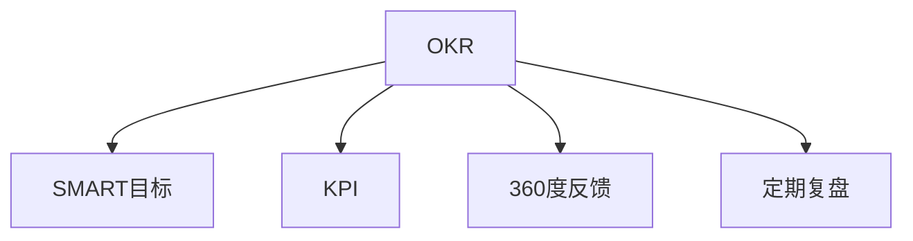

                 

# 巴菲特目标管理法则的团队应用

巴菲特目标管理法则（OKR - Objectives and Key Results）是一种高效的管理和团队协作方法。它强调明确目标（Objectives）和关键结果（Key Results），将团队资源聚焦于最重要的任务上，并通过定期的反馈和评估来促进团队的持续进步。本文将深入探讨巴菲特目标管理法则的核心原理，分析其在团队中的应用，并结合实际案例进行详细讲解，以期为团队管理提供实用的见解和策略。

## 1. 背景介绍

### 1.1 问题由来
现代企业的团队管理面临着越来越多的挑战：目标不明确、资源分散、协作效率低下、成果难以量化等。这些问题直接导致了团队成员的工作投入度下降，创新能力减弱，最终影响企业竞争力和盈利能力。

为了应对这些挑战，巴菲特的OKR方法应运而生。OKR方法的核心在于明确目标（Objectives）和关键结果（Key Results），通过定量的关键结果指标来评估目标的达成情况，并鼓励团队成员积极参与目标设定和评估过程。这种方法不仅能够提升团队的管理效率，还能够增强团队成员的责任感和使命感，推动企业持续发展。

### 1.2 问题核心关键点
OKR方法的关键点在于目标和结果的明确设定、定期的反馈和评估、以及全员的参与。其核心步骤包括：
1. 设定明确的目标。目标需要具体、可量化，且具有挑战性。
2. 制定关键结果。关键结果是对目标达成情况的定量描述，需要具有可测量性和时间限制。
3. 全员参与。所有团队成员都需要参与目标设定和评估过程，确保团队共识。
4. 定期反馈。每周或每月进行一次目标进展汇报，及时调整策略，确保目标达成。

## 2. 核心概念与联系

### 2.1 核心概念概述

为了更好地理解OKR方法，本节将介绍几个密切相关的核心概念：

- **OKR（目标与关键结果）**：OKR方法的核心，通过设定明确的目标和关键结果，确保团队聚焦于最重要的任务上，并通过定期的反馈和评估来推动团队进步。

- **SMART目标**：目标的设定应具备五项原则：Specific（具体的）、Measurable（可衡量的）、Achievable（可实现的）、Relevant（相关的）、Time-bound（有时间限制的）。

- **KPI（关键绩效指标）**：与关键结果类似，KPI是用来衡量目标达成情况的重要指标，但更侧重于短期和定量评估。

- **360度反馈**：通过收集来自不同角度的反馈，帮助团队成员全面了解自己的表现和改进空间。

- **定期复盘**：每周或每月对目标进展进行复盘，评估目标达成情况，总结经验和教训，为下一步工作提供指导。

这些核心概念之间的逻辑关系可以通过以下Mermaid流程图来展示：



这个流程图展示izedOKR的核心概念及其之间的关系：

1. OKR方法通过设定SMART目标，帮助团队明确方向和焦点。
2. 关键结果和KPI指标用于量化目标达成情况，确保目标可衡量。
3. 360度反馈和定期复盘机制用于持续改进，推动团队不断进步。

## 3. 核心算法原理 & 具体操作步骤
### 3.1 算法原理概述

OKR方法通过设定明确的目标和关键结果，将团队资源聚焦于最重要的任务上，并通过定期的反馈和评估来推动团队持续进步。其核心思想是：

1. **明确目标**：设定清晰、可量化的目标，确保团队成员对目标有共同的理解。
2. **设定关键结果**：制定具体的、可测量的关键结果，帮助团队衡量目标达成情况。
3. **定期反馈**：通过每周或每月的进展汇报和复盘，及时调整策略，确保目标达成。

OKR方法的有效性在于其灵活性、透明性和激励机制。通过设定明确的目标和关键结果，OKR方法能够帮助团队聚焦于最重要的任务，提升工作效率和成果质量。同时，通过定期的反馈和评估，OKR方法能够及时调整策略，确保团队始终在正确的轨道上前进。

### 3.2 算法步骤详解

以下是OKR方法的具体操作步骤：

**Step 1: 设定目标（Objectives）**

1. **明确公司愿景**：公司高层根据企业愿景和战略目标，制定总体目标。
2. **设定部门目标**：各部门负责人根据公司愿景和总体目标，设定部门目标。
3. **设定个人目标**：团队成员根据部门目标，设定个人目标。

**Step 2: 制定关键结果（Key Results）**

1. **定义目标细节**：对每个目标进行细化，明确具体的任务和要求。
2. **设定关键指标**：为每个目标设定可量化的关键结果，如销售额、市场份额、用户满意度等。
3. **确定责任人**：为每个关键结果确定负责人，确保责任明确。

**Step 3: 定期反馈和评估**

1. **每周/每月汇报**：团队成员定期汇报目标进展，分享成功经验和改进建议。
2. **定期复盘**：每周或每月进行一次目标复盘，评估目标达成情况，调整策略。
3. **持续改进**：根据复盘结果，制定改进措施，推动团队持续进步。

**Step 4: 全员参与和激励**

1. **全员参与**：确保所有团队成员参与目标设定和评估过程，增强团队共识。
2. **透明公开**：所有目标和进展信息公开透明，确保全员知情和协作。
3. **激励机制**：通过奖励和表彰，激励团队成员积极参与和贡献。

### 3.3 算法优缺点

OKR方法具有以下优点：
1. **明确方向**：通过设定明确的目标和关键结果，帮助团队聚焦于最重要的任务。
2. **提升效率**：通过定期反馈和评估，及时调整策略，确保目标达成。
3. **全员参与**：增强团队共识和责任感，推动团队持续进步。

同时，OKR方法也存在一些局限性：
1. **目标设定复杂**：目标和关键结果的设定需要较高的管理水平和团队协作能力。
2. **执行难度大**：关键结果的衡量和反馈需要大量时间和精力，可能影响日常工作。
3. **透明性问题**：部分团队可能存在信息不对称，影响目标设定的公正性和执行效果。
4. **激励不足**：仅通过奖励和表彰可能无法完全激发团队成员的积极性。

尽管存在这些局限性，但就目前而言，OKR方法仍是一种高效的管理和团队协作方法。未来相关研究的重点在于如何进一步简化目标设定和执行过程，增强透明度和激励机制，确保OKR方法能够更好地服务于团队管理。

### 3.4 算法应用领域

OKR方法在各种类型的团队管理中都有广泛的应用，特别是那些需要进行复杂协作和资源分配的领域：

- **软件开发团队**：通过设定明确的技术目标和交付指标，提升软件开发效率和质量。
- **市场营销团队**：设定明确的销售目标和市场份额指标，提升市场竞争力和品牌影响力。
- **运营管理团队**：设定明确的运营效率和成本控制目标，提升企业盈利能力。
- **项目管理团队**：设定明确的项目进度和质量目标，提升项目管理效率和成果质量。
- **人力资源管理**：设定明确的人才招聘和员工发展目标，提升人力资源管理水平。

除了上述这些经典应用外，OKR方法也在创新性地应用到更多领域中，如医疗、教育、政府治理等，为团队管理带来新的思路和工具。随着OKR方法的不断演进，相信其在更多场景中的应用前景将更加广阔。

## 4. 数学模型和公式 & 详细讲解  
### 4.1 数学模型构建

为了更好地理解OKR方法，我们将其核心步骤转化为数学模型。

设公司目标为 $O$，部门目标为 $O_1, O_2, \ldots, O_n$，个人目标为 $T_1, T_2, \ldots, T_m$。每个目标 $O_i$ 或 $T_j$ 对应的关键结果为 $KR_{i,j}$，负责人为 $R_{i,j}$。

目标和关键结果的关系可以表示为：

$$
O = O_1 + O_2 + \ldots + O_n
$$

每个目标的具体衡量指标为：

$$
KR_{i,j} = \begin{cases}
0 & \text{如果} \quad T_j \text{未达成} \\
\text{目标值} & \text{如果} \quad T_j \text{部分达成} \\
1 & \text{如果} \quad T_j \text{完全达成}
\end{cases}
$$

### 4.2 公式推导过程

在OKR方法中，目标和关键结果的关系可以表示为线性组合：

$$
O = \sum_{i=1}^n \omega_i O_i
$$

其中 $\omega_i$ 为部门目标 $O_i$ 的权重，满足 $\sum_{i=1}^n \omega_i = 1$。

对于个人目标 $T_j$，设其对应的关键结果指标为 $KR_j = \sum_{i=1}^n \alpha_{i,j} KR_{i,j}$，其中 $\alpha_{i,j}$ 为关键结果 $KR_{i,j}$ 对目标 $T_j$ 的权重，满足 $\sum_{i=1}^n \alpha_{i,j} = 1$。

目标达成的总得分 $S$ 可以表示为：

$$
S = \sum_{i=1}^n \omega_i KR_{i,j}
$$

通过目标得分 $S$，可以全面衡量团队目标的达成情况，并进行定期反馈和评估。

### 4.3 案例分析与讲解

为了更好地理解OKR方法，我们可以举一个具体的案例进行详细讲解。

假设一家软件公司的总体目标是提升产品质量。该公司的研发团队负责实现此目标，可以将其拆分为多个部门目标，如代码质量提升、测试覆盖率提升、性能优化等。每个部门目标又可以进一步拆分为多个个人目标，如代码质量监控、自动化测试等。

以代码质量监控为例，可以设定如下目标和关键结果：

- 目标：提升代码质量。
- 关键结果：代码质量监控指标提升20%。
- 负责人：张三。
- 关键指标：代码质量评分。

每周，张三需要对目标进展进行汇报，记录代码质量评分的变化情况。通过定期的反馈和评估，团队可以及时调整策略，确保目标达成。

## 5. 项目实践：代码实例和详细解释说明
### 5.1 开发环境搭建

在进行OKR项目实践前，我们需要准备好开发环境。以下是使用Python进行OKR系统开发的环境配置流程：

1. 安装Anaconda：从官网下载并安装Anaconda，用于创建独立的Python环境。

2. 创建并激活虚拟环境：
```bash
conda create -n okr-env python=3.8 
conda activate okr-env
```

3. 安装必要的Python包：
```bash
pip install pandas numpy jupyter notebook
```

4. 安装Web框架Flask：用于开发OKR管理系统的Web前端。
```bash
pip install flask
```

5. 安装MySQL数据库：用于存储OKR数据。
```bash
sudo apt-get install mysql-server
```

6. 安装Flask-SQLAlchemy：用于连接MySQL数据库。
```bash
pip install flask-sqlalchemy
```

完成上述步骤后，即可在`okr-env`环境中开始OKR系统的开发。

### 5.2 源代码详细实现

下面我们以一个简单的OKR管理系统的实现为例，展示如何使用Python和Flask构建OKR应用。

首先，定义OKR的模型类：

```python
from flask_sqlalchemy import SQLAlchemy

db = SQLAlchemy()

class Objective(db.Model):
    id = db.Column(db.Integer, primary_key=True)
    name = db.Column(db.String(256), nullable=False)
    description = db.Column(db.Text, nullable=True)
    created_at = db.Column(db.DateTime, nullable=False, default=datetime.utcnow)
    updated_at = db.Column(db.DateTime, nullable=False, default=datetime.utcnow, onupdate=datetime.utcnow)
    key_results = db.relationship('KeyResult', backref='objective', lazy='dynamic')

class KeyResult(db.Model):
    id = db.Column(db.Integer, primary_key=True)
    name = db.Column(db.String(256), nullable=False)
    value = db.Column(db.String(256), nullable=False)
    created_at = db.Column(db.DateTime, nullable=False, default=datetime.utcnow)
    updated_at = db.Column(db.DateTime, nullable=False, default=datetime.utcnow, onupdate=datetime.utcnow)
    objective_id = db.Column(db.Integer, db.ForeignKey('objective.id'))
```

然后，定义OKR的API接口：

```python
from flask import Flask, request, jsonify
from flask_sqlalchemy import SQLAlchemy
from datetime import datetime

app = Flask(__name__)
db = SQLAlchemy(app)

@app.route('/objectives', methods=['GET', 'POST', 'PUT', 'DELETE'])
def manage_objectives():
    if request.method == 'GET':
        objectives = Objective.query.all()
        return jsonify([obj.to_dict() for obj in objectives])
    elif request.method == 'POST':
        obj = Objective(name=request.json['name'], description=request.json['description'])
        db.session.add(obj)
        db.session.commit()
        return jsonify(obj.to_dict()), 201
    elif request.method == 'PUT':
        obj = Objective.query.get(request.json['id'])
        if obj:
            obj.name = request.json['name']
            obj.description = request.json['description']
            db.session.commit()
            return jsonify(obj.to_dict())
    elif request.method == 'DELETE':
        obj = Objective.query.get(request.json['id'])
        if obj:
            db.session.delete(obj)
            db.session.commit()
            return jsonify({'message': 'Objective deleted'})

@app.route('/key_results', methods=['GET', 'POST', 'PUT', 'DELETE'])
def manage_key_results():
    if request.method == 'GET':
        key_results = KeyResult.query.all()
        return jsonify([result.to_dict() for result in key_results])
    elif request.method == 'POST':
        result = KeyResult(name=request.json['name'], value=request.json['value'], objective_id=request.json['objective_id'])
        db.session.add(result)
        db.session.commit()
        return jsonify(result.to_dict()), 201
    elif request.method == 'PUT':
        result = KeyResult.query.get(request.json['id'])
        if result:
            result.name = request.json['name']
            result.value = request.json['value']
            db.session.commit()
            return jsonify(result.to_dict())
    elif request.method == 'DELETE':
        result = KeyResult.query.get(request.json['id'])
        if result:
            db.session.delete(result)
            db.session.commit()
            return jsonify({'message': 'Key Result deleted'})

if __name__ == '__main__':
    app.run(debug=True)
```

这是一个基本的OKR管理系统，提供了对目标和关键结果的CRUD操作。在实际应用中，还需要对模型进行更复杂的定义和扩展，如添加用户角色、权限控制、目标和关键结果的评分系统等。

### 5.3 代码解读与分析

让我们再详细解读一下关键代码的实现细节：

**Objective和KeyResult类**：
- `Objective`类代表OKR中的目标，包含目标名称、描述、创建和更新时间、以及关联的关键结果列表。
- `KeyResult`类代表目标的关键结果，包含关键结果名称、值、创建和更新时间，以及关联的目标ID。

**Flask API接口**：
- 使用Flask的RESTful风格定义API接口，支持GET、POST、PUT、DELETE操作。
- 使用SQLAlchemy与MySQL数据库连接，实现对目标和关键结果的持久化存储。
- 返回JSON格式的响应，方便客户端接收和处理。

**运行环境搭建**：
- 使用Anaconda创建虚拟环境，保证开发环境的隔离和一致性。
- 使用MySQL数据库存储OKR数据，提供稳定可靠的数据存储方案。
- 使用Flask-SQLAlchemy连接MySQL，简化数据库操作。

在实际应用中，还需要对代码进行更多的扩展和优化，以满足具体的业务需求。

## 6. 实际应用场景
### 6.1 智能客服系统

基于OKR的目标管理方法，可以应用于智能客服系统的构建。传统客服往往需要配备大量人力，高峰期响应缓慢，且一致性和专业性难以保证。通过OKR方法，可以明确客服团队的目标和关键结果，提升客服效率和服务质量。

在技术实现上，可以收集企业内部的历史客服对话记录，将问题和最佳答复构建成监督数据，在此基础上对客服团队进行OKR目标设定和关键结果评估。通过定期的反馈和评估，团队可以及时调整客服策略，提升客服效果。

### 6.2 金融舆情监测

金融机构需要实时监测市场舆论动向，以便及时应对负面信息传播，规避金融风险。通过OKR方法，可以明确金融舆情监测的目标和关键结果，提升舆情监测的效率和准确性。

具体而言，可以设定如舆情监测精度、舆情分析速度、舆情报告及时性等关键结果指标，确保金融舆情监测的高效运行。通过定期的复盘和反馈，团队可以及时调整监测策略，提高舆情监测的准确性和及时性。

### 6.3 个性化推荐系统

当前的推荐系统往往只依赖用户的历史行为数据进行物品推荐，无法深入理解用户的真实兴趣偏好。通过OKR方法，可以明确个性化推荐系统的目标和关键结果，提升推荐系统的个性化程度。

在技术实现上，可以设定如推荐精度、推荐覆盖率、用户满意度等关键结果指标，确保个性化推荐系统的有效运行。通过定期的复盘和反馈，团队可以及时调整推荐策略，提高推荐系统的质量和用户满意度。

### 6.4 未来应用展望

随着OKR方法的发展，其在更多领域的应用前景将更加广阔：

- **智慧医疗领域**：通过明确医疗团队的目标和关键结果，提升医疗服务的智能化水平，辅助医生诊疗，加速新药开发进程。
- **智能教育领域**：设定教育目标和关键结果，因材施教，促进教育公平，提高教学质量。
- **智慧城市治理**：通过OKR方法，构建更安全、高效的未来城市，提升城市管理的自动化和智能化水平。
- **企业生产管理**：设定生产目标和关键结果，提升生产效率和质量，降低成本。

总之，OKR方法作为一种高效的管理和团队协作方法，将在更多领域得到应用，为传统行业数字化转型升级提供新的工具和思路。

## 7. 工具和资源推荐
### 7.1 学习资源推荐

为了帮助开发者系统掌握OKR方法的理论基础和实践技巧，这里推荐一些优质的学习资源：

1. **《OKR：目标与关键结果管理》**：书籍详细介绍了OKR方法的核心原理和实际应用，适合初学者和实战者参考。
2. **《OKR工作手册》**：提供了详细的OKR设置和实施指南，适合团队管理和项目管理。
3. **《OKR管理实战》**：文章和案例分析，帮助理解OKR方法在不同行业中的应用和效果。
4. **OKR培训课程**：各大培训机构提供的OKR培训课程，系统讲解OKR原理和实施方法。
5. **OKR论坛和社区**：如OKR中国、OKR USA等，提供丰富的交流和讨论平台，分享OKR实践经验和成功案例。

通过对这些资源的学习实践，相信你一定能够快速掌握OKR方法的理论基础和实践技巧，并用于解决实际的团队管理问题。

### 7.2 开发工具推荐

高效的开发离不开优秀的工具支持。以下是几款用于OKR系统开发的常用工具：

1. **Python**：Python语言以其简洁易学、功能强大著称，是OKR系统开发的理想选择。
2. **Flask**：轻量级Web框架，易于上手，适合快速迭代和原型开发。
3. **SQLAlchemy**：ORM框架，简化数据库操作，提供稳定可靠的数据存储方案。
4. **MySQL**：稳定可靠的关系型数据库，适合存储和查询大量结构化数据。
5. **Git**：版本控制系统，支持团队协作和代码管理。
6. **Jira**：项目管理工具，支持OKR目标设定和任务分配。
7. **Slack**：即时通讯工具，提供团队协作和沟通平台。

合理利用这些工具，可以显著提升OKR系统的开发效率，加快创新迭代的步伐。

### 7.3 相关论文推荐

OKR方法的发展源于学界的持续研究。以下是几篇奠基性的相关论文，推荐阅读：

1. **OKR：A Management System for Agile Business**：论文介绍了OKR方法的核心原理和应用场景，提出了OKR管理的理论框架。
2. **OKR: A Lean Management System**：论文探讨了OKR方法在敏捷管理中的应用，提出了OKR系统设计的最佳实践。
3. **OKR Implementation: A Case Study**：论文通过实际案例，展示了OKR方法在企业中的应用效果和改进措施。
4. **OKR: From Theory to Practice**：论文总结了OKR方法的研究进展和实践经验，提出了OKR方法的发展方向。
5. **OKR: A Systematic Review**：论文对OKR方法进行了系统回顾，总结了OKR研究的理论基础和实际应用。

这些论文代表了大模型微调技术的发展脉络。通过学习这些前沿成果，可以帮助研究者把握学科前进方向，激发更多的创新灵感。

## 8. 总结：未来发展趋势与挑战

### 8.1 总结

本文对OKR方法的核心原理和实际应用进行了全面系统的介绍。通过设定明确的目标和关键结果，OKR方法帮助团队聚焦于最重要的任务，并通过定期的反馈和评估，推动团队持续进步。同时，通过全员参与和激励机制，增强团队共识和责任感，提升团队的整体绩效。

通过本文的系统梳理，可以看到，OKR方法作为一种高效的管理和团队协作方法，正在成为企业管理的核心工具。OKR方法的成功实施，需要管理者的深思熟虑和团队的共同努力，但一旦实施得当，将能够显著提升团队的协作效率和工作质量。

### 8.2 未来发展趋势

展望未来，OKR方法将呈现以下几个发展趋势：

1. **数据驱动的OKR管理**：通过数据分析和可视化，帮助管理者更好地理解团队表现，及时调整策略。
2. **跨团队协作的OKR系统**：打破部门壁垒，促进跨团队协作和知识共享，提升整体绩效。
3. **智能化OKR系统**：引入人工智能和机器学习技术，自动生成目标和关键结果，提升OKR管理的智能化水平。
4. **社交化OKR系统**：结合社交网络技术，增强团队协作和沟通，提升OKR管理的互动性。
5. **个性化OKR设置**：根据员工的技能、经验和职业规划，个性化设置OKR目标，提升员工满意度。

这些趋势将推动OKR方法向更加灵活、智能化、个性化方向发展，进一步提升团队管理效率和效果。

### 8.3 面临的挑战

尽管OKR方法已经取得了显著成效，但在推广应用过程中，仍面临一些挑战：

1. **目标设定难度大**：目标和关键结果的设定需要较高的管理水平和团队协作能力，部分管理者可能缺乏相关经验。
2. **执行力不足**：部分团队可能缺乏执行力，关键结果的衡量和反馈机制需要进一步完善。
3. **信息不对称**：部分团队可能存在信息不对称，影响目标设定的公正性和执行效果。
4. **激励机制不完善**：仅通过奖励和表彰可能无法完全激发团队成员的积极性，需要进一步完善激励机制。

尽管存在这些挑战，但OKR方法作为一种高效的管理和团队协作方法，仍然具有广泛的应用前景和推广价值。未来相关研究的重点在于如何进一步简化目标设定和执行过程，增强透明度和激励机制，确保OKR方法能够更好地服务于团队管理。

### 8.4 研究展望

面对OKR方法面临的种种挑战，未来的研究需要在以下几个方面寻求新的突破：

1. **目标设定辅助工具**：开发辅助目标设定的工具和平台，帮助管理者更好地设定OKR目标。
2. **执行跟踪机制**：引入执行跟踪机制，实时监控目标进展，确保团队按计划推进。
3. **激励机制创新**：结合心理学和经济学理论，设计更加有效的激励机制，激发团队成员的积极性。
4. **文化建设**：推动OKR文化的建设，增强团队成员的共识和责任感，提升OKR管理的效果。
5. **技术集成**：将OKR方法与其他管理工具和技术进行集成，提升OKR管理的智能化水平。

这些研究方向将引领OKR方法向更加科学、高效、灵活的方向发展，为团队管理带来新的突破和创新。

## 9. 附录：常见问题与解答

**Q1：OKR方法是否适用于所有类型的团队？**

A: OKR方法适用于大多数类型的团队，特别是那些需要进行复杂协作和资源分配的团队。但对于一些特别简单或高度流程化的团队，可能没有太大的必要。

**Q2：OKR方法与KPI（关键绩效指标）的区别是什么？**

A: OKR方法和KPI都是用于评估目标达成情况的工具，但OKR方法更加注重目标和结果的设定，强调目标的挑战性和可衡量性，而KPI则更侧重于短期和定量的评估。OKR方法鼓励团队成员积极参与目标设定和评估，而KPI更多是上级对下级的工作要求。

**Q3：如何设置合理的OKR目标？**

A: 设置合理的OKR目标需要考虑SMART原则，具体、可衡量、可实现、相关、有时间限制。同时，需要根据团队的实际情况和资源条件，设定具有挑战性但可实现的目标。

**Q4：如何提高OKR的执行力？**

A: 提高OKR的执行力需要全员的参与和透明公开。通过定期的复盘和反馈，及时调整策略，确保目标达成。同时，需要完善激励机制，激发团队成员的积极性。

**Q5：OKR方法是否适用于远程团队？**

A: OKR方法适用于远程团队，只要团队成员具备良好的沟通能力和协作精神。通过在线工具和平台，远程团队可以轻松实现OKR目标的设定和执行。

总之，OKR方法作为一种高效的管理和团队协作方法，正在成为企业管理的核心工具。通过设定明确的目标和关键结果，OKR方法能够帮助团队聚焦于最重要的任务，提升团队的工作效率和绩效。随着OKR方法的不断演进，相信其在更多领域的应用前景将更加广阔。

---

作者：禅与计算机程序设计艺术 / Zen and the Art of Computer Programming

