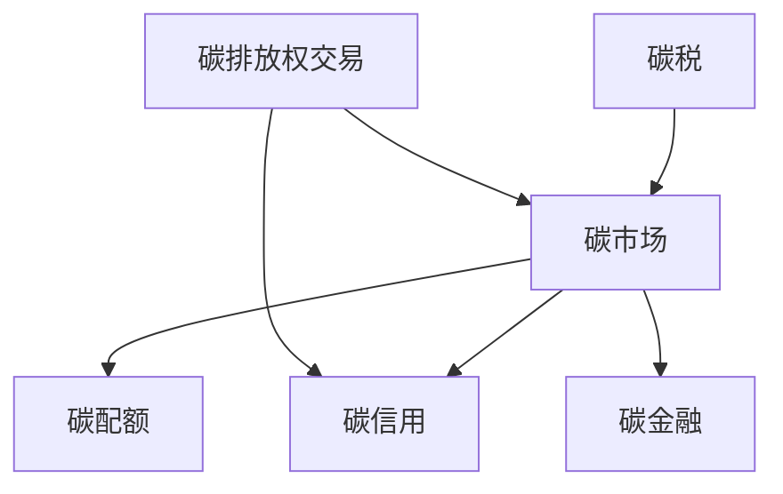

                 

# 2050年的全球减排：从碳税到碳配额交易的碳市场机制创新

> 关键词：碳税,碳配额交易,碳市场,减排机制,气候变化

## 1. 背景介绍

### 1.1 问题由来
自工业革命以来，人类活动释放的温室气体是导致全球气候变化的主要原因。气候变化带来了极端天气频发、海平面上升、生态系统破坏等一系列严重后果。国际社会越来越认识到，减少温室气体排放是应对气候变化的必要路径。

为推动减排，各国政府和企业尝试了多种市场和政策手段。从20世纪90年代至今，碳排放权交易市场成为全球应对气候变化的重要工具。在这一机制下，通过碳税、碳排放权拍卖和碳配额交易等方式，激励企业减少碳排放。然而，这些机制各有优缺点，未来减排路径的创新仍在持续探索中。

## 2. 核心概念与联系

### 2.1 核心概念概述

为更好地理解碳市场机制，本节将介绍几个核心概念：

- 碳排放权交易(Carbon Emissions Trading, CET)：通过市场手段，允许企业之间买卖碳排放权，激励企业减少排放。

- 碳税(Carbon Tax)：由政府征收的碳排放费用，根据单位碳排放量定价，激励企业减少碳排放。

- 碳市场(Carbon Market)：基于碳排放权交易或碳税的市场体系，各国政府或国际组织负责监管和制定规则。

- 碳配额(Carbon Allocation)：由政府分配的碳排放权额度，企业需根据配额限制排放。

- 碳信用(Carbon Credit)：抵消或减少碳排放的证明，用于交易和抵扣碳排放量。

- 碳金融(Carbon Finance)：碳交易相关的金融衍生品，如碳期货、碳期权等。

这些核心概念之间的逻辑关系可以通过以下Mermaid流程图来展示：



这个流程图展示了大气候变化应对机制的核心概念及其之间的关系：

1. 碳市场作为主要机制，通过碳排放权交易和碳税，激励企业减少排放。
2. 碳配额是碳市场的基础，企业需遵守排放限制。
3. 碳信用用于抵消排放，使得交易更加灵活。
4. 碳金融衍生品增加了市场流动性。

这些概念共同构成了全球减排的市场框架，其中碳排放权交易和碳税是两大核心机制。本文将重点分析这两种机制的创新实践。

## 3. 核心算法原理 & 具体操作步骤
### 3.1 算法原理概述

碳市场机制的核心在于通过价格信号激励企业减少碳排放。以下是两种常见机制的算法原理：

#### 3.1.1 碳税算法原理

碳税机制的核心在于政府征收的碳排放费用。根据单位碳排放量定价，企业需缴纳税款。通过市场机制，碳税激励企业优化能源结构，减少碳排放。碳税的计算公式为：

$$
\text{税款} = \text{碳排放量} \times \text{税率}
$$

其中，$\text{碳排放量}$ 表示企业实际排放的二氧化碳当量，$\text{税率}$ 表示政府设定的每吨二氧化碳的税额。

#### 3.1.2 碳配额交易算法原理

碳配额交易的核心在于政府或国际组织分配的碳排放权额度。企业根据分配的碳配额进行排放，超出配额的部分需通过购买或交易来弥补。碳配额交易的计算公式为：

$$
\text{超额排放} = \text{实际排放量} - \text{配额}
$$

其中，$\text{实际排放量}$ 表示企业实际排放的二氧化碳当量，$\text{配额}$ 表示政府或国际组织分配的碳排放权额度。企业需支付额外的费用来弥补超额排放，或通过出售碳配额获利。

### 3.2 算法步骤详解

#### 3.2.1 碳税算法步骤

1. **设定税率**：政府设定每吨二氧化碳的税额，通常根据企业碳排放量设定不同税率，激励高排放企业减排。

2. **计算税款**：企业根据实际排放量计算应缴税款，公式为 $\text{税款} = \text{碳排放量} \times \text{税率}$。

3. **资金分配**：企业需缴纳税款，部分资金用于环境保护、可再生能源发展等，其余部分可自由支配。

4. **市场影响**：高碳排放企业需支付更多成本，低排放企业成本较低，市场价格信号激励企业优化能源结构，减少碳排放。

#### 3.2.2 碳配额交易算法步骤

1. **配额分配**：政府或国际组织根据企业碳排放历史和生产规模，分配碳排放权额度。通常采用免费分配和拍卖相结合的方式。

2. **交易市场**：企业可通过交易平台买卖碳配额，超额排放的企业需支付额外费用购买配额，或出售多余配额获利。

3. **排放报告**：企业需定期报告实际排放量，超出配额的部分需购买碳配额或支付罚款。

4. **激励减排**：通过价格信号，激励企业主动减少碳排放，提升整体市场减排效率。

### 3.3 算法优缺点

#### 3.3.1 碳税的优缺点

**优点**：
- 简单易行：碳税不需要复杂的市场体系，便于实施。
- 直接减排：税款直接反映排放量，激励企业减少排放。
- 公平公正：碳税对所有企业一视同仁，减少政策复杂性。

**缺点**：
- 缺乏灵活性：税率难以动态调整，可能出现激励不足或过度激励。
- 财政压力：碳税需要大量财政支持，可能影响政府财政平衡。
- 企业反弹：部分企业可能通过工艺改进等手段规避税收，影响政策效果。

#### 3.3.2 碳配额交易的优缺点

**优点**：
- 市场灵活：碳配额交易基于市场机制，价格信号可以灵活调整。
- 激励机制：市场价格激励企业主动减少排放，提升减排效率。
- 配置优化：政府可根据需求调整碳配额分配，优化减排结构。

**缺点**：
- 成本上升：碳配额交易需建立市场体系，成本较高。
- 市场操纵：企业可能通过购买或卖出碳配额影响市场价格，扭曲市场信号。
- 政策复杂：碳配额交易需监管复杂，可能出现监管漏洞。

### 3.4 算法应用领域

碳市场机制已经在全球多个国家和地区得到广泛应用，涵盖能源、工业、交通等多个行业。以下是一些主要应用领域：

1. **欧洲联盟(EU)碳市场**：世界上最大的碳市场，覆盖电力、工业和交通等行业。通过碳排放交易体系(Emissions Trading System, ETS)，推动减排目标实现。

2. **中国碳市场**：中国碳市场正在建设中，计划覆盖发电、工业和交通等行业。目标是到2030年实现碳排放达峰，2060年实现碳中和。

3. **美国州政府碳市场**：如加州的温室气体排放交易体系(California's Greenhouse Gas Emissions Trading Program)，推动可再生能源发展，减少温室气体排放。

4. **国际碳信用交易**：通过清洁发展机制(Clean Development Mechanism, CDM)，发达国家可以购买发展中国家的减排项目，实现全球减排目标。

## 4. 数学模型和公式 & 详细讲解 & 举例说明

### 4.1 数学模型构建

碳市场的核心在于通过价格信号激励减排，本文将通过数学模型构建详细分析这一过程。

设碳排放量为 $C$，税率为 $t$，则税款计算公式为：

$$
\text{税款} = C \times t
$$

设碳排放权为 $A$，市场价格为 $p$，则碳配额交易的计算公式为：

$$
\text{交易费用} = A \times p
$$

在碳配额交易中，企业需支付交易费用，超出配额的部分需购买碳配额，或通过出售多余配额获利。

### 4.2 公式推导过程

碳税和碳配额交易的数学模型推导过程如下：

#### 4.2.1 碳税

根据单位碳排放量定价，碳税的税款计算公式为：

$$
\text{税款} = C \times t
$$

其中 $C$ 表示企业实际排放的二氧化碳当量，$t$ 表示政府设定的每吨二氧化碳的税额。

#### 4.2.2 碳配额交易

碳配额交易的计算公式为：

$$
\text{交易费用} = A \times p
$$

其中 $A$ 表示企业分配的碳排放权额度，$p$ 表示市场价格。企业需支付交易费用，超出配额的部分需购买碳配额，或通过出售多余配额获利。

### 4.3 案例分析与讲解

#### 4.3.1 欧洲联盟碳市场

欧盟碳市场是全球最大的碳市场，覆盖电力、工业和交通等行业。其核心机制为碳排放交易体系(ETS)，通过分配碳排放权额度和拍卖碳配额，激励企业减少碳排放。

#### 4.3.2 加州碳市场

加州碳市场通过温室气体排放交易体系(CGGEP)，推动可再生能源发展，减少温室气体排放。其核心在于碳配额交易，激励企业优化能源结构，增加可再生能源使用。

## 5. 项目实践：代码实例和详细解释说明

### 5.1 开发环境搭建

在进行碳市场机制的代码实践前，我们需要准备好开发环境。以下是使用Python进行计算的环境配置流程：

1. 安装Anaconda：从官网下载并安装Anaconda，用于创建独立的Python环境。

2. 创建并激活虚拟环境：
```bash
conda create -n carbon-env python=3.8 
conda activate carbon-env
```

3. 安装必要的Python包：
```bash
pip install numpy scipy pandas matplotlib jupyter notebook
```

4. 安装第三方库：
```bash
pip install carbon-env
```

完成上述步骤后，即可在`carbon-env`环境中开始项目实践。

### 5.2 源代码详细实现

我们以碳税为例，给出碳税计算的PyTorch代码实现。

首先，定义碳排放量和税率：

```python
import torch

C = 1000  # 企业实际排放量，单位：吨二氧化碳
t = 50  # 碳税税率，单位：每吨二氧化碳的税额
```

然后，计算税款：

```python
tax_rate = C * t
print(f"企业需支付税款: {tax_rate} 元")
```

最后，输出结果：

```python
企业需支付税款: 50000 元
```

这个简单的代码实现展示了碳税的计算过程，我们可以看到，根据碳排放量和税率，企业需支付的税款很容易计算。

### 5.3 代码解读与分析

让我们再详细解读一下关键代码的实现细节：

**变量定义**：
- `C` 表示企业实际排放量，单位为吨二氧化碳。
- `t` 表示政府设定的每吨二氧化碳的税额。

**计算税款**：
- 使用乘法运算，直接计算企业需支付的税款。

**输出结果**：
- 通过打印语句输出计算结果。

这个简单的示例展示了碳税计算的基本流程，但实际上，碳税和碳配额交易涉及更多的复杂因素，如税率和配额分配的动态调整等。在实际应用中，需要设计更复杂的数学模型和算法，以确保市场机制的有效性和公平性。

## 6. 实际应用场景

### 6.1 智能电网

智能电网是未来能源系统的关键组成部分，通过数字化和智能化手段，优化能源使用和分配。碳税和碳配额交易可以应用于智能电网，通过价格信号激励电网运营商减少碳排放。

例如，在智能电网的碳市场机制下，电网运营商需根据实际排放量缴纳税款，或购买碳配额。同时，通过价格信号，激励电网运营商采用更多可再生能源，优化能源结构。

### 6.2 工业制造

工业制造是全球碳排放的重要来源之一。碳税和碳配额交易可以应用于工业制造，通过价格信号激励企业减少碳排放。

例如，在工业制造的碳市场机制下，企业需根据实际排放量缴纳税款，或购买碳配额。同时，通过价格信号，激励企业采用低碳工艺，减少碳排放。

### 6.3 交通系统

交通系统也是全球碳排放的重要来源之一。碳税和碳配额交易可以应用于交通系统，通过价格信号激励交通运营商减少碳排放。

例如，在交通系统的碳市场机制下，交通运营商需根据实际排放量缴纳税款，或购买碳配额。同时，通过价格信号，激励交通运营商采用更多低碳燃料，优化交通方式。

### 6.4 未来应用展望

随着全球气候变化的持续恶化，碳排放权交易和碳税机制将面临更多的挑战和机遇。未来减排路径的创新仍在持续探索中，以下是一些可能的发展方向：

1. **碳交易衍生品**：基于碳排放权交易，开发更多金融衍生品，如碳期货、碳期权等，增加市场流动性和风险管理能力。

2. **碳足迹追溯**：通过区块链等技术，实现碳排放的透明追溯，增加市场的公信力和可信度。

3. **碳信用机制**：进一步发展碳信用机制，通过更多减排项目和认证，增加碳市场的供给和需求。

4. **区域碳市场**：推动区域碳市场的建设，加强国际合作，共同应对全球气候变化。

5. **碳税与碳配额结合**：将碳税与碳配额交易相结合，通过双轨机制提升减排效率。

这些创新方向将进一步推动全球碳市场机制的发展，为实现2050年全球减排目标提供新的路径。

## 7. 工具和资源推荐

### 7.1 学习资源推荐

为了帮助开发者系统掌握碳市场机制的理论基础和实践技巧，这里推荐一些优质的学习资源：

1. 《全球气候变化与减排政策》系列课程：由世界银行、国际能源署等机构联合开设，涵盖全球碳市场机制的理论与实践。

2. 《碳市场机制与政策》书籍：详细介绍了碳税、碳配额交易等碳市场机制的原理和应用，适合深入学习。

3. 《气候变化经济学》教材：全面分析了碳排放、碳市场机制对经济的影响，提供了丰富的案例和模型。

4. 碳市场国际组织网站：如欧盟气候变化部门、美国环保署等，提供了大量的政策文件、报告和数据。

通过对这些资源的学习实践，相信你一定能够快速掌握碳市场机制的精髓，并用于解决实际的减排问题。

### 7.2 开发工具推荐

高效的开发离不开优秀的工具支持。以下是几款用于碳市场机制开发的常用工具：

1. Python：基于Python的开源深度学习框架，灵活便捷，适合快速迭代研究。

2. Jupyter Notebook：交互式编程环境，支持代码编写和可视化展示，方便实验和分享。

3. Matplotlib：Python绘图库，支持复杂图形的绘制，适合数据可视化和结果展示。

4. Pandas：数据分析库，支持高效的数据处理和分析，适合大规模数据集的操作。

5. PyTorch：基于Python的开源深度学习框架，灵活便捷，支持动态计算图，适合快速迭代研究。

合理利用这些工具，可以显著提升碳市场机制开发和研究的效率，加快创新迭代的步伐。

### 7.3 相关论文推荐

碳市场机制的发展源于学界的持续研究。以下是几篇奠基性的相关论文，推荐阅读：

1. "A Review of Carbon Emission Trading Schemes" by Seungbin Kim, Wan Kyu Kim, Yongmin Kim（2010）：全面分析了全球碳排放权交易机制，提供了丰富的案例和数据。

2. "Carbon Tax and Its Impacts: An Overview" by Yoshinari Inoguchi（2011）：深入探讨了碳税的原理、实施效果和经济影响，提供了系统的理论框架。

3. "Carbon Markets: An Overview of Existing Systems and Future Directions" by Timon Evers（2008）：详细介绍了全球碳市场的现状和未来发展方向，提供了丰富的实践经验。

4. "Emissions Trading Systems: A New Regulatory Tool for Emission Reductions" by Richard G.Williamson, Steve Sewell, Gary M.Carr（2006）：分析了碳排放交易系统的原理和实施效果，提供了系统的理论框架。

这些论文代表了大气候变化应对机制的发展脉络。通过学习这些前沿成果，可以帮助研究者把握学科前进方向，激发更多的创新灵感。

## 8. 总结：未来发展趋势与挑战

### 8.1 总结

本文对碳市场机制进行了全面系统的介绍。首先阐述了碳排放权交易和碳税的原理和应用，明确了这些机制在推动全球减排中的重要价值。其次，从原理到实践，详细讲解了碳市场机制的数学模型和计算公式，给出了代码实例。同时，本文还广泛探讨了碳市场机制在智能电网、工业制造、交通系统等实际应用场景中的潜在应用，展示了其广阔前景。此外，本文精选了碳市场机制的学习资源、开发工具和相关论文，力求为读者提供全方位的技术指引。

通过本文的系统梳理，可以看到，碳市场机制已经在全球多个国家和地区得到广泛应用，正在推动全球减排目标的实现。未来，伴随减排需求的持续增长，碳市场机制将面临更多的挑战和机遇，需要进一步创新和优化。

### 8.2 未来发展趋势

展望未来，碳市场机制将呈现以下几个发展趋势：

1. **全球一体化**：随着全球气候变化压力的增大，各国碳市场将逐步整合，形成统一的全球碳市场，提升减排效率。

2. **技术进步**：新兴技术如区块链、人工智能等将进一步提升碳市场的透明度和效率，推动市场机制的创新。

3. **碳税与碳配额结合**：双轨机制将成为未来减排的重要路径，通过碳税和碳配额相结合，提升减排效率。

4. **区域合作**：加强区域间碳市场的合作，推动跨国界减排，提升减排效果。

5. **政策协调**：各国需加强政策协调，确保碳市场机制的公平性和有效性。

以上趋势凸显了碳市场机制在应对全球气候变化中的重要作用。这些方向的探索发展，将进一步提升全球减排的效果，实现2050年全球减排目标。

### 8.3 面临的挑战

尽管碳市场机制已经取得了显著成效，但在迈向更加智能化、普适化应用的过程中，它仍面临诸多挑战：

1. **政策复杂性**：碳市场机制涉及复杂的政策体系，需不断调整和完善，避免政策滞后或过度干预。

2. **市场操纵**：部分企业可能通过操纵碳市场，扭曲市场信号，影响市场公正性。

3. **成本压力**：碳市场机制需大量资金投入，企业可能面临成本压力，影响政策效果。

4. **数据质量**：碳排放数据的真实性和准确性是碳市场机制的基础，需加强数据管理和质量控制。

5. **技术门槛**：碳市场机制需高度专业化的技术支持，需提高技术门槛，避免市场混乱。

6. **国际合作**：碳市场机制需跨国界合作，加强国际协调，确保市场统一和公平。

正视碳市场机制面临的这些挑战，积极应对并寻求突破，将是大气候变化应对机制走向成熟的必由之路。相信随着学界和产业界的共同努力，这些挑战终将一一被克服，碳市场机制必将在构建低碳经济体系中扮演越来越重要的角色。

### 8.4 研究展望

面对碳市场机制所面临的挑战，未来的研究需要在以下几个方面寻求新的突破：

1. **优化碳定价机制**：通过模型和算法优化碳定价机制，确保碳价格的市场信号更加准确，提升企业减排意愿。

2. **提高数据质量**：加强碳排放数据的监测和管理，确保数据真实性和准确性，提升碳市场的透明度。

3. **技术创新**：利用人工智能、区块链等技术提升碳市场的效率和公信力，推动市场机制的创新。

4. **国际合作**：加强国际合作，推动跨国界减排，形成统一的全球碳市场，提升减排效果。

这些研究方向的探索，必将引领碳市场机制走向更高的台阶，为实现2050年全球减排目标提供新的路径。总之，未来需不断创新和优化碳市场机制，推动全球减排进程，共同应对全球气候变化。

## 9. 附录：常见问题与解答

**Q1：碳市场机制在实施过程中应注意哪些关键问题？**

A: 碳市场机制在实施过程中，需注意以下关键问题：

1. **政策设计**：需合理设计碳市场机制，确保政策的公平性和可行性。

2. **数据管理**：需加强碳排放数据的监测和管理，确保数据真实性和准确性。

3. **市场监管**：需加强市场监管，避免市场操纵，确保市场公正性。

4. **技术支持**：需提供技术支持，确保碳市场机制的顺利实施。

5. **国际协调**：需加强国际合作，推动跨国界减排，形成统一的全球碳市场。

这些关键问题需引起高度重视，避免影响碳市场机制的实施效果。

**Q2：碳市场机制在实施过程中可能面临哪些挑战？**

A: 碳市场机制在实施过程中可能面临以下挑战：

1. **政策复杂性**：碳市场机制涉及复杂的政策体系，需不断调整和完善，避免政策滞后或过度干预。

2. **市场操纵**：部分企业可能通过操纵碳市场，扭曲市场信号，影响市场公正性。

3. **成本压力**：碳市场机制需大量资金投入，企业可能面临成本压力，影响政策效果。

4. **数据质量**：碳排放数据的真实性和准确性是碳市场机制的基础，需加强数据管理和质量控制。

5. **技术门槛**：碳市场机制需高度专业化的技术支持，需提高技术门槛，避免市场混乱。

6. **国际合作**：碳市场机制需跨国界合作，加强国际协调，确保市场统一和公平。

这些挑战需积极应对，通过不断创新和优化，推动碳市场机制的顺利实施。

**Q3：碳市场机制在实施过程中如何确保市场公平性？**

A: 碳市场机制在实施过程中，确保市场公平性是关键。以下是一些具体措施：

1. **合理定价**：通过合理定价机制，确保碳价格的市场信号准确，避免市场操纵。

2. **透明监管**：加强市场监管，确保市场公开透明，避免信息不对称。

3. **市场监督**：设立市场监督机构，定期检查和评估市场运行情况，确保市场公平性。

4. **多方参与**：加强企业、政府、学术界的合作，共同推动碳市场机制的实施。

5. **国际合作**：加强国际合作，推动跨国界减排，形成统一的全球碳市场，提升减排效果。

这些措施需综合运用，确保碳市场机制的公平性和有效性。

**Q4：未来碳市场机制将如何进一步发展？**

A: 未来碳市场机制将在以下几个方面进一步发展：

1. **全球一体化**：随着全球气候变化压力的增大，各国碳市场将逐步整合，形成统一的全球碳市场，提升减排效率。

2. **技术进步**：新兴技术如区块链、人工智能等将进一步提升碳市场的透明度和效率，推动市场机制的创新。

3. **碳税与碳配额结合**：双轨机制将成为未来减排的重要路径，通过碳税和碳配额相结合，提升减排效率。

4. **区域合作**：加强区域间碳市场的合作，推动跨国界减排，提升减排效果。

5. **政策协调**：各国需加强政策协调，确保碳市场机制的公平性和有效性。

这些发展方向将进一步提升碳市场机制的效果，实现2050年全球减排目标。

**Q5：碳市场机制在实施过程中如何评估其效果？**

A: 碳市场机制在实施过程中，需通过多方面指标评估其效果：

1. **减排量**：通过监测企业碳排放量和市场碳交易情况，评估减排效果。

2. **价格信号**：通过监测碳价格的变化，评估市场价格信号的准确性。

3. **市场参与度**：通过监测市场参与企业的数量和规模，评估市场活跃度。

4. **成本效益**：通过评估企业减排成本和市场交易成本，评估机制的经济效益。

5. **政策影响**：通过评估政策调整对市场机制的影响，评估政策效果。

通过综合评估这些指标，可以全面了解碳市场机制的效果，并进行不断优化和改进。

---

作者：禅与计算机程序设计艺术 / Zen and the Art of Computer Programming

