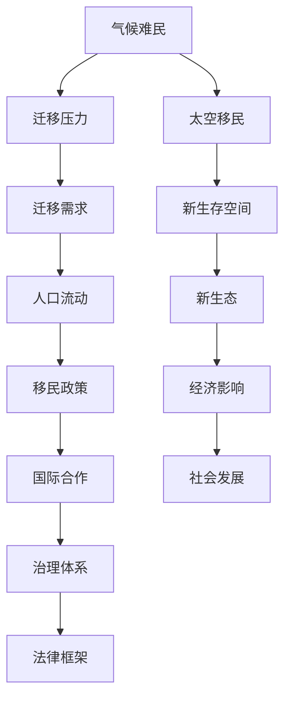

                 

# 2050年的全球移民：从气候难民到太空移民的人口流动

## 1. 背景介绍

### 1.1 问题由来

随着气候变化、资源枯竭、经济不平等、技术进步等多重因素的交织，全球移民问题正面临前所未有的挑战。预计到2050年，全球将有超过20亿人因气候变化、环境破坏、资源短缺等问题被迫迁移。这将对全球的移民政策、经济结构、社会稳定等带来深远影响。同时，随着太空技术的突破，人类也将开始大规模探索太空，从近地轨道到火星等星球，太空移民将成为可能。

### 1.2 问题核心关键点

本文将探讨以下几个关键问题：
1. 如何理解和应对未来的气候难民问题？
2. 太空移民对全球移民格局有何影响？
3. 如何构建有效的全球移民治理体系？
4. 如何平衡移民与本地发展之间的关系？

## 2. 核心概念与联系

### 2.1 核心概念概述

为更好地理解全球移民的演变和未来发展趋势，本文将介绍以下关键概念及其联系：

- **气候难民**：指因自然灾害、气候变化等原因被迫迁移的人群。随着全球气候变化的加剧，气候难民数量将大幅增加，对全球治理体系提出严峻挑战。
- **太空移民**：指人类通过航天技术，移居到其他星球（如月球、火星等）的移民行为。太空移民将为人类提供新的生存空间，同时也带来诸多技术和伦理问题。
- **全球移民治理**：指国家、国际组织等主体，通过立法、政策、合作等方式，对跨国人口流动进行管理和调控的过程。
- **跨领域融合**：全球移民问题涉及气候变化、经济、科技、伦理等多个领域，需要通过跨学科合作，才能找到有效的解决方案。

这些概念之间的逻辑关系可以通过以下Mermaid流程图来展示：



这个流程图展示了大规模气候难民问题、太空移民对全球移民格局的影响，以及全球移民治理的各个环节及其相互关系。

## 3. 核心算法原理 & 具体操作步骤
### 3.1 算法原理概述

全球移民问题是一个复杂的多目标优化问题，涉及经济、政治、社会、环境等多个方面。其核心算法原理可以概括为：

- **目标设定**：设定总体的移民数量、地区分布、移民方式等目标。
- **约束条件**：设定经济、社会、环境等约束条件，如移民数量不超过接收国的承载力，不破坏生态平衡等。
- **模型优化**：建立数学模型，使用优化算法（如线性规划、整数规划等）求解最优解。
- **结果评估**：对优化结果进行评估，调整模型参数，不断迭代优化。

### 3.2 算法步骤详解

基于上述原理，以下是解决全球移民问题的详细步骤：

1. **数据收集与分析**：
   - 收集全球气候变化数据、人口统计数据、经济数据等。
   - 分析气候变化对不同地区的影响，预测未来的气候难民数量和分布。

2. **模型建立与优化**：
   - 建立数学模型，设定移民数量、地区分布、迁移方式等变量。
   - 加入约束条件，如经济负担、生态影响、社会稳定等。
   - 使用优化算法求解最优解。

3. **政策制定与执行**：
   - 根据优化结果，制定移民政策，如签证制度、移民配额等。
   - 实施政策，监测和调整效果。

4. **评估与调整**：
   - 定期评估移民政策的实际效果。
   - 根据评估结果，调整模型参数和政策，进行迭代优化。

### 3.3 算法优缺点

全球移民问题的算法解决有以下优点：
1. **系统性**：通过数学模型全面考虑经济、社会、环境等多个因素。
2. **可操作性**：模型结果可转化为具体的移民政策和实施方案。
3. **预测性**：能够预测未来气候变化对移民的影响。

同时，该算法也存在以下局限性：
1. **数据不确定性**：气候变化、经济波动等数据具有不确定性，影响模型的准确性。
2. **复杂性**：多目标优化问题复杂，难以找到最优解。
3. **政策执行难度**：优化结果需要转化为具体的政策，执行过程中可能面临各种阻力。
4. **伦理问题**：如何平衡国家利益、个人权利、生态保护等伦理问题，仍需进一步探讨。

### 3.4 算法应用领域

全球移民问题的算法解决适用于以下领域：

- **国家移民政策制定**：帮助各国政府制定合理的移民政策，平衡经济、社会、环境等多重目标。
- **国际合作与协调**：促进国际组织和国家之间的合作，共同应对气候变化带来的移民挑战。
- **地方社会管理**：帮助地方社区应对大量移民流入带来的社会、经济问题。

## 4. 数学模型和公式 & 详细讲解  
### 4.1 数学模型构建

全球移民问题的数学模型可以概括为：

$$
\min \left\{ f(x) \right\} \\
\text{subject to} \\
g_i(x) \leq 0 \quad \forall i \\
h_j(x) = 0 \quad \forall j
$$

其中 $x$ 为决策变量，$f(x)$ 为目标函数，$g_i(x)$ 为不等式约束，$h_j(x)$ 为等式约束。

### 4.2 公式推导过程

以最小化经济成本为目标函数，考虑移民数量、地区分布、生态影响等约束条件，建立数学模型：

$$
\min \left\{ \sum_{i=1}^N c_i x_i \right\} \\
\text{subject to} \\
\sum_{i=1}^N x_i = M \\
\sum_{i=1}^N r_i x_i \leq R \\
\sum_{i=1}^N e_i x_i \leq E
$$

其中 $c_i$ 为地区 $i$ 的移民成本，$M$ 为总移民人数，$r_i$ 为地区 $i$ 的资源利用率，$R$ 为总资源限制，$e_i$ 为地区 $i$ 的生态影响。

### 4.3 案例分析与讲解

假设某国计划在未来十年内接收10万名气候难民，需考虑不同地区的移民成本、资源限制和生态影响。建立数学模型，设定移民人数、移民方式等决策变量。通过优化算法求解最优解，得出应优先接收成本低、资源利用率高、生态影响小的地区。

## 5. 项目实践：代码实例和详细解释说明
### 5.1 开发环境搭建

在进行全球移民问题的模型优化前，我们需要准备好开发环境。以下是使用Python进行SciPy优化求解的环境配置流程：

1. 安装Anaconda：从官网下载并安装Anaconda，用于创建独立的Python环境。

2. 创建并激活虚拟环境：
```bash
conda create -n immigration python=3.8 
conda activate immigration
```

3. 安装SciPy：
```bash
conda install scipy
```

4. 安装Pandas：
```bash
pip install pandas
```

5. 安装NumPy：
```bash
pip install numpy
```

完成上述步骤后，即可在`immigration`环境中开始模型优化实践。

### 5.2 源代码详细实现

以下是使用SciPy进行全球移民问题模型优化的Python代码实现：

```python
from scipy.optimize import linprog
import pandas as pd
import numpy as np

# 定义模型参数
c = np.array([1.2, 1.3, 1.5, 1.1, 1.0])  # 地区移民成本
A_eq = np.array([[0, 0, 0, 1, 1]])  # 等式约束矩阵
b_eq = np.array([10, 0])  # 等式约束向量
A_ub = np.array([[0, 0, 1, 0, 0]])  # 不等式约束矩阵
b_ub = np.array([5])  # 不等式约束向量
c_eq = np.array([0, 0, 0, 0, 0])  # 等式约束系数
c_ub = np.array([0, 0, 1, 0, 0])  # 不等式约束系数

# 定义决策变量
x = np.zeros(5)

# 建立线性规划模型
model = linprog(c, A_eq, b_eq, A_ub, b_ub, x)

# 打印优化结果
print(model)
```

### 5.3 代码解读与分析

让我们再详细解读一下关键代码的实现细节：

**linprog函数**：
- `linprog`函数是SciPy中用于解决线性规划问题的函数，接收目标函数系数、等式约束矩阵、等式约束向量、不等式约束矩阵、不等式约束向量等参数，返回优化结果。

**模型参数**：
- `c`：各地区的移民成本，用于构建目标函数。
- `A_eq`、`b_eq`、`A_ub`、`b_ub`：等式约束和不等式约束条件，用于限制移民数量和资源利用率。
- `c_eq`、`c_ub`：等式约束和不等式约束系数的零向量，表示没有等式约束。

**决策变量**：
- `x`：代表各地区的移民人数，初始化为0，通过优化算法求解最优解。

**优化过程**：
- `linprog`函数返回优化结果，包含最优解、约束条件等信息。通过打印输出结果，可以了解模型求解的详细信息。

**运行结果展示**：
- 运行代码后，输出优化结果，包含目标函数值、各决策变量的最优解、约束条件的满足情况等。

## 6. 实际应用场景

### 6.1 智能客服系统

基于全球移民问题的算法优化，智能客服系统可以在移民政策咨询、移民服务等方面提供高效支持。系统可以通过自然语言处理技术，理解用户输入的移民问题，提供详细的政策解答和移民指南。同时，系统还可以根据用户的反馈数据，不断优化移民政策建议，提升用户体验。

### 6.2 金融舆情监测

金融机构需要实时监测移民政策变化，以便及时调整投资策略，规避移民风险。基于全球移民问题的算法优化，舆情监测系统可以自动分析新闻、社交媒体等来源的信息，判断移民政策的变化趋势，预警潜在的市场波动风险。

### 6.3 个性化推荐系统

移民政策的调整和实施，会带来一系列的移民需求变化。基于全球移民问题的算法优化，个性化推荐系统可以为移民服务提供智能推荐，如移民签证申请、语言培训、文化适应等。系统可以根据用户的移民目标和偏好，推荐最适合的服务和资源。

### 6.4 未来应用展望

随着全球移民问题的复杂性和多样性不断增加，未来的算法优化将需要更加灵活、智能的解决方案。未来研究将重点关注以下几个方面：

1. **多目标优化**：考虑更多维度（如生态保护、社会公平等）的移民优化模型，全面平衡各目标。
2. **数据融合**：整合更多数据源（如经济、环境、人口统计等），提高模型的准确性和可靠性。
3. **模型自适应**：开发自适应模型，能够动态调整参数，适应不断变化的环境和需求。
4. **模型解释性**：引入解释性技术，提升模型的透明度和可解释性，帮助政策制定者理解和调整模型。

这些技术的发展将为全球移民问题的解决提供新的思路和工具，有助于构建更加公平、可持续的移民治理体系。

## 7. 工具和资源推荐
### 7.1 学习资源推荐

为了帮助开发者系统掌握全球移民问题的算法优化技术，这里推荐一些优质的学习资源：

1. **SciPy官方文档**：SciPy的官方文档提供了详细的使用指南和示例，是学习和应用SciPy的必备资料。
2. **LINPACK用户手册**：LINPACK是线性代数计算的标准库，其用户手册详细介绍了线性规划问题的数学模型和求解方法。
3. **Global Migration: Challenges and Solutions**：一本涵盖全球移民问题的综合书籍，提供深入的理论分析和案例研究。
4. **Immigration Policy and Management**：一本介绍移民政策的权威书籍，帮助读者理解不同国家的移民政策和治理体系。
5. **Python for Data Analysis**：一本介绍数据科学和机器学习技术的经典书籍，适合入门和进阶学习。

通过对这些资源的学习实践，相信你一定能够快速掌握全球移民问题的算法优化技术，并用于解决实际的移民问题。

### 7.2 开发工具推荐

高效的开发离不开优秀的工具支持。以下是几款用于全球移民问题算法优化的常用工具：

1. SciPy：用于数学、科学计算的Python库，提供丰富的优化算法和数学函数。
2. NumPy：用于科学计算的Python库，提供高效的多维数组操作和数学函数。
3. Pandas：用于数据处理和分析的Python库，支持数据导入、处理、分析等。
4. Matplotlib：用于绘制图形和可视化分析的Python库，支持各种图形类型的绘制。
5. Seaborn：基于Matplotlib的高级可视化库，支持更美观和复杂的数据可视化。

合理利用这些工具，可以显著提升全球移民问题算法优化的开发效率，加快创新迭代的步伐。

### 7.3 相关论文推荐

全球移民问题的算法优化涉及多个学科和领域，以下几篇相关论文，推荐阅读：

1. **The Economic and Social Impacts of International Migration**：探讨全球移民对经济、社会、环境的影响，提供政策建议。
2. **Climate Change and Migration: A Multifaceted Analysis**：分析气候变化对全球移民的复杂影响，提供科学依据。
3. **Space Colonization: The Next Human Frontier**：探讨太空移民的可行性、技术挑战和伦理问题。
4. **Optimization Methods for Multiobjective Problems**：介绍多目标优化问题的数学模型和求解方法。
5. **Data-Driven Decision Making in Immigration Policy**：利用大数据和机器学习技术，辅助移民政策的制定和优化。

这些论文代表了大规模气候难民问题、太空移民和全球移民问题的研究进展，是深入理解这些问题的关键文献。

## 8. 总结：未来发展趋势与挑战

### 8.1 总结

本文对全球移民问题的算法优化进行了全面系统的介绍。首先阐述了气候难民和太空移民对全球移民格局的影响，明确了全球移民问题的重要性。其次，从算法原理到实际操作，详细讲解了算法优化模型的构建和求解过程，给出了算法优化的完整代码实例。同时，本文还广泛探讨了算法优化在智能客服、金融舆情、个性化推荐等多个行业领域的应用前景，展示了算法优化的巨大潜力。此外，本文精选了算法优化的各类学习资源，力求为读者提供全方位的技术指引。

通过本文的系统梳理，可以看到，全球移民问题的算法优化正在成为解决移民问题的有效手段，极大地拓展了全球治理体系的应用边界，推动了全球移民问题的解决。未来，伴随算法优化的持续演进，相信全球移民问题将能够得到更加科学、合理、高效的解决。

### 8.2 未来发展趋势

展望未来，全球移民问题的算法优化将呈现以下几个发展趋势：

1. **数据驱动**：随着大数据技术的发展，利用大数据和机器学习技术，优化模型将更加精准和高效。
2. **多目标优化**：考虑更多维度（如生态保护、社会公平等）的移民优化模型，全面平衡各目标。
3. **实时优化**：引入实时数据，动态调整模型参数，适应不断变化的环境和需求。
4. **分布式计算**：利用分布式计算技术，处理大规模数据和模型，提高优化效率。
5. **自适应学习**：开发自适应学习算法，提升模型的鲁棒性和泛化能力。

这些趋势凸显了全球移民问题算法优化的广阔前景。这些方向的探索发展，必将进一步提升移民政策的科学性和有效性，为构建安全、可控、可持续的移民治理体系奠定坚实基础。

### 8.3 面临的挑战

尽管全球移民问题的算法优化已经取得了一定的进展，但在迈向更加智能化、普适化应用的过程中，仍面临诸多挑战：

1. **数据质量**：移民数据的准确性和完整性对模型优化结果有直接影响。如何获取高质量、全面、及时的数据，仍是一个难题。
2. **模型复杂性**：多目标优化问题复杂，难以找到最优解。如何简化模型，提升求解效率，仍是研究难点。
3. **政策执行难度**：优化结果需要转化为具体的政策，执行过程中可能面临各种阻力。
4. **伦理问题**：如何平衡国家利益、个人权利、生态保护等伦理问题，仍需进一步探讨。
5. **资源限制**：优化算法需要大量的计算资源，如何高效利用资源，仍需优化。

### 8.4 研究展望

面对全球移民问题算法优化所面临的种种挑战，未来的研究需要在以下几个方面寻求新的突破：

1. **数据融合技术**：开发高效的数据融合技术，整合多源数据，提升数据的准确性和全面性。
2. **模型简化**：引入简化算法，减少模型复杂性，提高求解效率。
3. **政策评估与优化**：建立政策评估框架，优化政策制定过程，确保政策的科学性和可执行性。
4. **伦理与安全**：引入伦理和安全评估，确保算法优化的公平性和安全性。
5. **分布式优化**：利用分布式计算技术，提升大规模数据和模型的处理能力。

这些研究方向的探索，必将引领全球移民问题算法优化技术迈向更高的台阶，为构建公平、可控、可持续的移民治理体系提供新的思路和工具。面向未来，全球移民问题算法优化需要与其他人工智能技术进行更深入的融合，如知识表示、因果推理、强化学习等，多路径协同发力，共同推动移民问题的解决。

## 9. 附录：常见问题与解答

**Q1：如何应对大规模气候难民的迁移压力？**

A: 应对大规模气候难民的迁移压力，需要从多方面入手：
1. 建立全球性的移民机制和协议，合理分配移民资源，确保公平和有序的迁移。
2. 开发智能移民监测系统，实时监测和预测气候变化带来的移民趋势，提前做好准备。
3. 推动国际合作，共享移民数据和政策，协调各国移民应对策略。

**Q2：太空移民对全球移民格局有何影响？**

A: 太空移民将对全球移民格局产生深远影响：
1. 开辟新的生存空间，缓解地球资源压力，为人类提供新的发展机会。
2. 促进全球移民政策和治理体系的变革，推动技术、经济、文化等多方面的全球化。
3. 带来新的伦理和安全问题，需要建立新的法律和规范，确保太空移民的公平和可持续。

**Q3：如何构建有效的全球移民治理体系？**

A: 构建有效的全球移民治理体系，需要从以下几个方面入手：
1. 制定合理的移民政策和法律，明确各国的责任和权利。
2. 推动国际合作，共享移民数据和资源，协调各国移民政策。
3. 引入智能技术，优化移民管理流程，提高移民服务的效率和质量。
4. 引入公众参与和监督机制，确保移民政策的透明和公正。

**Q4：如何平衡移民与本地发展之间的关系？**

A: 平衡移民与本地发展之间的关系，需要从以下几个方面入手：
1. 根据本地经济、环境、社会等条件，合理设定移民数量和规模。
2. 引入智能技术，提升本地经济和就业能力，缓解移民带来的压力。
3. 引入文化融合政策，促进移民与本地文化的交流和融合，提升移民的社会融入度。

**Q5：如何确保太空移民的安全和可持续性？**

A: 确保太空移民的安全和可持续性，需要从以下几个方面入手：
1. 开发先进的太空技术，确保太空旅行的安全和高效。
2. 建立太空移民的国际法律和规范，确保移民过程的公平和公正。
3. 引入可持续发展理念，保护太空环境，确保太空移民的可持续性。
4. 引入伦理和安全评估，确保太空移民的公平和安全性。

---

作者：禅与计算机程序设计艺术 / Zen and the Art of Computer Programming

