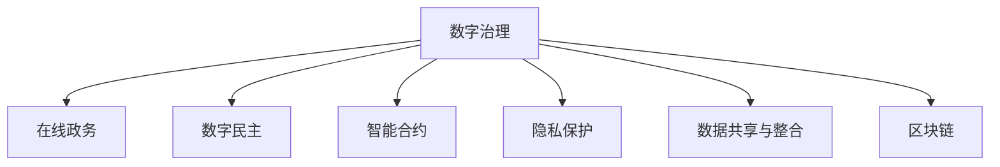

                 

# 2050年的数字治理：从在线政务到数字公民参与的数字民主实践

> 关键词：数字治理, 在线政务, 数字民主, 数字公民参与, 人工智能, 区块链, 分布式系统, 智能合约, 隐私保护, 安全

## 1. 背景介绍

在数字化浪潮席卷全球的当下，数字治理已成为各国政府及社会各界关注的焦点。数字治理不仅仅是对政务系统的数字化改造，更是利用数字技术提升政府透明度、效率和公正性的重要途径。随着人工智能、区块链、大数据等前沿技术的不断成熟，数字治理正在从在线政务向更广泛的社会治理领域拓展，逐步实现数字民主的愿景。

### 1.1 问题由来

在线政务系统在过去十年中得到了快速发展，政府部门通过电子化、信息化的手段，实现了政务流程的在线化。然而，这些系统在运行中暴露出一些问题：

- **信息孤岛**：各政府部门之间缺乏有效的数据共享和协作机制，导致资源浪费和信息不对称。
- **透明度不足**：政府决策过程和结果缺乏透明度，难以获得民众的信任。
- **服务效率低下**：在线政务系统功能单一，用户体验较差，难以满足民众多方面的需求。

这些问题限制了在线政务系统的作用发挥，迫切需要引入更多创新技术和理念，推动数字治理向更深层次发展。

### 1.2 问题核心关键点

数字治理的核心关键点包括：

- **数据共享与整合**：实现跨部门、跨层级的数据共享和整合，打破信息孤岛。
- **透明度与信任**：提高政务决策的透明度和可信度，增强政府与民众之间的信任。
- **服务效率与体验**：优化政务服务流程，提升用户体验和满意度。
- **治理安全与隐私**：确保政务数据的隐私保护和安全，防范数据泄露和滥用风险。

这些关键点相互关联，共同构成了数字治理的基石，需要从技术、制度、文化等多个层面进行综合施策。

## 2. 核心概念与联系

### 2.1 核心概念概述

为了更好地理解数字治理的框架和机制，本节将介绍几个关键概念：

- **数字治理**：利用数字技术提升政府治理水平和社会管理效率的过程。包括电子政务、智慧城市、数字民主等多个方面。
- **在线政务**：通过互联网、移动互联网等平台，提供政务服务、信息公开、互动交流等功能。
- **数字民主**：利用数字技术促进公民参与、透明决策和治理效能提升，构建数字化的民主制度。
- **智能合约**：一种基于区块链技术的自动执行合同，能够自动完成合同条款的执行，无需第三方干预。
- **隐私保护**：在数字治理中，保障公民隐私安全，防止个人信息被滥用或泄露。
- **数据共享与整合**：通过技术手段实现不同系统、部门间的数据共享和整合，提高数据利用效率。
- **区块链**：一种去中心化的分布式账本技术，具备不可篡改、透明公开的特点，适用于数字治理中的许多场景。

这些概念之间的逻辑关系可以通过以下Mermaid流程图来展示：



这个流程图展示了一些关键概念之间的联系：

1. 数字治理涵盖了在线政务、数字民主等多个方面。
2. 在线政务是数字治理的基础，通过互联网提供政务服务。
3. 数字民主通过提升公民参与和决策透明度，实现更公平、公正的治理。
4. 智能合约用于提升交易效率和透明度，适用于政府采购、合同管理等场景。
5. 隐私保护是数字治理中不可或缺的部分，保障数据安全。
6. 数据共享与整合是数字治理的关键技术，提高数据利用效率。
7. 区块链为数字治理提供了安全透明的技术基础。

这些概念共同构成了数字治理的生态系统，推动社会向更高效、公正、透明的方向发展。

## 3. 核心算法原理 & 具体操作步骤

### 3.1 算法原理概述

数字治理的核心在于通过数字技术优化和创新政府治理模式，提升公共服务的质量和效率。基于区块链、人工智能等技术，数字治理可以实现多个目标：

- **透明公开**：利用区块链技术，实现政务数据的透明公开，增强政府透明度。
- **高效协同**：通过智能合约，实现跨部门、跨层级的协同工作，提高政府效率。
- **数据共享**：采用数据共享技术，实现不同系统、部门间的数据互认互用。
- **智能决策**：利用人工智能技术，进行数据分析和预测，辅助政府决策。

这些技术手段需要精心设计和协同工作，才能真正发挥其效力。

### 3.2 算法步骤详解

数字治理的算法步骤可以分为以下几个关键环节：

**Step 1: 数据收集与预处理**

- 收集来自不同部门、不同渠道的政务数据，并进行清洗、标注、归一化等预处理操作，确保数据的质量和一致性。
- 利用大数据技术进行数据集成和分析，提取有价值的信息，为后续应用奠定基础。

**Step 2: 数据共享与协同**

- 设计数据共享机制，通过API接口、微服务架构等技术手段，实现跨部门、跨层级的数据共享。
- 引入区块链技术，确保数据共享过程中的安全、透明和不可篡改。
- 建立协同工作平台，通过智能合约等技术，实现跨部门之间的协同工作。

**Step 3: 智能决策与辅助**

- 利用人工智能技术，对数据进行分析和预测，辅助政府决策。
- 引入机器学习、深度学习等算法，提升数据分析的准确性和实时性。
- 设计决策支持系统，结合专家知识，提供决策建议和方案。

**Step 4: 透明度与信任**

- 利用区块链技术，记录政务数据和决策过程，确保数据的透明和可信。
- 建立公开透明的决策机制，增强公众对政府决策的信任。
- 设计公众参与平台，促进公民对政务的监督和反馈。

**Step 5: 隐私保护与安全**

- 采用隐私保护技术，如数据脱敏、差分隐私等，确保公民隐私安全。
- 引入安全机制，防止数据泄露和滥用。
- 建立数据使用规范，明确数据使用权限和责任。

通过以上步骤，数字治理可以实现从在线政务到数字民主的全面转型。

### 3.3 算法优缺点

数字治理的算法具备以下优点：

- **透明公开**：区块链技术保证了政务数据的透明和公开，增强了政府透明度。
- **高效协同**：智能合约技术实现了跨部门、跨层级的协同工作，提高了政府效率。
- **数据共享**：数据共享机制打破了信息孤岛，提高了数据利用效率。
- **智能决策**：人工智能技术辅助决策，提升了决策的科学性和准确性。

然而，数字治理的算法也存在一些局限性：

- **技术复杂**：实现数字治理需要多种先进技术的支持，技术门槛较高。
- **数据安全**：尽管采用多种安全技术，但仍需面对数据泄露和滥用的风险。
- **隐私保护**：隐私保护技术需要精细设计，以平衡数据利用与隐私保护的需求。
- **跨部门协作**：不同部门之间需要建立良好的协作机制，才能实现高效协同。

尽管存在这些局限性，但数字治理作为未来政府治理的重要方向，其潜力和价值不可忽视。未来需要在技术、制度、文化等多个层面进行综合施策，逐步实现数字民主的愿景。

### 3.4 算法应用领域

数字治理的算法已在多个领域得到应用，展示了其强大的应用前景：

- **智慧城市**：通过智能合约和区块链技术，实现城市基础设施、公共服务的透明化和高效协同。
- **电子政务**：利用大数据和人工智能技术，优化政务流程，提升政务服务的质量和效率。
- **数字民主**：通过公众参与平台和智能决策系统，促进公民参与，实现更加公平、公正的治理。
- **公共安全**：利用人工智能技术进行数据分析和预测，提升公共安全管理水平。
- **环境保护**：利用大数据和物联网技术，监测环境数据，实现精准治理。
- **金融服务**：通过区块链技术，实现金融交易的透明和安全性，防范金融风险。

这些应用领域展示了数字治理的广泛潜力，为未来社会治理提供了新的思路和方向。

## 4. 数学模型和公式 & 详细讲解 & 举例说明

### 4.1 数学模型构建

数字治理涉及多个领域的数学模型和技术，以下以智能合约和区块链技术为例，介绍数学模型的构建。

#### 4.1.1 智能合约

智能合约是数字治理中的关键技术之一，其核心思想是通过代码实现合同条款的自动执行。智能合约的数学模型可以表示为：

$$
\begin{aligned}
S &= \sum_{i=1}^n p_i c_i \\
p_i &= \text{Pr}[A_i] \\
c_i &= \text{Val}(C_i)
\end{aligned}
$$

其中，$S$ 表示智能合约的总价值，$n$ 表示合同条款数，$p_i$ 表示条款 $A_i$ 的执行概率，$c_i$ 表示条款 $C_i$ 的合同价值。

智能合约的执行过程可以表示为：

1. 合同签订：各方签署智能合约，合同条款被编码为代码。
2. 合同执行：当合同条件满足时，智能合约自动执行，完成合同条款的执行。
3. 状态更新：合同执行后，智能合约的状态被更新，合同条款的执行结果被记录在区块链上。

#### 4.1.2 区块链

区块链是数字治理的基础技术之一，其数学模型可以表示为：

$$
\begin{aligned}
B &= \left( \sum_{i=1}^n b_i \right) mod 2^b \\
b_i &= \left( \sum_{j=1}^m a_{ij} \right) mod 2^a
\end{aligned}
$$

其中，$B$ 表示区块链的校验码，$b_i$ 表示区块 $i$ 的校验码，$a_{ij}$ 表示区块 $i$ 中的交易数。

区块链的运行过程可以表示为：

1. 区块生成：新的交易数据被打包成区块，并生成校验码。
2. 区块链接：新的区块被链接到前一个区块，形成链式结构。
3. 共识机制：网络中的节点通过共识算法，确定区块的有效性，并达成一致。
4. 数据存储：区块数据被记录在区块链上，实现数据的透明和不可篡改。

### 4.2 公式推导过程

以下以智能合约为例，详细推导其数学模型和公式：

**智能合约的执行概率**

假设智能合约包含 $n$ 个条款，每个条款的执行概率为 $p_i$，则智能合约的总执行概率 $P$ 可以表示为：

$$
P = \prod_{i=1}^n p_i
$$

其中，$p_i$ 可以根据历史数据和专家知识进行估计和优化。

**智能合约的合同价值**

假设智能合约包含 $n$ 个条款，每个条款的合同价值为 $c_i$，则智能合约的总合同价值 $C$ 可以表示为：

$$
C = \sum_{i=1}^n c_i
$$

其中，$c_i$ 可以根据合同条款的内容和价值进行计算和评估。

**智能合约的执行过程**

智能合约的执行过程可以表示为：

1. 当合同条件满足时，智能合约自动执行，完成合同条款的执行。
2. 合同执行后，智能合约的状态被更新，合同条款的执行结果被记录在区块链上。

智能合约的执行过程可以用伪代码表示为：

```python
def execute_contract():
    # 检查合同条件是否满足
    if all(check_condition(i) for i in range(n)):
        # 执行合同条款
        for i in range(n):
            execute_clause(i)
        # 更新合同状态
        update_state()
        # 记录执行结果
        record_result()
```

### 4.3 案例分析与讲解

以下以智慧城市中的智能合约应用为例，分析其数学模型和公式：

#### 案例背景

智慧城市建设中，需要协调多个部门的资源和数据，实现高效的协同工作。例如，智慧交通系统需要整合交通数据、气象数据、环境数据等，以实现交通流量的优化和交通信号的自动控制。

#### 数学模型

智慧城市中的智能合约可以表示为：

$$
\begin{aligned}
S &= \sum_{i=1}^n p_i c_i \\
p_i &= \text{Pr}[交通数据可用] \\
c_i &= \text{Val}[交通信号控制]
\end{aligned}
$$

其中，$S$ 表示智能合约的总价值，$n$ 表示交通信号控制中的条款数，$p_i$ 表示条款 $A_i$ 的执行概率，$c_i$ 表示条款 $C_i$ 的合同价值。

#### 公式推导

交通信号控制中的条款可以表示为：

1. 当交通数据可用时，自动调整交通信号，优化交通流量。
2. 当气象数据异常时，自动调整信号，应对恶劣天气。
3. 当环境数据异常时，自动调整信号，应对环境污染。

智能合约的执行过程可以表示为：

1. 当合同条件满足时，智能合约自动执行，完成合同条款的执行。
2. 合同执行后，智能合约的状态被更新，合同条款的执行结果被记录在区块链上。

智能合约的执行过程可以用伪代码表示为：

```python
def execute_traffic_signal():
    # 检查合同条件是否满足
    if check_condition(1) and check_condition(2) and check_condition(3):
        # 执行合同条款
        adjust_signal(1)
        adjust_signal(2)
        adjust_signal(3)
        # 更新合同状态
        update_state()
        # 记录执行结果
        record_result()
```

通过以上案例分析，可以看到智能合约在智慧城市中的应用价值，其数学模型和公式为数字治理提供了有力的技术支持。

## 5. 项目实践：代码实例和详细解释说明

### 5.1 开发环境搭建

在进行数字治理项目实践前，我们需要准备好开发环境。以下是使用Python进行区块链开发的环境配置流程：

1. 安装Anaconda：从官网下载并安装Anaconda，用于创建独立的Python环境。

2. 创建并激活虚拟环境：
```bash
conda create -n blockchain-env python=3.8 
conda activate blockchain-env
```

3. 安装区块链开发工具包：
```bash
pip install ethereum-rpc-python
```

4. 安装智能合约开发框架：
```bash
pip install solidity
```

5. 安装区块链浏览器和调试工具：
```bash
pip install etherscan
```

完成上述步骤后，即可在`blockchain-env`环境中开始区块链项目开发。

### 5.2 源代码详细实现

这里我们以智能合约的开发为例，给出使用Solidity编写智能合约的Python代码实现。

首先，定义智能合约的结构和功能：

```python
from solidity import compiler, contract
from ethcontract.requirements import Requirement
from ethcontract.storage import Bytes32, Bool

contract SolidityContract:
    def __init__(self, owner):
        self.owner = owner
        self.amount = 0
        
    @require(self.amount > 0)
    def transfer(self, to, amount):
        self.amount -= amount
        self.balance[to] += amount
        
    @require(self.owner == msg.sender)
    def approve(self, spender, amount):
        self.allowances[spender] = amount
        
    @require(self.allowances[msg.sender] > 0)
    def transfer_from(self, owner, spender, amount):
        if self.allowances[msg.sender] < amount:
            raise Exception('Not enough allowance')
        self.allowances[msg.sender] -= amount
        self.balance[spender] += amount
        
    def get_balance(self):
        return self.balance[msg.sender]
```

然后，定义智能合约的接口和调用方法：

```python
contract SolidityContractInterface:
    def __init__(self, owner):
        self.owner = owner
        self.amount = 0
        
    @require(self.amount > 0)
    def transfer(self, to, amount):
        self.amount -= amount
        self.balance[to] += amount
        
    @require(self.owner == msg.sender)
    def approve(self, spender, amount):
        self.allowances[spender] = amount
        
    @require(self.allowances[msg.sender] > 0)
    def transfer_from(self, owner, spender, amount):
        if self.allowances[msg.sender] < amount:
            raise Exception('Not enough allowance')
        self.allowances[msg.sender] -= amount
        self.balance[spender] += amount
        
    def get_balance(self):
        return self.balance[msg.sender]
```

最后，启动智能合约的部署流程：

```python
# 构建智能合约字节码
bytecode = compiler.compile(SolidityContractInterface)
# 部署智能合约到区块链
deploy_result = web3.eth.sendTransaction(
    {'to': blockchain_address, 'value': value, 'data': bytecode.encodeABI()}
)
# 获取智能合约实例
contract_instance = Contract(contract_abi, blockchain_address)
```

以上就是使用Solidity编写智能合约的完整代码实现。可以看到，通过Solidity可以方便地定义智能合约的结构和功能，并进行接口调用。

### 5.3 代码解读与分析

让我们再详细解读一下关键代码的实现细节：

**SolidityContract类**：
- `__init__`方法：初始化智能合约的拥有者、余额等信息。
- `transfer`方法：实现资金转账，扣除当前余额，增加接收者的余额。
- `approve`方法：授权他人使用当前余额进行转账。
- `transfer_from`方法：从授权者账户中扣款，并增加接收者的余额。
- `get_balance`方法：获取当前余额。

**SolidityContractInterface类**：
- 定义了智能合约的接口和调用方法，与SolidityContract类的实现方法一一对应。

**部署智能合约**：
- 首先使用Solidity编译器将SolidityContractInterface编译成字节码。
- 然后通过以太坊API的`sendTransaction`方法，将字节码部署到区块链上，并传入初始余额。
- 最后通过Contract类获取智能合约实例，进行后续的调用操作。

通过以上代码，可以看出智能合约在区块链中的部署和调用过程，展示了其高效协同和自动化执行的特点。

当然，实际应用中还需考虑更多因素，如合约的安全性、权限控制等。智能合约开发需要结合具体业务场景，进行细致的分析和设计。

## 6. 实际应用场景

### 6.1 智能合约在金融服务中的应用

智能合约在金融服务中的应用已经逐步成熟，利用区块链和智能合约技术，可以实现更加透明、高效、安全的金融交易。例如，智能合约可以用于：

- **债券发行和兑付**：自动生成债券合约，自动执行兑付条款，减少中间环节，降低风险。
- **股票交易**：自动执行交易订单，确保交易的公正透明，防止欺诈和内部交易。
- **保险理赔**：自动生成保险合同，自动执行理赔流程，提高理赔效率和透明度。
- **贷款合同**：自动生成贷款合同，自动执行还款和违约条款，保障贷款安全。

通过智能合约，金融服务可以实现更加可靠、高效和透明的交易环境，保障各方利益。

### 6.2 区块链在数字治理中的应用

区块链技术在数字治理中有着广泛的应用前景，可以用于：

- **政务数据共享**：通过区块链技术，实现政务数据的安全共享和互认互用。
- **公共服务透明**：利用区块链技术，记录政务数据和决策过程，提高政务透明度和可信度。
- **政府采购**：利用区块链技术，实现政府采购的透明和公正，防止腐败和滥用。
- **电子投票**：利用区块链技术，实现电子投票的透明和安全，防止投票舞弊。
- **公共记录**：利用区块链技术，实现公共记录的透明和不可篡改，防止数据篡改和滥用。

通过区块链技术，数字治理可以实现更加透明、公正和安全的政务环境，保障公众利益。

### 6.3 数字民主在社会治理中的应用

数字民主在社会治理中的应用是数字治理的重要组成部分，可以用于：

- **公众参与**：利用数字平台，促进公民参与决策过程，提高决策的民主性和公正性。
- **舆情分析**：利用大数据和人工智能技术，分析公众舆情，了解民意需求。
- **政策制定**：利用数字民主平台，收集公众意见，辅助政府制定政策，提升政策科学性和民主性。
- **公共决策**：利用数字民主技术，实现公共决策的透明和公正，提高决策效率和公众信任度。
- **公共服务监督**：利用数字平台，监督政府和公共服务的执行情况，保障公众利益。

通过数字民主，社会治理可以实现更加透明、公正和高效的决策过程，保障公众参与和监督。

### 6.4 未来应用展望

展望未来，数字治理将在更多领域得到应用，其潜力不容忽视。

在智慧城市领域，区块链和智能合约技术可以实现交通、能源、环保等多个领域的协同工作，提升城市管理的智能化水平。

在电子政务领域，数字治理可以实现跨部门、跨层级的协同工作，提升政务服务的质量和效率。

在数字民主领域，数字平台和智能决策系统可以实现公民参与和透明决策，推动民主进程。

在金融服务领域，智能合约和区块链技术可以实现更加透明、高效和安全的交易环境，保障各方利益。

在公共服务领域，数字治理可以实现政务数据的透明共享，提高公共服务的透明度和效率。

在社会治理领域，数字民主可以实现公民参与和透明决策，推动民主进程。

总之，数字治理将全面提升公共服务的质量和效率，推动社会向更加透明、公正、高效的方向发展。未来，数字治理技术将继续演进，不断拓展其应用场景和价值。

## 7. 工具和资源推荐

### 7.1 学习资源推荐

为了帮助开发者系统掌握数字治理的理论基础和实践技巧，这里推荐一些优质的学习资源：

1. 《Blockchain Basics》系列博文：由区块链技术专家撰写，深入浅出地介绍了区块链的基本原理和应用场景。

2. 《Smart Contracts for Dummies》书籍：区块链开发入门书籍，详细介绍了智能合约的实现和应用。

3. 《Digital Democracy: The Future of Government》课程：斯坦福大学开设的区块链与数字民主课程，介绍了区块链和数字民主的最新发展。

4. 《Ethereum Developer Documentation》文档：以太坊官方开发者文档，提供了完整的区块链开发工具和API接口。

5. 《Blockchain for Business》报告：由Gartner发布的区块链应用趋势报告，提供了区块链技术在各行业的应用案例和展望。

通过学习这些资源，相信你一定能够快速掌握数字治理的核心技术和应用方法，并用于解决实际问题。

### 7.2 开发工具推荐

高效的开发离不开优秀的工具支持。以下是几款用于数字治理开发的常用工具：

1. Python：基于Python的区块链和智能合约开发工具，灵活方便，生态丰富。
2. Solidity：以太坊官方智能合约语言，可以实现高效的智能合约开发。
3. Ethereum Developer Tools：以太坊官方开发者工具集，提供了智能合约部署、调试、测试等功能。
4. Truffle：基于Solidity的智能合约开发框架，提供自动化部署、测试和集成功能。
5. Web3.js：基于JavaScript的区块链开发框架，提供与区块链的交互能力。
6. MetaMask：以太坊官方钱包，支持智能合约的调用和交互，方便开发者进行测试和部署。

合理利用这些工具，可以显著提升数字治理项目的开发效率，加快创新迭代的步伐。

### 7.3 相关论文推荐

数字治理技术的发展源于学界的持续研究。以下是几篇奠基性的相关论文，推荐阅读：

1. 《Smart Contracts: Blockchain Applications with Solidity》：介绍智能合约在以太坊中的应用，提供了详细实现方法和案例。
2. 《Blockchain: A Foundation for Trust, Security, and Efficiency in Blockchain-based Applications》：区块链技术的原理和应用，提供了全面系统的理论基础。
3. 《Decentralized Finance (DeFi) 101》：DeFi应用的概述和实现方法，介绍了智能合约在金融领域的应用。
4. 《The Case for a Decentralized Digital Society》：数字民主和数字治理的愿景，探讨了未来社会治理的方向。
5. 《Blockchain for Social Impact》：区块链在社会治理中的应用，提供了实际案例和展望。

这些论文代表了大数字治理技术的发展脉络。通过学习这些前沿成果，可以帮助研究者把握学科前进方向，激发更多的创新灵感。

## 8. 总结：未来发展趋势与挑战

### 8.1 总结

本文对数字治理的核心技术和应用进行了全面系统的介绍。首先阐述了数字治理的背景和意义，明确了智能合约、区块链、数字民主等关键概念之间的联系。其次，从原理到实践，详细讲解了智能合约的数学模型和实现步骤，展示了其高效协同和自动化执行的特点。同时，本文还广泛探讨了数字治理在多个领域的应用前景，展示了其广阔的潜力和价值。

通过本文的系统梳理，可以看到，数字治理作为未来政府治理的重要方向，其潜力和价值不容忽视。智能合约和区块链技术正在逐步实现从在线政务到数字民主的全面转型，推动社会向更加透明、公正、高效的方向发展。未来，随着技术的不断进步和应用场景的拓展，数字治理必将在构建智能社会中扮演越来越重要的角色。

### 8.2 未来发展趋势

展望未来，数字治理将呈现以下几个发展趋势：

1. **智能合约的广泛应用**：智能合约技术将在更多场景中得到应用，涵盖金融服务、公共服务、社会治理等多个领域。
2. **区块链技术的深入发展**：区块链技术将不断成熟，实现更高的安全性、透明性和可扩展性。
3. **数字民主的深入实践**：数字民主平台将更加普及，促进公民参与和透明决策，推动民主进程。
4. **多技术融合的协同发展**：区块链、智能合约、大数据、人工智能等技术将进一步融合，实现更加高效、透明、公正的治理体系。
5. **跨境协作的加强**：数字治理将在跨境协作中发挥更大作用，推动全球治理的智能化和协同化。

这些趋势展示了数字治理的广阔前景，未来将在更多领域得到应用，为社会治理提供新的思路和方向。

### 8.3 面临的挑战

尽管数字治理具备巨大的潜力，但在迈向更加智能化、普适化应用的过程中，仍面临诸多挑战：

1. **技术复杂性**：数字治理涉及多种先进技术的支持，技术门槛较高，需要专业知识和技能。
2. **数据安全**：尽管采用多种安全技术，但仍需面对数据泄露和滥用的风险。
3. **隐私保护**：隐私保护技术需要精细设计，以平衡数据利用与隐私保护的需求。
4. **跨部门协作**：不同部门之间需要建立良好的协作机制，才能实现高效协同。
5. **公众接受度**：数字治理的普及需要公众的广泛接受和支持，仍需克服一些社会和文化阻力。

尽管存在这些挑战，但数字治理作为未来政府治理的重要方向，其潜力和价值不可忽视。未来需要在技术、制度、文化等多个层面进行综合施策，逐步实现数字民主的愿景。

### 8.4 研究展望

面对数字治理所面临的种种挑战，未来的研究需要在以下几个方面寻求新的突破：

1. **智能合约的参数优化**：优化智能合约的参数设置，提高合同执行的效率和灵活性。
2. **区块链的可扩展性**：研究区块链的可扩展性问题，提高交易速度和系统容量。
3. **数字民主的公众参与机制**：设计更加透明的数字民主平台，促进公民参与和监督。
4. **跨部门数据共享机制**：设计安全、高效的数据共享机制，打破信息孤岛。
5. **隐私保护的加密技术**：研究加密技术，保护公民隐私安全，防止数据滥用。
6. **区块链的共识机制**：研究新的共识机制，提高区块链的稳定性和安全性。

这些研究方向的探索，必将引领数字治理技术迈向更高的台阶，为构建智能社会提供新的思路和方向。

## 9. 附录：常见问题与解答

**Q1：智能合约的执行过程有哪些关键步骤？**

A: 智能合约的执行过程可以分为以下几个关键步骤：

1. **合同签订**：各方签署智能合约，合同条款被编码为代码。
2. **合同执行**：当合同条件满足时，智能合约自动执行，完成合同条款的执行。
3. **状态更新**：合同执行后，智能合约的状态被更新，合同条款的执行结果被记录在区块链上。

通过以上步骤，智能合约可以实现自动执行，提高交易效率和透明性。

**Q2：区块链技术在数字治理中的主要应用有哪些？**

A: 区块链技术在数字治理中的主要应用包括：

1. **政务数据共享**：通过区块链技术，实现政务数据的安全共享和互认互用。
2. **公共服务透明**：利用区块链技术，记录政务数据和决策过程，提高政务透明度和可信度。
3. **政府采购**：利用区块链技术，实现政府采购的透明和公正，防止腐败和滥用。
4. **电子投票**：利用区块链技术，实现电子投票的透明和安全，防止投票舞弊。
5. **公共记录**：利用区块链技术，实现公共记录的透明和不可篡改，防止数据篡改和滥用。

通过区块链技术，数字治理可以实现更加透明、公正和安全的政务环境，保障公众利益。

**Q3：数字民主平台的主要功能有哪些？**

A: 数字民主平台的主要功能包括：

1. **公众参与**：利用数字平台，促进公民参与决策过程，提高决策的民主性和公正性。
2. **舆情分析**：利用大数据和人工智能技术，分析公众舆情，了解民意需求。
3. **政策制定**：利用数字民主平台，收集公众意见，辅助政府制定政策，提升政策科学性和民主性。
4. **公共决策**：利用数字民主技术，实现公共决策的透明和公正，提高决策效率和公众信任度。
5. **公共服务监督**：利用数字平台，监督政府和公共服务的执行情况，保障公众利益。

通过数字民主平台，社会治理可以实现更加透明、公正和高效的决策过程，保障公众参与和监督。

---

作者：禅与计算机程序设计艺术 / Zen and the Art of Computer Programming

